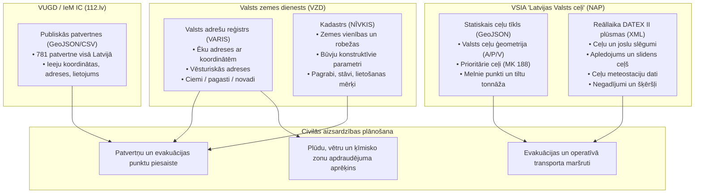

# Civilās aizsardzības atvērto datu avotu katalogs un integrācijas rīki

Šajā mapē apkopoti Latvijas nacionālo reģistru un transporta infrastruktūras atvērtie dati, datu modeļu apraksti, datubāzu shēmas un automatizētās ielādes skripti. Šie avoti nodrošina bāzes slāņus pašvaldību civilās aizsardzības (CA) plānu digitalizācijai, patvertņu ģeokodēšanai un reāllaika risku pārvaldībai.

---

## 1. Pārskats par iekļautajiem datu blokiem



---

## 2. Datu avoti un kur izgūt informāciju

### 2.1. Valsts adrešu reģistrs (VARIS)
- **Atrašanās vieta:** [`avoti/kadastrs/VAR_ATVERTIE_DATI_MODELIS.md`](./kadastrs/VAR_ATVERTIE_DATI_MODELIS.md)
- **Datu turētājs:** Valsts zemes dienests (VZD).
- **CKAN kopa:** `varis-atvertie-dati` ([data.gov.lv saite](https://data.gov.lv/dati/lv/dataset/varis-atvertie-dati))
- **CKAN UUID:** `6b06a7e8-dedf-4705-a47b-2a7c51177473`
- **Formāts un biežums:** CSV (katru dienu); SHP (reizi nedēļā). Licence: CC-BY-4.0.
- **Galvenie faili:**
  - `aw_eka.csv` — visas Latvijas ēku adreses ar koordinātēm (LKS-92 un WGS-84) un statusu;
  - `aw_vesture.csv` — vēsturisko adrešu pieraksti (būtiski veco plānu adrešu sasaistei ar mūsdienām);
  - `aw_iela.csv`, `aw_ciems.csv`, `aw_pagasts.csv`, `aw_pilseta.csv`, `aw_novads.csv` — administratīvā hierarhija.
- **Pielietojums CA plānā:**
  1. CA plānos minēto patvertņu un pulcēšanās vietu precīza ģeokodēšana;
  2. Bīstamo objektu (ķīmija, degviela) ietekmes zonās esošo ēku automātiska identificēšana;
  3. Plūdu riska zonās ietilpstošo mājsaimniecību adrešu atlase.

### 2.2. Nekustamā īpašuma valsts kadastra informācijas sistēma (NĪVKIS)
- **Atrašanās vieta:** [`avoti/kadastrs/NIVKIS_ATVERTIE_DATI_MODELIS.md`](./kadastrs/NIVKIS_ATVERTIE_DATI_MODELIS.md)
- **Datu turētājs:** Valsts zemes dienests (VZD).
- **CKAN kopa:** `kadastra-informacijas-sistemas-atvertie-dati` ([data.gov.lv saite](https://data.gov.lv/dati/lv/dataset/kadastra-informacijas-sistemas-atvertie-dati))
- **CKAN UUID:** `be841486-4af9-4d38-aa14-6502a2ddb517`
- **Formāts un biežums:** XML faili ZIP arhīvos (reizi nedēļā). ES Augstvērtīga datu kopa (HVD).
- **Galvenās struktūras:**
  - `cadastral_designation` (kadastra apzīmējums);
  - Būvju dati: virszemes/pazemes stāvu skaits, ārsienu materiāls, fiziskais nolietojums, ekspluatācijas uzsākšanas gads;
  - Telpu grupu un zemes lietošanas mērķi (klasifikatori).
- **Pielietojums CA plānā:**
  1. Potenciālo patvertņu skrīnings: ēku atlase ar pazemes stāviem (pagrabiem) un dzelzsbetona/mūra konstrukcijām;
  2. Īpašuma piederības pārbaude (pašvaldības, valsts vai privātais sektors) evakuējamo izmitināšanas bāzēm;
  3. Paaugstinātas bīstamības objektu zemes vienību robežu telpiskā analīze.

### 2.3. LVC Nacionālais piekļuves punkts (NAP — transportdata.gov.lv)
- **Atrašanās vieta:** [`avoti/celu-tikls/PUBLISKO_DATU_IESPEJAS.md`](./celu-tikls/PUBLISKO_DATU_IESPEJAS.md) un [`avoti/celu-tikls/PLUSMA.md`](./celu-tikls/PLUSMA.md)
- **Datu turētājs:** VSIA "Latvijas Valsts ceļi" (LVC) ITS direktīvas ietvaros.
- **Kataloga metadati (bez atslēgas):**
  - DCAT/RDF katalogs: `GET https://www.transportdata.gov.lv/api/v1/subscriber/metadata_dcat` (342 KB, 55 datu kopas)
  - Metadatu REST vaicājums: `GET https://www.transportdata.gov.lv/lv/public/metadata/data?dataset_id=<skaitliskais_nid>`
- **Failu lejupielāde un reāllaika plūsmas (bezmaksas abonēšana ar API atslēgu):**
  - Galvene: `x-api-key: <atslega>`
  - Failu saraksts: `GET https://www.transportdata.gov.lv/api/v1/metadata/file/info`
  - Faila saņemšana: `POST https://www.transportdata.gov.lv/api/v1/get/file/download-file` (`{"file_id": "1", "format": "xml"}`)
- **Kritiskās kopas CA vajadzībām:**
  - **Statiskās:**
    - Valsts ceļu tīkls (GeoJSON ar A/P/V klasifikāciju);
    - Prioritārie autoceļi (MK 188 — ziemā uztur un tīra pirmos);
    - Melnie punkti (avāriju koncentrācijas vietas);
    - Masas un gabarītu ierobežojumi (tilti ar kravnesības ierobežojumiem smagajai glābšanas tehnikai un autobusiem);
    - Gājēju ceļi valsts autoceļu tīklā.
  - **Reāllaika DATEX II v3 XML plūsmas:**
    - Ceļu slēgumi un braukšanas joslu slēgumi (tūlītējai apvedceļu maršrutēšanai);
    - Remontdarbi un īslaicīgie satiksmes ierobežojumi;
    - Īslaicīgi slidens ceļš un apledojums (SIC un uzturētāju operatīvie dati);
    - Ceļu meteostaciju reāllaika mērījumi (temperatūra, ceļa virsmas stāvoklis, vēja brāzmas);
    - Negadījumi un šķēršļi uz brauktuves.
- **Pielietojums CA plānā:**
  1. Iedzīvotāju masveida evakuācijas maršrutu plānošana;
  2. Operatīvo dienestu (VUGD, NMPD, VP) piekļuves nodrošināšana katastrofu vietām;
  3. Ziemas vētru un apledojuma radīto risku operatīva uzraudzība.

### 2.4. Latvijas publiskās patvertnes (VUGD / 112.lv / IeM IC)
- **Atrašanās vieta:** [`avoti/patvertnes/README.md`](./patvertnes/README.md)
- **Datu avots:** VUGD un Iekšlietu ministrijas Informācijas centra (IeM IC) oficiālais 112.lv patvertņu serviss.
- **Formāti projektā:**
  - [`avoti/patvertnes/patvertnes_latvija_112.geojson`](./patvertnes/patvertnes_latvija_112.geojson) — ģeotelpiskais slānis;
  - [`avoti/patvertnes/patvertnes_latvija_112.csv`](./patvertnes/patvertnes_latvija_112.csv) — tabulārie dati;
  - [`avoti/patvertnes/patvertnes_latvija_112.json`](./patvertnes/patvertnes_latvija_112.json) — JSON masīvs.
- **Apjoms:** **781 publiskā patvertne** visās 41 Latvijas pašvaldībās ar precīzām ieejas koordinātēm, adresi un ēkas lietošanas veidu.
- **Pielietojums CA plānā:**
  1. Patvertņu gājēju pieejamības izohronu (5, 10, 15 minūtes) aprēķins;
  2. Iedzīvotāju evakuācijas plānošana un patvertņu nepietiekamības zonu noteikšana.

---

## 3. Rīku un datubāzu lietošana

### 3.1. Kadastra un adrešu datubāzes veidošana (`atjaunot.py`)
Atrodas mapē [`avoti/kadastrs/`](./kadastrs/).

```bash
# Pārbaudīt statusu:
uv run --no-project --with httpx --with certifi avoti/kadastrs/atjaunot.py --statuss

# Ielādēt adrešu datus (aw_eka, aw_iela u.c.) un izveidot SQLite skatus:
uv run --no-project --with httpx --with certifi avoti/kadastrs/atjaunot.py

# Ielādēt arī NĪVKIS kadastra datus:
uv run --no-project --with httpx --with certifi avoti/kadastrs/atjaunot.py --nivkis
```

Izveidotā datubāze satur ērtus skatus:
- `v_adrese` — visas aktīvās ēku adreses ar WGS-84/LKS-92 koordinātēm un administratīvo iedalījumu;
- `v_adrese_vesture` — pārdēvēto un vēsturisko adrešu sasaiste ar aktuālajiem kodiem.

### 3.2. Ceļu un DATEX II notikumu datubāze (`datubaze.py`)
Atrodas mapē [`avoti/celu-tikls/`](./celu-tikls/).

```bash
# Izveidot shēmu un pārbaudīt LVC NAP katalogu (bez atslēgas):
uv run --no-project avoti/celu-tikls/datubaze.py buvet

# Sinhronizēt reāllaika un statiskos datus (ja ir dati/nap_atslegas.json):
uv run --no-project avoti/celu-tikls/datubaze.py atjaunot

# Apskatīt aktīvos ceļu slēgumus un meteo datus:
uv run --no-project avoti/celu-tikls/datubaze.py statuss
```

---

## 4. Mapes struktūra un saites uz dokumentāciju

- 🛡️ **Patvertnes:**
  - [`avoti/patvertnes/README.md`](./patvertnes/README.md) — Pilns Latvijas 781 patvertnes apraksts un ArcGIS FeatureServer integrācija.
- 🏢 **Kadastrs un adreses:**
  - [`avoti/kadastrs/VAR_ATVERTIE_DATI_MODELIS.md`](./kadastrs/VAR_ATVERTIE_DATI_MODELIS.md) — Pilna Valsts adrešu reģistra datu lauku specifikācija un tipi.
  - [`avoti/kadastrs/NIVKIS_ATVERTIE_DATI_MODELIS.md`](./kadastrs/NIVKIS_ATVERTIE_DATI_MODELIS.md) — Valsts kadastra teksta datu struktūra, XSD shēmas un klasifikatori.
  - [`avoti/kadastrs/shema.sql`](./kadastrs/shema.sql) — SQLite relāciju shēma ar optimizētiem indeksiem.
- 🛣️ **Ceļu tīkls un satiksme:**
  - [`avoti/celu-tikls/PUBLISKO_DATU_IESPEJAS.md`](./celu-tikls/PUBLISKO_DATU_IESPEJAS.md) — Padziļināta LVC NAP 55 datu kopu un REST/MQTT analīze.
  - [`avoti/celu-tikls/PLUSMA.md`](./celu-tikls/PLUSMA.md) — Datu iegūšanas un periodiskās aktualizēšanas arhitektūra.
- [`avoti/celu-tikls/ABONESANA.txt`](./celu-tikls/ABONESANA.txt) — Soli-pa-solim instrukcija LVC NAP bezmaksas API atslēgu saņemšanai.
- [`avoti/celu-tikls/DOKUMENTACIJA.md`](./celu-tikls/DOKUMENTACIJA.md) — Deklarēto pret reāli piegādāto datu salīdzinājums (melnie punkti, ceļu platums u.c.).
