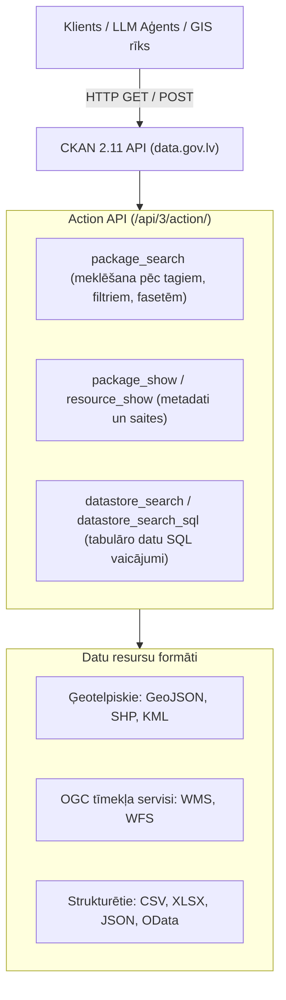

# Atvērtie dati civilās aizsardzības plānošanā: data.gov.lv un CKAN API integrācija

## 1. Ievads un mērķis

Civilās aizsardzības (CA) plāni vēsturiski ir veidoti kā statiski dokumenti (PDF, DOCX), kas tiek aktualizēti reizi vairākos gados. Taču reālajā dzīvē katastrofu riski, iedzīvotāju izvietojums, operatīvā infrastruktūra un hidrometeoroloģiskie apstākļi ir **dinamiski mainīgi**.

Šī pētījuma un rokasgrāmatas mērķis ir:
1. **Analizēt Latvijas Atvērto datu portāla ([data.gov.lv](https://data.gov.lv)) un CKAN 2.11 API** tehniskās iespējas;
2. **Identificēt atvērto datu kopas**, kas jau tiek izmantotas vai kuras nepieciešams integrēt pašvaldību CA plānos;
3. **Piedāvāt konkrētu metodiku CA plānu lapu vizualizāciju automatizācijai** (plūdu kartes, patvertņu pieejamība, bīstamo kravu koridori, iedzīvotāju evakuācija);
4. **Sniegt gatavus programmēšanas piemērus** darbam ar CKAN API nākamajiem izstrādātājiem un LLM aģentiem.

---

## 2. CKAN 2.11 API arhitektūra un datu pieejamības mehānismi

Latvijas Atvērto datu portāls darbojas uz **CKAN** platformas (bāzes URL: `https://data.gov.lv/dati/lv/api/3/`). CKAN 2.11 piedāvā jaudīgu programmēšanas saskarņu (API) kopu:



### 2.1. Galvenie CKAN API galapunkti (*endpoints*):

1. **Datu kopu meklēšana (`package_search`)**:
   - Galapunkts: `GET https://data.gov.lv/dati/lv/api/3/action/package_search`
   - Parametri:
     - `q` — meklēšanas frāze (piem., `q=plūdi`);
     - `fq` — filtrēšanas vaicājums (piem., `fq=organization:vugd AND res_format:GEOJSON`);
     - `rows`, `start` — lapošana;
     - `facet.field` — grupēšana pēc iestādēm, formātiem vai tēmām.
2. **Datu kopas pilno metadatu ieguve (`package_show`)**:
   - Galapunkts: `GET https://data.gov.lv/dati/lv/api/3/action/package_show?id=<dataset-id-vai-slug>`
   - Atgriež: pilnu resursu sarakstu, lejupielādes saites, licences, koordinātu sistēmas un atjaunināšanas laikus.
3. **DataStore API (`datastore_search` un `datastore_search_sql`)**:
   - Ļauj veikt SQL vaicājumus tieši pret CKAN iekšējo PostgreSQL relāciju datubāzi tabulāriem datiem (CSV), neielādējot visu failu atmiņā:
     ```sql
     SELECT * FROM "resource_id" WHERE "pasvaldiba" = 'Rīga' AND "ietilpiba" > 100
     ```
4. **OGC WMS / WFS ģeotelpiskie servisi**:
   - Daudzas valsts iestādes (LVĢMC, VVD, VMD, LĢIA caur ĢEOLatvija.lv) publicē datus kā WMS (karšu attēli) un WFS (vektora ģeometrijas), ko var pa tiešo pieslēgt interaktīvajām kartēm (Leaflet, MapLibre, OpenLayers).

---

## 3. Atvērto datu kopu audits civilajai aizsardzībai

Portālā `data.gov.lv` veiktajā pētījumā tika identificētas **vairāk nekā 300 civilajai aizsardzībai nozīmīgas datu kopas**. Tās iedalāmas 6 tematiskajos blokos:

### 3.1. Operatīvā infrastruktūra un glābšanas spēki

| Datu kopas nosaukums | Iestāde | Formāti | Pielietojums CA plānošanā |
|---|---|---|---|
| **Rīgas valstspilsētas publiskās patvertnes** (`rigas-valstspilsetas-pasvaldibas-teritorija-izvietotas-publiskas-patvertnes`) | Rīgas dome | CSV, JSON | Oficiālo patvertņu adreses, ietilpība, GPS koordinātas. Izmantojams evakuācijas un patveršanās plānos. |
| **Evakuācijas pulcēšanās vietas Rīgā** (`evakuacijas-pulcesanas-vietas`) | Rīgas dome | GeoJSON, CSV | Iedzīvotāju pulcēšanās vietas ārkārtas situācijās pa apkaimēm. |
| **VUGD depo adreses** (`vkcp-igis-vugd-depo-adreses`) | IeM Informācijas centrs | CSV, GeoJSON | Glābšanas dienesta dislokācijas vietas un reaģēšanas laika zonu modelēšana. |
| **Objektu ugunsdrošības stāvokļa novērtējumi** (`objektu-ugunsdrosibas-stavokla-novertejumi`) | VUGD | CSV, XLSX | Paaugstināta riska ēku un objektu stāvokļa analīze. |

### 3.2. Dabas katastrofas: Plūdi un hidrometeoroloģija

| Datu kopas nosaukums | Iestāde | Formāti | Pielietojums CA plānošanā |
|---|---|---|---|
| **Plūdu riska zonas** (`pldu-riska-zonas`, `pldu-riska-zonas-wms`, `...-wfs`) | ĢEOLatvija / LVĢMC | WMS, WFS, SHP | 10%, 2%, 1% un 0,5% varbūtības applūšanas robežas. Plānu plūdu riska karšu bāze. |
| **3. cikla plūdu postījumu vietu un plūdu riska kartes** (`3-cikla-latvijas-pldu-postjumu-vietu-un-pldu-riska-kartes`) | ĢEOLatvija / LVĢMC | WMS, WFS, GeoJSON | Precīzas riska kartes Daugavas, Gaujas, Lielupes un Ventas baseiniem. |
| **Hidrometeoroloģiskie brīdinājumi** (`hidrometeorologiskie-bridinajumi`) | LVĢMC | API, JSON, XML | Operatīvie dzeltenā, oranžā un sarkanā līmeņa brīdinājumi vējam, lietum, salam, tveicei. |
| **Hidroloģiskās prognozes un ūdens līmeņi** (`hidrologiskas-prognozes`) | LVĢMC | JSON, CSV | Reāllaika ūdens līmeņu staciju dati pavasara palu un ledus sastrēgumu vadībai. |

### 3.3. Tehnogēnie un vides apdraudējumi (VVD, PTAC, LVM)

| Datu kopas nosaukums | Iestāde | Formāti | Pielietojums CA plānošanā |
|---|---|---|---|
| **Izsniegtās atļaujas un licences** (`izsniegtas-atlaujas-un-licences`) | Valsts vides dienests (VVD) | CSV, XLSX | A un B kategorijas piesārņojošo darbību operatori, SEVESO objekti, bīstamās ķīmiskās vielas. |
| **Piesārņotās un potenciāli piesārņotās vietas** (`piesrots-un-potencili-piesrots-vietas-wms`) | VVD / ĢEOLatvija | WMS, WFS | Vēsturiskās un aktīvās piesārņojuma vietas (naftas bāzes, pesticīdu noliktavas). |
| **Naftas gāzes balonu uzpildes stacijas** (`naftas-gazes-balonu-uzpildes-stacijas`) | PTAC | CSV | Sašķidrinātās gāzes eksploziju un aizdegšanās riska punkti apdzīvotās vietās. |
| **Meža ugunsbīstamības klašu karte** (`mea-ugunsbstambas-klau-karte-inspire`) | Valsts meža dienests (VMD) | WMS, WFS | Meža masīvu uzliesmojamības zonējums (I–V klase) ugunsbīstamajā periodā. |
| **LVM mežsaimniecības infrastruktūra** (`as-latvijas-valsts-mezi-mezsaimniecibas-infrastruktura`) | AS "Latvijas valsts meži" | SHP | Meža ceļi, caurtekas, tilti — smagās glābšanas tehnikas piekļuve mežu ugunsgrēkos. |
| **LVM mežkopība un ugunsapsardzība** (`as-latvijas-valsts-mezi-mezkopiba-un-ugunsapsardziba`) | AS "Latvijas valsts meži" | SHP | Ugunsnovērošanas torņi un ugunsdzēsības ūdensņemšanas vietas mežos. |

### 3.4. Ģeotelpiskie bāzes dati un kadastrs (VZD, LĢIA)

Detalizēta modeļu specifikācija, SQL shēma un automatizētās ielādes rīki atrodami projektā: [`avoti/kadastrs/`](../avoti/kadastrs/).

| Datu kopas nosaukums | Iestāde | Formāti | Pielietojums CA plānošanā |
|---|---|---|---|
| **Valsts adrešu reģistra atvērtie dati (VARIS)** (`varis-atvertie-dati`) | Valsts zemes dienests (VZD) | CSV (dienas), SHP (nedēļas) | Visas Latvijas ēkas, adreses un koordinātas. Apraksts: [`VAR_ATVERTIE_DATI_MODELIS.md`](../avoti/kadastrs/VAR_ATVERTIE_DATI_MODELIS.md); ielādes rīks: [`atjaunot.py`](../avoti/kadastrs/atjaunot.py). |
| **Kadastra informācijas sistēmas atvērtie teksta dati (NĪVKIS)** (`kadastra-informacijas-sistemas-atvertie-dati`) | Valsts zemes dienests (VZD) | XML (ZIP), nedēļas (HVD) | Zemes vienības, būves, stāvu skaits, pazemes stāvi (pagrabi patvertnēm), būvmateriāli. Apraksts: [`NIVKIS_ATVERTIE_DATI_MODELIS.md`](../avoti/kadastrs/NIVKIS_ATVERTIE_DATI_MODELIS.md). |
| **Administratīvo teritoriju un teritoriālā iedalījuma vienību robežas** | VZD | SHP, GeoJSON | Novadu, pagastu un valstspilsētu oficiālās robežas. |
| **Reljefa virsmas modelis (LiDAR DEM)** | LĢIA | GeoTIFF, WMS | Zemes nogruvumu, erozijas un plūdu straumes modelēšana upju ielejās un gravās. |

### 3.5. Transports, ceļi un reāllaika satiksmes drošība (LVC NAP, IeM IC)

Detalizēta 55 datu kopu analīze, DATEX II plūsmas un sinhronizators atrodami: [`avoti/celu-tikls/`](../avoti/celu-tikls/).

| Datu kopas nosaukums | Iestāde | Formāti | Pielietojums CA plānošanā |
|---|---|---|---|
| **LVC Nacionālais piekļuves punkts (NAP - transportdata.gov.lv)** | AS "Latvijas Valsts ceļi" | GeoJSON, DATEX II v3 XML | 55 datu kopas: valsts ceļu tīkls (A/P/V), prioritārie ceļi (MK 188), tiltu tonnāža/gabarīti, kā arī reāllaika ceļu/joslu slēgumi, apledojums, remontdarbi un meteostaciju sensori. Apraksts: [`PUBLISKO_DATU_IESPEJAS.md`](../avoti/celu-tikls/PUBLISKO_DATU_IESPEJAS.md); rīks: [`datubaze.py`](../avoti/celu-tikls/datubaze.py). |
| **Melnie punkti (avāriju koncentrācijas vietas)** | LVC / lvceli.lv | XLSX, CSV | Posmi ar paaugstinātu negadījumu skaitu — apdraudējuma zonas evakuācijas kolonnām. Koordinātu atvasināšana: [`skripti/melnie_punkti_slanis.py`](../avoti/celu-tikls/skripti/melnie_punkti_slanis.py). |
| **Ceļu satiksmes negadījumu notikuma vietu dati** (`giswebcais`) | IeM Informācijas centrs | CSV | Detalizēta policijas reģistrēto negadījumu vēsture un riska faktori. |
| **Rīgas Satiksme sabiedriskā transporta maršruti** (`marsrutu-saraksti-rigas-satiksme...`) | Rīgas satiksme | GTFS (TXT), CSV | Masveida iedzīvotāju evakuācijas transporta jaudas aprēķins. |

### 3.6. Iedzīvotāji un demogrāfiskais slogs (CSP, PMLP)

| Datu kopas nosaukums | Iestāde | Formāti | Pielietojums CA plānošanā |
|---|---|---|---|
| **Iedzīvotāju skaits 1x1 km un 100x100 m režģveida tīklā** | Centrālā statistikas pārvalde (CSP) | CSV, GeoJSON | **Kritisks rīks**: Ļauj precīzi noteikt iedzīvotāju skaitu katastrofas zonā (piem., 500 m rādiusā ap avāriju). |
| **Iedzīvotāju skaits pašvaldībās un pagastos** (`latvijas-iedzivotaju-skaits-pasvaldibas`) | PMLP | CSV, XLSX | Oficiālais deklarēto iedzīvotāju skaits plāna 1. nodaļas teritoriālajam raksturojumam. |
| **Iedzīvotāju vecuma struktūra un sociālās grupas** | CSP | CSV | Senioru un bērnu īpatsvars — prioritārās evakuācijas plānošanai. |

### 3.7. Civilās aizsardzības infrastruktūra un patvertnes (VUGD, IeM IC)

Pilns apraksts un iegūtie datu faili: [`avoti/patvertnes/`](../avoti/patvertnes/).

| Datu kopas nosaukums | Iestāde | Formāti | Pielietojums CA plānošanā |
|---|---|---|---|
| **Latvijas publisko patvertņu vienotais reģistrs** (`112.lv`) | VUGD / IeM Informācijas centrs | GeoJSON, CSV, JSON (ArcGIS REST) | Visas 781 oficiāli apsekotās publiskās patvertnes Latvijā ar ieejas durvju koordinātēm, adresi un ēkas funkciju. |
| **Rīgas patvertņu un drošo vietu saraksts** | Rīgas valstspilsēta | GeoJSON, CSV | Rīgas pilsētas paplašinātais patvertņu un pazemes būvju slānis. |

---

## 4. Kā atvērtie dati transformē konkrētu CA plānu lapu vizualizācijas

Salīdzinot ar pašreizējiem statiskajiem plāniem, kur attēli ir zemas izšķirtspējas skenējumi vai diagrammu ekrānuzņēmumi, atvērtie dati ļauj izveidot **automatizētas, interaktīvas un vienmēr aktuālas lapu vizualizācijas**:

### 4.1. 1. nodaļa: Teritorijas apraksts un iedzīvotāju blīvums
- **Problēma šobrīd**: Plānos ir statiskas novada kartes no 2021. gada ar aptuveniem iedzīvotāju skaitļiem pa pagastiem.
- **Risinājums ar atvērtajiem datiem**:
  - Datu avoti: VZD robežas + CSP 1x1 km iedzīvotāju režģis + PMLP dati.
  - Vizualizācija: Iedzīvotāju blīvuma siltumkarte (*choropleth / heatmap*), kur skaidri redzami blīvi apdzīvotie centri un mazapdzīvotās mežu teritorijas.

### 4.2. 3. nodaļa: Plūdu riska kartes un applūstošās teritorijas
- **Problēma šobrīd**: Pielikumos ielīmētas JPG bildes no 2010. gada palu fotogrāfijām bez precīzas piesaistes adresēm.
- **Risinājums ar atvērtajiem datiem**:
  - Datu avoti: LVĢMC 3. cikla plūdu riska WMS/WFS (10%, 2%, 1%, 0.5%) + VZD kadastra būves + CSP 100m režģis.
  - Vizualizācija: Daudzlīmeņu interaktīva plūdu karte. Algoritms automātiski aprēķina:
    - Cik dzīvojamo ēku atrodas 10% (10 gados reizi) plūdu zonā;
    - Cik iedzīvotāju pakļauti tiešam applūšanas riskam;
    - Kuri vietējie ceļi tiek nošķirti no satiksmes.

### 4.3. 3. nodaļa: Bīstamo ķīmisko vielu (SEVESO) un gāzes vadu avārijas
- **Problēma šobrīd**: Tekstā minēts uzņēmuma nosaukums un adrese, bet nav telpiskās ietekmes modeļa.
- **Risinājums ar atvērtajiem datiem**:
  - Datu avoti: VVD atļaujas (`izsniegtas-atlaujas-un-licences`) + PTAC gāzes stacijas + VZD VARIS adreses.
  - Vizualizācija: Apdraudējuma buferzonu karte (100 m — letālā zona, 500 m — smagu bojājumu zona, 1500 m — toksiskā mākoņa izplatība). Sistēma automātiski atlasa visas skolas, bērnudārzus un pansionātus šajā rādiusā.

### 4.4. 6. nodaļa: Evakuācijas plānošana un patvertnes
- **Problēma šobrīd**: Evakuācijas maršruti aprakstīti vispārīgi tekstā ("pa autoceļu A2"), bet patvertņu saraksti ir novecojuši.
- **Risinājums ar atvērtajiem datiem**:
  - Datu avoti: Rīgas / pašvaldību patvertņu atvērtie dati + LVC autoceļu tīkls + IeM IC melnie punkti (`giswebcais`).
  - Vizualizācija:
    1. **Patvertņu pieejamības izohronas**: 5, 10 un 15 minūšu gājiena attāluma zonas no dzīvojamajiem masīviem līdz tuvākajai patvertnei.
    2. **Drošie evakuācijas koridori**: Maršruti, kas apiet applūstošos ceļu posmus, slēgtos dzelzceļa pārbrauktuves posmus un bīstamos satiksmes mezglus.

---

## 5. Praktiski CKAN API programmēšanas piemēri

Šos koda paraugus var tieši izmantot datu inženieri un automatizētie aģenti.

### 5.1. Datu kopu meklēšana pēc atslēgvārda un formāta

```python
import urllib.request
import urllib.parse
import json

def search_ckan_datasets(query: str, res_format: str = "GEOJSON"):
    base_url = "https://data.gov.lv/dati/lv/api/3/action/package_search"
    params = {
        "q": query,
        "fq": f"res_format:{res_format}",
        "rows": 10
    }
    url = f"{base_url}?{urllib.parse.urlencode(params)}"
    req = urllib.request.Request(url, headers={"User-Agent": "CivilProtectionAgent/1.0"})
    
    with urllib.request.urlopen(req) as response:
        data = json.loads(response.read().decode("utf-8"))
        if data.get("success"):
            for pkg in data["result"]["results"]:
                print(f"Nosaukums: {pkg['title']}")
                print(f"Iestāde:   {pkg.get('organization', {}).get('title')}")
                for res in pkg.get("resources", []):
                    print(f"  -> Resurss: {res['name']} ({res['format']}): {res['url']}")

# Meklēt plūdu datus GeoJSON formātā
search_ckan_datasets("plūdi", "GEOJSON")
```

### 5.2. Tabulāro datu vaicāšana ar DataStore API (patvertņu filtrēšana)

```python
import urllib.request
import urllib.parse
import json

def query_shelters_by_capacity(resource_id: str, min_capacity: int = 50):
    url = "https://data.gov.lv/dati/lv/api/3/action/datastore_search_sql"
    sql = f'SELECT * FROM "{resource_id}" WHERE "ietilpiba"::int >= {min_capacity} LIMIT 20'
    params = {"sql": sql}
    
    encoded_url = f"{url}?{urllib.parse.urlencode(params)}"
    req = urllib.request.Request(encoded_url, headers={"User-Agent": "CivilProtectionAgent/1.0"})
    
    with urllib.request.urlopen(req) as resp:
        res = json.loads(resp.read().decode("utf-8"))
        records = res["result"]["records"]
        print(f"Atrastas {len(records)} patvertnes ar ietilpību >= {min_capacity}:")
        for r in records:
            print(f"- {r.get('adrese')}: ietilpība {r.get('ietilpiba')} cilv. (GPS: {r.get('lat')}, {r.get('lon')})")
```

### 5.3. OGC WMS plūdu karšu slāņa integrācija interaktīvā kartē (Leaflet HTML)

```html
<!DOCTYPE html>
<html>
<head>
    <title>Civilās aizsardzības plūdu un patvertņu operatīvā karte</title>
    <link rel="stylesheet" href="https://unpkg.com/leaflet@1.9.4/dist/leaflet.css" />
    <script src="https://unpkg.com/leaflet@1.9.4/dist/leaflet.js"></script>
    <style>#map { height: 100vh; width: 100%; }</style>
</head>
<body>
    <div id="map"></div>
    <script>
        var map = L.map('map').setView([56.95, 24.11], 11);
        
        // Bāzes OpenStreetMap slānis
        L.tileLayer('https://{s}.tile.openstreetmap.org/{z}/{x}/{y}.png').addTo(map);

        // LVĢMC Plūdu riska zonu WMS serviss no data.gov.lv / ĢEOLatvija
        var floodWMS = L.tileLayer.wms('https://geolatvija.lv/geoserver/wms', {
            layers: 'pludu_riska_zonas_10',
            format: 'image/png',
            transparent: true,
            opacity: 0.6,
            attribution: 'LVĢMC / ĢEOLatvija'
        }).addTo(map);
    </script>
</body>
</html>
```

---

## 6. Secinājumi un rekomendācijas civilās aizsardzības modernizācijai

1. **Pāreja no statiskiem uz dinamiskiem CA plāniem**:
   Pašvaldībām un VARAM jāvirzās uz CA plānu datu modeli, kurā statiskās tabulas un kartes tiek aizstātas ar tiešām saitēm un vaicājumiem pret `data.gov.lv` atvērtajiem datiem.
2. **Kritisko datu trūkums (ko nepieciešams atvērt vai standartizēt)**:
   - Valsts mēroga patvertņu vienotais ģeotelpiskais reģistrs kā oficiāla atvērto datu kopa `data.gov.lv` (šajā projektā šis trūkums tika atrisināts, izgūstot un strukturējot **781 publisko patvertni** no IeM IC / VUGD oficiālā servisa `112.lv` un ievietojot [`avoti/patvertnes/`](../avoti/patvertnes/));
   - Ugunsdzēsības hidrantu tīkls ar spiediena parametriem visā valstī;
   - Evakuācijas izmitināšanas telpu ietilpība pašvaldību griezumā.
3. **Mākslīgā intelekta un LLM aģentu loma**:
   LLM aģenti, izmantojot CKAN API, var automātiski veikt pašvaldību CA plānu ikgadējo auditu — salīdzināt plānā minētos riskus ar jaunākajiem VVD piesārņojošo objektu datiem, LVĢMC plūdu modeļiem un CSP iedzīvotāju skaita izmaiņām, automātiski ģenerējot priekšlikumus domes lēmumiem.

---

## 7. Projektā integrētie datu avoti un izstrādātie rīki

Pilnai datu integrācijai un lokālajai analīzei projekta mapē [`avoti/`](../avoti/) ir pieejama gatava infrastruktūra:

- 📑 **Datu avotu ceļvedis:** [`avoti/README.md`](../avoti/README.md)
- 🛡️ **Latvijas publisko patvertņu vienotā datubāze (VUGD / 112.lv):** [`avoti/patvertnes/`](../avoti/patvertnes/)
  - [`patvertnes_latvija_112.geojson`](../avoti/patvertnes/patvertnes_latvija_112.geojson) (visi 781 publisko patvertņu punkti WGS-84 koordinātās ar adresēm un ieejām);
  - [`patvertnes_latvija_112.csv`](../avoti/patvertnes/patvertnes_latvija_112.csv) (tabulārais formāts Excel un DB importam);
  - [`patvertnes_latvija_112.json`](../avoti/patvertnes/patvertnes_latvija_112.json) (JSON formāts tīmekļa API);
  - [`README.md`](../avoti/patvertnes/README.md) (datu specifikācija, ArcGIS endpoints un atjaunošanas skripts).
- 🏢 **Valsts zemes dienesta kadastrs un adreses:** [`avoti/kadastrs/`](../avoti/kadastrs/)
  - [`VAR_ATVERTIE_DATI_MODELIS.md`](../avoti/kadastrs/VAR_ATVERTIE_DATI_MODELIS.md) (Valsts adrešu reģistrs, shēma, relācijas);
  - [`NIVKIS_ATVERTIE_DATI_MODELIS.md`](../avoti/kadastrs/NIVKIS_ATVERTIE_DATI_MODELIS.md) (NĪVKIS kadastrs, ēku parametri, pagrabi);
  - [`atjaunot.py`](../avoti/kadastrs/atjaunot.py) (automatizētais VZD datu lejupielādētājs un SQLite bāzes veidotājs);
  - [`shema.sql`](../avoti/kadastrs/shema.sql) (relāciju shēma ar `v_adrese` un `v_adrese_vesture`).
- 🛣️ **VSIA "Latvijas Valsts ceļi" Nacionālais piekļuves punkts:** [`avoti/celu-tikls/`](../avoti/celu-tikls/)
  - [`PUBLISKO_DATU_IESPEJAS.md`](../avoti/celu-tikls/PUBLISKO_DATU_IESPEJAS.md) (55 NAP datu kopas, REST/MQTT API, reāllaika DATEX II);
  - [`PLUSMA.md`](../avoti/celu-tikls/PLUSMA.md) (datu ievākšanas cikli un sinhronizācijas loģika);
  - [`ABONESANA.txt`](../avoti/celu-tikls/ABONESANA.txt) (instrukcija bezmaksas LVC NAP API atslēgu saņemšanai);
  - [`datubaze.py`](../avoti/celu-tikls/datubaze.py) (LVC ceļu tīkla un DATEX II reāllaika notikumu dzinējs);
  - [`db_shema.sql`](../avoti/celu-tikls/db_shema.sql) (ceļu posmu, punktu un reāllaika brīdinājumu SQL shēma).
