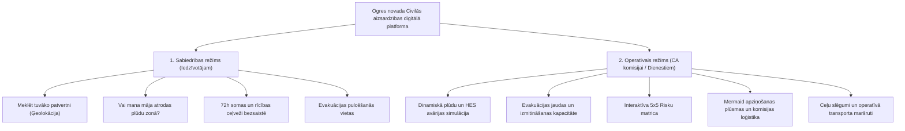

# Ogres novada civilās aizsardzības plāna interaktīvās HTML versijas koncepcija un arhitektūras plāns

Šis dokuments nosaka prasības, datu avotu sasaisti, funkcionālo arhitektūru un lietotāja saskarnes (UI/UX) uzbūvi Ogres novada sadarbības teritorijas civilās aizsardzības plāna transformācijai no 179 lappušu statiska dokumenta uz **mūsdienīgu, interaktīvu Web-GIS vadības un sabiedrības informēšanas portālu**.

---

## 1. Esošās informācijas un datu audita kopsavilkums

### 1.1. Esošā Ogres CA plāna bāze (Markdown)
- **Avots**: Ogres novada pašvaldības domes 30.03.2023. lēmums Nr. 34 (prot. Nr. 3).
- **Apjoms**: 179 lappuses, ~290 000 rakstzīmju, 71 lappuse ar vizuāliem elementiem.
- **MK noteikumu Nr. 658 atbilstība**: Pilna 10 nodaļu un 8 pielikumu struktūra.
- **Kritiskie tabulārie dati ar koordinātēm**:
  - **26. tabula**: 19 evakuācijas pulcēšanās vietas ar nosaukumiem, adresēm un koordinātēm. *Būtiska atziņa*: automatizētā ģeotelpiskā pārbaude atklāja **drukas kļūdas oficiālajā domes apstiprinātajā dokumentā** (piemēram, Meņģeles filiālei norādīts Lon `23.825` pie Dobeles/Jelgavas 100 km ārpus novada, Tomes un Rembates koordinātas sajauktas). Interaktīvajā platformā koordinātas tika automātiski validētas un koriģētas pret VZD adrešu reģistru.
  - **27. tabula**: 11 evakuācijas izmitināšanas centri ar WGS-84 koordinātēm, telpu sadalījumu, kopējo ietilpību (>6 500 personām), ēdināšanas pieejamību un guļvietu skaitu.
  - **23. tabula**: 5x5 Katastrofu risku matrica (augstākie riski: Ogres upes pali/ledus sastrēgumi, ēku ugunsgrēki, epidēmijas, Daugavas HES kaskādes hidrotehnisko būvju pārrāvums).
  - **8. pielikums**: 14 ārkārtas situāciju rīcības ceļveži iedzīvotājiem (trauksmes sirēnas, 72h soma, plūdi, ķīmiskās avārijas, vētras, elektroapgādes pārtraukumi u.c.).
- **Problēma oriģinālā**:
  - 16 lappuses (32.–47. lpp.) aizņem statiskas, zemas izšķirtspējas rastra kartes (kopskats, Ogresgals, Norupīte, Ciemupe, dārzkopības kooperatīvi);
  - Apziņošanas shēmas un komisijas sadarbības algoritmi ir zemas kvalitātes attēli vai teksta saraksti.

### 1.2. Integrējamie atvērtie dati un ģeotelpiskie resursi

| Datu kopa / Serviss | Iestāde | Datu formāts | Pielietojums Ogres HTML risinājumā |
|---|---|---|---|
| **Latvijas publisko patvertņu vienotais reģistrs** (`avoti/patvertnes/`) | IeM IC / VUGD (`112.lv`) | GeoJSON, CSV | **31 oficiāla patvertne Ogres novadā** (Ogre, Ķegums, Ikšķile, Lielvārde, Suntaži, Birzgale u.c.) ar durvju koordinātēm un ēkas funkciju. |
| **Plūdu riska un applūstošo teritoriju WMS** | LVĢMC / ĢEOLatvija | WMS (`pludu_riska_zonas_10`, `100`, `200`) | Dinamiska slāņu pārslēgšana 10 gadu (10%), 100 gadu (1%) un 200 gadu (0.5%) varbūtībām pār Ogres upi un Daugavu. |
| **Hidroloģiskās prognozes un ūdens līmeņi** | LVĢMC | JSON / REST | Reāllaika līmenis Ogres novērojumu stacijā (LAS m) ar kritisko brīdinājuma atzīmi **22.15 m LAS**. |
| **Valsts adrešu reģistrs (VARIS)** | VZD | SQLite (`v_adrese`) | Precīza ēku un adrešu meklēšana, iedzīvotāju piesaiste apdraudētajām zonām. |
| **Nekustamā īpašuma kadastrs (NĪVKIS)** | VZD | SQLite (`buve`, `zemes_vieniba`) | Ēku stāvu skaits, materiāls, **pazemes stāvu (pagrabu) esamība** potenciālo patvertņu paplašināšanai. |
| **Valsts autoceļu tīkls un reāllaika dati** | LVC NAP (`transportdata.gov.lv`) | GeoJSON, DATEX II | Autoceļi (A6, P80, P4, P5, P8), tiltu tonnāža un gabarīti, satiksmes ierobežojumi evakuācijas maršrutiem. |
| **Melnie punkti (avāriju koncentrācija)** | LVC | GeoJSON punkts | Bīstamie ceļu mezgli uz A6 un P80 evakuācijas kolonnu risku vadībai. |
| **Bīstamo kravu dzelzceļa koridors** | LDz / VUGD | Vektora līnija | Rīgas–Krustpils dzelzceļa līnija ar 500 m un 1000 m bīstamās ķīmiskās noplūdes buferzonām. |
| **Ogres novada administratīvā robeža** | VZD / LĢIA | GeoJSON poligons | Novada un pagastu robežu iezīmēšana kartē. |

---

## 2. Lietotnes Koncepcija un Mērķauditorija

Tīmekļa lietotne tiek veidota kā **divu līmeņu adaptīvs instruments**:

---

## 3. Saskarnes (UI/UX) uzbūve un Komponentes

Lietotne tiek veidota kā **viena patstāvīga HTML5 lietotne (Single Page Application)**, kas spēj pilnvērtīgi funkcionēt lokāli (`file://`) vai pašvaldības serverī.

### 3.1. Augšējā josla un ātrā navigācija (Header & Control Bar)
- **Logotips un nosaukums**: Ogres novada ģerbonis + "Civilās aizsardzības interaktīvais plāns".
- **Ārkārtas trauksmes josla**: Aktuālais brīdinājuma statuss (Zaļš = Mierīgs; Dzeltens = Paaugstināta gatavība; Sarkans = Ārkārtas situācija).
- **Reāllaika sensors**: Ogres upes pašreizējais ūdens līmenis (LAS m) pret kritisko atzīmi (22.15 m).
- **Galvenās izvēlnes cilnes**:
  1. 🗺️ **Interaktīvā drošības karte**
  2. 📊 **Risku matrica un katastrofu scenāriji**
  3. 🛡️ **Patvertnes un patveršanās vietas**
  4. 🚶 **Evakuācija un izmitināšana**
  5. 🔔 **Agrīnā brīdināšana un komisija**
  6. 🎒 **Iedzīvotāju 72h rīcības ceļvedis**
  7. 📖 **Pilns plāna teksts (MK 658 nodaļas)**

---

### 3.2. Modulis 1: Interaktīvā GIS Karte (Leaflet.js dzinējs)

Kartes logs aizņem vizuāli dominējošu daļu ar slāņu pārslēgu labajā pusē:

1. **Bāzes kartes**:
   - OpenStreetMap (standarta);
   - Satelītkarte (ESRI World Imagery);
   - Reljefa / topogrāfiskā karte (LĢIA / OpenTopoMap).
2. **Ģeotelpiskie slāņi (Toggleable Layers)**:
   - 🔴 **Ogres novada robeža**: Vektora kontūra ar kaimiņu novadu piesaisti;
   - 🛡️ **Publiskās patvertnes (31)**: Ikonas ar atšķirīgiem simboliem (skola, administratīvā ēka, kultūras nams). Klikšķinot — adrese, durvju foto/komentārs, attālums;
   - 🌊 **LVĢMC Plūdu riska zonas**:
     - *10% (10 gadi)* — oranžs caurspīdīgs laukums;
     - *1% (100 gadi)* — gaiši zils laukums;
     - *0.5% (200 gadi)* — tumši zils laukums;
     - *Aizsargdambji un polderi* — zaļas aizsarglīnijas (Ogre-1, Ogre-2, Ciemupes sūkņu stacija);
   - 🚶 **Evakuācijas pulcēšanās punkti (19)**: Zilas marķieru ikonas ar numuriem no 26. tabulas;
   - 🏠 **Izmitināšanas centri (11)**: Zaļas bāzes ikonas ar ietilpības joslu diagrammu (piem., *Ogres 1. vsk.: 1000 vietas, ēdnīca: IR*);
   - ⚠️ **Bīstamie objekti un transporta koridori**:
     - Dzelzceļa līnija Rīga–Krustpils ar 500 m ķīmiskās bīstamības koridoru;
     - LVC Melnie punkti un valsts ceļu tīkls (A6, P80);
     - Ķeguma un Rīgas HES ietekmes zonas Daugavā.
3. **Kartes interaktīvie rīki**:
   - 📍 **"Atrast manu atrašanās vietu"**: Noteikt tuvāko patvertni un evakuācijas punktu ar aprēķinātu attālumu metros;
   - 🔍 **Adrešu meklētājs**: Ievadot Ogres novada adresi, karte automātiski pietuvina un pārbauda applūstamības un patvertnes distanci;
   - 📏 **Attāluma mērītājs un bīstamības rādiusa zīmētājs**.

---

### 3.3. Modulis 2: Dinamiskā Risku Matrica (3.4. sadaļa)

Statiskā 23. tabula tiek pārvērsta par **interaktīvu matricu**:
- 5x5 režģis ar oficiālajiem MK 658 un Ogres novada krāsu kodiem (Zaļš = Zems; Dzeltens = Vidējs; Oranžs = Augsts; Sarkans = Ļoti augsts);
- Katrā šūnā ievietoti Ogres apdraudējumi (Plūdi, Dzelzceļa avārija, HES pārrāvums, Meža ugunsgrēki, Vētra utt.);
- **Interaktivitāte**:
  - Uzklikšķinot uz riska (piemēram, *"Plūdi, pali"*):
    - Labajā pusē atveras detalizēts riska profils: cēloņi, iesaistītās iestādes (Pašvaldība, VUGD), preventīvie soļi;
    - Karte automātiski aktivizē attiecīgo slāni (LVĢMC plūdu WMS).

---

### 3.4. Modulis 3: Apziņošanas un Vadības Shēmas (Mermaid.js)

Aizstāj statiskos zīmējumus no 1. pielikuma ar dinamiskām Mermaid diagrammām:
- **Agrīnā brīdināšana**: No LVĢMC/VUGD brīdinājuma saņemšanas līdz iedzīvotāju sirēnām un SMS;
- **Komisijas sasaukšana**: Pašvaldības domes priekšsēdētājs -> CA komisijas locekļi -> Operacionālais vadības centrs;
- **Shēmu režīmi**: Klikšķinot uz atbildīgā amata, tiek parādīts viņa tālrunis un atbildības joma no plāna teksta.

---

### 3.5. Modulis 4: Iedzīvotāju 72h Rokasgrāmata (8. pielikums)

Izstrādāta maksimālai lietojamībai krīzes brīdī viedtālrunī:
- 14 vizuālas kartītes ar ikonām:
  1. *Trauksmes sirēnas darbība*
  2. *72h ārkārtas soma (interaktīvs čeklists ar atzīmēšanas ķekšiem)*
  3. *Plūdu draudi un rīcība applūšanas laikā*
  4. *Ķīmisko vielu un gāzes noplūde*
  5. *Vētra un elektroapgādes zudums*
  6. *Ugunsgrēks mājoklī*
  7. *Karstuma un sala viļņi*
  8. *Pirmā palīdzība un dežūrdienestu tālruņi*
- **"Drukas režīms" (`Print CSS`)**: Ļauj ar vienu klikšķi izdrukāt kompaktu A4 lapu ar svarīgākajiem Ogres novada kontaktiem un pulcēšanās vietām novietošanai pie ledusskapja.

---

## 4. Tehnoloģiju steks un Izstrādes standarti

1. **HTML5 / CSS3 / JavaScript (ES6+)**: Tīrs, neatkarīgs frontend kods bez sarežģītiem karkasiem (nav nepieciešams `npm build`), nodrošinot maksimālu ilgmūžību un atvēršanu bez atkarībām.
2. **Kartogrāfija**:
   - `Leaflet.js` v1.9.4 (viegls, stabils, mobilajām ierīcēm optimizēts karšu dzinējs);
   - `Leaflet.markercluster` (punktu grupēšanai pārskatāmā mērogā);
   - Tiešie WMS pieprasījumi pret LVĢMC / ĢEOLatvija ģeoserveriem.
3. **Diagrammas**:
   - `Mermaid.js` v10 (teksta diagrammu reāllaika SVG renderēšana pārlūkā).
4. **Stils un Tipogrāfija**:
   - Moderns dizains (iedvesmojoties no valsts pārvaldes vienotā dizaina sistēmas un Tailwind CSS principiem);
   - Pilns atbalsts gaišajam un tumšajam režīmam (kritiskām situācijām naktī vai pie vāja apgaismojuma);
   - *WCAG 2.1 AA* pieejamības vadlīniju ievērošana (augsts kontrasts, salasāmi fonti, ekrāna lasītāju atbalsts).

---

## 5. Datu failu sagatavošanas un izveides soļi

| Solis | Darbība | Rezultāta fails |
| :---: |---|---|
| **1.** | Izvilkt Ogres novada patvertņu datus no `patvertnes_latvija_112.geojson` | `avoti/patvertnes/ogre_patvertnes.geojson` |
| **2.** | Strukturēt 26. un 27. tabulas evakuācijas punktus un centrus vienotā GeoJSON | `avoti/evakuacija/ogre_evakuacija.geojson` |
| **3.** | Piesaistīt Ogres novada robežu no `robeza_novads.geojson` | Iegults lietotnē |
| **4.** | Izstrādāt vienoto interaktīvo HTML5 lietotni ar kartēm un pilnu tekstu | `prototips/ogre/index.html` vai `civilas-aizsardzibas-plani/ogre_plans.html` |
| **5.** | Veikt saskarnes un WMS slāņu darbības testēšanu pārlūkā | Validācijas pārskats |

---

Šis plāns nodrošina, ka Ogres novads kļūst par valsts mēroga etalonu digitālo civilās aizsardzības plānu ieviešanā Latvijā.
