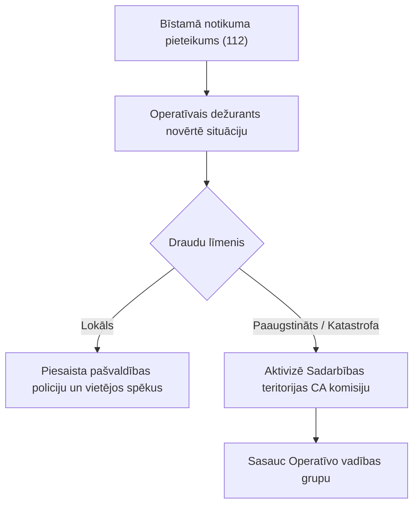

# Uzdevums LLM: vienas pašvaldības civilās aizsardzības plāna konvertēšana uz Markdown

> **Lietošana**: aizstāj `{{SLUG}}` ar pašvaldības mapes nosaukumu (piem. `siguldas-novads`, `riga`, `adazu-novads`) un
> `{{PASVALDIBA}}` ar oficiālo nosaukumu (piem. `Siguldas novads`, `Rīgas valstspilsēta`). Pārējo tekstu iedod LLM nemainītu.
> Uzdevums ir paredzēts LLM ar failu lasīšanas, komandrindas (CLI) un PDF lapu vizuālās apskates iespējām.
> Šis dokuments apkopo labāko praksi, strukturālos standartus un metodiskās atziņas, kas gūtas apjomīgu un sarežģītu pašvaldību plānu (piem., Rīgas un Ādažu) digitalizācijā.

---

## 1. Loma un mērķis

Tu esi dokumentu digitalizācijas, datu inženierijas un civilās aizsardzības (CA) jomas eksperts. Tev jāpārvērš pašvaldības **{{PASVALDIBA}}** civilās aizsardzības plāna oriģinālfaili par precīziem, pilnīgiem un izcili strukturētiem Markdown failiem.

**Galvenie principi:**
1. **0% informācijas zuduma**: Viss vizuālais un nestrukturētais saturs (rīcības shēmas, kartes, KLA risku koki, diagrammas, skenētas tabulas, risku matricas, formulas) ir vai nu pilnībā jāatveido strukturētā mašīnlasāmā formā (Mermaid, Markdown tabula, LaTeX), vai detalizēti un izsmeļoši jāapraksta.
2. **100% faktu un teksta integritāte**: Tu nedrīksti izdomāt, pārfrāzēt, patvaļīgi saīsināt vai izlaist oriģināla saturu, skaitļus, amatpersonu pienākumus un juridiskās norādes.
3. **Pielietojamība nākotnes AI sistēmās**: Gala rezultāts tiks izmantots visu Latvijas pašvaldību CA plānu analīzei, RAG (Retrieval-Augmented Generation) meklēšanai un operatīvo lēmumu atbalsta rīkiem.

---

## 2. Ievade un failu arhitektūra

- **Oriģinālie faili**: `originali/{{SLUG}}/`
  - `faili.json` — katra faila metadati (nosaukums, formāts, avota URL, sha256, apraksts).
  - `AVOTS.md` — kur plāns publicēts, apstiprināšanas lēmums un datums, ierobežotas pieejamības daļas.
  - Paši faili (PDF pamatdokuments, DOCX/ODT atsevišķi pielikumi, XLSX saraksti, lielformāta kartes). **Oriģinālos failus nedrīkst modificēt!**

- **Versiju mantojuma (lineage) un pielikumu pārbaude**:
  - Ja mapē ir atsevišķi vēsturiski pielikumi (piemēram, DOCX faili no iepriekšējām redakcijām), obligāti pārbaudi, vai jaunākajā pamatdokumentā (PDF) šis saturs nav integrēts kā cits pielikums (piemēram, Rīgas plānā 2021. gada 4. pielikuma DOCX fails jaunajā 2024. gada plānā ir integrēts kā 27. pielikums).
  - Ja saturs dublējas, abiem failiem jānodrošina vienota, pilnīga un sinhronizēta Markdown reprezentācija.

- **Palīgrīki (komandrindā)**:
  - Automātiskā konvertācija (ja pieejama): `uv run --project tools tools/convert.py "originali/{{SLUG}}/<fails>" --slug {{SLUG}}`
  - Lapu vizuālā apskate (PyMuPDF): `uv run --with pymupdf python -c "import fitz; doc=fitz.open('originali/{{SLUG}}/<fails>.pdf'); doc[<lpp-1>].get_pixmap(dpi=150).save('scratch/page_<lpp>.png')"`
  - Markdown tekstā vizuāli bagātās lapas sākotnēji tiek atzīmētas ar bloku `> **[VIZUĀLI ELEMENTI lpp. N ...]**`.

---

## 3. Izvade (mapē `markdown/{{SLUG}}/`)

Mape `markdown/{{SLUG}}/` jāsatur:

1. **Viens `.md` fails katram oriģinālfailam** ar identisku pamatnosaukumu (`plans.pdf` → `plans.md`, `3-pielikums-karte.pdf` → `3-pielikums-karte.md`).
2. **`STRUKTURA.md`** — visaptverošs plāna strukturālais audits un kartējums pret Ministru kabineta noteikumu Nr. 658 10 obligātajām sadaļām (skat. specifikāciju 7. nodaļā).
3. **`ATZINAS.md`** — metodiskā un tehniskā rokasgrāmata nākamajiem aģentiem un analītiķiem (apkopojot dokumentu kopsakarības, ArcGIS dešifrēšanas atziņas, datu anomālijas un konvertācijas konveijeru).

Ja fails ir identisks (`sha256`) citas pašvaldības jau konvertētam failam (kopīgs sadarbības teritorijas plāns), nekonvertē to vēlreiz, bet failā un `STRUKTURA.md` ievieto skaidru norādi uz partnera mapi.

---

## 4. Markdown faila standarts (obligāts)

Katram Markdown failam jāsākas ar YAML galveni (`frontmatter`):

```markdown
---
pasvaldiba_slug: {{SLUG}}
originals: <faila nosaukums ar paplašinājumu>
originala_formats: pdf | docx | xlsx | ...
originala_sha256: <no faili.json>
avota_url: <no faili.json vai AVOTS.md>
konvertets: <YYYY-MM-DD>
konvertesanas_riks: <rīks vai "LLM vizuāla transkripcija ar PyMuPDF">
lpp: <lapu skaits>
vizuali_apskatitas_lpp: <cik lapas pārbaudītas vizuāli kā attēli>
pilniba: pilns | dalejs   # "dalejs" tikai ar skaidru pamatojumu un izlaisto daļu uzskaiti
---
# <Dokumenta pilns nosaukums no titullapas>

<!-- lpp. 1 -->
... lapas saturs ...

<!-- lpp. 2 -->
...
```

### Formatēšanas prasības:
- **Lapu marķieri**: `<!-- lpp. N -->` obligāti jāievieto pirms katras PDF lapas satura. Tos nedrīkst dzēst! DOCX failos bez fiksētām lapām marķieri nav nepieciešami.
- **Virsrakstu hierarhija**:
  - `#` — tikai galvenajam dokumenta nosaukumam titullapā.
  - `##` — nodaļām (I, II, 1., 2. u.tml.).
  - `###` — apakšnodaļām (1.1., 1.2. u.tml.).
  - `####` — mazākām apakšnodaļām (1.1.1., 1.1.2.).
  - Saglabā oriģinālo numerāciju virsrakstos. Tabulu nosaukumus neformē kā virsrakstus, bet gan kā treknrakstu pirms tabulas (piem., `**1.1. tabula. Teritorijas raksturojums**`).
- **Tabulas**:
  - Standarta Markdown tabulas ar galveni (`| Kolonna 1 | Kolonna 2 |` un `|---|---|`).
  - Vairāklapu tabulas apvieno vienā nepārtrauktā tabulā.
  - Apvienotajām šūnām vērtību atkārto katrā rindā.
  - Ja tabulai ir ļoti liels kolonnu skaits (>12), to sadala loģiskos blokos un pievieno paskaidrojošu piezīmi.
- **Saraksti**: Saglabā oriģinālo numerāciju (1., a), •, -).
- **Teksta integritāte**: Pārnesumus rindu beigās savieno vienā vārdā. Atkārtojošās kājenes, galvenes un lapu numurus teksta vidū izņem. Nesalasāmas vietas atzīmē kā `[nesalasāms]`.
- **Ierobežotās pieejamības sadaļas**: Atzīmē ar bloku: `> *[Pielikums Nr. X — ierobežota pieejamība, nav publicēts]*`.
- **Matemātiskās formulas**: Obligāti jāatveido LaTeX sintaksē ($$...$$ brīvstāvošām formulām un $...$ tekstā), piemēram:
  $$R_{\text{tehn.}} = \lambda \cdot P \cdot S$$
  Formula nedrīkst palikt kā sašķelti grieķu burti vai nesakarīgas teksta rindas!

---

## 5. Vizuālo un specializēto elementu apstrāde (galvenā prasība)

Standarta PDF teksta vilkšanas rīki nekad neatveido attēlus un vektoru shēmas. **Tev pašam obligāti jāpārbauda lapas kā attēli**:
- Katra lapa no `vizualas_lapas` saraksta;
- Titullapa un satura rādītājs;
- Vismaz katra 10. lapa (lai pārliecinātos, ka tabulas un teksta kolonnas nav saplūdušas);
- Katra vieta, kur pamattekstā ir atsauce uz attēlu, shēmu, karti vai matricu.

Katru vizuālo elementu ievieto precīzi tā oriģinālajā atrašanās vietā pie atbilstošā `<!-- lpp. N -->` marķiera:

```markdown
> **Shēma (lpp. 28): 3.1. shēma. Pašvaldības un glābšanas dienestu reaģēšanas algoritms**
> Tips: lēmumu pieņemšanas un operatīvās vadības shēma. Avots: 3. nodaļa.



> Skaidrojums: Shēma nosaka secīgu dienestu un amatpersonu iesaisti katastrofas draudu gadījumā...
```

### Detalizēta instrukcija pa vizuālo elementu tipiem:

| Tips | Prasības un atveides veids |
|---|---|
| **Blokshēmas, vadības struktūras, apziņošanas plūsmas, rīcības algoritmi** | **Mermaid** (`flowchart TD`, `flowchart LR`, `sequenceDiagram`). Saglabā visus bloku tekstus, lēmumu zarus un tālruņu/kanālu norādes. Mezglu tekstus vienmēr liec pēdiņās `["..."]`, lai iekavas un pieturzīmes nesalauztu sintaksi. Pievieno 2–4 teikumu skaidrojumu. |
| **Kļūdu koki un atteiču analīze (KLA / Fault Tree Analysis)** | **Mermaid koku shēmas + strukturēti cēloņu saraksti**. Skaidri izcel loģiskos vārtus (OR vārti — atteicei pietiek ar 1 cēloni; AND vārti — nepieciešama apstākļu sakritība). Ja kokā ir numurēti cēloņi (piem., 55 atteices faktori), izveido detalizētu numurētu sarakstu vai tabulu ar visiem cēloņiem. |
| **Tabulas, kas oriģinālā ir attēli (skenētas vai iekopētas)** | Pārraksti kā pilnvērtīgas Markdown tabulas ar precīzām skaitliskajām vērtībām un mērvienībām. |
| **Risku matricas (5×5) un siltumkartes** | Pārveido Markdown tabulā, atspoguļojot varbūtības (1–5) un seku (1–5) asis, katras šūnas saturu un atsevišķu riska līmeņu leģendu (Zems, Vidējs, Būtisks, Augsts, Katastrofāls). |
| **Meteoroloģisko brīdinājumu kritēriji (LVĢMC)** | Tabulas ar konkrētiem skaitliskajiem sliekšņiem un mērvienībām visiem trim līmeņiem: **Dzeltenais** (potenciāli bīstami), **Oranžais** (ļoti bīstami), **Sarkanais** (ekstrēmi bīstami) — vējam (m/s), nokrišņiem (mm/h, mm/12h), sniegam (cm), salam/karstumam (°C). |
| **Militārie un sprādzienbīstamie priekšmeti (NBS/VUGD instrukcijas)** | Strukturēts tehniskais katalogs: priekšmeta tips (pretkājnieku mīnas PMF-1, POM-2, OZM, MON-50; prettanku mīna TM-62M; artilērijas šāviņi; ISB), sprāgstvielas masa, bīstamības rādiuss metros un rīcības noteikumi. |
| **Bīstamo kravu (ADR) un radiācijas marķējumi** | Izklāsts par bīstamības klasēm, radiācijas aizsardzības pamatprincipiem (Laiks, Attālums, Aizsargbarjeras), jonizējošā starojuma veidu ($\alpha, \beta, \gamma, n$) caurspiešanās spēju un transporta iepakojuma kategorijām (I-White, II-Yellow, III-Yellow) ar transporta indeksiem. |
| **Kartes pamatdokumenta tekstā** | Izsmeļošs apraksts: attēlotā teritorija (pagasti, apkaimes, ūdenstilpes), mērogs, leģendas simboli, iezīmētās riska zonas (plūdu robežas 10%, 2%, 1%, 0.5%, gāzes vadu aizsargjoslas, SEVESO uzņēmumu ietekmes rādiusi). Ja kartē ir numurēti objekti — izveido to tabulu. |
| **Lielformāta GIS / CAD vektorkartes (atsevišķi PDF pielikumi)** | Skatīt speciālās prasības 6. nodaļā. |
| **Matemātiskās formulas un riska aprēķini** | LaTeX sintakse ($$...$$) ar pilnu mainīgo atšifrējumu zem formulas. |
| **Foto, logo, ģerboņi, dekoratīvi attēli** | Viena rinda: `*[attēls: fotogrāfija / ģerbonis: ...]*`. |

---

## 6. Lielformāta GIS un CAD vektorkaršu digitalizācijas metodika

Pašvaldību plāniem bieži ir pievienotas lielformāta kartes (piemēram, ArcGIS Pro izstrādāts 1:10 000 mēroga PDF, $2100 \times 2100\text{ mm}$). Parastie teksta ekstraktori šādās kartēs sagurst, un simbolu leģenda pārvēršas par nesalasāmiem simbolu fontu glifiem (`$ % & ' ( )`).

Šādam karšu failam Markdown formātā (`<kartes-fails>.md`) jāietver:

1. **Kartogrāfiskie un tehniskie metadati**:
   - Kartes pilns nosaukums, mērogs (piem., `1:10 000 — 1 cm kartē = 100 m dabā`);
   - Lapas fiziskie izmēri (platums × augstums mm);
   - Koordinātu sistēma: LKS-92 TM (Latvijas koordinātu sistēma 1992, Transverse Mercator / EPSG:3059);
   - Izstrādes programmatūra (piem., ArcGIS Pro) un izstrādātājs.
2. **Datu slāņu katalogs (sadalīts 5 funkcionālajās grupās)**:
   - *1. Apdraudējumi un riska avoti*: SEVESO objekti, A un B kategorijas piesārņojošās vietas, maģistrālie gāzes vadi, degvielas uzpildes stacijas, dzelzceļa mezgli;
   - *2. Hidroloģiskie un dabas apdraudējumi*: Plūdu riska zonas (10%, 2%, 1%, 0,5% varbūtības applūšanas robežas), vēja un vējuzplūdu teritorijas;
   - *3. Glābšanas un operatīvā infrastruktūra*: VUGD daļas un posteņi, Valsts un pašvaldības policijas iecirkņi, NMPD punkti, stacionārās ārstniecības iestādes, ugunsdzēsības ūdensņemšanas vietas;
   - *4. Iedzīvotāju evakuācija un patveršanās*: Oficiālās patvertnes un pielāgojamās būves, pulcēšanās vietas, evakuācijas maģistrālie maršruti;
   - *5. Bāzes topogrāfiskais slānis*: Administratīvās robežas, pagastu/apkaimju robežas, ielu un ceļu tīkls, hidrogrāfija, apbūve un mežu masīvi.
3. **Datu sniedzēju un autortiesību tabula**:
   - Visi kartē izmantotie datu avoti (VUGD, VVD, LGIA, LVĢMC, pašvaldības iestādes, inženiertīklu turētāji).

---

## 7. `STRUKTURA.md` standarts (10 obligātās sadaļas)

Failam `STRUKTURA.md` obligāti jābūt latviešu valodā un jāaptver šādas 10 sadaļas:

1. **Dokumenta identitāte**:
   - Pilns nosaukums, pašvaldība, sadarbības teritorija un kaimiņu komisijas;
   - Izstrādātājs, apstiprināšanas lēmums, datums un vēsturiskie grozījumi;
   - Lapu skaits, failu skaits un oficiālais publicēšanas avots (URL).
2. **Failu atbilstība**:
   - Tabula: `Oriģinālais fails | Markdown fails | Apjoms / Lpp. | Kvalitāte | Piezīmes un veiktie uzlabojumi`.
3. **Pilns nodaļu koks**:
   - Visu nodaļu un apakšnodaļu hierarhisks saraksts ar lappušu norādēm un 1–3 teikumu satura kopsavilkumu.
4. **Atbilstība Ministru kabineta noteikumu Nr. 658 prasībām (10 obligātie punkti)**:
   - *9.1. Sadarbības teritorijas apraksts un raksturojums*;
   - *9.2. Katastrofu risku novērtējums (dabas, tehnogēnās, militārās/sabiedriskās)*;
   - *9.3. Preventīvie pasākumi*;
   - *9.4. Gatavības pasākumi*;
   - *9.5. Reaģēšanas un seku likvidēšanas pasākumi*;
   - *9.6. Sadarbības teritorijas civilās aizsardzības komisija (sastāvs, uzdevumi)*;
   - *9.7. Agrīnās brīdināšanas un apziņošanas kārtība (trauksmes sirēnas, mediji, lietotne 112)*;
   - *9.8. Evakuācijas pasākumi (maršruti, pulcēšanās vietas, izmitināšana)*;
   - *9.9. Resursi un to piesaiste (cilvēkresursi, tehnika, materiālās rezerves)*;
   - *9.10. Plāna pielikumi un kartogrāfiskais materiāls*.
5. **Riska scenāriju un matricu saraksts**:
   - Nosaukums, nodaļa, lappuse, riska līmenis (augsts, vidējs, zems).
6. **Visu tabulu audits**:
   - Numurs, nosaukums, lappuse, kolonnu skaits, datu tips.
7. **Visu vizuālo elementu audits**:
   - Numurs, tips (Mermaid shēma / risku koks / tabula-attēls / karte / formula), lappuse, kā atveidots.
8. **Pielikumu saraksts**:
   - Numurs, nosaukums, statuss (publisks / ierobežota pieejamība), atbilstošais fails.
9. **Strukturētie dati un operatīvie resursi**:
   - Kontaktinformācija, vadības centri, glābšanas dienestu depo, patvertņu saraksti, evakuācijas vietas, inženiertīklu avārijas dienesti.
10. **Konvertēšanas kvalitātes un integritātes kopsavilkums**:
    - Vizuāli pārbaudīto lapu skaits, novērstās kļūdas, matemātisko formulu skaits, atlikušās problēmas.

---

## 8. `ATZINAS.md` standarts (metodiskā rokasgrāmata nākamajiem aģentiem)

Apjomīgām un sarežģītām pašvaldībām (īpaši valstspilsētām vai novadiem ar daudziem pielikumiem un kartēm) obligāti jāizveido `ATZINAS.md`, kurā iekļauj:
1. **Datu avotu kopsakarības un arhitektūru** (shēma ar failu plūsmu no `originali/` uz `markdown/`);
2. **Sākotnējās konvertācijas defektu analīzi** (kas tika pazaudēts naivajā teksta ekstrakcijā);
3. **Vizuālo elementu semantiskās rekonstrukcijas metodiku** (kā konkrēti tika atkodēti sarežģītie elementi);
4. **ArcGIS un CAD lielformāta karšu dešifrēšanas paņēmienus**;
5. **Tehniskos knifus konkrētajā CLI vidē** (Python komandas, bibliotēkas, encoding, regulāro izteiksmju drošība);
6. **10 soļu kvalitātes kontroles kontrolsarakstu**.

---

## 9. Tehniskie norādījumi un izpildes komandas (Windows & Python vide)

Nākamajam aģentam, strādājot sistēmā ar CLI piekļuvi, jāņem vērā šādas tehniskās prasības:

### 9.1. Python komandu izpilde ar `uv`
- Parastā `python` komanda Windows vidē bieži ir Microsoft Store saite. Vienmēr izmanto `uv`:
  ```powershell
  uv run python <skripts.py>
  uv run --with pymupdf python <skripts.py>
  uv run --with python-docx python <skripts.py>
  ```

### 9.2. Windows konsoles UTF-8 kodējums
- Windows PowerShell noklusējuma kodējums (`cp1252`) izsauc `UnicodeEncodeError`, mēģinot izdrukāt latviešu burtus (ā, č, ē, ģ, ī, ķ, ļ, ņ, š, ū, ž).
- Katra Python skripta sākumā obligāti jārekonfigurē standarta izvade:
  ```python
  import sys
  sys.stdout.reconfigure(encoding='utf-8')
  sys.stderr.reconfigure(encoding='utf-8')
  ```

### 9.3. Droša teksta aizvietošana ar LaTeX formulām
- Standarta Python `re.sub(pattern, repl, text)` uztver slīpsvītras (`\lambda`, `\le`) kā escape sekvences un avarē ar kļūdu `re.error: bad escape \l`.
- Vienmēr izmanto lambda funkciju aizvietotājā:
  ```python
  text = re.sub(pattern, lambda match: replacement_content, text)
  ```

### 9.4. Lapas renderēšana vizuālajai pārbaudei
- Ātra konkrētas PDF lapas eksportēšana uz PNG attēlu:
  ```python
  import fitz
  doc = fitz.open("dokuments.pdf")
  page = doc[lpp_numurs - 1]
  pix = page.get_pixmap(dpi=150)
  pix.save("scratch/lapa.png")
  ```

---

## 10. Aizliegts

- **Izdomāt, minēt vai "uzlabot" oriģinālos datus**: nekādu izdomātu tālruņu, adrešu, personu vārdu vai risku novērtējuma punktu.
- **Pārfrāzēt vai saīsināt oriģināla tekstu** (izņemot vizuālo elementu aprakstus, kas ir tavi).
- **Atstāt nepārbaudītus blokus**: nedrīkst atstāt frāzes `*[attēls izlaists]*`, `[attēls]`, `VIZUĀLI ELEMENTI`.
- **Izlaist pielikumus vai nodaļas**: ja pielikums ir ar ierobežotu pieejamību, tam jābūt skaidri atzīmētam.
- **Modificēt failus mapē `originali/`**: oriģinālie dati ir neaizskarami.

---

## 11. Pašpārbaudes kontrolsaraksts pirms darba nodošanas

Pirms uzskatīt uzdevumu par pabeigtu, aģentam jāveic šāda 12 punktu pārbaude:

- [ ] 1. Katram failam no `originali/{{SLUG}}/` mapē `markdown/{{SLUG}}/` ir izveidots atbilstošs `.md` fails ar pareizu YAML galveni.
- [ ] 2. Pamatdokumentā nav palicis neviens `*[attēls izlaists]*` vai `> **[VIZUĀLI ELEMENTI ... ]**` bloks.
- [ ] 3. Visi procesuālie algoritmi un vadības shēmas ir atveidotas korektā Mermaid sintaksē ar pēdiņās ievietotiem tekstiem `["..."]`.
- [ ] 4. KLA risku koki atspoguļo loģiskos AND/OR vārtus un satur pilnu numurētu atteices cēloņu sarakstu.
- [ ] 5. Visas aprēķinu formulas ir noformētas korektā LaTeX pierakstā ($$...$$).
- [ ] 6. Meteoroloģiskie un bīstamības kritēriji satur konkrētus skaitliskos sliekšņus un mērvienības.
- [ ] 7. Militārā munīcija un bīstamie priekšmeti ir aprakstīti tehniskā atpazīšanas katalogā.
- [ ] 8. Lielformāta GIS vektorkartēm (ArcGIS) ir izveidots pilns 5 grupu slāņu katalogs, koordinātu sistēma un mērogs.
- [ ] 9. Virsrakstu hierarhija ir stingri konsekventa (`#`, `##`, `###`), un tabulu nosaukumi ir izcelti treknrakstā.
- [ ] 10. `STRUKTURA.md` satur visas 10 obligātās sadaļas atbilstoši MK noteikumiem Nr. 658 un pilnu pielikumu auditu.
- [ ] 11. Sarežģītiem plāniem ir izveidots `ATZINAS.md` ar arhitektūras un tehniskajām atziņām nākamajiem aģentiem.
- [ ] 12. Visi failu iekšējie ceļi un savstarpējās atsauces ir noformētas kā klikšķināmas saites.

---

## 12. Nobeiguma atskaites forma

Pabeidzot darbu, lietotājam jāsniedz konspektīvs kopsavilkums:
1. Apstrādāto failu tabula (oriģināls → markdown, apjoms lpp., kvalitāte);
2. Vizuāli apskatīto un atkodēto lapu skaits;
3. Rekonstruēto vizuālo elementu kopsavilkums (Mermaid shēmas, risku koki, tabulas, formulas, kartes);
4. `STRUKTURA.md` un `ATZINAS.md` izveides apstiprinājums;
5. Klikšķināmas saites (`file:///...`) uz visiem jaunizveidotajiem un labotajiem failiem.
