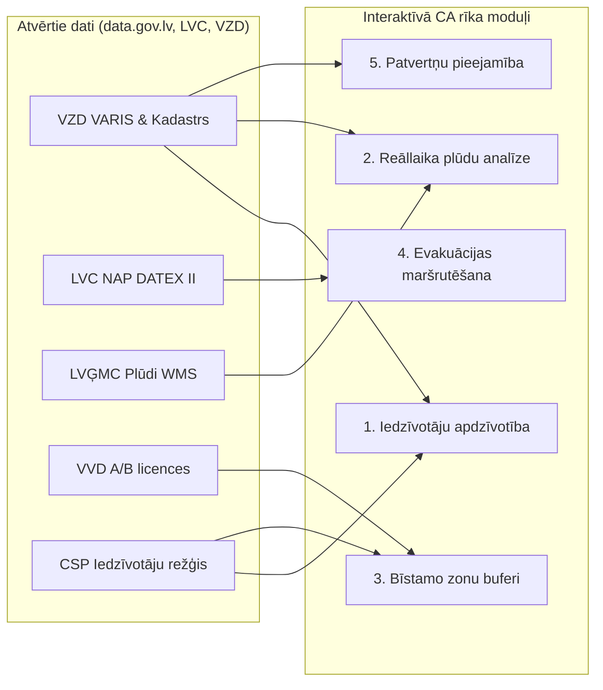

# Civilās aizsardzības plānu vizuālā rekonstrukcija un atvērto datu integrācijas arhitektūra

Šis dokuments apkopo metodoloģiju, sasniegtos rezultātus un nākotnes rīka tehnisko specifikāciju visu 41 Latvijas pašvaldības civilās aizsardzības (CA) plānu vizuālo elementu rekonstrukcijai un to aizstāšanai/papildināšanai ar mašīnlasāmiem atvērtajiem datiem.

---

## 1. Vizuālās rekonstrukcijas standarts un kvalitātes līmenis

Pārejā no statiskiem PDF uz mašīnlasāmu Markdown tiek ievērots **Rīgas un Ādažu kvalitātes zelta standarts**:

1. **Apziņošanas shēmas un rīcības algoritmi** → Rekonstruēti kā `mermaid` koda bloki (`flowchart TD` vai `flowchart LR`). Tie nodrošina skaidru lēmumu pieņemšanas, informācijas plūsmu un atbildīgo institūciju hierarhiju bez pikseļu kropļojumiem.
2. **Kvalitatīvās risku novērtēšanas matricas (5x5)** → Pārveidotas par strukturētām Markdown tabulām ar varbūtības (V1–V5) un seku smaguma (S1–S5) asīm, precīzi saglabājot visus risku identifikatorus un pievienojot ietekmes kritēriju sliekšņus (cietušie, zaudējumi, evakuētie).
3. **Avāriju attīstības scenāriji un koki** → Pārveidoti hierarhiskās Mermaid shēmās, parādot noplūdes, uzliesmojuma, sprādziena vai toksiskā mākoņa zarojumus.
4. **Kartogrāfiskie materiāli un telpiskās shēmas** → Papildināti ar strukturētu ģeotelpisko aprakstu, robežām un **tiešām norādēm uz atvērto datu slāņiem** (LVĢMC, VZD, LVC, VVD), lai tos nākotnē aizstātu ar interaktīvām vektoru un rastra kartēm.

---

## 2. Nacionālais statuss: Vadošo pilsētu rekonstrukcija

Šajā posmā prioritāri veikta vizuālo elementu atkodēšana un transformācija Latvijas lielākajos administratīvajos centros un sadarbības teritorijās:

### 2.1. Jūrmalas valstspilsēta
- **Fails:** [`markdown/jurmala/N001_pielikums_apzinosanas_kartiba.md`](../markdown/jurmala/N001_pielikums_apzinosanas_kartiba.md)
- **Rekonstruētais elements:** Civilās aizsardzības komisijas (CAK) apziņošanas kārtības blokshēma (lēmuma pieņemšana → sekretariāts → VUGD 4. daļa, Bulduru postenis, pašvaldības policija, Jūrmalas slimnīca, Zemessardzes 17. bataljons).
- **Formatējums:** Mermaid `flowchart TD` + trauksmes SMS/balss paziņojumu paraugi + VZD VARIS ēkas piesaiste (Jomas iela 1/5).

### 2.2. Daugavpils valstspilsēta un Augšdaugavas novads
- **Fails:** [`markdown/daugavpils/317_lem_public-v001.md`](../markdown/daugavpils/317_lem_public-v001.md)
- **Rekonstruētie elementi:**
  1. **Apziņošanas shēma (lpp. 148):** Mermaid `flowchart TD`, aptverot ziņojumu saņemšanu, vadības lēmumu un apziņošanu caur pašvaldības policiju un izpildsekretāru. Fiksētas pulcēšanās vietas sakaru pārrāvuma gadījumā: K. Valdemāra ielā 1 un Rīgas ielā 2.
  2. **Sadarbības teritorijas risku matrica (lpp. 128–129):** Vienota 5x5 tabula ar V1–V5 varbūtībām un S1–S5 seku līmeņiem, detalizējot Augsta riska zonā Daugavas plūdus un epidēmijas, Vidējā riska zonā inženiertīklus un būvju sabrukumu.

### 2.3. Jelgavas valstspilsēta
- **Fails:** [`markdown/jelgava/12_5_pielikums2_Jelgavas_valstspilsetas_CA_plans.md`](../markdown/jelgava/12_5_pielikums2_Jelgavas_valstspilsetas_CA_plans.md)
- **Rekonstruētais elements:** Jelgavas pilsētas teritorijas risku matrica (lpp. 115–116).
- **Formatējums:** Strukturēta Markdown matrica + 6 kvantitatīvo seku kritēriju sliekšņu tabula (ievainotie, bojāgājušie, materiālie zaudējumi, kaitējums videi, saslimstība, evakuētie).

### 2.4. Jelgavas novads
- **Fails:** [`markdown/jelgava/12_5_pielikums3_Jelgavas_novada_CA_plans.md`](../markdown/jelgava/12_5_pielikums3_Jelgavas_novada_CA_plans.md)
- **Rekonstruētais elements:** 26. tabula (lpp. 86–87) — Jelgavas novada teritorijas risku matrica.
- **Formatējums:** Strukturēta matrica ar Lielupes/Svētes baseina polderu plūdu, vētru un lauksaimniecības epizootiju riska profiliem.

### 2.5. Liepājas valstspilsēta un Dienvidkurzemes novads
- **Fails:** [`markdown/liepaja/Liepajas-DKN-ST-CAP_2023ATJ.md`](../markdown/liepaja/Liepajas-DKN-ST-CAP_2023ATJ.md)
- **Rekonstruētais elements:** Liepājas un DKN ST risku matrica (lpp. 128–129).
- **Formatējums:** Strukturēta matrica, izceļot ostas ķīmisko kravu noplūdes, kuģu avāriju un piekrastes vētru/vējuzplūdu specifiku.

### 2.6. Valmieras novads
- **Fails:** [`markdown/valmieras-novads/140_lem_Pielikums_Civilas-aizsardzibas-plans-aktializets28.03.2024._publisks.md`](../markdown/valmieras-novads/140_lem_Pielikums_Civilas-aizsardzibas-plans-aktializets28.03.2024._publisks.md)
- **Rekonstruētais elements:** Valmieras novada risku matrica (lpp. 138–139).
- **Formatējums:** Strukturēta matrica ar Gaujas pavasara palu, Seda purva ugunsgrēku un dzelzceļa tranzīta apdraudējumu klasifikāciju.

---

## 3. Visu 41 pašvaldības vizuālo marķieru inventarizācija

Kopumā valsts CA plānos tika fiksēti **1 800 vizuālie marķieri**. Liela daļa no tiem ir statiskas kartes, kuru vietā interaktīvajā rīkā tiks pieslēgti WMS/WFS servisi:

| Pašvaldība | Kopējie marķieri | Statuss un galvenie vizuālie elementi |
| :--- | :---: | :--- |
| **Ādažu novads** | **0** | **100% rekonstruēts** (Mermaid shēmas, scenāriju koki). |
| **Rīga** | **2** | **99% rekonstruēts** (analītiskais un strukturālais modelis). |
| **Daugavpils** | **179** | Apziņošana un risku matrica rekonstruēta; atlikušas apkaimju un hidro-kartes. |
| **Jelgava** | **163** | Pilsētas risku matrica rekonstruēta; polderu un plūdu karšu slāņi. |
| **Jelgavas novads** | **82** | Novada risku matrica rekonstruēta; pagastu plūdu un ceļu kartes. |
| **Liepāja** | **134** | Sadarbības teritorijas matrica rekonstruēta; ostas un ezera kartes. |
| **Valmieras novads** | **104** | Risku matrica rekonstruēta; Gaujas ielejas un purvu kartes. |
| **Jūrmala** | **38** | Apziņošana rekonstruēta; Lielupes un piekrastes applūšanas kartes. |
| **Olaines novads** | **103** | Ķīmisko rūpniecības zonu kartes un evakuācijas maršruti. |
| **Mārupes novads** | **100** | Lidostas "Rīga" piegulošās zonas un ceļu tīkla kartes. |
| **Saulkrastu novads** | **88** | Piejūras mežu ugunsbīstamības un A1 šosejas risku kartes. |
| **Salaspils novads** | **74** | Daugavas HES ietekmes un bīstamo kravu dzelzceļa kartes. |
| **Ogres novads** | **73** | Ogres upes un Daugavas palu kartes, aizsargdambju shēmas. |
| **Talsu novads** | **64** | Rojas/Mērsraga ostas un piekrastes teritoriju kartes. |
| **Preiļu novads** | **58** | Pašvaldības teritorijas un inženiertīklu kartes. |
| **Alūksnes novads** | **52** | Pierobežas infrastruktūras un mežu masīvu kartes. |
| **Kuldīgas novads** | **49** | Ventas rumbas un vecpilsētas plūdu riska kartes. |
| **Ķekavas novads** | **46** | Daugavas lejteces un Rīgas apvedceļa A5 satiksmes kartes. |
| **Smiltenes novads** | **43** | Hidrotehnisko būvju un ceļu infrastruktūras shēmas. |
| **Cēsu novads** | **40** | Gaujas Nacionālā parka reljefa un nogruvumu riska kartes. |
| **Aizkraukles novads**| **40** | Pļaviņu HES un applūstošo teritoriju hidromezgla shēmas. |
| **Ropažu novads** | **37** | Garkalnes mežu un Stopiņu rūpniecisko zonu kartes. |
| **Līvānu novads** | **26** | Dubnas un Daugavas sateces plūdu kartes. |
| **Gulbenes novads** | **24** | Mežu ugunsapsardzības un vietējo ceļu kartes. |
| **Rēzekne** | **23** | Pilsētas centra un Rēzeknes upes hidroloģiskās shēmas. |
| **Siguldas novads** | **19** | Gaujas senlejas erozijas un tūrisma infrastruktūras kartes. |
| **Limbažu novads** | **18** | Piekrastes un ezeru hidrotehnisko būvju shēmas. |
| **Ludzas novads** | **14** | Pierobežas kontroles un dzelzceļa mezgla kartes. |
| **Valkas novads** | **14** | Valkas–Valgas pārrobežas sadarbības un glābšanas shēmas. |
| **Krāslavas novads** | **13** | Daugavas loku un pierobežas mežu kartes. |
| **Bauskas novads** | **10** | Mūsas un Mēmeles sateces plūdu shēmas. |
| **Saldus novads** | **10** | Rūpniecisko objektu un satiksmes mezglu shēmas. |
| **Balvu novads** | **8** | Ziemeļlatgales purvu un meliorācijas sistēmu kartes. |
| **Tukuma novads** | **3** | Engures ezera un piekrastes shēmas. |
| **Dienvidkurzemes n.**| **0** | Apvienots ar Liepājas ST plānu. |
| **Dobeles novads** | **0** | Teksta formāts pilnībā sakārtots. |
| **Jēkabpils novads** | **0** | Teksta formāts sakārtots; Daugavas dambji. |
| **Madonas novads** | **0** | Teksta formāts sakārtots. |
| **Rēzeknes novads** | **0** | Apvienots ar Rēzeknes ST plānu. |
| **Ventspils** | **0** | Teksta formāts sakārtots. |

---

## 4. Atvērto datu validācijas un aizstāšanas matrica (CA plānu nodaļu griezumā)

Šī matrica kalpo par **tehnisko uzdevumu un arhitektūras pamatu nākotnes interaktīvajam rīkam**:



### 4.1. Plāna 1. nodaļa: Pašvaldības teritorijas un iedzīvotāju raksturojums
- **Šobrīd plānos:** Statisks teksts un PDF kartes ar pagastu iedzīvotāju skaitu no 2021./2022. gada.
- **Validācija ar atvērtajiem datiem:**
  - `latvijas-iedzivotaju-skaits-pasvaldibas` (PMLP dienas/mēneša griezumā);
  - **CSP 1x1 km un 100x100 m iedzīvotāju režģis**: Ļauj redzēt reālo cilvēku izvietojumu telpā, nevis formālo pagasta centru;
  - **VZD administratīvās robežas**: Oficiālā ATR ģeometrija.
- **Interaktīvā rīka funkcija:** Dinamisks iedzīvotāju blīvuma slānis (*choropleth / heatmap*) ar slīdni pēc vecuma grupām (bērni, seniori evakuācijas prioritātēm).

### 4.2. Plāna 2. nodaļa: Katastrofu pārvaldīšanas koordinēšana un apziņošana
- **Šobrīd plānos:** Statiski telefonu saraksti, no kuriem liela daļa noveco jau 6 mēnešu laikā.
- **Validācija ar atvērtajiem datiem:**
  - VZD Valsts adrešu reģistrs ([VARIS](../avoti/kadastrs/VAR_ATVERTIE_DATI_MODELIS.md)): pulcēšanās vietu un alternatīvo vadības punktu precīzas koordinātas;
  - VUGD depo un posteņu atvērtie dati: glābšanas dienestu bāzes vietas.
- **Interaktīvā rīka funkcija:** Automatizēta apziņošanas ķēžu simulācija ar klikšķināmiem zvaniem/SMS vārtejām un operatīvās gatavības atskaitēm reāllaikā.

### 4.3. Plāna 3. nodaļa: Risku novērtēšana un risku matricas
- **Šobrīd plānos:** Ekspertu subjektīvs vērtējums 5x5 tabulās bez sasaistes ar datiem.
- **Validācija ar atvērtajiem datiem:**
  - **Plūdi:** LVĢMC 3. cikla WMS/WFS (`pludu_riska_zonas_10`, `1`, `0.5`) — automātiska pārbaude, vai plānā norādītās applūstošās vietas sakrīt ar jaunākajiem hidroloģiskajiem modeļiem;
  - **Ugunsgrēki:** VMD meža ugunsbīstamības klases (I–V) un LVM infrastruktūra;
  - **Bīstamās ķīmiskās vielas:** VVD piesārņojošo darbību reģistrs (`izsniegtas-atlaujas-un-licences`) un PTAC LPG stacijas — pārbaude, vai plānā nav aizmirsts kāds jaunizveidots SEVESO objekts;
  - **Satiksmes negadījumi:** IeM IC `giswebcais` un LVC melnie punkti.
- **Interaktīvā rīka funkcija:** Dinamiska risku pārrēķināšana — ja pašvaldībā atver jaunu ķīmisko ražotni vai mainās klimata dati, matricas šūna automātiski maina krāsu un brīdina CAK.

### 4.4. Plāna 4. nodaļa: Preventīvie, gatavības un reaģēšanas pasākumi
- **Šobrīd plānos:** Statiskas tabulas ar atbildīgajām iestādēm.
- **Validācija ar atvērtajiem datiem:**
  - [LVC Nacionālais piekļuves punkts (NAP)](../avoti/celu-tikls/PUBLISKO_DATU_IESPEJAS.md): MK 188 prioritārie ceļi — ziemas uzturēšanas prioritāšu piesaiste operatīvā transporta maršrutiem.
- **Interaktīvā rīka funkcija:** Pasākumu izpildes digitāls kalendārs un atbildīgo dienestu sadarbības matrica ar automatizētiem atgādinājumiem pirms sezonālajiem riskiem (palu periods, meža ugunsnedrošais laiks).

### 4.5. Plāna 5. un 6. nodaļa: Iedzīvotāju evakuācija un patvertnes
- **Šobrīd plānos:** Norādītas vispārīgas šosejas un skolu ēkas.
- **Validācija ar atvērtajiem datiem:**
  - **Patvertņu skrīnings:** [VZD NĪVKIS kadastrs](../avoti/kadastrs/NIVKIS_ATVERTIE_DATI_MODELIS.md) (ēkas ar pazemes stāviem, mūra/dzelzsbetona ārsienām, pašvaldības īpašuma statuss) + Rīgas patvertņu GeoJSON;
  - **Evakuācijas ceļi:** [LVC DATEX II reāllaika plūsmas](../avoti/celu-tikls/PLUSMA.md) (ceļu slēgumi, applūdušie posmi, remontdarbi, tiltu kravnesības ierobežojumi);
  - **Iedzīvotāju skaits evakuācijas zonā:** CSP 100m režģis apvienojumā ar VZD ēku adresēm.
- **Interaktīvā rīka funkcija:**
  1. *Patvertņu sasniedzamības izohronas* (5, 10, 15 min. gājiens kājām);
  2. *Dinamiskais evakuācijas maršrutētājs*, kas reāllaikā apbrauc LVC reģistrētos ceļu slēgumus un applūdušos posmus.

---

## 5. Nākotnes interaktīvā rīka arhitektūras ieteikumi

Lai realizētu šo vīziju dzīvē, ieteicama šāda tehnoloģiskā steka arhitektūra:

```text
┌─────────────────────────────────────────────────────────────┐
│              Lietotāja saskarne (Frontend)                  │
│  - MapLibre GL JS / Leaflet (daudzlīmeņu vektoru kartes)    │
│  - Mermaid.js renderētājs (apziņošanas un procesu shēmām)   │
│  - Tailwind CSS + Alpine.js / React (atsaucīgs panelis)     │
└──────────────────────────────┬──────────────────────────────┘
                               │ HTTP / WebSocket
┌──────────────────────────────▼──────────────────────────────┐
│             Lietojumprogrammu slānis (Backend API)          │
│  - FastAPI / Python (augsta veiktspēja, ģeotelpiskie rīki)  │
│  - GeoPandas / Shapely (buferzonu un pārklājumu aprēķins)   │
│  - CKAN API klients (tiešsaistes sinhronizācija ar portālu) │
└──────────────────────────────┬──────────────────────────────┘
                               │
┌──────────────────────────────▼──────────────────────────────┐
│             Datu krātuve un kešatmiņa (Storage)             │
│  - PostgreSQL + PostGIS (telpiskā datubāze) vai             │
│    optimizēts SQLite/SpatiaLite (lokālai lietošanai)        │
│  - VZD VARIS + NĪVKIS sinhronizators (avoti/kadastrs)       │
│  - LVC NAP DATEX II notikumu dzinējs (avoti/celu-tikls)     │
└─────────────────────────────────────────────────────────────┘
```

Šī specifikācija nodrošina, ka visi Markdown faili projektā kalpo kā **droša, pārbaudīta bāze (SSOT — Single Source of Truth)**, kuru nākamais LLM aģents vai izstrādātāju komanda var tieši transformēt interaktīvā pašvaldības civilās aizsardzības digitālajā vadības sistēmā.
