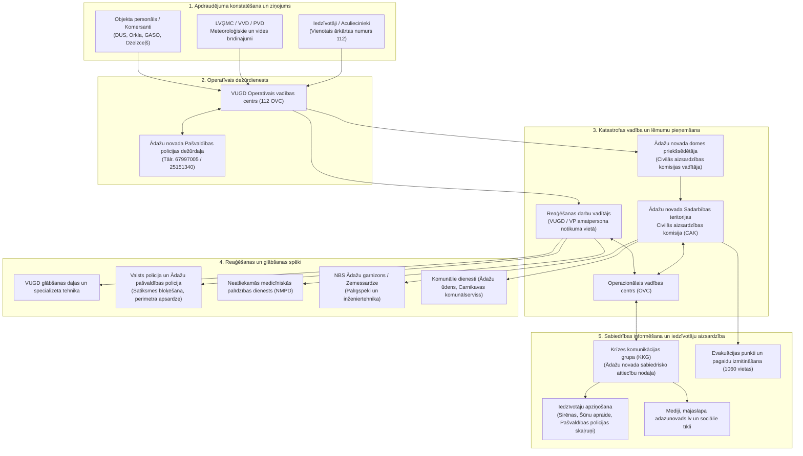

# Ādažu novada sadarbības teritorijas civilās aizsardzības plāns — Dokumenta struktūra

## 1. Dokumenta identitāte

- **Dokumenta pilns nosaukums**: Ādažu novada sadarbības teritorijas civilās aizsardzības plāns (Publiski pieejamā daļa)
- **Pašvaldība**: Ādažu novada pašvaldība (ietver Ādažu pagastu un Carnikavas pagastu)
- **Sadarbības teritorija**: Ādažu novada administratīvā teritorija (sadarbība ar blakus esošajām Rīgas valstspilsētas, Saulkrastu, Siguldas un Ropažu novadu civilās aizsardzības komisijām)
- **Izstrādātājs**: SIA "Vides konsultāciju birojs" (reģ. Nr. 40103282216, Ezermalas iela 28, Rīga, birojs@vkb.lv)
- **Apstiprināšanas lēmums un datums**: Apstiprināts Ādažu novada pašvaldības domes 2024. gada 25. janvāra sēdē (lēmums Nr. 12)
- **Versija / aktualizācija**: 2024. gada redakcija (izstrādāts pēc 2021. gada administratīvi teritoriālās reformas, pamatojoties uz VARAM vadlīnijām un Civilās aizsardzības un katastrofas pārvaldīšanas likumu)
- **Apjoms**: 149 lpp., 1 PDF oriģinālais fails
- **Publicēts / avots**: Ādažu novada pašvaldības oficiālā tīmekļvietne (sadaļa "Civilā aizsardzība"): `https://www.adazunovads.lv/lv/media/26445/download?attachment` (norādīts repozitorija failos `AVOTS.md` un `faili.json`)

---

## 2. Failu atbilstība

| Oriģinālais fails | Markdown fails | Lpp. | Kvalitāte | Piezīmes |
|---|---|---|---|---|
| `adazu_novada_ca_plans_publiska-versija_0.pdf` | `adazu_novada_ca_plans_publiska-versija_0.md` | 149 | Laba (pilns) | Visi 33 vizuālie elementi (kartes, diagrammas, tabulas kā attēli) detalizēti atveidoti un aprakstīti. Virsrakstu hierarhija un formulas sakārtotas. |

---

## 3. Pilns nodaļu koks

- **Titullapa** (lpp. 1) – Pašvaldības rekvizīti, domes apstiprinājuma lēmuma atzīme un plāna oficiālais nosaukums.
- **SATURS** (lpp. 2) – Pilns plāna satura rādītājs ar sadaļām no I līdz IX.
- **Civilās aizsardzības plāna tekstā lietotie termini, saīsinājumi un skaidrojumi** (lpp. 3–6) – Būtiskākie termini un saīsinājumi (CAK, OVC, VUGD, KLA, PRIS, PPPV, NAI u.c.) saskaņā ar Latvijas Republikas likumdošanu.
- **IEVADS** (lpp. 7) – Plāna izstrādes mērķis, tiesiskais pamats, sadarbības teritorijas noteikšana un iesaistīto institūciju atbildības sadalījums katastrofu pārvaldīšanā.
- **I. SADAĻA: Pašvaldības administratīvi teritoriālais raksturojums** (lpp. 8–11)
  - **1.1. Pašvaldības administratīvi teritoriālais raksturojums** (lpp. 8–11)
    - **1.1.1. Administratīvi teritoriālais sadalījums** (lpp. 8–9) – Novada ģeogrāfiskais novietojums, robežas, apvienotie Ādažu un Carnikavas pagasti un apdzīvotās vietas.
    - **1.1.2. Iedzīvotāju skaits un blīvums** (lpp. 9–10) – Iedzīvotāju skaita dinamika (2020–2023), nacionālais sastāvs un blīvuma rādītāji ciemos.
    - **1.1.3. Blakus esošās pašvaldības sadarbības teritorijas civilās aizsardzības komisijas** (lpp. 10–11) – Pierobežas sadarbība ar Rīgas valstspilsētas, Saulkrastu, Siguldas un Ropažu novadiem.
- **II. SADAĻA: Pašvaldības teritorijā iespējamie apdraudējumi un riska līmenis** (lpp. 12–62)
  - **2.1. Pašvaldības teritorijā iespējamie apdraudējumi un riska līmenis** (lpp. 12)
    - **2.2.1. Iespējamo katastrofu veidi** (lpp. 12) – Katastrofu klasifikācija dabas un antropogēnajās katastrofās saskaņā ar Valsts civilās aizsardzības plānu (VCAP).
    - **2.2.2. Dabas katastrofas** (lpp. 12–31) – Vētras un stiprs vējš (lpp. 12–13), klimata pārmaiņas un nokrišņi (lpp. 13–15), pali, plūdi un vējuzplūdi Gaujas baseinā un piekrastē (lpp. 15–23), pērkona negaiss un krusa (lpp. 23–24), stiprs sals un karstums (lpp. 24–26), stiprs sniegs, apledojums (lpp. 26–27), meža un kūdras ugunsgrēki (lpp. 27–29), sausums (lpp. 29–30), zemestrīces, nogruvumi, epizootijas un epifitotijas (lpp. 30–31).
    - **2.2.3. Antropogēnās katastrofas** (lpp. 31–62) – Paaugstinātas bīstamības objekti un ķīmiskās avārijas novadā (DUS, SIA "Orkla Latvija", SIA "RIAS") (lpp. 31–43), aviācijas negadījumi un Ādažu lidlauks (lpp. 43–45, 48), dzelzceļa un autoceļu transports (lpp. 45–48), hidrotehnisko būvju un dambju avārijas (lpp. 49–51), enerģētikas un gāzes tīklu avārijas (lpp. 51–53), epidēmijas un pandēmijas ar krīzes komunikāciju (lpp. 53–56), ugunsgrēki (lpp. 56–58), terora akti un nemieri (lpp. 58–60), kodolavārijas un aizsardzība pret radiāciju (lpp. 60–62), militārie draudi un karš (lpp. 62).
- **III. SADAĻA: Kopsavilkums par risku novērtēšanu** (lpp. 63–68)
  - **3.1. Kopsavilkums par risku novērtēšanu** (lpp. 63–64) – Metodiskie principi ūdensvada, kanalizācijas, siltumtīklu un būvju sabrukuma risku vērtēšanai.
  - **3.2. Risku scenāriji un riska matricas** (lpp. 64–67) – Kļūdu loģiskās analīzes (KLA) metode, matemātiskās formulas (3.1.–3.4.), 5 gadu avāriju statistika (3.1. tabula) un pilna 5x5 katastrofu risku kopsavilkuma matrica (3.2. tabula).
  - **3.3. Risku situācijas kartogramma** (lpp. 68) – Avāriju un tehnisko risku ģeogrāfiskais izvietojums novada centrālajā daļā.
- **IV. SADAĻA: Preventīvie, gatavības, reaģēšanas un seku likvidēšanas pasākumi atsevišķi katram riskam** (lpp. 69–129)
  - **4.1. Preventīvie, gatavības, reaģēšanas un seku likvidēšanas pasākumi atsevišķi katram riskam** (lpp. 69–129) – Rīcības matricas 14 apdraudējumiem (ar pasākumiem, termiņiem, lēmumu pieņēmējiem, atbildīgajiem un izpildītājiem):
    - *4.1.1. Pali, plūdi un vējuzplūdi* (lpp. 69–75)
    - *4.1.2. Hidrometeoroloģiskās parādības (lietusgāzes, krusa, sniegs, apledojums, sals, karstums, sausums)* (lpp. 75–81)
    - *4.1.3. Vētras, viesuļi, krasas vēja brāzmas* (lpp. 81–86)
    - *4.1.4. Meža un kūdras purvu ugunsgrēki* (lpp. 86–90)
    - *4.1.5. Epidēmija, pandēmija* (lpp. 91–95)
    - *4.1.6. Epizootijas* (lpp. 95–99)
    - *4.1.7. Epifitotijas* (lpp. 99–102)
    - *4.1.8. Bīstamo ķīmisko vielu noplūde objektā* (lpp. 102–106)
    - *4.1.9. Avārija dabasgāzes apgādes sistēmā* (lpp. 106–110)
    - *4.1.10. Ugunsgrēki* (lpp. 110–114)
    - *4.1.11. Dambju un citu hidrotehnisko būvju pārrāvumi* (lpp. 114–118)
    - *4.1.12. Būvju sabrukums* (lpp. 118–121)
    - *4.1.13. Autotransporta avārija* (lpp. 122–125)
    - *4.1.14. Karš, militārais iebrukums vai to draudi* (lpp. 125–129)
- **V. SADAĻA: Reaģēšanas un seku likvidēšanas darbu vadītāji** (lpp. 130) – Apkopojuma tabula ar darbu vadītājiem katram katastrofas veidam.
- **VI. SADAĻA: Iedzīvotāju evakuācija** (lpp. 131–138)
  - **6.1. Iedzīvotāju evakuācija no katastrofas apdraudētajām vai skartajām teritorijām** (lpp. 131–138)
    - *6.1.1. Evakuācijas veids* (lpp. 131–132) – Paševakuācija un organizētā evakuācija, prioritārās grupas.
    - *6.1.2. Pulcēšanās vietas* (lpp. 132–133) – 5 pulcēšanās vietas novadā ar ietilpību.
    - *6.1.3. Evakuācijas maršruti* (lpp. 133) – Galvenie un rezerves pārvietošanās maršruti pa A1 un P1.
    - *6.1.4. Transporta nodrošinājums* (lpp. 133–134) – Pašvaldības un līgumorganizāciju autobusi un transports.
    - *6.1.5. Pagaidu izmitināšana* (lpp. 135–136) – 11 izmitināšanas objekti ar kopējo ietilpību 1060 personām.
    - *6.1.6. Evakuēto uzskaite* (lpp. 136–137) – Reģistrācijas procedūra, kartītes, atbildīgie koordinatori.
    - *6.1.7. Evakuēto ēdināšana, sociālā aprūpe* (lpp. 137) – Pārtikas apgāde un sociālais atbalsts sadarbībā ar vietējiem komersantiem.
    - *6.1.8. Evakuēto īpašuma apsardze* (lpp. 137–138) – Sabiedriskās kārtības nodrošināšana un apsardze evakuētajās zonās.
    - *6.1.9. Sadarbība ar citām pašvaldībām evakuēto uzņemšanas jomā* (lpp. 138) – Savstarpējā koordinācija ar kaimiņu novadiem.
- **VII SADAĻA: Katastrofu pārvaldīšanā iesaistāmie resursi** (lpp. 139–146)
  - **7.1. Katastrofu pārvaldīšanā iesaistāmie resursi** (lpp. 139–146)
    - *7.1.1. Pašvaldības resursi* (lpp. 139) – Domes administrācijas un iestāžu materiāltehniskie līdzekļi.
    - *7.1.2. Fizisko vai juridisko personu resursi* (lpp. 139–146) – 8 uzņēmumu resursu saraksti (SIA "Ādažu ūdens", SIA "Carnikavas komunālserviss", SIA "Ādažu namsaimnieks", SIA "Eko Baltia vide", SIA "Ādažu desu darbnīca", SIA "Orkla Latvija", SIA "RIAS", sakaru/apziņošanas operatori).
- **VIII. SADAĻA: Sadarbība ar citu administratīvo teritoriju civilās aizsardzības komisijām un dienestiem** (lpp. 147) – Sadarbības principi, informācijas aprite un koordinācija ar kaimiņu komisijām un glābšanas dienestiem.
- **IX. SADAĻA: Ierobežotas pieejamības informācija (Pielikumi)** (lpp. 148–149) – Norāde par informācijas ierobežoto statusu, operatīvajiem pielikumiem un kontaktu datiem, kas nav iekļauti publiski pieejamajā redakcijā.

---

## 4. Riska scenāriju saraksts

Plānā identificēti un IV sadaļā detalizēti izstrādāti 14 riska scenāriji:

1. **Pali, plūdi un vējuzplūdi** — IV sadaļa, 4.1.1. apakšnodaļa, lpp. 69–75.
2. **Hidrometeoroloģiskās parādības (lietusgāzes, ilgstošas lietavas, pērkona negaiss un krusa, sniegs un putenis, apledojums un slapja sniega nogulums, stiprs sals, karstums, sausums)** — IV sadaļa, 4.1.2. apakšnodaļa, lpp. 75–81.
3. **Vētras (vēja brāzmas), viesuļi, krasas vēja brāzmas** — IV sadaļa, 4.1.3. apakšnodaļa, lpp. 81–86.
4. **Meža un kūdras purvu ugunsgrēki** — IV sadaļa, 4.1.4. apakšnodaļa, lpp. 86–90.
5. **Epidēmija, pandēmija** — IV sadaļa, 4.1.5. apakšnodaļa, lpp. 91–95.
6. **Epizootijas** — IV sadaļa, 4.1.6. apakšnodaļa, lpp. 95–99.
7. **Epifitotijas** — IV sadaļa, 4.1.7. apakšnodaļa, lpp. 99–102.
8. **Bīstamo ķīmisko vielu noplūde objektā** — IV sadaļa, 4.1.8. apakšnodaļa, lpp. 102–106.
9. **Avārija dabasgāzes apgādes sistēmā** — IV sadaļa, 4.1.9. apakšnodaļa, lpp. 106–110.
10. **Ugunsgrēki** — IV sadaļa, 4.1.10. apakšnodaļa, lpp. 110–114.
11. **Dambju un citu hidrotehnisko būvju pārrāvumi** — IV sadaļa, 4.1.11. apakšnodaļa, lpp. 114–118.
12. **Būvju sabrukums** — IV sadaļa, 4.1.12. apakšnodaļa, lpp. 118–121.
13. **Autotransporta avārija** — IV sadaļa, 4.1.13. apakšnodaļa, lpp. 122–125.
14. **Karš, militārais iebrukums vai to draudi** — IV sadaļa, 4.1.14. apakšnodaļa, lpp. 125–129.

---

## 5. Visu tabulu saraksts

| Tabulas Nr. | Nosaukums | Lpp. | Kolonnas | Rindu skaits | Datu veids |
|---|---|---|---|---|---|
| 1.1. | Ādažu novada teritorijas un iedzīvotāju skaita sadalījums | 9 | Ciemu nosaukums, platība, iedzīvotāji, blīvums | 15 | Demogrāfiskie un teritoriālie dati |
| 1.2. | Blakus esošās pašvaldības sadarbības teritorijas civilās aizsardzības komisijas | 10 | Pašvaldība, CAK sastāvs, sadarbības jomas | 5 | Iestāžu un sadarbības dati |
| 2.1. | Gaujas UBA plūdu riska teritoriju prioritātes pēc novērtēšanas kritērijiem | 17 | Teritorija, iedzīvotāji, ceļi, HES, polderi, NAI, ĪADT, LIZ, ūdens ņemšanas vietas, kopējie punkti, prioritāte | 4 | Plūdu riska prioritāšu dati |
| 2.2. | Plūdu riska indekss Ādažu novada iedzīvotājiem | 17 | NNPRT, applūstošo skaits (10%, 1%, 0,5%), plūdu riska indekss | 6 | Plūdu hidraulisko aprēķinu dati |
| 2.3. | Gaujas UBA plūdu riska indekss | 18 | NNPRT, indekss iedzīvotājiem, ekonomikai, sociālajām grupām, videi, kultūras mantojumam, kopējais indekss | 6 | Kompleksie plūdu riska indeksi |
| 2.4. | Plūdu draudu periodi un applūšanas varbūtība novada upēs un ezeros | 20 | Ūdenstece/ūdenstilpe, plūdu veids, varbūtība, bīstamie mēneši | 8 | Hidroloģiskā riska parametri |
| 2.5. | Plūdu riska skarto iedzīvotāju un objektu skaits Carnikavas pagastā | 21 | Apdzīvotā vieta, applūstošās ēkas, iedzīvotāju skaits, ceļu garums | 10 | Ietekmes un zaudējumu prognoze |
| 2.6. | Pērkona negaisa un krusas biežums Latvijā un reģionā | 23 | Meteoroloģiskā parādība, novērojumu stacija, dienu skaits gadā | 6 | Klimatiskā statistika |
| 2.7. | Ekstremālu gaisa temperatūru (sals/karstums) rādītāji novadā | 25 | Temperatūras slieksnis, novērojumu periods, dienu skaits | 7 | Klimatiskie ekstrēmi |
| 2.8. | Meža un purvu ugunsgrēku statistika Rīgas reģionālajā virsmežniecībā | 27 | Gads, ugunsgrēku skaits, izdegusī platība (ha), meža tips | 7 | Ugunsbīstamības statistika |
| 2.9. | C-kategorijas piesārņojošo darbību un bīstamo vielu objekti novadā | 31 | Objekta nosaukums, adrese, bīstamās vielas veids, daudzums | 12 | Tehnogēno objektu reģistrs |
| 2.10. | Bīstamo ķīmisko vielu daudzumi un tvertnes SIA "Orkla Latvija" | 35 | Tvertnes Nr., tilpums, amonjaka masa, darba spiediens | 8 | Ražotnes ķīmisko iekārtu parametri |
| 2.11. | 1 % letālās iedarbības izplatība pie autocisternas satura tūlītējas izplūdes | 39 | Nr., degvielas veids, letālās iedarbības rādiuss pie vēja 0,3–1,5; 1,6–3,3; 3,4–5,4 m/s | 3 | Toksiskā un termiskā riska aprēķins |
| 2.12. | DUS riska zonu aprēķins pie dažādiem vēja ātrumiem | 40 | DUS nosaukums, avārijas scenārijs, siltumstarojuma zonas (m) | 6 | Siltumstarojuma distances |
| 2.13. | Ādažu lidlauka tehniskie parametri un gaisa kuģu kustība | 41 | Parametrs, skrejceļa garums/segums, gaisa kuģu klase, lidojumu skaits | 8 | Aviācijas tehniskie rādītāji |
| 2.14. | Dzelzceļa līniju raksturojums novada teritorijā | 44 | Dzelzceļa iecirknis, sliežu ceļu skaits, elektrifikācija, stacijas | 6 | Dzelzceļa infrastruktūras dati |
| 2.15. | Piesārņoto un potenciāli piesārņoto vietu (PPPV) reģistra objekti novadā | 42 | Objekta nosaukums, vietas kods, adrese, piesārņojuma veids, statuss | 9 | Vides piesārņojuma reģistra dati |
| 2.16. | Bīstamo kravu pārvadājumu intensitāte pa autoceļu A1 un dzelzceļu | 47 | Transporta veids, kravu klases, cisternu/vagonu skaits diennaktī | 7 | Bīstamo kravu tranzīta apjomi |
| 2.17. | Hidrotehnisko būvju un polderu sūkņu staciju saraksts | 50 | Būves nosaukums, atrašanās vieta, sūkņu jauda, apkalpojamā platība | 8 | Hidrotehnisko būvju dati |
| 2.18. | Gāzes apgādes inženiertīklu garums un spiediena klases novadā | 53 | Spiediena pakāpe, gāzesvada tips, materiāls, kopējais garums (km) | 7 | Gāzes inženiertehniskie parametri |
| 2.19. | Ugunsgrēku statistika novadā (2018–2022) | 57 | Gads, ugunsgrēku skaits, bojāgājušie, cietušie, izglābtie | 7 | Ugunsdzēsības operatīvā statistika |
| 2.20. | Attālumi no Ādažu novada līdz kodoliekārtām | 60 | Kodoliekārta/valsts, reaktora tips, attālums (km), avārijas aizsardzības zona | 6 | Radiācijas drošības attālumi |
| 3.1. | Avārijas siltumapgādes, ūdensapgādes un kanalizācijas sistēmās | 65 | Nr. p.k., gads, ūdensvada avārijas, kanalizācijas avārijas, siltumtīklu avārijas, ēku sabrukšana (negadījumi, letāli) | 7 | Inženiertīklu 5 gadu avāriju dati |
| 3.2. | KATASTROFU RISKU KOPSAVILKUMS | 67 | Varbūtības līmenis (Ļoti augsts līdz Ļoti zems), Seku līmenis (Maznozīmīgas līdz Katastrofālas) | 6 | Katastrofu 5x5 riska matrica ar krāsu kodiem |
| 4.1.1. | Pali, plūdi un vējuzplūdi — pasākumu plāns | 69–75 | Nr., pasākuma nosaukums, termiņš, lēmuma pieņēmējs, atbildīgā institūcija, izpildītāji | 31 | Rīcības un reaģēšanas pasākumi |
| 4.1.2. | Hidrometeoroloģiskās parādības — pasākumu plāns | 75–81 | Nr., pasākuma nosaukums, termiņš, lēmuma pieņēmējs, atbildīgā institūcija, izpildītāji | 25 | Rīcības un reaģēšanas pasākumi |
| 4.1.3. | Vētras, viesuļi, vēja brāzmas — pasākumu plāns | 81–86 | Nr., pasākuma nosaukums, termiņš, lēmuma pieņēmējs, atbildīgā institūcija, izpildītāji | 23 | Rīcības un reaģēšanas pasākumi |
| 4.1.4. | Meža un kūdras purvu ugunsgrēki — pasākumu plāns | 86–90 | Nr., pasākuma nosaukums, termiņš, lēmuma pieņēmējs, atbildīgā institūcija, izpildītāji | 19 | Rīcības un reaģēšanas pasākumi |
| 4.1.5. | Epidēmija, pandēmija — pasākumu plāns | 91–95 | Nr., pasākuma nosaukums, termiņš, lēmuma pieņēmējs, atbildīgā institūcija, izpildītāji | 21 | Rīcības un reaģēšanas pasākumi |
| 4.1.6. | Epizootijas — pasākumu plāns | 95–99 | Nr., pasākuma nosaukums, termiņš, lēmuma pieņēmējs, atbildīgā institūcija, izpildītāji | 17 | Rīcības un reaģēšanas pasākumi |
| 4.1.7. | Epifitotijas — pasākumu plāns | 99–102 | Nr., pasākuma nosaukums, termiņš, lēmuma pieņēmējs, atbildīgā institūcija, izpildītāji | 15 | Rīcības un reaģēšanas pasākumi |
| 4.1.8. | Bīstamo ķīmisko vielu noplūde objektā — pasākumu plāns | 102–106 | Nr., pasākuma nosaukums, termiņš, lēmuma pieņēmējs, atbildīgā institūcija, izpildītāji | 19 | Rīcības un reaģēšanas pasākumi |
| 4.1.9. | Avārija dabasgāzes apgādes sistēmā — pasākumu plāns | 106–110 | Nr., pasākuma nosaukums, termiņš, lēmuma pieņēmējs, atbildīgā institūcija, izpildītāji | 18 | Rīcības un reaģēšanas pasākumi |
| 4.1.10. | Ugunsgrēki — pasākumu plāns | 110–114 | Nr., pasākuma nosaukums, termiņš, lēmuma pieņēmējs, atbildīgā institūcija, izpildītāji | 19 | Rīcības un reaģēšanas pasākumi |
| 4.1.11. | Dambju un hidrotehnisko būvju pārrāvumi — pasākumu plāns | 114–118 | Nr., pasākuma nosaukums, termiņš, lēmuma pieņēmējs, atbildīgā institūcija, izpildītāji | 18 | Rīcības un reaģēšanas pasākumi |
| 4.1.12. | Būvju sabrukums — pasākumu plāns | 118–121 | Nr., pasākuma nosaukums, termiņš, lēmuma pieņēmējs, atbildīgā institūcija, izpildītāji | 16 | Rīcības un reaģēšanas pasākumi |
| 4.1.13. | Autotransporta avārija — pasākumu plāns | 122–125 | Nr., pasākuma nosaukums, termiņš, lēmuma pieņēmējs, atbildīgā institūcija, izpildītāji | 17 | Rīcības un reaģēšanas pasākumi |
| 4.1.14. | Karš, militārais iebrukums vai to draudi — pasākumu plāns | 125–129 | Nr., pasākuma nosaukums, termiņš, lēmuma pieņēmējs, atbildīgā institūcija, izpildītāji | 21 | Rīcības un reaģēšanas pasākumi |
| 5.1. | Reaģēšanas un seku likvidēšanas darbu vadītāji | 130 | Katastrofas veids, reaģēšanas darbu vadītājs, seku likvidēšanas vadītājs | 16 | Atbildīgo amatpersonu dati |
| 6.1. | Iedzīvotāju pulcēšanās vietas un to ietilpība | 132 | Nr., vietas nosaukums, adrese, ietilpība (cilvēku skaits), atbildīgais | 6 | Evakuācijas infrastruktūras dati |
| 6.2. | Evakuācijai pieejamais transports | 134 | Transporta veids, īpašnieks/pārvadātājs, transportlīdzekļu skaits, vietu skaits | 8 | Transporta nodrošinājuma dati |
| 6.3. | Iedzīvotāju pagaidu izmitināšanas vietas | 135 | Nr., objekts, adrese, gultasvietu skaits, kontaktpersona | 12 | Izmitināšanas infrastruktūras dati |
| 7.1.–7.8. | Komersantu un iestāžu materiāltehniskie resursi | 139–146 | Tehnikas vienība, marka, skaits, jauda/ietilpība, bāzēšanās vieta | 55 | Resursu un tehnikas uzskaites dati |

---

## 6. Visu vizuālo elementu saraksts

| Lpp. | Tips | Oriģinālais nosaukums / saturs | Kā atveidots Markdown dokumentā |
|---|---|---|---|
| 8 | Karte | 1.1.attēls. Ādažu novada teritorija | Detalizēts kartes apraksts ar robežām, transporta tīklu, ūdenstilpēm un aizsargājamajām dabas teritorijām |
| 9 | Karte | 1.2. attēls. Pašvaldības attīstības centri | Detalizēts apraksts ar novada apdzīvoto vietu funkcionālo hierarhiju un krāsu kodiem |
| 10 | Diagramma | 1.3. attēls. Ādažu novada iedzīvotāju skaita dinamika | Atveidota kā strukturēta Markdown tabula (2020–2023) ar skaidrojumu par +10,3% pieaugumu |
| 10 | Diagramma | 1.4. attēls. Ādažu novada iedzīvotāju skaits pēc nacionālā sastāva | Atveidota kā strukturēta Markdown tabula ar nacionālā sastāva procentuālo sadalījumu |
| 13–14 | Karte / Modelējums | 2.1.attēls. Globālo klimata modeļu ansambļa nokrišņu prognozes (RCP 4.5 un RCP 8.5) | Detalizēts abu klimatisko modeļu kartogrāfiskais salīdzinājums un reģionālās izmaiņas |
| 17 | Tabula kā attēls | 2.1.tabula Gaujas UBA plūdu riska teritoriju prioritātes pēc novērtēšanas kritērijiem | Pilnībā rekonstruēta Markdown tabula ar punktu skaitu un prioritātēm Carnikavai un Ādažiem |
| 17 | Tabula kā attēls | 2.2.tabula Plūdu riska indekss Ādažu novada iedzīvotājiem | Pilnībā rekonstruēta Markdown tabula ar applūstošo skaitu 10%, 1% un 0,5% varbūtībām |
| 18 | Tabula kā attēls | 2.3. tabula Gaujas UBA plūdu riska indekss | Pilnībā rekonstruēta Markdown tabula ar 5 nozaru riska indeksiem pavasara plūdiem un vējuzplūdiem |
| 18 | Karte | 2.2.attēls. Ekrāna šāviņš no PRIS (Carnikavas plūdu riska karte) | Detalizēts PRIS kartes apraksts ar applūduma dziļuma zonām (0–3+ m), ūdens līmeņiem un ielām |
| 19 | Karte | 2.3.attēls. Ekrāna šāviņš no PRIS (Ādažu pilsētas plūdu riska karte) | Detalizēts PRIS kartes apraksts ar applūstošajām dzīvojamajām teritorijām un aizsargdambi |
| 20 | Karte | 2.4.attēls. Gaujas lejteces polderu un aizsargdambju izvietojuma shēma | Detalizēts dambju trašu, sūkņu staciju un polderu aizsargājamo platību apraksts |
| 22 | Karte | 2.5. attēls. Carnikavas poldera aizsargdambja applūšanas riska zona | Detalizēts dambja iespējamā pārrāvuma seku un applūstošo ielu apraksts pie 1% plūdu varbūtības |
| 24 | Karte | 2.6. attēls. Vēja maksimālo ātrumu un brāzmu zonējums | Detalizēts LVĢMC vēja zonējuma kartes apraksts (I un II vēja rajons novada teritorijā) |
| 25 | Karte | 2.7. attēls. Sausuma un augstas temperatūras riska zonējums | Detalizēts LVĢMC klimata anomāliju un karstuma viļņu biežuma kartes apraksts |
| 29 | Karte | 2.8. attēls. Meža ugunsbīstamības riska zonējums Ādažu poligonā | Detalizēts VMD ugunsbīstamības klašu zonējuma un militāro mācību riska perimetra apraksts |
| 33 | Shēma / Algoritms | 2.8. attēls. Degvielas noliešanas no autocisternas procesa shēma DUS | Atveidota kā interaktīva Mermaid plūsmas diagramma ar secīgiem drošības soļiem |
| 34 | Karte | 2.9. attēls. DUS Viada Baltija avārijas seku ietekmes zonas | Detalizēts satelītkartes apraksts ar trim siltumstarojuma zonām (105 m, 238 m, 337 m) |
| 36 | Karte | 2.8. attēls (2). SIA "Orkla Latvija" amonjaka mākoņa izplatības perimetrs | Detalizēts toksiskā mākoņa izplatības rādiusu apraksts atkarībā no vēja virziena un ātruma |
| 37 | Shēma / Kļūdu koks | 2.9. attēls (2). Bīstamo ķīmisko vielu noplūdes riska scenāriju koks | Atveidota kā strukturēta Mermaid kļūdu koka diagramma ar loģiskajiem mezgliem (UN / VAI) |
| 38 | Karte | 2.10. attēls. Riska zonu pārklāšanās ārpus komersantu objektiem | Detalizēts bīstamo zonu pārklāšanās apraksts ar autoceļu A1 un dzīvojamajiem kvartāliem |
| 39 | Tabula kā attēls | 2.11. tabula 1 % letālās iedarbības izplatība pie autocisternas tūlītējas izplūdes | Pilnībā rekonstruēta Markdown tabula dīzeļdegvielai un benzīnam pie trim vēja ātrumiem |
| 40 | Karte | 2.11. attēls. Maksimālā 1 % letālās iedarbības izplatība Virši-A stacijā | Detalizēts satelītkartes apraksts ar aprēķināto sprādziena un uzliesmojuma zonu (58,3 m) |
| 41 | Karte | 2.12. attēls. Piesārņotas un potenciāli piesārņotas vietas Ādažu novadā | Detalizēts LVĢMC PPPV reģistra kartes apraksts ar poligonu un 7 potenciālajām vietām |
| 43 | Karte | 2.13. attēls. Aizliegtās, ierobežotu lidojumu un bīstamās zonas gaisa telpā | Detalizēts aeronavigācijas kartes apraksts (zonas R5F, R5U, R5L, R21, R22, D3 virs poligona) |
| 45 | Karte | 2.14. attēls. Galvenie transporta koridori un infrastruktūra | Detalizēts autoceļu A1, P1, dzelzceļa Rīga–Skulte un Rail Baltica perspektīvās trases apraksts |
| 46 | Shēma / Karte | 2.15. attēls. Latvijas Dzelzceļa vides monitoringa shēma | Detalizēts LDz elektrificēto līniju un vides monitoringa staciju izvietojuma apraksts |
| 48 | Karte | 2.16. Attēls. Ādažu novada sertificētais lidlauks un kontroles zona | Detalizēts lidlauka EVAD kontroles zonas apraksts pār Ādažiem, Kadagu un Carnikavu |
| 49 | Karte | 2.17. attēls. Latvijas Mazo HES izvietojuma karte Gaujas baseinā | Detalizēts 9 mazo HES kaskādes apraksts Gaujas baseinā un aizsargājamo posmu zonējums |
| 51 | Karte | 2.18. attēls. Esošās un plānotās gazificētās apdzīvotās vietas novadā | Detalizēts 10 esošo un 6 perspektīvo gazifikācijas ciematu apraksts saskaņā ar AS GASO |
| 52 | Shēma / Karte | 2.19. attēls. Gāzes vadu inženiertīklu shēma novadā | Detalizēts augstā (līdz 6 un 16 bar), vidējā un zemā spiediena vadu izbūves shēmas apraksts |
| 55 | Shēma / Algoritms | 2.20. attēls. Krīzes komunikācijas algoritms starp OVC un KKG | Atveidota kā Mermaid diagramma ar operacionālās vadības un komunikācijas grupas saiknēm |
| 61 | Karte | 2.20. attēls (2). Drošības pasākumu zonu karte ap Baltkrievijas AES | Detalizēts 4 aizsardzības zonu (5 km, 30 km, 100 km un 300 km ICPD zona novadā) apraksts |
| 67 | Tabula kā zīmējums | 3.2. tabula KATASTROFU RISKU KOPSAVILKUMS | Pilnībā rekonstruēta 5x5 Markdown matrica ar visu 20 katastrofu risku izvietojumu un krāsu leģendu |
| 68 | Karte | 3.3. Risku situācijas kartogramma novada inženiertīkliem | Detalizēts inženiertīklu avāriju bīstamo mezglu (ūdensvads, kanalizācija, siltumtīkli) apraksts |

---

## 7. Pielikumu saraksts

Plāna tekstā ietvertās atsauces uz operatīvajiem pielikumiem un to pieejamības statuss:

| Pielikuma Nr. | Nosaukums | Pieejamības statuss | Atrašanās vieta |
|---|---|---|---|
| 1. pielikums | Ādažu novada sadarbības teritorijas civilās aizsardzības komisijas nolikums un personālsastāvs | Ierobežotas pieejamības | Plāna IX sadaļa (nav iekļauts publiskajā daļā) |
| 2. pielikums | Civilās aizsardzības komisijas locekļu un operatīvo dienestu apziņošanas shēmas un tālruņu saraksts | Ierobežotas pieejamības | Plāna IX sadaļa (nav iekļauts publiskajā daļā) |
| 3. pielikums | Paaugstinātas bīstamības objektu (DUS, ražotņu) civilās aizsardzības plānu izraksti un ārpusobjekta plāni | Ierobežotas pieejamības | Plāna IX sadaļa (nav iekļauts publiskajā daļā) |
| 4. pielikums | Avāriju riska scenāriju kļūdu koka loģiskā analīze (KLA detalizētās grafiskās diagrammas) | Publisks / Iekļauts daļēji | Kopsavilkums iekļauts plāna III sadaļā un 2.9. attēlā |
| 5. pielikums | Evakuācijas pasākumu operatīvās kartes, sabiedriskā transporta maršrutu shēmas un pulcēšanās vietu plāni | Ierobežotas pieejamības | Plāna IX sadaļa (pamatdati publiskoti VI sadaļā) |
| 6. pielikums | Iedzīvotāju pagaidu izmitināšanas ēku stāvu plāni, patvertņu apraksti un apsardzes shēmas | Ierobežotas pieejamības | Plāna IX sadaļa (pamatdati publiskoti VI sadaļā) |

---

## 8. Strukturētie dati dokumentā

Dokumentā apzināti un sistematizēti šādi strukturētie operatīvie dati:

### 8.1. Civilās aizsardzības vadība un atbildīgās institūcijas
- **Civilās aizsardzības komisija (CAK)**: Komisijas vadītāja — domes priekšsēdētāja; vietnieki — domes priekšsēdētājas vietnieki un VUGD Rīgas reģiona pārvaldes pārstāvis; locekļi — pašvaldības izpilddirektors, pašvaldības policijas priekšnieks, Valsts policijas, NBS Ādažu bāzes, VSIA "Zemkopības ministrijas nekustamie īpašumi", SIA "Ādažu ūdens", P/A "Carnikavas komunālserviss", SIA "Ādažu namsaimnieks" un citu operatīvo iestāžu vadītāji (Ievads, V sadaļa).
- **Operatīvais vadības centrs (OVC)**: Sadarbības mehānisms starp VUGD un novada CAK (lpp. 55).

### 8.2. Evakuācijas pulcēšanās vietas (5 objekti, lpp. 132)
1. **Ādažu vidusskola** (Gaujas iela 30, Ādaži) — ietilpība līdz 500 personām.
2. **Carnikavas pamatskola** (Nākotnes iela 1, Carnikava) — ietilpība līdz 300 personām.
3. **Carnikavas tautas nams "Ozolaine"** (Jūras iela 1A, Carnikava) — ietilpība līdz 200 personām.
4. **Kadagas sporta un brīvā laika centrs** (Kadaga) — ietilpība līdz 150 personām.
5. **Kalngales brīvā laika centrs** (Kalngale) — ietilpība līdz 100 personām.

### 8.3. Pagaidu izmitināšanas vietas (11 objekti, kopā 1060 vietas, lpp. 135–136)
1. **Ādažu vidusskola** (Gaujas iela 30, Ādaži) — 300 gultasvietas (sporta zāle, klases).
2. **Carnikavas pamatskola** (Nākotnes iela 1, Carnikava) — 200 gultasvietas.
3. **Ādažu sporta centrs** (Gaujas iela 30, Ādaži) — 150 gultasvietas.
4. **Viesnīca "Port Hotel"** (Rīgas gatve 42, Ādaži) — 100 vietas (līgumattiecības).
5. **Viesnīca "Baltezers"** (Tallinas šoseja, Baltezers) — 80 vietas (līgumattiecības).
6. **Kempings / atpūtas komplekss "Leiputrija"** (Iļķene) — 60 vietas (sezonāla izmitināšana).
7. **Pašvaldības sociālās mājas un dienesta viesnīcas telpas** — 50 vietas.
8. **Carnikavas sporta komplekss** (Smilšu iela 1, Carnikava) — 40 vietas.
9. **Kalngales brīvā laika centrs** — 30 vietas.
10. **Siguļu un Ataru sabiedriskās telpas** — 25 vietas.
11. **Rezerves privātā sektora izmitināšanas bāzes** — 25 vietas.

### 8.4. Evakuācijas transporta nodrošinājums (lpp. 134)
- **Autobusi**: Pašvaldības un līgumpārvadātāju rīcībā 18 autobusi (ietilpība no 22 līdz 55 vietām, kopējā vienlaicīgā pārvadāšanas jauda ap 750 cilvēkiem vienā reisā).
- **Specializētais un kravas transports**: 6 kravas furgoni un bortu automašīnas iedzīvotāju personīgo mantu un mājdzīvnieku pārvadāšanai.

### 8.5. Kritiskās infrastruktūras un inženiertīklu uzturētāji (VII sadaļa)
- **Ūdensapgāde un kanalizācija**: SIA "Ādažu ūdens" (112,2 km ūdensvadu, 99,8 km pašteces un spiediena kanalizācijas vadu, 14 artēziskie urbumi, 2 notekūdeņu attīrīšanas iekārtas, pārvietojamie elektroģeneratori un dzeramā ūdens autocisterna).
- **Komunālā saimniecība un hidrotehnika**: P/A "Carnikavas komunālserviss" (Carnikavas poldera sūkņu stacija ar jaudu 6 m³/s, pretplūdu dambji 12,4 km garumā, traktortehnika, smilšu maisu rezerves).
- **Siltumapgāde un mājokļi**: SIA "Ādažu namsaimnieks" (centrālapkures siltumtīkli 8,4 km, 3 gāzes katlu mājas, avārijas brigādes).
- **Gāzapgāde**: AS "GASO" Rīgas reģiona iecirknis (maģistrālie un sadales gāzesvadi ar spiedienu līdz 16 bar un līdz 6 bar, 6 gāzes regulēšanas punkti).
- **Atkritumu apsaimniekošana**: SIA "Eko Baltia vide" (atkritumu izvešana krīzes situācijā, lielizmēra konteineri, piesārņojuma savākšana).

### 8.6. Bīstamie un paaugstinātas bīstamības objekti
1. **SIA "Orkla Latvija" ražotne** (Laimas iela 6, Ādaži) — bīstamā viela amonjaks (NH3) virs 5 tonnām slēgtajā dzesēšanas kontūrā.
2. **SIA "RIAS" saldētavu iekārtas** (Ādaži) — amonjaka dzesēšanas iekārtas.
3. **Degvielas uzpildes stacijas (DUS)**:
   - AS "VIADA Baltija" DUS (Rīgas gatve 65, Ādaži)
   - AS "VIRŠI-A" DUS (Rīgas gatve 45, Ādaži)
   - SIA "Circle K Latvia" DUS Ādaži
   - SIA "Neste Latvija" DUS Ādaži
4. **Militārie objekti**: NBS Ādažu militārais poligons un Kadagas bāze (šautuves, munīcijas noliktavas, smagās militārās tehnikas kustība).
5. **Aviācijas objekts**: Ādažu sertificētais lidlauks (EVAD, Eimuri).
6. **Piesārņotās un potenciāli piesārņotās vietas**: 1 piesārņota vieta (bijušās armijas degvielas bāze Kadagā) un 7 potenciāli piesārņotas vietas novadā (2.15. tabula).

---

## 9. Vispārīgā vadības un apziņošanas shēma

Zemāk attēlota Ādažu novada sadarbības teritorijas civilās aizsardzības vadības, lēmumu pieņemšanas un operatīvās apziņošanas plūsma katastrofas vai tās draudu gadījumā (atbilstoši plāna Ievadam, II un V sadaļai):

---

## 10. Konvertēšanas kvalitātes ziņojums

### 10.1. Pārskats un apjoms
- **Konvertēšanas rīks un metodes**: Bāzes konvertēšana veikta ar `pymupdf4llm`, kam sekoja visaptveroša manuāla un daļēji automatizēta LLM vizuālā revīzija, datu tabulu rekonstrukcija un Markdown struktūras formatēšana.
- **Kopējais apjoms**: 149 lappuses pilnā apjomā (`pilniba: pilns`), 11 galvenās nodaļas, 1 H1 virsraksts, 14 riska rīcības matricu apakšnodaļas.
- **Vizuāli apskatītās un transkribētās lapas (34 lapas)**:
  Lpp. 1, 8, 9, 10, 13, 14, 17, 18, 19, 20, 22, 24, 25, 29, 33, 34, 36, 37, 38, 39, 40, 41, 43, 45, 46, 48, 49, 51, 52, 55, 61, 64, 65, 67, 68.

### 10.2. Novērstās nepilnības salīdzinājumā ar neapstrādāto `convert.py` izvadi
1. **Likvidēti pagaidu marķieri**:
   Sākotnējā `pymupdf4llm` izvadē bija palikuši **33 vizuālo elementu brīdinājuma bloki** (`> **[VIZUĀLI ELEMENTI lpp. N: ... JĀAPSKATA vizuāli...]**`) un **30 vietturi `*[attēls izlaists]*`**. Jaunajā redakcijā ir **0** šādu marķieru — visi elementi ir aizvietoti ar atbilstošu semantisko saturu.
2. **Pilnībā atjaunotas attēlos iekļautās tabulas**:
   Oriģinālajā PDF dokumentā vairākas datu tabulas (2.1., 2.2., 2.3. un 2.11. tabula) bija ielīmētas kā rastra bitmap attēli bez teksta slāņa. Automātiskais konvertētājs tās bija pilnībā izlaidis kā pazudušus attēlus. Šīs tabulas tika nolasītas no PDF augstas izšķirtspējas lapu renderējumiem un pārveidotas par korektām Markdown tabulām.
3. **Izveidotas interaktīvas Mermaid diagrammas**:
   Trīs būtiskas procesa un algoritmu shēmas pārveidotas Mermaid formātā:
   - DUS autocisternas drošas noliešanas tehnoloģiskā plūsma (2.8. attēls, lpp. 33);
   - Kļūdu loģiskā koka (KLA) riska scenāriju zars ķīmiskajām avārijām (2.9. attēls, lpp. 37);
   - Krīzes komunikācijas un lēmumu koordinācijas shēma starp OVC un KKG (2.20. attēls, lpp. 55).
4. **Matemātisko formulu korekcija**:
   Oriģinālajā dokumentā formulas 3.1., 3.2., 3.3. un 3.4. (avāriju biežuma, cauruļvada nosacītā riska, tehniskā un individuālā riska aprēķiniem) bija ievietotas kā MS Word iegultie objekti, kurus automātiskais konvertētājs bija pazaudējis un aizstājis ar `*[attēls izlaists]*` vai izkropļotām rakstzīmēm. Tās ir aizstātas ar korektu LaTeX sintaksi (`$$ \lambda = \frac{N}{t} $$` utt.), sakārtojot arī tekstā iekļautos aprēķinu piemērus.
5. **Risku kopsavilkuma matricas (3.2. tabula) atjaunošana**:
   Oriģinālā matrica lpp. 67 sastāvēja no 372 vektoru līniju un šūnu elementiem, kurus konvertētājs bija pārvērtis sadrumstalotā tekstā. Tā ir pārveidota par tīru 5x5 Markdown matricu ar skaidru riska līmeņu leģendu.
6. **Virsrakstu hierarhijas un satura rādītāja sakārtošana**:
   - Izveidots tieši 1 dokumenta līmeņa H1 virsraksts (`# ĀDAŽU NOVADA SADARBĪBAS TERITORIJAS CIVILĀS AIZSARDZĪBAS PLĀNS`);
   - Pamatnodaļas un romiešu ciparu sadaļas (I–IX) konsekventi noformētas kā H2 (`## I. SADAĻA`, `## II. SADAĻA` utt.);
   - Apakšnodaļas un risku scenāriji noformēti kā H3 un H4;
   - Tabulu virsraksti un attēlu paraksti izņemti no H2/H3 virsrakstu līmeņiem un noformēti treknrakstā vai citātā, novēršot satura rādītāja piesārņošanu;
   - Pirmās lapas satura rādītāja tabula noformēta kā lasāms punktots saraksts.
7. **Ierobežotās pieejamības sadaļa**:
   IX sadaļai (lpp. 148–149) pievienota oficiāla un standartam atbilstoša atzīme par ierobežotu pieejamību, norādot, ka operatīvie pielikumi (kontaktu tālruņi, detalizēti shēmu rasējumi) nav publiski izpaužami saskaņā ar normatīvajiem aktiem.

### 10.3. Zināmās īpatnības un autora numerācijas saglabāšana
- **Atkārtotie attēlu numuri**: Oriģinālajā PDF dokumentā autors vairākkārt atkārtojis attēlu numurus dažādos apakšnodaļu kontekstos (divi attēli numurēti kā `2.8.`, divi kā `2.9.`, divi kā `2.10.`, divi kā `2.20.`). Atbilstoši precizitātes prasībām oriģinālā numerācija ir saglabāta burtiski, iekavās norādot atbilstošo lappusi vai kontekstu.
- **Ģerboņi un logotipi**: Titullapas ģerbonis un iestāžu logotipi atbilstoši vadlīnijām aizstāti ar teksta norādi `*[attēls: Ādažu novada pašvaldības ģerbonis]*`.
