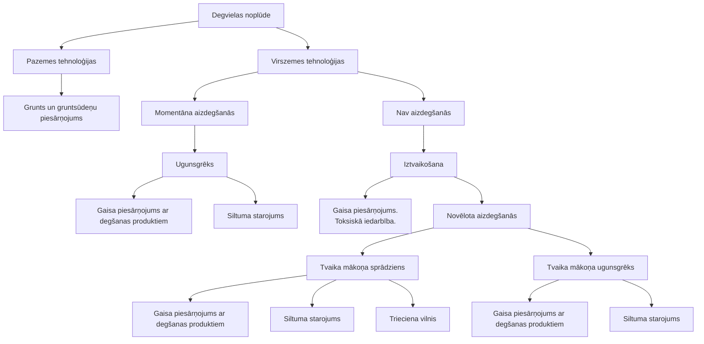
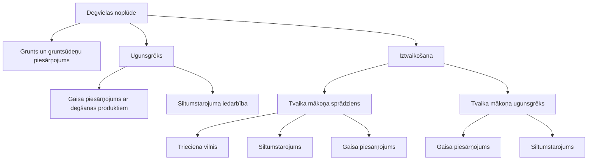
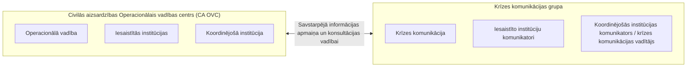

<!-- lpp. 1 -->
*[attēls: Ādažu novada pašvaldības ģerbonis]*

**ĀDAŽU NOVADA PAŠVALDĪBA**  
Gaujas iela 33A, Ādaži, Ādažu novads, LV-2164, tālr. 25151340, 25151341, e-pasts dome@adazi.lv

APSTIPRINĀTS  
Ādažu novada pašvaldības domes  
2024. gada 25. janvāra sēdē  

# ĀDAŽU NOVADA SADARBĪBAS TERITORIJAS CIVILĀS AIZSARDZĪBAS PLĀNS

(Publiski pieejamā daļa)

<!-- lpp. 2 -->
## SATURS

- Civilās aizsardzības plāna tekstā lietotie termini, saīsinājumi un skaidrojumi .............................. 3
- **IEVADS** .......................................................................................................................................... 7
- **I. SADAĻA** ...................................................................................................................................... 8
  - 1.1. Pašvaldības administratīvi teritoriālais raksturojums ........................................................... 8
    - 1.1.1. Administratīvi teritoriālais sadalījums ........................................................................... 8
    - 1.1.2. Iedzīvotāju skaits un blīvums ........................................................................................ 9
    - 1.1.3. Blakus esošās pašvaldības sadarbības teritorijas civilās aizsardzības komisijas ......... 10
- **II. SADAĻA** .................................................................................................................................. 12
  - 2.1. Pašvaldības teritorijā iespējamie apdraudējumi un riska līmenis ....................................... 12
    - 2.2.1. Iespējamo katastrofu veidi ........................................................................................... 12
    - 2.2.2. Dabas katastrofas ......................................................................................................... 12
    - 2.2.3. Antropogēnās katastrofas ............................................................................................ 31
- **III. SADAĻA** ................................................................................................................................. 63
  - 3.1. Kopsavilkums par risku novērtēšanu (avārija ūdensapgādes, kanalizācijas siltumapgādes sistēmā, ēku un būvju sabrukšana) ............................................................................................ 63
    - 3.1.1. Riska novērtējuma pamatnostādnes ............................................................................ 63
  - 3.2. Risku scenāriji un riska matricas .................................................................................... 64
  - 3.3. Risku situācijas kartogramma ............................................................................................. 68
- **IV. SADAĻA** ................................................................................................................................. 69
  - 4.1. Preventīvie, gatavības, reaģēšanas un seku likvidēšanas pasākumi atsevišķi katram riskam ... 69
- **V. SADAĻA** ................................................................................................................................ 130
  - 5.1. Reaģēšanas un seku likvidēšanas darbu vadītāji .............................................................. 130
- **VI. SADAĻA** ............................................................................................................................... 131
  - 6.1. Iedzīvotāju evakuācija no katastrofas apdraudētajām vai skartajām teritorijām, ņemot vērā attiecīgā apdraudējuma iespējamās sekas ................................................................................ 131
    - 6.1.1. Evakuācijas veids ...................................................................................................... 131
    - 6.1.2. Pulcēšanās vietas ....................................................................................................... 132
    - 6.1.3. Evakuācijas maršruti ................................................................................................. 133
    - 6.1.4. Transporta nodrošinājums ......................................................................................... 133
    - 6.1.5. Pagaidu izmitināšana ................................................................................................. 135
    - 6.1.6. Evakuēto uzskaite ...................................................................................................... 136
    - 6.1.7. Evakuēto ēdināšana, sociālā aprūpe .......................................................................... 137
    - 6.1.8. Evakuēto īpašuma apsardze ....................................................................................... 137
    - 6.1.9. Sadarbība ar citām pašvaldībām evakuēto uzņemšanas jomā ................................... 138
- **VII SADAĻA** .............................................................................................................................. 139
  - 7.1. Katastrofu pārvaldīšanā iesaistāmie resursi ...................................................................... 139
    - 7.1.1. Pašvaldības resursi ..................................................................................................... 139
    - 7.1.2. Fizisko vai juridisko personu resursi, kas iesaistāmi reaģēšanas un seku likvidēšanas pasākumos ........................................................................................................................... 139
- **VIII. SADAĻA** ............................................................................................................................ 147
  - 8.1. Sadarbība ar citu administratīvo teritoriju civilās aizsardzības komisijām, blakus esošajām pašvaldībām, valsts un citu valstu glābšanas dienestiem ........................................................ 147
- **IX. SADAĻA** ............................................................................................................................... 148

<!-- lpp. 3 -->
### Civilās aizsardzības plāna tekstā lietotie termini, saīsinājumi un skaidrojumi

|Agrīnā brīdināšana|mērķtiecīga un nekavējoties veicama cilvēku un atbildīgo institūciju informēšana par katastrofu vai katastrofas draudiem un nepieciešamo rīcību.|
|---|---|
|Atjaunošanas pasākumi|tādu pasākumu kopums, kuri tiek veikti, lai pēc iespējas savlaicīgi un samērīgi palīdzētu cietušajiem cilvēkiem un pēc iespējas atjaunotu vidi un īpašumu tādā stāvoklī,kāds tas bijapirms katastrofas.|
|Bīstama krava|kravas, kas savu īpašību dēļ var izraisīt sprādzienu, ugunsgrēku vai cituspostījumus,kā arī apdraudēt cilvēku dzīvību vai veselību.|
|Bīstama viela|ķīmiska viela vai produkts, kas tai piemītošo fizisko, ķīmisko vai toksikoloģisko īpašību vai fiziskā stāvokļa dēļ var radīt kaitējumu cilvēka dzīvībai vai veselībai,dzīvniekiem un videi.|
|Civilā aizsardzība|tādu organizatorisku, inženiertehnisku, ekonomisku, finansiālu, sociālu, izglītojošu un zinātnisku pasākumu kopums, kurus īsteno valsts un pašvaldību institūcijas un sabiedrība, lai nodrošinātu cilvēku, vides un īpašuma drošību, kā arī īstenotu atbilstošu rīcību katastrofas un katastrofas draudugadījumā.|
|Civilās aizsardzības plāns|dokuments, kurš sagatavots, ņemot vērā risku novērtējumu, un kurā noteikti katastrofaspārvaldīšanaspasākumi un to īstenotāji.|
|Civilās trauksmes un apziņošanas sistēma|sistēma, kas nodrošina iedzīvotāju brīdināšanu un informēšanu par katastrofām vai to draudiem, kā arī par ārkārtējās situācijas, izņēmuma stāvokļa vai mobilizācijas izsludināšanu.|
|Dabas katastrofas|ģeofiziskās (zemestrīces, zemes nogruvumi), hidroloģiskās (pali, plūdi, ledus sastrēgumi), meteoroloģiskās (lietusgāzes, krusa, sniega sanesumi, vētras, viesuļi), klimatoloģiskās (stiprs sals vai karstums, apledojums, sausums, mežu un kūdras purvu ugunsgrēki) bioloģiskās (epidēmijas, epizootijas, epifitotijas), kosmiskās (meteorītu nokrišana, ģeomagnētiskās vētras).|
|Dekontaminācija|procedūra, ar ko veic veselības aizsardzības pasākumus, lai likvidētu sabiedrības veselību apdraudošu infekciozu vai toksisku aģentu vai vielu klātbūtni uz cilvēka vai dzīvnieka ķermeņa virsmas, patēriņam sagatavotā produktā vai uz tā, vai uz citiem priekšmetiem, tostarp transportlīdzekļiem.|
|Dezaktivācija|radioaktīvo vielu savākšana, lai samazinātu radioaktīvo piesārņojumu uz visu veidu virsmām, organismā, materiālos, vides objektos, pārtikasproduktos,dzīvnieku barībā un dzeramajā ūdenī.|
|Dezinfekcija|procedūra, ar ko, tieši iedarbojoties ķīmiskiem, bioloģiskiem vai fizikāliem aģentiem, veic veselības aizsardzības pasākumus, lai kontrolētu vai iznīcinātu uz visu veidu virsmām esošos infekcijas izraisītājus.|
|Evakuācija|pārvietošanās norādītajā drošajā virzienā vai pārvietošana uz drošu vietu pirms katastrofas vai katastrofas laikā no teritorijas vai telpas, kur izveidojušies apstākļi rada apdraudējumu cilvēku dzīvībai un veselībai.|
|Gatavības pasākumi|tādu pasākumu kopums, kuri tiek veikti, lai sagatavotos katastrofas gadījumā nepieciešamajai rīcībai.|

<!-- lpp. 4 -->
|Glābšanas darbi|reaģēšanas pasākumu un seku likvidēšanas pasākumu kopumā ietilpstošipasākumi.|
|---|---|
|Glābšanas darbu vadītājs|amatpersona ar speciālo dienesta pakāpi, kas vada ugunsgrēka dzēšanu unglābšanas darbus|
|Individuālie aizsardzības līdzekļi|ražotāja izveidotas ierīces, iekārtas un sistēmas, kas sastāv no vairākiem atsevišķiem izstrādājumiem un paredzētas lietotāja aizsardzībai pret risku, ko rada viens vai vairāki kaitīgi vai bīstami vides faktori.|
|Jonizējošā starojuma avoti|ierīces, radioaktīvās vielas, kodolmateriāli, radioaktīvie atkritumi vai iekārtas, kas spēj ģenerēt jonizējošo starojumu vai no neradioaktīviem materiāliem radīt radioaktīvās vielas, tos apstarojot ar daļiņām vai augstas enerģijasgammas starojumu.|
|Katastrofa|notikums, kas izraisījis cilvēku upurus un apdraud cilvēku dzīvību vai veselību, nodarījis kaitējumu vai radījis apdraudējumu cilvēkiem, videi vai īpašumam, kā arī radījis vai rada būtiskus materiālos un finansiālos zaudējumus un pārsniedz atbildīgo valsts un pašvaldības institūciju ikdienas spējas novērst notikumapostošos apstākļus.|
|Katastrofu pārvaldīšana|tādu vadītu un koordinētu preventīvo, gatavības, reaģēšanas, seku likvidēšanas pasākumu, kā arī atjaunošanas pasākumu kopums, kuri tiek veikti,lai nodrošinātu civilās aizsardzības uzdevumu izpildi.|
|Katastrofas draudi|situācija, kad risku novērtējums, prognozes, informācija vai citi apstākļipamatoti liecinapar katastrofas iespējamību.|
|Ķīmiskā avārija|notikums ar ķīmisku vielu noplūdi no tehnoloģiskām iekārtām vai bojātām tilpnēm.|
|Koordinēšana|valsts un pašvaldību institūciju rīcības saskaņošana, veicot preventīvos, gatavības, reaģēšanas, seku likvidēšanas pasākumus, kā arī atjaunošanaspasākumus.|
|Neatliekamā medicīniskā palīdzība|palīdzība, ko cietušajiem (saslimušajiem) dzīvībai vai veselībai bīstamā kritiskā stāvoklī sniedz šādiem gadījumiem īpaši sagatavotas (apmācītas,ekipētas) personas ar atbilstošu kvalifikāciju medicīnā.|
|Paaugstinātas bīstamības objekts|ēkas vai inženierbūves, kuras tiek izmantotas saimnieciskā vai citā veidā, kas saistīts ar enerģijas ražošanu un uzkrāšanu, elektromagnētisko starojumu, ugunsnedrošu, sprādzienbīstamu, bīstamu ķīmisku vielu un maisījumu, bīstamo atkritumu, augu karantīnas organismu, bioloģiski aktīvu un radioaktīvu vielu, kodolmateriāli un atkritumu pārstrādi, apstrādi, ražošanu, lietošanu, uzglabāšanu un transportēšanu.|
|Pirmā palīdzība|palīdzība, ko cietušajiem (saslimušajiem) dzīvībai vai veselībai kritiskā stāvoklī savu zināšanu un iespēju apjomā sniedz personas ar kvalifikāciju medicīnā vai bez tās neatkarīgi no sagatavotības un ekipējuma.|
|Preventīvie pasākumi|tādu pasākumu kopums, kuri tiek veikti, lai novērstu vai mazinātu katastrofas draudus.|
|Pamatvajadzības|uzturs, mājoklis, veselības aprūpe, medicīniskā palīdzība, elektroapgāde, ūdensapgāde, siltumapgāde, atkritumu un notekūdeņu savākšana,sakaru nodrošinājums.|

<!-- lpp. 5 -->
|Radiācijas avārija|notikums, kā rezultātā valstī vai ārpus tās teritorijas konstatēts radiācijas līmenis, kas būtiski pārsniedz ilggadējo mērījumu rezultātā konstatēto radiācijas fona līmeni un var tikt pārsniegti apstarojuma dozu limiti, apdraudot iedzīvotāju veselību.|
|---|---|
|Reaģēšanas pasākumi|tādu pasākumu kopums, kuri tiek veikti, lai mazinātu vai likvidētu postošos apstākļus un to izraisītās sekas, novērstu vai mazinātu kaitējumu cilvēkiem,videi un īpašumam.|
|Resursi|operatīvie un avārijas dienesti, mobilizējamie civilās aizsardzības formējumi, valsts materiālās rezerves, pašvaldības un komercsabiedrības rīcībā esošie krājumi, līdzekļi un to avoti, kurus iesaista katastrofu pārvaldīšanas pasākumu veikšanā vai katastrofu seku likvidēšanas neatliekamajospasākumos.|
|Seku likvidēšanas pasākumi|tādu pasākumu kopums, kuri tiek veikti, lai nodrošinātu vismaz minimālās iedzīvotāju pamatvajadzības, kas saistītas ar cilvēku izdzīvošanu un apturētu vai mazinātu veselības, vides un īpašuma apdraudējumu.|

|AES|Atomelektrostacija|
|---|---|
|ANO|Apvienoto Nāciju Organizācija|
|ĀM|Ārlietu ministrija|
|AS "Conexus Baltic Grid"|AS "Conexus Baltic Grid" dabasgāzes pārvades un uzglabāšanas operators|
|AS "Gaso"|AS "Gaso" dabasgāzes sadales sistēmas operators|
|CA|Civilā aizsardzība|
|CAKPL|Civilās aizsardzības un katastrofu pārvaldīšanas likums|
|CA OVC|Civilās aizsardzības operacionālās vadības centrs|
|FM|Finanšu ministrija|
|HES|Hidroelektrostacija|
|IEM|Iekšlietu ministrija|
|IEM IC|Iekšlietu ministrijas Informācijas centrs|
|KLA|Kļūdu loģiskās analīzes metode|
|KM|Kultūras ministrija|
|LM|Labklājības ministrija|
|LVĢMC|VSIA "Latvijas Vides, ģeoloģijas un meteoroloģijas centrs"|
|MK|Ministru kabinets|
|NBS|Nacionālie bruņotie spēki|
|NMP|Neatliekamā medicīniskā palīdzība|
|NMPD|Neatliekamās medicīniskās palīdzības dienests|
|VARAM|Vides aizsardzības un reģionālās attīstības ministrija|

<!-- lpp. 6 -->
|VCAP|Valsts civilās aizsardzības plāns|
|---|---|
|VDD|Valsts drošības dienests|
|VM|Veselības ministrija|
|VP|Valsts policija|
|VSIA ZMNĪ|Valsts sabiedrība ar ierobežotu atbildību Zemkopības ministrijas nekustamie īpašumi|
|VUGD|Valsts ugunsdzēsības un glābšanas dienests|
|VVD|Valsts vides dienests|
|VVD RDC|Valsts vides dienesta Radiācijas drošības centrs|
|ZM|Zemkopības ministrija|

<!-- lpp. 7 -->
## IEVADS

Civilās aizsardzības (CA) sistēma ir nacionālās drošības sistēmas sastāvdaļa, kuru veido valsts un pašvaldību institūcijas, juridiskās un fiziskās personas, kam ir likumā noteiktas tiesības, uzdevumi un atbildība CA jomā. Eiropas Savienība ir izvirzījusi virkni stingru nosacījumu drošības sistēmai, lai nodrošinātu tās stabilitāti un tādējādi aizsargātu valsts tautsaimniecību un sabiedrību no vides apdraudējumiem. Ārkārtējo situāciju un katastrofu pārvaldība ieņem nozīmīgu lomu valsts drošības sistēmā, un tās uzdevums ir nodrošināt valsts un sabiedrības drošību, labklājību un stabilitāti. Būtisks priekšnosacījums, lai šis uzdevums tiktu realizēts, ir iespējamo apdraudējumu apzināšana un risku novērtējums reģionos. Bīstamības novērtējums iekļauj sevī ārkārtējo situāciju izcelšanās iemeslu identifikāciju, bīstamo iedarbības faktoru un iespējamo seku novērtējumu. Valsts infrastruktūras un tās iedzīvotāju drošība ir atkarīga no valsts, pašvaldību, komersantu un iestāžu efektīvas spējas īstenot pasākumus avārijas, katastrofas vai ārkārtējas situācijas gadījumā.

Ādažu novada teritorijas CA plāns ir CA sistēmas plānošanas dokuments, kas ir sagatavots ņemot vērā valsts aizsardzības plānā norādīto informāciju, ar mērķi nodrošināt Ādažu novada pašvaldībai pietiekamu informāciju, lai tā spētu īstenot nepieciešamos pasākumus avārijas, katastrofas vai ārkārtējas situācijas gadījumā novadā.

Balstoties uz risku novērtējumu, CA plānā ir sniegta informācija par iespējamiem apdraudējuma veidiem, to avotiem, kaitīgiem izpausmes veidiem, riska līmeni, apzinātajiem preventīvajiem, gatavības, reaģēšanas un seku likvidēšanas pasākumiem un to īstenotājiem, kā arī apzinātajiem un plānotajiem resursiem katastrofu pārvaldīšanā Ādažu novadā. Atbilstoši Civilās aizsardzības un katastrofas pārvaldīšanas likuma 6.panta pirmās daļas 9.punkta prasībām CA plānā ir apskatītas katastrofas, kas ir saistītas ar ēku un būvju sabrukšanu, avāriju siltumapgādes, ūdensapgādes, notekūdeņu vai kanalizācijas sistēmā, kā arī apkopota informācija par iedzīvotāju evakuācijas pasākumiem katastrofu gadījumos.

CA plāna apstiprināšanu, pieejamības ierobežojumus, publiskošanas kārtību un plāna informatīvo sadaļu aktualizēšanu nodrošina pašvaldības iekšejos normatīvos aktos.

CA plānā tika izmantotas gan kvalitatīvas, gan kvantitatīvas risku novērtēšanas metodes. Ādažu novada sadarbības teritorijas civilās aizsardzības plāns ir izstrādāts saskaņā ar Ministru kabineta 2017.gada 17.novembra noteikumu Nr.658 “Noteikumi par civilās aizsardzības plānu struktūru un tajos iekļaujamo informāciju” prasībām.

<!-- lpp. 8 -->
## I. SADAĻA

### 1.1. Pašvaldības administratīvi teritoriālais raksturojums

#### 1.1.1. Administratīvi teritoriālais sadalījums

Ādažu novads atrodas Vidzemes dienvidrietumos, Gaujas lejtecē, 25 km attālumā no Rīgas, un robežojas ar Rīgas valstspilsētu, Ropažu novadu, Siguldas novadu un Saulkrastu novadu. Ādažu novads atrodas ekonomiski un ģeogrāfiski izdevīgā vietā – Rīgas plānošanas reģiona teritorijā, Latvijas centrālajā daļā.

Novada kopējā platība ir 243,342 km[2] , un 52 % no tās jeb 12 553 ha aizņem meži, un vēl 27 %, jeb 6 652 ha, aizņem Aizsardzības ministrijas militārais poligons. Novads robežojas ar Rīgu, Ropažu novadu, Siguldas novadu un Saulkrastu novadu[1] .Novada izvietojums sniegts 1.1. attēlā.

1.1.attēls. **Ādažu novada teritorija**[2]

Novads iekļauj daļu no Rīgas jūras līča piekrastes ar kāpu un starpkāpu ieplakām, kā arī Gaujas lejteci ar upes grīvu. Gauja tek pa smilšainu grunti un, bieži līkumojot, veido attekas un vecupes, radot izteiksmīgas reljefa īpatnības. Tuvāk Rīgas jūras līcim atrodas senās Litorīnas jūras līdzenumi, kas zemākajās vietās ir pārpurvojušies un tajos ir izveidotas polderu sistēmas, lai pasargātu zemes īpašumus no applūšanas. Teritorijā atrodas jūras pārskalots abrāzijas un akumulācijas smilšains līdzenums, kas saposmots ar 16 līdz 20 metrus augstiem kāpu veidojumiem. Augstākā kāpa ir Brēdes kalns (29 m), kas atrodas netālu no Garciema, Carnikavas pagastā.

Ādažu novadu šķērso autoceļš Via Baltica (E67)/A1 (Rīga (Baltezers) – Igaunijas robeža (Ainaži)), autoceļš P1 (Rīga – Carnikava – Ādaži). Teritoriju tās ziemeļrietumos šķērso

> 1Ādažu novada attīstības programma (2021-2027). 10.lpp

> 2 Pieejams:

> https://lv.wikipedia.org/wiki/%C4%80da%C5%BEu_novads#/media/Att%C4%93ls:%C4%80da%C5%BEu_novads _2021.png

> **Karte (lpp. 8): 1.1.attēls. Ādažu novada teritorija**  
> Tips: administratīvi teritoriālā karte. Avots oriģinālā: Ādažu novada attīstības programma (2021-2027), 10. lpp. Mērogs: 5 km lineāls.  
> **Kartes apraksts:** Kartē parādīta Ādažu novada administratīvā teritorija pēc 2021. gada administratīvi teritoriālās reformas (apvienotais Carnikavas pagasts rietumos un Ādažu pagasts austrumos). Novads robežojas ar Saulkrastu novadu (ziemeļos), Siguldas novadu (austrumos), Ropažu novadu (dienvidaustrumos), Rīgas valstspilsētu (dienvidos) un Rīgas jūras līci (rietumos). Attēlots galvenais transporta tīkls (autoceļš A1 / Via Baltica, autoceļš P1 Rīga–Carnikava–Ādaži, dzelzceļa līnija Rīga–Skulte), hidrogrāfiskais tīkls (Gaujas lejtece ar attekām un vecupēm, Lilastes ezers, Dūņezers, Mazais Baltezers, Lielais Baltezers, Ķīšezers). Iezīmēts dabas parks "Piejūra" un apdzīvotās vietas: Ādaži, Carnikava, Kadaga, Stapriņi, Atari, Alderi, Baltezers, Garkalne, Garciems, Garupe, Kalngale, Siguļi, Gauja, Lilaste.

<!-- lpp. 9 -->
elektrificēta dzelzceļa līnija Rīga – Skulte, Ādažu novadā ir divas dzelzceļa stacijas – Carnikava un Lilaste, kā arī četras pieturas vietas – Kalngale, Garciems, Garupe, Gauja. Savukārt teritorijai dienvidrietumu daļā piekļaujas dzelzceļa līnija Rīga-Valka ar divām pieturas vietām Garkalne un Krievupe[3] .

Ādažu novadā ir Ādažu pilsēta un 21 ciems (Alderi, Atari, Āņi, Baltezers, Birznieki, Carnikava, Divezeri, Eimuri (Ādažu pag.), Eimuri (Carnikavas pag.), Garciems, Garkalne, Garupe, Gauja, Iļķene, Kadaga, Kalngale, Laveri, Lilaste, Mežgarciems, Siguļi un Stapriņi). Novada administratīvais centrs ir Ādažu pilsēta.[4]

Atbilstoši Ādažu novada pašvaldības stratēģiskajiem uzstādījumiem, ir noteikti trīs līmeņu attīstības centri – novada nozīmes centri – Ādažu un Carnikavas pilsētas, vietējas nozīmes attīstības centri – Kadagas, Baltezera, Garkalnes, Alderu, Kalngales un Garciema ciemi un lauku apdzīvojuma mazie ciemi – Iļķene, Āņi, Stapriņi, Atari, Eimuri, Birznieki, Divezeri, Lilaste, Laveri[5] . Attīstības centru izvietojumu skatīt 1.2. attēlā.

#### 1.1.2. Iedzīvotāju skaits un blīvums

Saskaņā ar Pilsonības un migrācijas lietu pārvaldes datiem, 01.01.2023. Ādažu novadā bija deklarēti 23988 iedzīvotāji.[7] Iedzīvotāju skaitam novadā ir patstāvīgi pieaugoša tendence. Iedzīvotāju blīvums: 92 cilvēki / km[2] Iedzīvotāju skaita statistika sniegta 1.3.attēlā, bet 1.4.attēlā sniegta informācija par iedzīvotāju nacionāla sastāva.

> 3 Pieejams: https://www.adazunovads.lv/lv/media/91/download?attachment 17.lpp.

> 4 Pieejams: https://www.adazunovads.lv/lv/media/17550/download?attachment

> 5 Pieejams: https://www.adazunovads.lv/lv/media/91/download?attachment 14.lpp.

> 6 Pieejams: https://www.adazunovads.lv/lv/media/91/download?attachment

> 7 Pieejams: https://www.pmlp.gov.lv/lv/fizisko-personu-registra-statistika-2023gada

> **Karte (lpp. 9): 1.2. attēls. Pašvaldības attīstības centri**  
> Tips: apdzīvojuma un attīstības centru izvietojuma karte. Avots oriģinālā: Ādažu novada attīstības programma (2021-2027), 14. lpp. Mērogs: 2 km lineāls.  
> **Kartes apraksts un apdzīvoto vietu hierarhija:** Kartē ar krāsu kodiem attēlota novada apdzīvoto vietu funkcionālā nozīme:  
> - **Pilsēta — novada nozīmes centrs (sarkans aplis)**: Ādaži, Carnikava.  
> - **Ciems — vietējās nozīmes centrs (oranžs aplis)**: Kadaga, Baltezers, Garkalne, Alderi, Kalngale, Garciems.  
> - **Lauku apdzīvojuma mazie ciemi (dzeltens/brūns aplis)**: Iļķene, Āņi, Stapriņi, Atari, Eimuri (Ādažu pag.), Eimuri (Carnikavas pag.), Birznieki, Divezeri, Lilaste, Laveri, Mežgarciems.  
> - **Pilsētas vai ciema daļa (caurspīdīgs aplis)**: Apbūvētas ciemu un pilsētas daļas.  
> Kartē iezīmēts arī Ādažu militārais poligons novada ziemeļaustrumos, autoceļi A1, P1, dzelzceļa līnija un kaimiņu teritorijas (Rīga, Vangaži).

<!-- lpp. 10 -->
**----- Start of picture text -----** 
2% [3%] 20% 2% 3% 70% LATVIETIS PĀRĒJIE BALTKRIEVS KRIEVS UKRAINIS NEIZVĒLĒTA **----- End of picture text -----** 

1.4. attēls. **Ādažu novada iedzīvotāju skaits pēc nacionālā sastāva**[9]

Pēc 2023. gada datiem – latvieši 70 %, krievi 20 %, citi 10 %.

#### 1.1.3. Blakus esošās pašvaldības sadarbības teritorijas civilās aizsardzības komisijas

Blakus esošo pašvaldības sadarbības teritorijas CA komisijas saraksts apkopots atbilstoši informācijai no MK 26.09.2017. noteikumiem Nr. 582  “Noteikumi par pašvaldību sadarbības teritorijas civilās aizsardzības komisijām” (skatīt 1.1.tabulu).

1.1. tabula[10]

**Blakus esošo CA pašvaldību sadarbības teritorijas komisiju saraksts**

|Nr.|**Sadarbības teritorijas civilās**|**Pašvaldības, kuras veido sadarbības**|
|---|---|---|
|p.k.|**aizsardzības komisijas nosaukums**|**teritorijas civilās aizsardzības komisiju **|
|1.|Rīgas valstspilsētas sadarbības teritorijas||
|||Rīgas valstspilsētas pašvaldība|
||civilās aizsardzības komisija||
||||

> 8 Pieejams: https://www.pmlp.gov.lv/lv/fizisko-personu-registra-statistika-2023gada

> 9 Pieejams: https://www.pmlp.gov.lv/lv/fizisko-personu-registra-statistika-2023gada

> 10 Pieejams: https://likumi.lv/ta/id/293820-noteikumi-par-pasvaldibu-sadarbibas-teritorijas-civilas-aizsardzibaskomisijam

> **Diagramma (lpp. 10): 1.3. attēls. Ādažu novada iedzīvotāju skaita dinamika**  
> Tips: līniju grafiks. Avots oriģinālā: PMLP iedzīvotāju reģistra dati (2020–2023).  
> 
> | Gads | Iedzīvotāju skaits |
> |---|---|
> | 2020. gads | 21 743 |
> | 2021. gads | 22 070 |
> | 2022. gads | 22 967 |
> | 2023. gads | 23 988 |
> 
> *Skaidrojums: laika periodā no 2020. līdz 2023. gadam iedzīvotāju skaits novadā audzis par 2245 iedzīvotājiem jeb +10,3%.*

> **Diagramma (lpp. 10): 1.4. attēls. Ādažu novada iedzīvotāju skaits pēc nacionālā sastāva**  
> Tips: sektoru diagramma. Avots oriģinālā: PMLP iedzīvotāju reģistra dati (2023).  
> 
> | Nacionālais sastāvs | Īpatsvars (%) |
> |---|---|
> | Latvietis | 70% |
> | Krievs | 20% |
> | Pārējie | 3% |
> | Neizvēlēta | 3% |
> | Baltkrievs | 2% |
> | Ukrainis | 2% |
> 
> *Skaidrojums: 70% novada iedzīvotāju ir latvieši, 20% krievi, bet pārējās tautības (baltkrievi, ukraiņi un citas) kopā veido 10%.*

<!-- lpp. 11 -->
|2.|Ropažu novada sadarbības teritorijas||
|---|---|---|
|||Ropažu novada pašvaldība|
||civilās aizsardzības komisija||
||||
|3.|Saulkrastu novada sadarbības teritorijas||
|||Saulkrastu novada pašvaldība|
||civilās aizsardzības komisija||
||||
|4.|Siguldas novada sadarbības teritorijas||
|||Siguldas novada pašvaldība|
||civilās aizsardzības komisija||
||||

<!-- lpp. 12 -->
## II. SADAĻA

### 2.1. Pašvaldības teritorijā iespējamie apdraudējumi un riska līmenis

#### 2.2.1. Iespējamo katastrofu veidi

Atbilstoši VUGD sniegtajai informācijai katastrofa ir notikums, kas izraisījis cilvēku upurus un apdraud cilvēku dzīvību vai veselību, nodarījis kaitējumu vai radījis apdraudējumu cilvēkiem, videi vai īpašumam, kā arī radījis vai rada būtiskus materiālos un finansiālos zaudējumus un pārsniedz atbildīgo valsts un pašvaldības institūciju ikdienas spējas novērst notikuma postošos apstākļus.[11]

CAKPL 4. pantā ir noteikti katastrofu veidi:

- **dabas katastrofas** – meteoroloģiskās (lietusgāzes, krusa, sniega sanesumi, vētras, viesuļi), hidroloģiskās (pali, plūdi, ledus sastrēgumi), klimatoloģiskās (stiprs sals vai karstums, apledojums, sausums, mežu un kūdras purvu ugunsgrēki), ģeofiziskās (zemestrīces, zemes nogruvumi), bioloģiskās (epidēmijas, epizootijas, epifitotijas), un kosmiskās (meteorītu nokrišana, ģeomagnētiskās vētras);

- **cilvēku izraisītās jeb antropogēnās katastrofas** – tehnogēnās (rodas ķīmisko, radioaktīvo un bioloģisko vielu noplūdes, ēkās un būvēs izcēlušos ugunsgrēku, sprādzienu, dambju un citu hidrotehnisko būvju pārrāvumu, elektrotīklu bojājumu, komunālo tīklu avāriju, ēku un būvju sabrukuma vai transporta avāriju rezultātā), sabiedriskās nekārtības, terora akti un iekšējie nemieri.

VUGD  kā civilos apdraudējumus likumā norāda gan dabas, gan cilvēka radītas tehnogēnas katastrofas, kā arī sabiedriskās nekārtības un terora aktus. Latvijas riska novērtējuma kopsavilkumā kā iespējamākie no tiem minēti meža ugunsgrēki, lieli sauszemes (autoceļu un dzelzceļa) un jūras transporta negadījumi, būtiski IT drošības incidenti, upju un jūras piesārņojums.[12]

Pēc Ministru kabineta rīkojums Nr. 380 “Par Latvijas pielāgošanās klimata pārmaiņām plānu laika posmam līdz 2030. gadam”, Latvijā identificētie nozīmīgākie riski ir sezonu, t.sk. veģetācijas perioda, izmaiņas; ugunsgrēki; kaitēkļu un patogēnu savairošanās, koku slimības, vietējo sugu izstumšana, jaunu sugu ienākšana; elpošanas sistēmu slimību izplatība; infekcijas slimības, karstuma dūrieni; nokrišņu izraisīti plūdi, vējuzplūdi; elektropadeves traucējumi; noteces palielināšanās, hidroenerģijas svārstības; sasaluma mazināšanās, kailsals, izkalšana; eitrofikācija; infrastruktūru bojājumi, aprīkojuma pārkaršana; ūdens noteces samazināšanās vasaras sezonā.[13]

#### 2.2.2. Dabas katastrofas

**Dabas katastrofas** ir ekstremāli ģeofizikāli notikumi, bioloģiski procesi ar atmosfērisku/meteoroloģisku, ģeoloģisku un hidroloģisku izcelsmi, kas rada lielu un neparedzētu apdraudējumu vai kaitējumu dzīvībai (cilvēku nāves, ievainojumus, slimības, stresu), materiālām vērtībām (zaudējums, bojājums) un videi (piesārņojums, dzīvnieku un augu bojāeja).

### Hidroloģiskais / meteoroloģiskais / klimatoloģiskais apdraudējums

Saskaņā ar Valsts ugunsdzēsības un glābšanas dienesta 2018.gadā izstrādāto Iespējamo apdraudējumu katalogu,[14] kas ir apkopojums ar iespējamajiem apdraudējumiem, kas var radīt

> 11 Pieejams: https://lvportals.lv/skaidrojumi/298973-ka-darbojas-civila-aizsardziba-2018

> 12 Pieejams: https://lvportals.lv/skaidrojumi/282456-ko-zinat-katram-par-jauno-civilas-aizsardzibas-likumu-2016

> 13 Pieejams: https://likumi.lv/ta/id/308330-par-latvijas-pielagosanas-klimata-parmainam-planu-laika-posmam-lidz-

> 2030-gadam

> 14 Pieejams: https://www.vugd.gov.lv/lv/media/346/download

<!-- lpp. 13 -->
negatīvu ietekmi uz Latvijas iedzīvotājiem un to iztiku – šodien un nākotnē, ļauj apzināt, kurš apdraudējums ir būtisks (svarīgs) Ādažu novada teritorijā.

### Lietusgāzes, krusa, sniega sanesumi, vētras, apledojums, Meža un kūdras purvu

### Ugunsgrēki, pali, plūdi, ledus sastrēgumi

Latvijas teritorijā ir novērojama arī kopējās atmosfēras nokrišņu summas palielināšanās. Dienu skaits ar stipriem un ļoti stipriem nokrišņiem kopš 1961. gada ir pieaudzis par attiecīgi vidēji divām un vienu dienu. Tiek prognozēts, ka nokrišņu daudzums, kā arī dienu skaits ar stipriem un ļoti stipriem nokrišņiem pieaugs arī turpmāk. Līdz 21. gadsimta beigām tiek prognozēts gada kopējā nokrišņu daudzuma palielinājums par 10 līdz 21% (aptuveni 80-100 mm). Sezonālā griezumā vislielākais nokrišņu daudzuma palielinājums gaidāms ziemas un pavasara sezonās.[15]

### Lietusgāzes

Lietus izraisīto ietekmi var raksturot divos dažādos mērogos:

1. Ilgstošs periods (nedēļas līdz pat mēneši), kad bieži tiek novērots lietus, augsne pakāpeniski kļūst pārmitra un vairs nespēj uzsūkt lieko mitrumu. Ilgstoši regulāra lietusūdeņu pieplūduma rezultātā ūdens līmenis novadgrāvjos un upēs ir paaugstināts, ūdens uzkrājas arī zemās vietās ar sliktu noteci vai vāju uzsūkšanos augsnē. Īpaši bīstamas situācijas veidojas, ja viena otrai seko vairākas šādas epizodes. Ilgstoša lietus epizodes parasti skar teritoriāli plašākus apgabalus, vairākus novadus.

2. īslaicīgs, bet intensīvs lietus. Parasti tas tiek novērots gada siltajā sezonā, sevišķi vasarā, to bieži pavada pērkona negaiss, iespējama arī krusa. Šādos apstākļos, īsā laika periodā nolīst liels nokrišņu daudzums, kuru nespēj uzsūkts augsne, kā arī tas nepaspēj notecēt uz ūdenstilpēm, sevišķi bīstamas situācijas veidojas pilsētvides apstākļos, kur zaļā zona, kas varētu uzsūkt ūdeni, ir ierobežota.

Latvijā ilgstoša lietus raksturošanai un sabiedrības brīdināšanai izmanto nokrišņu daudzumu 12 stundu periodā, kā stipru lietu definējot apstākļus, kad šajā periodā nolīst 20-39 mm, ļoti stipru – 40-59 mm, bet bīstami jeb ekstremāli stipru – ja šādā laika periodā nolīst 60 mm un vairāk.

Īslaicīgu lietusgāžu klasifikācijai un sabiedrības brīdināšanai Latvijā tiek piemēroti sekojoši kritēriji – nokrišņu daudzums 3 stundu vai īsākā periodā, saskaņā ar ko stipras lietusgāzes laikā 3 stundu vai īsākā periodā nolīst 10-19 mm, ļoti stipras lietusgāzes laikā – 20-29 mm, bet bīstami jeb ekstremāli stipras – 30 mm un vairāk.

Pēc datiem VUGD Iespējamo apdraudējumu katalogā nokrišņu daudzums 2010.2018.gados Ādažu novadā ≥60 mm 12 stundu laikā, kas ir pietiekami liels daudzums, lai lietusgāzes uzskatītu par potenciālu apdraudējumu Ādažu novada iedzīvotājiem.

15 Pieejams https://likumi.lv/ta/id/308330-par-latvijas-pielagosanas-klimata-parmainam-planu-laika-posmam-lidz2030-gadam

> **Karte / Klimata modelējums (lpp. 13–14): 2.1.attēls. Globālo klimata modeļu ansambļa prognozētās gada kopējā atmosfēras nokrišņu daudzuma izmaiņas (izmaiņas %, 2071. - 2100.g. attiecībā pret 1961. - 1990. g. vērtībām) pēc RCP 4.5 (pa kreisi) un RCP 8.5 (pa labi) klimata pārmaiņu scenārijiem**  
> Tips: divas Latvijas kartes ar nokrišņu prognožu skalu (-10% līdz +60%). Avots oriģinālā: Gaujas upju baseinu apgabala apsaimniekošanas plāns un plūdu riska pārvaldības plāns 2022.–2027. gadam, 228. lpp.  
> **Kartes apraksts:** Kreisajā kartē (mēreno emisiju scenārijs RCP 4.5) prognozēts nokrišņu pieaugums par 11–17%, Vidzemes un Rīgas reģionā (t.sk. Ādažos) par 12–16%. Labajā kartē (augsto emisiju scenārijs RCP 8.5) prognozēts nokrišņu pieaugums par 15–21%, Ādažu reģionā par 16–19%. Vislielākais nokrišņu pieaugums prognozēts ziemas un pavasara sezonās.

<!-- lpp. 14 -->
2.1.attēls. **Globālo klimata modeļu ansambļa prognozētās gada kopējā atmosfēras nokrišņu daudzuma izmaiņas** (izmaiņas %, 2071. - 2100.g. attiecībā pret 1961. - 1990. g. vērtībām) pēc RCP 4.5 (pa kreisi) un RCP 8.5 (pa labi) klimata pārmaiņu scenārijiem[16]

Sezonālā griezumā vislielākais nokrišņu daudzuma palielinājums gaidāms ziemas un pavasara sezonās. Mērenu klimata pārmaiņu scenārija apstākļos ziemas sezonā nokrišņu daudzums palielināsies par 24 - 38%, bet nozīmīgu klimata pārmaiņu scenārijā gaidāms, ka nokrišņu daudzums palielināsies pat par 35- 51%. Pieaugs vienas diennakts maksimālais nokrišņu daudzums par aptuveni 3 mm RCP 4.5 scenārijā un par aptuveni 6 mm, vietām pat par 10-12 mm, RCP 8.5 scenārijā. Piecu diennakšu maksimālais nokrišņu daudzums palielināsies par aptuveni 9 mm RCP 4.5 scenārijā un par aptuveni 12 mm, vietām pat par 19 mm, RCP 8.5 scenārijā. Līdz ar to lietus plūdu risks ievērojami palielināsies sezonās, kad iztvaikošana nav intensīva[17] . Tādējādi lietusgāzes gadījumi ir vērtējami kā risks ar vidēju varbūtību un vidējām sekām – _vidējs risks_ .

### Pērkona negaiss un krusa

Pērkona negaiss ir atmosfēras elektriskā parādība, kas parasti ir novērojama gada siltajā sezonā, bet ir iespējama jebkurā no gada mēnešiem. Pērkona negaiss veidojas gubu-lietus mākoņos, kad spēcīgas gaisa strāvas mākonī izraisa lietus lāšu un/vai krusas graudu savstarpēju berzi, radot elektriskās izlādes – zibeni. No lielā siltuma daudzuma, kas izdalās zibens rezultātā, apkārtējais gaiss strauji izplešas, izraisot skaņu – pērkonu. Pērkona negaisu var pavadīt gan intensīvas lietusgāzes,

gan arī krasas vēja brāzmas un krusa. Atsevišķos gadījumos krusa var tikt novērota arī tad, ja nav pērkona negaiss. Latvijas teritoriju regulāri šķērsos gubu-lietus mākoņu zonas.

Pērkona negaisu klasifikācijai un sabiedrības brīdināšanai tiek izmantoti sekojoši kritēriji:

- stiprs: pērkona negaisu pavada stipras lietusgāzes un / vai krasas vēja brāzmas 15-19 m/s un / vai krusa ar diametru <6 mm,

- ļoti stiprs: pērkona negaisu pavada ļoti stipras lietusgāzes un / vai krasas vēja brāzmas 20-24 m/s un / vai krusa ar diametru 6-19 mm,

- bīstami jeb ekstremāli stiprs: pērkona negaisu pavada ekstremāli stipras lietusgāzes un / vai krasas vēja brāzmas ≥25 m/s, un / vai krusa ar diametru ≥20 mm[18] .

Pēc datiem VUGD Iespējamo apdraudējumu katalogā vasaras krusas gadījums Ādažu novadā konstatēts 2017.gada, augustā, tādējādi  var uzskatīt, ka krusas gadījumi ir potenciāls apdraudējums Ādažu novada iedzīvotājiem un materiālām vērtībām. Tādējādi krusas gadījumi ir vērtējami kā risks ar vidēju varbūtību un vidējām sekām – _vidējs risks_ .

**Plūdu un vējuzplūdu** realizēšanās gadījumā potenciāli apdraudētajā teritorijā var būt cietušie, bojāgājušie vai arī būs nepieciešama cilvēku pārvietošana uz drošām teritorijām kā tiešo, tā arī pakārtoto risku (industriāli negadījumi un infrastruktūras bojājumi) īstenošanās rezultātā.

Pēc datiem VUGD Iespējamo apdraudējumu katalogā nokrišņu daudzums 2010.2018.gados Ādažu novadā katru gadu reģistrēti plūdi un pali, kas ir gadījumi ar ļoti lielu atkārtošanas varbūtību, lai palus un plūdus uzskatītu par potenciālu apdraudējumu Ādažu novada iedzīvotājiem. Vējuzplūdi atbilstoši VUGD kataloga datiem sakara Carnikavas novadu 2011.gadā, kas nozīme, ka vējuzlūdi ir aktuāls apdraudējums Ādažu novada Carnikavas daļai.

Plūdu apdraudētās teritorijas pēc izcelsmes iedalāmas divās pamata grupās :

- teritorijas, kuras applūst dabas apstākļu ietekmes rezultātā;

> 16 Gaujas upju baseinu apgabala apsaimniekošanas plāns un plūdu riska pārvaldības plāns 2022.- 2027. gadam 228.lpp.

> 17 Gaujas upju baseinu apgabala apsaimniekošanas plāns un plūdu riska pārvaldības plāns 2022.- 2027. gadam 228.lpp.

> 18 Valsts civilās aizsardzības plāns - 5.pielikums

<!-- lpp. 15 -->
- teritorijas, kuru applūšanu var izraisīt cilvēku darbības ietekme[19] .

Galvenie plūdu iemesli Ādažu novadā ir sniega kušanas, ledus un vižņu sastrēgumu rezultātā izraisītie pali pavasaros, nereti lietusgāžu izraisītie pali vasaras un rudens periodos, kā arī ziemeļrietumu un rietumu vēja ietekmē izraisītie jūras uzplūdi. Kopumā Gaujas posmā lejpus Carnikavas dzelzceļa tilta applūdumu pamatā nosaka rudens vētru vējuzplūdi, bet augstāk – pavasara pali, kuri veidojas ledus un sniega kušanas rezultātā, kā arī dēļ ledus un vižņu sastrēgumiem[20] .

Pašvaldības administratīvā teritorija ir bagāta ar dažādiem ūdensobjektiem. Novada teritoriju šķērso 7 upes – Gauja, Lilaste, Langa, Dzirnupe, Puska, Melnupe un Cimeļupe (Lilaste ir Ādažu un Saulkrastu novadu robežupe). Atbilstoši Latvijas teritorijas iedalījumam upju baseinu apgabalos, Ādažu novada virszemes ūdensteces un ūdenstilpes ietilpst **divos upju sateces baseinu apgabalos** : novada ziemeļdaļas ūdensobjekti – Daugavas sateces baseinā (Gauja, Lilaste, Dūņezers, Lilastes ezers), bet pārējie ūdensobjekti – Gaujas sateces baseinā (Mīlgrāvis – Jugla, Lielais Baltezers, Mazais Baltezers). Salīdzinoši ar Gaujas baseina ūdensobjektiem, Ādažu novada Daugavas baseina ūdensobjektiem ekoloģiskā kvalitāte ir daudz sliktāka.

Ādažu novada pašvaldības administratīvajā teritorijā ir šādi **publiskie ūdeņi** : Gauja, Lielais Baltezers (597,5 ha, no kuriem Ādažu pašvaldības valdījumā ir 201 ha), Mazais Baltezers (198,7 ha), Dūņezers (279,5 ha), Dzirnezers (140,9 ha), Garezeri (24,4 ha), Dūņezers (274,1 ha), Gaujas – Daugavas kanāls (turpmāk – publiskie ūdeņi). **Pašvaldībai piederošie ūdeņi** : Rīgas jūras līča piekrastes josla (159,51 ha, 19 km), Ummis (25,4 ha), Kadagas ezers (50,4 ha), mākslīgais ūdensobjekts – Vējupe (34,1 ha). **Privātīpašumā esošie ūdeņi:** Laveru ezers (21 ha), privāti ezeri un dīķi. **Valstij** piederoši ūdeņi: Lieluikas ezers (25,1 ha), Mazuikas ezers (19,3 ha), Lilastes ezers (191 ha), Pulksteņezers (3,8 ha)[21] .

Ādažu novada teritorijas augstums svārstās no 0 līdz 26 m virs Baltijas jūras līmeņa, Ādažu novada centrālajā daļā vidējais augstums ir 6 m virs Baltijas jūras līmeņa. Lai izvērtētu toreizējā Ādažu pagasta teritorijas applūšanas varbūtību un pretplūdu pasākumu plānošanu, 2004.gadā institūts “Meliorprojekts” veica Gaujas un ezeru ūdens līmeņu izpēti Ādažu pagasta teritorijā. Saskaņā ar šo izpēti 1,0% applūdums skar 2866 ha lielu Ādažu novada platību. Šo platību daļējai aizsardzībai pret applūšanu jau 20.gs. 70-tajos un 90-tajos gados tika izbūvēti Laveru un Centra polderi. 2013.gadā Carnikavā tika veikts pētījums, kā rezultātā tika izveidotas Laveru poldera applūdumu kartes.

Ādažu novada teritorija līdz 1990.gadam tika gandrīz pilnībā nosusināta ar drenāžu un vaļējiem grāvjiem. Nenosusinātas palika platības, kuru nosusināšana ar drenāžu vai vaļējiem grāvjiem nebija iespējama bez polderu izbūves. Tādas platības bija Pārgaujā no Kadagas tilta līdz “Abzaļu”, “Zābaku” un “Lipstu” mājām. Par pilnībā nosusinātām nevar uzskatīt arī platības Pārgaujā ap “Ceru” un “Zeduļu” mājām. Drenāža gan ir izbūvēta, taču polderis netika ierīkots, tādēļ šīs platības ik gadu tiek pakļautas applūšanai. Ciemata “Saulespļavas” pasargāšanai no applūšanas tika izbūvēts neliels polderis ar sūkņu staciju, kuru apsaimnieko privātais investors, taču šī sūkņu stacija netiek ekspluatēta un mitruma režīms ciematā ir pasliktinājies. Drenāžas sistēmas, pārsvarā no māla drenu caurulēm, izbūvētas 1960.-1990.gados. Drenāžas iebūves dziļums svārstās no 1,0 līdz 2,0 metriem. Sakarā ar to, ka Ādažu novadā gruntsūdeņos ir liels daudzums dzelzs savienojumu, drenāžas tīkls ir piesērējis, tā darbības nodrošināšanai būtu jāveic drenāžas skalošana. Ādažu novadā laika posmā no 2014. līdz 2019.gadam atjaunotas šādas meliorācijas sistēmas: Laveru grāvis (2,95 km garumā), Garciema ceļa grāvji (2,87 km), 5 grāvji (12,04 km), Laveru polderī maģistrālie grāvji (8,54 km), Eimuru – Mangaļu poldera maģistrālie grāvji (3,15 km), Eimuru – Mangaļu poldera maģistrālie grāvji (7,68 km).

> 19 Gaujas upju baseinu apgabala apsaimniekošanas plāns un plūdu riska pārvaldības plāns 2022.- 2027. gadam

> 214.lpp

> 20 Ādažu novada attīstības programma (2021-2027).15.lpp

> 21 Ādažu novada attīstības programma (2021-2027).14.lpp

<!-- lpp. 16 -->
Carnikavas pagastā polderu teritorijas aizņem gandrīz visu novada teritoriju no Rīgas puses līdz Gaujai. Pagasta teritorijā ir 4 polderi: Eimuru – Mangaļu polderis (kopā poldera teritorija 2362 ha, t.sk., 2216,12 ha Carnikavas pagastā, 145,88 ha Ādažu pagastā); Laveru polderis (kopā poldera teritorija 2019 ha, t.sk., 818,73 ha Carnikavas pagastā, 1100,27 ha Ādažu pagastā); Carnikavas Centra polderis (89 ha); Carnikavas Salas polderis (172 ha). Ir 6 sūkņu stacijas: Mangaļu, Eimuru, Laveru, Carnikavas, Carnikavas centra poldera 1 un Carnikavas centra poldera 2 sūkņu stacijas; 5 sūkņu stacijas ir rekonstruētas. Carnikavas pagasta teritorijā jaunbūvēti aizsargdambji 4045 m garumā, slūžas uz Dzirnupes, izveidota straumvirzes būna Gaujā un izveidoti Gaujas krasta nostiprinājumi 335 m garumā. Samazināti plūdu draudi 437 ha lielai platībai, pasargāti 5140 iedzīvotāji. Meliorācijas grāvju kopgarums pagastā – 42370 m.

Laveru poldera sūkņu stacija atrodas Carnikavas pagasta teritorijā, tā uzņem ūdeņus no apmēram 900 ha lielas Ādažu pagasta platības. 2007.gadā sūkņu stacijā tika veikta rekonstrukcija. Poldera darbības nodrošināšanai poldera platībās regulāri jāpārtīra maģistrālie un novadgrāvji. Laveru un Eimuru – Mangaļu polderos tika atjaunoti galvenie novadgrāvji, noslēgts sadarbības līgums ar Carnikavu par koplietošanas meliorācijas sistēmu apsaimniekošanas un uzturēšanas izmaksu sadali (elektrība, avārijas darbi u.c.). Pavasara plūdu ietekme un krastu erozija Gaujas upes krastos ir mazināta pēc projekta “Plūdu risku samazināšanas pasākumi Carnikavas novadā”. Centra poldera aptvertā platība ir apmēram 400 ha (poldera sateces baseina platība 521 ha). Lai būtiski samazinātu plūdu draudus 521 ha lielā blīvi apdzīvotā teritorijā un panāktu, ka teritorija applūst ne biežāk kā vienreiz 100 gados, 2015.gadā tika pabeigts projekts “Plūdu risku novēršanas pasākumi Ādažu novada teritorijā” (aizsargdambja rekonstrukcija, pik.15/5758/30), savukārt 2019.-2021.gadam veikta Centra poldera krājbaseina pārtīrīšana un[22] dambja no pik. 00/00 līdz 15/57 atjaunošana (1,3 km), kā arī sūkņu stacijas pārbūve.

Gaujas upju baseinu apgabala apsaimniekošanas plānā un plūdu riska pārvaldības plānā 2022. - 2027. gadam ietverts vispārīgs plūdu un to pārvaldības raksturojums Gaujas upju baseinu apgabalam, plūdu riska sākotnējā novērtējuma rezultāti, informācija par nacionālas nozīmes plūdu riska teritorijām Gaujas UBA un plūdu riska un plūdu draudu kartēm, kā arī mērķi plūdu riska teritorijām un pasākumu programma plūdu risku samazināšanai[23] .

Atbilstoši Ūdens apsaimniekošanas likuma 9. panta ceturtās daļas 13.punktam Sākotnējo plūdu riska novērtējumu veic LVĢMC. Novērtējuma saturu un veidu nosaka Ministru kabineta 2009. gada 24. novembra noteikumi Nr. 1354 “Noteikumi par sākotnējo plūdu riska novērtējumu, plūdu kartēm un plūdu riska pārvaldības plānu”. 2018. gadā LVĢMC izstrādāja Sākotnējo plūdu riska novērtējumu 2019. – 2024.gadam, lai balstoties uz SPRN rezultātiem, varētu identificēt teritorijas, kurās ir nozīmīgs plūdu risks (turpmāk – nacionālas nozīmes plūdu riska teritorijas). Tādējādi kopā Latvijā apzinātas 30 nacionālas nozīmes plūdu riska teritorijas, no kurām trīs atrodas Gaujas upju baseinu apgabalā (Carnikavas novads, Ādažu novads un Valmieras pilsēta)[24] .

   - Latvijas apstākļiem piemērojami ir sekojošie plūdu scenāriji:

- mazas varbūtības plūdi - 1. plūdu riska vai ārkārtas scenārijs (ārkārtēji, ekstremāli plūdi) ar atkārtošanās periodu > 200 gadiem vai dažādu specifisku iemeslu radītie plūdi;

- vidējas varbūtības plūdi - 2. plūdu riska scenārijs (ar iespējamo atkārtošanās periodu ≥ 100 gadiem);

- lielas varbūtības plūdi - 3. scenārijs (bieži, ar atkārtošanās periodu ≤ 10 gadiem).

Plūdu varbūtība ir plūdu atkārtošanās varbūtības novērtējums, kas balstīts uz matemātiskās statistikas datiem. Šī varbūtība nenozīmē, ka, piemēram, 1% plūdu gadījumā starp katriem plūdiem ir vismaz 100 gadi, jo plūdi notiek neregulāri. Analizējot ilgtermiņa statistiku par plūdu atkārtošanās biežumu, 1000 gadu periodā varētu sagaidīt apmēram desmit 1% varbūtības plūdu

> 22 Ādažu novada attīstības programma (2021-2027).15-16.lpp.

> 23 Gaujas upju baseinu apgabala apsaimniekošanas plāns un plūdu riska pārvaldības plāns 2022. - 2027. gadam 211.lpp

> 24 Gaujas upju baseinu apgabala apsaimniekošanas plāns un plūdu riska pārvaldības plāns 2022. - 2027. gadam 211.lpp

<!-- lpp. 17 -->
atkārtošanās gadījumus, turklāt šie plūdi nenotiks ik pēc 100 gadiem – daļā gadījumu starp šādām atkārtošanās reizēm varētu būt 15 vai mazāk gadu, turpretī citos - pat 150 vai vairāk gadu[25] .

2.1.tabula[26]

**2.1.tabula Gaujas UBA plūdu riska teritoriju prioritātes pēc novērtēšanas kritērijiem**

| Teritorija | Iedzīvotāji | Lielas nozīmes ceļi | HES | Polderi | NAI, PPV | ĪADT | LIZ | Ūdens ņemšanas vietas | Punktu skaits kopā | Prioritāte |
|---|---|---|---|---|---|---|---|---|---|---|
| **Kritēriju punkti** | ≥10 000 - 100p. ≥5 000 - 75p. ≥500 - 50p. <500 - 25p. | ≥10 - 100p. ≥5 - 75p. ≥0,5 - 50p. <0,5 - 25p. | ≥5 - 100p. ≥3 - 75p. 2 - 50p. 1 - 25p. | ≥10 000 - 100p. ≥5 000 - 75p. ≥500 - 50p. <500 - 25p. | ≥20 - 100p. ≥12 - 75p. ≥5 - 50p. <5 - 25p. | ≥10 000 - 100p. ≥5 000 - 75p. ≥500 - 50p. <500 - 25p. | ≥10 000 - 100p. ≥5 000 - 75p. ≥500 - 50p. <500 - 25p. | ≥3 - 50p. <3 - 25p. | | |
| **Carnikava** | 25 | 75 | 0 | 25 | 0 | 25 | 25 | 0 | **175** | Vidēja |
| **Ādaži** | 50 | 100 | 0 | 25 | 25 | 25 | 50 | 0 | **275** | Augsta |

Risks cilvēka veselībai ir galvenais kritērijs plūdu riska noteikšanai. Lai novērtētu plūdu risku, tika ņemti vērā sekojošie rādītāji:

- plūdu riskam pakļauto apdzīvoto vietu izvietojums;

- iespējami apdraudēto iedzīvotāju aptuvenais skaits;

- sociālais risks.

Iedzīvotāju skaits applūstošajās teritorijās aprēķināts, izmantojot CSP 2018. gada iedzīvotāju blīvuma datus. Veicot pie dažādām plūdu varbūtībām applūstošo teritoriju poligonu un šūnās (1000 m x 1000 m) attēloto iedzīvotāju blīvuma datu analīzi, ir iespējams novērtēt apdraudēto iedzīvotāju skaitu katrā plūdu riska teritorijā. Plūdu risks cilvēka veselībai ir izteikts indeksa veidā. Ņemot vērā plūdu apdraudēto iedzīvotāju skaitu nacionālas nozīmes plūdu riska teritorijās, ar vislielāko pavasara plūdos apdraudēto iedzīvotāju skaitu ir Jelgavas pilsētas teritorija – 16 580 iedzīvotāji, bet

jūras vējuzplūdos vislielākais apdraudēto iedzīvotāju skaits Latvijā ir Rīgas pilsētā – 23 692. Līdz ar to Jelgavas un Rīgas pilsētas teritorijai “riska indekss iedzīvotājiem applūstošajās teritorijās” ir 1.0. Visām pārējām NNPRT šis indekss ir aprēķināts kā daļa no maksimālās vērtības[27] (skat. 2.2. tabulu).

2.2.tabula[28]

**2.2.tabula Plūdu riska indekss Ādažu novada iedzīvotājiem**

| NNPRT | Applūstošo iedzīvotāju skaits plūdos: 10% | Applūstošo iedzīvotāju skaits plūdos: 1% | Applūstošo iedzīvotāju skaits plūdos: 0.5% | Plūdu riska indekss iedzīvotājiem |
|---|---|---|---|---|
| **Pavasara plūdi** | | | | |
| Carnikavas novads | 392 | 605 | 659 | 0.040 |
| Ādažu novads | 132 | 648 | 826 | 0.050 |
| Valmieras pilsēta | 797 | 2057 | 2576 | 0.155 |
| **Jūras vējuzplūdi** | | | | |
| Carnikavas novads | 432 | 577 | 805 | 0.034 |
| Ādažu novads | 43 | 97 | 126 | 0.005 |

Kopējais plūdu riska indekss ir 5 indeksu summa. Gaujas UBA kopējā plūdu riska indeksa aprēķins ir attēlots 2.3.tabulā.

> 25 Gaujas upju baseinu apgabala apsaimniekošanas plāns un plūdu riska pārvaldības plāns 2022. - 2027. g. 216.lpp 26 Gaujas upju baseinu apgabala apsaimniekošanas plāns un plūdu riska pārvaldības plāns 2022. - 2027. g. 219.lpp 27 Gaujas upju baseinu apgabala apsaimniekošanas plāns un plūdu riska pārvaldības plāns 2022. - 2027. g. 220.lpp 28  Gaujas upju baseinu apgabala apsaimniekošanas plāns un plūdu riska pārvaldības plāns 2022. - 2027. g. 220.lpp

<!-- lpp. 18 -->
Lietus plūdi Plūdu riska pārvaldības plāniem 2022.–2027. gadam netika modelēti, tādēļ plūdu riska indeksi saistībā ar lietus plūdiem nav aprēķināti.

2.3. tabula[29]

**Gaujas UBA plūdu riska indeksi**

Plūdu riska informācijas sistēma (PRIS) ir civilās aizsardzības un teritorijas plānošanas instruments, kas nodrošina valsts un pašvaldību institūcijas ar atbilstošiem digitālajiem kartogrāfiskajiem materiāliem, kas ļauj plūdu risku savlaicīgi un kvalitatīvi integrēt dažāda līmeņa teritoriju plānošanas dokumentos, kā arī, nodrošina kvalitatīvu informāciju institūcijām, kas atbild par rīcības koordināciju plūdu gadījumā[30] .

Saskaņa ar PRIS plūdu postījumu kartēs (2.2. un 2.3. att.) attēlotas teritorijas, kuras varētu applūst palu laikā vai jūras vējuzplūdu periodos saskaņā ar šādiem scenārijiem:

- plūdi ar mazu varbūtību (0.5%) vai reizi 200 gados – scenārijs ārkārtējiem notikumiem;

- plūdi ar vidēji lielu varbūtību (1%) vai reizi 100 gados;

- plūdi ar lielu varbūtību (10%) vai reizi 10 gados[31] .

2.2.attēls. **Ekrāna šāviņš no PRIS (Latvijas plūdu riska un plūdu postījumu kartes)**

- 29  Gaujas upju baseinu apgabala apsaimniekošanas plāns un plūdu riska pārvaldības plāns 2022. - 2027. g. 223.lpp 30 Gaujas upju baseinu apgabala apsaimniekošanas plāns un plūdu riska pārvaldības plāns 2022. - 2027. g. 223.lpp

- 31  Gaujas upju baseinu apgabala apsaimniekošanas plāns un plūdu riska pārvaldības plāns 2022. - 2027. g. 226.lpp

> **Karte (lpp. 18): 2.2.attēls. Ekrāna šāviņš no PRIS (Latvijas plūdu riska un plūdu postījumu kartes)**  
> Tips: plūdu riska un applūduma dziļuma karte. Avots oriģinālā: PRIS (Plūdu riska informācijas sistēma).  
> **Kartes apraksts un leģenda:** Ekrānuzņēmums no PRIS sistēmas, kurā attēlota Gaujas lejtece, Carnikavas ciems, Dzirnezers un pieguļošās teritorijas pavasara plūdu 1/10 gados (10% varbūtība) scenārijā:  
> - **Ūdens dziļuma zonas**: 0–0,5 m (gaiši zils), 0,5–1 m (zils), 1–2 m (tumšāk zils), 2–3 m (tumši zils), >3 m (indigo zils).  
> - **Applūstošie ceļi (atzīmēti dzeltenā krāsā)**: applūst ceļu posmi gar Gaujas krastiem Carnikavā (Skābēņu iela, Kaiju iela, Mežrozīšu iela, Malēju iela, Dzirnupes iela, Poču iela, Ziedu iela).  
> - **Ūdens līmeņa atzīmes Gaujas gultnē**: atzīmēti aprēķinātie ūdens līmeņi W010 (10% varbūtība), W020, W050, W100, W200, W005 (piem., W010 = 1,839–2,333 m, W005 = 1,501 m utt.).  
> - **Nacionālas nozīmes plūdu riska teritorijas simbols**.

<!-- lpp. 19 -->
2.3.attēls. **Ekrāna šāviņš no PRIS (Latvijas plūdu riska un plūdu postījumu kartes)**

Materiālo zaudējumu rašanās, ierobežojumu veidošanās palīdzības sniegšanā (liels cietušo skaits, bojāta infrastruktūra, ierobežota pieeja slimnīcām). Tādējādi vējuzplūdu un plūdu risks ir vērtējams ar augstu varbūtību un vidējām sekām – _vidējs risks_ .[32]

**Vētras, viesuļi** . Ādažu iedzīvotājus un tautsaimniecības objektus var apdraudēt virpuļvētra ar vēja ātrumu 25 m/s un vairāk un vējš ar ātrumu 30 m/s un vairāk.[33]

Nozīmīgs faktors, kas ietekmē ne tikai vēja ātrumu, bet arī tā radītās ietekmes, ir vēja virziens. Apkopotie meteoroloģiskie dati un veiktā ilggadīgo izmaiņu tendenču analīze par 45 gadu periodu (no 1966. līdz 2010. gadam) ļauj secināt, ka pieaug ne tikai dominējoša rietumu virziena vēja novērojumu biežums, bet arī to gadījumu skaits, kad šī virziena vējš bijis saistīts ar diennakts maksimālo vēja ātrumu. Turklāt novērotās rietumu vēja īpatsvara palielināšanās tendences ir saskaņā arī ar līdz šim konstatētajām izmaiņām citos klimatiskajos parametros, piemēram, atmosfēras nokrišņu un gaisa temperatūras ilggadīgo izmaiņu tendencēs. Palielināta rietumu vēju dominance Latvijā ir raksturīga ziemas laika periodam, kad teritoriju sasniedz cikloni no Atlantijas okeāna. Šādos apstākļos bieži pūš rietumu puses vēji, kas sev līdzi nes siltāka un mitrāka gaisa masas. Līdz ar to novērotās gaisa temperatūras paaugstināšanās, pieaugošo atmosfēras nokrišņu daudzuma un rietumu puses vēju īpatsvara palielināšanās varētu norādīt uz izmaiņām arī ciklonu aktivitātē virs mūsu reģiona. Šādas izmaiņas var palielināt erozijas un jūras uzplūdu risku Latvijas jūras piekrastē[34] .

Sekas vētru gadījumā - elektrolīniju pārrāvumi, kontaktu un kabeļu bojājumi, elektroenerģijas un ūdens padeves pārtraukumi, elektrisko sakaru līniju bojājumi, koku nogāšanās uz ēkām un ceļa braucamās daļas, ēku un būvju konstrukciju nogrūšana, jumtu noraušana, strauja ūdens līmeņa paaugstināšanās. Negaisa laikā krasas vēja brāzmas un virpuļviesuļi jeb tornado ir sevišķi aktuāli Ādažu novada piekrastes zonā un upju grīvās[35] . Šī riska realizēšanās gadījumā var tikt nodarīti lieli postījumi mežiem, elektrolīnijām, ēkām, radot ekonomiskus un labklājības

> 32 Pieejams https://likumi.lv/ta/id/308330-par-latvijas-pielagosanas-klimata-parmainam-planu-laika-posmam-lidz2030-gadam

> 33 Sējas novada civilās aizsardzības (CA) pasākumu plāns

> 34 Gaujas upju baseinu apgabala apsaimniekošanas plāns un plūdu riska pārvaldības plāns 2022. - 2027. g. 228.lpp 35Pieejams https://likumi.lv/ta/id/308330-par-latvijas-pielagosanas-klimata-parmainam-planu-laika-posmam-lidz2030-gadam

> **Karte (lpp. 19): 2.3.attēls. Ekrāna šāviņš no PRIS (Latvijas plūdu riska un plūdu postījumu kartes)**  
> Tips: plūdu riska karte plašākā mērogā. Avots oriģinālā: PRIS.  
> **Kartes apraksts:** Ekrānuzņēmums no PRIS sistēmas, kas aptver visu Ādažu novada centrālo un piekrastes daļu (Carnikava, Ādaži, Kadaga, Stapriņi, Garupe, Garciems, Dūņezers, Dzirnezers, Gauja). Attēlotas applūstošās teritorijas pie pavasara plūdiem ar 10% atkārtošanās varbūtību (1 reizi 10 gados). Dziļuma zonas no 0–0,5 m līdz >3 m aptver plašas Gaujas palienes teritorijas starp Ādažiem un Carnikavu, polderus, Dzirnezera un Dūņezera krastus, apdraudot vietējos ceļus un viensētas.

<!-- lpp. 20 -->
zaudējumus, cietušos un pat bojāgājušos. Tādējādi vētras (vēja brāzmas), viesuļi, krasas vēja brāzmas ir vērtējami kā risks ar vidēju varbūtību un smagām sekām – _vidējs risks_ .

**Stipra snigšana** – nokrišņu daudzums vairāk par 7mm 12 st. laikā; Ļoti stipra snigšana – nokrišņu daudzums vairāk par 20 mm 12 st. laikā; Stiprs sniegputenis – vēja ātrums 15 m/s 12 st. laikā . Tiek prognozēts, ka nākotnē Latvijā sala dienu skaits un dienu bez atkušņiem skaits samazināsies, kā arī samazināsies sniega apjoms un ledus veidošanās un noturība,[36] tomēr ļoti agrīna vai vēlīna snigšana aizvien var tikt novērota. Nākotnes klimata pārmaiņu pētījumi uzrāda, ka šīs tendences saglabāsies, tomēr saglabāsies augsti ekstremālu laika apstākļu iestāšanās riski.

Klimata pārmaiņas ir ievērojami ietekmējušas sezonālā sniega pārklājumu un biezumu. Latvijas teritorijā kopumā tiek novērota vidējā sniega segas biezuma samazināšanās. Arī sezonas garums, kad tiek novēroti stabili sniega apstākļi, kļūst īsāks, tomēr ļoti agrīna vai vēlīna snigšana aizvien var tikt novērota[37] . Zemāk 2.4. attēlā redzams ilggadīgais vidējais sniega segas biezums (cm) un ilggadīgas vidējais maksimālais sniega segas biezums (cm) gada laikā Latvijā laika periodā no 1961. līdz 2010. gadam.

Kā redzams 2.4. attēlā, ilggadīgais vidējais sniega segas biezums gada laikā Ādažu novadā un tuvējas pašvaldības laika periodā no 1961. – 2010. gadam svārstās no 4,8 līdz 5,6 cm.

Snigšanas apstākļu klasifikācijai un sabiedrības brīdināšanai izmantoti sekojoši kritēriji:

- stipra snigšana: sniega segas pieaugums 5-9 cm 12 stundu laikā,

- ļoti stipra snigšana: sniega segas pieaugums 10-14 cm 12 stundu laikā,

• bīstami jeb ekstremāli stipra snigšana - sniega segas pieaugums ≥ 15 cm 12 stundu laikā. Atbilstoši LVĢMC modelētajiem klimatiskajiem scenārijiem, vidējais sniega segas biezums Latvijas teritorijā izteikti samazināsies. Tiek prognozēts, ka līdz 2100. gadam salīdzinājumā ar 1961. - 1990. gada klimatiskās normas periodu mērenu klimatisko pārmaiņu rezultātā vidējais sniega segas biezums Latvijas teritorijā samazināsies par aptuveni 4,6 cm, savukārt ievērojamu klimatisko pārmaiņu rezultātā vidējais sniega segas biezums samazināsies aptuveni par 5,9 centimetriem

Stipras snigšanas, puteņa un apledojuma rezultātā var tikt paralizēta transporta kustība pa auto ceļiem, gājēju kustība, traucēta elektropadeve un sakaru līniju darbība, ieputinātas ēkas (sevišķi viensētas rajona lauku teritorijā), kā arī radīt ēku sabrukšanas gadījumus zem sniega segas biezuma. Sniegs un putenis ir vērtējami kā risks ar vidēju varbūtību un nozīmīgām sekām –

> 36Pieejams:https://likumi.lv/ta/id/308330-par-latvijas-pielagosanas-klimata-parmainam-planu-laika-posmam-lidz-2030-gadam 37 Sniega segas biezuma pārmaiņu scenāriji Latvijai. Rīga. (2018). 3.lpp.

> 38 Sniega segas biezuma pārmaiņu scenāriji Latvijai. Rīga. (2018). 7.lpp.

> **Karte (lpp. 20): 2.4.attēls. Ilggadīgais vidējais sniega segas biezums (cm) gada laikā Latvijā laika periodā no 1961. līdz 2010. gadam**  
> Tips: klimatoloģiskā karte ar novērojumu staciju datiem. Avots oriģinālā: Sniega segas biezuma pārmaiņu scenāriji Latvijai (LVĢMC, 2018), 7. lpp.  
> **Kartes dati un apraksts:** Kartē parādīts ilggadējais vidējais sniega segas biezums Latvijā ar krāsu skalu no <2 cm līdz 11 cm un meteoroloģisko staciju datiem:  
> - **Ādažu novadā un Rīgas līča piekrastē**: vidējais sniega segas biezums ir no 4,8 līdz 5,6 cm.  
> - **Kurzemes rietumos un dienvidos**: 2,6 līdz 4,6 cm.  
> - **Vidzemes augstienē un Latgalē**: 6,3 līdz 10,4–11,0 cm (visbiezākā sniega sega Alūksnē un Gaiziņkalna apkārtnē).

<!-- lpp. 21 -->
_nozīmīgs risks_ , tās realizēšanās gadījumā potenciāli apdraudētajā teritorijā var iestāties nāves gadījumi, cilvēki var gūt traumas, kā arī paredzams kaitējums ekosistēmai, materiālie zaudējumi. Bojājumi ēku konstrukcijām (pastiprināta mikroplaisu veidošanās slodzes dēļ, mitruma bojājumi), jumtu sabrukšana, pelējuma palielināšanās, dzīvības un īpašuma apdraudējums.[39]

**Stiprs sals vai karstums, apledojums, sausums, mežu un kūdras purvu ugunsgrēki Stiprs sals un apledojums.** Jāņem vērā, ka Ādažu novada ziemeļu-rietumu teritorija robežojas ar Rīgas jūras līci, kur pēc apkopotajiem datiem Iespējamo apdraudējumu katalogā ir konstatēts, ka 2011.gadā iesala kuģi (diennakts minimālā gaisa t ≤-32[o] C). Ņemot vēro šo informāciju, var secināt, ka potenciāli stiprs sals var ietekmēt arī Ādažu novada piekrasti, kuģu satiksmi. Stipra sala apdraudējums ir vērtējams kā risks ar vidēju varbūtību un smagām sekām – _vidējs risks_ .

Latvijā ik gadu rudens un ziemas starpsezonā apledo autoceļi, īpaši bīstamas vietas var veidoties uz tiltiem vai ceļu pārvadiem un ceļa līkumos.[40] Apledojums un slapja sniega noguluma apdraudējums ir risks ar augstu varbūtību un vidējām sekām – _vidējs risks_ , jo potenciāli apdraudētajā teritorijā var iestāties nāves gadījumi, cilvēki var gūt traumas, kā arī paredzami materiālie zaudējumi, var tikt paralizēta lauku apvidu apgāde ar pirmās nepieciešamības precēm, satiksme starp apdzīvotajām vietām Ādažu novada teritorijā. Atbilstoši VUGD rekomendācijām valsts un pašvaldību institūcijām “Iespējamo apdraudējumu katalogs”, Ādažu novadā apledojums fiksēts 2010.-2018.gados. Ledus smaguma ietekmē iespējami bojājumi elektropārvades līniju vados, balstos un izolatoru ķēdēs, kas radīs elektroenerģijas padeves pārtraukumus.

**Sausums un karstums.** Ilggadīgo novērojumu datu rindu analīze liecina, ka maksimālais nepārtraukta sausuma periodu ilgums Latvijā sasniedz 21-25 dienas, atsevišķos gados dažviet valstī novēroti pat ļoti ilgstoši sausuma periodi. Prognozes liecina, ka sausuma un karstuma periodi nākotnē kļūs biežāki.[41] Pēc Iespējamo apdraudējumu kataloga[42] sniegtās informācijas visā Latvijas teritorijā, tajā skaitā Ādažu novadā, kā būtisks riska faktors ir sausuma radītie zaudējumi un postījums. Apkopotie dati liecina, ka 2018.gadā sausuma dēļ iestājās valsts mēroga dabas katastrofa lauksaimniecībā, kā arī 2002., un 2015.gadā valsts mēroga sausums visās upēs. Ņemot vērā, ka Ādažu novads, sevišķi Ādaži un to pagasts ir bagāts ar upēm, sausuma draudi ir būtisks faktors, ko ņemt vērā kā iespējamo apdraudējumu, tomēr tās risks vērtējams ar vidēju varbūtību un vidējām sekām – _vidējs risks_ , tā realizēšanās gadījumā potenciāli apdraudētajā teritorijā paredzami materiālie zaudējumi. Karstums ir vērtējams kā risks ar augstu varbūtību un vidējām sekām – _vidējs risks_ , tās realizēšanās gadījumā potenciāli apdraudētajā teritorijā var iestāties nāves gadījumi, cilvēki var gūt traumas, kā arī paredzams kaitējums ekosistēmai, materiālie zaudējumi. Ilgstoša karstuma sekas - ceļu seguma bojājumi, kas izraisa satiksmes drošības pasliktināšanos, iekštelpu pārkaršana izraisa elektroenerģijas pieprasījuma pieaugumu, veselības pasliktināšanās, darbaspēju samazināšanās, elektroenerģijas patēriņa un izmaksu pieaugums vasarā.[43]

**Mežu un kūdras purvu ugunsgrēki** . Ādažu novadā meži ietilpst Valsts meža dienesta Rīgas reģionālās virsmežniecības Ādažu mežniecības uzraudzībā. Klimata pārmaiņu kontekstā ir prognozēts, ka sausuma un karstuma periodi nākotnē kļūs biežāki, kas palielina reģiona ugunsbīstamību mežos un kūdras purvos. Par meža un purvu ugunsgrēka cēloņi var būt apzināta vai neapzināta cilvēka darbība vai arī dabas stihija – sausums, karstums, zibens iedarbība.

> 39Pieejams https://likumi.lv/ta/id/308330-par-latvijas-pielagosanas-klimata-parmainam-planu-laika-posmam-lidz-2030-gadam 40Pieejams:http://www.aprinkis.lv/index.php/sabiedriba/pasvaldibas/20297-kad-slapjs-tad-slidens-valsts-policija-aicinaautovaditajus-but-ipasi-piesardzigiem

> 41Pieejams:https://likumi.lv/ta/id/308330-par-latvijas-pielagosanas-klimata-parmainam-planu-laika-posmam-lidz-2030-gadam

> 42Pieejams: https://www.vugd.gov.lv/lv/media/346/download

> 43Pieejams https://likumi.lv/ta/id/308330-par-latvijas-pielagosanas-klimata-parmainam-planu-laika-posmam-lidz2030-gadam

<!-- lpp. 22 -->
Vislielākā iespējamība – vasarā liela sausuma un karstuma periodā vai arī kūlas dedzināšanas laikā pavasarī. Rīgas jūras līča piekrastes kāpu joslas meži, kā arī pārējās mežu teritorijas Ādažu novadā. Uz 2020.gada sākumu 64%, jeb 15 641,22 ha Ādažu novada teritorijas bija meža zemes, t.sk., 12 478,45 ha meži. Lielākā daļa (58%) visu mežu valdītāji ir A/S “Latvijas valsts meži” (Rietumvidzemes reģions), kas pastāvīgi palielina meža platības. Aizsardzības ministrijas valdījumā ir aptuveni 3 600 ha liela meža platība. Pārējie meži pieder privātpersonām, Rīgas pašvaldībai un Ādažu pašvaldībai.

Ādažu novada teritorijā atrodas 5 purvu masīvi (Rampas, Zušu, Jūgu purvs, Lielpurvs, Serģu augstais purvs). Carnikavas pagastā lielākais ir Serģa augstais purvs (90 ha), kas izveidojies aizaugot Serģa ezeram, un Carnikavas pārejas purvs (Lielpurvs – 79 ha). Lielākoties purvu teritorijas atrodas uz pagastu robežas[44] .

Atbilstoši VUGD rekomendācijām valsts un pašvaldību institūcijām “Iespējamo apdraudējumu katalogs”, Ādažu novadā meža ugunsgrēki fiksēti 2010-2018.gados, militārā poligona teritorijā. Ņemot vērā, ka Ādažu novada teritorijā atrodas tuvu Rīgas pilsētai, tad novada mežus rekreācijas pasākumiem intensīvi izmanto galvaspilsētas iedzīvotāji, šīs faktors palielina ugunsbīstamību Ādažu novada esošajos mežos, tādējādi palielinās arī riska līmeni.

Atbilstoši Eiropas Meža ugunsgrēku informācijas sistēmai ( _EFFIS_ ), kas ir modulāra ģeogrāfiskās informācijas - Ādažu novadā mežu ugunsgrēka risks ir ļoti augsts, riska līmenis ir attēlots 2.5.attēlā. _EFFIS_ centrā ir ugunsgrēku datubāze, kas satur detalizētu informāciju par individuāliem ugunsgrēku datiem, kurus sniegušas _EFFIS_ tīkla valstis. Datubāzē pašlaik ir gandrīz 2 miljoni datu ierakstu no 22 valstīm[45] .

2.5.attēls. **Ekrāna šāviņš no EFFIS (Eiropas Meža ugunsgrēku informācijas sistēmas)**[46]

Saskaņā ar Ugunsdrošības un ugunsdzēsības likumu ugunsgrēka ierobežošanas un likvidācijas darbus mežā un meža zemēs līdz VUGD struktūrvienības ierašanās brīdim vada VMD atbildīgā amatpersona. Praksē dzēšanas darbu vadītājs, arī pēc VUGD struktūrvienības ierašanās, ir VMD atbildīgā amatpersona un viņa norādījumi ir saistoši iesaistītajām VUGD amatpersonām.

Lielu mežu ugunsgrēku dzēšana ir darbietilpīgs un ilgstošs process, kas var turpināties vairākas diennaktis un pat nedēļas. Kūdras purvu degšana var ilgt pat vairākus mēnešus, līdz

> 44 Ādažu novada attīstības programma (2021-2027).14-15.lpp

> 45 Pieejams: https://www.copernicus.eu/lv/eiropas-meza-ugunsgreku-informacijas-sistema

> 46 Pieejams: https://effis.jrc.ec.europa.eu/apps/fire.risk.viewer/

> **Karte (lpp. 22): 2.5.attēls. Ekrāna šāviņš no EFFIS (Eiropas Meža ugunsgrēku informācijas sistēmas)**  
> Tips: meža ugunsbīstamības riska karte. Avots oriģinālā: Copernicus EFFIS Wildfire Risk Viewer.  
> **Kartes apraksts:** Ekrānuzņēmumā redzams Eiropas Meža ugunsgrēku informācijas sistēmas modelējums Rīgas līča piekrastes un Ādažu novada reģionam. Ādažu novada piekrastes meži, priežu sili kāpās un kūdras augsnes (Carnikavas pagastā, ap Lilastes ezeru un dabas parkā "Piejūra") klasificēti ar augstu meža ugunsgrēku risku (High risk / Prevalence in cell area 80–100%), ko veicina augsta rekreācijas slodze un sausie augsnes apstākļi.

<!-- lpp. 23 -->
brīdim, kad sākas spēcīgas lietavas. Šādos gadījumos var tikt izsludināta ārkārtas situācija. Ugunsgrēka ierobežošanai un likvidēšanai jāiesaista cilvēkresursi, transportlīdzekļi (buldozeri, ekskavatori u.c.), energoresursi, sakaru līdzekļi u.c.

Mežu un kūdras purvu ugunsgrēki ir vērtējami kā risks ar ļoti augstu varbūtību un nozīmīgām sekām – _nozīmīgs risks_ , tās realizēšanās gadījumā potenciāli apdraudētajā teritorijā var iestāties nāves gadījumi, cilvēki var gūt traumas, kā arī paredzams kaitējums ekosistēmai, materiālie zaudējumi. Iespējami cietušie, bojāgājušie vai cilvēku pārvietošana uz drošām teritorijām kā tiešo, tā arī pakārtoto risku (būtiski transporta negadījumi, industriāli negadījumi un infrastruktūras bojājumi) īstenošanās rezultātā. Risks ir atkarīgs gan no laikapstākļiem, gan arī no zemes lietojuma veida – primāri, mežu blīvuma[47] .

### Ģeofiziskais apdraudējums

Ģeofiziskais apdraudējums/ katastrofas rada tektoniskas un seismiskas aktivitātes zem Zemes virsmas, tātad to cēloņi slēpjas iekšējos zemes procesos. Daudzām šāda veida katastrofām ir līdzīgas pazīmes, kas brīdina, piemēram, trīce un nestabila zeme. Dabas apdraudējumi (ģeofiziskiem) kā zemestrīce (Zemes virsmas satricinājums vai tā radītie pēcgrūdieni, pēc EMS98 skalas - 5 ballēm) pēc VUGD Iespējamo apdraudējumu kataloga[48] datiem uz 2018.gadu nav konstatēti Ādažu novadā, bet zemes nogruvumi gan, kas saistīts ar Baltijas jūras krasta eroziju īpaši stipras vētras gadījumos.

**Zemestrīces** ir Zemes virsmas satricinājums, ko izraisa pēkšņa enerģijas izdalīšanās Zemes litosfērā, kas rada seismiskus viļņus. Latvijas teritorija, līdz ar to arī Ādažu novads neatrodas seismiski aktīvā zonā, tomēr statistikas un vēstures dati liecina, ka Latvijas teritorijā un tās apkārtnē (Baltijas reģionā) konstatētas 28 zemestrīces, t. sk. arī samērā stipras. Pēdējās 8 samērā stipras zemestrīces notikušas no 1976.gada līdz 2004.gadam. Šo inducēto zemestrīču magnitūda pēc Rihtera skalas bija no 3,5 līdz 5 ballēm.[49]

Līdz šodienai Baltijas reģionā dažādos laikos un vietās konstatētas vairākas zemestrīces. No tām spēcīgākās: 1976.gadā Osmussaares salā (Igaunija) ar magnitūdu 4.7 un satricinājuma līmeni epicentrā VI balles pēc makroseismiskās skalas _MSK-64._ 2004.gada 21.septembrī Kaļiņingradas apgabalā (Krievija) notika divas zemestrīces ar magnitūdu attiecīgi 5.0 un 5.2 un satricinājuma līmeni epicentrā attiecīgi VI un VI 1/2 balles pēc makroseismiskās skalas _EMS-98[50] ._

Latvijas Zemes garozā tektonisko lūzumu ir relatīvi daudz, piemēram, Liepājas–Rīgas– Pleskavas tektoniskā zona šķērso Latvijas teritoriju virzienā no DA uz ZA no Liepājas līdz Valmierai un turpinās uz austrumiem Pleskavas virzienā. Zemestrīču cilmvietas parasti saistītas ar aktīviem tektoniskiem lūzumiem. Latvijas teritorijā tektoniskie lūzumi eksistē, bet to aktivitāte nav daudz pētīta. Pamatojoties uz Latvijas seismiskās bīstamības pētījumu rezultātiem, ir pamats uzskatīt par ticamu zemestrīces rašanās scenāriju ar ne mazāk kā 5.2 magnitūdu pēc Rihtera skalas[51] . Pēc 2.6. attēlā sniegtas kartes var secināt, ka Ādažu novads atrodas uz kaledonijas struktūrstāva tektonisko lūzumu zonas.

Šāda stipruma zemestrīces var izraisīt ēku sienu bojājumus, plaisas, zemes nogruvumus, spēcīgas vibrācijas, dažādu objektu krišanu. Visbiežāk dažādus seismoloģiskos notikumus fiksē piekrastes zonā, sākot no Liepājas, kā arī Zemgalē un Latgalē. 2.5. attēlā norādīta jaunākā Latvijas seismiskās rajonēšanas karte, kur norādīts arī novērošanas staciju izvietojums, kā arī citi potenciāli bīstami objekti. Kartē ar Sarkanās krāsas līniju apzīmēti tektoniskie lūzumi Kaledonijas struktūrstāvā, bet Brūnais fons ir apvidus reljefs.

> 47 Pieejams https://likumi.lv/ta/id/308330-par-latvijas-pielagosanas-klimata-parmainam-planu-laika-posmam-lidz-

> 2030-gadam

> 48Pieejams: https://www.vugd.gov.lv/lv/media/346/download

> 49Pieejams:https://registri.visc.gov.lv/vispizglitiba/saturs/dokumenti/metmat/civila_aizsardziba.pdf

> 50 Latvijas un Baltijas austrumu reģiona seismoloģiskais monitorings par 2020.gadu. 8-9.lpp.

> 51 Latvijas un Baltijas austrumu reģiona seismoloģiskais monitorings par 2020.gadu. 10.lpp.

<!-- lpp. 24 -->
2020. gadā Baltijas austrumu reģionā (ģeogrāfiskais platums no 53,9  Z pl. līdz 59.7  Z pl. un ģeogrāfiskais garums no 19,4  A gar. līdz 29,6  A gar.) tika reģistrēti 310 seismiskie notikumi, kuri atrodas iekš teritorijām ar seismisko notikumu paaugstināto koncentrāciju.

2.4.tabula

Apzīmējumi kartei (2.5. attēls)

|Nr.||Nr.||
|---|---|---|---|
|1.|BAVSEN tīkla seismiskās stacijas|9.|Rail Baltica projektējamā, alternatīva dzelzceļa trase|
|2.|Ignalinas AES lokālā seismiskā tīkla stacijas|10.|Inčukalns pazemes gāzes krātuve|
|3.|Ignalinas AES akselerometrs|11.|Darbojošās atomelektrostacijas|
|4.|Igaunijas īslaicīgās, seismiskās stacijas|12.|Slēgtās atomelektrostacijas|
|5.|LatPos 12GPS stacijas ar pozitīvo kustību|13.|Projektējamās atomelektrostacijas|
|6.|LatPos GPS stacijas ar negatīvo kustību|14.|Hidroelektrostacijas|
|7.|zemestrīču epicentri ar attiecīgo magnitūdu lielumu|15.|Siltumelektrostacijas|
|8.|Rail Baltica projektējamā, galvenā dzelzceļa trase|16.|NordStream gāzes vada trase|

Kopumā pieaug tehnogēni izraisīto vibrāciju loma. Baltijas reģionā īpaši nozīmīgi tehnogēnie vibrāciju avoti ir sprādzieni rūpnieciskos karjeros un jūras akvatorijā.

Jebkurā gadījumā zemestrīces sekas ir postošas gan videi, gan infrastruktūrai, gan sabiedrībai, un var radīt milzīgus ekonomiskus zaudējumus un savainot lielu skaitu cilvēku.

> 52 Latvijas un Baltijas austrumu reģiona seismoloģiskais monitorings par 2020.gadu. 12.lpp.

> **Karte (lpp. 24): 2.6.attēls. Latvijas seismisko staciju tīkls, LatPos GPS staciju tīkls, infrastruktūras un seismotektonisko apstākļu karte**  
> Tips: seismotektoniskā un monitoringa staciju karte. Avots oriģinālā: Latvijas un Baltijas austrumu reģiona seismoloģiskais monitorings par 2020. gadu, 12. lpp.  
> **Kartes apraksts:** Baltijas reģiona karte (Latvija, Igaunija, Lietuva), kurā attēlotas seismiskās stacijas, LatPos GPS tīkla bāzes stacijas, tektonisko lūzumu līnijas, vēsturisko zemestrīču epicentri (ar magnitūdām no 1,5 līdz 6,5) un reģiona kritiskā enerģētikas un transporta infrastruktūra (atšifrēta zemāk esošajā 2.4. tabulā).

<!-- lpp. 25 -->
Sekundārie postījumi, kas rodas no zemestrīcēm ir ugunsgrēki, kas var nopostīt dzīvojamo platību, iekoptu zemi, sabojāt elektroapgādi un tml. Ja zemestrīce notiek jūrā, var būt ievērojamas gultnes izmaiņas, kas rada viļņus un veido zemes nogruvumus. Ņemot vērā to, ka Baltijas reģionā eksistē relatīvi maza seismiskā aktivitāte, zemestrīces risks vērtējams, kā risks ar ļoti zemu varbūtību un maznozīmīgām sekām – _maznozīmīgs risks_

**Zemes nogruvums** ir ģeoloģiska parādība, kad no nogāzēm tiek atdalīta blīva iežu vai augsnes masa, kas slīd lejup - nobrūk. Šo parādību var izraisīt gan dabiski, gan mākslīgi faktori  - gruntsūdeņu darbība, zemestrīce, lietusgāzes, vētras, nogāžu erozija, neapdomīga saimnieciskā darbība. Visbiežāk zemes nogruvums veidojas upju, ūdenstilpņu un kalnu nogāžu piekrastē. Ādažu novadā zemes nogruvumi visbiežāk vērojami Rīgas jūras līča piekrastes zonā, kā arī gar Gaujas upi, kopējais situācijas atspoguļojums Rīgas jūras līča krastā sniegts 2.7.attēlā.

Pēc tagadējā Baltijas jūras krasta morfoģenētiskiem tipiem, Latvijas krasti veidojušies galvenokārt viļņošanās ietekmē un pieder pie akumulatīviem izlīdzinātiem un abrāzijas izlīdzinātiem apakštipiem. Jūras krasts kopā ar zemūdens nogāzi veido vienotu dinamisku sistēmu. Tas nozīmē, ka procesi krastā, izskalošana, kā arī akumulācija ir tieši atkarīgi no procesiem zemūdens nogāzē.

2.7.attēls. **Krasta joslas iedalījums erozijas riska klasēs Rīgas līča virsotnes daļā**[53]

> 53 C2 – Piekrastes zonas dinamikas un alternatīvo aizsardzības risinājumu iespēju izpēte erozijas mazināšanai dabas parka “Piejūra” Mangaļu teritorijā. Rīga. (2018). 14.lpp.

> **Karte (lpp. 25): 2.7.attēls. Krasta joslas iedalījums erozijas riska klasēs Rīgas līča virsotnes daļā**  
> Tips: krasta erozijas riska kartējums. Avots oriģinālā: Piekrastes zonas dinamikas pētījums dabas parkā "Piejūra" (2018), 14. lpp. Mērogs: 0–8000 m. Koordinātu sistēma: LKS_1992_Latvia_TM.  
> **Kartes apraksts un leģenda:** Kartē parādīts Rīgas līča piekrastes krasta erozijas zonējums:  
> - **Zaļš**: nenozīmīga epizodiska erozija, kompensēta.  
> - **Zils**: epizodiska erozija, kompensēta.  
> - **Oranžs**: nozīmīga epizodiska erozija, nepilnīgi kompensēta.  
> - **Sarkans**: hroniska erozija, krasta atkāpšanās < 1 m/gadā.  
> Ādažu novada piekrastes joslā (Lilaste, Carnikava, Garciems, Kalngale) krasta līnija atrodas galvenokārt nozīmīgas epizodiskas erozijas zonā, bet pie Gaujas grīvas un Lilastes posmos novērojama hroniska erozija.

<!-- lpp. 26 -->
Baltijas jūras piekrastes problēmas erozijas kontekstā vienmēr ir bijušas aktuālas, un to cēloņi kopš seniem laikiem bijuši saistīti ar grūti prognozējamiem un faktiski nekontrolējamiem dabiskiem faktoriem (vētrām). Laika gaitā šo problēmu aktualitāte paaugstinājusies, jo īpaši dabisko procesu pārmaiņu rezultātā, kas lielākā vai mazākā mērā saistīts ar klimata izmaiņām un no tā izrietoša vērtu spēka pieauguma, globālā ūdens līmeņa celšanās, intensīvākas smilšu izskalošanās, utt. Šī ietekme kombinējas ar cilvēku saimnieciskās darbības tiešās iedarbības faktoriem – būvniecību jūras piekrastes akvatorijā un sauszemē, sanešu deficītu un jūras bagarēšanu, kā arī rekreācijas tūrisma pieaugumu un ar to saistīto slodzi uz piekrastes augāju un kāpu reljefu. Iepriekš minēto nelabvēlīgas ietekmes faktoru rezultātā pēdējo 50-100 gadu laikā tiek novērota periodiska un intensīva vētru izraisītās jūras ūdens masas ieplūde krasta zonās, ievērojami noskalojot sauszemes teritorijas krasta joslā[54] .

1969. gada viesuļvētras laikā notikusī katastrofālā krasta erozija pilnībā pārtrauca līdz tam pastāvējušos krasta reljefa veidošanās likumsakarības un uzsāka jaunu attīstības „kvaziciklu”, kura turpināšanās vērojama joprojām. Minētajā vētrā primārās kāpas pilnībā tika noskalotas, bet (Kalngalē, Garciemā) – būtiski tika erodēta arī pamatkrasta josla aiz priekškāpām. Vēl 10-15 gadus pēc viesuļvētras priekškāpu atjaunošanās pilnā apmērā nebija notikusi, tomēr krasta joslā bija izveidojusies ļoti plaša pludmale (līdz 80 m). Intensīvas viļņošanās epizodes, kuru laikā vēja sadzinumu rezultātā ūdens skalo pludmales augšējo daļu un eolā reljefa piekāji, ir novērojamas vidēji reizi trīs līdz piecos gados.[55] .

Erozijas riska pakāpi nosaka tādi faktori kā:

- krasta līnijas ekspozīcija pret tipiskajiem vēja virzieniem vērtu laikā,

- krasta zemūdens nogāzes morfometriskie parametri,

- krasta nogāzes virsūdens daļas noturība pret vētras viļņu hidrodinamisko iedarbību,

- tipiskais vējuzplūdu augstums,

- esošā akumulācijas reljefa apjoms aktīvajā krasta zonā (priekškāpas un plašas pludmales klātbūtne),

- krasta (malas) ledus saglabāšanās ilgums,

- krasta nogāzes nepārtrauktību traucējoši apstākļi (ceļi, mazo upju grīvas, intensīva rekreācijas slodze, u.c.),

- krasta augstums,

- krasta preterozijas būvju klātbūtne,

- vēsturiskā sanešu akumulācijas intensitāte „bezvētru” periodos,

- rekreācijas slodze,

- veģetācijas klātbūtne aktīvajā krasta zonā[56] .

Kopumā var uzskatīt, ka viss Ādažu novada krasts ir pakļauts viļņu un vēja erozijas riskam, gadījumā, ja realizējas īpaši nelabvēlīgi ar klimata maiņu saistīti priekšnoteikumi (vidējā ūdenslīmeņa paaugstināšanās par >4 mm/gadā, biežākas ZR virziena vētras, ievērojami augstāka ziemas gaisa temperatūra un sanešu deficīta apstākļu izveidošanās krasta zemūdens nogāzē). Jāpiebilst, ka erozijas riska līmenis tomēr ir uzskatāms par samērā zemu vai mērenu un pilnīga (paliekoša) primāro kāpu noskalošana visā krasta posmā ir uzskatāma par galēji mazvarbūtīgu.

Zemes nogruvums, kas kustas ar ātrumu 3m/s, var radīt nopietnu katastrofu ar potenciālām traumām, nāves gadījumiem, kaitējumu ekosistēmai un materiāliem zaudējumiem. Tādējādi zemes nogruvumu gadījumi (arī krasta erozijas gadījumi) ir vērtējami kā risks ar vidēju varbūtību un vidējām sekām – _vidējais risks_ .

> 54 Pieejams: http://baltijaskrasti.lv/blog/petniecibas-jomas/krasta-erozija/

> 55 C2 – Piekrastes zonas dinamikas un alternatīvo aizsardzības risinājumu iespēju izpēte erozijas mazināšanai dabas parka “Piejūra” Mangaļu teritorijā. Rīga. (2018). 18.lpp.

> 56 C2 – Piekrastes zonas dinamikas un alternatīvo aizsardzības risinājumu iespēju izpēte erozijas mazināšanai dabas parka “Piejūra” Mangaļu teritorijā. Rīga. (2018). 14.-15.lpp.

<!-- lpp. 27 -->
**Bioloģiskais apdraudējums** saistās ar slimībām, invaliditāti vai nāvi plašā mērogā starp cilvēkiem, dzīvniekiem un augiem mikroorganismu, piemēram, baktēriju, vīrusu vai toksīnu dēļ.

**Epidēmijas** ir infekcijas slimības izplatīšanās tādos apmēros, kas pārsniedz konkrētai teritorijai raksturīgu saslimstības līmeni, vai arī slimības parādīšanās un intensīva izplatīšanās teritorijā, kurā iepriekš tā nav reģistrēta.[57] Epidemioloģiskās drošības likums Latvijas Republikā reglamentē epidemioloģisko drošību un nosaka valsts institūciju un personu tiesības, pienākumus un atbildību šajā jomā.[58] Epidēmijas draudus ietekmē plašs spektrs ar faktoriem – imunitātes stāvoklis, vakcinācijas izplatība, dzīves un sanitārajiem apstākļiem, gadalaika, ģeogrāfiskām un klimatiskajām joslām, klimata pārmaiņām, veikto pretepidēmijas pasākumu efektivitātes, vides piesārņojuma, visbeidzot sociālās situācijas valstī (kara apstākļi, katastrofa, pārslodze medicīnas iestādēs, milzīgs cietušo skaits, masveida imigrācija vai cilvēku pulcēšanās, izmitināšana u.c.)

Pašvaldības var pieņemt lēmumus par pasākumiem epidēmiju un to seku novēršanai normatīvajos aktos noteiktajā kārtībā. Saskaroties ar infekciju slimību draudiem, pašvaldība pēc Slimību profilakses un kontroles centra vai Veselības inspekcijas ieteikuma ir tiesīga pieņemt lēmumu par karantīnas pasākumu noteikšanu pašvaldības iestādēs (tajā skaitā pašvaldības izglītības, ārstniecības un sociālās aprūpes iestādēs), sabiedrisko pasākumu rīkošanu vai peldvietu lietošanas ierobežošanu vai aizliegšanu, kā arī pašvaldības noteikto karantīnas vai citu ierobežojošu pasākumu atcelšanu. Epidemioloģiskās drošības likums arī nosaka obligāto ziņošanu par infekcijas slimību gadījumiem, ārstniecības iestāžu personālam par atklātu infekcijas slimību vai pamatotām aizdomām par iespējamu inficēšanos jāziņo Latvijas Infektoloģijas centram.[59]

Pēc VUGD Iespējamo apdraudējumu kataloga datiem[60] uz 2018.gadu kā būtisks apdraudējums visā Latvijas teritorijā ir potenciāla gripas epidēmija (2009.-2017)[61] . Epidemioloģiskie dati liecina, ka gripas epidēmijas Latvijā bijušas katru gadu; deviņdesmito gadu vidū sākusies difterijas epidēmija, 2000.-2002. gadā bijis pamats runāt par B un C hepatīta epidēmiju; savukārt 2008.-2009. gadā Latviju skārusi A hepatīta epidēmija.[62]

Latvijā, tāpat kā daudzās citās pasaules valstīs, esam saskārušies ar sen nepieredzēta mēroga veselības apdraudējumu – koronavīrusa (COVID-19, SARS–CoV-2) infekciju. Jaunā vīrusa infekcija rada ievērojamu distresu sabiedrībā un jaunus izaicinājumus veselības aprūpes sistēmai un pārspēj pārējās 21. gadsimta pandēmijas pasaulē (Zikas vīrusa, Ebolas vīrusa, cūku gripas, SARS, HIV) ar izplatību, inficēto skaitu un mirstību.[63] Pasaules Veselības organizācija 2020.gada 11. martā paziņoja, ka koronavīrusa slimības Covid-19 izplatība sasniegusi globālas pandēmijas apmērus. Sabiedrībā bažas rada saslimšanas riski, personīgā un ģimenes drošība, riski, kas apdraud nodarbinātību un finansiālo stabilitāti. COVID-19 epidēmija izraisa paralēlu baiļu, trauksmes un depresijas “epidēmiju” – būtiski palielinās pacientu skaits ar šiem traucējumiem un psihiskās veselības dienestu noslodze.[64] Ņemot vērā iepriekš teikto, epidēmijas ir vērtējamas kā risks ar ļoti augstu varbūtību un smagām sekām – _augsts risks_ .[65]

**Epizootija** – dzīvnieku infekcijas slimība, kurai raksturīga dzīvnieku masveida saslimšana un strauja izplatība, un kuru rada lielus sociālekonomiskus zaudējumus, ierobežojumus, ierobežo starptautisko tirdzniecību ar dzīvniekiem un dzīvnieku izcelsmes produktiem.[66]

Ministru kabineta rīkojumā Nr. 380 “Par Latvijas pielāgošanās klimata pārmaiņām plānu laika posmam līdz 2030. gadam” kā viens no būtiskiem klimata pārmaiņu riskiem ir minēts Latvijā esošo dzīvnieku slimību ierosinātāju un pārnēsātāju izplatība un iepriekš Latvijas ģeogrāfiskajiem

> 57 Pieejams: https://likumi.lv/ta/id/52951-epidemiologiskas-drosibas-likums 58 Pieejams:https://lvportals.lv/norises/203228-epidemiju-miti-un-patiesibas-2010 59

> Pieejams:https://www.spkc.gov.lv/lv/infekcijas-slimibu-registracija

> 60 Pieejams:https://www.vugd.gov.lv/lv/media/346/download

> 61 Pieejams:https://www.vugd.gov.lv/lv/media/346/download

> 62 Pieejams:https://lvportals.lv/norises/203228-epidemiju-miti-un-patiesibas-2010 63 Pieejams:https://arsts.lv/jaunumi/elmars-terauds-covid-19-pandemija-un-psihiski-traucejumi 64 Pieejams: https://arsts.lv/jaunumi/elmars-terauds-covid-19-pandemija-un-psihiski-traucejumi 65 Pieejams:https://likumi.lv/ta/id/317006-par-valsts-civilas-aizsardzibas-planu

> 66 Pieejams: https://www.vestnesis.lv/ta/id/20436-veterinarmedicinas-likums

<!-- lpp. 28 -->
apstākļiem neraksturīgu dzīvnieku slimību ierosinātāju un pārnēsātāju izplatība, t.sk. invazīvo svešzemju kukaiņu sugu izplatība. Sekas tam ir Paaugstinās dzīvnieku saslimšanas un/vai endēmiskas kļūst dzīvnieku infekcijas slimības, kā arī paplašinās no jauna radušās dzīvnieku slimības; pieaug lauksaimnieciskās ražošanas izmaksas, pieaug antimikrobiālās rezistences un rezistences pret pretparazītu līdzekļiem attīstības riski, paildzinās dzīvnieku ārstēšanas laiks un pieaug zaudējumi neiegūtās produkcijas un dzīvnieku nāves dēļ.[67]

Kopumā Latvijā zemkopības ministrija noteikusi sevišķi bīstamas dzīvnieku slimības (epizootijas):

- Mutes un nagu sērga,

- Klasiskais cūku mēris,

- Āfrikas cūku mēris,

- Putnu gripa un pandēmiskais H1N1 2009 vīruss,

- Āfrikas zirgu mēris,

- Citas epizootijas.

Āfrikas cūku mēris (ĀCM) (Pestis africana suum) Montgomera slimība – ļoti kontagioza akūta cūku infekcijas slimība, ko raksturo septicēmija un ļoti augsta letalitāte. Izplatība – endēmiska rakstura izplatība Āfrikas, Dienvidamerikas kontinentu un Karību jūras valstīs, pirmo reizi Eiropā reģistrēta 1957. gadā Portugālē, pēc tam Spānijā, Francijā, Itālijā, pašlaik konstanti un jau daudzus gadus sastopama Sardīnijā. No 2007. gada slimība ir reģistrēta arī Kaukāza valstīs: Armēnijā, Azerbaidžānā, Gruzijā. Pirmo reizi bijušās PSRS teritorijā reģistrēta Ukrainā 1978.gadā. Pašlaik Krievijas Federācijā tā konstatēta mājas cūku populācijā.

Latvijā ĀCM pirmo reizi reģistrēts 2014. gada 26.jūnijā[68] .

2020.gada Pārtikas drošības, dzīvnieku veselības un vides zinātniskais institūts “BIOR” veica pētījumu “Āfrikas cūku mēra epidemioloģija, izplatības ierobežošanas un apkarošanas iespējas Latvijā”, kura ietvaros Veicot katra novada teritorijā reģistrēto virusoloģiski un seroloģiski pozitīvo meža cūku rezultātu atlasi uz 2020.gada 1.septebri par pēdējo 12 mēnešu periodu, novadi tika iedalīti trīs kategorijās un attēloti uz Latvijas kartes:

a) novadi, kuros ir konstatēti virusoloģiski pozitīvi rezultāti (ar vai bez seroloģiski pozitīviem rezultātiem) – sarkanā krāsā;

b) novadi, kuros ir konstatēti tikai seroloģiski pozitīvi rezultāti – dzeltenā krāsā;

c) novadi, kuros nav konstatēti ne virusoloģiski pozitīvi, ne seroloģiski pozitīvi rezultāti – zaļā krāsā[69] .

2023.gada Latvijā Āfrikas cūku mēris konstatēts jau astoņās mājas cūku novietnēs, un lielākoties vainojami paši cūku audzētāji, kuri neievēro biodrošības pasākumus **[70]** . 2023.g. pirmajā pusgadā visvairāk saslimstības gadījumu mežacūku vidū atklāts Ventspils novadā, kur tas pirmajos sešos mēnešos konstatēts 36 mežacūkām. Tam seko Alūksnes novads ar 34 saslimušām mežacūkām, Madonas novads ar 29 mežacūkām un Gulbenes novads ar 28 mežacūkām. Tostarp Gulbenes un Madonas novadā šogad tika konstatēti pirmie ĀCM uzliesmojumi mājas cūkām Stradu pagastā un Cesvaines pagastā. Pēdējais gadījums konstatēts Krāslavas novada Robežnieku pagastā[71] .

Datu analīzes gaitā iegūtie rezultāti attēloti 2.8.attēlā, konstatējams, ka salīdzinājumā ar 2023.gadu Ādažu novada situācija ar ĀCM nav mainījusies.

> 67 Pieejams https://likumi.lv/ta/id/308330-par-latvijas-pielagosanas-klimata-parmainam-planu-laika-posmam-lidz-

> 2030-gadam

> 68 Pieejams: https://www.pvd.gov.lv/lv/afrikas-cuku-meris

> 69 Āfrikas cūku mēra epidemioloģija, izplatības ierobežošanas un apkarošanas iespējas Latvijā  (2020), 27.lpp. Pieejams: https://bior.lv/sites/default/files/inline-files/ACM%20petijuma%20atskaite.pdf

> 70 Pieejams: https://www.lsm.lv/raksts/zinas/ekonomika/18.08.2023-pvd-afrikas-cuku-meris-cuku-novietnes-biezivien-pasu-saimnieku-vaina.a520591/

> 71 Pieejams: https://dzirkstele.lv/latvijas-zinas/afrikas-cuku-meris-sogad-vissmagak-skaris-meza-cukas-ventspilsaluksnes-madonas-un-gulbenes-novados/

<!-- lpp. 29 -->
2.8.attēls. **Latvijas novadu ĀCM epidemioloģiskais statuss uz 2020.g. 1.septembri.** Novadi, atkarībā no to statusa jeb kategorijas, iekrāsoti sarkanā (a), dzeltenā (b) un zaļā (c) krāsā[72] .

Epizootija ir vērtējama kā risks ar ļoti augstu varbūtību un vidējām sekām – _vidējs risks_ . Pēc VUGD Iespējamo apdraudējumu kataloga datiem[73] uz 2018.gadu kā būtisks apdraudējums visā Latvijas teritorijā ir potenciāli epizootiju uzliesmojumi. Dati norāda, ka Latvijā ir bijuši piecu epizootiju uzliesmojumi sk. 2.5. tabulu.

2.5.tabula

**Latvijas epizootiju uzliesmojumi**

||**Latvijas epizootiju uzliesmojumi**|
|---|---|
|**Gads**|**Sevišķi bīstamās dzīvnieku slimības**(epizootijas)|
|(2014.-2018.)|Āfrikas cūku mēris|
|(2016., 2017.)|Putnu gripas ierosinātāji H5N8 un H5N5|
|(2015., 2016.)|Govju enzootiskās leikoze|
|(1982., 1987.)|Mājdzīvnieku mutes un nagu sērga|
|(2006.)|Putnu gripas vīrussH5N1(2006)|

Lai samazināt ļoti bīstamās cūku infekcijas slimības – Āfrikas cūku mēra – izplatīšanās risku,  Latvijas Valsts meži rekomendē ievērot dažus vienkāršus norādījumus: 1.  Dodoties mežā ogot, sēņot, kā arī apmeklējot tūrisma takas un Mammadaba atpūtas objektus, **nemest pārtikas produktu atliekas mežā** , ceļmalā vai LVM izvietotajā atkritumu tvertnē! Visu, kas paliek pāri pēc piknika – sviestmaižu ietinamo papīru, traukus, ko izmantojāt ēšanai, pāri palikušo ēdienu –nepieciešams ņemt līdzi uz mājām, šādi mazinot slimības izplatīšanās risku.

2.  bez īpašas vajadzības **neapmeklēt Āfrikas cūku mēra karantīnas zonu** (aktuālo informācija pieejama Pārtikas un veterinārā dienesta mājaslapā). Ja tomēr šāds apmeklējums ir nepieciešams, izbraucot no karantīnas zonas, nepieciešams nomazgāt auto vai velosipēda riepas, kā arī pēc atgriešanās mājās lūdzam rūpīgi nomazgāt apavus un izmazgāt drēbes[74] .

> 72 Āfrikas cūku mēra epidemioloģija, izplatības ierobežošanas un apkarošanas iespējas Latvijā  (2020), 27.lpp. Pieejams: https://bior.lv/sites/default/files/inline-files/ACM%20petijuma%20atskaite.pdf

> 73 Pieejams: https://www.vugd.gov.lv/lv/media/346/download

> 74 Pieejams: https://www.lvm.lv/sabiedribai/ko-drikst-meza/afrikas-cuku-meris

> **Karte (lpp. 29): 2.8.attēls. Latvijas novadu ĀCM epidemioloģiskais statuss uz 2020.g. 1.septembri.**  
> Tips: epizootiju riska un karantīnas zonu karte. Avots oriģinālā: PVD / BIOR.  
> **Kartes apraksts un leģenda:** Kartē attēlots Latvijas novadu iedalījums trīs Āfrikas cūku mēra (ĀCM) riska zonās:  
> - **Sarkans (a)**: III riska zona — inficēšanās konstatēta gan mājas cūkām, gan mežacūkām.  
> - **Dzeltens (b)**: II riska zona — inficēšanās konstatēta tikai mežacūkām. Ādažu novads ir iekļauts II riska zonā.  
> - **Zaļš (c)**: I riska zona — buferzona, kas robežojas ar infekcijas zonām, bet kurā slimība nav konstatēta.

<!-- lpp. 30 -->
**Epifitotijas –** strauja augiem kaitīgo organismu (augu slimības vai kaitēkļu invāzijas) izplatīšanās, kā rezultātā rodas meža koku, kultūraugu un citu augu masveida saslimšana vai strauja bojāeja. Masveida kukaiņu savairošanās mežaudzēs novērojama pēc ugunsgrēkiem, plūdiem, vējgāzēm, kad mežaudzes koki ir novājināti. Īpaši bīstams ir egļu astoņzobu mizgrauzis.[75]

Latvijā kukaiņu faunu pārstāv galvenokārt boreālo un nemorālo bioģeogrāfisko rajonu sugas. Citu bioģeogrāfisko rajonu sugu skaits ir neliels, un tās parasti ir retas, piemēram, ģipseņu stublājgrauzis _Phytoecia virgula_ vai skolija _Scolia hirta_ . Līdz ar klimata pasiltināšanos Latvijas teritorijā dabiski ieceļo sugas no dienvidiem. Tās var izveidot pastāvīgas populācijas (piemēram, smirdīgā rožvabole _Oxythyrea funesta_ vai garspārnu sienāzis _Phaneroptera falcata_ ) _._ Visticamāk, ik gadu Latvijā ieceļo simtiem sugu no siltākiem apgabaliem, taču lielākā daļa nespēj aklimatizēties. Vienlaikus daudzas sugas kļūst retas vai pavisam izzūd no Latvijas teritorijas, piemēram, lielais purvraibenis _Boloria frigga_ vai lielais silsamtenis _Hipparchia alcione_ . Nozīmīgas ir cilvēka ievestās sugas, visbiežāk lauksaimniecības kaitēkļi, piemēram, siltumnīcu baltblusiņa _Trialeurodes vaporariorum_ .

Precīzs kukaiņu sugu skaits Latvijā nav zināms, bet to aptuveni vērtē kā lielāku par 14 000 sugām.[76]

Epifitotijas ir vērtējamas, kā risks ar zemu varbūtību un vidējām sekām – _nozīmīgs risks_ , tās iestāšanās gadījumā var rasties būtiski zaudējumi lauksaimniecības un mežsaimniecības nozarē, kas var ietekmēt valsts ekonomiku un starptautisko tirdzniecību, Ražas apjoma vai ražas kvalitātes samazināšanās; bojātas koksnes apjoma pieaugums. Skartās kultūras: laukaugi, t.sk. labības, pākšaugi, tehniskās kultūras, energoaugi, lopbarības augi, augļu koki un ogulāji, dekoratīvie koki un krūmi, koki mežaudzēs. Papildus tiek ietekmēti regulējošie ekosistēmu pakalpojumi, nemateriālie ekosistēmu pakalpojumi un nodrošinošie ekosistēmu pakalpojumi, un tiek ietekmēta sabiedrības veselība[77] . Ņemot vērā klimata pārmaiņas epifitotijas risks var palielināties tuvāko gadu laikā.

Pēc VUGD Iespējamo apdraudējumu kataloga datiem[78] uz 2018.gadu vēsturiski Latvijā ir bijuši septiņu epifitotiju uzliesmojumi un epifitotijas ir jāņem vērā kā būtisks apdraudējums visā Latvijas teritorijā, sk. 2.6.tabulu.

2.6.tabula

### Latvijas epifitotijas uzliesmojumi

||**Latvijas epifitotijas uzliesmojumi**|
|---|---|
|**Gads**|**Augiem kaitīgi organismi**(epifitotijas)|
|2013.|Kļavu lapu melnkreve|
|2007., 2011., 2013., 2014.|Bakteriālā iedega|
|2017., 2018.|Akūtā ozolu kalšana|
|2015.|Dzeltenā rūsa|
|2016.|Stiebrzāļu gredzenplankumainība|
|2016.|Kviešu lapu dzeltenplankumainība|
|2016.|Graudzāļumiltrasa|

### Kosmiskais apdraudējums

Kosmiskie apdraudējumi plašā nozīmē ietver komētas, asteroīdus un bolīdus (spoži meteori), kas varētu sadurties ar Zemi. Risks cilvēkiem un mūsdienu globālajai infrastruktūrai ietver saules uzliesmojumus, “saules vētras” un citus kosmosa laikapstākļus, izmaiņas Zemes aizsardzībā – tās atmosfēras slāņos, kā arī tūkstošiem kosmisko gruvešu un atkritumu, kas atstāj

> 75 Pieejams: http://tap.mk.gov.lv/doc/2020_09/10_pielikums_EPIFITOTIJAS.1189.doc

> 76 Pieejams: https://enciklopedija.lv/skirklis/146379

> 77 Pieejams: https://likumi.lv/ta/id/308330-par-latvijas-pielagosanas-klimata-parmainam-planu-laika-posmam-lidz-

> 2030-gadam

> 78 Pieejams: https://www.vugd.gov.lv/lv/media/346/download

<!-- lpp. 31 -->
ietekmi uz Zemi un lidmašīnām, kā arī iespējams, apdraud dzīvībai svarīgo infrastruktūru un satelītu tīklu).

### Meteorītu nokrišana, ģeomagnētiskās vētras

Pēc VUGD Iespējamo apdraudējumu kataloga datiem[79] meteorītu nokrišana nav identificēti kā būtisks apdraudējums Ādažu novadam, toties ģeomagnētiskās vētras atzītas par apdraudējumu visā Latvijas teritorijā – (2016, 2017, 2018). Sarežģīta ģeomagnētiska vētra var pārtraukt valsts energosistēmu, kas var izraisīt plašas elektroenerģijas padeves pārtraukšanu. Iegūtais kaitējums un traucējumi no šāda notikuma varētu radīt milzīgus ekonomiskos zaudējumus. Kosmiskais apdraudējums ir vērtējams kā risks ar zemu varbūtību un vidējām sekām – _nozīmīgs risks._

#### 2.2.3. Antropogēnās katastrofas

Par antropogēnām katastrofām sauc visas katastrofas, kuras ir rezultējušās cilvēka darbības vai bezdarbības dēļ. Saskaņā ar Valsts civilās aizsardzības plānu būtiskākās cilvēka izraisītas katastrofas (pastāv antropogēns apdraudējums) Latvijā[80] :

1. Bīstamu vielu noplūde no bīstamām vietām ārvalstīs un valsts teritorijā (ķīmiskās un naftas pārstrādes rūpnīcas, naftas un naftas produktu cauruļvadi, kas šķērso teritoriju un termināli, gāzes sadales stacijas, cauruļvadi un rezervuāri);

2. Radioaktīvo vielu avārija ārkārtas situācijā kodolobjektos ārvalstīs vai pie valsts mēroga jonizējošā starojuma avotiem, kad nokrīt mākslīgs satelīts, kas satur radioaktīvus materiālus, pārvadājot radioaktīvos materiālus vai veicot nelikumīgu rīcību ar kodolmateriāliem;

3. Ceļu satiksmes, dzelzceļa transporta, ostu un kuģu negadījumi un avārijas;

4. Ārkārtas situācijas siltumapgādes, gāzes un ūdens apgādes sistēmās;

5. Elektrotīklu bojājumi

6. Ugunsgrēki un būvju sabrukšana;

7. Sabiedriskās nekārtības un nemieri.

Balstoties uz Valsts ugunsdzēsības un glābšanas dienesta 2018.gadā izstrādāto Iespējamo apdraudējumu katalogu,  kopumā Ādažu novadā ir konstatēti antropogēnie apdraudējumi: Lidmašīnas avārija (2010.g.), Ceļu satiksmes negadījums (2010. -2018. g.), Ceļu satiksmes negadījums ar bīstamu vielu noplūdi (2018. g.).

Tā kā par bīstamām vietām valsts teritorijā tiek minēti naftas un naftas produktu cauruļvadi, kas šķērso vairākus reģionus, gāzes vadi, kā arī paaugstināta riska vietas, kur tiek izmantotas, ražotas, lietotas, pārvaldītas vai uzglabātas bīstamas vielas. Iespējamo apdraudējumu un riska līmeņa izklāsts saistībā ar antropogēnām katastrofām Ādažu novada teritorijā tiks sākts ar iespējamām rūpnieciskām avārijām.

### Rūpnieciskās avārijas

Ādažu novadā uz CA plāna izstrādes brīdi netika konstatēts neviens valsts un reģionālas nozīmes paaugstinātas bīstamības objekts, kas ražo, lieto, apsaimnieko vai uzglabā bīstamās vielas un kas ražošanas avāriju vai kādu ārējo faktoru iedarbības rezultātā var izraisīt katastrofas, apdraudēt cilvēku veselību un dzīvību, kā arī radīt draudus īpašumam un videi.[81]

> 79 Pieejams: https://www.vugd.gov.lv/lv/media/346/download

> 80 Pieejams: https://likumi.lv/ta/id/317006-par-valsts-civilas-aizsardzibas-planu;

> https://disasterlaw.ifrc.org/sites/default/files/media/disaster_law/2020-09/Latvia%20-

> %20final%20versionHNS%20study.pdf

> 81 Pieejams: https://likumi.lv/ta/id/320469-paaugstinatas-bistamibas-objektu-saraksts

<!-- lpp. 32 -->
Saskaņā ar MK 2021.gada 21.janvāra noteikumiem Nr.46 “Paaugstinātas bīstamības objektu saraksts” Ādažu novadā (skatīt 2.7.tabulu) ir četri paaugstinātas bīstamības objekti - degvielas/gāzes uzpildes stacijas  (C kategorija). Ņemot vērā iepriekš minēto, var secināt, ka Ādažu novada teritorijā tehnogēnais apdraudējums, kas saistīts ar iespējamo avāriju SEVESO III direktīvas piemērojamiem objektiem ir zems, salīdzinot ar citām valsts teritorijām.

|||2.7.tabula|2.7.tabula|
|---|---|---|---|
|||Paaugstinātas bīstamības objektu saraksts82||
|**Nr.** **p.k.**|**Kategorija**|**Objekta nosaukums un bīstamā viela**|**Atrašanās vieta**|
|1.|C|SIA "Neste Latvija" degvielas uzpildes stacija "Ādaži" Naftas produkti–līdz 111,24 tonnas|Rīgas gatve 5a, Ādaži|
|2. 3.||AS "Viada Baltija" degvielas/gāzes uzpildes stacija "Ādaži". Naftas produkti – līdz 100,71, sašķidrinātās naftas gāzes–līdz 5,98 tonnas|Rīgas gatve 65, Ādaži,|
|||SIA "Circle K Latvia" degvielas uzpildes stacija "Ādaži". Naftas produkti – līdz 174,35 tonnas|Ādaži, Vidlauku iela 1, Stapriņi, Ādažu novads.|
|4.||AS "VIRŠI-A" degvielas uzpildes stacija "Ādaži" Naftas produkti – līdz 97,11, sašķidrinātās naftas gāzes – līdz 2,77 tonnas|Rīgas gatve 45, Ādaži, Ādažu novads|

### Bīstamo ķīmisko vielu noplūdes

Augstāk apskatītājos paaugstinātas bīstamības objektos, ir vislielākais risks tehnogēnām avārijām un bīstamo ķīmisko vielu noplūdēm, (sekojoši ugunsgrēkiem (siltumstarojums), sprādzieniem (pārspiediens)). Neievērojot drošības prasības bīstamās ķīmiskās vielas var noplūst arī sadzīvē, no transportlīdzekļiem un citiem objektiem.

Riska scenārijs ir tādas viena riska vai vairāku risku situācijas atspoguļojums, kura var radīt būtisku ietekmi un kura izraudzīta ar mērķi sīkāk novērtēt attiecīgo riska veidu, vai kura sniedz informatīvu piemēru vai ilustrāciju. Riska scenāriji (nevēlamo notikumu attīstības varianti) sastādīti, lai izveidotu avārijas attīstības loģisko modeli, kas apraksta avārijas eskalācijas gaitu no ierosinātājnotikuma līdz avārijas nevēlamās ietekmes iedarbībai uz cilvēkiem

Riska scenāriju apkopošanai izmantoti paaugstinātas bīstamības objektu civilās aizsardzības plāni.

SIA CIRCLE K iespējamās avārijas un to izpausmes

Objekta adrese: Vidlauku ielā 1, Stapriņi,  Ādažu novads, LV-2164.

Objekta CA plānā identificēti sekojoši apdraudējumi: tipiskās degvielas noplūdes ir noplūdes no klientu automašīnu bojātām bākām. Parasti tie ir 0,5 līdz 10 litri. Ir gadījumi, kad tas sasniedz 20-30 litrus, bet šādi gadījumi aptuveni ir 5-10 reizes gadā visam DUS tīklam. Gada laikā SIA „Circle K  Latvia” DUS tīklā aptuveni tiek reģistrēts 31 degvielas noplūdes gadījums.

Objekta CA  plānā iespējamo avāriju attīstībai ir izmantota shēma, kas parādīta 2.9. attēlā. Kopumā iekšējos riska scenārijos izvērtēti 3 tipu avāriju notikumi:

- izlijušo naftas produktu tvaiku – gaisa maisījuma ugunsgrēks;

- izlijušo naftas produktu peļķes ugunsgrēks;

- produktu tvaiku toksiskās koncentrācijas izplatība[83] .

2.7.tabula

> 82 Pieejams: https://likumi.lv/ta/id/320469-paaugstinatas-bistamibas-objektu-saraksts

> 83 DUS1059 “Ādaži”, Civilās aizsardzības plāns 16.lpp.

<!-- lpp. 33 -->
2.9. attēls. **Avārijas attīstības shēma degvielas noplūdes gadījumā**[84]

Objekta CA plānā avārijas seku modelēšanai izmantota ASV federālo dienestu izstrādātā datorprogramma “ALOHA” un ASV kompānijas “Trinity Consultants” izstrādātā datorprogramma “Breeze Haz Fire and Explosion”.

Ar „ALOHA” veikti sprādzienbīstamo un toksisko koncentrāciju izplatības aprēķini, bet ar datorprogrammu “Breeze Haz Fire and Explosion” – dažādu tipu ugunsgrēku iedarbības un sprādzienu viļņa izplatības aprēķini, kurus interesenti var apskatīt Objekta CA plānā.

Izvērtēts, ka katastrofāla avārija ar vissmagākajām sekām benzīna tehnoloģijā var būt vienas benzīnvedēja sekcijas (4,5 m[3] ) sabrukums mehāniskas iedarbības rezultātā ar izplūdušā produkta iztvaikošanu un sprādzienbīstamo tvaiku mākoņa eksploziju.

Modelēšanas ietvaros tika pieņemts, ka ekvivalents peļķes diametrs sastādīs 10,7 m, sprādzienbīstamo koncentrāciju izplatība pie vēja ātruma 1 m/s būs 11m. Sprādziena rezultātā iespējami cilvēku upuri ar:

- 99% letālu iznākumu 10,3m no sprādziena epicentra;

- 1% letālu iznākumu 13,5 m no sprādziena epicentra;

- pilnīgs ēku sabrukums – 13,5 m;

- konstrukciju bojājumi – 53 m no sprādziena epicentra.

Avārijas seku iespējamās zonas parādītas 2.10. attēlā.

84 DUS1059 “Ādaži”, Civilās aizsardzības plāns 16.lpp.

> **Shēma (lpp. 33): 2.9. attēls. Avārijas attīstības shēma degvielas noplūdes gadījumā**  
> Tips: avārijas scenāriju koka un procesu plūsmas shēma. Avots oriģinālā: DUS1059 "Ādaži" Civilās aizsardzības plāns, 16. lpp.  

> Skaidrojums: Shēmā detalizēti parādīti iespējamie avārijas attīstības ceļi degvielas noplūdes gadījumā DUS. Pazemes noplūde izraisa grunts un gruntsūdeņu piesārņojumu, savukārt virszemes noplūde atkarībā no aizdegšanās brīža rada ugunsgrēku ar siltuma starojumu un dūmiem vai tvaiku mākoņa sprādzienu ar triecienvilni un toksisko iedarbību.

<!-- lpp. 34 -->
Sliktākās avārijas seku izvērtējums atbilstoši Objekta CAP ir sekojošs: ņemot vērā DUS izvietojumu un tehniskos risinājumus, avārijas gadījumā tās teritorijā praktiski nevar rasties kaitējums tuvākajām dzīvojamajām mājām, bet tas var radīt apdraudējumu cilvēka dzīvībai un veselībai ārpus degvielas uzpildes stacijas teritorijas. Tai pat laikā riska novērtējuma rezultāti liecina, ka liela apjoma avāriju atgadīšanās varbūtība uzskatāma par zemu.

Gadījumā, ja avārijas rezultātā aizdegas kāda no DUS teritorijā esošām automašīnām, degšanas produkti dūmu un kvēpu veidā varētu sasniegt tuvākās mājas un traucēt satiksmi pa tuvumā esošajām šosejām. Konkrētu skaitu iedzīvotāju ir grūti noteikt ,jo to ietekmē vairāki faktori, bet aptuvenais iedzīvotāju skaits, kurus varētu ietekmēt DUS avārija ir 200 cilvēki, kā arī tuvumā esošos objektus[86] .

SIA Neste Latvija iespējamās avārijas un to izpausmes

Objekta adrese: SIA „ Neste Latvija” DUS ĀDAŽI, Rīgas gatve 5a, Ādaži.

Objekta CA plānā avāriju scenāriju sastādīšanā iekļautie noplūdes apjomi un intensitāte noteikta pēc attiecīgo tehnoloģisko iekārtu raksturojuma. Identificēts, ka smagākas sekas rada benzīna noplūde, bet dīzeļdegvielas noplūde netiek izvērtēta.

1. scenārijs. Tehnoloģiskā cauruļvada plīsums benzīna pārsūknēšanas laikā.

Tehnoloģiskie cauruļvadi ir ieraksti zemē, kas praktiski izslēdz iespēju vizuāli noteikt noplūdi sākotnējā fāzē. Cauruļvada bojājums varētu izpausties kā plaisa, savienojuma šuves defekts. Šajā gadījumā noplūdes apjoms nebūs liels, taču tiks piesārņota grunts.

2. scenārijs. Automašīnas bākas uzpildes lokanās šļūtenes pārrāvums benzīna uzpildes laikā, izlijušā benzīna aizdegšanās.

Benzīna izplūdes intensitāte 40 l/min, izplūdes ilgums tiek pieņemts kā 2 minūtes, tātad noplūdes apjoms ir 80 litri. Benzīna peļķes dziļums tiek pieņemts kā 1 cm, tādējādi peļķes laukums ir 8m[2] , izplūdušā benzīna masa, ņemot vērā benzīna blīvumu, tiek novērtēta kā 58 kg. Iztvaikošanas intensitāte no peļķes ir 2,92 kg/min, iztvaikošanas ilgums – 19, 9 min.

Jāņem vērā, ka šāds scenārijs ir ar mazu varbūtību, jo uzpildes pistoles ir aprīkotas ar drošības vārstu, pat gadījumā, ja automašīnas vadītājs aizbrauc, atstājis uzpildes pistoli bākā, tiek norauta pati pistole, bet ne drošības vārsts, kas ir iemontēts starp pistoli un šļūteni un šādā gadījumā nostrādās.

3. scenārijs. Automašīnas bākas pārpildīšana, izlijušā benzīna aizdegšanās.

Izejas dati ir analogi 2. scenārijā aprakstītajiem, taču arī šim scenārijam ir maza varbūtība, jo degvielas līmenim sasniedzot bākas atveri, nostrādās uzpildes pistoles drošības vārsts un apturēs plūsmu.

> 85 DUS1059 “Ādaži”, Civilās aizsardzības plāns 21.lpp.

> 86 DUS1059 “Ādaži”, Civilās aizsardzības plāns 25.lpp.

> **Karte / Shēma (lpp. 34): 2.10. attēls. Benzīna tvaiku sprādziena iedarbības zonas autocisternas avārijas gadījumā**  
> Tips: aprēķināto avārijas ietekmes zonu karte uz ortofoto pamatnes. Avots oriģinālā: SIA Neste Latvija DUS "Ādaži" (Rīgas gatve 5a) Civilās aizsardzības plāns, 21. lpp. Mērogs: 0–20 m.  
> **Kartes apraksts un ietekmes rādiusi:**  
> - **Produkta izplūdes laukums (zils punkts)**: autocisternas novietne un noliešanas mezgls.  
> - **Cilvēku letālie iznākumi 99% (ciāna aplis, rādiuss 10,3 m)**: tiešā sprādziena epicentra nāvējošā zona.  
> - **Sprādzienbīstamo koncentrāciju izplatības zona (zils aplis, rādiuss 11 m)**: tvaiku-gaisa maisījuma sprādzienbīstamā robeža pie vēja 1 m/s.  
> - **Cilvēku letālie iznākumi 1% un pilnīgs ēku sabrukums (sarkans aplis, rādiuss 13,5 m)**: smago postījumu perimetrs.  
> - **Daļējs ēku konstrukciju sabrukums (dzeltens ārējais aplis, rādiuss 53 m)**: logu un vieglo konstrukciju bojājumu zona.

<!-- lpp. 35 -->
4. scenārijs. Autocisternas noliešanas lokanās šļūtenes pārrāvums pazemes rezervuāra uzpildes laikā, izlijušā benzīna aizdegšanās.

Benzīna izplūdes intensitāte 0,48 m[3] minūtē. Tā kā autocisternas vadītājs vienmēr atrodas blakus noliešanas vietai, tad šļūtenes pārrāvuma gadījumā viņš noreaģēs un pārtrauks noliešanu 30 sekunžu laikā. Noplūdes apjoms ir 0,24m[3] , noplūdušā benzīna masa – 174 kg, peļķes dziļums tiek pieņemts kā 1 cm, tādējādi peļķes laukums ir 24m[2] . Iztvaikošanas intensitāte no peļķes ir 8,8 kg/min, iztvaikošanas ilgums – 19,8 min.

5. scenārijs. Pazemes rezervuāra pārliešana uzpildes laikā, izlijušā benzīna aizdegšanās.

Izejas dati ir analogi 4. scenārijā aprakstītajiem.

Objekta CA plānā, kā sliktākie scenāriji, kuriem tiek noteiktas sekas ir apskatīti: 2. un 3.

scenārija īstenošanās gadījumā sagaidāmas šādas sekas:

- Degošās peļķes rādiuss

- Liesmas augstums

- 100% letālo iznākumu zonas rādiuss 4 metri

- 1% letālo iznākumu zonas rādiuss 5,8 metri

Benzīna tvaiku zemākās sprādzienbīstamās koncentrācijas (1,4%) izplatīšanās iespējama attālumā līdz 11,6 metriem.

Benzīna tvaiku ar koncentrāciju 1400 ppm izplatīšanās sagaidāma attālumā līdz 43 metriem – tikai gadījumā, ja 30 minūšu laikā no peļķes izveidošanās brīža nav notikušas attiecīgas darbības avārijas seku novēršanai.

Eksplozīvā masa tiek uzrādīta kā 0,32 kg – tik neliela daudzuma eksplozīvās masas eksplozija ir maz ticama, tomēr sprādziena rezultātā nodarītie postījumi varētu būt šādi:

### Eksplozīvās masas sprādziena rezultāta nodarītie postījumi

|Attālums no sprādziena epicentra (m)|Postījumi|
|---|---|
|1,2–1,5|99-1% letāls iznākums cilvēkiem no sprādziena tiešās ietekmes|
|1,8|Iespējams būvju sabrukums|
|1,5–3,9|90-1% ausu bungādiņu bojājumi|
|4,5|Daļēja māju sienu un jumtu sabrukšana|
|2,1–7,6|Ievainojumi no lidojošām stikla u.c. atlūzām|
|7,6–13,1|Logu stiklu saplīšana|

4. un 5. scenārija īstenošanās gadījumā sagaidāmas šādas sekas:

- Degošās peļķes rādiuss

- Liesmas augstums

- 100% letālo iznākumu zonas rādiuss 6,7 metri

- 1% letālo iznākumu zonas rādiuss 9,76 metri

Benzīna tvaiku zemākās sprādzienbīstamās koncentrācijas (1,4%) izplatīšanās iespējama attālumā līdz 20, 7 metriem.

Benzīna tvaiku koncentrāciju 1400 ppm izplatīšanās sagaidāma attālumā līdz 76,2 metriem – tikai gadījumā, ja 30 minūšu laikā no peļķes izveidošanās brīža nav notikušas attiecīgas darbības avārijas seku novēršanai.

Eksplozīvā masa tiek uzrādīta kā 1,54 kg – tik neliela daudzuma eksplozīvās masas eksplozija ir maz ticama, tomēr nodarītie postījumi varētu būt šādi (skatīt 2.9. tabulu).

- 1,6 metri

- 5,8 metri

2.8. tabula

- 2,78 metri

- 8,54 metri

<!-- lpp. 36 -->
2.9. tabula

**2.9. tabula Eksplozīvās masas sprādziena rezultātā nodarītie postījumi**

|**Attālums** **no** **sprādziena** **epicentra (m)**|**Postījumi**|
|---|---|
|1,8–2,4|99-1% letāls iznākums cilvēkiem no sprādziena tiešās ietekmes|
|3|Iespējams būvju sabrukums|
|2,7–6,7|90-1% ausu bungādiņu bojājumi|
|7,6|Daļēja māju sienu un jumtu sabrukšana|
|3,4–12,8|Ievainojumi no lidojošām stikla u.c. atlūzām|
|12,8–22|Logu stiklu saplīšana|

Objekta CA plānā Ietekmju zonas attēlotas 2.8. attēlā, kur izskatīti:

- Benzīna tvaiku koncentrācijas gadījumā apdraudētā teritorija, ja 30 min. laikā netiek veikta avārijas likvidācija (3.3.Objekta iespējamo avāriju scenāriju, seku novērtējums: 2. un 3. scenārijs).

- Benzīna tvaiku koncentrācijas gadījumā apdraudētā teritorija, ja 30 min. laikā netiek veikta avārijas likvidācija (3.3.Objekta iespējamo avāriju scenāriju, seku novērtējums: 4. un 5. scenārijs)[87] .

2.8. attēls. **Ietekmes zonas**[88]

Objekta CA plānā sniegta informācija, ka saskaņā ar iespējamās bīstamās zonas aprēķiniem, kas var rasties DUS avārijas rezultātā un sliktākajā to norises scenārijā var ietekmēt vidi, cilvēku veselību un pat dzīvību, ir degvielas noplūde un/vai ugunsgrēks, kas var izraisīt sprādzienu.

Tuvumā esošie objekti neatrodas tiešu sprādziena draudu ietekmes zonā, bet to objektu darbiniekus un apmeklētājus, kuri atrodas aptuveni 80 m rādiusā var ietekmēt toksisko benzīna tvaiku izplatība[89] .

AS VIADA BALTIJA iespējamās avārijas un to izpausmes

Objekta adrese: Degvielu uzpildes stacija atrodas: Rīgas gatvē 65, Ādažos.

Objekta CA plānā iekšējos riska scenārijos izvērtēti šādi tipu avāriju notikumi:

- izlijušo naftas produktu tvaiku - gaisa maisījuma ugunsgrēks;

> 87 SIA Neste Latvija Automātiskās degvielas uzpildes stacijas civilās aizsardzības plāns. 2020. 1.pielikums

> 88 SIA Neste Latvija Automātiskās degvielas uzpildes stacijas civilās aizsardzības plāns. 2020. 1.pielikums

> 89 SIA Neste Latvija Automātiskās degvielas uzpildes stacijas civilās aizsardzības plāns. 2020. 21.lpp.

> **Karte / Plāns (lpp. 36): 2.8. attēls. Ietekmes zonas**  
> Tips: objekta un piegulošās teritorijas ietekmes zonu shēma. Avots oriģinālā: SIA Neste Latvija DUS "Ādaži" Civilās aizsardzības plāns, 1. pielikums. Koordinātu sistēma: LKS-92 (x=325277.25, y=519411.64), mērogs 1:5000.  
> **Kartes apraksts:** Shēmā attēlotas aprēķinātās avārijas ietekmes zonas ap DUS staciju Rīgas gatvē:  
> - **1. zona**: degvielas uzpildes stacijas un autocisternas tiešā teritorija.  
> - **2. zona**: tvaiku un siltumstarojuma ietekmes zona, kas skar autoceļa A1/E67 posmu un Vidlauku ielu.  
> - **3. zona**: maksimālā ietekmes robeža (līdz 80 m), kas aptver piegulošās apbūves perimetru pie Skolas, Vārpu un Liepavotu ielām.

<!-- lpp. 37 -->
- izlijušo naftas produktu peļķes ugunsgrēks;

- produktu tvaiku toksiskās koncentrācijas izplatība;

- sprādziens;

- sašķidrināto naftas gāzes balonu sprādziens.

Izlijušo naftas produktu tvaiku - gaisa maisījuma ugunsgrēks.[90]

2.9. attēls. Riska scenāriji[91] .

Objekta CA plānā avāriju seku modelēšanai izmantota ASV Federālo dienestu izstrādātā datorprogramma ALOHA 5.4.4 (visa veida ugunsgrēka iedarbības aprēķiniem, sprādzienbīstamo, toksisko koncentrāciju izplatības aprēķiniem un sprādziena viļņa radītā pārspiediena izplatības noteikšanai).

Iespējamās avārijas ar vissmagākajām sekām

Objekta CA plānā izskaidrots, ka sakarā ar to, ka objektā esošā pazemes tvertne degvielu glabāšanai nevar radīt katastrofālo avāriju ar smagām sekām, katastrofāla avārija ar vissmagākajām sekām pēc DUS tehnoloģijas var būt sašķidrinātas naftas gāzes moduļa spiediena tvertņu sabrukums, mehāniskas iedarbības rezultātā ar sekojošu degtspējīgo gāzes izplūdi un sprādzienbīstamo tvaiku mākoņa eksploziju.

Šajā gadījumā izveidojas uguns lode ar diametru 105 m, kuras degšana notiek 8 sek., kā arī izraisa siltuma starojumu ar jaudu 10,0 kW/m[2] 238 m attālumā no uguns lodes un siltuma starojumu ar jaudu 5,0 kW/m[2] 337 m attālumā no uguns lodes[92] .

Karti ar objektā iespējamo avāriju seku ietekmes zonām ārpus komersanta objekta skatīt 2.10. attēlā. Zonu paskaidrojumi sniegti 2.10.tabulā.

> 90 AS VIADA BALTIJA Civilās aizsardzības plāns. 2020. 13.lpp.

> 91 AS VIADA BALTIJA Civilās aizsardzības plāns. 2020. 13.lpp.

> 92 AS VIADA BALTIJA Civilās aizsardzības plāns. 2020. 16.lpp.

> **Shēma (lpp. 37): 2.9. attēls. Riska scenāriji**  
> Tips: avārijas seku un riska scenāriju zars. Avots oriģinālā: AS VIADA BALTIJA DUS (Rīgas gatve 65) Civilās aizsardzības plāns, 13. lpp.  

> Skaidrojums: Shēmā attēloti riska scenāriji gadījumā, ja notiek degvielas noplūde DUS objektā. Noplūde sadalās trīs galvenajos zaros: grunts piesārņojums, tūlītējs ugunsgrēks ar siltumstarojumu un iztvaikošana ar sekojošu tvaika mākoņa sprādzienu vai ugunsgrēku.

<!-- lpp. 38 -->
2.10.tabula

**2.10. tabula Iespējamo avāriju seku ietekmes zonām ārpus komersanta objekta apzīmējumi**

|**Apzīmējums**|**metri**|**Skaidrojums**|
|---|---|---|
||105|Zona ap epicentru (ugunslode)|
||238|Zona ap ugunslodi (siltuma starojums 10 kW/m2|
||337|Zona ap ugunslodi (siltuma starojums 5 kW/m2|
||||

Atbilstoši Objekta CA plānā informācijai avārijas objektā var ietekmēt blakus esošās objektu un iestādes darbiniekus, apmeklētājus. Avārijas objektā var ietekmēt blakus esošo privātmāju iedzīvotājus. Avārija var ietekmēt A1 šosejas ceļu satiksmes dalībniekus. Objekts atrodas valsts nozīmes autoceļa A1 Rīga (Baltezers) - Igaunijas robeža (Ainaži) malā. Iespējamo apdraudēto personu skaits grūti prognozējams, jo tas ir atkarīgs no gada sezonas un diennakts laika. Ir neliela varbūtība, ka dienas laikā apdraudēto personu skaits būs lielāks par 50 cilvēkiem[94] .

AS VIRŠI-A  iespējamās avārijas un to izpausmes

Objekta adrese: Degvielu uzpildes stacija atrodas: Rīgas gatve 45, Ādaži,

Atbilstoši Objekta CA plānā noradītajai  informācijai avārijas riska avoti stacijā ir:

1. Ugunsgrēks;

2. avārija iekšējos inženiertehniskajos tīklos;

3. benzīna, dīzeļdegvielas, sašķidrinātās gāzes uzglabāšanas laukums;

4. benzīna, dīzeļdegvielas, sašķidrinātās gāzes uzpildīšanas punkts;

5. cauruļvadi un armatūra.

1.scenārijs. Automašīnas bākas pārpildīšana, izlijušās benzīna aizdegšanās šāda noplūde var rasties tvertnes pārliešanas, neuzmanīgas rīcības ar uzpildes pistoli uzpildes laikā vai mēģinot pildīt degvielu atsevišķā traukā. Par cik šāds notikuma attīstības variants iespējams tikai uzpildes operatora klātbūtnes laikā, tiek pieņemts, ka noplūde tiks pārtraukta 30 sekunžu laikā, kā rezultātā ievērojot padeves sūkņa ražību 36 l/min, zemē izplūdīs līdz 18 litriem benzīna. izplūstot uz cieta grunts seguma, var veidoties peļķe ar virsmas laukumu līdz 18m².

2.scenārijs. Autocisternas noliešanas lokanās šļūtenes pārrāvums rezervuāra uzpildes laikā, izlijušās benzīna aizdegšanās Benzīna izplūdes intensitāte 700 l/min. Tā kā autocisternas vadītājs

> 93 AS VIADA BALTIJA Civilās aizsardzības plāns. 2020. 3.pielikums.

> 94 AS VIADA BALTIJA Civilās aizsardzības plāns. 2020. 20.lpp.

> **Karte (lpp. 38): 2.10.attēls. Iespējamo avāriju seku ietekmes zonām ārpus komersanta objekta**  
> Tips: satelītkarte ar avārijas ietekmes zonām. Avots oriģinālā: AS VIADA BALTIJA DUS (Rīgas gatve 65, Ādaži) Civilās aizsardzības plāns, 3. pielikums.  
> **Kartes apraksts un zonas:** Google satelītattēlā ar trim koncentriskiem apļiem parādīta siltumstarojuma ietekme avārijas gadījumā:  
> - **Sarkans aplis (105 m)**: Zona ap epicentru (ugunslode).  
> - **Oranžs aplis (238 m)**: Zona ap ugunslodi ar siltuma starojumu 10 kW/m² (bīstams cilvēku dzīvībai un veselībai).  
> - **Dzeltens aplis (337 m)**: Zona ap ugunslodi ar siltuma starojumu 5 kW/m² (maksimālais seku perimetrs ārpus objekta).  
> Ietekmes perimetrs šķērso autoceļu A1 un skar piegulošās privātmāju teritorijas virzienā uz Stapriņiem un Eimuriem.

<!-- lpp. 39 -->
vienmēr atrodas blakus noliešanas vietai, tad šļūtenes pārrāvuma gadījumā viņš noreaģēs un pārtrauks noliešanu 1 minūtes laikā. Noplūdušās dīzeļdegvielas masa - 560 kg, peļķes dziļums tiek pieņemts kā 1 cm, tādējādi peļķes laukums ir 70 m[2] .

3.scenārijs. Gāzes noplūde tehnoloģisko iekārtu savienojumu defektu rezultātā un momentāna gāzes aizdegšanās. šāda noplūde var rasties tehnoloģisko iekārtu savienojumu defektu rezultātā Par cik šāds notikuma attīstības variants iespējams tikai uzpildes operatora klātbūtnes laikā, tiek pieņemts, ka noplūde tiks pārtraukta 30 sekunžu laikā, kā rezultātā ievērojot padeves sūkņa ražību 0.1cm[2] /sek, zemē izplūdīs līdz 3 cm[2] gāzes. (sūknis 600l/min, noplūst 300 litri) Saskaņā ar Eiropas LPG Asociācijas rekomendācijām, ja nelielas noplūdes tiek novērstas 30 sekunžu laikā, tvaiku un gaisa maisījuma mākoņa sprādziens vai ugunsgrēks praktiski nav iespējam. Riska zona netiek attēlota, jo avārijas atgadīšanās varbūtība ir nenozīmīga.

Par sliktāko avārijas attīstības variantu ar smagākajām sekām cilvēkiem un videi gaišo naftas produktu tehnoloģijā, ir uzskatāma autocisternas avārija. Ņemot vērā, ka autocisternas ir sadalītas atsevišķās sekcijās, avārijas seku aprēķinā ir pieņemts, ka maksimālais degvielas izplūdes apjoms būs vienāds ar vienas autocisternas sekcijā (7,5 m[3] ) esošo degvielas daudzumu. Par iemeslu šādai degvielas noplūdei no autocisternas var kalpot autocisternas tvertnes korpusa mehānisks bojājums vai sabrukums. Avārijas rezultātā izplūstot degvielai no autocisternas sekcijas pie pazemes tvertņu uzpildes mezgla, var veidoties degvielas peļķe ar virsmas laukumu līdz pat 600 m[2] . Ņemot vērā veiktos avārijas seku aprēķinus ar datorprogrammu, autocisternas avāriju rezultātā, izplūstot dīzeļdegvielai, sprādzienbīstamās koncentrācijas neveidosies vispār, savukārt, pie benzīna noplūdēm, sprādzienbīstamās koncentrācijas neveidosies vai veidosies nepietiekamā daudzumā. Izplūdes rezultātā degvielas peļķei aizdegoties, tās ugunsgrēka radītā siltumstarojuma maksimālā 1 % letālās iedarbības izplatība, atkarībā no izplūdušās degvielas veida un vēja ātruma, ir parādīta 2.11. tabulā[95]

2.11. tabula[96]

**2.11. tabula 1 % letālās iedarbības izplatība pie autocisternas satura tūlītējas izplūdes**

| Nr. | Degvielas veids | 1 % letālās iedarbības izplatība [m] pie vēja 0,3 – 1,5 m/s | 1 % letālās iedarbības izplatība [m] pie vēja 1,6 – 3,3 m/s | 1 % letālās iedarbības izplatība [m] pie vēja 3,4 – 5,4 m/s |
|---|---|---|---|---|
| 1. | Dīzeļdegviela | 12,3 | 13,3 | 13,5 |
| 2. | Benzīns | 48,5 | 55,6 | 58,3 |

Iespējamā peļķes ugunsgrēka iedarbības izplatība lēna vēja ietekmē, pie autocisternas, kas pildīta ar benzīnu, tūlītējas izplūdes, ir paradīta 2.11. attēlā

> 95 AS Virši-A, Civilās aizsardzības plāns (2018), 8.lpp

> 96 AS Virši-A, Civilās aizsardzības plāns (2018), 10.lpp

<!-- lpp. 40 -->
2.11. attēls. **Maksimālā 1 % letālās iedarbības izplatība pie autocisternas tūlītējas izplūdes**[97]

Sliktākās situācijas izvērtējums atbilstoši Objekta CA plāna informācijai ir sekojošā: apkārt objekta virzienos un attālumos, skatot no objekta teritorijas perimetra atrodas dzīvojamās mājas. Ņemot vērā risku scenāriju matricas, tiešus draudus iedzīvotājiem objekta avārijas nedraud, bet dūmu mākonis un noplūdušās vielas izgarojumi pie attiecīga vēja virziena var ietekmēt iedzīvotājus apmēram 10-50 cilvēkiem[98] .

Turpmāk tabulās tiks apkopoti iespējamie scenāriji dažādiem avāriju veidiem, kas saistās ar bīstamu ķīmisku un bioloģisku vielu noplūdēm. Kopumā tehnogēno avāriju veidi, kas saistīti ar ugunsgrēkiem, sprādzieniem un to draudiem ir apkopoti 2.12.tabulā.

2.12.tabula

**Tehnogēnas avārijas, kas saistītas ar ugunsgrēku un sprādzienu**

|**Nr.** **p.k.**|**Avārijas veids**|**Iespējamie scenāriju varianti**|
|---|---|---|
|1.|Ugunsgrēks, sprādziens|Ražošanas objektu ēkās un būvēs, komunikācijās un tehnoloģiskajā aprīkojumā|
|2.||Viegli uzliesmojošo šķidrumu un sprādzienbīstamo vielu uzglabāšanas vietās|
|3.||Transportā|
|4.||Dzīvojamas vai publiskas ēkās|
|5.||Ķīmiski bīstamajos objektos|
|6.||Radiācijas bīstamajos objektos|
|7.||Munīcijas|

Avāriju veidi un iespējamie noplūdes avoti, kas saistītas ar avārijām un bīstamo ķīmisko vielu iztvaikošanu atmosfērā, tādu, kā piemēram: amonjaks, hlors, u.t.t., kā arī šķidras fāzes noplūdes apkopoti 2.13.tabulā.

> 97 AS Virši-A, Civilās aizsardzības plāns (2018), 10.lpp

> 98 AS Virši-A, Civilās aizsardzības plāns (2018), 14.lpp

> **Karte (lpp. 40): 2.11. attēls. Maksimālā 1 % letālās iedarbības izplatība pie autocisternas tūlītējas izplūdes**  
> Tips: satelītkarte ar ietekmes zonu. Avots oriģinālā: AS Virši-A DUS (Rīgas gatve 45, Ādaži) Civilās aizsardzības plāns (2018), 10. lpp. Mērogs: 20 m lineāls.  
> **Kartes apraksts:** Google satelītattēlā parādīta Virši-A degvielas uzpildes stacija Rīgas gatvē 45 ar aprēķinātajām zonām:  
> - **Zils aplis**: degvielas tūlītējas izplūdes un aizdegšanās vieta pie autocisternas noliešanas punkta.  
> - **Sarkans aplis**: maksimālā 1% letālās iedarbības izplatības robeža (līdz 58,3 m benzīna gadījumā), kas sniedzas pāri brauktuvei Rīgas gatvē.

<!-- lpp. 41 -->
2.13.tabula

### Ķīmisko vielu iztvaikošana un noplūdes

|**Nr.** **p.k.**|**Avārijas veids**|**Iespējamie scenāriju varianti**|
|---|---|---|
|1.|Ķīmisko vielu noplūde|Ražošanas, pārstrādes, glabāšanas vietās|
|2.||Transportā|
|3.||Ķīmisko reakciju procesā, kas sākušies avārijas gadījumā|

Avāriju veidi un iespējamie noplūdes avoti, kas saistītas ar bioloģiski bīstamo vielu noplūdēm apkopoti 2.14.tabulā

2.14.tabula

### Bioloģiski bīstamo vielu noplūdes

|||**Bioloģiski bīstamo vielu noplūdes**|
|---|---|---|
|**Nr.** **p.k.**|**Avārijas veids**|**Iespējamie scenāriju varianti**|
|1.|Bioloģiski bīstamo vielu noplūdes|Ražošanas, glabāšanas vietās, zinātniski pētnieciskajos objektos|
|2.||Transportā|

LVĢMC uztur Piesārņoto un potenciāli piesārņoto vietu (PPPV) reģistru Latvijā. Galvenie izcelsmes avoti PPPV ir vietas, kurās ir veiktas vai turpinās darbības ar naftas produktiem, kā arī atkritumu izgāztuves, bijušie kolhozi un sovhozi, pesticīdu un minerālmēslu noliktavas, militārie objekti, rūpnīcu un fabriku teritorijas, u.c. Piesārņojums ar naftas produktiem ir viens no visvairāk izplatītajiem, sastopams gandrīz visā Latvijā, uzsverot, ka naftas produkti ir arī viena no visbīstamākajām piesārņotāju grupām. To galvenie piesārņojuma avoti ir DUS, ostu termināļi, bijušie un esošie militārie objekti, vecas rūpnieciskas teritorijas, utt.[99] Balstoties uz PPPV sarakstu, Ādažu novadā ir apstiprināta 1 piesārņota vieta (sarkanie aplīši) un 7 potenciāli piesārņotas vietas (oranžie aplīši), skatīt 2.12. attēlu un 2.15.tabulu.[100]

2.12. attēls. **Piesārņotas un potenciāli piesārņotas vietas Ādažu novadā**[101]

> 99 Pieejams: https://www.varam.gov.lv/lv/media/5935/download

> 100 Pieejams: http://parissrv.lvgmc.lv/#viewType=pppvMapListView&incrementCounter=1 101 Pieejams: http://parissrv.lvgmc.lv/#viewType=pppvMapListView&incrementCounter=1

> **Karte (lpp. 41): 2.12. attēls. Piesārņotas un potenciāli piesārņotas vietas Ādažu novadā**  
> Tips: vides piesārņojuma riska karte. Avots oriģinālā: LVĢMC Piesārņoto un potenciāli piesārņoto vietu (PPPV) reģistrs.  
> **Kartes apraksts un leģenda:** Kartē parādīta Ādažu novada teritorija ar reģistrētajām piesārņojuma vietām:  
> - **Sarkans aplis/kvadrāts**: Apstiprināta piesārņota vieta — Ādažu militārais poligons / Kadagas bāze (bijušās PSRS armijas degvielas noliktavas piesārņojums ar naftas produktiem).  
> - **Oranžs aplis/kvadrāts**: Potenciāli piesārņotas vietas (kopumā 7 vietas novadā — bijušās katlu mājas, degvielas uzpildes punkti, mehāniskās darbnīcas un atkritumu izgāztuves).  
> - **Zaļš punkts**: Izpētītas vietas, kur piesārņojums nav konstatēts.  
> Visu 8 objektu detalizēts saraksts ar adresēm un identifikatoriem dots nākamajā lappusē esošajā 2.15. tabulā.

<!-- lpp. 42 -->
### 2.15.tabula

### Piesārņoto un potenciāli piesārņoto vietu saraksts Ādažu novadā[102]

|**N.p.k.**|**Nosaukums**|**Atrašanās vieta**|**Statuss**|
|---|---|---|---|
|1.|Ādažu sadzīves atkritumu izgāztuve “Utupurvs”||Piesārņota vieta|
|2.|Centrā mehāniskais sektors (muiža)||Potenciāli piesārņota vieta|
|3.|Garkalnes bijušais mehāniskais sektors||Potenciāli piesārņota vieta|
|4.|Lopu Ferma SIA “Ozoli Eko”|Anna|Potenciāli piesārņota vieta|
|5.|Ādažu nacionālais mācību centrs, Aizsardzības ministrijas valdījuma objekts||Potenciāli piesārņota vieta|
|6.|CBF “Binders” Ādažu asfaltbetona rūpnīca|Muižas iela 13 A|Potenciāli piesārņota vieta|
|7.|SIA “Ekoteks” degvielas bāze|Muižas iela 7|Potenciāli piesārņota vieta|
|8.|Notekūdeņu filtrācijas laukums SIA "Carnikavas dārznieks"||Potenciāli piesārņota vieta|

Bīstamo ķīmisko vielu noplūde tehnogēnas vides objektā ir vērtējama kā risks ar zemu varbūtību un vidējām sekām – _nozīmīgs risks_ , tās realizēšanās gadījumā potenciāli apdraudētajā teritorijā var iestāties nāves gadījumi, cilvēki var gūt traumas, kā arī paredzams kaitējums ekosistēmai, materiālie zaudējumi.

Bīstamo bioloģisko vielu noplūde tehnogēnas vides objektā ir vērtējama kā risks ar ļoti zemu varbūtību un vidējām sekām – _maznozīmīgs risks_ , tās realizēšanās gadījumā potenciāli apdraudētajā teritorijā var iestāties nāves gadījumi, materiālie zaudējumi.

**Dzelzceļa sastāvu, autotransporta, aviācijas un jūras transporta avārijas**

Ādažu novadu šķērso darbojošās dzelzceļa un sabiedriskā transporta līnijas, augstākās kategorijas Latvijas autoceļš Via Baltica, kā arī Eiropas nozīmes velomaršruts „Eiro Velo-10”. Ādažu novadā ir sertificēts lidlauks. Lidlaukā pastāvīgi atrodas un to izmanto vairāk nekā 20 gaisa kuģi, darbojas Ādažu aeroklubs, divas pilotu skolas apmāca topošos pilotus, lidaparātu tehniskās apkopes mehāniķis nodrošina lidaparātu apkopi[103] .

Daļa no Ādažu novada atrodas ierobežota lidojumu zona EV **R5F** KADAGA3, kas ir Austrumos no Ādažu lidlauka un var tikt aktivizēta[104] , zonas izvietojumu skatīt 2.11.attēlā. Noradīta zonā atrodas m ilitārās aviācijas šaušanas diapazons, iespējama šaušana no zemes gaisā, no gaisa uz zemi, kravas mešana un izpletņlēkšana, kas var palielināt bīstamību, ja netiek ievēroti ierobežojumi. Atkarībā no operatīvajām prasībām, aktivizācija ar augšējo limitu FL250 vai zemāk tiek paziņota ar NOTAM 24 stundu laikā pirms aktivizācijas[105] .

> 102 Pieejams: https://data.gov.lv/dati/lv/dataset/piesarnotas-un-potenciali-piesarnotas-vietas/resource/5947f1ba-74274ba7-9983-

> df543b1b6d3f?filters=Adrese%3ALatvijas%20Republika%2C%20%C4%80da%C5%BEu%20nov.%7CAdrese%3A Latvijas%20Republika%2C%20%C4%80da%C5%BEu%20nov.

> 103 Pieejams: https://airfield-adazi.lv/lidlauka-vesture/

> 104 Pieejams: https://airfield-adazi.lv/jaunumi/

> 105 Pieejams: https://ais.lgs.lv/aixm_eaip/2021-12-02-AIRAC/html/eAIP/EV-ENR-5.1-lv-LV.html

<!-- lpp. 43 -->
2.13. attēls. **Aizliegtās, ierobežotu lidojumu un bīstamās zonas**[106]

**Transporta avārijas** var notikt uz ceļa, uz dzelzceļa un dzelzceļa mezgla stacijās, kā arī upēs, jūrā un gaisā. Transporta avāriju veidi apkopoti 2.16.tabulā.

2.16.tabula

### Transporta avārijas (katastrofas)

|**Nr.** **p.k.**|**Avārijas veids**|**Iespējamie scenāriju varianti**|
|---|---|---|
|1.|Dzelzceļa avārija|Kravas vilcienu avāriju|
|||Pasažieru vilcienu avārijas|
|2.|Kuģu avārija akvatorijas|Jūras un upju kravas kuģu avārijas|
|||Jūras un upju pasažieru kuģu avārijas|
|3.|Aviācijas avārija|Aviokatastrofa lidostā|
|||Aviokatastrofa ārpus lidostas teritorijas|
|4.|Autoavārijas|Avārijas uz autoceļā|
|||Avārijas tuneļos, uz tiltiem un pārvadiem, uz dzelzceļa pārbrauktuves|
|5.|Cauruļvadu avārijas|Maģistrālo gāzes produktu cauruļvadu avārijas|

Pēc Ceļu satiksmes drošības direkcijas (CSDD) datiem 2022. gadā visā Ādažu novada teritorijā reģistrēti 167 ceļu satiksmes negadījumi, kopējie statistikas datu radītājus, skatīt 2.17. tabulā.

> 106  Pieejams: https://airfield-adazi.lv/jaunumi/

> **Karte (lpp. 43): 2.13. attēls. Aizliegtās, ierobežotu lidojumu un bīstamās zonas**  
> Tips: aviācijas gaisa telpas navigācijas karte (Aeronautical chart). Avots oriģinālā: airfield-adazi.lv / Civilās aviācijas aģentūra (CAA).  
> **Kartes apraksts un gaisa telpas zonas:** Kartē attēlotas gaisa telpas struktūras vienības virs Ādažu novada un piegulošajām teritorijām:  
> - **ADAZI un SPILVE lidlauki** ar navigācijas bāku apzīmējumiem.  
> - **R5F**: lidojumu ierobežojumu zona FL 095 / 1000 FT MSL.  
> - **R5U un R5L**: militārā un valsts aizsardzības gaisa telpas zona FL 255 / FL 175 un FL 175 / GND virs Ādažu poligona.  
> - **R21**: ierobežojumu zona 2000 FT MSL / GND.  
> - **R22**: ierobežojumu zona 1500 FT MSL / GND virs Ādažu lidlauka un piegulošās teritorijas.  
> - **D3**: bīstamā zona (Danger area) militāro mācību šaušanas sektorā.

<!-- lpp. 44 -->
2.17.tabula

### Pēc CSDD datiem pēdējo 5 gadu statistika Valsts policijā reģistrēto ceļu satiksmes negadījumos un cietušo skaitā Ādažu novadā[107]

|**Gads**|**NOVADS, PILSĒTA,** **PAGASTS**|**CSNg** **(kopā)**|**CSNg ar** **cietušajiem**|**Gājuši** **bojā**|**Ievainoti**|**T.sk.** **smagi** **ievainoti**|
|---|---|---|---|---|---|---|
||Ādaži|8|||||
|**22**|Ādažu novads|2|||||
|**20**|Ādažu pagasts|110|24|2|27|3|
||Carnikavas pagasts|47|9||10|1|
||**KOPĀ**|**167 **|**33**|**2**|**37 **|**4**|
|**2021**|Ādažunovads|59|11|1|13||
||Ādažu pagasts|61|14||19|1|
||Carnikavasnovads|25|10||16||
||Carnikavas pagasts|21|5||9||
||**KOPĀ**|**166**|**40**|**1**|**57 **|**1**|
|**2020**|Ādažu novads|125|30|2|37|3|
||Carnikavas novads|51|13||18||
||**KOPĀ**|**176**|**43**|**2**|**55**|**3**|
|**2019**|Ādažunovads|148|42|3|58|7|
||Carnikavas novads|48|15|2|17|3|
||**KOPĀ**|**196**|**57 **|**5**|**75**|**10**|
|**8**|Ādažu novads|137|38|3|49|5|
|**01**|Carnikavasnovads|46|18|1|22|6|
|**2**|||||||
||**KOPĀ**|**183**|**56**|**4**|**61**|**11**|

CSDD dati liecina, ka pēdējo 5 gadu laikā Ādažu novada teritorijā kopumā ir tendence samazināties ceļu satiksmes negadījumu skaitam, kā arī bojā gājušo un ievainoto cietušo skaitam. Autotransporta avārijas var izraisīt transportlīdzekļu tehniskais stāvoklis, satiksmes drošības noteikumu neievērošana, neapmierinošs ceļu seguma un ielu aprīkojuma tehniskais stāvoklis, kā arī terorisms. MK 2005.gada 6.septembra noteikumi Nr.674 “ Bīstamo kravu pārvadājumu noteikumi”, nosaka kārtību, kādā veic bīstamo kravu starptautiskos un iekšzemes pārvadājumus ar autotransportu. Bīstamās kravas saskaņā ar šiem noteikumiem iedala 9 klasēs, pārvadātajiem ir saistošas visas drošības prasības, kas noteiktas saskaņā ar Eiropas valstu nolīgumu par bīstamo kravu starptautiskajiem pārvadājumiem ar autotransportu – ADR.

Ādažu novadu šķērso autoceļš Via Baltica (E67)/A1 (Rīga (Baltezers) – Igaunijas robeža (Ainaži)), autoceļš P1 (Rīga – Carnikava – Ādaži). Teritoriju tās ziemeļrietumos šķērso elektrificēta dzelzceļa līnija Rīga – Skulte, Ādažu novadā ir divas dzelzceļa stacijas – Carnikava un Lilaste, kā arī četras pieturas vietas – Kalngale, Garciems, Garupe, Gauja. Savukārt teritorijai dienvidrietumu daļā piekļaujas dzelzceļa līnija Rīga-Valka ar divām pieturas vietām Garkalne un Krievupe[108] .   Galvenie transporta koridori un infrastruktūras izvietojums sniegts 2.14. attēlā.

> 107Pieejams: https://www.csdd.lv/celu-satiksmes-negadijumi/celu-satiksmes-negadijumu-sadalijums-pa-pagastiem 108 Ādažu novada ilgtspējīgas attīstības stratēģija 2013-2037, 17.lpp

<!-- lpp. 45 -->
2.14.attēls. Galvenie transporta koridori un infrastruktūra[109] .

Via Baltica maģistrāli un apvedceļu galvenokārt izmanto starptautiskiem un tranzīta kravu pārvadājumiem turp un atpakaļ, kas ietver arī bīstamo un smagsvaru kravu un visdažādākos ķīmiskos produktus – jēlnaftu, benzīnu, dīzeļdegvielu, mazutu, amonjaku, hloru, dzīvsudrabu un propānu.[110]

**Dzelzceļa transportam** ir būtiska nozīme visas Latvijas, kā arī Ādažu novada ekonomikā. Kravas pārvadājumu apjoms pa dzelzceļu veido aptuveni 52% no visa valsts autotransporta pārvadājumu apjoma. Dzelzceļa pārvadājumu struktūrā tranzīts veido 85%, galvenokārt no Krievijas un Baltkrievijas uz Latvijas ostām (Austrumu-Rietumu tranzīta koridors). Tranzīta laikā tiek pārvadātas galvenokārt bīstamās kravas, tostarp nafta un naftas produkti un ķīmiskās kravas. Tāpēc dzelzceļa mezgli uz dzelzceļa tiltiem, pārbrauktuves, kur dzelzceļš šķērso lielceļus, ir norādīti kā paaugstināta riska zonas. Šajos objektos, palielinoties ārkārtas draudu iespējamībai, notikuma sekas var mainīties no nenozīmīgas uz katastrofālu, apdraudot cilvēku veselību un vidi.[111]

> 109 Ādažu novada ilgtspējīgas attīstības stratēģija 2013-2037, 17.lpp

> 110 Pieejams: https://saulkrasti.lv/wp-content/uploads/2016/10/Civilas_aizsardzibas_plans.pdf 111 Pieejams: https://disasterlaw.ifrc.org/sites/default/files/media/disaster_law/2020-09/Latvia%20%20final%20versionHNS%20study.pdf

> **Karte (lpp. 45): 2.14.attēls. Galvenie transporta koridori un infrastruktūra**  
> Tips: transporta un loģistikas infrastruktūras karte. Avots oriģinālā: Ādažu novada ilgtspējīgas attīstības stratēģija 2013–2037, 17. lpp. Mērogs: 2 km lineāls.  
> **Kartes apraksts un leģenda:** Kartē attēlots galvenais novada transporta un tranzīta tīkls:  
> - **Starptautiskas nozīmes autoceļi (violeta līnija)**: autoceļš A1 (E67 / Via Baltica) virzienā uz Igaunijas robežu.  
> - **Reģionālie autoceļi (oranža/dzeltena līnija)**: P1 (Rīga–Carnikava–Ādaži), P3 (Garkalne–Alauksts).  
> - **Dzelzceļš**: elektrificētā līnija Rīga–Skulte (stacijas/pieturas Carnikava, Lilaste, Kalngale, Garciems, Garupe, Gauja) un līnija Rīga–Valka (pietura Garkalne, Krievupe).  
> - **Plānotais dzelzceļš "Rail Baltica" (pārtraukta līnija)**: plānotā trase austrumos no Ādažiem.  
> - **Aviācijas lidlauks (lidmašīnas ikona)**: Ādažu lidlauks Eimuros.  
> - **Infrastruktūras mezgli**: viadukti, mobilitātes punkti (P+R), veloceļu savienojumi un Baltezera ciema apvedceļa risinājums.

<!-- lpp. 46 -->
Elektrificētā dzelzceļa līnija Rīga – Skulte nodrošina pasažieru pārvadājumus pa dzelzceļu. Ādažu novada teritorijā atrodas Carnikavas dzelzceļa stacija un Lilastes, Gaujas, Garupes, Garciema, un Kalngales dzelzceļa pieturas. Latvijas Dzelzceļa vides monitoringa shēma paradīta 2.15. attēlā.

2.15. attēls. Latvijas Dzelzceļa vides monitoringa shēma[112] .

Zemitāni—Skulte (neoficiāls nosaukums – Rīga—Skulte) ir galvenā dzelzceļa līnija, kas šķērso Ādažu novadu. Līnija no Zemitāniem ir 52 km gara (no Rīgas – 56 km). Līnijā pastāv galvenokārt piepilsētas elektrovilcienu satiksme, maršrutos Rīga—Carnikava, Rīga—Saulkrasti, Rīga—Skulte. Regulāra kravas vilcienu satiksme pastāv līdz Ziemeļblāzmai, aiz Ziemeļblāzmas kravas vilcieni kursē samērā reti.

Veloceļu tīkls Ādažu novadā ir vāji attīstīts, trūkst pilnvērtīgu savienojumu starp novada centriem, dzīvojamajiem rajoniem un pakalpojumu sniegšanas vietām, mācību iestādēm, dzelzceļa stacijām un sabiedriskā transporta pieturvietām. Esošie starptautiskie velo maršruti EuroVelo13 un EuroVelo10 atzīmēti kartēs, bet to infrastruktūras stāvoklis ir neapmierinošs, bet nākotnē šie veloceliņi varētu kļūt arī par vienu no galvenajiem veloceliņiem, kas savieno Ādažu novada ciematus, pildot gan lietišķā, gan rekreācijas

Ādažu novadā ir salīdzinoši labi attīstīta **sabiedriskā transporta satiksme** , kas sasaista Ādažu novada nozīmes un vietējas nozīmes centrus ar Rīgu. Nepietiekama autobusu satiksme starp Ādažu centru un apdzīvotām vietām savā starpā, kā arī citām kaimiņu pašvaldībām. Vietējie pasažieru pārvadājumi tiek veikti ar SIA “Ekspress Ādaži” autobusiem. Ādažu pašvaldības mācību iestāžu skolēniem tiek izsniegtas bezmaksas kartiņas, ar kurām tie var nokļūt uz skolu un atpakaļ mājās. Novada teritoriju šķērso arī tālsatiksmes (ir pieturvietas uz Rīgas gatves) un starptautisko līniju autobusi. Galvenā satiksme novada teritorijā notiek pa autoceļu A1 (Rīga (Baltezers) – Igaunijas robeža (Ainaži)), kā arī elektrificēto dzelzceļa līniju Rīga – Skulte (Ādažu novadā 6 pieturvietas).

> 112 Pieejams: https://www.ldz.lv/lv/vides-monitorings

> **Karte / Shēma (lpp. 46): 2.15. attēls. Latvijas Dzelzceļa vides monitoringa shēma**  
> Tips: vides monitoringa tīkla shēma Latvijas dzelzceļa līnijās. Avots oriģinālā: VAS "Latvijas dzelzceļš" vides monitoringa pārskats.  
> **Shēmas apraksts un leģenda:** Kartē parādīts Latvijas dzelzceļa līniju tīkls un LDz stacijās veiktie vides monitoringa pasākumi:  
> - **Elektrificētie iecirkņi**: tostarp Rīga–Skulte (šķērso Ādažu novada Carnikavas pagastu) un Rīga–Aizkraukle/Jelgava.  
> - **Sarkani apļi**: Grunts un gruntsūdeņu monitoringa stacijas (Rīga, Ventspils, Liepāja, Jelgava, Krustpils, Rēzekne, Daugavpils).  
> - **Zili apļi**: Gaisa monitoringa punkti.  
> - **Zaļi apļi**: Vides sanācijas vietas.

<!-- lpp. 47 -->
Dzelzceļš nodrošina savienojumu ar Rīgas pilsētu un Saulkrastu novadu. Paredzamais kustības biežums, pēc jauno “Pasažieru vilciens” pasažieru vilcienu piegādes, 2023.gadā plānots ik pa 10 minūtēm[113] .

LR FM Darbības programmas “Latvijai 2021.–2027.gadam” ietvaros pie _Klimatneitralitāte, pielāgošanās klimata pārmaiņām un vides aizsardzības_ tiek minēts, ka Rīgas metropoles areāla sabiedriskā transporta reformas ietvaros līdz 2023. gada vidum paredzēts izstrādāt un apstiprināt integrētu sabiedriskā transporta konceptu. Līdz 2026. gadam infrastruktūras uzlabojumi ir plānoti arī Rīga–Carnikava–Saulkrasti multimodālajiem transporta koridoriem Rīgas metropoles areālā.[114]

**Autotransporta avārijas** ir vērtējamas kā risks ar vidēju varbūtību un maznozīmīgam sekām – _maznozīmīgs risks_ , tās realizēšanās gadījumā avārijas vietā var iestāties nāves gadījumi, cilvēki var gūt traumas, kā arī iespējams kaitējums ekosistēmai, materiālie zaudējumi.

### Dzelzceļa avārijas

Transporta infrastruktūra ir paaugstinātas bīstamības zona, kuras tuvumā jāievēro īpaša modrība un piesardzība. Katru gadu Latvijā tiek fiksēti desmitiem negadījumu uz dzelzceļa pārbrauktuvēm vai to tuvumā, un, kā liecina statistika, lielākā daļa negadījumu ir saistīti ar autovadītāja neuzmanību un nevērīgu izturēšanos pret ceļu satiksmes noteikumiem.[115] Dzelzceļa avārijas var izraisīt dzelzceļa infrastruktūras bojājumi, ritošā sastāva bojājumi, cilvēciskā kļūda vai savstarpēja sadursme ar citu objektu (piem., transportlīdzekli). Tomēr pēdējos gados cietušo un negadījumu skaits samazinās, 2020.gadā reģistrēti trīs gadījumi, kad sadursmē ar vilcienu bija iesaistīts autotransports.[116] Būtiski uzsvērt, ka dzelzceļa avārijas var izraisīt sprādzienus, ugunsgrēkus, kā arī bīstamo ķīmisko vielu noplūdi, kā nafta un tās produkti, mazuts, radot cilvēku upurus un vides piesārņojumu. Noteikumi, kas nosaka kārtību, kādi bīstamo kravu pārvadāšanas noteikumi piemērojami iekšzemes dzelzceļa pārvadājumos Latvijā - MK 2003.gada 29.aprīļa  noteikumi Nr.226 “Noteikumi par bīstamo kravu pārvadāšanu pa dzelzceļu”.

**Dzelzceļa transporta avārija** ar bīstamo ķīmisko vielu noplūdi ir vērtējama ar vidēju varbūtību un nozīmīgām sekām – _nozīmīgs risks_ . Realizēšanās gadījumā avārijas vietā un potenciāli apdraudētajā teritorijā var iestāties nāves gadījumi, cilvēki var gūt traumas, kā arī iespējams kaitējums ekosistēmai, materiālie zaudējumi, transporta kustības traucējumi.

### Aviācijas transporta avārijas

Pēc Valsts aģentūra “Civilās aviācijas aģentūra” (VACAA)[117] pieejamās informācijas, Latvijas teritorijā ir 16 sertificēti civilās aviācijas lidlauki, kuros ietilpst vispārējās aviācijas lidlauki, gaisa pārvadājumu lidlauki un vispārējās aviācijas helikopteru lidlauki. Zemāk attēlā norādīts Ādažu novada esošā lidlauka atrašanās vieta, kuru var izmantot ārkārtas situācijās.

> 113 Ādažu novada attīstības programma (2021-2027), 54.lpp

> 114 Pieejams: https://www.esfondi.lv/upload/2021-2027/dp_22022021.docx

> 115 Pieejams: https://www.lrn.lv/dzelzcela-sektora-galveno-darbibas-raditaju-monitorings-dazadu-transporta-veiduradito-blakusefektu-vertejums/

> 116 Pieejams: https://www.ldz.lv/sites/default/files/LDz-Ilgtspejas-un-gada-parskats-2020.pdf

> 117 Pieejams: Civilās aviācijas lidlauki | Civilās aviācijas aģentūra (caa.gov.lv)

<!-- lpp. 48 -->
2.16. Attēls . Ādažu novada sertificētais lidlauks[118] .

Šobrīd Ādaži ir viens no noslogotākajiem VFR lidlaukiem Latvijā ar aviācijas kluba un pilotu skolas bāzi. Plaši attīstības plāni un daudz aktivitāšu. Pieejami angāri lidmašīnu uzglabāšanai un citi pakalpojumi. Adrese: SIA "Adaži Airpark", "Lidlauki", Eimuri, Ādažu novads, LV-2164, Telefons: +371 28691360, 29215694.[119]

Gaisa teritorija apkārt Inčukalna gāzes krātuvei ir iezīmēta ar sarkanu (skatīt 2.14. attēls). Atļauja iebraukšanai teritorijā jāsaņem: Tālrunis: +371 25888909, alternatīva +371 22003792.

**Aviācijas nelaimes gadījums** Letāls vai nopietnu ievainojumu izraisošs notikums, kas saistīts ar gaisa kuģa izmantošanu, un notiek laikā no jebkuras personas iekāpšanas gaisa kuģī ar mērķi lidot līdz brīdim, kad visas personas ir no gaisa kuģa izkāpušas vai evakuētas, vai bezpilota gaisa kuģa gadījumā – no brīža, kad gaisa kuģis ir gatavs uzsākt kustību ar mērķi lidot līdz brīdim, kad tas apstājas pēc lidojuma un kad galvenā dzinējsistēma tiek izslēgta. MK 2008.gada 26.februāra noteikumi Nr.123 “Bīstamo izstrādājumu un bīstamo kravu gaisa pārvadājumu veikšanas kārtība” nosaka bīstamo izstrādājumu un bīstamo kravu gaisa pārvadājumu veikšanas kārtību ar gaisa transportu. Kompetentā iestāde, kas uzrauga bīstamo izstrādājumu un bīstamo kravu gaisa pārvadājumu atbilstību noteikumu prasībām, ir Civilās aviācijas aģentūra. Kopumā aviācijas nelaimes gadījums ar gaisa kuģi vērtējams ar ļoti zemu varbūtību un maznozīmīgām sekām – _maznozīmīgs risks_[120] .

### Ūdenstransporta avārijas

Ūdens satiksme Ādažu novada publiskajos ūdeņos nav īpaši izplatīta, tomēr, attīstot Gaujas – Daugavas kanālu un infrastruktūru ap to, ūdens satiksmes nozīme varētu palielināties. Gaujas –

> 118 Pieejams: MyAirfields

> 119Pieejams:  Civilās aviācijas lidlauki | Civilās aviācijas aģentūra (caa.gov.lv)

> 120 Valsts civilās aizsardzības plāna 23.pielikums “Aviācijas nelaimes gadījums ar gaisa kuģi”

> **Karte (lpp. 48): 2.16. Attēls. Ādažu novada sertificētais lidlauks**  
> Tips: lidlauka atrašanās vietas un gaisa telpas ierobežojumu karte. Avots oriģinālā: MyAirfields / Civilās aviācijas aģentūra.  
> **Kartes apraksts:** Kartē attēlota Ādažu lidlauka (EVAD "Lidlauki", Eimuri) gaisa telpas kontroles zona (zils pārtraukts aplis), kas aptver Ādažus, Kadagu, Carnikavu un Garciemu. Blakus Inčukalna novadā ar sarkanu apli iezīmēta gaisa telpas aizliegtā zona A3/P6 ap Inčukalna pazemes gāzes krātuvi (lidojumu veikšanai šajā zonā nepieciešama iepriekšēja atļauja). Iezīmēti dabas liegumi "Dzelves-Kroņa purvs", "Garkalnes meži" un aizsargājamo ainavu apvidus "Ādaži".

<!-- lpp. 49 -->
Daugavas kanāls savieno Gauju ar Baltezeru, Ķīšezeru un Daugavu, potenciāli – Buļļupi un Lielupi[121] .

Ūdenstransporta avārijas var izraisīt tā tehniskais stāvoklis, satiksmes drošības noteikumu neievērošana, kā arī terorisms. Bīstamo kravu pārvadājumus izmantojot ūdenstransportu piemēro “Eiropas Nolīgumu par starptautiskiem bīstamu kravu pārvadājumiem pa iekšējiem ūdensceļiem” – ADN. Tādējādi ūdenstransporta avārijas gadījumi ir vērtējami kā risks ar zemu varbūtību un vidējām sekām – _nozīmīgs risks_ .

### Dambju un citu hidrotehnisko būvju pārrāvumi

Hidrotehnisko būvju avārija var rasties aizsprosta iekšējās erozijas vai slūžu avārijas dēļ. Veidojas triecienvilnis, kas lejpus aizsprostam, strauji plūstot un raujot sev līdzi kokus, krūmus, nenostiprinātus priekšmetus, nodara lielus postījumus. Turklāt pastiprināt to ietekmi var aizdambējumi pie tiltiem vai citās šaurās vietās. Aizsprosta avārijas ietekme vislielākā ir tūlīt aiz aizsprosta, posmā lejup pa upi, tālāk tā līdzinās plūdu gadījumā novērotajam

2.17.attēls. Latvijas Mazo Hes karte[122]

Uz Gaujas uzbūvētas 9 mazās hidroelektrostacijas. Visas ekspluatāciju uzsākušas laika posmā no 1998. – 2002.gadam. Skatoties no Gaujas augšteces, pirmā hidroelektrostacija (Augstāres HES) atrodas Zosēnu pagastā, Jaunpiebalgas novadā. Savukārt, pēdējā hidroelektrostacija (Paideru HES) uzbūvēta Lejasciema pagastā, Gulbenes novadā. Tālākajā Gaujas tecējumā līdz jūrai mazie HES nav uzbūvēti[123] .

Dambja pārrāvums var radīt “ķēdes reakciju”, krasi pieaugušā spiediena rezultātā, izraisot arī aizsargdambju pārrāvumus upes lejtecēs vai uz to atrodošajos HES. Nevienai no Gaujas esošiem HES nav piešķirta A drošuma klase, kas nozīmē, ka pārrāvumu gadījumā tieši draudi cilvēku dzīvībai nav gaidāmi.

> 121 Ādažu novada attīstības programma (2021-2027), 55.lpp

> 122 Pieejams: https://wwflv.awsassets.panda.org/downloads/hesu_karte.jpg

> 123 Pieejams:  https://gaujasfonds.lv/mazie-hes/

> **Karte (lpp. 49): 2.17.attēls. Latvijas Mazo Hes karte**  
> Tips: hidroenerģētikas objektu izvietojuma karte. Avots oriģinālā: WWF Latvija (Pasaules Dabas Fonds). Mērogs 1:1 600 000 (0–32 km).  
> **Kartes apraksts un leģenda:** Kartē parādītas visas Latvijas mazās hidroelektrostacijas (HES) un normatīvie aizsardzības posmi upēs:  
> - **Dzelteni apļi ar numuriem**: Mazās HES saskaņā ar mazo HES asociācijas datiem.  
> - **Sarkani apļi**: Mazās HES, kas darbojas ārpus asociācijas.  
> - **Zaļas un sarkanas līnijas upju posmos**: Upes un upju posmi, kuros ar Ministru kabineta noteikumiem ir aizliegts būvēt jaunas HES un aizsprostus.  
> Gaujas baseinā kopumā darbojas 9 mazās HES (pirmā Augstāres HES pie iztekas Zosēnos, pēdējā Paideru HES Gulbenes novadā), kas rada kaskādes pārrāvuma risku palu laikā.

<!-- lpp. 50 -->
Lai pasargātu no applūšanas Ādažu novadā Gaujas abos krastos ir izbūvēti un rekonstruēti vairāki dambji, kā arī slūžu sistēmas, kas pasarga iedzīvotājus no strauja ūdens līmeņa paaugstinājumā, tomēr nepieciešams ņemt vērā vietas, kur iepriekš dambji nebija izbūvēti ūdens līmenis plūdu gadījumā Gaujas upē bija zemāks, bet izbūvējot aizsargdambjus ūdens līmenis vienmēr būs augstāks, tas saistīts ar dabiskiem procesiem, jo ūdenim nepieciešams kaut kur palikt.

Polderu sistēmas ne tikai nodrošina optimālu mitruma režīmu lauksaimniecībā izmantojamās zemēs, bet arī daudzviet aizsargā apdzīvotas vietas no applūšanas. Neskatoties uz to, ka polderu galvenā funkcija ir platību aizsardzība no applūšanas, tos var uzskatīt arī par potenciālajām applūšanas riska teritorijām, jo tie visi uzbūvēti iepriekšējā gadsimtā, bet līdz 2018. gadam tikai daļai veikta rekonstrukcija. Dažu polderu aizsargdambji atrodas neapmierinošā tehniskā stāvoklī, slikti tiek ekspluatēti polderu pievadkanāli un atvadkanāli - aizauguši un piesērējuši. Netiek nodrošināta zemju nosusināšanas nepieciešamā pakāpe, degradējas detālās nosusināšanas tīkls un lielas polderētās platības nav iespējams racionāli izmantot. Nepieciešama katra poldera hidrobūvju un platību izmantošanas izpēte, lai izstrādātu to rekonstrukcijas nepieciešamību un prioritātes.

Polderu applūšanas risks nākotnē var palielināties, saskaņā ar ievērojamām nokrišņu daudzuma izmaiņām. Latvijā patreiz ir 42 polderi, kas aizņem 51787 hektāru zemes. Tas ir aptuveni 2.1% no kopējās lauksaimniecībā izmantojamās zemes.

Vislielākās polderēto zemju platības ir Rīgas plānošanas reģionā ap Babītes ezeru, Carnikavas un Ādažu apkārtnē, ap Liepājas un Papes ezeru, Jelgavas novadā Lielupes un Vecbērzes apkārtnē, pie Burtnieka ezera un pagastos Lubānas ezera apkārtnē[124] .

Aizsargdambja sabrukšanas gadījumos var paredzēt aizsargāto teritoriju applūšanu, kas var ietekmēt īpašumus, infrastruktūru un iedzīvotājus, tomēr pirms aizsargdambja sabrukšanas vienmēr sākumā neaizsargātā teritorijā (upes delta)  paaugstināsies ūdens līmenis, bet sasniedzot kritisko ūdens līmeņa rādītāju var sagaidīt dambja pārrāvumu. Dambju pārrāvums arī iespējams dēļ izskalošanas, bet parasti to var pamanīt laicīgi un veikt neatliekamos reaģēšanas pasākumus.

Dambju un citu hidrotehnisko būvju pārrāvumu risks ir vērtējams kā risks ar vidējo varbūtību un vidējām sekām – _vidējs risks_ .

### Dabas gāzes apgādes avārija

Dabasgāzes apgādi Latvijas tirgū veic AS "Latvijas Gāze", kas saskaņā ar Sabiedrisko pakalpojumu regulēšanas komisijas izdotajām licencēm veic dabasgāzes pārvadi, sadali, uzglabāšanu un tirdzniecību. Latvijas dabasgāzes apgādes sistēma nav savienota ar ES kopējo gāzes apgādes sistēmu, un Latvijai ir tikai viens gāzes piegādātājs – atvērtā AS "Gazprom", kas pilnībā kontrolē gāzes apgādes sistēmu Krievijā. Vasarā dabasgāze no Krievijas tiek iesūknēta Inčukalna pazemes gāzes krātuvē ( _Conexus Baltic Grid_ ) metāns – līdz 4 miljrd. m[3] , bet ziemā tā no krātuves tiek piegādāta patērētājiem (sadales operators _Gaso)_ .[125]

Dabasgāzes galvenā sastāvdaļa metāns ir bezkrāsaina un bez smaržas viegli uzliesmojoša gāze – aizdegšanās var notikt no liesmām, dzirkstelēm un karstuma. Tā ir vieglāka par gaisu, kas nozīmē, ka, noplūstot, tā sajaucas ar gaisu un sāk celties augstāk, taču vienmēr jāņem vērā, ka gaisa plūsmas, kas nāk ar ventilāciju vai gaisa apmaiņu var izplatīt gāzi arī sānu virzienā. Tas nozīmē, ka kopumā noplūdes gadījumā ir apdraudēti dzīvokļi u.c., telpas, kas ir pa ceļam virzienā uz augšu, bet gāze var pārvietoties arī uz blakus telpām.[126]

**Iespējamie avāriju riski dabasgāzes apgādes sistēmā ir:**

- sprādziens, kas saistīts ar dabasgāzes lietošanu;

- ugunsgrēks, kas saistīts ar dabasgāzes lietošanu;

- centralizēts dabasgāzes piegādes pārtraukums vai dabasgāzes piegādes pārtraukums lietotājam, kuram tā nepieciešama, lai nodrošinātu nepārtrauktu ražošanas procesu;

> 124  ākotnējais plūdu riska novērtējums 2019. -2024. gadam. Rīga. (2018). 11.lpp.

> 125 Pieejams:  http://weclmc.lza.lv/images/stories/energetika/GAZ.pdf

> 126 Pieejams:  https://www.rescue.ee/en/instruction/gas-leaks/what-is-natural-gas

<!-- lpp. 51 -->
- bojājumi dabasgāzes sadales un lietotāja apgādes sistēmā, kas nodarījuši būtisku kaitējumu apkārtējai videi;

- dabasgāzes noplūde telpās, pagrabos un pazemes inženierkomunikācijās, kuras koncentrācija pārsniedz dabasgāzes sprādzienbīstamības apakšējo robežu;

- smakšana ar dabasgāzi vai saindēšanās ar tās degšanas produktiem, kuru rezultātā ir bojāgājušie, vai arī cietušie hospitalizēti. Kopumā ir iespējamās sekojošas avārijas situācijas:

- Gāzes noplūde – nekontrolējama gāzes izplūde no gāzesvadu sistēmas apkārtējā vidē, kad nepieciešams veikt papildus darbus, lai panāktu drošu objekta stāvokli;

- Avārija – notikums (piemēram, dabasgāzes apgādes sistēmas bojājums, sprādziens, uzliesmojums), kas radies dabasgāzes apgādes sistēmā tehnisku defektu, nepareizas ekspluatācijas vai citu neparedzētu faktoru iedarbības dēļ un kas apdraudējis vai radījis kaitējumu (tai skaitā zaudējumus) cilvēku veselībai, dzīvībai, mantai un videi;

- Sprādziens – momentāna gāzes – gaisa (noteiktas attiecības) maisījuma sadegšana visā tilpumā (telpā), kur, dūmgāzēm izplešoties, rodas trieciena vilnis[127] .

Gāzes apgādi Ādažu novadā nodrošina AS “Latvijas Gāze”. Novada teritorijā ir īstenoti gāzes apgādes projekti (augstā un zemā spiediena gāzes vadi, gāzes regulēšanas punkti) no gāzes regulēšanas punkta “Vangaži” patērētāju apgādei Alderos, Podniekos, Jaunkūlās, Ādažos, Kadagā un Ataros. Atbilstoši AS “Latvijas Gāze” informācijai daudzi esošie zemspiediena gāzes vadi nespēj nodrošināt papildus gāzes apgādi. Lai veiktu jaunus papildus pieslēgumus, nepieciešama ēku iekšējo un, iespējams, arī ārējo gāzes vadu rekonstrukcija un nomaiņa uz lielāka diametra cauruļvadiem. Šie darbi būtu jāveic par pasūtītāja līdzekļiem. Gāze tiek izmantota arī vietās ar centralizētu gāzes apgādi individuālo māju apkurei[128] .

2.18. attēls.  Esošās un plānotās gazificētās apdzīvotās vietas Ādažu novadā[129] .

> 127 AS “GASO”, vēstule Nr.23-14/3930.

> 128 Ādažu novada attīstības programma (2021-2027), 59-60.lpp

> 129 Ādažu novada attīstības programma (2021-2027), 60.lpp

> **Karte (lpp. 51): 2.18. attēls. Esošās un plānotās gazificētās apdzīvotās vietas Ādažu novadā**  
> Tips: centralizētās dabasgāzes apgādes zonējuma karte. Avots oriģinālā: AS "GASO" / Ādažu novada attīstības programma.  
> **Kartes apraksts un gazifikācijas objektu saraksts:**  
> - **Esošās gazificētās vietas (zili apzīmējumi 1–10)**:  
>   1 - Ādaži, 2 - Baltezers, 3 - Atari, 4 - Āņi / Iļķene, 5 - Garkalne, 6 - Kadaga (Cits Mežaparks), 7 - Carnikava, 8 - Garciems, 9 - Mežciems, 10 - Kalngale.  
> - **Perspektīvā plānotie gazifikācijas objekti (sarkani apzīmējumi 11–16)**:  
>   11 - Kadaga (Cīruļu, Apogu ielas), 12 - Kadaga (Bērzu gatve), 13 - Upmalas, 14 - Siguļi (Dzirnupes iela), 15 - Garupe (Menlaveri), 16 - Gauja.

<!-- lpp. 52 -->
Centralizētā gāzes apgāde pieejama Ataru, Ādažu, Āņu, Kadagas, Garkalnes, Baltezera, Carnikavas, Garciema un Kalngales ciemos (perspektīvā plānotie gazifikācijas objekti: Garupe, Menclaveri; Siguļi, Dzirnupes iela; Gauja; Upmalās; atsevišķās vietās Kadagā). Ādažu novada perspektīvās gāzes apgādes plānojumā par pamatu ir izmantota esošā gāzes apgādes sistēma, kas nodrošina ar dabasgāzi esošos ražošanas un komerciālos patērētājus, daudzdzīvokļu dzīvojamo māju pavardus un individuālās dzīvojamās mājas[130] .

Visi riski dabasgāzes apgādes sistēmā ir samazināti, jo:

   - pārsvarā visi gāzesvadi ir ieguldīti pazemē;

   - virszemes gāzesvadiem tiek veikta sistemātiska revīzija;

- dabasgāzei tiek pievienots odorants, lai savlaicīgi varētu konstatēt gāzes noplūdi. Pēc AS “Gaso” datiem avārijas gadījumi pēdējos desmit gados Ādažu novadā nav

- bijuši[131] .Gāzes vadu shēma sniegta 2.19.attēlā.

2.19.attēls. Gāzes vadu shēma[132] .

**Dabas gāzes apgādes sistēmas avārijas** risks ir vērtējams kā risks ar zemu varbūtību un vidējām sekām – _vidējs risks_ . Dabasgāzei ir pārsvarā smacējoša iedarbība uz cilvēkiem. Tā nav īpaši toksiska, bet nedaudz narkotisks efekts uz cilvēka organismu. Kad aptuveni 10% telpas ir piepildītas ar gāzi, tā izraisa miegainību un var izraisīt arī galvassāpes un sliktu dūšu. Ja gāzes daudzums palielinās līdz 20-30%, tas radīs bīstamu skābekļa deficītu, kas var izraisīt aizrīšanos. Var būt iespējama gāzes eksplozija brīvā dabā, telpās, kanalizācijā utt. Ja telpa ir piepildīta ar 5 līdz 15% gāzes, var notikt sprādziens (tā aizdegsies).[133] Var iestāties nāves gadījumi, cilvēki var gūt traumas, kā arī iespējams kaitējums ekosistēmai, materiālie zaudējumi. Gāzes vadu vai

> 130 Ādažu novada attīstības programma (2021-2027), 60.lpp

> 131 AS “GASO”, vēstule Nr.23-14/3930.

> 132 AS “GASO”, vēstule Nr.23-14/3930.

> 133 Pieejams: https://www.rescue.ee/en/instruction/gas-leaks/what-is-natural-gas

> **Karte / Shēma (lpp. 52): 2.19.attēls. Gāzes vadu shēma**  
> Tips: gāzes apgādes inženiertehnisko tīklu shēma. Avots oriģinālā: AS "GASO" vēstule Nr. 23-14/3930. Mērogs: 0–3 km.  
> **Shēmas apraksts un tīklu klasifikācija:** Shēmā parādīts gāzes sadales tīkls Ādažu novadā pēc spiediena un izbūves veida:  
> - **Augstais spiediens I (<= 6 bar)**: pazemes, virszemes un zemūdens gāzesvadi (t.sk. Gaujas un kanāla šķērsojumi).  
> - **Augstais spiediens III (<= 16 bar)**: pazemes maģistrālie pievadi.  
> - **Vidējais un pazeminātais vidējais spiediens (<= 4 bar un <= 0,1 bar)**: sadales tīkli apdzīvotajās vietās.  
> - **Zemais spiediens (<= 0,05 bar)**: patērētāju ievadi daudzdzīvokļu mājās un privātmāju sektorā.

<!-- lpp. 53 -->
elektrolīniju bojājumu rezultātā var tikt pārtraukta siltumapgāde. Avārijas riska aprēķins sniegts II sadaļā.

AS “GASO’ norādījumi kā jārīkojas dabasgāzes noplūdes gadījumā:

- dabasgāzes noplūdes gadījumā vai sajūtot tās specifisko smaku, nekavējoties jāizsauc akciju sabiedrības "Gaso" Avārijas dienests, zvanot uz tālruni **114** ;

- sašķidrinātās naftas gāzes noplūdes gadījumā jāzvana uz Valsts ugunsdzēsības un glābšanas dienesta tālruni **112** ;

- nelietot atklātu uguni;

- sajūtot gāzes, smaku, jāizvēdina telpa, bet rūpējoties, lai caurvējā neaizsitas logi vai durvis, kas var radīt dzirksteli;

- kategoriski aizliegts **ieslēgt** un **izslēgt** elektroapgaismojumu un citas elektroiekārtas, lai neradītu dzirksteli;

- jāpamet telpa un jāsagaida Avārijas dienestu.

Avārijas gadījumā jārīkojas operatīvi. Svarīgi iegaumēt abus iepriekš minētos tālruņa numurus, jo, zvanot attiecīgajam dienestam, nelaimē nonākušais ietaupīs laiku. Dabasgāzes noplūdes gadījumā, sajūtot gāzes specifisko smaku, visracionālākā rīcība ir izsaukt akciju sabiedrības "Gaso" Avārijas dienestu, zvanot uz tālruni **114** . Nelaimes gadījumā, piezvanot dienestiem, jānosauc notikuma vietas adrese vai jāraksturo vieta, ja precīza adrese nav zināma, jāizstāsta, kas noticis, jānosauc savs vārds, uzvārds un tālruņa numurs, lai operatīvā dienesta darbinieki var atzvanīt, ja nepieciešama papildu informācija. Zvanītājam jāseko operatora norādījumiem[134] .

### Sabiedriskās nekārtības un iekšējie nemieri

Zināmi arī kā pilsoniskie nemieri vai sociālie nemieri ir darbība, ko izraisa masveida pilsoniska nepakļaušanās (piemēram, demonstrācija, dumpis, streiks vai likumu ignorēšana), kurā dalībnieki kļūst naidīgi pret varu un varas iestādēm rodas grūtības nodrošināt un uzturēt sabiedrisko drošību un kārtību. Nereti sabiedriskās nekārtības rodas masu pasākumu organizēšanas laikā. “Ādažu novads ir ļoti populārs vasarnīcu rajons, tūristi un atpūtnieki ir iecienījuši Ādažu novadu un visbiežāk vasaras mēnešos notiek dažādi kultūras un atpūtas pasākumi, kas pulcē ļaužu masas gan pilsētā, gan pludmales teritorijā. Sabiedrisko nekārtību un nemieru gadījumā var tikt nodarīts kaitējums cilvēku veselībai, izdemolētas valsts un pašvaldību iestādes, sabojāti transporta līdzekļi, materiālie zaudējumi utt.

Sabiedrisko nekārtību risks ir vērtējams kā risks ar ļoti zemu varbūtību un maznozīmīgām sekām – _maznozīmīgs risks_ . Iekšējo nemieru risks ir vērtējams kā risks ar ļoti zemu varbūtību un nozīmīgām sekām – _maznozīmīgs risks_ .

### Karš, militārs iebrukums vai to draudi

Karš tiek definēts kā bruņota konflikta stāvoklis starp dažādām valstīm vai dažādām grupām valsts iekšienē. Šo draudu gadījumā tiek veikti visaptveroši pasākumi valsts civilajai un militārai aizsardzībai, par kuriem atbild - NBS, valsts pārvaldes un pašvaldību institūcijas, kā arī fiziskās un juridiskās personas.

Galvenie plānošanas dokumenti ir Nacionālās drošības koncepcija, Militāro draudu analīze, Valsts aizsardzības koncepcija, Nacionālās drošības plāns, Valsts aizsardzības plāns, Valsts aizsardzības operatīvais plāns, Tautsaimniecības mobilizācijas plāns, VCAP, kā arī pasākumu plāns par kontrolētu masveida iedzīvotāju evakuāciju un pārvietošanu militāra iebrukuma, katastrofas vai to draudu gadījumā.

Atbilstoši Civilās aizsardzības un katastrofas pārvaldīšanas likumam, viens no civilās aizsardzības sistēmas uzdevumiem ir atbalstīt valsts aizsardzības sistēmu, ja noticis militārs iebrukums vai sācies karš sekojošā veidā:

134 AS “GASO”, vēstule Nr.23-14/3930.

<!-- lpp. 54 -->
- Operatīvais dienests atbild par gatavību un reaģēšanu katastrofu un negadījumu gadījumā. CA sistēmas darbību tad koordinē IeM sadarbībā ar VUGD, izveidojot CA OVC.

   - CA OVC tiek izmantots kā platforma, lai nodrošinātu visaptverošu informācijas apmaiņu dažādās darbības jomās, kā arī koordinētu nepieciešamo pasākumu īstenošanu valsts apdraudējuma gadījumā.

- Pašvaldībās CA uzdevumu izpildi koordinē pašvaldību institūciju vadītājs, plānojot un īstenojot sadarbības teritorijas CA plāna pašvaldības institūcijām noteikto pasākumu izpildi, nodrošinot pašvaldības institūciju nepārtrauktu darbību un nepieciešamo rīcību un sadarbību, ar mērķi nodrošināt pamatvajadzības pašvaldības administratīvajā teritorijā. CA koordināciju taktiskajā līmenī nodrošina CAK tām normatīvajos aktos un VCAP

- ietvaros.

Militārā iebrukuma, kara vai to draudu gadījumā  CAK pamata uzdevumi:

   - Iedzīvotāju pamatvajadzību nodrošināšana atbilstoši CAKPL;

   - Atbalsta sniegšana valsts aizsardzības sistēmai. CAK galvenie uzdevumi militāra apdraudējuma gadījumā ir sekojoši:

   - Nodrošināt valsts pārvaldes nepārtrauktu darbību un Latvijas Republikas likumu varu;

   - Nodrošināt iedzīvotāju pamatvajadzības – pārtiku, pajumti, medicīnisko aprūpi un

   - drošību (atbilstoši Civilās aizsardzības un katastrofas pārvaldīšanas likumam);

   - Sniegt atbalstu NBS valsts aizsardzībā;

   - Ja tiek izsludināta evakuācija, organizēt evakuēto personu un materiāltehnisko līdzekļu pārvietošanu un/vai no citām pašvaldībām evakuēto personu izmitināšanu;

- Organizēt pasākumu kopumu, lai traucētu pretinieku civilās kontroles pārņemšanā. Lai sekmīgi pildītu iepriekš minētos uzdevumus, CAK vadībā ir jāveic sekojoši

- sagatavošanās pasākumi, periodiski organizējot mācības ar atbilstošu situāciju izspēli:

   - Trauksmes gatavības plāna izstrāde pašvaldības institūcijām atbilstoši Valsts aizsardzības plānā noteiktajām vadlīnijām;

   - Datu bāzes par kritisko resursu un svarīgu materiāli tehnisko līdzekļu pieejamību CAK atbildības rajonā izveide un uzturēšana;

   - Pamatvajadzību nodrošināšanā iesaistīto institūciju savstarpējās koordinācijas procedūru izstrāde, nodrošināšanā iesaistītā personāla resursu papildināšanas plāna izstrāde, kā arī kritisko materiālo resursu rezervju izveides CAK teritorijā apzināšana;

   - Sabiedriskās kārtības un likuma varas nodrošināšanā iesaistīto institūciju savstarpējās koordinācijas procedūru izstrāde;

   - Evakuācijā iesaistīto institūciju savstarpējās koordinācijas procedūru izstrāde, saskaņā ar valsts CAP pasākumu plānu par kontrolētu masveida iedzīvotāju evakuāciju un pārvietošanu militāra iebrukuma, katastrofas vai to draudu gadījumā;

   - Atbalsta sniegšanas NBS koordinācijas procedūru izstrāde;

   - Iedzīvotāju informēšanas mehānismu (t.sk. alternatīvo) izstrāde (atbildīgie, kanāli, metodes, vēstījumi).

Lai sagatavoties atbalsta sniegšanai valsts aizsardzības sistēmai, pašvaldības CAK vienojās ar reģionālo NBS bataljonu vai garnizonu par rīcības algoritmiem apdraudējuma gadījumā, sagatavošanās pasākumiem un kopīgajām mācībām. Tādējādi kara un militārā iebrukuma gadījumi ir vērtējami kā risks ar vidēju varbūtību un smagām sekām – _vidējs risks_ .

### Krīžu komunikācija

Par katru apdraudējumu civilās aizsardzības komisija noteiks rīcības kārtību, kas ir saistoša iedzīvotājiem un šo kārtību izziņos caur pašvaldības administratīvajiem kanāliem.

Krīžu komunikācijas pārvaldību savas nozares ietvaros organizē ministrijas. Ministrijas arī strādā pie atbilstošiem normatīviem aktiem, nosaka atbildīgās personas, to tiesības un pienākumus,

<!-- lpp. 55 -->
kā arī nepieciešamās informācijas aprites apjomu nozarē. Bet būtiski ir tas, ka krīzes pārvaldīšanu īsteno valsts pārvaldes iestādes, pašvaldības, komersanti un iedzīvotāji, kas spēlē lielu lomu veiksmīgā krīzes pārvarēšanā. Tādēļ ir ārkārtīgi svarīgs komunikācijas jautājums attiecībā uz visām iesaistītajām grupām. Vēl būtiskāks komunikācijas jautājums ir ne tikai krīzes situācijā, bet tieši ārkārtējās situācijas izsludināšanas gadījumā. Atšķirībā no krīzes komunikācijas pārvaldības, jautājums par komunikāciju ārkārtējās situācijas izsludināšanas gadījumā, kuru izsludina Ministru kabinets un ir nepieciešama fizisko un juridisko personu tiesību un brīvību ierobežošana un izņēmuma stāvoklis, risināmi kontekstā ar likumu “Par izņēmuma stāvokli un ārkārtēju situāciju”.[135]

Lai gan šobrīd ir pamats domāt, ka Latvijas valstī trūkst vienots plāns krīzes komunikācijai ar sabiedrību krīzes situācijā, nav viena institūcija, kas uzņemtos “krīzes komunikatora” lomu, Nacionālās drošības likumā un citos normatīvajos aktos nav ietverts noteikts un skaidrs krīzes situācijas raksturojums un definējums, kā arī papildus tam Krīzes vadības padomei nav piešķirtas funkcijas veikt krīzes komunikāciju, būtu būtiski uzsvērt sekojošus aspektus krīžu komunikācijas kontekstā:[136]

- Krīzes komunikācijas centrā ir jābūt cilvēkam;

- Krīzes komunikācijā jābūt vienotam mērķim – nodrošināt plānotu, saskaņotu un koordinētu komunikāciju krīzes situācijā, sekmēt komunikācijā iesaistīto amatpersonu kompetences paaugstināšanu un izglītot iedzīvotājus par rīcību krīzes situācijā;

- Krīzes komunikācijas būtiskākais uzdevums ir sniegt skaidru atbildi visām sabiedrības grupām par to, kas notiek valstī. Primāri, ir jādefinē valsts esošā stāvokļa tiesiskais statuss. Tam pakārtoti jānosaka līdzekļi, kā novērst noteiktā statusa izraisītās sekas, atjaunot iepriekšējo stāvokli.

### Sadarbība ar CA OVC

Ja apdraudējuma un katastrofas reaģēšanas un seku likvidēšanas darbu vadīšanai ir izveidota CA OVC, komunikācijas grupas vadītājs vai viņa pilnvarota persona (vietnieks) jāiekļauj CA OVC, lai nodrošinātu savstarpējās informācijas apmaiņu un konsultācijas vadībai komunikācijas jomā.

Ādažu novada krīzes komunikācijas grupas pienākumus nodrošina CAK. CAK norīko atbildīgo personu, kura nepieciešamības gadījumā iekļaujama CA OVC (skatīt 2.20. attēlu).

2.20.attēls Krīzes komunikācijas algoritms

> 135 “Dzīve ar COVID-19: Novērtējums par koronavīrusa izraisītās krīzes pārvarēšanu Latvijā un priekšlikumi sabiedrības noturībai nākotnē,” projekta Nr. VPP-COVID-2020/1-0013

> https://lzp.gov.lv/wp-content/uploads/2021/02/34_zinojums_pielik_02.pdf 136 https://lzp.gov.lv/wp-content/uploads/2021/02/34_zinojums_pielik_02.pdf

> **Shēma (lpp. 55): 2.20.attēls Krīzes komunikācijas algoritms**  
> Tips: krīzes komunikācijas vadības un koordinācijas struktūrshēma (Venn diagramma). Avots oriģinālā: Valsts pētījumu programmas projekts "Dzīve ar COVID-19", ziņojuma 2. pielikums.  

> Skaidrojums: Shēmā parādīta operacionālās krīzes vadības (CA OVC) un komunikācijas speciālistu (Krīzes komunikācijas grupas) sadarbības arhitektūra. Ādažu novada krīzes komunikācijas grupas pienākumus nodrošina Civilās aizsardzības komisija (CAK), norīkojot atbildīgo personu iekļaušanai CA OVC.

<!-- lpp. 56 -->
### Terorisms

Latvijā par terorisma draudu identificēšanu un novēršanu primāri atbild Iekšlietu ministrija un Valsts Drošības Dienests (VDD). Situācijās kad šīs struktūrvienības netiek galā, var būt nepieciešams piesaistīt NBS palīdzību, īpaši Zemessardzi. Pēc VDD datiem[137] , kā minēts Terorisma finansēšanas novēršanas stratēģijā 2019. – 2021. gadam, terorisms joprojām ir viens no galvenajiem apdraudējumiem Eiropas un arī citu pasaules valstu drošībai, tomēr terorisma draudu līmenis Latvijā ir zems. Latvijā nav notikuši ar terorismu saistīti incidenti, kā arī valstī nav konstatēta teroristu organizāciju darbība.

Teroristisku darbību pamatā visbiežāk ir personas vai personu grupas neapmierinātība ar noteiktiem apstākļiem. Šī neapmierinātība ar laiku var novest līdz radikalizācijai un terorismam, kas var apdraudēt cilvēku drošību. VDD uzmanības lokā ir nonākušas vairākas personas, kuru darbībās ir manāmas radikalizācijas pazīmes, piemēram, atbalsta paušana teroristu organizācijām vai to sludinātajai ideoloģijai. Terorisma tendenču analīze liecina, ka radikalizācija ir fenomens, kas var skart jebkuru sabiedrības locekli neatkarīgi no vecuma, izglītības līmeņa, nodarbinātības, etniskās un reliģiskās piederības.[138] Teroristi savu mērķu sasniegšanai var izmantot šaujamieročus un sprāgstvielas, masu iznīcināšanas līdzekļus, pielietojot ķīmiskās, bioloģiskās un radioaktīvās vielas, kā arī transportlīdzekļus. Terora akti var būt vērsti pret cilvēkiem un pret infrastruktūru. Terorisma dažāda rakstura dēļ ir grūti paredzēt iespējamo notikumu scenāriju, seku ietekmi uz iedzīvotājiem, attiecīgo teritoriju un vidi.

Terorisma draudu mazināšanai ir nepieciešama atbildīgo dienestu pastāvīga gatavība un savstarpēja sadarbība. Terorisma risks ir vērtējams kā risks ar ļoti zemu varbūtību un nozīmīgām sekām – _maznozīmīgs risks_ , tās realizēšanās gadījumā potenciālajā katastrofas teritorijā var iestāties nāves gadījumi, cilvēki var gūt traumas, kā arī paredzams kaitējums ekosistēmai, materiālie zaudējumi.

### Ēku un būvju sabrukšana

Pēc VUGD informācijas ēku vai būvju bojājumi un sagruvumi ir konstrukcijas elementu nestspējas zudums, stiprinājumu vietu bojājumi, kas radušies dažādu iemeslu dēļ – konstruktīvās kļūdas, būvniecības vai tehnisko darbu laikā pielaistas kļūdas (montāža un demontāža, tehnoloģijas noteikumu pārkāpšana), būvmateriālu novecošana, ēku un būvju ekspluatācijas noteikumu neievērošana, uguns iedarbība, dabas stihiju iedarbība (zemestrīce, cunami, plūdi, viesuļvētra, lietus, sniegs, krusa, zemes nogruvums), eksplozijas un citi ietekmējošie faktori.[139]

Šāds apdraudējums var izraisīt cilvēku upurus, materiālos zaudējumus, kaitējumu videi un cilvēku veselībai, var tikt bojātas inženierkomunikācijas (gāzes apgāde, elektroapgāde, siltumapgāde, ūdens apgāde). Ēku un būvju sabrukšana var izraisīt plašu sabiedrisko rezonansi, kas var pārtapt sabiedriskās nekārtībās. Ēku un būvju sabrukšanas veidi, apkopoti 2.18. tabulā. Avārijas riska aprēķins sniegts II sadaļā.

### 2.18.tabula

|||2.18.tabula|
|---|---|---|
|||Ēku un būvju sabrukumi|
|Nr. p.k.|Avārijas veids|Iespējamie scenāriju varianti|
|1.|Negaidīti ēku un būvju sabrukumi|Transporta komunikāciju un konstrukciju sabrukumi|
|2.||Ražošanas ēku un būvju sabrukumi|
|3.||Dzīvojamo, publiski pieejamo ēku sabrukumi|

> 137 https://vdd.gov.lv/lv/noderigi/informativi-materiali/

> 138 Pieejams:  https://vdd.gov.lv/lv/noderigi/informativi-materiali/ (Materiāls “Radikalizācija”) 139 Pieejams:  https://www.vugd.gov.lv/lv/eku-bojajumi-un-sagruvumi

<!-- lpp. 57 -->
### Avārijas siltumapgādes sistēmās

Centrālā siltumapgādes sistēma (turpmāk – CSS) ir stratēģiski nozīmīga novada infrastruktūras daļa, kas ir jāsaglabā un jāturpina sistēmas modernizācijas pasākumi. CSS esamība samazina individuālos pieslēgumus, to veidus (gāze, malka, granulas), uzlabo novada vizuālo tēlu un uzlabo vides tīrību un drošību (pateicoties kurināmā diversifikācijas iespējām), kā arī stabilitāti izmaksu ziņā, jo pakalpojums ir Sabiedrisko pakalpojumu regulēšanas komisijas regulēts. Lai paaugstinātu CSS sistēmas efektivitāti un nodrošinātu konkurētspējīgus tarifus, nepieciešams veidot jaunus pieslēgumus.

Centralizētā siltumapgāde izvietota Ādažu (t.sk., Podniekos), Carnikavas, Kadagas un Siguļu apdzīvotajos centros, galvenokārt ar siltumu nodrošinot daudzdzīvokļu dzīvojamās mājas. 6 pašvaldības iestādēs Ādažu pagastā tiek izmantoti autonomie gāzes un dīzeļdegvielas apkures katli. CPII, CPS un tautas namam “Ozolaine” siltumapgādi nodrošina vietējās gāzes katlumājas. Kopējais siltumtrases garums Ādažu novadā ir 8472,4 m, t.sk., Ādažu pagastā 5743 m (Ādažu siltumapgādes sistēmas garums 4343 m, Kadagas – 1400 m) un Carnikavas pagastā – 2729,4 metri. Ādažu pagastā centralizētai siltumapgādei ir pieslēgtas 44, Carnikavā – 38 daudzdzīvokļu mājas. Ādažu ciema patērētāji ir arī Ādažu sākumskola un Ādažu slimnīca, Carnikavas pagastā – 9 pašvaldības ēkas. Pārējā novada teritorijā izmanto vietējos katlus vai

malkas krāsnis. Visās esošajās Ādažu pagasta katlu mājās ir jaudas rezerves, lai varētu plānot jaunus pieslēgumus CSS. Plānojot novada attīstību, jāplāno, kā pieslēgt CSS visus pašvaldības objektus. CSS pieejamības rajonos, jaunbūvējamiem objektiem, jānosaka CSS sistēma kā vienīgais iespējamais apkures veids. Jāseko tehnoloģiju jaunumiem un fondu iespējām, lai efektivizētu siltumenerģijas pārvadi/sadali un ražošanu. Ilgtermiņā plānot pāreju uz ceturtās paaudzes apkures sistēmu (zemas temperatūras tīkli). Tas nozīmē, ka paralēli jādomā par karstā ūdens sagatavošanu objektos, kur tas nepieciešams.

Ādažu ciemā siltumapgādi nodrošina 3 katlu mājas: Attekas ielā 43, Gaujas ielā 25a un Ūbeļu ielā 2 (Podnieku ciemata katlu māja pieder SIA “Wesemann Siltums”). Kadagā centralizētā siltumapgāde tiek nodrošināta no Kadagas koģenerācijas stacijas. Ādažu ciema siltumtrašu garums – 4,5 km, tās ir rūpnieciski izolētas, nomainītas līdz 2007.gadam. Kadagas siltumtrašu garums – 1,5 km, tās ir rūpnieciski izolētas, iebūvētas 2001gadā. Carnikavas pagastā siltumapgādi nodrošina 13 dabasgāzes katlu mājas un viena cietā kurināmā katlu māja Siguļos, kas 2020.gadā tika rekonstruēta.

**Attekas ielas 43, Ādažu** ciema katlu mājā šobrīd norisinās katlu mājas modernizācijas darbi, kur tiek uzstādīts šķeldas katls ar jaudu 2 MW un papildus 2 gāzes katli ar 1,75 un 0,76 MW. **Gaujas ielas 25a, Ādažos** katlu mājā uzstādīts 0,75 MW gāzes katls un 0,15 MWth granulu katls. **Ūbeļu ielā 2** , **Ādažos** uzstādīti 2 gāzes katli ar jaudu 3 MW. Savukārt **Kadagas  koģenerācijas stacijā** kopējā uzstādītā siltuma jauda ir 3,05 MWth un elektriskā jauda 0,44 MWel, granulu katls 0,5MW; gāzes katli 2x1,12MW. Siltumenerģijas izstrādei katlu mājās tiek izmantota dabas gāze un biomasa (kokskaidu granulas). Kaut arī gāze ir lēta, atjaunojamie resursi ir daudz stabilāks, uzticamāks kurināmais. Carnikavas pagastā kopējā siltumjauda ~5 MW, kopējais siltumtrašu garums ~2,5 km, saražotās siltumenerģijas daudzums 11 850 MWh. Pateicoties izbūvētām jaunām, rūpnieciski izolētām siltumtrasēm siltuma zudumi tīklos ir vidēji 12% robežās, kas atbilst rūpnieciski izolētu cauruļvadu siltuma zudumiem un vērtējami kā zemi. Atbilstoši SIA “Skanore” veiktajam siltumtrašu novērtējumam, tiek atzīmēts, ka Kadagas un Ādažu siltumtrases cauruļvadi nav pieslēgti noplūdes signalizācijas sistēmai, kas nepieciešama siltumnesēja noplūdes fiksēšanai. Investīcijas jaunu siltumtrašu izbūvē ir pietiekoši augstas, bet jaunais pieslēgtais enerģijas patēriņš zems, līdz ar to, pieslēgšanās esošajai centralizētās siltumapgādes sistēmai atmaksātos 13 gados. Pārējām ēkām, ņemot vērā augsto pārvades, sadales un tirdzniecības tarifu centralizēto siltumapgādi pieslēgt nav izdevīgi.[140]

140 Ādažu novada attīstības programma (2021-2027), 57-58.lpp

<!-- lpp. 58 -->
Elektroapgādes avārijas, liela sala gadījumā (ūdensvada aizsalšana), apakšzemes inženierkomunikāciju bojājumu dēļ var rasties dažādas avārijas siltumapgādes sistēmās.

### Avārijas ūdens apgādes un kanalizācijas sistēmās

Ādažu novadā uzbūvēto ūdensvada tīklu kopējais garums 112,2 km (84,6 km Ādažu pagastā, 27,6 km Carnikavas pagastā) km. Ūdens tiek piegādāts no 8 artēziskiem urbumiem. Centralizēti ūdensapgādes pakalpojumi Ādažu novadā uz 2021.gada sākumu tika nodrošināti 987 mājsaimniecībām un ražošanas pieslēgumiem Ādažu pagastā, kā arī 761 mājām Carnikavas pagastā.

Ādažu novadā centralizētos ūdenssaimniecības pakalpojumus nodrošina SIA “Ādažu Ūdens” un P/A “Carnikavas Komunālserviss”. Ūdens tiek saražots, attīrts un nogādāts mājsaimniecībām pa maģistrāliem ūdensvada tīkliem. Centralizētā ūdensapgāde tiek nodrošināta Ādažu, Baltezera, Carnikavas, Garciema, Kadagas, Kalngales, Lilastes, Mežgarciema un Siguļu ciemos. Āņu ciemā “Jaungožos” ūdeni iegūst no artēziskās akas, kuru izbūvēja un apsaimnieko privātais investors.

Lielākā daļa Ādažu novadā esošo uzņēmējsabiedrību izmanto publiskā ūdensvada pakalpojumus, taču lielie pārtikas ražošanas uzņēmumi paši nodrošina nepieciešamā ūdens daudzumu: AS “NP Food” pieder 2 urbumi, SIA “Berlat Grupa” – 5 urbumi, SIA “BLC” – 2 urbumi un AS “Kimmel Rīga” (SIA “Eden Springs Latvia”) – 2 urbumi. Ūdensapgādes sistēmā Ādažu pagastā gadā tiek padoti 344 766 m³ dzeramā ūdens.

Ādažu novadā uzbūvēto kanalizācijas tīklu kopējais garums 99,8 km (73,7 km Ādažu pagastā, 26,1 km Carnikavas pagastā). Centralizēti kanalizācijas pakalpojumi Ādažu novadā uz 2021.gada sākumu tika nodrošināti 987 mājsaimniecībām un ražošanas pieslēgumiem Ādažu pagastā, kā arī 670 mājām Carnikavas pagastā.

Ādažu novadā centralizētos kanalizācijas pakalpojumus nodrošina SIA “Ādažu Ūdens” un P/A “Carnikavas Komunālserviss”. Kanalizācija tiek savākta pa maģistrāliem tīkliem attīrīšanas iekārtās, kur notekūdeņi tiek attīrīti. Centralizētā kanalizācija tiek nodrošināta Ādažu, Baltezera, Carnikavas, Garciema, Garkalnes, Kadagas, Kalngales, Lilastes, Mežgarciema, Stapriņu un Siguļu ciemos. Āņu ciemā “Jaungožos” ir uzbūvētas lokālās bioloģiskās notekūdeņu attīrīšanas iekārtas (turpmāk – NAI) pēc kurām attīrītais notekūdens tiek novadīts meliorācijas sistēmā; šīs NAI ir izbūvējis un apsaimnieko privātais investors. SIA “Ādažu Ūdens” Ādažu pagastā apsaimnieko 32 kanalizācijas sūkņu stacijas, 3 NAI un 3 ūdensgūtnes, veic decentralizēto kanalizācijas sistēmu reģistra uzturēšanu (reģistrētas 1000 mājsaimniecības). P/A “Carnikavas Komunālserviss” Carnikavas pagastā veic arī decentralizēto kanalizācijas sistēmu reģistra uzturēšanu; uz 2020.gada beigām no apmēram 5000 mājsaimniecībām decentralizētās kanalizācijas sistēmas reģistrējušas pie 45 % mājsaimniecību. Aģentūra privātmāju sektorā ir uzstādījusi vairāk kā 700 viedos aukstā ūdens skaitītājus, līdz ar to ļaujot iedzīvotājiem nenolasīt un neiesniegt rādījumus.

Pēdējo 10 gadu laikā ir veiktas ievērojamas investīcijas ūdenssaimniecības attīstībai Ādažu novadā. Tā kā Ādažos 80.gadu sākumā uzceltās NAI vairs nespēja pilnīgi darboties (tās nebija paredzētas tik lielam iedzīvotāju skaitam), 2011.gadā tika uzsākta jaunu NAI būvniecība. Tika pilnībā atjaunotas un modernizētas visas ēkas un iekārtas, uzstādot arī jaunāko tehnoloģiju vadības sistēmu un nodrošinot labvēlīgu darba vidi darbiniekiem. NAI jauda tika palielināta no 800 m[3] /dnn līdz 1400 m[3] /dnn. 2016.gadā Ādažu pagastam augot un attīstītoties, bija nepieciešams veikt jauna aerotenka izbūvi, tāpēc SIA “Ādažu Ūdens”, Ādažu pašvaldība un Aizsardzības ministrija vienojās par jauna aerotenka izbūvi ar jaudu 750 m³ diennaktī. Rezultātā 2017.gadā tika pabeigta trešā aerotenka izbūve[141] .

Avārijas šajās sistēmās notiek maģistrālo un sadales cauruļvadu bojājumu rezultātā, kas izraisa spiediena kritumu sistēmā. Avārijas energoapgādes sistēmās var izsaukt aukstā ūdens apgādes sistēmu sūkņu apstāšanos un kanalizācijas sūkņu staciju sūkņu apstāšanos. Kanalizācijas sistēma nodrošina notekūdeņu pieņemšanu un novadīšanu, kā arī attīrīšanu.

> 141 Ādažu novada attīstības programma (2021-2027), 56-57.lpp

<!-- lpp. 59 -->
Avārijas ūdensapgādes un kanalizācijas sistēmās var izraisīt ceļu un ielu izskalošanu, pagrabu un pazemes telpu applūšanu, avārijas energoapgādes sistēmās, un piesārņot vidi, ūdeni un radīt labvēlīgus apstākļus dažādu infekcijas perēkļu slimību ierosinātāju izplatībai. Komunālo tīklu avāriju veidi, apkopoti 2.19. tabulā. Avārijas riska aprēķins sniegts II sadaļā.

### Komunālo tīklu avāriju veidi

|||2.19.tabula Komunālo tīklu avāriju veidi|
|---|---|---|
|Nr. p.k.|**Avārijas veids**|**Iespējamie scenāriju varianti**|
|1.|Komunālo tīklu avārijas|Kanalizācijas sistēmu avārijas ar neattīrīto vielu izplūdi|
|2.||Siltumtīklu avārijas (silta ūdens apgāde) auksta gadā periodā|
|3.||Nozīmīga ūdensvada avārija|
|4.||Gāzesvada avārija|
|5.|Avārijas attīrīšanas iekārtās|Ražošanas uzņēmumu notekūdeņu attīrīšanas iekārtu avārijas|
|6.||Sadzīves kanalizācijas attīrīšanas iekārtu avārijas|

### Elektrotīklu bojājumi

Bojājumi elektrotīklos rodas dažādu iemeslu dēļ – stiprās vēja brāzmās lūzuši koku zari, veci un bojāti koki, sniegs un apledojums uz vadiem, bojājumi transformatoru apakšstacijās, saimnieciskā darbība u.c.. Pēc AS “Sadales tīkls” (ST) datiem, 2020.gadā ir reģistrēti 770 elektrotīkla bojājums, ko izraisījušas trešās personas. Salīdzinājumam – 2019. gadā reģistrēti 746 šādi bojājumi – par aptuveni 3% mazāk. Vairumā gadījumu elektrotīkla bojājumus rada būvniecības, lauksaimniecības, mežizstrādes un citu saimniecisko darbu veicēji, un biežākais cēlonis tam ir nesaskaņoti darbi elektrotīkla tuvumā. No kopumā 770 bojājumiem 2020.gadā visbiežāk ar tehniku tika pārrautas kabeļlīnijas, pēc tam seko pārrautas gaisvadu elektrolīnijas un bojāti elektrolīniju balsti. Vairākus desmitus reižu bojāti arī transformatori un sadales skapji. Ikviens elektrolīnijas bojājums ir nozīmējis avārijas situāciju un pārtrauktu elektroapgādi simtiem, atsevišķos gadījumos – arī tūkstošiem klientu, kuru vidū ir ne vien mājsaimniecības, bet arī slimnīcas, skolas, bērnudārzi, uzņēmumi un citi sabiedriskas nozīmes objekti. Turklāt elektroapgāde var tikt pārtraukta arī ceļu satiksmes regulēšanas objektiem, radot potenciālas ceļu satiksmes avāriju situācijas.[142]

Elektrotīklu avāriju veidi, apkopoti 2.20. tabulā.

### Elektrotīklu avāriju veidi

|Nr. p.k.|**Avārijas veids**|**Iespējamie scenāriju varianti**|
|---|---|---|
|1.|Elektrostaciju avārijas|Avārija ar ilglaicīgu elektroenerģijas izstrādes procesa pārtraukumu|
|2.|Sadales tīklu avārijas|Augstsprieguma un zemsprieguma tīklu avārijas|

Elektrotīklu bojājumu risks ir vērtējams kā risks ar vidēju varbūtību un smagām sekām – _vidējs risks_ .  Gaisvadu elektrolīnijas vados ieķērušies koku zari vai iegāzts koks var pārraut vadus un radīt apdraudējumu cilvēku dzīvībai, iespējamas traumas, paredzams kaitējums ekosistēmai, materiālie zaudējumi gan iedzīvotājiem, gan elektrotīklu darbības nodrošinātājam. Tā, piemēram, ST 2020.gadā trešo personu radītie elektrotīklu bojājumi radīja 302 000 eiro zaudējumus un milzīgu papildus slogu uzņēmumam.[143]

**Avārijas sakaru uzņēmumos** galvenokārt var rasties elektropadeves avārijas gadījumos, dabas katastrofu rezultātā, kā arī iespējamo terorisma gadījumā.

2.19.tabula

2.20.tabula

> 142 Pieejams: https://www.sadalestikls.lv/pern-registreti-770-treso-personu-raditi-elektrotikla-bojajumi/

> 143 Pieejams: https://www.sadalestikls.lv/pern-registreti-770-treso-personu-raditi-elektrotikla-bojajumi/

<!-- lpp. 60 -->
### Radioaktīvais piesārņojums

**Radiācijas avārija** — neplānota situācija vai notikums saistībā ar jonizējošā starojuma avotu, kura dēļ nepieciešama tūlītēja rīcība, lai mazinātu tā nelabvēlīgo seku ietekmi uz cilvēku veselību un drošību, dzīves kvalitāti, īpašumu vai vidi, vai nopietns apdraudējums, kas radītu šādas sekas.[144]

Latvijas nacionālo radiācijas drošības jomas tiesisko pamatu veido 2000. gadā pieņemtais likums “Par radiācijas drošību un kodoldrošību”, uz kura pamata izdoti virkne Ministru kabineta noteikumu, pārņemot arī ES tiesību aktu prasības. Valsts vides dienesta Radiācijas drošības centrs (VVD RDC) atbild par Latvijā esošo jonizējošā starojuma avotu uzskaiti un glabāšanu, saskaņā ar starptautiskiem aktiem un regulām nodrošina kodolnegadījumu izziņošanu 24 stundu operatīvo gatavību, kā arī nodrošina iespēju jebkurā diennakts stundā saņemt konsultācijas radiācijas drošības jautājumos[145] .

Lai arī Latvijā nav nozīmīgu radiācijas objektu, darbojošos kodoliekārtu un citu jonizējošā starojuma avotu, kas rada liela apjoma vai augstas aktivitātes radioaktīvos atkritumus, Latvijā radiācijas drošības prasības pamatā attiecas uz medicīnas jomu, tai skaitā zobārstniecību, kā arī uz veterinārmedicīnu, rūpniecību, zinātnes jomu, bagāžas kontroli[146] .  Radiācijas avārijas objektos, kuri veic darbības ar jonizējošā starojuma avotiem Latvijā, būs lokāla ietekme.

Izvērtējot kodolavārijas apdraudējumu, tika ņemtas vērā 8 darbojošās atomelektrostacijas 500 km attālumā no Latvijas robežas (2.20. tabula). Černobiļas AES tipa kodolreaktori vēl darbojas Ļeņingradas AES (plānots aizstāt ar drošāka tipa reaktoriem) un Smoļenskas AES.

2.21. tabula[147]

|||| 2.21. tabula147|
|---|---|---|---|
|Nr. p.k.|**AES statuss**|**AES nosaukums**|**Attālums no** **Latvijas robežas,** **km**|
|1.|Darbojošās AES|Baltkrievijas AES, Baltkrievija|110|
|2.||Loviisas AES, Somija|265|
|3.||Oskarshammas AES, Zviedrija|270|
|4.||Ļeņingradas AES, Krievija|275|
|5.||Forsmarkas AES, Zviedrija|375|
|6.||Olkiluoto AES, Somija|390|
|7.||Smoļenskas AES, Krievija|395|
|8.||Kaļiņinas AES, Krievija|475|
|10.|Demontāžai nodotās AES|Ignalinas AES, Lietuva|8|
|11.||Barsebaka–2, Zviedrija|500|
|12.|Plānotās AES|Baltic 1, Kaļiņingrada|150|

Pašreiz Baltkrievijas AES ir Latvijas robežai tuvākā AES (~110 km no Latvijas robežas). 2020.gadā pirmajā reaktorā ievietota kodoldegviela, un uzsākti palaišanas darbi. Abi reaktori ir trešās plus (III+) paaudzes augsta spiediena ūdens VVER–1200 reaktori (1200 MW jauda, ar vieglo ūdeni kā palēninātāju un dzesētāju).

Vadoties no Starptautiskās atomenerģijas aģentūras dokumenta “Actions to Protect the Public in an Emergency due to Severe Conditions at a Light Water Reactor, 2013” ir noteiktas četras drošības pasākumu zonas ap atomelektrostaciju. Atbilstoši minētajam dokumentam Ādažu

> 144 Pieejams: https://likumi.lv/ta/id/12484-par-radiacijas-drosibu-un-kodoldrosibu

> 145 Pieejams: https://www.vvd.gov.lv/riciba–avarijas–gadijumos/riciba–radiacijas–avariju–gadijumos/

> 146 Vides politikas pamatnostādnēm 2021.-2027. Gadam Radiācijas drošības programma https://www.varam.gov.lv/lv/media/25691/download

> 147 Pieejams: https://www.vvd.gov.lv/lv/media/8464/download?attachment

<!-- lpp. 61 -->
novada teritorija  atrodas Pārtikas un preču drošības pasākumu zonā (Ingestion and commodities planning distance, ICPD): 300 km no AES, sk. 2.20.attēlu.

2.20.attēls. Drošības pasākumu zonu karte ap Baltkrievijas atomelektrostaciju[148] .

Teritorija, kurā veikti sagatavošanās darbi, lai vispārējas trauksmes izsludināšanas gadījumā tiktu sniegtas instrukcijas, kā pasargāt mājlopus, nelaižot tos ganībās un barojot ar barību, kas nav glabāta atklātā vietā, aizsargāt dzeramā ūdens avotus, kas tieši izmanto lietus ūdeni (piemēram, noslēdzot vai atvienojot lietus ūdens savākšanas caurules), ierobežot vietējo produktu lietošanu, savvaļā iegūtas pārtikas lietošanu (piemēram, sēnes un medījums), no ganībās esošiem lopiem iegūta piena lietošanu, kā arī lietus ūdens un dzīvnieku barības lietošanu, pārtraukt patēriņa preču izplatīšanu, līdz tiek veikts to radiācijas drošības vērtējums.

Ja notikusi radiācijas avārija objektā vai kodolieroču pielietošana ārpus Latvijas, kuras rezultātā var tikt rekomendēti pasākumi pārtikas un dzeramā ūdens ierobežojumiem. Pie šāda apdraudējuma līmeņa nav nepieciešama iedzīvotāju un materiālo vērtību evakuācija[149] .

> 148 Pieejams: https://www.vvd.gov.lv/lv/media/8464/download?attachment

> 149 Pieejams: https://www.vvd.gov.lv/lv/media/9924/download?attachment

> **Karte (lpp. 61): 2.20.attēls. Drošības pasākumu zonu karte ap Baltkrievijas atomelektrostaciju**  
> Tips: radiācijas avārijas aizsardzības pasākumu zonējuma karte. Avots oriģinālā: Valsts vides dienesta Radiācijas drošības centrs (VVD RDC).  
> **Kartes apraksts un zonas ap Baltkrievijas (Ostravas) AES:**  
> - **Priekšlaicīgo drošības pasākumu zona (5 km, sarkans aplis)**: tūlītēja evakuācija un patveršanās pie tiešiem avārijas draudiem.  
> - **Steidzamo drošības pasākumu zona (30 km, oranžs aplis)**: joda profilakse, steidzama patveršanās un nepieciešamības gadījumā evakuācija.  
> - **Paplašināto drošības pasākumu zona (100 km, dzeltens pārtraukts aplis)**: radiācijas monitorings, lauksaimniecības un uztura kontrole.  
> - **Pārtikas un preču drošības pasākumu zona — ICPD (300 km, zaļš pārtraukts aplis)**: Ādažu novada teritorija atrodas šajā zonā. Radiācijas avārijas gadījumā tiek veikti pārtikas, lauksaimniecības produkcijas, atklāto ūdenskrātuvju aizsardzības un patēriņa preču radioloģiskās kontroles pasākumi (iedzīvotāju evakuācija no Ādažu novada nav nepieciešama).

<!-- lpp. 62 -->
Šajā zonā tiek veikti sagatavošanās darbi, lai trauksmes gadījumā veiktu paraugu ievākšanu no vietējiem produktiem, savvaļā iegūtas pārtikas, no ganībās esošiem lopiem iegūta piena, lietus ūdens, dzīvnieku barības un patēriņa precēm.

Baltkrievija savā ārkārtas situāciju plānā izmanto šīs pašas zonas ar sekojošiem attālumiem: priekšlaicīgo pasākumu zona (PAZ) 3 km; steidzamo drošības pasākumu zona (UPZ) – 15 km; steidzamo drošības pasākumu zona (EPD) – 100 km; pārtikas un preču drošības pasākumu zona (ICPD) 300 km[150] .

Lai nodrošinātu radiācijas drošības uzraudzību, Latvijā tiek veikts vides radiācijas monitorings, kura ietvaros Latvijas radiācijas monitoringa staciju tīkls ir blīvāks Latgalē, jo vēsturiski tika veidots attiecībā uz Lietuvas Ignalinas AES. Baltkrievijas AES atrodas Ignalinas virzienā, kas nozīmē, ka monitoringa tīkls jau ir pastiprināti vērsts arī Baltkrievijas AES virzienā[151] .

**Kodolavārijas** gadījumā citas valsts darbojošās AES, būtisks kaitējums (galvenokārt piesārņojums) var tikt nodarīts arī Latvijas teritorijā vairāku pašvaldību mērogā.  Latvijā šāda veida radiācijas avārijas apdraudējums tiek vērtēts kā zema varbūtība ar nozīmīgām sekām – _maznozīmīgs risks_ .

> 150 Pieejams: https://www.vvd.gov.lv/lv/media/8464/download?attachment

> 151 Pieejams: https://www.vvd.gov.lv/lv/media/8464/download?attachment

<!-- lpp. 63 -->
## III. SADAĻA

### 3.1. Kopsavilkums par risku novērtēšanu (avārija ūdensapgādes, kanalizācijas siltumapgādes sistēmā, ēku un būvju sabrukšana)

#### 3.1.1. Riska novērtējuma pamatnostādnes

CA plānā 2.sadaļā riska novērtēšanai tiek izmantota ārkārtējas situācijas riska varbūtības  noteikšanas matemātiskā modelēšana, kur ietilpst vairāki darba posmi, kuru apraksts un aprēķini sniegti zemāk. Pirmais posms ir ārkārtējas situācijas apraksts, kas tiek sastādīts izmantojot esošas zināšanas par apdraudējumu, izmantojot iepriekš notikušo negadījumu izpēti, konsultējoties ar ekspertiem, kā arī izpētot zinātnisko literatūru. Otrajā posmā tiek izpildīta saturiskā formalizācija, matemātiskā uzdevuma sagatavošana izmantojot visus nepieciešamos izejas datus un meklējamos lielumus. Trešajā posmā formalizētā ārkārtējas situācijas shēma tiek pārveidota par matemātisko modeli, tādējādi visa informācija tiek izteikta, izmantojot matemātisko aparātu, tai skaitā nevienādojumus, algoritmus, utt. Ceturtajā posmā tiek analizēts pats modelis, ar invariācijas aprēķiniem tiek pētīti modeļa īpašības un modeļa uzvedības noteiktajos apstākļos. Pēc kā tiek noteikts modeļa adekvātums, vai tas atbilst reāliem parametriem un notiek ārkārtējas situācijas riska līmeņa prognozēšana. Vienā un tā pati situācija var būt aprakstīta, izmantojot dažādus modeļus. Tas saistīts ar to, ka pastāv vairāki matemātisko modeļu veidi, dažādas detalizācijas pakāpes un pētījuma precizitātes kritēriji.

Riska novērtēšanai ūdensapgādes, kanalizācijas sistēmas, siltumapgādes avārijām, ēku un būvju sabrukšanām parasti tiek izmantota kvantitatīvā novērtēšanas metode. Matemātiskās modelēšanas ietvaros tika izmantotas sekojošas metodes un paņēmieni: riska analīze, loģiski grafiskā metode – kļūdu koku izveide, attēlojot notikuma scenārijus.

Riska situāciju raksturojums balstīts uz Ādažu novada domes un SIA “Ādažu Ūdens” un P/A “Carnikavas Komunālserviss” sniegtajiem statistikas datiem. Visi tālāk apskatītajā riska novērtējumā lietotie dati iegūti, izmantojot iepriekšējos kvantitatīvā riska analīzes rezultātus.

Avāriju seku iedarbības novērtējumā un statistikas datos ir izskatīti avārijas scenāriji ar plašāko avāriju seku nelabvēlīgās iedarbības izplatību un ietekmi.

Katastrofu un to apdraudējumu novērtēšanā ir ņemtas vērā iespējamās un radītās klimata pārmaiņas, jo apkopoti dati rāda, ka tās nav apšaubāmas un ir tieši saistītas ar cilvēka radīto ietekmi - ir pieaugusi atmosfēras temperatūra, samazinājies sniega un ledus segas biezums, paaugstinājies jūras līmenis un ir pieaugusi siltumnīcas gāzu koncentrācija atmosfērā. Aktuāli ir ekstrēmu laika apstākļu un klimata notikumi (klimata ekstrēmi), jo tieši retie ekstrēmie notikumi ir tie, kuriem ir lielākā ietekme un kas rada lielākos zaudējumus cilvēku veselībai un labklājībai. Klimata pārmaiņu kontekstā, klimata ekstrēmi tiek aplūkoti no sekojošiem aspektiem - vai to notikuma biežums ir pieaudzis, salīdzinot ar agrāko laika periodu; vai to notikuma intensitāte ir palielinājusies, salīdzinot ar agrāko laika periodu; vai tiem atbilstošo parādību ilgums ir ilgāks, nekā noteiktā norma; un vai tie sastopami agrāk vai vēlāk, atbilstoši sezonas raksturam. Šīs klimata pārmaiņas rada tālāku ietekmi ne tikai uz citiem laika apstākļu un klimata procesiem, bet arī uz dabas un cilvēka radītiem procesiem. Sagaidāms, ka šīs pārmaiņas turpināsies arī nākotnē, un līdz ar to papildus pasākumiem, kas tiek veikti klimata pārmaiņu mazināšanai, nozarēm ir jāizvērtē

<!-- lpp. 64 -->
adaptācijas nepieciešamība (pasākumi un finansējums) un iespējamās klimata pārmaiņu sekas saistītajiem procesiem[152] .

Kopējais katastrofu novērtējums CA plānā ir atspoguļots risku matricā.

### 3.2. Risku scenāriji un riska matricas

Avāriju seku iedarbības novērtējumā un statistikas datos izskatīti iespējamas avārijas scenāriji ar plašāko avāriju seku nelabvēlīgās iedarbības izplatību un ietekmi Ādažu novadā. Riska scenāriju pamatvarbūtības noteikšanai tika izmantotas matemātiskās formulas 3.1.–3.4. Lai skaitliski novērtētu nevēlamā notikuma atgadīšanās varbūtību, visbiežāk izmanto KLA metodi. Tās galvenā priekšrocība ir sistemātiski – loģiskā iespējamo kļūdu, kas var novest pie avārijas, apzināšana. Kļūdu loģiskā analīze ir „atpakaļejoša” analīzes metode, jo analīze sākas ar potenciālo avāriju, un tālāk tiek noteikti šī notikuma tiešie cēloņi. KLA tiek attēlota KLA diagrammas veidā, kas atspoguļo notikumu loģisko sakarību no pamatcēloņiem līdz avārijai.

Kļūdu loģiskā diagramma atspoguļo avārijas (katastrofas) priekšnosacījumu, ierosinātājnotikumu un tiem sekojošās notikumu ķēdes loģisko saikni, respektīvi, sniedz kvalitatīvu vērtējumu par analizējamo objektu.

KLA diagramma savā veidā veido notikumu attīstības variantu jeb riska scenārija grafisko attēlu.

Lai iegūtu kvantitatīvu (skaitlisku) informāciju, katras KLA diagrammas elements jāraksturo ar tā atgadīšanās varbūtību. Nosakot varbūtību, var balstīties uz statistiskajiem datiem par analoģisku elementu, kas strādā līdzīgos apstākļos, drošuma rādītājiem: vidējais nebojājamības laiks, atteikuma intensitāte u.c..

Metodes pamatā ir elementārnotikumu loģisko saišu noskaidrošana. Metode ir analītiski atpakaļejoša. Analīzi sāk, definējot galveno nevēlamo notikumu, tālāk nosakot pirmās, otrās un tālākas pakāpes starpnotikumu loģiskās saites līdz ierosinātājnotikumam. KLA diagramma veidojas, saistot riska scenārija elementārnotikumus ar loģiskiem simboliem „un” vai „vai”. Avāriju riska scenāriji, izmantojot kļūdu koka loģisko analīzi, grafiski attēloti pielikumā Nr.4. Izmantojot Kļūdu koka loģisko analīzi, izbūvējot iespējamos riska scenārijus, diezgan detalizēti  apskatīti dažādu veidu avāriju scenāriji, kas var novest līdz katastrofai, loģiskās analīzes ietvaros izbūvēta sliktāko scenāriju attīstības loģika.

Riska novērtējumam tika izmantotas sekojošas formulas:

Avāriju gadījumu biežumu (intensitāti) noteikt nosacītājās vienības gadā:

$$ \lambda = \frac{N}{t} \quad [1/\text{gads}] \qquad (3.1.) $$

kur: $N$ – notikumu skaits, $t$ – periods gados.

Nosacīta avārijas izcelšanas biežuma (intensitātes) vērtība:

$$ \lambda_{\text{nosacīti}} = \frac{\lambda}{L} \quad [1/(\text{km}\cdot\text{gads})] \qquad (3.2.) $$

kur: $L$ – cauruļvada garums.

Avārijas risks nosaka avārijas notikumu biežumu gadā. Avārijas risku var noteikt, izmantojot tehniskā riska formulu – iespējamās avārijas plūsmas rādītājs.

Tehniskais risks ir kompleksais tehnosfēras elementu drošības rādītājs:

$$ R_{\text{tehn.}} = \frac{n}{N \times \Delta t} \quad [\text{avārijas/objektu–gadi}] \qquad (3.3.) $$

kur: $n$ – notikumu skaits, $N$ – ekspluatējamo objektu skaits, $\Delta t$ – periods gados.

> 152 Pieejams: http://www.varam.gov.lv/lat/publ/petijumi/petijumi_klimata_parmainu_joma/?doc=23668

<!-- lpp. 65 -->
Individuālais risks nosaka cilvēka letālā iznākuma varbūtību gadā. Individuālais risks var būt apzināts, kad cilvēks apzināti pakļauj savu dzīvību apdraudējumam, kā arī piespiedu, kad cilvēks ir piespiests dzīvot nelabvēlīgajos apstākļos. Kopumā individuālais risks tiek izteikts, kā cietušo cilvēku skaits $n$ uz riskējošo cilvēku skaitu $N$, noteiktajā laika posmā:

$$ R_{\text{ind.}} = \frac{n}{N \times \Delta t} \quad [\text{vienības/gadā}] \qquad (3.4.) $$

Kur: $n$ – letālo iznākumu skaits, $N$ – iedzīvotāju skaits, $\Delta t$ – periods gados.

Avāriju statistikas dati no SIA “Ādažu Ūdens” un P/A “Carnikavas Komunālserviss”, kuri izmantoti riska novērtēšanai par ēku un būvju sabrukšanu, avārijām: siltumapgādes sistēmā, ūdensapgādes sistēmā un kanalizācijas sistēmā, sniegta 3.1.tabulā.

### 3.1.tabula Avārijas siltumapgādes, ūdensapgādes un kanalizācijas sistēmās

| Nr. p.k. | Gads | Ūdensvada avārijas | Sadzīves kanalizācijas tīkla avārijas | Siltumtīklu avārijas | Ēku un būvju sabrukšana (Negadījumi) | Ēku un būvju sabrukšana (Letāli gadījumi) |
|---|---|---|---|---|---|---|
| 1. | 2022 | 2 | - | - | - | - |
| 2. | 2021 | 1 | - | 1 | - | - |
| 3. | 2020 | 1 | - | - | - | - |
| 4. | 2019 | - | 1 | - | - | - |
| 5. | 2018 | 1 | - | - | - | - |
| **Kopā:** | | **5** | **1** | **1** | **-** | **-** |

Riska novērtējums ūdensvada sistēmas avārijām noteikts, pamatojoties uz lielā mēroga avāriju gadījumu biežumu (intensitāti) nosacītajās vienības gadā, pamatojoties uz statistikas datiem 5 gados un sastāda: $\lambda = \frac{N}{t} = \frac{5}{5} = 1$ (1/gads). Aprēķinot prognozējamo liela mēroga avārijas gadījumu skaitu uz kopējo ūdensvada garumu Ādažu novadā, kas sastāda 112,2 km, $\lambda_{\text{nosacīti}} = \frac{\lambda}{L} = \frac{1}{112200} = 8{,}9 \times 10^{-6}$ (1/m·gads).

Avārijas ūdens apgādes sistēmās risks ir vērtējams, kā risks ar zemu varbūtību un nozīmīgām sekām – *nozīmīgs risks*.

Riska novērtējums kanalizācijas sistēmas avārijām, noteikts pamatojoties uz lielā mēroga avāriju gadījumu biežumu (intensitāti) nosacītājās vienības gadā, pamatojoties uz statistikas datiem 5 gados un sastāda: $\lambda = \frac{N}{t} = \frac{1}{5} = 0{,}2$ (1/gads). Aprēķinot prognozējamo liela mēroga avārijas gadījumu skaitu uz kopējo kanalizācijas tīklu garumu Ādažu novadā, kas sastāda 99,8 km, $\lambda_{\text{nosacīti}} = \frac{\lambda}{L} = \frac{0{,}2}{99800} = 2 \times 10^{-6}$ (1/m·gads).

Avārijas kanalizācijas sistēmās risks ir vērtējams kā risks ar zemu varbūtību un nozīmīgām sekām – *nozīmīgs risks*.

Riska novērtējums siltumtīkla sistēmas avārijām noteikts pamatojoties uz lielā mēroga avāriju gadījumu biežumu (intensitāti) nosacītajās vienībās gadā, pamatojoties uz statistikas datiem 5 gados un sastāda: $\lambda = \frac{N}{t} = \frac{1}{5} = 0{,}2$ (1/gads). Aprēķinot prognozējamo

<!-- lpp. 66 -->
liela mēroga avārijas gadījumu skaitu uz kopējo siltumtīklu garumu Ādažu novadā, kas sastāda 8,4 km: $\lambda_{\text{nosacīti}} = \frac{\lambda}{L} = \frac{0{,}2}{8400} = 2{,}3 \times 10^{-4}$ (1/m·gads).

Avārijas siltumapgādes sistēmās risks ir vērtējams, kā risks ar zemu varbūtību un vidējām sekām – *nozīmīgs risks*.

Riska novērtējums ēku un būvju sabrukšanā veikts, pamatojoties uz ekspertu vērtējumu izmantojot “WHAT-IF?” riska novērtēšanas metodi.

Kopumā novērtējot risku ēku un būvju sabrukšanas gadījumiem, sagaidāma avāriju intensitāte ir ļoti zema, jo iepriekšējos gados netika konstatēti negadījumi ar ēku un būvju sabrukšanu, bet var paredzēt, ka šādi ēku un būvju sabrukumi ir iespējami, bet to varbūtība ir ļoti zema, bet sekas var būt no maznozīmīgām līdz nozīmīgām, atkarībā no sabrukuša objekta rakstura un ietekmes.

Ēku un būvju sabrukšanas apdraudējuma risks ir vērtējams kā risks ar ļoti zemu varbūtību un maznozīmīgām sekām – *maznozīmīgs risks*. Katastrofu riska kopsavilkums, ņemot vērā aprēķinu rezultātus (III sadaļā), kā arī VCAP norādīto informāciju un novērtēto riska pakāpi, sniegts 3.2.tabulā.

<!-- lpp. 67 -->
**3.2. tabula KATASTROFU RISKU KOPSAVILKUMS**

| Varbūtības / ticamības līmenis ↓ | Maznozīmīgas sekas (zaļš) | Nozīmīgas sekas (dzeltens) | Vidējas sekas (oranžs) | Smagas sekas (sarkans) | Katastrofālas sekas (tumši sarkans) |
|---|---|---|---|---|---|
| **Ļoti augsts** | — | — | Epizootijas | Epidēmijas | — |
| **Augsts** | — | Meža un kūdras purvu ugunsgrēki | Pali un plūdi Karstums Apledojums Vējuzplūdi | — | — |
| **Vidējs** | Autotransporta avārija | Dzelzceļa transporta avārija Stipra snigšana | Stiprs sals Lietusgāzes un ilgstošas lietavas Pērkona negaiss un krusa Slapja sniega nogulums Sausums Hidrotehnisko būvju pārrāvumi Zemes nogruvumi | Vētras un krasas vēja brāzmas Viesuļi | — |
| **Zems** | Sabiedriskās nekārtības Iekšējie nemieri | Kodolavārijas | Epifitotijas Avārija dabasgāzes apgādes sistēmā Bīstamo ķīmisko vielu noplūde objektā Meteorītu nokrišana, ģeomagnētiskās vētras Ūdenstransporta avārijas | — | — |
| **Ļoti zems** | Zemestrīces Aviācijas nelaimes gadījums ar gaisa kuģi | Terora akti | — | — | — |

> **Riska līmeņu leģenda:**
> - **Maznozīmīgs risks (zaļš)**: Zemestrīces, Aviācijas nelaimes gadījums ar gaisa kuģi, Sabiedriskās nekārtības un iekšējie nemieri, Autotransporta avārija.
> - **Nozīmīgs risks (dzeltens)**: Terora akti, Kodolavārijas, Dzelzceļa transporta avārija, Stipra snigšana, Meža un kūdras purvu ugunsgrēki.
> - **Vidējs risks (oranžs)**: Epifitotijas, Avārija dabasgāzes apgādes sistēmā, Bīstamo ķīmisko vielu noplūde objektā, Meteorītu nokrišana un ģeomagnētiskās vētras, Ūdenstransporta avārijas, Stiprs sals, Lietusgāzes un ilgstošas lietavas, Pērkona negaiss un krusa, Slapja sniega nogulums, Sausums, Hidrotehnisko būvju pārrāvumi, Zemes nogruvumi, Pali un plūdi, Karstums, Apledojums, Vējuzplūdi, Epizootijas.
> - **Augsts risks (sarkans)**: Vētras un krasas vēja brāzmas, Viesuļi, Epidēmijas.
> - **Ļoti augsts risks (tumši sarkans)**: Pašvaldības teritorijā šajā līmenī nav identificētu risku (matricas labējā augšējā šūna ir tukša).

<!-- lpp. 68 -->
**3.3. Risku situācijas kartogramma**

Informācija par autortiesībām: Ūdensvada avārijas (Autors: (C) SIA “Ādažu ūdens”); Sadzīves kanalizācijas avārijas (Autors: (C) “SIA “Ādažu ūdens”); Siltumtīklu avārijas (Autors (C) “SIA Ādažu Namsaimnieks”)

> **Karte (lpp. 68): 3.3. Risku situācijas kartogramma**  
> Tips: inženiertīklu avāriju risku un bīstamo posmu kartogramma. Avots oriģinālā: SIA "Ādažu ūdens" un SIA "Ādažu Namsaimnieks". Mērogs: 0–4,4 km.  
> **Kartes apraksts un riska vietu leģenda:** Kartē attēlota Ādažu novada centrālā daļa (Ādaži, Kadaga, Stapriņi, Alderi, Baltezers, Garkalne, Upmalas, Birznieki, ceļi A2, P3, Viļņu un Kanāla ielas):  
> - **Ūdensvada avārijas (zaļi trijstūri)**: identificētas paaugstināta riska vietas Ādažu centrā gar Gaujas krastu, Stapriņu ciemā un Garkalnes ciemā (novecojuši posmi ar augstu plīsumu varbūtību).  
> - **Sadzīves kanalizācijas tīkla avārijas (rozā/violets aplis)**: riska vieta Ādažu rietumu daļā pie Viļņu ielas un novadgrāvju sistēmas.  
> - **Siltumtīklu avārijas (sarkans aplis)**: maģistrālā siltumtrase Ādažu centrā (centrālapkures siltumvadu avāriju risks daudzdzīvokļu mājām un publiskajām ēkām).

<!-- lpp. 69 -->
## IV. SADAĻA

### 4.1. Preventīvie, gatavības, reaģēšanas un seku likvidēšanas pasākumi atsevišķi katram riskam

### PALI, PLŪDI UN VĒJUZPLŪDI

|**Nr.** **p.k.**|**Pasākuma nosaukums**|**Izpildes** **termiņš **|**Lēmuma pieņēmējs**|**Par izpildi atbildīgā institūcija**| **Izpildītāji**|
|---|---|---|---|---|---|
||||1. Preventīvie ungatavībaspasākumi|||
|1.1.|Pretplūdu pasākumu organizēšanu|2020.–2027.gads|Ādažu novada administrācija|Ādažu novada administrācija|Ādažu novada administrācija|
||esošo hidrotehnisko būvju,||VARAM|VARAM|VSIA ZMNĪ|
||tehnoloģisko iekārtu un pārgāžņu||VSIA ZMNĪ|VSIA ZMNĪ|AS "Latvenergo"|
|| pārbūve un atjaunošana||AS "Latvenergo"|AS "Latvenergo"||
|1.2.|Pašvaldību saistošo noteikumu|2020.–2027.gads|Ādažu novada pašvaldības dome|Ādažu novada pašvaldības dome|Ādažu novada administrācija|
||pieņemšana par plūdu apdraudēto|||||
||teritoriju zemes izmantošanu un|||||
||lietošanu, un būvatļaujas|||||
|| izsniegšanu|||||
|1.3.|Meliorācijas sistēmu uzturēšana un|2020.–2027.gads|ZM|VSIA ZMNĪ|ZM|
||būvniecība||Ādažu novada administrācija|Ādažu novada administrācija|Ādažu novada administrācija|
||||||SIA “Carnikavas komunālserviss”|
||||||Komersanti|
|1.4.|Autoceļu plānošana, izbūve un|2020.–2027.gads|SM|VAS "Latvijas Valsts ceļi"|VAS "Latvijas Valsts ceļi"|
|| uzturēšana||Ādažu novada administrācija| Ādažu novada administrācija| VAS "Latvijas autoceļu uzturētājs"|
|||||| Ādažu novada administrācija|
||||||SIA “Carnikavas komunālserviss”|
|1.5.|Jaunu pretplūdu aizsargbūvju|2020.–2027.gads|Ādažu novada administrācija|Ādažu novada administrācija|Ādažu novada|
||būvniecība un ierīkošana, pamatojot||VARAM|VARAM|administrācija|
||ar hidroloģiskiem un hidrauliskiem||VSIA ZMNĪ|VSIA ZMNĪ|VSIA ZMNĪ|
||aprēķiniem|||||
|1.6.|Virszemes noteces un lietus ūdeņu|2020.–2027.gads|Ādažu novada administrācija|Ādažu novada administrācija|SIA “Carnikavas komunālserviss”|
|| novadīšanas infrastruktūras būvju||VARAM|VARAM|VSIA ZMNĪ|
||būvniecība unpārbūve||VSIA ZMNĪ|VSIA ZMNĪ||

<!-- lpp. 70 -->
|1.8.|Dabiskos teritoriju (zaļās|2020.–2027.gads|Ādažu novada administrācija|Ādažu novada administrācija|SIA “Carnikavas komunālserviss”|
|---|---|---|---|---|---|
|| infrastruktūras) pilnīga vai daļēja||VARAM|VARAM|VSIA ZMNĪ|
|| atjaunošana un "zaļo" risinājumu||VSIA ZMNĪ|VSIA ZMNĪ||
||izmantošanaplūdu risku novēršanai|||||
|1.9.|ANO Vispārējās konvencijas par|2020.–2030.gads|VARAM|Ministrijas un padotības iestādes|Ministrijas un padotības iestādes|
||klimata pārmaiņām un Konvencijas|||Ādažu novada administrācija|Ādažu novada administrācija|
|| Parīzes nolīgumam mērķu un|||Komersanti|Komersanti|
||pasākumu īstenošana|||||
|1.10.|ANO ilgtspējīgas attīstības|2020.–2030.gads|PRKC|Ministrijas un padotības iestādes|Ministrijas un padotības iestādes|
||programmas 2030.gadam mērķu un|||Ādažu novada administrācija|Ādažu novada administrācija|
|| pasākumu īstenošana|||Komersanti|Komersanti|
|1.11.|ANO Sendai ietvarprogrammas|2020.–2030.gads|IEM|Ministrijas un padotības iestādes|Ministrijas un padotības iestādes|
||2015.–2030.gadam par katastrofu|||Ādažu novada administrācija|Ādažu novada administrācija|
|| risku mazināšanu mērķu un|||Komersanti|Komersanti|
||pasākumu īstenošana|||||
|1.12.|ES stratēģija pielāgošanās klimata|2020.–2030.gads|VARAM|Ministrijas un padotības iestādes|Ministrijas un padotības iestādes|
||pārmaiņām mērķu un pasākumu|||CAK|Ādažu novada administrācija|
|| īstenošana|||Ādažu novada administrācija|Komersanti|
|||||Komersanti||
|1.13.|Latvijas pielāgošanās klimata|2020.–2030.gads|VARAM|Ministrijas un padotības iestādes|Ministrijas un padotības iestādes|
||pārmaiņām plāna laika posmam līdz|||CAK|Ādažu novada administrācija|
|| 2030.gadam rīcības virzienu|||Ādažu novada administrācija|Komersanti|
||īstenošana|||Komersanti||
|1.14.|Baltijas jūras reģiona pielāgošanās|2020.–2027.gads|VARAM|Ministrijas un padotības iestādes|Ministrijas un padotības iestādes|
||stratēģija un rīcības plāna mērķu un|||CAK|Ādažu novada administrācija|
|| pasākumu īstenošana|||Ādažu novada administrācija|Komersanti|
|||||Komersanti||
|1.15.|Risku apdrošināšanas un|2020.–2027.gads|Ministrijas|Ministrijas|Ministrijas|
||pārapdrošināšanas normatīvo aktu||Ādažu novada pašvaldības dome|Ādažu novada pašvaldības dome|Ādažu novada pašvaldības dome|
||pilnveidošana||Apdrošināšanas komersanti|Apdrošināšanas komersanti|Apdrošināšanas komersanti|
|1.16.|Upju baseinu izlūkošana ar gaisa|Pēc|CAK|NBS|NBS|
||kuģa (vai bezpilota gaisa kuģa)|nepieciešamības|VUGD|VUGD|VUGD|
||palīdzību|||||
|1.17|Kūdras kaisīšanas uz ledus no|Pēc|CAK|NBS|NBS|
||Nacionālo bruņoto spēku lidaparāta,| nepieciešamības||SIA “Carnikavas Komunālserviss”,|SIA “Carnikavas Komunālserviss”,|
|||||”|VUGD|

<!-- lpp. 71 -->
||un kūdras piegāde Nacionālo|||||
|---|---|---|---|---|---|
||bruņoto spēku norādītajā vietā|||||
|1.18.|Prevencijas un sabiedrības|2020.–2027.gads|VARAM|LVĢMC|LVĢMC|
||informēšanas pasākumi par||IEM| VUGD| VUGD|
||katastrofām, to sekām, sagatavotību|||CAK|Ādažu novada administrācija|
||un sagaidāmo rīcību, tai skaitā||||ĀPP|
||sadarbības veidošana ar oficiālo||||Oficiālais izdevējs – VSIA "Latvijas|
||izdevumu "Latvijas Vēstnesis",|||| Vēstnesis"|
||oficiālo izdevēju un tā nodrošināto|||||
||oficiālās informācijas kanālu –|||||
||portālu "Cilvēks. Valsts. Likums."|||||
|| (www.lvportals.lv)|||||
|1.19.|Valsts materiālo rezervju|2020.–2027.gads|Ministrijas|Ministrijas un padotības iestādes|Ministrijas un padotības iestādes|
||pilnveidošana, uzglabāšana,|||CAK|SIA “Carnikavas komunālserviss”,|
||uzturēšana un atjaunošana, klimatu|||Komersanti|Ādažu novada administrācija|
||pārmaiņu un ietekmes uz vidi radīto||||SIA “Ādažu slimnīca”|
|| seku likvidēšanai palu, plūdu un||||Komersanti|
||vējuzplūdugadījumos|||||
|1.20.|Pašvaldību sadarbības teritoriju|Pēc|CAK|VUGD|VUGD|
||civilās aizsardzības komisiju|nepieciešamības||CAK|CAK|
||apmācības plānošana un|||||
||organizēšana|||||
|1.21.|Katastrofu zaudējumu un bojājumu|2020.–2027.gads|IEM|VUGD|VUGD|
||datu bāzes vai sistēmas izveidošana||VARAM|IEM IC|IEM IC|
||un uzturēšana, un to lietotāju|||Ministrijas un padotības iestādes|Ministrijas un padotības iestādes|
||apmācība|||CAK|Ādažu novada administrācija|
|||||Komersanti|Komersanti|
|1.22.|Valsts vai reģionāla līmeņa civilās|2021.gads|VUGD|VUGD|VUGD|
|| aizsardzības un katastrofas|||Ministrijas un padotības iestādes|Ministrijas un padotības iestādes|
||pārvaldīšanas mācību plānošana un|Atbilstoši||CAK|CAK|
||organizēšana|normatīvo aktu||Komersanti|Komersanti|
|||prasībām reizi 4||||
|||gados||||
|1.23.|Vadlīnijas jūras krasta erozijas seku| 2020.–2027.gads|VARAM|Ādažu novada administrācija|Ādažu novada administrācija|
||mazināšanai ieviešana, balstoties uz|||Plānošanas reģioni|Plānošanas reģioni|
||erozijas klasēm2,un dažāda veida|||||

<!-- lpp. 72 -->
||krasta preterozijas risinājumu|||||
|---|---|---|---|---|---|
||īstenošana|||||
|1.24.|Izstrādāt plānu kultūras mantojuma|2020. –2027.gads|KM|KM|KM iestādes|
||aizsardzībai un glābšanai krīzes|||CAK|Ādažu novada administrācija|
||situācijās||||Kultūraspieminekļu īpašnieki|
|1.25.|Iedzīvotāju izglītošana civilās|Pastāvīgi|Valsts un pašvaldību institūcijas,|Valsts un pašvaldību institūcijas, kā arī|Valsts un pašvaldību institūcijas, kā arī|
||aizsardzības jautājumos, izmantojot||kā arī juridiskās personas.|juridiskās personas.|juridiskās personas|
||plašsaziņas līdzekļus un||CAK|CAK|Paaugstinātās bīstamības objekta|
|| elektroniskos plašsaziņas līdzekļus,|||Paaugstinātās bīstamības objekta|valdītājs|
|| kā arī izplatot informatīvos|||valdītājs|Ādažu novada administrācija|
||materiālus, atbilstoši savai darbības||||ĀPP|
||jomai un kompetencei.|||||

|**Nr.** **p.k.**|**Pasākuma nosaukums**|**Izpildes termiņš**|**Lēmuma pieņēmējs**|**Par izpildi atbildīgā** **institūcija **|**Izpildītāji**|
|---|---|---|---|---|---|
|||2. Reaģēšanas un seku likvidēšanaspasākumi||||
|2.1.|Informācijas saņemšana par|Pēc nepieciešamības|LVĢMC|LVĢMC|LVĢMC|
|| iespējamiem paliem, plūdiem un|| CAK| CAK| Ādažu novada administrācija|
||vējuzplūdiem un operatīvo||Ādažu novada administrācija|ĀPP|ĀPP|
||dienestu informēšana un||ĀPP|Zemes īpašnieks vai tiesiskais|Zemes īpašnieks vai tiesiskais valdītājs|
||apziņošana||Zemes īpašnieks vai tiesiskais|valdītājs||
||||valdītājs|||
|||||||
|2.2.|Iedzīvotāju informēšana un|Pēc nepieciešamības|VUGD|LVĢMC|VUGD|
||ieteikumu par rīcību sniegšana||LVĢMC| VUGD|Valsts un pašvaldību institūcijas|
|||| AS "Latvenergo"|CAK|Ādažu novada administrācija|
|||||AS "Latvenergo"|ĀPP|
||||||Elektroniskie plašsaziņas līdzekļi|
|||||| Raidorganizācijas un elektronisko|
||||||sakaru komersanti|
|2.3.|Pašvaldības sadarbības teritorijas|Pēc nepieciešamības|CAK priekšsēdētājs|CAK sekretārs|CAK sekretārs, CAK loceklis|
||civilās aizsardzības komisijas|||||
||apziņošana un sasaukšana|||||
|2.4.|Glābšanas darbu un seku|Pastāvīgi|Glābšanas darbu vadītājs|VUGD|VUGD|
||likvidēšanaspasākumu veikšana|||||

<!-- lpp. 73 -->
|||||Operatīvie dienesti un avārijas|Operatīvie dienesti un avārijas|
|---|---|---|---|---|---|
|||||brigādes|brigādes|
|||||CAK|SIA “Carnikavas komunālserviss”,|
|||||SIA “Carnikavas|Ādažu novada administrācija|
|||||komunālserviss”, Ādažu novada||
|||||administrācija||
|2.5.|Pirmās palīdzības sniegšana|Pēc nepieciešamības|Fiziska un juridiska persona|Fiziska un juridiska persona|Fiziska un juridiska persona|
||||Valsts un pašvaldības institūcijas|Valsts un pašvaldības institūcijas| Valsts un pašvaldības institūcijas|
||||SIA “Ādažu slimnīca””|SIA “Ādažu slimnīca””|SIA “Ādažu slimnīca””|
||||CAK|ĀPP|ĀPP|
||||ĀPP||NVO|
|||||||
|2.6.|Sabiedriskās kārtības|Pēc nepieciešamības|VP|VP|VP|
||nodrošināšana||ĀPP|ĀPP|ĀPP|
|||||NBS|NBS|
|2.7.|Kultūras mantojuma vērtību|Pēc nepieciešamības|Glābšanas darbu vadītājs|VUGD|VUGD|
||glābšana|||Operatīvie dienesti un avārijas|Operatīvie dienesti un avārijas|
|||||brigādes|brigādes|
|||||CAK|SIA “Carnikavas komunālserviss”|
|||||Ādažu novada administrācija|Ādažu novada administrācija|
|||||||
|2.8.|Psiholoģiskā atbalsta sniegšana|Pēc nepieciešamības|Pašvaldības|Ādažu novada sociālais dienests|Ādažu novada sociālais dienests|
||iedzīvotājiem||CAK||"SIA “Ādažu Slimnīca”"|
||||||Komersanti|
||||||NVO un sabiedriskās organizācijas|
||||||Reliģiskās organizācijas|
|2.9.|Sociālo pakalpojumu un sociālās|Pastāvīgi|LM|LM|Ādažu novada sociālais dienests|
||palīdzības sniegšana||Ādažu novada sociālais dienests|Ādažu novada sociālais dienests|"SIA “Ādažu Slimnīca”"|
||||CAK||Sociālopakalpojumu sniedzēji|
|2.10.|Iedzīvotāju evakuācija un|Pēc nepieciešamības|VUGD|ĀPP|ĀPP|
||pamatvajadzību nodrošināšana||CAK|Ādažu novada sociālais dienests|Ādažu novada sociālais dienests|
||||||Ādažu novada izglītības iestādes|
||||||Komersanti|
||||||NVO un sabiedriskās organizācijas|
||||||Reliģiskās organizācijas|
|2.11.|Valsts materiālo rezervju|Pēc nepieciešamības|Lēmums par nepieciešamību|Valsts materiālo rezervju|Glābšanas darbos iesaistītās institūcijas|
||izmantošana||izmantot –Glābšanas darbu|glabātājs|Pašvaldības izpilddirektors|
||||||73|

<!-- lpp. 74 -->
||||vadītājs vai valsts vai pašvaldības| Valsts vai pašvaldības institūcija||
|---|---|---|---|---|---|
||||institūcija|CAK||
||||CAK|||
||||Lēmums par atļauju izmantot –|||
|||| Ministrijas valsts sekretārs vai tā|||
||||pilnvarota amatpersona|||
|2.12.|Informācijas par radītajiem|1 mēnesis|Ministrijas|Ministrijas|Ministrijas|
||zaudējumiem apkopošana un||CAK|CAK|Pašvaldības izpilddirektors|
||kompensācija par zaudējumiem|||||
||noteikšana|||||
|Ledus,vižņu,koku sanesumu ungultnes spridzināšanas kārtībaplūdu(palu) periodā||||||
|2.1.|Lēmuma pieņemšana par|Pēc nepieciešamības|CAK|CAK|CAK|
||nepieciešamību veikt ledus, vižņu,| ||||
|| koku sanesumu un gultnes|||||
|| spridzināšanas darbus (turpmāk –|||||
||spridzināšanas darbi) – lēmumā|||||
||norāda laikposmu, kad paredzēts|||||
||veikt spridzināšanas darbus, kā arī|||||
||darbu veikšanas vietu (adrese vai|||||
||vietas koordinātas)|||||
|2.2.|Pašvaldības sadarbības civilās|Pēc lēmuma pieņemšanas|CAK|CAK|CAK sekretārs|
||aizsardzības komisijas|||||
||priekšsēdētāja parakstītā lēmuma|||||
||nosūtīšana Valsts ugunsdzēsības|||||
||unglābšanas dienestam|||||
|2.3.|Spridzināšanas darbu veikšanas|Pastāvīgi|VP|VP|VP|
||vietas, bīstamās zonas||ĀPP|ĀPP|ĀPP|
||norobežošana (teritorijas||||VUGD|
||norobežošana, teritorijas apsardze|||||
||un citi līdzīgi pasākumi, lai|||||
||nepieļautu trešo personu|||||
|| nokļūšanu bīstamajā zonā), ņemot|||||
|| vērā Nacionālo bruņoto spēku|||||
|| noteiktās bīstamās zonas robežu|||||

<!-- lpp. 75 -->
#### 4.1.2. Lietusgāzes, ilgstošas lietavas, pērkona negaiss un krusa, sniegs un putenis, apledojums un slapja sniega nogulums, stiprs sals, karstums, sausums

|**Nr.** **p.k.**|**Pasākuma** **nosaukums**|**Izpildes termiņš**|**Lēmuma pieņēmējs**|**Par izpildi atbildīgā** **institūcija **|**Izpildītāji**|
|---|---|---|---|---|---|
||||1. Preventīvie ungatavībaspasākumi|||
|1.1.|Autoceļu plānošana, izbūve|2020.–2027.gads|SM|VAS "Latvijas Valsts ceļi"|VAS "Latvijas Valsts ceļi"|
|| un uzturēšana||Ādažu novada administrācija| Ādažu novada administrācija| VAS "Latvijas autoceļu uzturētājs"|
||||||Ādažu novada administrācija|
||||||SIA “Carnikavas komunālserviss”|
|1.2.|Virszemes noteces un lietus| 2020.–2027.gads|Ādažu novada administrācija|Ādažu novada administrācija|SIA “Carnikavas komunālserviss”|
||ūdeņu novadīšanas||VARAM|VARAM|VSIA ZMNĪ|
|| infrastruktūras būvju||VSIA ZMNĪ|VSIA ZMNĪ||
||būvniecība unpārbūve|||||
|1.3.|ES stratēģija pielāgošanās|2020.–2030.gads|VARAM|Ministrijas un padotības iestādes|Ministrijas un padotības iestādes|
||klimata pārmaiņām mērķu|||CAK|Ādažu novada administrācija|
|| un pasākumu īstenošana|||Ādažu novada administrācija|Komersanti|
|||||Komersanti||
|1.4.|Latvijas pielāgošanās|2020.–2030.gads|VARAM|Ministrijas un padotības iestādes|Ministrijas un padotības iestādes|
||klimata pārmaiņām plāna|||CAK|Ādažu novada administrācija|
|| laika posmam līdz|||Ādažu novada administrācija|Komersanti|
||2030.gadam rīcības|||Komersanti||
||virzienu īstenošana|||||
|1.5.|Patversmju vai īslaicīgās|Pēc nepieciešamības|Ādažu novada administrācija|Ādažu novada administrācija|Ādažu novada administrācija|
||uzturēšanās vietas||CAK|Ādažu novada sociālais dienests|Ādažu novada sociālais dienests|
||izveidošana un||||Ādažu novada izglītības iestādes|
||pamatvajadzību|||||
||nodrošināšana sabiedrības|||||
||mazāk aizsargāto grupu|||||
||nodrošināšanai pret|||||
||klimatiskajiem ekstrēmiem|||||
|1.6.|Papildus dzeramā ūdens|Pēc nepieciešamības|SIA “Carnikavas|SIA “Carnikavas|SIA “Carnikavas komunālserviss”|
||nodrošināšana sabiedriskās||komunālserviss”|komunālserviss”|Komersanti|
||un publiskās vietās||CAK||NVO un sabiedriskās organizācijas|
||klimatisko ekstrēmu||||Reliģiskās organizācijas|
||gadījumā|||||

<!-- lpp. 76 -->
|1.7.|Risku apdrošināšanas un|Risku apdrošināšanas un|2020.–2027.gads|2020.–2027.gads|Ministrijas|Ministrijas|Ministrijas|Ministrijas|Ministrijas|Ministrijas|
|---|---|---|---|---|---|---|---|---|---|---|
||pārapdrošināšanas||||Ādažu novada pašvaldības dome||Ādažu novada pašvaldības dome||Ādažu novada pašvaldības dome||
||normatīvo aktu||||Apdrošināšanas komersanti||Apdrošināšanas komersanti||Apdrošināšanas komersanti||
||pilnveidošana||||||||||
|1.8.|Valsts materiālo rezervju||2020.–2027.gads||Ministrijas||Ministrijas un padotības iestādes||Ministrijas un padotības iestādes||
||pilnveidošana, uzglabāšana,||||||CAK||Komersanti||
||uzturēšana un atjaunošana||||||Komersanti||SIA “Carnikavas komunālserviss”, Ādažu novada||
||||||||||administrācija, SIA “Ādažu slimnīca”||
|1.9.|Pašvaldību sadarbības||Pēc nepieciešamības||CAK||VUGD||VUGD||
||teritoriju civilās||||||CAK||CAK||
||aizsardzības komisiju||||||||||
||apmācības plānošana un||||||||||
||organizēšana||||||||||
|1.10.|Katastrofu zaudējumu un||2020.–2027.gads||IEM||VUGD||VUGD||
||bojājumu datu bāzes vai||||VARAM||IEM IC||IEM IC||
||sistēmas izveidošana un||||||Ministrijas un padotības iestādes||Ministrijas un padotības iestādes||
||uzturēšana, un to lietotāju||||||CAK||Ādažu novada administrācija||
||apmācība||||||Komersanti||Komersanti||
|1.11.|Iedzīvotāju izglītošana||Pastāvīgi||Valsts un pašvaldību institūcijas,||Valsts un pašvaldību institūcijas,||Valsts un pašvaldību institūcijas, kā arī juridiskās||
||civilās aizsardzības||||kā arī juridiskās personas.||kā arī juridiskās personas.||personas||
||jautājumos, izmantojot||||CAK||CAK|| Paaugstinātās bīstamības objekta valdītājs||
||plašsaziņas līdzekļus un||||||Paaugstinātās bīstamības objekta||Ādažu novada administrācija||
|| elektroniskos plašsaziņas||||||valdītājs||ĀPP||
|| līdzekļus, kā arī izplatot||||||||||
||informatīvos materiālus,||||||||||
||atbilstoši savai darbības||||||||||
||jomai un kompetencei.||||||||||
|1.12.|Izstrādāt plānu kultūras||2020.|–2027.gads|KM||KM||KM iestādes||
||mantojuma aizsardzībai un||||||CAK||Ādažu novada administrācija||
||glābšanai krīzes situācijās||||||||Kultūraspieminekļu īpašnieki||
||||||||||||
|**Nr.** **p.k.**||**Pasākuma nosaukums**||**Izpildes termiņš**||**Lēmuma pieņēmējs**||**Par izpildi atbildīgā** **institūcija **||**Izpildītāji**|
|||||2. Reaģēšanas un seku likvidēšanaspasākumi|||||||
|2.1.||Informācijas saņemšana par||Pēc nepieciešamības||Zemes vai ēkas īpašnieks vai||Zemes vai ēkas īpašnieks vai||Zemes vai ēkas īpašnieks vai|
||| prognozētajām ilgstošām||||tiesiskais valdītājs||tiesiskais valdītājs||tiesiskais valdītājs|
|||||||||||76|

<!-- lpp. 77 -->
||lietavām, lietusgāzēm,||CAK|CAK|LVĢMC|
|---|---|---|---|---|---|
||pērkona negaisu un krusu,||Ādažu novada administrācija|ĀPP| Ādažu novada administrācija|
||sniegu un puteni, apledojumu||ĀPP||ĀPP|
||un slapja sniega nogulumu,|||||
|| salu, karstumu, sausumu, to|||||
||novēroto intensitāti, radītajām|||||
||sekām un operatīvo dienestu|||||
||informēšana un apziņošana|||||
|2.2.|Iedzīvotāju informēšana un|Pastāvīgi|VUGD|VUGD|VUGD|
||ieteikumu par rīcību sniegšana||LVĢMC|LVĢMC|LVĢMC|
|||| NMPD| NMPD| NMPD|
|||||CAK|Valsts un pašvaldību institūcijas|
||||||Ādažu novada administrācija|
||||||ĀPP|
||||||Komersanti Elektroniskie|
||||||plašsaziņas līdzekļi|
|||||| Raidorganizācijas un elektronisko|
||||||sakaru komersanti|
|2.3.|Pašvaldību sadarbības|Pēc nepieciešamības|CAK priekšsēdētājs|CAK sekretārs|CAK sekretārs, CAK loceklis|
||teritoriju civilās aizsardzības|||||
||komisijas apziņošana un|||||
|| sasaukšana|||||
|2.4.|Kultūras mantojuma vērtību|Pēc nepieciešamības|Glābšanas darbu vadītājs|VUGD|VUGD|
||glābšana|||Operatīvie dienesti un avārijas|Operatīvie dienesti un avārijas|
|||||brigādes|brigādes|
|||||CAK|SIA “Carnikavas komunālserviss”|
|||||Ādažu novada administrācija|Ādažu novada administrācija|
|2.5.|Pirmās palīdzības sniegšana|Pēc nepieciešamības|Fiziska un juridiska persona|Fiziska un juridiska persona|Fiziska un juridiska persona|
||||Valsts un pašvaldības institūcijas|Valsts un pašvaldības institūcijas|Valsts un pašvaldības institūcijas|
||||SIA “Ādažu slimnīca””|SIA “Ādažu slimnīca””|SIA “Ādažu slimnīca”|
||||CAK|ĀPP|ĀPP|
||||ĀPP||NVO|
|||||||
|2.6.|Valsts materiālo rezervju|Pēc nepieciešamības|Lēmums par nepieciešamību|Valsts materiālo rezervju glabātājs| Glābšanas darbos iesaistītās|
||izmantošana||izmantot – Glābšanas darbu|Valsts vai pašvaldības institūcija|institūcijas|
||||vadītājs vai valsts vai pašvaldības|CAK|Valsts vai pašvaldības iestāde|
||||institūcija||Pašvaldības izpilddirektors|

<!-- lpp. 78 -->
||||CAK|||
|---|---|---|---|---|---|
||||Lēmums par atļauju izmantot –|||
|||| Ministrijas valsts sekretārs vai tā|||
||||pilnvarota amatpersona|||
|2.7.|Sociālo pakalpojumu un|Pastāvīgi|LM|LM|Ādažu novada sociālais dienests|
||sociālās palīdzības sniegšana||Ādažu novada sociālais dienests|Ādažu novada sociālais dienests|“SIA “Ādažu Slimnīca”|
||||CAK||Sociālopakalpojumu sniedzēji|
|2.8.|Psiholoģiskā atbalsta|Pēc nepieciešamības|Pašvaldības|Ādažu novada sociālais dienests|Ādažu novada sociālais dienests|
||sniegšana iedzīvotājiem||CAK||SIA “Ādažu Slimnīca”|
||||||Komersanti|
||||||NVO un sabiedriskās|
||||||organizācijas|
||||||Reliģiskās organizācijas|
|2.9.|Informācijas par radītajiem|1 mēnesis|Ministrijas|Ministrijas|Ministrijas|
||zaudējumiem apkopošana un||CAK|CAK|Pašvaldības izpilddirektors|
||kompensācija par|||||
||zaudējumiem noteikšana|||||

#### 4.1.3. Vētras (vēja brāzmas), viesuļi, krasas vēja brāzmas

|**Nr.** **p.k.**|**Pasākuma nosaukums**|**Izpildes termiņš**|**Lēmuma pieņēmējs**|**Par izpildi atbildīgā** **institūcija **| **Izpildītāji**|
|---|---|---|---|---|---|
|||1. Preventīvie ungatavībaspasākumi||||
|1.1.|Valsts materiālo rezervju|2020.–2027.gads|Ministrijas|Ministrijas un padotības|Ministrijas un padotības iestādes|
||pilnveidošana, uzglabāšana,|||iestādes|Komersanti|
||uzturēšana un atjaunošana|||CAK|SIA “Carnikavas komunālserviss”|
|||||Komersanti|Ādažu novada administrācija,|
||||||SIA “Ādažu slimnīca”|
|1.2.|Pašvaldību sadarbības teritoriju| Pēc nepieciešamības|CAK|VUGD|VUGD|
||civilās aizsardzības komisiju|||CAK|CAK|
||apmācības plānošana un|||||
||organizēšana|||||
|1.3.|Katastrofu zaudējumu un|2020.–2027.gads|IEM|VUGD|VUGD|
||bojājumu datu bāzes vai||VARAM|IEM IC|IEM IC|
||sistēmas izveidošana un||||Ministrijas unpadotības iestādes|

<!-- lpp. 79 -->
||uzturēšana, un to lietotāju|||Ministrijas un padotības|Ādažu novada administrācija|
|---|---|---|---|---|---|
||apmācība|||iestādes|Komersanti|
|||||CAK||
|||||Komersanti||
|1.4.|Valsts vai reģionāla līmeņa|2021.gads|VUGD|VUGD|VUGD|
|| civilās aizsardzības un|||Ministrijas un padotības|Ministrijas un padotības iestādes|
||katastrofas pārvaldīšanas|Atbilstoši normatīvo aktu||iestādes|Pašvaldības|
||mācību plānošana un|prasībām reizi 4 gados||CAK|CAK|
||organizēšana|||Komersanti|Komersanti|
|1.5.|Virszemes noteces un lietus|2020.–2027.gads|Ādažu novada|Ādažu novada|SIA “Carnikavas komunālserviss”|
||ūdeņu novadīšanas||administrācija|administrācija|Komersanti|
|| infrastruktūras būvju||VARAM|VARAM||
||būvniecība unpārbūve|||||
|1.6.|ES stratēģija pielāgošanās|2020.–2030.gads|VARAM|Ministrijas un padotības|Ministrijas un padotības iestādes|
||klimata pārmaiņām|||iestādes|Ādažu novada administrācija|
|||||CAK|Komersanti|
|||||Ādažu novada||
|||||administrācija||
|||||Komersanti||
|1.7.|Latvijas pielāgošanās klimata|2020.–2030.gads|VARAM|Ministrijas un padotības|Ministrijas un padotības iestādes|
||pārmaiņām plāna laika posmam|||iestādes|Ādažu novada administrācija|
|| līdz 2030.gadam rīcības|||CAK|Komersanti|
||virzienu īstenošana|||Ādažu novada||
|||||administrācija||
|||||Komersanti||
|1.8.|Jaunu pretplūdu aizsargbūvju|2020.–2027.gads|Ādažu novada|Ādažu novada|Ādažu novada administrācija|
||būvniecība un ierīkošana,||administrācija|administrācija||
||pamatojot ar hidroloģiskiem un||VARAM|VARAM||
||hidrauliskiem aprēķiniem|||||
|1.9.|ANO Vispārējās konvencijas|2020.–2030.gads|VARAM|Ministrijas un padotības|Ministrijas un padotības iestādes|
||par klimata pārmaiņām un|||iestādes|Ādažu novada administrācija|
|| Konvencijas Parīzes|||Ādažu novada|Komersanti|
||nolīgumam mērķu un|||administrācija||
|| pasākumu īstenošana|||Komersanti||
|1.10.|ANO ilgtspējīgas attīstības|2020.–2030.gads|PRKC|Ministrijas un padotības|Ministrijas un padotības iestādes|
||programmas 2030.gadam|||iestādes|Ādažu novada administrācija|
||mērķu unpasākumu īstenošana||||Komersanti|

<!-- lpp. 80 -->
|||||Ādažu novada||
|---|---|---|---|---|---|
|||||administrācija||
|||||Komersanti||
|1.11.|ANO Sendai ietvarprogrammas| 2020.–2030.gads|IEM|Ministrijas un padotības|Ministrijas un padotības iestādes|
||2015.–2030.gadam par|||iestādes|Ādažu novada administrācija|
|| katastrofu risku mazināšanu|||Ādažu novada|Komersanti|
||mērķu un pasākumu īstenošana|||administrācija||
|||||Komersanti||
|1.12.|Baltijas jūras reģiona|2020.–2027.gads|VARAM|Ministrijas un padotības|Ministrijas un padotības iestādes|
||pielāgošanās stratēģija un|||iestādes|Ādažu novada administrācija|
||rīcības plāna mērķu un|||CAK|Komersanti|
||pasākumu īstenošana|||Ādažu novada||
|||||administrācija||
|||||Komersanti||
|1.13.|Risku apdrošināšanas un|2020.–2027.gads|Ministrijas|Ministrijas|Ministrijas|
||pārapdrošināšanas normatīvo||Ādažu novada|Ādažu novada|Ādažu novada pašvaldības dome|
||aktu pilnveidošana||pašvaldības dome|pašvaldības dome|Apdrošināšanas komersanti|
||||Apdrošināšanas|Apdrošināšanas||
||||komersanti|komersanti||
|1.15.|Valsts materiālo rezervju|2020.–2027.gads|Ministrijas|Ministrijas un padotības|Ministrijas un padotības iestādes|
||pilnveidošana, uzglabāšana,|||iestādes|Komersanti|
||uzturēšana un atjaunošana|||CAK|SIA “Carnikavas komunālserviss”, Ādažu novada|
|||||Komersanti|administrācija, SIA “Ādažu slimnīca”|
|1.16.|Izstrādāt plānu kultūras|2020. –2027.gads|KM|KM|KM iestādes|
||mantojuma aizsardzībai un|||CAK|Ādažu novada administrācija|
||glābšanai krīzes situācijās||||Kultūraspieminekļu īpašnieki|
|1.17.|Iedzīvotāju izglītošana civilās|Pastāvīgi|Valsts un pašvaldību|Valsts un pašvaldību|Valsts un pašvaldību institūcijas, kā arī juridiskās|
||aizsardzības jautājumos,||institūcijas, kā arī|institūcijas, kā arī|personas|
||izmantojot plašsaziņas||juridiskās personas.|juridiskās personas.| Paaugstinātās bīstamības objekta valdītājs|
|| līdzekļus un elektroniskos||CAK| CAK|Ādažu novada administrācija|
|| plašsaziņas līdzekļus, kā arī|||Paaugstinātās bīstamības|ĀPP|
|| izplatot informatīvos|||objekta valdītājs||
||materiālus, atbilstoši savai|||||
||darbības jomai un|||||
||kompetencei.|||||

<!-- lpp. 81 -->
|**Nr.** **p.k.**|**Pasākuma nosaukums**|**Izpildes termiņš**|**Lēmuma pieņēmējs**|**Par izpildi atbildīgā** **institūcija **|**Izpildītāji**|
|---|---|---|---|---|---|
|||2. Reaģēšanas un seku likvidēšanaspasākumi||||
|2.1.|Informācijas saņemšana par|Pēc nepieciešamības|LVĢMC|CAK|Fiziska vai juridiska persona|
|| prognozēto un sagaidāmo|| CAK|ĀPP|Ādažu novada administrācija|
||vētras vai krasu vēja brāzmu,||Ādažu novada administrācija|Fiziska vai juridiska|ĀPP|
||viesuļu intensitāti, iespējamām||ĀPP|persona||
||sekām un operatīvo dienestu||Fiziska vai juridiska persona|||
||informēšana un apziņošana|||||
|2.2.|Glābšanas dienestu, citu|Pēc nepieciešamības|Glābšanas darbu vadītājs|Glābšanas darbu vadītājs|Glābšanas darbu vadītājs|
||dienestu un avārijas brigāžu|||ĀPP|Operatīvie dienesti un avārijas brigādes|
||iesaistīšana reaģēšanā|||Pašvaldības|LVĢMC|
|||||izpilddirektors|VUGD|
||||||A/S "Latvenergo"|
|||||| A/S "Sadales tīkls"|
||||||AS "Augstsprieguma tīkls"|
||||||NMPD|
||||||VP|
||||||VAS "Latvijas autoceļu uzturētājs"|
|||||| ĀPP|
||||||Pašvaldības izpilddirektors|
|2.3.|Iedzīvotāju informēšana un|Pastāvīgi|VUGD|VUGD|VUGD|
||ieteikumu par rīcību sniegšana||LVĢMC|LVĢMC|LVĢMC|
|||| NMPD| NMPD| A/S "Latvenergo"|
|||||CAK|A/S "Sadales tīkls"|
||||||AS "Augstsprieguma tīkls"|
||||||NMPD|
||||||VP|
||||||VAS "Latvijas Valsts ceļi"|
|||||| Ādažu novada administrācija|
||||||ĀPP|
||||||Elektroniskie plašsaziņas līdzekļi|
|||||| Raidorganizācijas un elektronisko sakaru|
||||||komersanti|
|2.4.|Pašvaldības sadarbības|Pēc nepieciešamības|CAK priekšsēdētājs|CAK sekretārs|CAK sekretārs, CAK loceklis|
||teritorijas civilās aizsardzības|||||

<!-- lpp. 82 -->
||komisijas apziņošana un|||||
|---|---|---|---|---|---|
|| sasaukšana|||||
|2.5.|Pirmās palīdzības sniegšana|Pēc nepieciešamības|Fiziska un juridiska persona|Fiziska un juridiska|Fiziska un juridiska persona|
||||Valsts un pašvaldības|persona|Valsts un pašvaldības institūcijas|
||||institūcijas| Valsts un pašvaldības|SIA “Ādažu slimnīca”|
||||CAK|institūcijas|ĀPP|
||||SIA “Ādažu slimnīca””|SIA “Ādažu slimnīca””|NVO|
||||ĀPP|ĀPP||
|2.6.|Sabiedriskās kārtības|Pastāvīgi|VP|VP|VP|
||nodrošināšana||ĀPP|ĀPP|ĀPP|
|||||NBS|NBS|
|2.7.|Kultūras mantojuma vērtību|Pēc nepieciešamības|Glābšanas darbu vadītājs|VUGD|VUGD|
||glābšana|||Operatīvie dienesti un|Operatīvie dienesti un avārijas brigādes|
|||||avārijas brigādes|SIA “Carnikavas komunālserviss”|
|||||CAK|Ādažu novada administrācija|
|||||Ādažu novada||
|||||administrācija||
|2.8.|Iedzīvotāju evakuācija un|Pēc nepieciešamības|VUGD|ĀPP|ĀPP|
||pamatvajadzību nodrošināšana||CAK|Ādažu novada sociālais|Ādažu novada sociālais dienests|
|||||dienests|Ādažu novada izglītības iestādes|
||||||Komersanti|
||||||NVO un sabiedriskās organizācijas|
||||||Reliģiskās organizācijas|
|2.9.|Psiholoģiskā atbalsta sniegšana|Pēc nepieciešamības|Pašvaldības|Ādažu novada sociālais|Ādažu novada sociālais dienests|
||iedzīvotājiem||CAK|dienests|SIA “Ādažu Slimnīca”|
||||||Komersanti|
||||||NVO un sabiedriskās organizācijas|
||||||Reliģiskās organizācijas|
|2.10.|Valsts materiālo rezervju|Pēc nepieciešamības|Lēmums par nepieciešamību|Valsts materiālo rezervju|Glābšanas darbos iesaistītās institūcijas|
||izmantošana||izmantot – Glābšanas darbu|glabātājs|Valsts vai pašvaldības iestāde|
||||vadītājs vai valsts vai|Valsts vai pašvaldības|Pašvaldības izpilddirektors|
||||pašvaldības institūcija|institūcija||
||||CAK|CAK||
||||Lēmums par atļauju izmantot –|||
|||| Ministrijas valsts sekretārs vai|||
||||tāpilnvarota amatpersona|||

<!-- lpp. 83 -->
|2.11.|Sociālo pakalpojumu un|Pastāvīgi|LM|LM|Ādažu novada sociālais dienests|
|---|---|---|---|---|---|
||sociālās palīdzības sniegšana||Ādažu novada sociālais|Ādažu novada sociālais|SIA “Ādažu Slimnīca”|
||||dienests|dienests|Sociālo pakalpojumu sniedzēji|
||||CAK|||
|2.12.|Informācijas par radītajiem|1 mēnesis|Ministrijas|Ministrijas|Ministrijas|
||zaudējumiem apkopošana un||CAK|CAK|Pašvaldības izpilddirektors|
||kompensācija par zaudējumiem|||||
||noteikšana|||||

#### 4.1.4. Meža un kūdras purvu ugunsgrēki

|**Nr.** **p.k.**|**Pasākuma nosaukums**|**Izpildes termiņš**|**Lēmuma pieņēmējs**|**Par izpildi atbildīgā** **institūcija **| **Izpildītāji**|
|---|---|---|---|---|---|
|||1. Preventīvie ungatavībaspasākumi||||
|1.1.|ES stratēģija pielāgošanās|2020.–2030.gads|VARAM|Ministrijas un padotības|Ministrijas un padotības iestādes|
||klimata pārmaiņām|||iestādes|Ādažu novada administrācija|
|||||Ādažu novada|Komersanti|
|||||administrācija||
|||||Komersanti||
|1.2.|Latvijas pielāgošanās klimata|2020.–2030.gads|VARAM|Ministrijas un padotības|Ministrijas un padotības iestādes|
||pārmaiņām plāna laika posmam|||iestādes|Ādažu novada administrācija|
|| līdz 2030.gadam rīcības|||CAK|Komersanti|
||virzienu īstenošana|||Ādažu novada||
|||||administrācija||
|||||Komersanti||
|1.3.|ANO Vispārējās konvencijas|2020.–2030.gads|VARAM|Ministrijas un padotības|Ministrijas un padotības iestādes|
||par klimata pārmaiņām un|||iestādes|Ādažu novada administrācija|
|| Konvencijas Parīzes|||Ādažu novada|Komersanti|
||nolīgumam mērķu un|||administrācija||
|| pasākumu īstenošana|||Komersanti||
|1.4.|ANO ilgtspējīgas attīstības|2020.–2030.gads|PRKC|Ministrijas un padotības|Ministrijas un padotības iestādes|
||programmas 2030.gadam|||iestādes|Ādažu novada administrācija|
|| mērķu un pasākumu īstenošana|||Ādažu novada|Komersanti|
|||||administrācija||
|||||Komersanti||

<!-- lpp. 84 -->
|1.5.|ANO Sendai ietvarprogrammas| 2020.–2030.gads|IEM|Ministrijas un padotības|Ministrijas un padotības iestādes|
|---|---|---|---|---|---|
||2015.–2030.gadam par|||iestādes|Ādažu novada administrācija|
|| katastrofu risku mazināšanu|||Ādažu novada|Komersanti|
||mērķu un pasākumu īstenošana|||administrācija||
|||||Komersanti||
|1.6.|Baltijas jūras reģiona|2020.–2027.gads|VARAM|Ministrijas un padotības|Ministrijas un padotības iestādes|
||pielāgošanās stratēģija un|||iestādes|Ādažu novada administrācija|
||rīcības plāna mērķu un|||CAK|Komersanti|
||pasākumu īstenošana|||Ādažu novada||
|||||administrācija||
|||||Komersanti||
|1.7.|Valsts materiālo rezervju|2020.–2027.gads|Ministrijas|Ministrijas un padotības|Ministrijas un padotības iestādes|
||pilnveidošana, uzglabāšana,|||iestādes|Komersanti|
||uzturēšana un atjaunošana|||CAK|SIA “Carnikavas komunālserviss”, Ādažu novada|
|||||Komersanti|administrācija, SIA “Ādažu slimnīca””|
|1.8.|Pašvaldību sadarbības teritoriju| Pēc nepieciešamības|CAK|VUGD|VUGD|
||civilās aizsardzības komisiju|||CAK|CAK|
||apmācības plānošana un|||||
||organizēšana|||||
|1.7.|Katastrofu zaudējumu un|2020.–2027.gads|IEM|VUGD|VUGD|
||bojājumu datu bāzes vai||VARAM|IEM IC|IEM IC|
||sistēmas Izveidošana un|||Ministrijas un padotības|Ministrijas un padotības iestādes|
||uzturēšana, un to lietotāju||| iestādes|Ādažu novada administrācija|
||apmācība|||CAK|Komersanti|
|||||Komersanti||
|1.8.|Civilās aizsardzības un|2021.gads|VUGD|VUGD|VUGD|
||katastrofas pārvaldīšanas|||Ministrijas un padotības|Ministrijas un padotības iestādes|
||mācību plānošana un|Atbilstoši normatīvo aktu||iestādes|CAK|
||organizēšana|prasībām reizi 4 gados||CAK|Komersanti|
|||||Komersanti||
|1.9.|Risku apdrošināšanas un|2020.–2027.gads|Ministrijas|Ministrijas|Ministrijas|
||pārapdrošināšanas normatīvo||Ādažu novada|Ādažu novada|Ādažu novada pašvaldības dome|
||aktu pilnveidošana||pašvaldības dome|pašvaldības dome|Apdrošināšanas komersanti|
||||Apdrošināšanas|Apdrošināšanas||
||||komersanti|komersanti||

<!-- lpp. 85 -->
|1.10                 |Iedzīvotāju izglītošana civilās|Pastāvīgi|Valsts un pašvaldību|Valsts un pašvaldību|Valsts un pašvaldību institūcijas, kā arī juridiskās|
|---|---|---|---|---|---|
||aizsardzības jautājumos,||institūcijas, kā arī|institūcijas, kā arī|personas|
||izmantojot plašsaziņas||juridiskās personas.|juridiskās personas.| Paaugstinātās bīstamības objekta valdītājs|
|| līdzekļus un elektroniskos||CAK|CAK|Ādažu novada administrācija|
|| plašsaziņas līdzekļus, kā arī|||Paaugstinātās bīstamības|ĀPP|
||izplatot informatīvos|||objekta valdītājs||
||materiālus, atbilstoši savai|||||
||darbības jomai un|||||
||kompetencei.|||||
|1.11.     |Izstrādāt plānu kultūras|2020. –2027.gads|KM|KM|KM iestādes|
||mantojuma aizsardzībai un|||CAK|Ādažu novada administrācija|
||glābšanai krīzes situācijās||||Kultūraspieminekļu īpašnieki|

|**Nr.** **p.k.**|**Pasākuma nosaukums**|**Izpildes termiņš**|**Lēmuma pieņēmējs**|**Par izpildi atbildīgā** **institūcija **|**Izpildītāji**|
|---|---|---|---|---|---|
|||2. Reaģēšanas un seku likvidēšanaspasākumi||||
|2.1.|Informācijas saņemšana par meža un kūdras purvu ugunsgrēku radītajām sekām un operatīvo dienestu informēšana un apziņošana|Pēc nepieciešamības|Meža īpašnieks, tiesiskais|Meža īpašnieks, tiesiskais|Meža īpašnieks, tiesiskais valdītājs vai|
||||valdītājs vai apsaimniekotājs|valdītājs vai|apsaimniekotājs|
||||CAK|apsaimniekotājs|Fiziska vai juridiska persona|
||||Fiziska vai juridiska persona|CAK| VUGD|
|||| VUGD|ĀPP|Ādažu novada administrācija|
||||Ādažu novada administrācija|Fiziska vai juridiska|ĀPP|
||||ĀPP|persona||
|||||VUGD||
|2.2.|Iedzīvotāju informēšana un ieteikumu par rīcību sniegšana|Pastāvīgi|VMD|VMD|VMD|
||||VI|VI|VI|
||||NMPD|NMPD|NMPD|
||||LVĢMC|LVĢMC|LVĢMC|
|||| VUGD| VUGD| VUGD|
||||VP|VP|VP|
||||VAS “Latvijas Valsts ceļi”|VAS “Latvijas Valsts ceļi”| VAS “Latvijas Valsts ceļi”|
|||| CAK||   Ādažu novada administrācija|
||||||ĀPP|
||||||VVD|

<!-- lpp. 86 -->
||||||Elektroniskie plašsaziņas līdzekļi|
|---|---|---|---|---|---|
|||||| Raidorganizācijas un elektronisko|
||||||sakaru komersanti|
|2.3.|Pašvaldības sadarbības teritorijas|Pēc nepieciešamības|CAK priekšsēdētājs|CAK sekretārs|CAK sekretārs, CAK loceklis|
||civilās aizsardzības komisijas|||||
||apziņošana un sasaukšana|||||
|2.4.|Kultūras mantojuma vērtību|Pēc nepieciešamības|Glābšanas darbu vadītājs|VUGD|VUGD|
||glābšana|||Operatīvie dienesti un|Operatīvie dienesti un avārijas brigādes|
|||||avārijas brigādes|SIA “Carnikavas komunālserviss”|
|||||CAK|Ādažu novada administrācija|
|||||Ādažu novada||
|||||administrācija||
|||||||
|2.5.|Pirmās palīdzības sniegšana|Pēc nepieciešamības|Fiziska un juridiska persona|Fiziska un juridiska|Fiziska un juridiska persona|
||||Valsts un pašvaldības|persona|Valsts un pašvaldības institūcijas|
||||institūcijas| Valsts un pašvaldības|Valsts un pašvaldības institūcijas|
||||CAK|institūcijas|SIA “Ādažu slimnīca”|
||||Valsts un pašvaldības|Valsts un pašvaldības|ĀPP|
||||institūcijas|institūcijas|NVO|
||||SIA “Ādažu slimnīca”|SIA “Ādažu slimnīca”||
||||ĀPP|ĀPP||
|2.6.|Par gaisa kvalitāti informācijas|Pēc nepieciešamības|VI|VI|VI|
||izvērtēšana un rekomendāciju|||VVD|VVD|
||sagatavošana iedzīvotājiem|||CAK|CAK|
||||||Ādažu novada administrācija|
||||||LVĢMC|
|2.7.|Sociālo pakalpojumu un sociālās|Pastāvīgi|LM|LM|Ādažu novada sociālais dienests|
||palīdzības sniegšana||Ādažu novada sociālais|Ādažu novada sociālais|"SIA “Ādažu Slimnīca”"|
||||dienests|dienests||
||||CAK|||
|2.8.|Iedzīvotāju evakuācija un|Pēc nepieciešamības|VUGD|ĀPP|ĀPP|
||pamatvajadzību nodrošināšana||CAK|Ādažu novada sociālais|Ādažu novada sociālais dienests|
|||||dienests|Ādažu novada izglītības iestādes|
||||||Komersanti|
||||||NVO un sabiedriskās organizācijas|
||||||Reliģiskās organizācijas|

<!-- lpp. 87 -->
|2.9.|Psiholoģiskā atbalsta sniegšana|Pēc nepieciešamības|Pašvaldības|Ādažu novada sociālais|Ādažu novada sociālais dienests|
|---|---|---|---|---|---|
||iedzīvotājiem||CAK|dienests|"SIA “Ādažu Slimnīca”"|
||||||Komersanti|
||||||NVO un sabiedriskās organizācijas|
||||||Reliģiskās organizācijas|
|2.10.|Valsts materiālo rezervju|Pēc nepieciešamības|Lēmums par nepieciešamību|Valsts materiālo rezervju|Glābšanas darbos iesaistītās institūcijas|
||izmantošana||izmantot – Glābšanas darbu|glabātājs|Valsts vai pašvaldības iestāde|
||||vadītājs vai valsts vai|Valsts vai pašvaldības|Pašvaldības izpilddirektors|
||||pašvaldības institūcija|institūcija||
||||CAK|CAK||
||||Lēmums par atļauju izmantot –|||
|||| Ministrijas valsts sekretārs vai|||
|||| tāpilnvarota amatpersona|||
|2.11.|Informācijas par radītajiem|1 mēnesis|Ministrijas|Ministrijas|Ministrijas|
||zaudējumiem apkopošana un||CAK|CAK|Pašvaldības izpilddirektors|
||kompensācija par zaudējumiem|||||
||noteikšana|||||

#### 4.1.5. Epidēmija, pandēmija

|**Nr.** **p.k.**|**Pasākuma** **nosaukums**|**Izpildes termiņš**|**Lēmuma** **pieņēmējs**|**Par izpildi** **atbildīgā** **institūcija **|**Izpildītāji**|
|---|---|---|---|---|---|
||||1. Preventīvie ungatavībaspasākumi|||
|1.1.|Katastrofu zaudējumu un|2020.–2027.gads|IEM|VUGD|VUGD|
||bojājumu datu bāzes vai||VARAM|IEM IC|IEM IC|
||sistēmas izveidošana un|||Ministrijas un|Ministrijas un padotības iestādes|
||uzturēšana, un to lietotāju||| padotības iestādes|Ādažu novada administrācija|
||apmācība|||CAK|Komersanti|
|||||Komersanti||
|1.2.|Pašvaldību sadarbības|Pēc nepieciešamības|CAK|VUGD|VUGD|
||teritoriju civilās|||CAK|CAK|
||aizsardzības komisiju|||||

<!-- lpp. 88 -->
||apmācības plānošana un|||||
|---|---|---|---|---|---|
||organizēšana|||||
|1.3.|Iedzīvotāju izglītošana|Pastāvīgi|Valsts un pašvaldību|Valsts un pašvaldību|Valsts un pašvaldību institūcijas, kā arī juridiskās personas|
||civilās aizsardzības||institūcijas, kā arī|institūcijas, kā arī|Ādažu novada administrācija|
||jautājumos, izmantojot||juridiskās personas.|juridiskās personas.|ĀPP|
||plašsaziņas līdzekļus un||CAK|CAK||
||elektroniskos plašsaziņas|||||
|| līdzekļus, kā arī izplatot|||||
||informatīvos materiālus,|||||
||atbilstoši savai darbības|||||
||jomai un kompetencei.|||||

|**Nr.** **p.k.**|**Pasākuma nosaukums**|**Izpildes termiņš**|**Lēmuma pieņēmējs**|**Par izpildi atbildīgā** **institūcija **|**Izpildītāji**|
|---|---|---|---|---|---|
|||2. Reaģēšanas un seku likvidēšanas||pasākumi||
|2.1.|Pašvaldības sadarbības|Pēc nepieciešamības|CAK priekšsēdētājs|CAK sekretārs|CAK sekretārs, CAK loceklis|
||teritorijas civilās aizsardzības|||||
||komisijas apziņošana un|||||
|| sasaukšana|||||
|2.2.|Lēmuma pieņemšana un|Pēc nepieciešamības|SPKC|Pašvaldības izpilddirektors|Pašvaldības izpilddirektors|
|| epidemioloģisko pasākumu||NMPD|CAK|CAK|
||īstenošanu pašvaldībā,||CAK|Komersanti|Komersanti|
||saskaņā ar veselības nozares||Pašvaldības izpilddirektors|||
|| institūciju rekomendācijām,|||||
||ieteikumiem un pašvaldību|||||
||pretepidēmijas komisijas|||||
||lēmumiem|||||
|2.3.|Psiholoģiskā atbalsta|Pēc nepieciešamības|Pašvaldības|Ādažu novada sociālais dienests|Ādažu novada sociālais dienests SIA|
||sniegšana iedzīvotājiem||CAK||“Ādažu Slimnīca”|
||||||Komersanti|
||||||NVO un sabiedriskās organizācijas|
||||||Reliģiskās organizācijas|
|2.4.|Sociālo pakalpojumu un|Pastāvīgi|LM|LM|Ādažu novada sociālais dienests|
||sociālās palīdzības sniegšana||Ādažu novada sociālais dienests|Ādažu novada sociālais dienests|SIA “Ādažu Slimnīca”|
||||CAK||Sociālopakalpojumu sniedzēji|

<!-- lpp. 89 -->
|||||||
|---|---|---|---|---|---|
|2.5.|Informācijas par radītajiem|1 mēnesis|Ministrijas|Ministrijas|Ministrijas|
||zaudējumiem apkopošana un||CAK|CAK|Pašvaldības izpilddirektors|
||kompensācija par|||||
||zaudējumiem noteikšana|||||

#### 4.1.6. Epizootijas

|**Nr.** **p.k.**|**Pasākuma nosaukums**|**Izpildes termiņš**|**Lēmuma pieņēmējs**|**Par izpildi atbildīgā** **institūcija **| **Izpildītāji**|
|---|---|---|---|---|---|
|||1. Preventīvie ungatavībaspasākumi||||
|1.1.|Katastrofu zaudējumu un|2020.–2027.gads|IEM|VUGD|VUGD|
||bojājumu datu bāzes vai||VARAM|IEM IC|IEM IC|
||sistēmas izveidošana un|||Ministrijas un padotības|Ministrijas un padotības iestādes|
||uzturēšana, un to lietotāju|||iestādes|Ādažu novada administrācija|
||apmācība|||CAK|Komersanti|
|||||Komersanti||
|1.2.|Valsts materiālo rezervju|2020.–2027.gads|Ministrijas|Ministrijas un padotības|Ministrijas un padotības iestādes|
||pilnveidošana, uzglabāšana,|||iestādes|Komersanti|
||uzturēšana un atjaunošana|||CAK|SIA “Carnikavas komunālserviss”|
|||||Komersanti|Ādažu novada administrācija|
||||||SIA “Ādažu slimnīca””|
|1.3.|Pašvaldību sadarbības teritoriju| Pēc nepieciešamības|CAK|VUGD|VUGD|
||civilās aizsardzības komisiju|||CAK|CAK|
||apmācības plānošana un|||||
||organizēšana|||||
|1.4.|Risku apdrošināšanas un|2020.–2027.gads|Ministrijas|Ministrijas|Ministrijas|
||pārapdrošināšanas normatīvo||Ādažu novada|Ādažu novada|Ādažu novada pašvaldības dome|
||aktu pilnveidošana||pašvaldības dome|pašvaldības dome|Apdrošināšanas komersanti|
||||Apdrošināšanas|Apdrošināšanas||
||||komersanti|komersanti||
|1.5.|Iedzīvotāju izglītošana civilās|Pastāvīgi|Valsts un pašvaldību|Valsts un pašvaldību|Valsts un pašvaldību institūcijas, kā arī juridiskās|
||aizsardzības jautājumos,||institūcijas, kā arī|institūcijas, kā arī|personas|
||izmantojot plašsaziņas||juridiskās personas.|juridiskās personas.| Paaugstinātās bīstamības objekta valdītājs|
|| līdzekļus un elektroniskos||CAK|CAK|Ādažu novada administrācija|
|||||||

<!-- lpp. 90 -->
||plašsaziņas līdzekļus, kā arī|||||Paaugstinātās bīstamības|Paaugstinātās bīstamības|ĀPP||
|---|---|---|---|---|---|---|---|---|---|
||izplatot informatīvos|||||objekta valdītājs||||
||materiālus, atbilstoši savai|||||||||
||darbībasjomai un kompetencei.|||||||||
|||||||||||
|**Nr.** **p.k.**|**Pasākuma nosaukums**||**Izpildes termiņš**||**Lēmuma pieņēmējs**||**Par izpildi atbildīgā** **institūcija **||**Izpildītāji**|
||||2. Reaģēšanas un seku likvidēšanas||||pasākumi|||
|2.1.|Pašvaldības sadarbības teritorijas||Pēc nepieciešamības||CAK priekšsēdētājs||CAK sekretārs||CAK sekretārs, CAK loceklis|
||civilās aizsardzības komisijas|||||||||
||apziņošana un sasaukšana|||||||||
|2.2.|Iedzīvotāju apziņošana un||Pastāvīgi||PVD||PVD||PVD|
|| brīdināšana par iespējamo||||CAK||VUGD||VUGD|
||dzīvnieku masveida saslimšanu ar||||||CAK||Ādažu novada administrācija|
||sevišķi bīstamu infekcijas slimību||||||||ĀPP|
|| un profilakses pasākumiem||||||||Elektroniskie plašsaziņas līdzekļi|
||||||||||Raidorganizācijas un elektronisko|
||||||||||sakaru komersanti|
|2.3.|Glābšanas darbu un seku||Pastāvīgi||Glābšanas darbu vadītājs||VUGD||VUGD|
||likvidēšanas pasākumu veikšana||||||Operatīvie dienesti un avārijas||Operatīvie dienesti un avārijas|
||||||||brigādes||brigādes|
||||||||SIA “Carnikavas||SIA “Carnikavas komunālserviss”|
||||||||komunālserviss” Ādažu novada||Ādažu novada administrācija|
||||||||administrācija|||
|||||||||||
|2.4.|Bīstamo infekcijas slimību||Pastāvīgi||PVD||PVD||PVD|
||apkarošanas pasākumu||||||||SPKC|
||organizēšana un veikšana||||||||Ādažu novada administrācija|
||||||||||ĀPP|
|2.5.|Valsts materiālo rezervju||Pēc nepieciešamības||Lēmums par nepieciešamību||Valsts materiālo rezervju||Glābšanas darbos iesaistītās|
||izmantošana||||izmantot – Glābšanas darbu||glabātājs||institūcijas|
||||||vadītājs vai valsts vai||Valsts vai pašvaldības institūcija||Valsts vai pašvaldības iestāde|
||||||pašvaldības institūcija||CAK||Pašvaldības izpilddirektors|
||||||CAK|||||
||||||Lēmums par atļauju izmantot|||||
|||||| –|||||

<!-- lpp. 91 -->
||||Ministrijas valsts sekretārs|||
|---|---|---|---|---|---|
||||vai tāpilnvarota amatpersona|||
|2.6.|Dzīvnieku masveida iznīcināšanas|Pēc nepieciešamības|PVD|PVD|PVD|
||pasākumu organizēšana, t.sk.|||CAK|SIA “Carnikavas komunālserviss”|
||dzīvnieku līķu transportēšana uz||||ĀPP|
|| iznīcināšanas vietu un līķu||||VP|
|| iznīcināšana, kā arī šo pasākumu||||VUGD|
||kontrole||||Komersanti|
|2.7.|Pasākumu veikšana, lai nepieļautu|Pēc nepieciešamības|PVD|PVD|PVD|
||iedzīvotāju un dzīvnieku|||CAK|ĀPP|
||nonākšanu saskarē ar slimajiem||||VP|
||dzīvniekiem un dzīvnieku līķiem|||||
|| t.sk. to transportēšanas laikā, kā arī|||||
||piekļuves ierobežošana dzīvnieku|||||
|| līķu iznīcināšanas vietām un šo|||||
|| vietu apsardze|||||
|2.8.|Sociālo pakalpojumu un sociālās|Pastāvīgi|LM|LM|Ādažu novada sociālais dienests|
||palīdzības sniegšana||Ādažu novada sociālais|Ādažu novada sociālais dienests|SIA “Ādažu Slimnīca”|
||||dienests||Sociālo pakalpojumu sniedzēji|
||||CAK|||
|2.9.|Psiholoģiskā atbalsta sniegšana|Pēc nepieciešamības|Pašvaldības|Ādažu novada sociālais dienests|Ādažu novada sociālais dienests|
||iedzīvotājiem||CAK||SIA “Ādažu Slimnīca”|
||||||Komersanti|
||||||NVO un sabiedriskās organizācijas|
||||||Reliģiskās organizācijas|
|2.10.|Informācijas par radītajiem|1 mēnesis|Ministrijas|Ministrijas|Ministrijas|
||zaudējumiem apkopošana un||CAK|CAK|Pašvaldības izpilddirektors|
||kompensācija par zaudējumiem|||||
||noteikšana|||||

#### 4.1.7. Epifitotijas

|**Nr.** **p.k.**|**Pasākuma nosaukums**|**Izpildes termiņš**|**Lēmuma** **pieņēmējs**|**Par izpildi** **atbildīgā** **institūcija **|**Izpildītāji**|
|---|---|---|---|---|---|

<!-- lpp. 92 -->
|||||||||||
|---|---|---|---|---|---|---|---|---|---|
|||1. Preventīvie ungatavībaspasākumi||||||||
|1.1.|Katastrofu zaudējumu un|2020.–2027.gads||IEM||VUGD||VUGD||
||bojājumu datu bāzes vai|||VARAM||IEM IC||IEM IC||
||sistēmas izveidošana un|||||Ministrijas un||Ministrijas un padotības iestādes||
||uzturēšana, un to lietotāju||||| padotības iestādes||Ādažu novada administrācija||
||apmācība|||||CAK||Komersanti||
|||||||Komersanti||||
|1.2.|Valsts materiālo rezervju|2020.–2027.gads||Ministrijas||Ministrijas un||Ministrijas un padotības iestādes||
||pilnveidošana, uzglabāšana,|||||padotības iestādes||Komersanti||
||uzturēšana un atjaunošana|||||CAK||SIA “Carnikavas komunālserviss”||
|||||||Komersanti||Ādažu novada administrācija||
|||||||||SIA “Ādažu slimnīca”||
|1.3.|Pašvaldību sadarbības teritoriju| Pēc nepieciešamības||CAK||VUGD||VUGD||
||civilās aizsardzības komisiju|||||CAK||CAK||
||apmācības plānošana un|||||||||
||organizēšana|||||||||
|1.4.|Iedzīvotāju izglītošana civilās|Pastāvīgi||Valsts un pašvaldību|| Valsts un pašvaldību||Valsts un pašvaldību institūcijas, kā arī juridiskās personas||
||aizsardzības jautājumos,|||institūcijas, kā arī||institūcijas, kā arī||Paaugstinātās bīstamības objekta valdītājs||
||izmantojot plašsaziņas|||juridiskās personas.||juridiskās personas.||Ādažu novada administrācija||
|| līdzekļus un elektroniskos|||CAK||CAK||ĀPP||
||plašsaziņas līdzekļus, kā arī|||||Paaugstinātās||||
|| izplatot informatīvos|||||bīstamības objekta||||
||materiālus, atbilstoši savai|||||valdītājs||||
||darbībasjomai un kompetencei.|||||||||
|||||||||||
|**Nr.** **p.k.**|**Pasākuma nosaukums**||**Izpildes termiņš**||**Lēmuma pieņēmējs**||**Par izpildi atbildīgā** **institūcija **||**Izpildītāji**|
||||2. Reaģēšanas un seku likvidēšanaspasākumi|||||||
|2.1.|Pašvaldības sadarbības teritorijas||Pēc nepieciešamības||CAK priekšsēdētājs||CAK sekretārs||CAK sekretārs, CAK loceklis|
||civilās aizsardzības komisijas|||||||||
||apziņošana un sasaukšana|||||||||
|2.2.|Iedzīvotāju apziņošana un||Pēc nepieciešamības||VAAD||VAAD||VAAD|
||brīdināšana par iespējamo augu||||||VUGD||VUGD|
||masveida infekciju||||||CAK||Ādažu novada administrācija|

<!-- lpp. 93 -->
||||||ĀPP|
|---|---|---|---|---|---|
||||||Elektroniskie plašsaziņas līdzekļi|
|||||| Raidorganizācijas un elektronisko|
||||||sakaru komersanti|
|2.3.|Augu vai zemes īpašnieku|Pēc nepieciešamības|VAAD|VAAD|VAAD|
||informēšana par aizdomām uz|||CAK|Ādažu novada administrācija|
||augu masveida saslimšanu vai||||ĀPP|
||slimību izplatību, informēšana par|||||
||veicamajiem pasākumiem un|||||
||slimību izplatīšanos ierobežošanas|||||
||pasākumiem|||||
|2.4.|Valsts materiālo rezervju|Pēc nepieciešamības|Lēmums par nepieciešamību|Valsts materiālo rezervju|Glābšanas darbos iesaistītās|
||izmantošana||izmantot – Glābšanas darbu|glabātājs|institūcijas|
||||vadītājs vai valsts vai|Valsts vai pašvaldības|Valsts vai pašvaldības iestāde|
||||pašvaldības institūcija|institūcija|Pašvaldības izpilddirektors|
||||CAK|CAK||
||||Lēmums par atļauju izmantot –|||
|||| Ministrijas valsts sekretārs vai|||
|||| tāpilnvarota amatpersona|||
|2.5.|Sociālo pakalpojumu un sociālās|Pastāvīgi|LM|LM|Ādažu novada sociālais dienests|
||palīdzības sniegšana||Ādažu novada sociālais|Ādažu novada sociālais|SIA “Ādažu Slimnīca”|
||||dienests|dienests|Sociālo pakalpojumu sniedzēji|
||||CAK|||
|2.6.|Psiholoģiskā atbalsta sniegšana|Pēc nepieciešamības|Pašvaldības|Ādažu novada sociālais|Ādažu novada sociālais dienests|
||iedzīvotājiem||CAK|dienests|SIA “Ādažu Slimnīca”|
||||||Komersanti|
||||||NVO un sabiedriskās organizācijas|
||||||Reliģiskās organizācijas|
|2.7.|Informācijas par radītajiem|1 mēnesis|Ministrijas|Ministrijas|Ministrijas|
||zaudējumiem apkopošana un||CAK|CAK|Pašvaldības izpilddirektors|
||kompensācija par zaudējumiem|||||
||noteikšana|||||

<!-- lpp. 94 -->
#### 4.1.8. Bīstamo ķīmisko vielu noplūde objektā

|**Nr.** **p.k.**|**Pasākuma** **nosaukums**|**Izpildes termiņš**|**Lēmuma pieņēmējs**|**Par izpildi atbildīgā** **institūcija **|**Izpildītāji**|
|---|---|---|---|---|---|
|1.1.|Katastrofu zaudējumu|2020.–2027.gads|IEM|VUGD|VUGD|
||un bojājumu datu||VARAM|IEM IC|IEM IC|
||bāzes vai sistēmas|||Ministrijas un padotības iestādes|Ministrijas un padotības iestādes|
||izveidošana un|||CAK|Ādažu novada administrācija|
||uzturēšana, un to|||Komersanti|Komersanti|
||lietotāju apmācība|||||
|1.2.|Valsts materiālo|2020.–2027.gads|Ministrijas|Ministrijas un padotības iestādes|Ministrijas un padotības iestādes|
||rezervju pilnveidošana,|||CAK|Komersanti|
||uzglabāšana,|||Komersanti|SIA “Carnikavas komunālserviss”|
||uzturēšana un||||Ādažu novada administrācija|
||atjaunošana||||SIA “Ādažu slimnīca”|
|||||||
|1.3.|Pašvaldību sadarbības|Pēc nepieciešamības|CAK|VUGD|VUGD|
||teritoriju civilās|||CAK|CAK|
||aizsardzības komisiju|||||
||apmācības plānošana|||||
||un organizēšana|||||
|1.4.|Valsts vai reģionāla|2021.gads|VUGD|VUGD|VUGD|
||līmeņa civilās|||Ministrijas un padotības iestādes|Ministrijas un padotības iestādes|
|| aizsardzības un|**Atbilstoši normatīvo**|| CAK|CAK|
||katastrofas|**aktu prasībām reizi 4**||Komersanti|Komersanti|
||pārvaldīšanas mācību|**gados**||||
||plānošana un|||||
||organizēšana|||||
|1.5.|Objekta drošības|Pastāvīgi|VPVB|VPVB|VPVB|
||pārskata, rūpniecisko||VVD|VVD|VVD|
||avāriju riska||VUGD|VUGD|VUGD|
||novēršanas||NMPD|NMPD|NMPD|
||programmas, civilās||VDI|VDI|VDI|
||aizsardzības plāna un||PTAC|PTAC|PTAC|
||citu katastrofas||Ādažu novada administrācija|Ādažu novada administrācija|Ādažu novada administrācija|
||pārvaldīšanas||||ĀPP|

<!-- lpp. 95 -->
||plānošanas dokumentu|||||
|---|---|---|---|---|---|
||izvērtēšana|||||
|1.6.|Objektu ārpusobjekta|Pastāvīgi|VUGD|VUGD|VUGD|
||civilās aizsardzības||||VVD|
||plānu izstrāde||||VPVB|
||||||VUGD|
||||||NMPD|
||||||VDI|
||||||PTAC|
||||||Ādažu novada administrācija|
||||||Objekta atbildīgā persona|
||||||Komersanti|
|1.7.|Objekta civilās|Pastāvīgi, ne retāk kā|Objekta atbildīgā persona|Objekta atbildīgā persona|Objekta atbildīgā persona|
||aizsardzības plāna,|reizi trijos gados|VUGD|VUGD|VUGD|
||ārpusobjekta civilās||||VVD|
||aizsardzības plāna un||||VPVB|
||citu katastrofu||||NMPD|
||pārvaldīšanas||||VDI|
||plānošanas dokumentu||||PTAC|
||pārbaude mācībās||||Ādažu novada administrācija|
||||||ĀPP|
|1.8.|Pašvaldību saistošo|Pastāvīgi|Ādažu novada pašvaldības dome|Ādažu novada pašvaldības dome|Ādažu novada pašvaldības dome|
||noteikumu izstrāde par||||Objekta atbildīgā persona, īpašnieks vai|
||piesārņojošas darbības||||tiesiskais valdītājs|
||izraisīto smaku|||||
||kontroli|||||
|1.9.|Iedzīvotāju izglītošana|Pastāvīgi|Valsts un pašvaldību institūcijas,|Valsts un pašvaldību institūcijas,|Valsts un pašvaldību institūcijas, kā arī juridiskās|
||civilās aizsardzības||kā arī juridiskās personas.|kā arī juridiskās personas.|personas|
||jautājumos, izmantojot||CAK|CAK| Paaugstinātās bīstamības objekta valdītājs|
||plašsaziņas līdzekļus|||Paaugstinātās bīstamības objekta|Ādažu novada administrācija|
|| un elektroniskos|||valdītājs|ĀPP|
||plašsaziņas līdzekļus,|||||
||kā arī izplatot|||||
||informatīvos|||||
||materiālus, atbilstoši|||||
||savai darbības jomai|||||
||un kompetencei.|||||

<!-- lpp. 96 -->
|**Nr.** **p.k.**|**Pasākuma nosaukums**|**Izpildes termiņš**|**Lēmuma pieņēmējs**|**Par izpildi atbildīgā** **institūcija **|**Izpildītāji**|
|---|---|---|---|---|---|
|||2. Reaģēšanas un seku likvidēšanaspasākumi||||
|2.1.|Pašvaldības sadarbības|Pēc nepieciešamības|CAK priekšsēdētājs|CAK sekretārs|CAK sekretārs, CAK loceklis|
||teritorijas civilās aizsardzības|||||
||komisijas apziņošana un|||||
|| sasaukšana|||||
|2.2.|Glābšanas dienestu, citu|Pēc nepieciešamības|VUGD|VUGD|VUGD|
||dienestu un avārijas brigāžu|||ĀPP|Objekta atbildīgā persona,|
||informēšana un iesaistīšana|||Pašvaldības izpilddirektors|īpašnieks vai tiesiskais valdītājs|
||reaģēšanā||||VP|
||||||VI|
||||||SPKC|
||||||NMPD|
||||||LDZ|
||||||VVD|
||||||ĀPP|
||||||Pašvaldības izpilddirektors|
||||||Operatīvie dienesti un avārijas|
||||||brigādes|
||||||Komersanti|
|2.3.|Iedzīvotāju informēšana un|Pēc nepieciešamības|VUGD|VUGD|VUGD|
||ieteikumu par rīcību sniegšana||VVD|VVD|VVD|
||(bīstamajā zonā)||VI**|VI**|VI**|
||||Objekta atbildīgā persona,|Objekta atbildīgā persona,|Objekta atbildīgā persona,|
||||īpašnieks vai tiesiskais valdītājs| īpašnieks vai tiesiskais valdītājs|īpašnieks vai tiesiskais valdītājs|
|||||CAK|Valsts un pašvaldību institūcijas|
||||||Ādažu novada administrācija|
||||||ĀPP|
||||||Elektroniskie plašsaziņas līdzekļi|
|||||| Raidorganizācijas un elektronisko|
||||||sakaru komersanti|

<!-- lpp. 97 -->
|2.4.|Glābšanas darbu un seku|Pastāvīgi|Glābšanas darbu vadītājs|VUGD|VUGD|
|---|---|---|---|---|---|
||likvidēšanas pasākumu|||Operatīvie dienesti un avārijas|Operatīvie dienesti un avārijas|
||veikšana|||brigādes|brigādes|
|||||VVD|VVD|
|||||SIA “Carnikavas|SIA “Carnikavas komunālserviss”|
|||||komunālserviss” Ādažu novada|Ādažu novada administrācija|
|||||administrācija||
|||||||
|2.5.|Objekta civilās aizsardzības|Pastāvīgi|Glābšanas darbu vadītājs|VUGD|VUGD|
||plānā (un/vai ārpusobjekta|||VVD|VVD|
||civilās aizsardzības plānā) un|||Operatīvie dienesti un avārijas|Operatīvie dienesti un avārijas|
||citu katastrofu pārvaldīšanas|||brigādes|brigādes|
||dokumentos noteikto pasākumu|||CAK|ĀPP|
||īstenošana||||Objekta atbildīgā persona,|
||||||īpašnieks vai tiesiskais valdītājs|
||||||Komersanti|
|2.6.|Sabiedriskās kārtības|Pastāvīgi|VP|VP|VP|
||nodrošināšana||ĀPP|ĀPP|ĀPP|
|||||NBS|NBS|
|2.7.|Iedzīvotāju evakuācija un|Pēc nepieciešamības|VUGD|ĀPP|ĀPP|
||pamatvajadzību nodrošināšana||CAK|Ādažu novada sociālais dienests|Ādažu novada sociālais dienests|
||||||Ādažu novada izglītības iestādes|
||||||Komersanti|
||||||NVO un sabiedriskās organizācijas|
||||||Reliģiskās organizācijas|
|2.8.|Psiholoģiskā atbalsta sniegšana|Pēc nepieciešamības|Pašvaldības|Ādažu novada sociālais dienests|Ādažu novada sociālais dienests|
||iedzīvotājiem||CAK||SIA “Ādažu Slimnīca”|
||||||Komersanti|
||||||NVO un sabiedriskās organizācijas|
||||||Reliģiskās organizācijas|
|2.9.|Sociālo pakalpojumu un|Pastāvīgi|LM|LM|Ādažu novada sociālais dienests|
||sociālās palīdzības sniegšana||Ādažu novada sociālais|Ādažu novada sociālais dienests|SIA “Ādažu Slimnīca”|
||||dienests||Sociālo pakalpojumu sniedzēji|
|||||||
|2.10.|Valsts materiālo rezervju|Pēc nepieciešamības|Lēmums par nepieciešamību|Valsts materiālo rezervju|Glābšanas darbos iesaistītās|
||izmantošana||izmantot – Glābšanas darbu|glabātājs|institūcijas|
|||||Valsts vaipašvaldības institūcija|Valsts vaipašvaldības iestāde|

<!-- lpp. 98 -->
||||vadītājs vai valsts vai|CAK|Pašvaldības izpilddirektors|
|---|---|---|---|---|---|
||||pašvaldības institūcija|||
||||CAK|||
||||Lēmums par atļauju izmantot –|||
|||| Ministrijas valsts sekretārs vai|||
||||tāpilnvarota amatpersona|||
|2.11.|Informācijas par radītajiem|1 mēnesis|Ministrijas|Ministrijas|Ministrijas|
||zaudējumiem apkopošana un||CAK|CAK|Pašvaldības izpilddirektors|
||kompensācija par zaudējumiem|||||
||noteikšana|||||
|2.12.|Rūpnieciskās avārijas|1 mēnesis|VVD|VVD|VVD|
||izvērtēšanas komisijas darba||||VPVB|
||organizēšanas un atzinumu||||VUGD|
||sagatavošana||||NMPD|
||||||VDI|
||||||PTAC|
||||||CAK|
||||||Ādažu novada administrācija|
||||||Komersanti|
||||||Eksperti|

#### 4.1.9. Avārija dabasgāzes apgādes sistēmā

|**Nr.** **p.k.**|**Pasākuma nosaukums**|**Izpildes termiņš**|**Lēmuma** **pieņēmējs**|**Par izpildi** **atbildīgā** **institūcija **|**Izpildītāji**|
|---|---|---|---|---|---|
||||1. Preventīvie ungatavībaspasākumi|||
|1.1.|Katastrofu zaudējumu un|2020.–2027.gads|IEM|VUGD|VUGD|
||bojājumu datu bāzes vai||VARAM|IEM IC|IEM IC|
||sistēmas izveidošana un|||Ministrijas un padotības|Ministrijas un padotības iestādes|
||uzturēšana, un to lietotāju|||iestādes|Ādažu novada administrācija|
||apmācība|||CAK|Komersanti|
|||||Komersanti||
|1.2.|Prevencijas un sabiedrības|2020.–2027.gads|AS "Conexus|AS "Conexus Baltic|AS "Conexus Baltic Grid"|
||informēšanas pasākumi par||Baltic Grid"|Grid"|AS "Gaso"|
||katastrofām,to sekām,||AS "Gaso"|AS "Gaso"|VUGD|

<!-- lpp. 99 -->
||sagatavotību un sagaidāmo|||CAK|Ādažu novada administrācija|
|---|---|---|---|---|---|
||rīcību, tai skaitā sadarbības||||ĀPP|
||veidošana ar oficiālo||||Oficiālais izdevējs – VSIA "Latvijas Vēstnesis"|
||izdevumu "Latvijas|||||
|| Vēstnesis", oficiālo izdevēju|||||
||un tā nodrošināto oficiālās|||||
||informācijas kanālu – portālu|||||
||"Cilvēks. Valsts. Likums."|||||
||(www.lvportals.lv)|||||
|1.3.|Valsts materiālo rezervju|2020.–2027.gads|Ministrijas|Ministrijas un padotības|Ministrijas un padotības iestādes|
||pilnveidošana, uzglabāšana,|||iestādes|Komersanti|
||uzturēšana un atjaunošana|||CAK|SIA “Carnikavas komunālserviss”, Ādažu novada administrācija,|
|||||Komersanti|SIA “Ādažu slimnīca”|
|1.4.|Pašvaldību sadarbības|Pēc nepieciešamības|CAK|VUGD|VUGD|
||teritoriju civilās aizsardzības|||CAK|CAK|
||komisiju apmācības|||||
||plānošana un organizēšana|||||
|1.5.|Sabiedrības informēšana par|Pēc nepieciešamības|AS "Conexus|AS "Conexus Baltic|AS "Conexus Baltic Grid"|
||aprobežojumiem drošības|Reizi gadā|Baltic Grid"|Grid"|AS "Gaso"|
||aizsargjoslās un par||AS "Gaso"|AS "Gaso"|Ādažu novada administrācija|
||bīstamību, kas saistīta ar|||Ādažu novada||
||uzturēšanos aizsargjoslās,|||administrācija||
||minēto informāciju publicējot|||||
||vietējā laikrakstā|||||
|1.6.|Iedzīvotāju izglītošana civilās| Pastāvīgi|Valsts un|Valsts un pašvaldību|Valsts un pašvaldību institūcijas, kā arī juridiskās personas|
||aizsardzības jautājumos,||pašvaldību|institūcijas, kā arī|Paaugstinātās bīstamības objekta valdītājs|
||izmantojot plašsaziņas||institūcijas, kā arī|juridiskās un personas.|Ādažu novada administrācija|
|| līdzekļus un elektroniskos||juridiskās|CAK|ĀPP|
|| plašsaziņas līdzekļus, kā arī||personas.|Paaugstinātās||
|| izplatot informatīvos|| CAK|bīstamības objekta||
||materiālus, atbilstoši savai|||valdītājs||
||darbības jomai un|||||
||kompetencei.|||||

<!-- lpp. 100 -->
|**Nr.** **p.k.**|**Pasākuma nosaukums**|**Izpildes termiņš**|**Lēmuma pieņēmējs**|**Par izpildi atbildīgā** **institūcija **|**Izpildītāji**|
|---|---|---|---|---|---|
|||2. Reaģēšanas un seku likvidēšanaspasākumi||||
|2.1.|Pašvaldības sadarbības teritorijas|Pēc nepieciešamības|CAK priekšsēdētājs|CAK sekretārs|CAK sekretārs, CAK loceklis|
||civilās aizsardzības komisijas|||||
||apziņošana un sasaukšana|||||
|2.2.|Glābšanas dienestu, citu dienestu|Pēc nepieciešamības|VUGD|VUGD|VUGD|
||un avārijas brigāžu iesaistīšana|||CAK|Objekta atbildīgā persona, īpašnieks|
||reaģēšanā|||ĀPP|vai tiesiskais valdītājs|
|||||Pašvaldības izpilddirektors|VUGD|
||||||VVD|
||||||VP|
||||||VI|
||||||NMPD|
||||||LDZ|
||||||ĀPP|
||||||Pašvaldības izpilddirektors|
||||||Operatīvie dienesti un avārijas|
||||||brigādes|
||||||Komersanti|
|2.3.|Iedzīvotāju informēšana un|Pēc nepieciešamības|VUGD|VUGD|VUGD|
||ieteikumu par rīcību sniegšana||VVD|VVD|VVD|
||||AS “Conexus Baltic Grid”|AS “Conexus Baltic Grid”|AS “Conexus Baltic Grid”|
||||AS “Gaso”|AS “Gaso”|AS “Gaso”|
|||||CAK|Valsts un pašvaldību institūcijas|
||||||Ādažu novada administrācija|
||||||ĀPP|
||||||Elektroniskie plašsaziņas līdzekļi|
|||||| Raidorganizācijas un elektronisko|
||||||Sakaru komersanti|
|2.4.|Pirmās palīdzības sniegšana|Pēc nepieciešamības|Fiziska un juridiska persona|Fiziska un juridiska persona|Fiziska un juridiska persona|
||||Valsts un pašvaldības|Valsts un pašvaldības institūcijas| Valsts un pašvaldības institūcijas|
||||institūcijas|Valsts un pašvaldības institūcijas| Valsts un pašvaldības institūcijas|
||||CAK|SIA “Ādažu slimnīca””|SIA “Ādažu slimnīca”|
||||Valsts un pašvaldības|ĀPP|ĀPP|
||||institūcijas||NVO|
||||SIA “Ādažu slimnīca””|||
|||||||

<!-- lpp. 101 -->
||||ĀPP|||
|---|---|---|---|---|---|
|2.5.|Glābšanas darbu un seku|Pastāvīgi|Glābšanas darbu vadītājs|VUGD|VUGD|
||likvidēšanas pasākumu veikšana|||Operatīvie dienesti un avārijas|Operatīvie dienesti un avārijas|
|||||brigādes|brigādes|
|||||VVD|VVD|
|||||SIA “Carnikavas|SIA “Carnikavas komunālserviss”|
|||||komunālserviss”|Ādažu novada administrācija|
|||||Ādažu novada administrācija||
|||||||
|2.6.|Sabiedriskās kārtības|Pastāvīgi|VP|VP|VP|
||nodrošināšana||ĀPP|ĀPP|ĀPP|
|||||NBS|NBS|
|2.7.|Iedzīvotāju evakuācija un|Pēc nepieciešamības|VUGD|ĀPP|ĀPP|
||pamatvajadzību nodrošināšana||CAK|Ādažu novada sociālais dienests|Ādažu novada sociālais dienests|
||||||Ādažu novada izglītības iestādes|
||||||Komersanti|
||||||NVO un sabiedriskās organizācijas|
||||||Reliģiskās organizācijas|
|2.8.|Informācijas par radītajiem|1 mēnesis|Ministrijas|Ministrijas|Ministrijas|
||zaudējumiem apkopošana un||CAK|CAK|Pašvaldības izpilddirektors|
||kompensācija par zaudējumiem|||||
||noteikšana|||||

#### 4.1.10. Ugunsgrēki

|**Nr.** **p.k.**|**Pasākuma nosaukums**|**Izpildes termiņš**|**Lēmuma pieņēmējs**|**Par izpildi atbildīgā** **institūcija **| **Izpildītāji**|
|---|---|---|---|---|---|
|||1. Preventīvie ungatavībaspasākumi||||
|1.1.|Katastrofu zaudējumu un|2020.–2027.gads|IEM|VUGD|VUGD|
||bojājumu datu bāzes vai||VARAM|IEM IC|IEM IC|
||sistēmas izveidošana un|||Ministrijas un padotības|Ministrijas un padotības iestādes|
||uzturēšana, un to lietotāju|||iestādes|Ādažu novada administrācija|
||apmācība|||CAK|Komersanti|
|||||Komersanti||

<!-- lpp. 102 -->
|1.2.|Iedzīvotāju izglītošana civilās|Pastāvīgi|Valsts un pašvaldību|Valsts un pašvaldību|Valsts un pašvaldību|Valsts un pašvaldību|Valsts un pašvaldību institūcijas, kā arī juridiskās|Valsts un pašvaldību institūcijas, kā arī juridiskās|
|---|---|---|---|---|---|---|---|---|
||aizsardzības jautājumos,||institūcijas, kā arī||institūcijas, kā arī||personas||
||izmantojot plašsaziņas||juridiskās personas.||juridiskās personas.|| Paaugstinātās bīstamības objekta valdītājs||
|| līdzekļus un elektroniskos||CAK||CAK||Ādažu novada administrācija||
|| plašsaziņas līdzekļus, kā arī||||Paaugstinātās bīstamības||ĀPP||
||izplatot informatīvos||||objekta valdītājs||||
||materiālus, atbilstoši savai||||||||
||darbībasjomai un kompetencei.||||||||
|1.3.|Pilnveidot būvniecības jomas|2020.–2027.gads|EM||EM||EM||
||normatīvo aktu prasības||BVKB||BVKB||BVKB||
||||||||Ādažu novada pašvaldības dome||
||||||||Ādažu novada administrācija||
|1.4.|Valsts materiālo rezervju|2020.–2027.gads|Ministrijas||Ministrijas un padotības||Ministrijas un padotības iestādes||
||pilnveidošana, uzglabāšana,||||iestādes||Komersanti||
||uzturēšana un atjaunošana||||CAK||SIA “Carnikavas komunālserviss”||
||||||Komersanti||Ādažu novada administrācija||
||||||||SIA “Ādažu slimnīca”||
|1.5.|Pašvaldību sadarbības teritoriju| **Pēc nepieciešamības**|CAK||VUGD||VUGD||
||civilās aizsardzības komisiju||||CAK||CAK||
||apmācības plānošana un||||||||
||organizēšana||||||||
|1.6.|Risku apdrošināšanas un|2020.–2027.gads|Ministrijas||Ministrijas||Ministrijas||
||pārapdrošināšanas normatīvo||Ādažu novada||Ādažu novada||Ādažu novada pašvaldības dome||
||aktu pilnveidošana||pašvaldības dome||pašvaldības dome||Apdrošināšanas komersanti||
||||Apdrošināšanas||Apdrošināšanas||||
||||komersanti||komersanti||||
|1.7.|Izstrādāt plānu kultūras|2020. –2027.gads|KM||KM||KM iestādes||
||mantojuma aizsardzībai un||||CAK||Ādažu novada administrācija||
||glābšanai krīzes situācijās||||||Kultūraspieminekļu īpašnieki||
||||||||||
|**Nr.** **p.k.**|**Pasākuma nosaukums**|**Izpildes termiņš**||**Lēmuma pieņēmējs**||**Par izpildi atbildīgā** **institūcija **||**Izpildītāji**|
|||2. Reaģēšanas un seku likvidēšanaspasākumi|||||||
|2.1.|Pašvaldības sadarbības|Pēc nepieciešamības||CAK priekšsēdētājs||CAK sekretārs||CAK sekretārs, CAK loceklis|
||teritorijas civilās aizsardzības||||||||

<!-- lpp. 103 -->
||komisijas apziņošana un|||||
|---|---|---|---|---|---|
|| sasaukšana|||||
|2.2.|Glābšanas darbu un seku|Pastāvīgi|Glābšanas darbu vadītājs|VUGD|VUGD|
||likvidēšanas pasākumu|||Operatīvie dienesti un avārijas|Operatīvie dienesti un avārijas|
||veikšana|||brigādes|brigādes|
|||||SIA “Carnikavas|SIA “Carnikavas komunālserviss”,|
|||||komunālserviss”, Ādažu novada|Ādažu novada administrācija|
|||||administrācija||
|2.3.|Pirmās palīdzības sniegšana|Pēc nepieciešamības|Fiziska un juridiska persona|Fiziska un juridiska persona|Fiziska un juridiska persona|
||||CAK|Valsts un pašvaldības institūcijas|Valsts un pašvaldības institūcijas|
||||Valsts un pašvaldības|institūcijas|SIA “Ādažu slimnīca”|
||||institūcijas|SIA “Ādažu slimnīca”|ĀPP|
||||SIA “Ādažu slimnīca”|ĀPP|NVO|
||||ĀPP|||
|2.4.|Sabiedriskās kārtības|Pastāvīgi|VP|VP|VP|
||nodrošināšana||ĀPP|ĀPP|ĀPP|
|||||NBS|NBS|
|2.5.|Kultūras mantojuma vērtību|Pēc nepieciešamības|Glābšanas darbu vadītājs|VUGD|VUGD|
||glābšana|||Operatīvie dienesti un avārijas|Operatīvie dienesti un avārijas|
|||||brigādes|brigādes|
|||||CAK|SIA “Carnikavas komunālserviss”|
|||||Ādažu novada administrācija|Ādažu novada administrācija|
|||||||
|2.6.|Iedzīvotāju evakuācija un|Pēc nepieciešamības|VUGD|ĀPP|ĀPP|
||pamatvajadzību nodrošināšana||CAK|Ādažu novada sociālais dienests|Ādažu novada sociālais dienests|
||||||Ādažu novada izglītības iestādes|
||||||Komersanti|
||||||NVO un sabiedriskās organizācijas|
||||||Reliģiskās organizācijas|
|2.7.|Psiholoģiskā atbalsta sniegšana|Pēc nepieciešamības|Pašvaldības|Ādažu novada sociālais dienests|Ādažu novada sociālais dienests|
||iedzīvotājiem||CAK|Pašvaldības|SIA “Ādažu Slimnīca”|
||||||Komersanti|
||||||NVO un sabiedriskās organizācijas|
||||||Reliģiskās organizācijas|
|2.8.|Informācijas par radītajiem|1 mēnesis|Ministrijas|Ministrijas|Ministrijas|
||zaudējumiem apkopošana un||CAK|CAK|Pašvaldības izpilddirektors|
|||||||
|||||||

<!-- lpp. 104 -->
kompensācija par zaudējumiem noteikšana

#### 4.1.11. Dambju un citu hidrotehnisko būvju pārrāvumi

|**Nr.** **p.k.**|**Pasākuma** **nosaukums**|**Izpildes**|**termiņš**|**Lēmuma pieņēmējs**|**Lēmuma pieņēmējs**|**Par izpildi atbildīgā** **institūcija **|**Izpildītāji**|
|---|---|---|---|---|---|---|---|
||||1. Preventīvie ungatavībaspasākumi|||||
|1.1.|Katastrofu zaudējumu un bojājumu||2020.–2027.gads|| IEM|VUGD|VUGD|
||datu bāzes vai sistēmas izveidošana un||||VARAM|IEM IC|IEM IC|
||uzturēšana, un to lietotāju apmācība|||||Ministrijas un padotības|Ministrijas un padotības iestādes|
|||||||iestādes|Ādažu novada administrācija|
|||||||CAK|Komersanti|
|||||||Komersanti||
|1.2.|Prevencijas un sabiedrības||2020.–2027.gads|| EM|EM|AS “Latvenergo”|
||informēšanas pasākumi par||||VARAM|LVĢMC|LVĢMC|
||katastrofām, to sekām, sagatavotību un||||IEM| VUGD| VUGD|
||sagaidāmo rīcību, tai skaitā sadarbības|||||CAK|Ādažu novada administrācija|
||veidošana ar oficiālo izdevumu||||||ĀPP|
||“Latvijas Vēstnesis”, oficiālo izdevēju||||||Oficiālais izdevējs – VSIA “Latvijas Vēstnesis”|
||un tā nodrošināto oficiālās|||||||
||informācijas kanālu – portālu|||||||
||“Cilvēks. Valsts. Likums.”|||||||
||(www.lvportals.lv)|||||||
|1.3.|Valsts materiālo rezervju||2020.–2027.gads|| Ministrijas|Ministrijas un padotības|Ministrijas un padotības iestādes|
||pilnveidošana, uzglabāšana,|||||iestādes|Komersanti|
||uzturēšana un atjaunošana|||||CAK|SIA “Carnikavas komunālserviss”|
|||||||Komersanti|Ādažu novada administrācija|
||||||||SIA “Ādažu slimnīca”|
|1.4.|Pašvaldību sadarbības teritoriju civilās|| **Pēc**||CAK|VUGD|VUGD|
||aizsardzības komisiju apmācības||**nepieciešamības**|||CAK|CAK|
||plānošana un organizēšana|||||||
|1.5.|Pretplūdu pasākumu organizēšana,||2020.–2027.gads|| VARAM|VARAM|Ādažu novada administrācija|
||esošo hidrotehnisko būvju,||||ZM||SIA “Carnikavas komunālserviss”|

<!-- lpp. 105 -->
||tehnoloģisko iekārtu un pārgāžu||Ādažu novada|SIA “Zemkopības||
|---|---|---|---|---|---|
||uzturēšana un pārbūve||administrācija|ministrijas nekustamie||
|||||īpašumi”||
|||||Ādažu novada||
|||||administrācija||
|1.6.|Pašvaldību saistošo noteikumu|2020.–2027.gads| Pašvaldības|Pašvaldības|Pašvaldības|
||pieņemšana par plūdu apdraudēto||Ādažu novada|Ādažu novada pašvaldības|Ādažu novada pašvaldības dome|
|| teritoriju zemes izmantošanu un||pašvaldības dome|dome|Ādažu novada administrācija|
||lietošanu,un būvatļaujas izsniegšanu|||||
|1.7.|Meliorācijas sistēmu uzturēšana un|2020.–2027.gads| ZM|Ādažu novada|Ādažu novada administrācija|
||būvniecība||Pašvaldības|administrācija||
|||||||
|1.8.|Autoceļu plānošana, izbūve un|2020.–2027.gads| SM|VAS “Latvijas Valsts ceļi”|VAS “Latvijas Valsts ceļi”|
|| uzturēšana||Ādažu novada| Ādažu novada| VAS “Latvijas autoceļu uzturētājs”|
||||administrācija|administrācija| Ādažu novada administrācija|
|||||||
|1.9.|Jaunu pretplūdu aizsargbūvju|2020.–2027.gads| VARAM|Ādažu novada|Ādažu novada administrācija|
||būvniecība un ierīkošana, pamatojot ar||Ādažu novada|administrācija||
||hidroloģiskiem un hidrauliskiem||administrācija|||
||aprēķiniem|||||
|1.10.|Virszemes noteces un lietus ūdeņu|2020.–2027.gads| VARAM|Ādažu novada|SIA “Carnikavas komunālserviss”|
||novadīšanas infrastruktūras būvju||Pašvaldības|administrācija||
||būvniecība un pārbūve||Ādažu novada|||
||||administrācija|||
|1.11.|Dabisko teritoriju (zaļās|2020.–2027.gads| VARAM|Ādažu novada|Ādažu novada administrācija|
||infrastruktūras) pilnīga vai daļēja||Pašvaldības|administrācija||
||atjaunošana un “zaļo” risinājumu|||||
|| izmantošanaplūdu risku novēršanai|||||
|1.12.|ANO Vispārējās konvencijas par|2020.–2030.gads| VARAM|Ministrijas un padotības|Ministrijas un padotības iestādes|
||klimata pārmaiņām un Konvencijas|||iestādes|Ādažu novada administrācija|
|| Parīzes nolīgumam mērķu un|||Ādažu novada|Komersanti|
||pasākumu īstenošana|||administrācija||
|||||Komersanti||
|1.13.|ANO ilgtspējīgas attīstības|2020.–2030.gads| PRKC|Ministrijas un padotības|Ministrijas un padotības iestādes|
||programmas 2030.gadam mērķu un|||iestādes|Ādažu novada administrācija|
|| pasākumu īstenošana|||Ādažu novada|Komersanti|
|||||administrācija||

<!-- lpp. 106 -->
||||||||Komersanti|Komersanti|||
|---|---|---|---|---|---|---|---|---|---|---|
|1.14.||ANO Sendai ietvarprogrammas||2020.–2030.gads| IEM||Ministrijas un padotības||Ministrijas un padotības iestādes||
|||2015.–2030.gadam par katastrofu|||||iestādes||Ādažu novada administrācija||
||| risku mazināšanu mērķu un pasākumu|||||Ādažu novada||Komersanti||
|||īstenošana|||||administrācija||||
||||||||Komersanti||||
|1.15.||ES stratēģija pielāgošanās klimata||2020.–2030.gads| VARAM||Ministrijas un padotības||Ministrijas un padotības iestādes||
|||pārmaiņām|||||iestādes||Ādažu novada administrācija||
||||||||CAK||Komersanti||
||||||||Ādažu novada||||
||||||||administrācija||||
||||||||Komersanti||||
|1.16.||Latvijas pielāgošanās klimata||2020.–2030.gads| VARAM||Ministrijas un padotības||Ministrijas un padotības iestādes||
|||pārmaiņām plāna laika posmam līdz|||||iestādes||Ādažu novada administrācija||
||| 2030.gadam rīcības virzienu|||||CAK||Komersanti||
|||īstenošana|||||Ādažu novada||||
||||||||administrācija||||
||||||||Komersanti||||
|1.17.||Baltijas jūras reģiona pielāgošanās||2020.–2027.gads| VARAM||Ministrijas un padotības||Ministrijas un padotības iestādes||
|||stratēģija un rīcības plāna mērķu un|||||iestādes||Ādažu novada administrācija||
||| pasākumu īstenošana|||||CAK||Komersanti||
||||||||Ādažu novada||||
||||||||administrācija||||
||||||||Komersanti||||
|1.18.||Risku apdrošināšanas un||2020.–2027.gads| Ministrijas||Ministrijas||Ministrijas||
|||pārapdrošināšanas normatīvo aktu|||Ādažu novada||Ādažu novada pašvaldības||Ādažu novada pašvaldības dome||
|||pilnveidošana|||pašvaldības dome||dome||Apdrošināšanas komersanti||
||||||Apdrošināšanas||Apdrošināšanas komersanti||||
||||||komersanti||||||
|1.19.||Izstrādāt plānu kultūras mantojuma||2020. –|KM||KM||KM iestādes||
|||aizsardzībai un glābšanai krīzes||2027.gads|||**CAK**||**Ādažu novada administrācija**||
|||situācijās|||||||Kultūraspieminekļu īpašnieki||
||||||||||||
|**Nr.** **p.k.**||**Pasākuma nosaukums**|**Izpildes termiņš**|||**Lēmuma pieņēmējs**||**Par izpildi atbildīgā** **institūcija **||**Izpildītāji**|
|||2. Reaģēšanas un seku likvidēšanaspasākumi|||||||||

<!-- lpp. 107 -->
|2.1.|Pašvaldību sadarbības teritoriju| Pēc nepieciešamības|CAK priekšsēdētājs|CAK sekretārs|CAK sekretārs, CAK loceklis|
|---|---|---|---|---|---|
||civilās aizsardzības komisijas|||||
||apziņošana un sasaukšana|||||
|2.2.|Informācijas saņemšana par|Pēc nepieciešamības|AS “Latvenergo”|AS “Latvenergo”|AS “Latvenergo”|
|| iespējamiem HES bojājumiem|||ĀPP|VUGD|
||un situācijas attīstību, un||||Ādažu novada administrācija|
||operatīvo dienestu informēšana||||ĀPP|
|2.3.|Iedzīvotāju informēšana un|Pēc nepieciešamības|AS “Latvenergo”|AS “Latvenergo”|VUGD|
||ieteikumu par rīcību sniegšana||VUGD|VUGD|Valsts un pašvaldību institūcijas|
|||||CAK|Ādažu novada administrācija|
||||||ĀPP|
||||||Elektroniskie plašsaziņas līdzekļi|
|||||| Raidorganizācijas un elektronisko|
||||||sakaru komersanti|
|2.4.|Glābšanas darbu un seku|Pastāvīgi|Glābšanas darbu vadītājs|VUGD|VUGD|
||likvidēšanas pasākumu||AS “Latvenergo”|Operatīvie dienesti un avārijas|Operatīvie dienesti un avārijas|
||veikšana|||brigādes|brigādes|
|||||SIA “Carnikavas|SIA “Carnikavas komunālserviss”|
|||||komunālserviss” Ādažu novada|Ādažu novada administrācija|
|||||administrācija|Komersanti|
|||||||
|2.5.|Kultūras mantojuma vērtību|Pēc nepieciešamības|Glābšanas darbu vadītājs|VUGD|VUGD|
||glābšana|||Operatīvie dienesti un avārijas|Operatīvie dienesti un avārijas|
|||||brigādes|brigādes|
|||||CAK|SIA “Carnikavas komunālserviss”|
|||||Ādažu novada administrācija|Ādažu novada administrācija|
|||||||
|2.6.|Pirmās palīdzības sniegšana|Pēc nepieciešamības|Fiziska un juridiska persona|Fiziska un juridiska persona|Fiziska un juridiska persona|
||||Valsts un pašvaldības|Valsts un pašvaldības institūcijas|Valsts un pašvaldības institūcijas|
||||institūcijas|Valsts un pašvaldības institūcijas| Valsts un pašvaldības institūcijas|
||||CAK|SIA “Ādažu slimnīca”|SIA “Ādažu slimnīca”|
||||Valsts un pašvaldības|ĀPP|ĀPP|
||||institūcijas||NVO|
||||SIA “Ādažu slimnīca”|||
||||ĀPP|||
|2.7.|Sabiedriskās kārtības|Pēc nepieciešamības|VP|VP|VP|
||nodrošināšana||ĀPP|ĀPP|ĀPP|

<!-- lpp. 108 -->
|||||NBS|NBS|NBS|
|---|---|---|---|---|---|---|
|2.8.|Psiholoģiskā atbalsta sniegšana iedzīvotājiem|Pēc nepieciešamības|Pašvaldības|Ādažu novada sociālais dienests||Ādažu novada sociālais dienests|
||||CAK|||SIA “Ādažu Slimnīca”|
|||||||Komersanti|
|||||||NVO un sabiedriskās organizācijas|
|||||||Reliģiskās organizācijas|
|2.9.|Iedzīvotāju evakuācija un pamatvajadzību nodrošināšana|Pēc nepieciešamības|VUGD|ĀPP||ĀPP|
||||CAK|Ādažu novada sociālais dienests||Ādažu novada sociālais dienests|
|||||||Ādažu novada izglītības iestādes|
|||||||Komersanti|
|||||||NVO un sabiedriskās organizācijas|
|||||||Reliģiskās organizācijas|
|2.10.|Informācijas par radītajiem zaudējumiem apkopošana un kompensācija par zaudējumiem noteikšana|1 mēnesis|Ministrijas|Ministrijas||Ministrijas|
||||CAK|CAK||Pašvaldības izpilddirektors|
||||||||
||||||||
|||**PĀRVADES UN SADALES ELEKTROTĪKLU BOJĀJUMI**|||||
|**Nr.** **p.k.**|**Pasākuma nosaukums**|**Izpildes termiņš**|**Lēmuma pieņēmējs**|**Par izpildi atbildīgā** **institūcija **||**Izpildītāji**|
|||1. Preventīvie ungatavībaspasākumi|||||
|1.1.|Katastrofu zaudējumu un|2020.–2027.gads |IEM|VUGD|VUGD||
||bojājumu datu bāzes vai||VARAM|IEM IC|IEM IC||
||sistēmas izveidošana un|||Ministrijas un padotības|Ministrijas un padotības iestādes||
||uzturēšana, un to lietotāju|||iestādes|Ādažu novada administrācija||
||apmācība|||CAK|Komersanti||
|||||Komersanti|||
|1.2.|Valsts materiālo rezervju|2020.–2027.gads |Ministrijas|Ministrijas un padotības|Ministrijas un padotības iestādes||
||pilnveidošana, uzglabāšana,|||iestādes|Komersanti||
||uzturēšana un atjaunošana|||CAK|SIA “Carnikavas komunālserviss”,||
|||||Komersanti|Ādažu novada administrācija, SIA||
||||||“Ādažu slimnīca”||
|1.3.|Pašvaldību sadarbības teritoriju|Pēc nepieciešamības |CAK|VUGD|VUGD||
||civilās aizsardzības komisiju|||CAK|CAK||
||||||||

<!-- lpp. 109 -->
||apmācības plānošana un|apmācības plānošana un||||||||
|---|---|---|---|---|---|---|---|---|---|
||organizēšana|||||||||
|1.4.|Valsts vai reģionāla līmeņa||2021.gads||VUGD||VUGD||VUGD|
|| civilās aizsardzības un||||||Ministrijas un padotības||Ministrijas un padotības iestādes|
||katastrofas pārvaldīšanas||Atbilstoši normatīvo aktu||||iestādes|| CAK|
||mācību plānošana un||prasībām reizi 4 gados||||CAK||Komersanti|
||organizēšana||||||Komersanti|||
|1.5.|Risku apdrošināšanas un||2020.–2027.gads||Ministrijas||Ministrijas||Ministrijas|
||pārapdrošināšanas normatīvo||||Apdrošināšanas||Apdrošināšanas||Apdrošināšanas komersanti|
||aktu pilnveidošana||||Ādažu novada pašvaldības||Ādažu novada pašvaldības||Ādažu novada pašvaldības dome|
||||||dome||dome|||
||||||komersanti||komersanti|||
|1.6.|Latvijas pielāgošanās klimata||2020.–2030.gads||VARAM||Ministrijas un padotības||Ministrijas un padotības iestādes|
||pārmaiņām plāna laika posmam||||||iestādes||Ādažu novada administrācija|
|| līdz 2030.gadam rīcības||||||CAK||Komersanti|
||virzienu īstenošana||||||Ādažu novada administrācija|||
||||||||Komersanti|||
|||||||||||
|**Nr.** **p.k.**||**Pasākuma nosaukums**||**Izpildes termiņš**||**Lēmuma pieņēmējs**||**Par izpildi atbildīgā** **institūcija **|**Izpildītāji**|
|||||2. Reaģēšanas un seku likvidēšanaspasākumi||||||
|2.1.||Pašvaldību sadarbības teritoriju|| Pēc nepieciešamības||CAK priekšsēdētājs||CAK sekretārs|CAK sekretārs, CAK loceklis|
|||civilās aizsardzības komisijas||||||||
|||apziņošana un sasaukšana||||||||
|2.2.||Iedzīvotāju informēšana un||Pēc nepieciešamības||AS “Augstsprieguma tīkls”||AS “Augstsprieguma tīkls”|AS “Augstsprieguma tīkls”|
|||ieteikumu par rīcību sniegšana||||AS “Sadales tīkls”||AS “Sadales tīkls”|AS “Sadales tīkls”|
|||iespējamo elektrotīkla||||||CAK|VUGD|
|||bojājumu gadījumā|||||||Valsts un pašvaldību institūcijas|
||||||||||Ādažu novada administrācija|
||||||||||ĀPP|
||||||||||Elektroniskie plašsaziņas līdzekļi|
|||||||||| Raidorganizācijas un elektronisko|
||||||||||sakaru komersanti|
|2.3.||Glābšanas dienestu, citu||Pēc nepieciešamības||AS “Augstsprieguma tīkls”||AS “Augstsprieguma tīkls”|VUGD|
|||dienestu un avārijas brigāžu||||AS “Sadales tīkls”VUGD||AS “Sadales tīkls”VUGD|Operatīvie dienesti un avārijas|
|||||||||ĀPP|brigādes|

<!-- lpp. 110 -->
||informēšana un apziņošana un||||Komersanti|
|---|---|---|---|---|---|
|| iesaistīšana reaģēšanā||||ĀPP|
|2.4.|Pirmās palīdzības sniegšana|Pēc nepieciešamības|Fiziska un juridiska persona|Fiziska un juridiska persona|Fiziska un juridiska persona|
||||Valsts un pašvaldības|Valsts un pašvaldības|Valsts un pašvaldības institūcijas|
||||institūcijas|institūcijas|Valsts un pašvaldības institūcijas|
||||CAK|Valsts un pašvaldības|SIA “Ādažu slimnīca”|
||||Valsts un pašvaldības|institūcijas|ĀPP|
||||institūcijas|SIA “Ādažu slimnīca””|NVO|
||||SIA “Ādažu slimnīca””|ĀPP||
||||ĀPP|||
|2.5.|Bojājumu novēršanas|Pēc nepieciešamības|AS “Augstsprieguma tīkls”|AS “Augstsprieguma tīkls”|AS “Augstsprieguma tīkls”|
||koordinēšana un regulāra||AS “Sadales tīkls”|AS “Sadales tīkls”|AS “Sadales tīkls”|
||informācijas sniegšana||||Valsts un pašvaldību institūcijas|
||elektroniskajiem plašsaziņas||||CAK|
|| līdzekļiem un pašvaldībām par||||Ādažu novada administrācija|
|| bojājumu novēršanas gaitu||||Elektroniskie plašsaziņas līdzekļi|
||||||Raidorganizācijas un elektronisko|
||||||sakaru komersanti|
|2.6.|Sabiedriskās kārtības|Pastāvīgi|VP|VP|VP|
||nodrošināšana||ĀPP|ĀPP|ĀPP|
|||||NBS|NBS|
|2.7.|Iedzīvotāju evakuācija un|Pēc nepieciešamības|VUGD|ĀPP|ĀPP|
||pamatvajadzību nodrošināšana||CAK|Ādažu novada sociālais|Ādažu novada sociālais dienests|
|||||dienests|Ādažu novada izglītības iestādes|
||||||Komersanti|
||||||NVO un sabiedriskās organizācijas|
||||||Reliģiskās organizācijas|
|2.8.|Valsts materiālo rezervju|Pēc nepieciešamības|Lēmums par nepieciešamību|Valsts materiālo rezervju|Glābšanas darbos iesaistītās|
||izmantošana||izmantot – Glābšanas darbu|glabātājs|institūcijas|
||||vadītājs vai valsts vai|Valsts vai pašvaldības|Valsts vai pašvaldības iestāde|
||||pašvaldības institūcija|institūcija|Pašvaldības izpilddirektors|
||||CAK|CAK||
||||Lēmums par atļauju izmantot –|||
|||| Ministrijas valsts sekretārs vai|||
||||tāpilnvarota amatpersona|||
|2.9.|Psiholoģiskā atbalsta sniegšana|Pēc nepieciešamības|Pašvaldības|Ādažu novada sociālais|Ādažu novada sociālais dienests|
||iedzīvotājiem||CAK|dienests|"SIA “Ādažu Slimnīca”"|

<!-- lpp. 111 -->
||||||Komersanti|
|---|---|---|---|---|---|
||||||NVO un sabiedriskās organizācijas|
||||||Reliģiskās organizācijas|
|2.10.|Informācijas par radītajiem |1 mēnesis|Ministrijas|Ministrijas|Ministrijas|
||zaudējumiem apkopošana un||CAK|CAK|Pašvaldības izpilddirektors|
||kompensācija par zaudējumiem|||||
||noteikšana|||||

#### 4.1.12. Būvju sabrukums

|**Nr.** **p.k.**|**Pasākuma nosaukums**|**Izpildes termiņš**|**Izpildes termiņš**|**Lēmuma pieņēmējs**|**Par izpildi atbildīgā** **institūcija **|**Izpildītāji**|
|---|---|---|---|---|---|---|
|||1. Preventīvie ungatavībaspasākumi|||||
|1.1.|Katastrofu zaudējumu un|2020.–2027.gads|IEM||VUGD|VUGD|
||bojājumu datu bāzes vai sistēmas||VARAM||IEM IC|IEM IC|
||izveidošana un uzturēšana, un to||||Ministrijas un padotības|Ministrijas un padotības iestādes|
||lietotāju apmācība||||iestādes|Ādažu novada administrācija|
||||||CAK|Komersanti|
||||||Komersanti||
|1.2.|Publisku ēku ekspluatācijas|Pastāvīgi|BVKB||BVKB|BVKB|
||kontrole, atzinuma sniegšana un||VUGD||VUGD|VUGD|
||citu dienestu informēšana par||VI||VI|VI|
||iespējamo neatbilstības||Ādažu novada administrācija||Ādažu novada administrācija|Ādažu novada administrācija|
||konstatēšanu||||||
|1.3.|Nodrošināt konsultāciju|Pastāvīgi|BVKB||BVKB|BVKB|
||pieejamību juridiskām un|       |Ādažu novada administrācija||Ādažu novada administrācija|Ādažu novada administrācija VUGD|
||fiziskām personām par ēku un||VUGD||VUGD|VI|
||būvju būtiskām drošības prasībām||VI||VI||
||(mehāniskā stiprība un stabilitāte,||||||
||ugunsdrošība, higiēna, veselība un||||||
||vide, lietošanas drošība un vides||||||
||pieejamība, aizsardzība pret||||||
||trokšņiem, enerģijas ekonomija un||||||
|| siltuma izolācija, ilgtspējīga dabas||||||
||resursu izmantošana u.c.)||||||

<!-- lpp. 112 -->
|1.4.|Pilnveidot būvniecības jomas|2020.–2027.gads|EM|EM|EM|
|---|---|---|---|---|---|
||normatīvo aktu prasības||BVKB|BVKB|BVKB|
||||Ādažu novada pašvaldības|Ādažu novada pašvaldības|Ādažu novada administrācija|
||||dome|dome||
|1.5.|Valsts materiālo rezervju|2020.–2027.gads|Ministrijas|Ministrijas un padotības|Ministrijas un padotības iestādes|
||pilnveidošana, uzglabāšana,|||iestādes|Komersanti|
||uzturēšana un atjaunošana|||CAK|SIA “Carnikavas komunālserviss”|
|||||Komersanti|Ādažu novada administrācija|
||||||SIA “Ādažu slimnīca”|
|1.6.|Pašvaldību sadarbības teritoriju|Pēc nepieciešamības|CAK|VUGD|VUGD|
||civilās aizsardzības komisiju|||CAK|CAK|
||apmācības plānošana un|||||
||organizēšana|||||
|1.7.|Risku apdrošināšanas un|2020.–2027.gads|Ministrijas|Ministrijas|Ministrijas|
||pārapdrošināšanas normatīvo aktu||Ādažu novada pašvaldības|Ādažu novada pašvaldības|Ādažu novada pašvaldības dome|
||pilnveidošana||dome|dome|Apdrošināšanas komersanti|
||||Apdrošināšanas komersanti|Apdrošināšanas komersanti||
|1.8.|Latvijas pielāgošanās klimata|2020.–2030.gads|VARAM|Ministrijas un padotības|Ministrijas un padotības iestādes|
||pārmaiņām plāna laika posmam|||iestādes|Ādažu novada administrācija|
|| līdz 2030.gadam rīcības virzienu|||Ādažu novada administrācija|Ādažu novada administrācija|
||īstenošana|||Komersanti|Komersanti|
|1.9.|Izstrādāt plānu kultūras|2020. –2027.gads|KM|KM|KM iestādes|
||mantojuma aizsardzībai un|||CAK|Ādažu novada administrācija|
||glābšanai krīzes situācijās||||Kultūraspieminekļu īpašnieki|

|**Nr.** **p.k.**|**Pasākuma nosaukums**| **Izpildes termiņš**|**Lēmuma pieņēmējs**|**Par izpildi atbildīgā** **institūcija **|**Izpildītāji**|
|---|---|---|---|---|---|
|||2. Reaģēšanas un seku likvidēšanaspasākumi||||
|2.1.|Operatīvo dienestu|1 -2 min|Zemes vai ēkas īpašnieks vai|VUGD|VUGD|
||struktūrvienību informēšana||tiesiskais valdītājs. Juridiska vai|||
||par notikumu vai||fiziska persona.|||
||sabrukšanas draudiem|||||

<!-- lpp. 113 -->
|2.2.|Operatīvo dienestu|nekavējoties|Operatīvie dienesti|Operatīvie dienesti|Operatīvo dienestu darbinieki|
|---|---|---|---|---|---|
||izbraukšana uz notikuma|||||
||vietu|||||
|2.3.|Notikuma vietas izlūkošana|8 – 10 min.|VUGD|VUGD|VUGD|
|2.4.|Notikuma vietas|10 – 20 min|VUGD|ĀPP|ĀPP|
||ierobežošana|||VP|VP|
|2.5.|Konstrukciju vizuāla|nekavējoties|VUGD|VUGD|VUGD|
||izvērtēšana|||||
|2.6.|Pašvaldību sadarbības|Pēc nepieciešamības|CAK priekšsēdētājs|CAK sekretārs|CAK sekretārs, CAK loceklis|
||teritoriju civilās aizsardzības|||||
|| komisijas apziņošana un|||||
|| sasaukšana|||||
|2.7.|Glābšanas dienestu, citu|Pēc nepieciešamības|VUGD|VUGD|VUGD|
||dienestu un avārijas brigāžu|||ĀPP|Operatīvie dienesti un avārijas|
||iesaistīšana reaģēšanā|||Pašvaldības izpilddirektors|ĀPP|
||||||Pašvaldības izpilddirektors|
|2.8.|Pirmās palīdzības sniegšana|Pēc nepieciešamības|Fiziska un juridiska persona|Fiziska un juridiska persona|Fiziska un juridiska persona|
||||Valsts un pašvaldības institūcijas| Valsts un pašvaldības institūcijas| Valsts un pašvaldības institūcijas|
||||CAK|SIA “Ādažu slimnīca”|Valsts un pašvaldības institūcijas|
||||SIA “Ādažu slimnīca”|ĀPP|SIA “Ādažu slimnīca”|
||||ĀPP||ĀPP|
||||||NVO|
|2.9.|Iedzīvotāju informēšana un|Pēc nepieciešamības|Glābšanas darbu vadītājs|VUGD|VUGD|
||ieteikumu par rīcību|||CAK|Valsts un pašvaldību institūcijas|
||sniegšana||||Ādažu novada administrācija|
||||||ĀPP|
||||||Elektroniskie plašsaziņas līdzekļi|
|||||| Raidorganizācijas un elektronisko sakaru|
||||||komersanti|
|2.10.|Kultūras mantojuma vērtību|Pēc nepieciešamības|Glābšanas darbu vadītājs|VUGD|VUGD|
||glābšana|||Operatīvie dienesti un avārijas|Operatīvie dienesti un avārijas brigādes|
|||||brigādes|SIA “Carnikavas komunālserviss”|
|||||CAK|Ādažu novada administrācija|
|||||Ādažu novada administrācija||
|||||||

<!-- lpp. 114 -->
|2.11.|Sabiedriskās kārtības|Pastāvīgi|VP|VP|VP|
|---|---|---|---|---|---|
||nodrošināšana||ĀPP|ĀPP|ĀPP|
|||||NBS|NBS|
|2.12.|Psiholoģiskā atbalsta|Pēc nepieciešamības|Pašvaldības|Ādažu novada sociālais dienests|Ādažu novada sociālais dienests|
||sniegšana iedzīvotājiem||CAK||"SIA “Ādažu Slimnīca”"|
||||||Komersanti|
||||||NVO un sabiedriskās organizācijas|
||||||Reliģiskās organizācijas|
|2.13.|Iedzīvotāju evakuācija un|Pēc nepieciešamības|VUGD|ĀPP|ĀPP|
||pamatvajadzību||CAK|Ādažu novada sociālais dienests|Ādažu novada sociālais dienests|
||nodrošināšana||||Ādažu novada izglītības iestādes|
||||||Komersanti|
||||||NVO un sabiedriskās organizācijas|
||||||Reliģiskās organizācijas|
|2.14.|Sociālo pakalpojumu un|Pastāvīgi|Ādažu novada sociālais dienests|Ādažu novada sociālais dienests|Ādažu novada sociālais dienests|
||sociālās palīdzības sniegšana||CAK|CAK|SIA “Ādažu Slimnīca”|
||cietušajiem||LM|LM|Valsts sociālās aprūpes centri|
||||||Komersanti|
||||||NVO un sabiedriskās organizācijas|
||||||Reliģiskās organizācijas|
|2.15.|Informācijas par radītajiem|1 mēnesis|Ministrijas|Ministrijas|Ministrijas|
||zaudējumiem apkopošana un||CAK|CAK|Pašvaldības izpilddirektors|
||kompensācija par|||||
||zaudējumiem noteikšana|||||

#### 4.1.13. Autotransporta avārija

|**Nr.** **p.k.**|**Pasākuma nosaukums**|**Izpildes termiņš**|**Lēmuma pieņēmējs**|**Par izpildi atbildīgā** **institūcija **|**Izpildītāji**|
|---|---|---|---|---|---|
|||1. Preventīvie ungatavībaspasākumi||||
|1.1.|Katastrofu zaudējumu un bojājumu|2020.–2027.gads|IEM|VUGD|VUGD|
||datu bāzes vai sistēmas izveidošana||VARAM|IEM IC|IEM IC|
||un uzturēšana, un to lietotāju|||Ministrijas un padotības iestādes|Ministrijas un padotības iestādes|
||apmācība|||CAK|Ādažu novada administrācija|
||||||114|

<!-- lpp. 115 -->
|||||||Komersanti|Komersanti|Komersanti|
|---|---|---|---|---|---|---|---|---|
|1.2.|Autoceļu uzturēšana un attīstīšana|Pastāvīgi||SM||VAS "Latvijas Valsts ceļi"||VAS "Latvijas Valsts ceļi"|
|||||Ādažu novada administrācija||Ādažu novada administrācija||VAS "Latvijas autoceļu uzturētājs"|
|||||||||Ādažu novada administrācija|
|||||||||SIA “Carnikavas komunālserviss”|
|1.3.|Valsts materiālo rezervju|2020.–2027.gads||Ministrijas||Ministrijas un padotības iestādes||Ministrijas un padotības iestādes|
||pilnveidošana, uzglabāšana,|||||CAK||Komersanti|
||uzturēšana un atjaunošana|||||Komersanti||SIA “Carnikavas komunālserviss”|
||autotransporta avāriju un vides|||||||Ādažu novada administrācijaSIA|
||piesārņojuma seku likvidēšanai|||||||“Ādažu slimnīca”|
|1.4.|Pašvaldību sadarbības teritoriju|Pēc nepieciešamības||CAK||VUGD||VUGD|
||civilās aizsardzības komisiju|||||CAK||CAK|
||apmācības plānošana un||||||||
||organizēšana||||||||
||||||||||
|1.5.|Risku apdrošināšanas un|2020.–2027.gads||Ministrijas||Ministrijas||Ministrijas|
||pārapdrošināšanas normatīvo aktu|||Ādažu novada pašvaldības||Ādažu novada pašvaldības dome||Ādažu novada pašvaldības dome|
||pilnveidošana|||dome||Apdrošināšanas komersanti||Apdrošināšanas komersanti|
|||||Apdrošināšanas komersanti|||||
||||||||||
|**Nr.** **p.k.**|**Pasākuma nosaukums**|**Izpildes termiņš**||**Lēmuma** **pieņēmējs **|**Par izpildi atbildīgā** **institūcija **|||**Izpildītāji**|
|||2. Reaģēšanas un seku likvidēšanaspasākumi|||||||
|2.1.|Pašvaldību sadarbības teritoriju civilās aizsardzības komisijas apziņošana un sasaukšana|Pēc nepieciešamības|CAK priekšsēdētājs||CAK sekretārs||CAK sekretārs,||
||||||||CAK loceklis||
||||||||||
|2.2.|Glābšanas dienestu, citu dienestu un avārijas brigāžu iesaistīšana reaģēšanā|Pēc nepieciešamības|VUGD||VUGD||VUGD||
||||||CAK||VP||
||||||ĀPP||VI||
||||||Pašvaldības izpilddirektors||NMPD||
||||||||ĀPP||
||||||||Pašvaldības izpilddirektors||
||||||||VVD||
||||||||policija||
|||||||| Operatīvie dienesti un avārijas brigādes||
||||||||Komersanti||

<!-- lpp. 116 -->
|2.3.|Pirmās palīdzības sniegšana|Pēc nepieciešamības|Fiziska un juridiska|Fiziska un juridiska persona|Fiziska un juridiska persona|
|---|---|---|---|---|---|
||||persona|Valsts un pašvaldības|Valsts un pašvaldības institūcijas|
|||| Valsts un|institūcijas|SIA “Ādažu slimnīca”|
||||pašvaldības|SIA “Ādažu slimnīca”|ĀPP|
||||institūcijas|ĀPP|NVO|
||||CAK|||
||||SIA “Ādažu|||
||||slimnīca”|||
||||ĀPP|||
|2.4.|Psiholoģiskā atbalsta sniegšana|Pēc nepieciešamības|Pašvaldības|Ādažu novada sociālais dienests| Ādažu novada sociālais dienests|
||iedzīvotājiem||CAK||"SIA “Ādažu Slimnīca”"|
||||||Komersanti|
||||||NVO un sabiedriskās organizācijas|
||||||Reliģiskās organizācijas|
|2.5.|Sociālo pakalpojumu un sociālās|Pastāvīgi|LM|LM|LM|
||palīdzības sniegšana||Ādažu novada|Ādažu novada sociālais dienests| Ādažu novada sociālais dienests|
||||sociālais dienests||SIA “Ādažu Slimnīca”|
||||CAK||Sociālopakalpojumu sniedzēji|
|2.6.|Iedzīvotāju informēšana un|Pēc nepieciešamības|VUGD|VUGD|VUGD|
||ieteikumu par rīcību sniegšana||VP|VP|VP|
||(bīstamajā zonā)|||CAK|Valsts un pašvaldību institūcijas|
||||||Ādažu novada administrācija|
||||||ĀPP|
||||||VVD|
||||||Elektroniskie plašsaziņas līdzekļi Raidorganizācijas|
|||||| un elektronisko sakaru komersanti|
|2.7.|Glābšanas darbu un seku|Pastāvīgi|Glābšanas darbu|VUGD|VUGD|
||likvidēšanas pasākumu veikšana||vadītājs|Operatīvie dienesti un avārijas|Operatīvie dienesti un avārijas brigādes|
|||||brigādes|Iesaistītās|
|||||Iesaistītās|SIA “Carnikavas komunālserviss”, Ādažu novada|
|||||SIA “Carnikavas|administrācija|
|||||komunālserviss”, Ādažu novada| VVD|
|||||administrācija||
|||||VVD||
|||||||
|2.8.|Sabiedriskās kārtības|Pastāvīgi|VP|VP|VP|
||nodrošināšana||ĀPP|ĀPP|ĀPP|

<!-- lpp. 117 -->
||||||NBS||NBS|
|---|---|---|---|---|---|---|---|
|2.9.|Informācijas par radītajiem zaudējumiem apkopošana un kompensācija par zaudējumiem noteikšana|1 mēnesis||Ministrijas|Ministrijas||Ministrijas|
|||||CAK|CAK||Pašvaldības izpilddirektors|
|||||||||
|||||||||
||||**DZELZCEĻA TRANSPORTA KATASTROFA**|||||
|**Nr.** **p.k.**|**Pasākuma nosaukums**||**Izpildes** **termiņš **|**Lēmuma** **pieņēmējs **|**Par izpildi atbildīgā** **institūcija **||**Izpildītāji**|
||||1.|Preventīvie ungatavībaspasākumi||||
|1.1.|Katastrofu zaudējumu un bojājumu datu||2020.–2027.gads| IEM|VUGD|VUGD||
||bāzes vai sistēmas izveidošana un|||VARAM|IEM IC|IEM IC||
||uzturēšana, un to lietotāju apmācība||||Ministrijas un padotības|Ministrijas un padotības iestādes||
||||||iestādes|Ādažu novada administrācija||
||||||CAK|Komersanti||
||||||Komersanti|||
|1.2.|Organizēt un veikt civilās aizsardzības un||Pastāvīgi~~,~~|VAS "Latvijas|VAS "Latvijas dzelzceļš"|VAS "Latvijas dzelzceļš"||
||katastrofu pārvaldīšanas kompleksās|||dzelzceļš"||VUGD||
||mācības katrā paaugstinātās bīstamības|||||CAK||
||objektā|||||Ādažu novada administrācija||
|||||||Komersanti||
|||||||(pasažieru un kravaspārvadātāji,nosūtītāji un saņēmēji)||
|1.3.|Prevencijas un sabiedrības informēšanas||2020.–2027.gads| VAS "Latvijas|VAS "Latvijas dzelzceļš"|VAS "Latvijas dzelzceļš"||
||pasākumi par nelaimes gadījumiem uz|||dzelzceļš"||VUGD||
||dzelzceļa, to sekām, sagatavotību un|||||NMPD||
|| sagaidāmo rīcību, tai skaitā sadarbības|||||Ādažu novada administrācija||
||veidošana ar oficiālo izdevumu "Latvijas|||||ĀPP||
|| Vēstnesis", oficiālo izdevēju un tā|||||Oficiālais izdevējs – VSIA "Latvijas Vēstnesis"||
||nodrošināto oficiālās informācijas kanālu –|||||||
||portālu "Cilvēks. Valsts. Likums."|||||||
||(www.lvportals.lv)|||||||
|1.4.|Valsts materiālo rezervju pilnveidošana,||2020.–2027.gads| Ministrijas|Ministrijas un padotības|Ministrijas un padotības iestādes||
||uzglabāšana, uzturēšana un atjaunošana||||iestādes|Komersanti||
||reaģēšanas pasākumiem uz dzelzceļa||||CAK|SIA “Carnikavas komunālserviss”||
||||||Komersanti|Ādažu novada administrācija||

<!-- lpp. 118 -->
|||||||||SIA “Ādažu slimnīca”|SIA “Ādažu slimnīca”|
|---|---|---|---|---|---|---|---|---|---|
|1.5.|Pašvaldību sadarbības teritoriju civilās|Pēc||CAK||VUGD||VUGD||
||aizsardzības komisiju apmācības plānošana|nepieciešamības||||CAK||CAK||
||un organizēšana|||||||||
|||||||||||
|**Nr.** **p.k.**|**Pasākuma nosaukums**||**Izpildes termiņš**|| **Lēmuma pieņēmējs**||**Par izpildi atbildīgā** **institūcija **||**Izpildītāji**|
||||2. Reaģēšanas||un seku likvidēšanaspasākumi|||||
|2.1.|Pašvaldību sadarbības teritoriju civilās||Pēc nepieciešamības||CAK priekšsēdētājs||CAK sekretārs||CAK sekretārs, CAK loceklis|
||aizsardzības komisijas|||||||||
||apziņošana un sasaukšana|||||||||
|2.2.|Glābšanas dienestu, citu dienestu un avārijas||Pēc nepieciešamības||VAS “Latvijas dzelzceļš”||VAS “Latvijas dzelzceļš”||VUGD|
||brigāžu iesaistīšana reaģēšanā|||| VUGD|| VUGD||NMPD|
||||||||ĀPP||VP|
||||||||Pašvaldības izpilddirektors||VAS “Latvijas dzelzceļš”|
|||||||||| Komersanti (pasažieru un kravas|
||||||||||pārvadātāji, nosūtītāji un saņēmēji)|
|||||||||| Operatīvie dienesti un avārijas|
||||||||||brigādes,|
||||||||||ĀPP|
||||||||||Pašvaldības izpilddirektors|
||||||||||VVD|
|2.3.|Iedzīvotāju informēšana un ieteikumu par rīcību||Pēc nepieciešamības||VUGD||VUGD||VAS "Latvijas dzelzceļš"|
||sniegšana||||VAS "Latvijas dzelzceļš"||VAS "Latvijas dzelzceļš"|| VUGD|
||||||||CAK||NMPD|
||||||||||VP|
||||||||||Valsts un pašvaldību institūcijas|
||||||||||Ādažu novada administrācija|
||||||||||ĀPP|
||||||||||VVD|
||||||||||Elektroniskie plašsaziņas līdzekļi|
|||||||||| Raidorganizācijas un elektronisko|
|2.4.|Pirmās palīdzības sniegšana||Pēc nepieciešamības||Fiziska un juridiska persona||Fiziska un juridiska persona||Fiziska un juridiska persona|
||||||CAK||Valsts un pašvaldības||Valsts un pašvaldības institūcijas|
||||||Valsts un pašvaldības||institūcijas||SIA “Ādažu slimnīca”|
||||||institūcijas||SIA “Ādažu slimnīca”||ĀPP|

<!-- lpp. 119 -->
||||SIA “Ādažu slimnīca” ĀPP|SIA “Ādažu slimnīca” ĀPP|ĀPP|NVO|
|---|---|---|---|---|---|---|
||||||||
|2.5.|Psiholoģiskā atbalsta sniegšana iedzīvotājiem|Pēc nepieciešamības|Pašvaldības||Ādažu novada sociālais|Ādažu novada sociālais dienests|
||||CAK||dienests|SIA “Ādažu Slimnīca”"|
|||||||Komersanti|
|||||||NVO un sabiedriskās organizācijas|
|||||||Reliģiskās organizācijas|
|2.6.|Iedzīvotāju evakuācija un pamatvajadzību|Pēc nepieciešamības|VUGD||ĀPP|ĀPP|
||nodrošināšana||CAK||Ādažu novada sociālais|Ādažu novada sociālais dienests|
||||||dienests|Ādažu novada izglītības iestādes|
|||||||Komersanti|
|||||||NVO un sabiedriskās organizācijas|
|||||||Reliģiskās organizācijas|
|2.7.|Sociālo pakalpojumu un sociālās palīdzības|Pastāvīgi|LM||LM|LM|
||sniegšana||Ādažu novada sociālais dienests CAK||Ādažu novada sociālais|Ādažu novada sociālais dienests|
||||||dienests|SIA “Ādažu Slimnīca”"|
|||||||Sociālo pakalpojumu sniedzēji|
||||||||
|2.8.|Informācijas par radītajiem zaudējumiem|1 mēnesis|Ministrijas||Ministrijas|Ministrijas|
||apkopošana un kompensācija par zaudējumiem||CAK||CAK|Pašvaldības izpilddirektors|
||noteikšana||||||
||**AVĀRIJAS ŪDENSAPGĀDES, NOTEKŪDEŅU, SILTUMAPGĀDES**||||**UN KANALIZĀCIJAS**|**SISTĒMĀS**|
|**Nr.** **p.k.**|**Pasākuma nosaukums**|**Izpildes termiņš**|**Lēmuma pieņēmējs**||**Par izpildi atbildīgā** **institūcija **|**Izpildītāji**|
|||1. Preventīvie ungatavībaspasākumi|||||
|1.1.|Organizēt un veikt ūdensapgādes, notekūdeņu un |pastāvīgi |SIA “Carnikavas|SIA “Carnikavas||SIA “Carnikavas komunālserviss,|
|| kanalizācijas cauruļvada, tehnoloģisko cauruļvadu, rezervuāru, maģistrālo sūkņu stacijas, kanalizācijas sūkņu stacijas iekārtu un elektronisko iekārtu darbības kontroli, tehnisko uzraudzību, tehnisko pārbaudi, apkopi un remontdarbus| |komunālserviss”|komunālserviss”||SIA “Ādažu ūdens”|
||||SIA “Ādažu ūdens”|SIA “Ādažu ūdens”||Komersanti|
||||||||
||||||||
||||||||
|1.2.|Organizēt un veikt tehnoloģisko iekārtu darbības |pastāvīgi |SIA “Carnikavas|SIA “Carnikavas||SIA “Carnikavas komunālserviss”|
||uzlabojumuplānošanu||komunālserviss”|komunālserviss”||SIA “Ādažu ūdens”|
|||||||119|

<!-- lpp. 120 -->
||||SIA “Ādažu ūdens”|SIA “Ādažu ūdens”|SIA “Ādažu ūdens”|Komersanti|
|---|---|---|---|---|---|---|
||||||||
||||||||
|1.3.|Plānot un nodrošināt aprīkojumu avāriju|pastāvīgi|SIA “Carnikavas|SIA “Carnikavas||SIA “Carnikavas komunālserviss”|
||likvidācijas novēršanai (slēdzot līgumus ar||komunālserviss”|komunālserviss”||SIA “Ādažu ūdens”|
||speciālajiem avārijas un inženiertehniskajiem||SIA “Ādažu ūdens”|SIA “Ādažu ūdens”||Komersanti|
||dienestiem, komersantiem, piesaistīt Eiropas||||||
||finansējumu)||||||
|1.4.|Ūdensapgādes, notekūdeņu un kanalizācijas tīklu|pastāvīgi|SIA “Carnikavas|SIA “Carnikavas||SIA “Carnikavas komunālserviss”|
|| uzturēšana darba kārtībā. Novecojušo||komunālserviss”|komunālserviss”||SIA “Ādažu ūdens”|
||komunikāciju nomaiņa||SIA “Ādažu ūdens”|SIA “Ādažu ūdens”||Komersanti|
||||||||
||||||||
|1.5.|Nodrošināt nepieciešama aprīkojuma rezervi, lai|pēc nepieciešamības|SIA “Carnikavas|SIA “Carnikavas||SIA “Carnikavas komunālserviss”|
||ātrāk novērstu bojājumu||komunālserviss”|komunālserviss”||SIA “Ādažu ūdens”|
||||SIA “Ādažu ūdens”|SIA “Ādažu ūdens”||Komersanti|
||||||||
||||||||
|**Nr.** **p.k.**|**Pasākuma nosaukums**|**Izpildes termiņš**| **Lēmuma pieņēmējs**||**Par izpildi atbildīgā** **institūcija **|**Izpildītāji**|
|||2. Reaģēšanas un seku likvidēšanaspasākumi|||||
|2.1.|Informācijas saņemšana par notikušo avāriju|2 - 5 min|SIA “Carnikavas||SIA “Carnikavas|SIA “Carnikavas komunālserviss”|
||||komunālserviss”||komunālserviss”|SIA “Ādažu ūdens”|
||||SIA “Ādažu ūdens”||SIA “Ādažu ūdens”||
||||||||
|2.2.|Izlūkošanas veikšana notikuma vietā|10 – 20 min.|SIA “Carnikavas||SIA “Carnikavas|SIA “Carnikavas komunālserviss”|
||||komunālserviss”||komunālserviss”|SIA “Ādažu ūdens”|
||||SIA “Ādažu ūdens”||SIA “Ādažu ūdens”||
||||||||
|2.3.|Avārijas brigāžu iesaistīšana reaģēšanā|20 -25 min.|SIA “Carnikavas||SIA “Carnikavas|SIA “Carnikavas komunālserviss”|
||||komunālserviss”||komunālserviss”|SIA “Ādažu ūdens”|
||||SIA “Ādažu ūdens”||SIA “Ādažu ūdens”||
||||||||
|2.4.|Iedzīvotāju informēšana par notikušo avāriju|pēc nepieciešamības|SIA “Carnikavas||SIA “Carnikavas|Plašsaziņas līdzekļi. Radio. TV.|
||||komunālserviss”||komunālserviss”|Internets u.c. sakaru mēdiji|
||||SIA “Ādažu ūdens”||SIA “Ādažu ūdens”||

<!-- lpp. 121 -->
|||||||
|---|---|---|---|---|---|
|2.5.|Avārijas seku likvidēšanas pasākumu veikšana|pastāvīgi|SIA “Carnikavas|SIA “Carnikavas|SIA “Carnikavas komunālserviss”|
||||komunālserviss”|komunālserviss”|SIA “Ādažu ūdens”|
||||SIA “Ādažu ūdens”|SIA “Ādažu ūdens”|Avārijas brigādes un iesaistīto institūciju|
||||||darbinieki|
|2.6.|Neatliekamās medicīniskās palīdzības sniegšana|pēc nepieciešamības|NMPD darbinieki|NMPD|Valsts un pašvaldības institūcijas|
||cietušajiem||||SIA “Ādažu slimnīca””|
|2.6.|Sabiedriskās kārtības nodrošināšana|pastāvīgi/pēc|VP|VP|VP|
|||nepieciešamības|ĀPP|ĀPP|ĀPP|
|||||NBS|NBS|
|2.7.|Iedzīvotāju evakuācijas, izmitināšanas,|Pēc nepieciešamības|VUGD|ĀPP|ĀPP|
||ēdināšanas, informēšanas organizēšana||CAK|Ādažu novada sociālais|Ādažu novada sociālais dienests|
|||||dienests|Ādažu novada izglītības iestādes|
||||||Komersanti|
||||||NVO un sabiedriskās organizācijas|
||||||Reliģiskās organizācijas|
|2.8.|Informācijas par radītajiem zaudējumiem|1 mēnesis|Ministrijas|Ministrijas|Ministrijas|
||apkopošana un kompensācija par zaudējumiem||CAK|CAK|Pašvaldības izpilddirektors|
||noteikšana|||||

#### 4.1.14. Karš, militārais iebrukums vai to draudi

|**Nr.** **p.k.**|**Pasākuma nosaukums**|**Izpildes termiņš**|**Lēmuma pieņēmējs**|**Par izpildi atbildīgā** **institūcija **|**Izpildītāji**|
|---|---|---|---|---|---|
|||1. Preventīvie ungatavībaspasākumi||||
|1.1.|Pārtikas nodrošinājuma plānošana|Pastāvīgi||ZM|ZM|
||||||VARAM|
||||||Ādažu novada sociālais dienests|
|1.2|Izstrādā rīcības plānus par pirmās|2020.-2027.gads||EM, VARAM|Ādažu novada sociālais dienests|
||nepieciešamības preču izsniegšanu un to|||||
||piegādes ceļu iespējamiem variantiem līdz|||||
|| izsniegšanas punktam (var būt arī attiecīgā|||||
||sadarbības teritorijas civilās aizsardzības plāna|||||
||sastāvdaļa)|||||

<!-- lpp. 122 -->
|1.3.|Sniedz Ekonomikas ministrijai priekšlikumus par| Pastāvīgi||VARAM|Ādažu novada pašvaldības dome|
|---|---|---|---|---|---|
||finanšu līdzekļu plānošanu iedzīvotāju||||Ādažu novada sociālais dienests|
|| nodrošināšanai ar pirmās nepieciešamības|||||
||rūpniecības precēm valsts apdraudējuma|||||
||gadījumā|||||
|1.4.|Valsts un pašvaldību institūcijām, atbilstoši|Pastāvīgi|Katastrofas pārvaldīšanas|Katastrofas pārvaldīšanas|Katastrofas pārvaldīšanas subjekts,|
||kompetencei izstrādāt vadlīnijas vai||subjekts, Sadarbības|subjekts, Sadarbības teritorijas|Sadarbības teritorijas CA plānā noteiktās|
||rekomendācijas par Civilās aizsardzības un||teritorijas CA plānā|CA plānā noteiktās institūcijas|institūcijas|
||katastrofas pārvaldīšanas likumā noteikto||noteiktās institūcijas|||
||pamatvajadzību nodrošināšanu kara vai militāra|||||
||iebrukuma laikā|||||
|||||||
|1.5.|Izstrādāt kārtību, kā tiek nodrošināta|01.03.2021.|CAK|CAK|ĀPP|
||iedzīvotāju evakuācija no katastrofas||||Ādažu novada sociālais dienests|
||apdraudētajām vai skartajām teritorijām, to|||||
||uzskaite, pagaidu izmitināšana, ēdināšana un|||||
||sociālā aprūpe, iekļaujot informāciju par|||||
|| resursiem un personālu, kas īstenos šo pasākumu|||||
||izpildi (plānojot nodrošinājumu 2% iedzīvotāju,|||||
||kuri reģistrēti pašvaldības administratīvajā|||||
||teritorijā).|||||
|1.5.1.|Izstrādāt kārtību, kādā nodrošināma pārtikas|2020.-2027.gads|ZM|ZM|ZM|
||izsniegšana iedzīvotājiem pašvaldības||CAK|VARAM|ĀPP|
||administratīvajā teritorijā||||Ādažu novada sociālais dienests|
|1.5.2.|Izstrādāt kārtību, kādā tiek izsniegtas pirmās|2020.-2027.gads|EM|EM|EM|
||nepieciešamības preces iedzīvotājiem||CAK|VARAM|ĀPP|
||pašvaldības administratīvajā teritorijā||||Ādažu novada sociālais dienests|
|||||||
|1.6.|Izveidot un uzturēt kartogrāfisku ģeotelpiskas|01.06.2020.|Iekšlietu ministrija|Visas iesaistītās institūcijas|Visas iesaistītās institūcijas atbilstoši|
||informācijas datu kopumu par evakuācijas|||atbilstoši kompetencei|kompetencei|
||pulcēšanās vietām, ieslodzījuma vietām un to||||Ādažu novada administrācija|
||resursu, ārstniecības iestādēm un to resursu,|||||
||īslaicīgās aizturēšanas vietām, sociālās aprūpes|||||
||centriem un citu saistošu informāciju.|||||
|1.7.|Izstrādāt plānu kultūras mantojuma aizsardzībai|2020.-2027.gads|KM|KM|KM iestādes|
||un glābšanai krīzes situācijās||||Ādažu novada administrācija|
||||||Kultūraspieminekļu īpašnieki|

<!-- lpp. 123 -->
||1.8.||Plānā noteikto pasākumu īstenošanas pārbaude|Plānā noteikto pasākumu īstenošanas pārbaude|Ne retāk kā reizi 4|Ne retāk kā reizi 4|CAK|CAK|CAK|CAK|
|---|---|---|---|---|---|---|---|---|---|---|
||||teorētiskās vai praktiskās mācībās.||gados|||||Visas iesaistītās pašvaldības institūcijas|
|||||||||||atbilstoši kompetencei|
||||||||||||
||**Nr.** **p.k.**||**Pasākuma nosaukums**|**Izpildes termiņš**||**Lēmuma** **pieņēmējs **||**Par izpildi atbildīgā institūcija**||**Izpildītāji**|
|||||2. Reaģēšanas un seku likvidēšanaspasākumi|||||||
|2.1.||Pašvaldību sadarbības teritoriju||Pēc nepieciešamības||CAK||CAK sekretārs||CAK sekretārs, CAK loceklis|
|||civilās aizsardzības komisijas||||priekšsēdētājs|||||
|||apziņošana un sasaukšana|||||||||
|2.2||Iespējamo papildus apziņošanas|| 12 stundas||VUGD||IeM||VUGD|
||| līdzekļu iesaistīšana iedzīvotāju|| ||priekšnieks||SM||NBS|
||| apziņošanā||||||AM||ĀPP|
|||||||||Ministrijas||Ādažu novada administrācija|
|||||||||||VAS "Latvijas Valsts radio un televīzijas|
|||||||||||centrs"|
|||||||||||Ministrijas un topadotības iestādes|
|2.3.||Pārtikas izsniegšana (_t.sk._||Atbilstoši izstrādātajai||CAK||VARAM||Ādažu novada sociālais dienests|
|||_piegāde_) iedzīvotājiem, kā arī||kārtībai||||CAK|||
|||izsniegtāspārtikas uzskaite|||||||||
|2.4.||Pirmās nepieciešamības preču||Atbilstoši izstrādātajai||CAK||VARAM||Ādažu novada sociālais dienests|
|||izsniegšana iedzīvotājiem, kā||kārtībai||||CAK|||
|||arī izsniegto preču uzskaite|||||||||
||||||||||||
|2.5.||Pirmās palīdzības sniegšana||Pēc nepieciešamības||Fiziska un||Fiziska un juridiska persona||Fiziska un juridiska persona|
|||||||juridiska persona||Valsts un pašvaldības institūcijas||Valsts un pašvaldības institūcijas|
||||||| CAK||Valsts un pašvaldības institūcijas||SIA “Ādažu slimnīca”|
|||||||Valsts un||SIA “Ādažu slimnīca”||ĀPP|
|||||||pašvaldības||ĀPP||NVO|
|||||||institūcijas|||||
|||||||SIA “Ādažu|||||
|||||||slimnīca”|||||
|||||||ĀPP|||||
|2.6.||Atbalsta sniegšana||Pastāvīgi||||Ministrijas||Ministriju padotības iestādes|
|||Nacionālajiem bruņotajiem||||||||Visas pašvaldības institūcijas atbilstoši|
||| spēkiem||||||||kompetencei|

<!-- lpp. 124 -->
|2.7.|Sabiedriskās kārtības|Sabiedriskās kārtības|6 - 8 stundas|VP priekšnieks|VP|VP|
|---|---|---|---|---|---|---|
||uzturēšanas pasākumu||||ĀPP|ĀPP|
||pastiprināšana||||NBS|NBS|
||||||VARAM||
|2.8.|Valsts un pašvaldību||Pastāvīgi|Katastrofas|Katastrofas pārvaldīšanas subjekts|Katastrofas pārvaldīšanas subjekts|
||institūcijām kara vai militāra|||pārvaldīšanas|Visas pašvaldības|Ādažu novada pašvaldības dome|
||iebrukuma laikā turpināt to|||subjekts|institūcijas atbilstoši kompetencei|Ādažu novada sociālais dienests|
||kompetenču jomā nodrošināt||||||
||Civilās aizsardzības un|||CAK|||
||katastrofas pārvaldīšanas||||||
||likumā noteiktās||||||
||pamatvajadzības||||||
|2.9.|Starptautiskās un humānās||Atkarībā no situācijas|MK|Atbildīgā ministrija|VUGD|
||palīdzības pieprasīšanu un|||||CAK|
||saņemšanu (_t.sk. uzņemošās_|||||Visas pašvaldības institūcijas atbilstoši|
|| _valsts atbalsta nodrošināšana_)|||||kompetencei|
|2.10.|Iedzīvotāju evakuācija vai||24 stundas|Katastrofu|VARAM|ĀPP|
||kontrolēta cilvēku pārvietošana|||pārvaldīšanas|CA OVS||
||no bīstamās zonas|||subjekts|||
|||||AM|||
||**I. darbības līmenis**||||||
||**Pasākuma nosaukums**||**Izpildes termiņš**|**Lēmuma** **pieņēmējs **|**Par izpildi atbildīgā institūcija**|**Izpildītāji**|
|2.10.1. 1.|Apdraudētā teritorijā esošo||Pēc nepieciešamības|Glābšanas darbu|VP|VP|
||iedzīvotāju apziņošana par|||vadītājs|ĀPP|Ādažu novada administrācija|
|| evakuācijas nepieciešamību,|||||ĀPP|
||apdraudējuma raksturu,||||||
||evakuācijas virzienu un citu||||||
||saistošu informāciju, ja||||||
||katastrofas draudu vai||||||
||katastrofas bīstamo faktoru||||||
||izplatības gadījumā ir||||||
||nepieciešama|momentāna|||||
|| evakuācija.||||||
|2.10.1. 2.|Apdraudētās pašvaldības CAK||Pēc nepieciešamības|CAK|CAK|**CAK sekretārs**|
||sēdes sasaukšanas ierosināšana.|||priekšsēdētājs||**CAK loceklis**|

<!-- lpp. 125 -->
||||CAK komisijas|||
|---|---|---|---|---|---|
|||| loceklis|||
|2.10.1. 3.|Apdraudētās pašvaldības CAK|Pēc nepieciešamības|Pašvaldības|CAK|**CAK sekretārs**|
||sasaukšanas organizēšana.||domes|||
||||priekšsēdētājs|||
|2.10.1. 4.|Evakuācijas pulcēšanās vietu un| Pēc nepieciešamības|CAK|CAK|**CAK**|
||izmantojamo resursu|||||
|| apzināšana un noteikšana|||||
||iedzīvotāju transportēšanai un|||||
||pamatvajadzību nodrošināšanai|||||
|2.10.1. 5.|Sadarbības organizēšana ar citu|Pēc nepieciešamības|CAK|CAK|**CAK**|
||pašvaldību evakuēto iedzīvotāju|||||
||uzņemšanai.|||||
|2.10.1. 6.|Evakuācijas nodrošināšanas|Pēc nepieciešamības|CAK|CAK|**CAK**|
||īstenošanai nepieciešamo||||**ĀPP**|
||resursu mobilizācija un||||Ādažu novada sociālais dienests|
||iesaistītopersonu apziņošana||||**Pašvaldības izpilddirektors**|
|2.10.1. 7.|Juridisko un fizisko personu|Pēc nepieciešamības|Glābšanas darbu|Visas iesaistītās institūcijas atbilstoši kompetencei|Visas iesaistītās institūcijas atbilstoši|
||resursu iesaistīšana.||vadītājs||kompetencei|
|2.10.1. 8.|Iedzīvotāju, ieslodzījumu vietu,|Pēc nepieciešamības|CAK|CAK|**CAK**|
||sociālās aprūpes centru,||VP|VP|Ādažu novada administrācija|
||īslaicīgās aizturēšanas vietu,||VUGD|VUGD|ĀPP|
||ārstniecības iestāžu apziņošana||IeVP|IeVP|VP|
|| par evakuācijas nepieciešamību,||VP|VP|VUGD|
||apdraudējuma raksturu,||LM|LM|IeVP|
||evakuācijas kārtību, pulcēšanās||||VP|
||vietām, izmantojamiem ceļiem||||LM|
|| un maršrutiem, izmitināšanas|||||
|||||||
|2.10.1. 9.|Lemt par valsts agrīnās|Pēc nepieciešamības|VUGD|VUGD|VUGD|
||brīdināšanas sistēmas||CAK|CAK||
||iedarbināšanas nepieciešamību.|||||
|2.10.1. 10.|Organizēta iedzīvotāju|Pēc nepieciešamības|CAK|CAK|**ĀPP**|
||transportēšana no pulcēšanās|||||
||vietām uz izmitināšanas vietām.|||||

<!-- lpp. 126 -->
|2.10.1. 11.|Sociālo aprūpes centru pacientu| Pēc nepieciešamības|CAK|CAK|Ādažu novada sociālais dienests|
|---|---|---|---|---|---|
||pārvietošana uz citu sociālās||||ĀPP|
||aprūpes centru|||LM||
|||||NVO||
|2.10.1. 12.|Ārstniecības iestāžu pacientu|Pēc informācijas|VM|VM|NMPD|
||pārvietošana uz citu|saņemšanas par|VOMK|VOMK|Ārstniecības iestāde|
||ārstniecības iestādi| evakuācijas|CAK|CAK||
|||nepieciešamību||||
|2.10.1. 13|Evakuēto iedzīvotāju uzskaite|Pēc nepieciešamības|CAK|CAK|**CAK**|
||un pamatvajadzību||||ĀPP|
||nodrošināšana.||||Ādažu novada sociālais dienests|
|||||||
|2.10.1. 14.|Ieslodzīto personu pārvietošana|Pēc nepieciešamības|IeVP|IeVP|IeVP|
||no ieslodzījuma vietas uz citu||VP|VP|VP|
||ieslodzījuma vietu vai citām|||NBS|NBS|
||pašvaldības (t.sk. citas|||Zemessardze|Zemessardze|
||pašvaldības) norādītajām|||CAK|SM|
||telpām vai teritorijām.|||SM||
|||||||
|2.10.1. 15.|Sabiedriskās kārtības un|Pēc nepieciešamības|CAK|CAK|VP|
||drošības pasākumu|||VP|ĀPP|
||nodrošināšana evakuācijas||||NBS|
||pulcēšanās vietās, izmitināšanas||||Zemessardze|
||vietās un to apkārtnē||||Iesaistītāsjuridiskaspersonas|
|2.10.1. 16|Patrulēšanas maršrutu un|Pēc nepieciešamības|CAK|CAK|VP|
||posteņu tuvināšana evakuēto||VP|VP|ĀPP|
|| teritoriju lielākajām||||NBS|
||apdzīvotajāmvietām.||||Zemessardze|
|2.10.1. 17.|Valsts materiālo rezervju|Pēc nepieciešamības|CAK|Atbildīgie valsts materiālo rezervju glabātāji|Atbildīgie valsts materiālo rezervju|
||resursuiesaistīšana.||||glabātāji|
|2.10.1. 18.|Pazudušo iedzīvotāju uzskaite|Pēc nepieciešamības|VP|IeM|VP|
||un meklēšana.|||PMLP|ĀPP|
|||||CAK||
|||||||
||**II. darbības līmenis**|||||
|||||||

<!-- lpp. 127 -->
|2.10.2. 1.|Dalībnieku norīkošana|Pēc nepieciešamības|CAK|CAK|CAK|
|---|---|---|---|---|---|
||evakuācijas koordinēšanas|||||
||grupā.|||||
|2.10.2. 2|Informācijas apkopošana par|Pēc nepieciešamības|CA OVC|Visas iesaistītās institūcijas atbilstoši kompetencei|Visas iesaistītās institūcijas atbilstoši|
||iedzīvotāju evakuācijas un||evakuācijas||kompetencei|
||pārvietošanas aktuālo situāciju||koordinēšanas|||
||un veicamo papildus pasākumu||grupa|||
||noteikšana.|||||
|2.10.2. 3.|Papildus evakuācijas|Pēc aktuālās|CA OVC|CAK|CAK|
||pulcēšanās vietu un|informācijas apkopšanas|Evakuācijas|||
||izmitināšanas vietu noteikšana.||koordinēšanas|||
||||grupas lēmums|||
|2.10.2. 4.|Pārtikas produktu piegāde|Pēc pašvaldību|CA OVC|Zemkopības ministrija|Ādažu novada sociālais dienests|
||evakuēto iedzīvotāju ēdināšanas| pieprasījuma|Evakuācijas|||
||nodrošināšanai.||koordinēšanas|||
||||grupa|||
|||| CAK|||
|2.10.2. 5.|CAK apziņošana un|Pēc nepieciešamības|CA OVC|CA OVC Evakuācijas koordinēšanas grupa|CA OVC Evakuācijas koordinēšanas grupa|
||koordinēšana, kuru pašvaldību||Evakuācijas|||
||resurss tiks izmantots, evakuēto||koordinēšanas|||
||iedzīvotāju pamatvajadzību||grupa|||
||nodrošināšanā.|||||
|2.10.2. 6.|Evakuēto iedzīvotāju|Pēc pašvaldību|CAK|EM|Ādažu novada sociālais dienests|
||nodrošināšana ar pirmās|pieprasījuma||||
||nepieciešamības rūpniecības|||||
||precēm.|||||
|2.10.2. 7.|Nepieciešamības gadījumā|Pēc nepieciešamības|EM|CAK|SIA “Carnikavas komunālserviss” Ādažu|
||energoresursu nodrošināšana||||novada administrācija|
||izmitināšanas vietās|||||
|||||||
||**Pasākumi militāra iebrukumavai to draudu gadījumā**|||||
|2.10.2. 8.|Pašvaldību un evakuācijas|Pēc informācijas|NBS|CA OVC Evakuācijas koordinēšanas grupa|CAK|
||koordinēšanas grupas|pieejamības vai pēc|AM||CA OVC Evakuācijas koordinēšanas grupa|
||apziņošana un informācijas|Izņēmuma stāvokļa|Zemessardze||VUGD|
|| apmaiņas nodrošināšana par| izsludināšanas||||
||nepieciešamajām evakuējamām|||||

<!-- lpp. 128 -->
||teritorijām, izmantojamiem|||||
|---|---|---|---|---|---|
||ceļiem un maršrutiem,|||||
|| evakuācijas īstenošanai|||||
||pieejamo laiku, drošām|||||
||izmitināšanas vietu ierīkošanas|||||
||distancēm|||||
|2.10.2. 9.|Iedzīvotāju evakuācijai un|Pēc reaģēšanas|AM|VP|VP|
||pārvietošanai neizmantojamo|pasākumu VCAP 35.|Zemessardze|CAK|ĀPP|
||ceļu bloķēšana.|punktā minētās|||NBS|
|||informācijas saņemšanas|||Zemessardze|
||||||SIA “Carnikavas komunālserviss”|
|||||||
|2.10.2. 10.|Iedzīvotāju plūsmas virzīšanas|Pēc reaģēšanas|CAK|CAK|VP|
||un informēšanas pasākumi|pasākumu VCAP 35.|||CAK|
||ienākošo militāro spēku un|punktā minētās||||
||evakuējamo iedzīvotāju|informācijas saņemšanas||||
||dekonfliktācijas īstenošanai.|||||
|||||||
||**III. darbības līmenis**|||||
|||||||
|2.10.3. 1.|Informācijas apkopošana par|Patstāvīgi||CA OVC Evakuācijas koordinēšanas grupa|Visas iesaistītās institūcijas atbilstoši|
||trūkstošiem resursiem||||kompetence|
||evakuējamo iedzīvotāju|||||
||pamatvajadzību nodrošināšanai.|||||
|2.10.3. 2.|Starptautiskās palīdzības iegūto|Pēc resursa saņemšanas||CA OVC Evakuācijas koordinēšanas grupa|Visas iesaistītās institūcijas atbilstoši|
||resursu iesaistīšanas||||kompetencei|
||koordinēšana.|||||
|2.10.3. 3.|Starptautiskās atbalsta komandu| Pēc komandu ierašanās||CA OVC Evakuācijas koordinēšanas grupa|Visas iesaistītās institūcijas atbilstoši|
||un darba grupu iesaistīšanas||||kompetencei|
||koordinēšana.|||||
|2.11.|Apdraudējuma skarto|Pēc apstiprināšanas par|Glābšanas darbu|CAK|Visas iesaistītās institūcijas atbilstoši|
||pašvaldību informēšana par|apdraudējuma|vadītājs||kompetencei|
||bīstamo faktoru seku likvidāciju| neesamību|NBS|||
||un iespēju iedzīvotājiem|||||
||atgriezties iepriekšējās|||||
||dzīvesvietās.|||||
|2.12.|Iedzīvotāju informēšana par|Pēc VCAP 35 pielikuma||Glābšanas darbu vadītājs|Ādažu novada administrācija|
||bīstamības neesamību|seku likvidēšanas|CAK||ĀPP|

<!-- lpp. 129 -->
||evakuētajās teritorijās un|pasākumu 1. punktā||||
|---|---|---|---|---|---|
||iespēju atgriezties iepriekšējās|minētās informācijas||||
||dzīvesvietās|saņemšanas||||
|2.13.|Organizēt infrastruktūras un|Pēc VCAP 35 pielikuma|CAK|Visas iesaistītās institūcijas atbilstoši kompetencei|Pašvaldības iestādes un kapitālsabiedrības|
||sabiedrībai sniedzamo|seku likvidēšanas|||atbilstoši kompetencei|
||pakalpojumu atjaunošanu|pasākumu 1. punktā||||
||evakuētajās teritorijās.|minētās informācijas|||Fiziskās un juridiskās personas|
|||saņemšanas||||
|2.14.|Īstenot organizētu iedzīvotāju|Pēc VCAP 35.|CAK|CAK|CAK|
||(tai skaitā, pārvietoto ieslodzīto|pielikuma seku||VP|Ādažu novada administrācija|
||personu, aizturēto personu,|likvidēšanas pasākumu||LM|ĀPP|
||sociālās aprūpes centru|2. punktā minētās||NMPD|Ādažu novada sociālais dienests|
||iemītnieku, slimnīcu pacientu|informācijas saņemšanas||IeVP|VP|
||u.c.) atgriešanos evakuētajās||||LM|
||teritorijās un pakāpenisku||||NMPD|
||izmitināšanas vietu slēgšanu.||||IeVP|
|||||||
|2.15.|Atbilstoši radītiem|Pēc nepieciešamības|CAK|VARAM|VARAM|
||postījumiem, lemt par||MK|||
||nepieciešamo pamatvajadzību|||CA OVC Evakuācijas koordinēšanas grupa|CA OVC Evakuācijas koordinēšanas grupa|
||nodrošināšanu vai līdzekļu|||||
||kompensēšanu iedzīvotājiem,|||||
||kuru dzīvesvieta ir izpostīta.|||||
|2.16.|Infrastruktūras un objektu, kas|Pēc izmitināšanas vietu|CAK|CAK|Visas iesaistītās institūcijas atbilstoši|
||izmantoti evakuēto iedzīvotāju|slēgšanas|||kompetencei|
||pamatvajadzību nodrošināšanai|||||
||atjaunošana iepriekšējā|||||
||stāvoklī.|||||
|2.17.|Plānot veicamos pasākumus|Pēc 12 mēnešiem no|MK|Visas iesaistītās institūcijas atbilstoši kompetencei|Visas iesaistītās institūcijas atbilstoši|
||evakuēto iedzīvotāju pastāvīgas|reaģēšanas pasākumu|||kompetencei|
||dzīvošanas apstākļu|īstenošanas||||
||nodrošināšanai, kuriem nav|||||
||iespējams atgriezties|||||
||iepriekšējās dzīvesvietās|||||

<!-- lpp. 130 -->
## V. SADAĻA

### 5.1. Reaģēšanas un seku likvidēšanas darbu vadītāji

|**Nr.** **p.k.**|**Apdraudējums vai veicamā** **pasākuma nosaukums**|**Institūcija, kuras amatpersona ir** **reaģēšanas un seku likvidēšanas darbu** **vadītājs **|
|---|---|---|
|1.|Pretplūdu pasākumi|Pašvaldība|
|2.|Evakuācijas pasākumi|Pašvaldība|
|3.|Bīstamo atkritumu (sadzīves) apsaimniekošana|Pašvaldība|
|4.|Avārijas siltumapgādes, ūdensapgādes, notekūdeņu un kanalizācijas sistēmās|Pašvaldība|
|5.|Autotransporta vai autoceļu infrastruktūras avārijas|1. VAS "Latvijas autoceļu uzturētājs" uz valsts autoceļiem 2. Pašvaldība uz pašvaldības autoceļiem|

<!-- lpp. 131 -->
## VI. SADAĻA

### 6.1. Iedzīvotāju evakuācija no katastrofas apdraudētajām vai skartajām teritorijām, ņemot vērā attiecīgā apdraudējuma iespējamās sekas

#### 6.1.1. Evakuācijas veids

Evakuācija ir patstāvīga pārvietošanās norādītajā drošajā virzienā vai pārvietošana uz drošu vietu pirms katastrofas vai katastrofas laikā no teritorijas vai telpas, kur izveidojušies apstākļi rada apdraudējumu cilvēku dzīvībai un veselībai. Katastrofas vai to draudu gadījumā evakuācija norādītajā drošajā virzienā vai pārvietošana uz drošu vietu pirms katastrofas vai katastrofas laikā var tikt veikta izmantojot iedzīvotāju privāto transportu, pašvaldības sabiedrisko transportu, juridisko personu transportu.

Pašvaldība paredz, ka daļa iedzīvotāju rīkosies patvaļīgi un ne ar vienu nesazinoties, bet civilās aizsardzības plāna ietvaros ir iztrādāti risinājumi, kā evakuācija tiks organizēta.

Pašvaldība aicina neriskēt un izmantot šajā plānā ietverto informāciju un izmantot ceļus, kurus norādīs valsts vai pašvaldība.

Pašdarbība vai citu alternatīvo ceļu izmantošana var apdraudēt ceļu iedzīvotājus, jo var tikt ieviesti pretmobilitātes pasākumi, militārie pasākumi un cita riska faktori uz alternatīviem ceļiem

Pamatojoties uz CAKPL 7.panta otrajā daļā noteikto, lēmumu par iedzīvotāju evakuāciju pieņem katastrofu pārvaldīšanas subjekts, reaģēšanas un seku likvidēšanas darbu vadītājs vai objekta īpašnieks vai tiesiskais valdītājs, pamatojoties uz:

1. informāciju par katastrofas draudiem;

2. informāciju par katastrofas sekām, kuras var radīt apdraudējumu cilvēka dzīvībai un veselībai.

Ja paredzēta masveida evakuācija, evakuācijas pasākumi tiek iedalīti sekojošos darbības līmeņos:

1. pirmais darbības līmenis (turpmāk - I darbības līmenis) - pašvaldību un valsts institūciju esošie resursi ir pietiekoši, lai kontrolētu iedzīvotāju masveida evakuāciju un pārvietošanu, un nodrošinātu minēto iedzīvotāju pamatvajadzības;

2. otrais darbības līmenis (turpmāk - II darbības līmenis) - pašvaldību un valsts institūciju esošie resursi ir nepietiekoši, lai kontrolētu iedzīvotāju masveida evakuāciju un pārvietošanu, un nodrošinātu minēto iedzīvotāju pamatvajadzības un MK ir lēmis sasaukt CA OVC, kā arī gadījumos, ja MK izsludina īpašu tiesisku režīmu - izņēmuma stāvokli;

3. trešais darbības līmenis (turpmāk - III darbības līmenis) - MK ir pieņēmis lēmumu pieprasīt starptautisko vai humāno palīdzību.

Īstenojot augstāku darbības līmeni, atbildīgās pašvaldību un valsts institūcijas nodrošina zemāku darbības līmeņu pasākumu izpildi. Izņēmuma stāvokļa izsludināšanas gadījumā NBS neiesaista I darbības līmeņa noteikto pasākumu īstenošanā.

Ādažu novadā primārais iedzīvotāju evakuācijas veids notiekot vietēja līmeņa katastrofai ir autobusi, kā arī iedzīvotāji var izmantot personisko transportu. Reģionālā līmeņa katastrofas atkarībā no faktiskiem apdraudējumiem, tas pārvaldīšanai papildus var izmantot vilciena satiksmi, šāda veida evakuācija tiks veikta saskaņojot ar katastrofas pārvaldīšanas subjektu un krīzes vadības padomi.

<!-- lpp. 132 -->
**6.1.2. Pulcēšanās vietas**

Ādažu novada teritorijā ir noteiktas 17 evakuācijas pulcēšanas vietas, kuru adreses apkopotas 4.1. tabulā. Pulcēšanās vietas ir paredzētas iedzīvotājiem, kuriem nav sava transporta, lai evakuētos no apdraudētas teritorijas. Pulcēšanās vietu karte un evakuācijas maršruti ir brīvi pieejami jebkuram pašvaldības iedzīvotājam CA plānā 3.pielikumā.

Evakuācijas pulcēšanās vietas noteikšanas kritēriji (jābūt izpildītiem vismaz 3 kritērijiem):

1. Ir ērti un brīvi piebraucama vieta paredzētajam transportam;

2. Pietiekoša platība, kur notiks cilvēku pulcēšanās;

3. Ir pieejams dzeramais ūdens un tualete;

4. Ir nodrošināma sabiedriskā kārtība un drošība;

5. Ir nodrošināma neatliekamā medicīniskā palīdzība;

6. Ir pieejamas sēdvietas, naktsmītnes;

7. Ir nodrošināma ēdināšana.

6.1.tabula

Evakuācijas pulcēšanas vietas

|Nr. p.k.|**Nosaukums**|**Adrese**|**Pilsēta, ciems**|**Ģeogrāfiskās** **koordinātes** (WGS-84)|**Ģeogrāfiskās** **koordinātes** (WGS-84)|
|---|---|---|---|---|---|
|1.|-|Attekas iela 16, Ādaži|Ādažu pilsēta|57,07895|24,32454|
|2.|-|Stacijas laukums 5, Carnikava|Carnikavas ciems|57,12831|24,27753|
|3.|Tirdzniecības centrs Kadaga, Kadaga|Mežavēju iela 3, Kadaga|Kadagas ciems, Divezeru ciems, Iļķenes ciems|57,09065|24,35785|
|4.|Dzelzceļa pieturas punkts Garciems|Garciema stacija, Garciems| Garciems|57,102109|24,205496|
|5.|Dzelzceļa pieturas punkts Gauja|Mazā stacijas iela 2|Gaujas ciems|57,141575|24,28776|
|6.|Brīvā laika pavadīšanas centrs,“Kadiķis”|Cīruļu iela 10|Kalngales ciems|57,07968|24,16642|
|7.|Baltezera baznīca|Baznīcas iela 1|Baltezera ciems|57,04422|24,31532|
|8.|Dzelzceļa pieturas punktsGarupe|“Stacija Garupe”|Garupes ciems|57,1148|24,24625|
|9.|Circle K|Vidlauka iela 1|Stapriņu ciems|57,06932|24,31697|
|10.|Alderu sabiedriskā|Kanāla iela 72|Alderu ciems, Jaunkūlu ciems|57,052468|24,343269|

<!-- lpp. 133 -->
||transporta pieturvieta|||||
|---|---|---|---|---|---|
|11.|PII“Piejūra”|“SKOLA”|Siguļu ciems|57,125592|24,320816|
|12.|Ataru ceļš, Bukultu ielas krustojums|-| Ataru ciems|57,068867|24,270187|
|13.|Kastaņu iela – autoceļš V50 Baltezers – Āņi – Lapmeži krustojums,|-|Garkalnes ciems, Āņu ciems|57,07108|24,422903|
|14.|Strautnieku ceļš – Birznieku ielas krustojums|-|Birznieku ciems, Eimuru ciems|57,102508|24,305861|
|15.|Autoceļš V46(Ādaži – Garkalne) – Lejupes ielas krustojums|-|Podnieku ciems|57,067625|24,359874|
|16.|Sintēzes ielas – Muzeja ielas krustojums|-|Laveru ciems, Mežgarciems|57,103266|24,235463|
|17.|Ziemeļu ielas transportlīdzekļu stāvvieta (pie jūras)|-|Lilastes ciems|57,187447|24,32955|

#### 6.1.3. Evakuācijas maršruti

Ādažu administratīvās teritorijas ietvaros iedzīvotāju evakuācijas maršrutus nosaka vadoties pēc faktiskajiem apstākļiem, ņemot vērā apdraudējuma veidu, attīstības scenāriju, evakuējamo skaitu un pagaidu izmitināšanas punktu atrašanās vietām (koordinē CAK). Personu pārvietošanu starp sociālās aprūpes centriem īsteno pašvaldība, un koordinē LM sadarbībā ar CAK.

Pašvaldības, kurās ierodas evakuētie iedzīvotāji, veic šo iedzīvotāju uzskaiti un nodrošināšanu ar pamatvajadzībām. Pašvaldības, kuru administratīvajās teritorijās tiek īstenota evakuācija, nodrošina iedzīvotāju transportēšanu, kā arī sniedz atbalstu citu evakuējamo iedzīvotāju grupu pārvietošanai.

Masveidu evakuācijas gadījumā tiek sasaukta CA OVC evakuācijas koordinēšanas grupa, kas sastāv no valsts institūciju ekspertu darba grupas iedzīvotāju evakuācijas, pārvietošanas un pamatvajadzību nodrošināšanas pasākumu plānošanai un koordinēšanai. Pamatu un rezerves evakuācijas maršrutus skatīt 5.pielikumā.

#### 6.1.4. Transporta nodrošinājums

Saskaņā ar SNP sniegto informāciju Ādažu novadā pašvaldības īpašumā ir 3 transportlīdzekļi (skolas autobusi) (skatīt. 6.2. tabulu), kurus var izmantot potenciālajai

<!-- lpp. 134 -->
iedzīvotāju evakuācijai no katastrofas apdraudētajām vai skartajām teritorijām Ādažu novadā.

### Transporta nodrošinājums

|**Nr.** **p.k.**| **Transporta līdzekļa veids**| **Vietu skaits (max.)**|
|---|---|---|
|1.|Autobuss (VW, CRAFTER)|19|
|2.|Mikroautobuss  (IVECO, DAILY 35)|8|
|3.|Autobuss(ISUZU NOVO)|30|

Saskaņā ar Carnikavas komunālserviss sniegto informāciju Ādažu novadā pašvaldības īpašumā ir  4 transportlīdzekļi (skatīt. 6.3. tabulu), kurus var izmantot potenciālajai iedzīvotāju evakuācijai no katastrofas apdraudētajām vai skartajām teritorijām Ādažu novadā.

### Transporta nodrošinājums

|**Nr.** **p.k.**|**Transporta līdzekļa veids**|**Vietu skaits (max.)**|
|---|---|---|
|1.|Vieglais (VOLVO, V60 CROSS COUNTRY)|4|
|2.|Vieglais (VW, CADDY)|4|
|3.|Mikroautobuss (RENAULT, TRAFIC)|6|
|4.|Vieglais (ŠKODA, YETI)|4|

Evakuācijas gadījumā var piesaistīt transportu no tuvākajām pašvaldībām - Siguldas, Ropažu, Saulkrastu.

|||6.4.tabula|
|---|---|---|
|**Nr.** **p.k.**|**Transporta līdzekļa veids**|**Vietu skaits (max.)**|
||**Siguldas novads**||
|1.|Autobuss pasažieru|16|
|2.|Autobuss pasažieru|16|
|3.|Autobuss pasažieru|20|
|4.|Autobuss pasažieru|41|
|5.|Autobuss pasažieru|50|
|6.|Autobuss pasažieru|50|
|7.|Autobuss pasažieru|40|
|8.|Autobuss pasažieru|19|
|9.|Autobuss pasažieru|17|
|10.|Autobuss pasažieru(2)|2x40|
|11.|Autobuss pasažieru|50|
|12.|Autobuss pasažieru|20|
|13.|Mikroautobuss|20|
|14.|Mikroautobuss (2)|2x19|
|15.|Mikroautobuss (2)|2x8|
|16.|Mikroautobuss (3)|3x9|
|17.|Vieglais autotransports (4)|4x9|

6.2.tabula

6.3.tabula

6.4.tabula

<!-- lpp. 135 -->
|18.|Vieglais autotransports (5)|5x5|
|---|---|---|
|19.|Vieglais autotransports|8|
|20.|Vieglais autotransports (4)|4x7|
|21.|Vieglais autotransports (9)|9x5|
|22.|Vieglais autotransports (2)|2x4|
|23.|Kravas transporta furgons (2)|2x3|
|24.|Kravas transporta kaste|7|
|25.|Traktors|1|
|26.|Motorlaiva|3|
|27.|Motorlaiva|5|
||**Ropažu novads**||
|1.|Autobusi|3x40|
|2.|Mikroautobuss|2x20|
|3.|Bandvagn 206|7|
||**Saulkrastu novads**||
|1.|Mikroautobuss|20|
|2.|Autobuss|40|

#### 6.1.5. Pagaidu izmitināšana

Cietušo personu pagaidu (īslaicīga) izmitināšanai katastrofu izraisīto seku un to draudu gadījumā Ādažu novadā:

6.5.tabula

|**Nosauku** **ms**|**Ēkas** **tips**|**Adrese**|**Telpu** **veids**|**Izmiti** **nāšan** **as** **kapac** **itāte**|**Virtu** **ve ar** **ēdnīc** **u**|**Esoš** **o** **guļa** **mvi** **etu** **skai** **ts**|**Ģeogrāfisk** **ās** **koordināte** **s (WGS-84)**|**Ģeogrāfisk** **ās** **koordināte** **s (WGS-84)**|
|---|---|---|---|---|---|---|---|---|
|Ādažu Sākumsk ola|Izglītības iestāde|Attekas 16, Ādažu novads, Ādaži LV - 2164|Sporta zāle; aktu zāle; mācību klases; internāts|400|ir|0|57,0 7858 84|24,3 1768 64|
|Carnikav as pamatsk ola|Izglītības iestāde|Nākotnes iela 1, Ādažu novads, Carnikavas pag., Carnikava LV - 2163|Sporta zāle; aktu zāle; mācību klases; internāts|400|ir|0|57,1 2922 61|24,2 7322 68|

<!-- lpp. 136 -->
|3.|Ādažu vidussko la|Izglītības iestāde|Gaujas iela 30, Ādažu novads, Ādaži LV - 2164|Sporta zāle; aktu zāle; mācību klases; internāts|1000|ir|0|57,0 7962 09|24,3 3615 48|
|---|---|---|---|---|---|---|---|---|---|
|4.|Ādažu novada Domes ēka|Domes ēka|Gaujas iela 33A, Ādažu novads, Ādaži LV - 2164|kabineti, ceriņu zāle|200|nav|0|57,0 8015 85|24,3 3133 79|
|5.|Ādažu novada Domes ēka|Domes ēka|Stacijas iela 5, Ādažu novads, Carnikavas pag., Carnikava LV-2163|kabineti|50|nav|0|57,1 2840 71|24,2 7721 77|
|6.|Siguļu pirmssko las izglītības iestāde "Piejūra"|bernudār zs|Ādažu novads, Carnikavas pag., Siguļi LV - 2163|zāles, grupiņas|210|ir|0|57,1 2571 23|24,3 1798 24|
|7.|Ādažu pirmssko las izglītības iestāde "Strautiņ š"|bernudār zs|Pirmā iela 26, Ādažu novads, Ādaži LV - 2164|zāles, grupiņas|300|ir|0|57,0 7368 49|24,3 2039 4|
|8.|Ādažu pirmssko las izglītības iestāde "Mežavē ji"|bernudār zs|Kadaga, Ādažu novads, Ādaži LV - 2103|zāles, grupiņas|50|ir|0|57,0 9020 12|24,3 5542 19|
|9.|SIA Ādažu ūdens un SIA Ādažu namsaim nieks ēka|pašvaldī bas īpašums|Gaujas iela 16, Ādažu novads, Ādaži LV - 2164|aktu zāle; darba telpas|100|nav|0|57,0 7797 86|24,3 2780 95|

**6.1.6. Evakuēto uzskaite**

Evakuēto uzskaiti veic Ādažu novada pašvaldības policijas darbinieki vai viņu norīkotas personas katrā evakuācijas pulcēšanās vietā. Evakuēto uzskaiti izmitināšanas vietā veiks objekta pārstāvis, aizpildot uzskaites kartiņu.

<!-- lpp. 137 -->
6.6.tabula.

### Evakuējamo personu uzskaites lapa

|**Nr.p.k.**|**Vārds,** **uzvārds**|**Personas** **kods vai** **dzimšanas** **datums**|**Deklarētā** **dzīves** **vieta**|**Faktiskā** **dzīves** **vieta**|**Nepieciešamā** **palīdzība** (sociālā, medicīniskā, psiholoģiskā)|**Izmitināšanas** **vieta**|
|---|---|---|---|---|---|---|
||||||||

#### 6.1.7. Evakuēto ēdināšana, sociālā aprūpe

Atkarībā no katastrofas mēroga un evakuēto iedzīvotāju skaita, evakuēto ēdināšanu un sociālo aprūpi nodrošina pašvaldības sociālais dienests, izmantojot esošo infrastruktūru vai izmantojot ārpakalpojumu, vai sadarbībā ar ZM. Organizējot iedzīvotāju evakuāciju, evakuētajiem tiks ieteikts sev līdzi ņemt pārtiku. Evakuēto ēdināšana tiks organizēta atkarībā no situācijas (katastrofas mēroga). Novada izglītības iestādēs ēdināšanu nodrošina pavāri. Dzeramo ūdeni Ādažu novadā nodrošinās no pieejamajiem dziļurbumiem.

Sociālo aprūpi un medicīnisko palīdzību nodrošinās NMPD, kā arī PSIA “Ādažu slimnīca (poliklīnika)/Ādažu medicīnas centrs” Krīzes situācijās iespējams var tikt piesaistīta palīdzība no medicīnas centriem un ģimenes ārstu praksēm, par piesaistīšanu lemj CAK.

Atkarībā no nepieciešamības un ievainoto skaita, cietušie var tikt nogādāti citās ārstniecības iestādēs, kā, piemēram, Paula Stradiņa Klīniskā universitātes slimnīcā, Rīgas austrumu klīniskā universitātes slimnīcā un citās slimnīcās, ja tuvākās slimnīcas ir pārpildītas vai citu iemeslu dēļ nespēj uzņemt cietušos. Pacientu pārvietošana notiek atbilstoši Valsts katastrofu medicīnas plāna noteiktajiem algoritmiem.

#### 6.1.8. Evakuēto īpašuma apsardze

Īpašuma apsardzi un sabiedriskās kārtības nodrošināšanu veic VP kopā ar ĀPP. Nepieciešamības gadījumā var iesaistīt VP, ĀPP, NBS, apsardzes firmas. Plašu apdzīvotu teritoriju evakuācijas gadījumā, nolūkā nodrošināt evakuēto iedzīvotāju īpašuma apsardzi, pašvaldība var ierobežot cilvēku un transporta plūsmu skartajā teritorijā, slēdzot piebraukšanas ceļus.

NBS tiek iesaistīti ja civilās aizsardzības sistēmas rīcībā esošie resursi ir nepietiekami apdraudējuma situācijas pārvarēšanas un seku likvidācijas neatliekamo pasākumu veikšanai un NBS resursu piesaiste ievērojami neatliekamo pasākumu īstenošanu, mazina iespējamos zaudējumus, paātrina cilvēku glābšanu vai ja NBS rīcībā ir speciāli resursi šo darbību veikšanai.

Būtu nepieciešams apsargāt objektus, kas ir kritiski teritorijai. Šādi objekti ir saistīti ar ūdensapgādi, siltumapgādi, sakaru centriem un citiem svarīgiem infrastruktūras objektiem (dabasgāzes pārvades sistēmas (maģistrālie) cauruļvadi, galvenās elektrolīnijas).

<!-- lpp. 138 -->
#### 6.1.9. Sadarbība ar citām pašvaldībām evakuēto uzņemšanas jomā

VCAP 35.pielikuma “Pasākumu plāns par kontrolētu masveida iedzīvotāju evakuāciju un pārvietošanu militāra iebrukuma, katastrofas vai to draudu gadījumā” 16.punkts paredz, ka pašvaldības, kurās ierodas evakuētie iedzīvotāji, veic šo iedzīvotāju uzskaiti un nodrošināšanu ar pamatvajadzībām. Pašvaldības, kuru administratīvajās teritorijās tiek īstenota evakuācija, nodrošina iedzīvotāju transportēšanu, kā arī sniedz atbalstu citu evakuējamo iedzīvotāju grupu pārvietošanai. Ādažu novadam nav noslēgti sadarbības līgumi ar  citām pašvaldībām evakuēto uzņemšanas jomā. Katastrofu gadījumā tiek uzskatīts, ka blakus esošās pašvaldības neatteiks palīdzības sniegšanu nepieciešamības gadījumā pierobežās, VUGD ir tiesīgs pieprasīt Lietuvas, Baltkrievijas un Eiropas Savienības glābšanas dienestu palīdzību.

<!-- lpp. 139 -->
## VII SADAĻA

### 7.1. Katastrofu pārvaldīšanā iesaistāmie resursi

#### 7.1.1. Pašvaldības resursi

### Ādažu novada vidusskola

Pēc Ādažu novada pašvaldības sniegtās informācijas Ādažu novada vidusskolas rīcībā ir trīs skolas autobusi, kurus nepieciešamības gadījumā var iesaistīt katastrofu pārvaldīšanā un to seku likvidēšanā Ādažu novadā.

#### 7.1.2. Fizisko vai juridisko personu resursi, kas iesaistāmi reaģēšanas un seku likvidēšanas pasākumos

ĀNP reaģēšanas un seku likvidēšanas pasākumos juridiskās vai fiziskās personas rīcībā esošos resursus piesaistīs saskaņā ar Ministru kabineta 10.03.2017. noteikumiem Nr. 131 “Noteikumi par juridiskās vai fiziskās personas resursu iesaistīšanu reaģēšanas un seku likvidēšanas pasākumos vai ugunsgrēka dzēšanā, vai glābšanas darbos, kā arī tai radušos izdevumu un zaudējumu kompensācijas aprēķināšanas kārtību”.

Izvērtējot katastrofas sekas un nepieciešamos resursus seku likvidēšanai, notikuma vietā vai piecu darbdienu laikā pēc resursu iesaistīšanas attiecīgajā pasākumā tiks noslēgta rakstiska vienošanās ar juridisku vai fizisku  personu par resursu iesaistīšanu.

### • SIA “Carnikavas Komunālserviss”

Pēc SIA “Carnikavas Komunālserviss” sniegtās informācijas Ādažu novada sadarbības teritorijā uzņēmuma rīcībā ir sekojoši resursi, kurus varētu iesaistīt katastrofu pārvaldīšanā un to seku likvidēšanā Ādažu novadā skatīt 7.1. un 7.2. tabulu.

7.1.tabula

### SIA “Carnikavas Komunālserviss” resursi

|**Nr.** **p.k.**|**Nosaukums**|**Marka, modelis,** **veids**|**Atrašanās vieta**|**Skaits**|
|---|---|---|---|---|
|1|Ģenerators|LX 3000|Darbnīca, Tulpju iela 5, Carnikava|1|
|2|Ģenerators|Perform 6500C|Darbnīca, Stacijas iela 7, Carnikava|1|
|3|Ģenerators benzīna pārvietojamais|Loncin 30ZB21 (6.5 kW)|Angārs "Zāģeri" Jomas 5, Tehniskais|1|
|4|Ģenerators|SDMO HX4000 (benzīna)|Ādažu SID|1|
|5|Tvaikaģenerators|SC4EasyFix|PII Riekstiņš|1|

<!-- lpp. 140 -->
7.2.tabula

**SIA “Carnikavas Komunālserviss” transporta resursi**

|Nr. p.k.|**Transporta marka**|**Izlaiduma** **gads**|**Veids**|**Vietu** **skaits**|**Atrašanās** **vieta**|
|---|---|---|---|---|---|
|1.|RENAULT, TRAFIC|2011|Buss-elektriķiem|2|Jomas iela 5, Carnikava|
|2.|MASSEY FERGUSON, 7616|2015|Traktors||Jomas iela 5, Carnikava|
|3.|KIOTI, NX5510|2014|Traktors||Jomas iela 5, Carnikava|
|4.|VW, CARAVELLE|2014|Buss|8|"Ūdensblusas", Carnikava|
|5.|FORD, TRANSIT CONNECT|2016|Buss -NAI operatoriem|3|Laivu iela 12, Carnikava|
|6.|VW, KOMBI|2016|Buss-piegādātājs|9|Stacijas iela 7, Carnikava|
|7.|DACIA, SANDERO|2008|Vieglā automašīna- saimniecības pārzinis|4|PII Piejūras, Carnikava|
|8.|VW, TRANSPORTER|2003|Buss ar kravas kasti|3|Jomas iela 5, Carnikava|
|9.|FORD, TRANSIT CUSTOM|2014|Vieglā automašīna- namdari|4|Jomas iela 5, Carnikava|
|10.|VW, TRANSPORTER|2001|Buss ar kravas kasti|3|Jomas iela 5, Carnikava|
|11.|BELARUS, 1221.2|2021|Traktors|1|Jomas iela 5, Carnikava|
|12.|VW, TRANSPORTER|2001|Buss ar kravas kasti|5|Jomas iela 5, Carnikava|
|13.|VW, SHARAN|2014|Vieglā automašīna -ceļu inženieris|7|Stacijas iela 7, Carnikava|
|14.|MERCEDES BENZ, SPRINTER|2011|Pacēlājs|2|"Ūdensblusas", Carnikava|
|15.|VW, TRANSPORTER|2002|Buss ar kravas kasti|3|Jomas iela 5, Carnikava|
|16.|ANTONIO CARRARO, SUPERTIGRE 5|2006|Traktors|1|Jomas iela 5, Carnikava|
|17.|BELARUS, 1025|2017|Traktors|1|Jomas iela 5, Carnikava|
|18.|BELARUS, 952.3|2010|Traktors|1|Jomas iela 5, Carnikava|
|19.|BOBCAT, S650|2014|Universālais iekrāvējs|1|Jomas iela 5, Carnikava|
|20.|NEW HOLLAND, B115C|2015|Universālais iekrāvējs|1|Jomas iela 5, Carnikava|

<!-- lpp. 141 -->
|21.|VW, TRANSPORTER|2017|Buss ar kravas kasti|3|Jomas iela 5, Carnikava|
|---|---|---|---|---|---|
|22.|VW, CRAFTER|2011|Skolēnu autobuss|19|"Ūdensblusas", Carnikava|
|23.|BRP, CAN-AM|2018|Traktors - kvadracikls|3|Jomas iela 5, Carnikava|
|24.|CASE, 695ST|2019|Universālais iekrāvējs|1|Pirmā iela 42A, Ādaži|
|25.|KIOTI, RX7330|2016|Traktors|1|Pirmā iela 42A, Ādaži|
|26.|KUBOTA, ST401|2020|Traktors|1|Pirmā iela 42A, Ādaži|
|27.|VOLVO, V60 CROSS COUNTRY|2020|Vieglā automašīna -priekšsēdētājam|4|Gaujas iela 33, Ādaži|
|28.|TOYOTA, PROACE|2021|Buss|8|Pirmā iela 42A, Ādaži|
|29.|NISSAN, QASHQAI+2|2011|Vieglā automašīna -piegādātājs|4|Gaujas iela 33, Ādaži|
|30.|RENAULT, TRAFIC|2011|Buss - apsaimniekotājs|6|Pirmā iela 42A, Ādaži|
|31.|OPEL, VIVARO|2008|Buss - apsaimniekotājs|3|Pirmā iela 42A, Ādaži|
|32.|VW, CADDY|2008|Vieglā automašīna -apsaimniekotājs|4|Pirmā iela 42A, Ādaži|
|33.|VW, LT46|2005|Buss ar kravas kasti - apsaimniekotājs|3|Pirmā iela 42A, Ādaži|
|34.|VW, TRANSPORTER|2003|Buss ar kravas kasti|3|Jomas iela 5, Carnikava|
|35.|JCB HMV 155T-65|2003|Traktors|2|Jomas iela 5, Carnikava|
|36.|KAWASAKI, KVF 750D|2010|Kvadracikls- labiekārtošanas nodaļa|1|Jomas iela 5, Carnikava|
|37.|POLARIS, SPORTSMAN 500|2012|Kvadracikls- labiekārtošanas nodaļa|1|Jomas iela 5, Carnikava|
|38.|IVECO, DAILY 35|2007|Skolēnu autobuss|8|Jomas iela 5, Carnikava|
|39.|ŠKODA, YETI|2014|Vieglā automašīna- nodaļas vadītājs|4|Stacijas iela 7, Carnikava|
|40.|ISUZU NOVO|2023|Skolēnu autobuss|30|"Ūdensblusas", Carnikava|

### • VAS „Latvijas dzelzceļš ”

Pēc VAS "Latvijas dzelzceļš” informācijas (uz 25.11.2021.) Ādažu novada sadarbības teritorijā VAS „Latvijas dzelzceļš” rīcībā ir sekojoši resursi, kurus varētu iesaistīt katastrofu pārvaldīšanā un to seku likvidēšanā:

<!-- lpp. 142 -->
- **Ugunsdzēsības vilciens** ir ar speciālu ugunsdzēsības kompleksu aprīkoti vagoni, kuri ekipēti ar 150 t ūdeni, 4 t putu veidotāja šķīdumu, kā arī ugunsdzēsībai paredzētu speciālo tehnisko aprīkojumu.

- **Palīdzības vilciens** ir ekipēts ar lielas celtspējas dzelzceļa kravas celtņi (EDK500-80t), dažāda veida sūkņu iekārtām, izlijušās bīstamas kravas savākšanas iekārtām no ūdens virsmas un zemes, bonām un citu tehniku un inventāru.

- **speciāli aprīkota palīdzības kravas automašīna** (operatīvā transporta statuss) izlijušās bīstamās kravas savākšanas iekārtu (sūkņi, tilpnes u.c.), absorbentu, kā arī ritošā sastāva pacelšanas iekārtu un citas tehnikas un inventāra transportēšanai.

Ugunsdzēsības un palīdzības vilcienus apkalpo apmācīts, speciāli sagatavots un ekipēts Rīgas ugunsdrošības un glābšanas vienības personāls. Vienība paredzēta ugunsgrēku dzēšanai ritošajā sastāvā un stacionāros dzelzceļa objektos, dzelzceļa avāriju, tajā skaitā no sliedēm nobraukušā ritošā sastāva izraisīto seku likvidēšanai, naftas produktu un citu bīstamo kravu pārsūknēšanai no bojātām cisternām, uz zemes izlijušās un izbirušās kravas savākšanai, kā arī palīdzības sniegšanai dabas stihijas gadījumos. Rīgas ugunsdrošības un glābšanas vienība dislocējas Šķirotavas dzelzceļa stacijā. Augstāk minēto resursu iesaistīšana katastrofu (negadījumu) pārvaldīšanā un to seku likvidēšanā notiek saskaņā ar LR tiesību aktos noteikto un VAS ,,Latvijas dzelzceļš” izstrādātām instrukcijām un noteikumiem.

### • AS “Sadales tīkls”

Pēc AS " Sadales tīkls” sniegtās informācijas (uz 25.11.2021.) Ādažu novada sadarbības teritorijā AS " Sadales tīkls” rīcībā ir operatīvās un remonta darba brigādes ar nepieciešamo tehnisko aprīkojumu, kuras nepieciešamības gadījumā varētu iesaistīt iespējamo avārijas situāciju lokalizēšanā vai novēršanā. Avārijas remontdarbus elektrotīklos Ādažu novada administratīvajā teritorijā veic arī AS “Sadales tīkls” piesaistītie komersanti, saskaņā ar noslēgtajiem līgumiem. Nepieciešamības gadījumā, sociāli jūtīgajiem objektiem, prioritārā secībā, ir iespējams nodrošināt elektroenerģijas barošanu no pārvietojamiem ģeneratoriem, ja būs nodrošināta ģeneratoru pieslēguma vieta. Visa informācija par bojājumiem un avārijām elektrotīklam, tiek pieteikta pa bezmaksas tālruni Nr. 8404, jebkurā diennakts laikā. Dispečervadības dienests saņemto informāciju reģistrē un nodod atbildīgajiem izpildītājiem.

### • NMP dienesta resursi

Ārkārtas situāciju gadījumos tiek aktivizēts Valsts katastrofu medicīnas plāns un slimnīcu katastrofu medicīnas plāni, kuros iekļautā informācija nosaka rīcību ārkārtas medicīniskajās un sabiedrības veselības situāciju gadījumos, norādot veselības aprūpes iesaistīto institūciju kompetenci un medicīniskos resursus. NMP dienests nodrošina rīcību atbilstoši NMP dienesta apstiprinātajai kārībai un Ārkārtas situāciju vadības plānam. Ādažu novada teritorija atrodas gan Vidzemes, gan Rīgas NMP reģionālajā centrā. Ādažu pilsētā ir tuvākā NMP brigāžu lokalizācijas vieta ar vienu NMP brigādi.[153] NMP dienesta Rīgas un Vidzemes reģionālā centra resursi ir apkopoti Valsts katastrofu medicīnas plāna pielikumā Nr.14. ”NMPD resursi”. Nepieciešamības gadījumā NMP brigādes tiek

> 153 Valsts katastrofu medicīnas plāna Pielikums Nr.15 (Veselības ministrija, 22.12.2020; Nr.225)

<!-- lpp. 143 -->
piesaistītas no blakus esošajiem NMP dienesta reģionālajiem centriem. Informāciju par NMP slimnīcu resursiem ar 24 h/diennaktī uzņemšanas iespējām ārkārtas situācijas gadījumā skatīt Valsts Katastrofu medicīnas plāna pielikumā Nr.12 “Slimnīcu saraksts, kurās 24 stundas diennaktī tiek nodrošināta neatliekamā medicīniskā palīdzība”.

**5. SIA "Ādažu desu darbnīca"**

Pēc SIA “Ādažu desu darbnīca” sniegtās informācijas Ādažu novada sadarbības teritorijā uzņēmuma rīcībā ir sekojoši resursi, kurus varētu iesaistīt katastrofu pārvaldīšanā un to seku likvidēšanā Ādažu novadā skatīt 5.4. tabulu.

7.3.tabula

SIA “Ādažu desu darbnīca” resursi

|Nr. p.k.|**Transporta** **marka**|**Izlaiduma** **gads**|**Veids**|**Vietu** **skaits**|**Atrašanās** **vieta**|**Personāls** **uz** **tehnikas** **(cik)**|
|---|---|---|---|---|---|---|
|1|VW CRAFTER|2015|Kravas transporta furgons|3|ĀDAŽU NOVADS, ĀDAŽI, MUIŽAS IELA 13|1|
|2|VW CRAFTER|2014|Kravas transporta furgons|3|ĀDAŽU NOVADS, ĀDAŽI, MUIŽAS IELA 13|1|
|3|VW CRAFTER|2020|Kravas transporta furgons|3|ĀDAŽU NOVADS, ĀDAŽI, MUIŽAS IELA 13|1|
|4|VW CRAFTER|2017|Kravas transporta furgons|3|ĀDAŽU NOVADS, ĀDAŽI, MUIŽAS IELA 13|1|
|5|VW CRAFTER|2020|Kravas transporta furgons|3|ĀDAŽU NOVADS, ĀDAŽI, MUIŽAS IELA 13|1|
|6|VW CRAFTER|2021|Kravas transporta furgons|3|ĀDAŽU NOVADS, ĀDAŽI, MUIŽAS IELA 13|1|
|7|TOYOTA HILUX|2007|Kravas transporta kaste|5|Segliņi, Garkalne, Ādažu pagasts, Ādažu|1|
|||||||143|

<!-- lpp. 144 -->
||||||novads, LV- 2164||
|---|---|---|---|---|---|---|
|8|OPEL ASTRA SPORTS TOURER|2015|Kravas transporta furgons|5|Segliņi, Garkalne, Ādažu pagasts, Ādažu novads, LV- 2164|1|
|9|OPEL COMBO VAN|2015|Kravas transporta furgons|5|Segliņi, Garkalne, Ādažu pagasts, Ādažu novads, LV- 2164|1|
|10|OPEL MOVANO|2012|Kravas transporta furgons|3|Segliņi, Garkalne, Ādažu pagasts, Ādažu novads, LV- 2164|1|
|11|OPEL ASTRA SPORTS TOURER|2015|Kravas transporta furgons|5|Segliņi, Garkalne, Ādažu pagasts, Ādažu novads, LV- 2164|1|
|12|BMW X6|2011|Vieglais plašlietojuma|4|Segliņi, Garkalne, Ādažu pagasts, Ādažu novads, LV- 2164|1|
|13|AUDI Q7|2013|Vieglais plašlietojuma|7|Segliņi, Garkalne, Ādažu pagasts, Ādažu novads, LV- 2164|1|
|14|PORSCHE CAYENNE DIESEL|2015|Vieglais plašlietojuma|5|Segliņi, Garkalne, Ādažu pagasts, Ādažu novads, LV- 2164|1|

<!-- lpp. 145 -->
|15|VW GOLF|2019|Vieglais plašlietojuma|5|Segliņi, Garkalne, Ādažu pagasts, Ādažu novads, LV- 2164|1|
|---|---|---|---|---|---|---|
|16|MERCEDES BENZ GLS 350 D 4MATIC|2017|Vieglais plašlietojuma|7|Segliņi, Garkalne, Ādažu pagasts, Ādažu novads, LV- 2164|1|

**6. SIA "Orkla Latvija"**

Pēc SIA “Orkla Latvija” sniegtās informācijas Ādažu novada sadarbības teritorijā uzņēmuma rīcībā ir sekojoši resursi, kurus varētu iesaistīt katastrofu pārvaldīšanā un to seku likvidēšanā Ādažu novadā skatīt 7.4. tabulu.

7.4. tabula

||||||
|---|---|---|---|---|
||**Stacionārie resursi**||||
|**Nr.**|**Nosaukums**|**Marka**|**Atrāšanas vieta**|**Piezīmes**|
|1.|Saules paneļi 300 6 kW|Canadian Solar Hiku CS3W 450 Ms|Laimas iela 6, Birznieki, Ādaži|Pieslēgti pie ražotnes transformatoriem, nav iespējas izmantot elektrības atslēguma gadījumā|
|2.|Saules paneļi 300||Jaunkūlu iela 20, Ādaži|Pieslēgti pie ražotnes transformatoriem, nav iespējas izmantot elektrības atslēguma gadījumā|
||Transporta nodrošinājums||||
||Transporta marka|Veids|Atrašanās vieta||
|3.|Valtra N134|Traktors|Ādažu pagasts||
|4.|Valtra N143|Traktors|Ādažu pagasts||
|5.|John Deer 6930|Traktors|Ādažu pagasts||

**7. SIA "RIAS"**

Pēc SIA “RIAS” sniegtās informācijas Ādažu novada sadarbības teritorijā uzņēmuma rīcībā ir sekojoši resursi, kurus varētu iesaistīt katastrofu pārvaldīšanā un to seku likvidēšanā Ādažu novadā skatīt 7.5. tabulu

7.5. tabula

<!-- lpp. 146 -->
SIA “RIAS” resursi

|**Nr.** **p.k.**|**Transporta marka**|**Veids**|**skaits**|**Atrašanās** **vieta**|**Personāls uz** **tehnikas(cik)**|
|---|---|---|---|---|---|
|1.|Volvo EW160B|Ekskavators (Komplektā rototilts )|2|Gaujas iela 27b, Ādaži, Ādažu novads|2|
|2.|Caterpillar 444|Traktors (Komplektā planējamais kauss )|1||1|
|3.|VolvoEC210LC|Ekskavators (Komplektā planējamais kauss)|1||1|
|4.|Volvo FL12|Pašizgazējs (Riteņu formula 6×6)|1||1|
|5.|Scania R 580|Pašizgazējs (Riteņu formula 6×4)|1||1|
|6.|M.A.N TGX 35.540|Pašizgazējs (Riteņu formula 8×4)|1||1|
|7.|IVECO 380E38W|Pašizgazējs (Riteņu formula 6×6)|1||1|
|8.|Scania P 94|Pašizgazējs (Riteņu formula 6×4)|1||1|
|9.|M.A.N 33.414|Pašizgazējs (Riteņu formula 6×6)|1||1|
|10.|M.A.N 26.372|Pašizgazējs (Riteņu formula 6×4)|1||1|
|11.|Volvo FL6|Konteinervedējs|1||1|
|12.|Zettelmeyer ZL3002|Traktors|1||1|
|13.|Volvo Akerman EC230B|Ekskavators|1||1|
|14.|Treileris|24 tonnas|1||1|

**8. Sakaru nodrošinājums, apziņošana, sabiedrības informēšana**

Civilās trauksmes un apziņošanas sistēma (CTAS) nodrošina iedzīvotāju brīdināšanu un informēšanu par katastrofām vai to draudiem, kā arī par ārkārtējās situācijas, izņēmuma stāvokļa vai mobilizācijas izsludināšanu. Balstoties uz VUGD informāciju Ādažos nav civilās aizsardzības sirēnas un iedzīvotāju apziņošanu paredzēts veikt izmantojot operatīvo transportu.

VUGD informāciju par apdraudējumu un ieteikumus iedzīvotāju rīcībai, ievērojot dienesta nosacījumus par informācijas sniegšanas steidzamību, izziņo ar plašsaziņas līdzekļu un elektronisko sabiedrības saziņas līdzekļu starpniecību.

<!-- lpp. 147 -->
## VIII. SADAĻA

### 8.1. Sadarbība ar citu administratīvo teritoriju civilās aizsardzības komisijām, blakus esošajām pašvaldībām, valsts un citu valstu glābšanas dienestiem

Par sadarbību ar citu administratīvo teritoriju civilās aizsardzības komisijām valsts un citu valstu glābšanas dienestiem un blakus esošajām pašvaldībām nav noslēgti līgumi. Attiecīgo jomu iestādēm/uzņēmumiem (Latvijas Valsts meži, VUGD u.c.) ir savi pienākumi saistībā ar civilo aizsardzību bez līgumu noslēgšanas. Katastrofu gadījumā tiek pieņemts, ka blakus esošās pašvaldības neatteiks palīdzības sniegšanu nepieciešamības gadījumā.

Latvijas Republikas valdības, Igaunijas Republikas valdības un Lietuvas Republikas valdība 2018. gada 22. martā ir parakstījušas nolīgumu par sadarbību katastrofu novēršanas, gatavības un reaģēšanas jomā.

Blakus esošo CA pašvaldību sadarbības teritorijas komisiju saraksts

|||8.1. tabula|
|---|---|---|
|Nr. p.k.|**Sadarbības teritorijas civilās** **aizsardzības komisijas nosaukums**|**Pašvaldības, kuras veido sadarbības** **teritorijas civilās aizsardzības komisiju **|
|1.|Rīgas valstspilsētas sadarbības||
|||Rīgas valstspilsētas pašvaldība|
|| teritorijas civilās aizsardzības komisija||
||||
|2.|Ropažu novada sadarbības teritorijas||
|||Ropažu novada pašvaldība|
|| civilās aizsardzības komisija||
||||
|3.|Saulkrastu novada sadarbības teritorijas||
||| Saulkrastu novada pašvaldība|
|| civilās aizsardzības komisija||
||||
|4.|Siguldas novada sadarbības teritorijas||
|||Siguldas novada pašvaldība|
|| civilās aizsardzības komisija||
||||

<!-- lpp. 148 -->
## IX. SADAĻA

> *[IX. SADAĻA — Ierobežota pieejamība, nav iekļauta publiski pieejamajā daļā]*

<!-- lpp. 149 -->
> *[IX. SADAĻA — Ierobežota pieejamība, nav iekļauta publiski pieejamajā daļā]*
