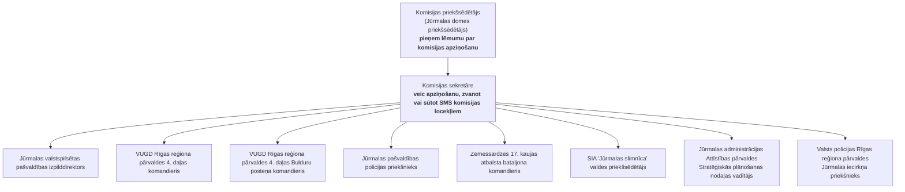

<!-- lpp. 1 -->

Pielikums Jūrmalas domes 2023. gada 26. janvāra nolikumam Nr. 1 (protokols Nr. 1, 4. punkts)

### Komisijas apziņošanas kārtība

> **Shēma (lpp. 1): Civilās aizsardzības komisijas apziņošanas kārtība**  
> Tips: lēmumu pieņemšanas un operatīvās apziņošanas struktūrshēma.  
> Avots oriģinālā: Jūrmalas domes 2023. gada 26. janvāra nolikums Nr. 1 (protokols Nr. 1, 4. punkts).

> **Skaidrojums un procesa gaita:**  
> 1. Domes priekšsēdētājs pieņem operatīvo lēmumu par CAK sasaukšanu.  
> 2. Komisijas sekretāre caur balss zvaniem un SMS paralēli apziņo visus 8 komisijas locekļus (pašvaldības vadību, policiju, glābējus, slimnīcu un bruņotos spēkus).

### Ziņas piemēri:

> [!NOTE]
> **Pārbaudes ziņojums (SMS / e-pasts):**  
> *“Notiek apziņošanas kārtības pārbaude. Lūdzu, nosūtiet apstiprinājumu par ziņas saņemšanu uz tālr.nr.20000000 norādot vārdu un uzvārdu”*

> [!IMPORTANT]
> **Sēdes sasaukšanas ziņojums (Trauksme / Operatīvā sēde):**  
> *“Tiek organizēta Jūrmalas pilsētas sadarbības teritorijas civilās aizsardzības komisijas sēde 20___.gada _____, Jomas ielā 1/5, Jūrmalā, sēžu zālē. Lūdzu, nosūtiet apstiprinājumu par ierašanos vai arī informāciju par neierašanos uz tālr.nr.20000000 norādot vārdu un uzvārdu.”*

---

### Atvērto datu validācija un nākotnes rīka iespējas
- **Adrese:** Sēžu zāle Jomas ielā 1/5, Jūrmalā — validējama pret [VZD VARIS atvērtajiem datiem](../../avoti/kadastrs/VAR_ATVERTIE_DATI_MODELIS.md) (ēkas kods: `100083049`, koordinātas: 56.9723, 23.7915).
- **Infrastruktūra un glābēji:** VUGD 4. daļas un Bulduru posteņa izvietojums sasaistāms ar VUGD atvērto datu kopu un [LVC ceļu tīklu](../../avoti/celu-tikls/PUBLISKO_DATU_IESPEJAS.md) operatīvai nokļūšanai.
- **Automatizācija nākotnes rīkam:** Iespēja nosūtīt automatizētus API SMS brīdinājumus un saņemt apstiprinājumus digitālā CA vadības panelī.
