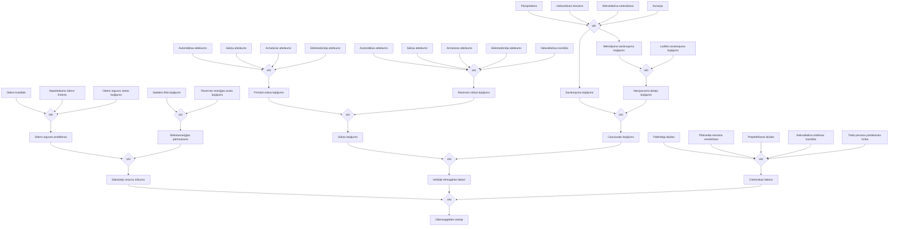
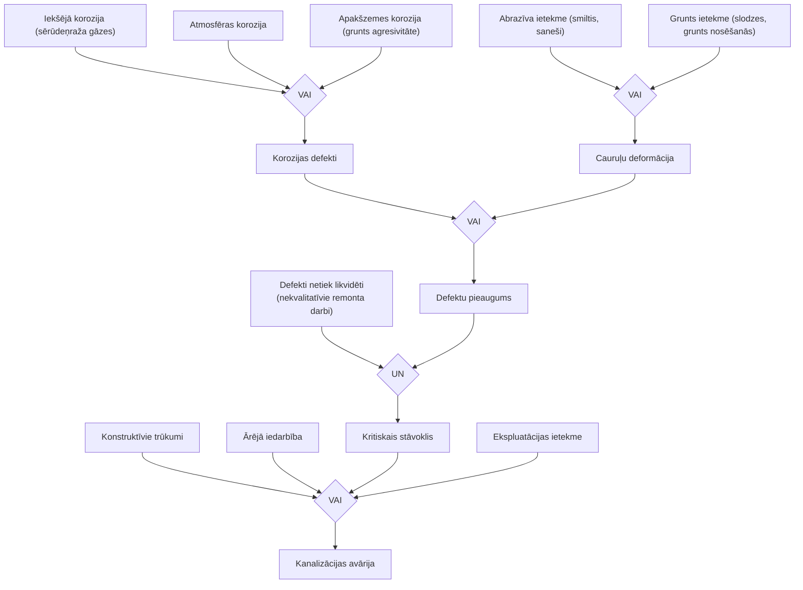

# RĪGAS VALSTSPILSĒTAS SADARBĪBAS TERITORIJAS CIVILĀS AIZSARDZĪBAS PLĀNS

## 4. pielikums: Risku scenāriji (Kļūdu koka loģiskā analīze)

> **Dokumenta sasaiste un vēsturiskā pēctecība**: Šis dokuments sākotnēji izstrādāts kā Rīgas civilās aizsardzības plāna 4. pielikums (2021. gada redakcija). Rīgas domes 2024. gada 27. marta lēmumā Nr. RD-24-3412-lē (un 2025. gada 26. marta grozījumos Nr. RD-25-4455-lē) šie paši risku scenāriji, kļūdu koki un matemātiskās formulas ir pilnībā iekļauti kā **27. pielikums** ("Risku scenāriji", lpp. 206–213). Šajā dokumentā sniegta kļūdu koku loģisko shēmu pilna semantiskā un vizuālā (Mermaid) transkripcija, kā arī risku aprēķinu matemātiskais aparāts.

---

### Simboli, kas lietoti, būvējot riska scenārijus

Avāriju riska scenāriju pamatvarbūtības noteikšanai izmantota Kļūdu loģiskās analīzes (KLA / Fault Tree Analysis) metode. Tās galvenā priekšrocība ir sistemātiski loģiska iespējamo kļūdu un atteiču apzināšana, kas var novest pie avārijas vai katastrofas. KLA ir "atpakaļejoša" deduktīva analīzes metode: analīze sākas ar augstākā līmeņa nevēlamo notikumu (Top Event), un secīgi tiek dekomponēti tā tiešie cēloņi, starpnotikumi un pamatcēloņi.

| Grafiskais apzīmējums | Simbola tips | Funkcija un matemātiskā interpretācija |
|---|---|---|
| `[ Notikums ]` (Taisnstūris) | **Ar loģiska simbola palīdzību apzīmējamais notikums** | Rodas notikumu mijiedarbībā, kas šķērso loģisko šūnu (starpnotikums vai virsotnes notikums). |
| `( Bāzes notikums )` (Aplis) | **Primārais, galvenais sākuma notikums** | Pietiekami informatīvi nodrošināts (ir empīriskas ziņas par atteices intensitāti $\lambda$), neprasa turpmākus pētījumus. |
| `< Nedalāms notikums >` (Rombs) | **Nepietiekami detalizēti izstrādāts notikums** | Nedalāms sākotnējais notikums; notikuma cēloņus sīkāk neizpēta papildu datu trūkuma dēļ. |
| `/\ UN` (Loģiskie vārti UN) | **Loģiskā zīme UN** (AND gate) | Iznākuma notikums iestājas **tikai tad, ja vienlaicīgi realizējas visi** ienākošie notikumi: $P(A) = \prod_{i=1}^n P(E_i)$. |
| `\/ VAI` (Loģiskie vārti VAI) | **Loģiskā zīme VAI** (OR gate) | Iznākuma notikums iestājas, **ja realizējas vismaz viens** no ienākošajiem notikumiem: $P(A) = 1 - \prod_{i=1}^n (1 - P(E_i))$. |

---

### 1. Riska scenārijs: Ūdensapgādes sistēmas avārija

Ūdensapgādes sistēmas avārijas virsotnes notikums iestājas, ja realizējas vismaz viens no trim galvenajiem cēloņu blokiem: sākotnējo resursu trūkums, iekšējie tehnogēnie faktori vai cilvēciskais faktors.

---

### 2. Riska scenārijs: Siltumapgādes sistēmas avārija

Siltumapgādes sistēmas avārija Rīgas centralizētajā siltumapgādes tīklā (AS "Rīgas siltums", TEC-1, TEC-2 un siltumcentrāles).

```mermaid
flowchart TD
    TOP["Siltumapgādes avārija"]
    GATE_TOP{"VAI"} --> TOP
    
    BRANCH1["Sākotnējo resursu trūkums"] --> GATE_TOP
    BRANCH2["Iekšējie tehnogēnie faktori"] --> GATE_TOP
    BRANCH3["Cilvēciskais faktors"] --> GATE_TOP
    
    %% Branch 1: Resursi
    G_B1{"VAI"} --> BRANCH1
    SUB1_1["Izejvielu piegādes pārtraukums (energoresursi)"] --> G_B1
    SUB1_2["Ūdens piegādes pārtraukums"] --> G_B1
    SUB1_3["Elektroenerģijas pārtraukums"] --> G_B1
    
    G_RES{"VAI"} --> SUB1_1
    R_INF["Bojāta piegādes infrastruktūra"] --> G_RES
    R_FIN["Naudas līdzekļu trūkums"] --> G_RES
    R_ORG["Organizatoriskās nepilnības"] --> G_RES
    
    G_WAT{"VAI"} --> SUB1_2
    W1["Ūdens kvalitāte"] --> G_WAT
    W2["Nepietiekams ūdens līmenis"] --> G_WAT
    W3["Ūdens ieguves vietas bojājums"] --> G_WAT
    
    G_EL{"UN"} --> SUB1_3
    EL1["Sadales tīkla bojājums"] --> G_EL
    EL2["Rezerves enerģijas avota bojājums"] --> G_EL
    
    %% Branch 2: Tehnogēnie faktori
    G_B2{"VAI"} --> BRANCH2
    SUB2_0["Siltumpatērējošo iekārtu atteikums"] --> G_B2
    SUB2_01["Siltumģenerējošo iekārtu atteikums"] --> G_B2
    SUB2_1["Sūkņu bojājums"] --> G_B2
    SUB2_2["Cauruļvadu bojājums"] --> G_B2
    
    G_PUMP{"UN"} --> SUB2_1
    P_PRIM["Primārā sūkņa bojājums"] --> G_PUMP
    P_REZ["Rezerves sūkņa bojājums"] --> G_PUMP
    
    G_PRIM{"VAI"} --> P_PRIM
    P1["Automātikas atteikums"] --> G_PRIM
    P2["Sūkņa atteikums"] --> G_PRIM
    P3["Armatūras atteikums"] --> G_PRIM
    P4["Elektrodzinēja atteikums"] --> G_PRIM
    
    G_REZ{"VAI"} --> P_REZ
    PR1["Automātikas atteikums"] --> G_REZ
    PR2["Sūkņa atteikums"] --> G_REZ
    PR3["Armatūras atteikums"] --> G_REZ
    PR4["Elektrodzinēja atteikums"] --> G_REZ
    PR5["Nekvalitatīva montāža"] --> G_REZ
    
    G_PIPE{"VAI"} --> SUB2_2
    PIPE_SAV["Savienojumu bojājums"] --> G_PIPE
    PIPE_DET["Neizjaucamo detaļu bojājums"] --> G_PIPE
    
    G_DET{"VAI"} --> PIPE_DET
    MET["Metinājuma savienojumu bojājums"] --> G_DET
    LOD["Lodēto savienojumu bojājums"] --> G_DET
    
    G_CAUSE{"VAI"} --> PIPE_SAV
    G_CAUSE --> MET
    C1["Pārspiediens"] --> G_CAUSE
    C2["Hidrauliskais trieciens"] --> G_CAUSE
    C3["Nekvalitatīva metināšana"] --> G_CAUSE
    C4["Korozija"] --> G_CAUSE
    
    %% Branch 3: Cilvēciskais faktors
    G_HUMAN{"VAI"} --> BRANCH3
    H1["Patērētāju kļūdas"] --> G_HUMAN
    H2["Plānveida remonta neveikšana"] --> G_HUMAN
    H3["Projektēšanas kļūdas"] --> G_HUMAN
    H4["Nekvalitatīva sistēmas montāža"] --> G_HUMAN
    H5["Trešo personu prettiesiska rīcība"] --> G_HUMAN
    H6["Nepietiekama tehniskā personāla kvalifikācija"] --> G_HUMAN
```

---

### 3. Riska scenārijs: Ēku un būvju sabrukšana

Ēku un inženierbūvju sabrukšana Rīgas pilsētvidē ar ārējo, iekšējo tehnoloģisko, būvniecības defektu un ekspluatācijas faktoru analīzi.

```mermaid
flowchart TD
    TOP["Ēku un būvju sabrukšana"]
    GATE_TOP{"VAI"} --> TOP
    
    BRANCH1["Ārējo faktoru iedarbība"] --> GATE_TOP
    BRANCH2["Tehnoloģisko procesu iedarbība"] --> GATE_TOP
    BRANCH3["Projektēšanas un būvniecības defektu iedarbība"] --> GATE_TOP
    BRANCH4["Ēku un būvju ekspluatācijas noteikumu neievērošana"] --> GATE_TOP
    
    %% Branch 1: Ārējie faktori
    G_B1{"VAI"} --> BRANCH1
    DABAS["Dabas faktori"] --> G_B1
    ANTRO["Antropogēnie faktori"] --> G_B1
    
    G_DAB{"VAI"} --> DABAS
    ATM["Atmosfēras (meteoroloģiskie):<br>Lietusgāzes, Vētra, Viesuļi, Sniegs, Apledojums, Temperatūra"] --> G_DAB
    KLIM["Klimatiskie faktori"] --> G_DAB
    GRUNT["Grunts faktori:<br>Grunts sasalšana, atkušana, gruntsūdens līmeņa svārstības"] --> G_DAB
    SEISM["Seismiskie:<br>Zemestrīce, Zemes nogruvums"] --> G_DAB
    BIOL["Bioloģiskie faktori"] --> G_DAB
    
    G_ANT{"VAI"} --> ANTRO
    A_GAS["Gāzes apgādes sistēmas avārija"] --> G_ANT
    A_FIRE["Ugunsgrēks (Sprādziens / Aizdegšanās)"] --> G_ANT
    A_DAM["Dambju un hidrotehnisko būvju pārrāvumi"] --> G_ANT
    A_TR["Transporta avārija"] --> G_ANT
    A_TER["Terora akti"] --> G_ANT
    
    %% Branch 2: Tehnoloģiskie procesi
    G_B2{"VAI"} --> BRANCH2
    T1["Agresīvo komponentu izmantošana"] --> G_B2
    T2["Tehnoloģiskais piesārņojums"] --> G_B2
    T3["Mehāniskā iedarbība:<br>Vibrācija, Pārslodze, Sitieni"] --> G_B2
    
    %% Branch 3: Projektēšana un būvniecība
    G_B3{"VAI"} --> BRANCH3
    DEF1["Noturības un stingrības zaudējums:<br>• Nekvalitatīvi materiāli<br>• Kļūda slodzes aprēķinos<br>• Montāžas kļūda<br>• Materiālu novecošanās"] --> G_B3
    DEF2["Otrās šķiras elementu bojājumi"] --> G_B3
    
    %% Branch 4: Ekspluatācija
    G_B4{"VAI"} --> BRANCH4
    E1["Patērētāju kļūdas"] --> G_B4
    E2["Plānveida remonta neveikšana"] --> G_B4
    E3["Nekvalitatīvs remonts"] --> G_B4
    E4["Ekspluatācijas noteikumu neievērošana"] --> G_B4
    E5["Trešo personu prettiesiska rīcība"] --> G_B4
    E6["Nepietiekama personāla kvalifikācija"] --> G_B4
```

#### Detalizēts ugunsgrēka izcelšanās un konstrukciju sabrukuma cēloņu klasifikators (1.–55. apakšnotikums):
1. Nepareiza VUS (viegli uzliesmojošu šķidrumu) glabāšana; 2. Gāzes noplūde; 3. VUS glabāšana un tvaiku uzkrāšanās; 4. Nenodzēsts uguns (sērkociņi); 5. Nenodzēsta cigarete; 6. Augsta vides temperatūra; 7. Dzirkstele no instrumenta (āmura) sitiena; 8. Bērnu rotaļas ar uguni; 9. Nenodzēsts atklāts uguns; 10. Nenodzēsti smēķēšanas atlikumi; 11. Elektriskais īssavienojums; 12. Neuzraudzīts ieslēgts gludeklis; 13. Sadzīves tehnikas (TV, radio) aizdegšanās; 14. Bojāta krāsns apkures sistēma; 15. Pirotehnisko izstrādājumu neuzmanīga lietošana; 16. Zibens spēriens būvē; 17. Ļaunprātīga dedzināšana (dedzināšanas akts); 18. Neizslēgta tehnoloģiskā iekārta; 19. Cauruļvadu un dūmvadu bojājumi; 20. Ēdiena gatavošanas procesā nodzēsts gāzes deglis; 21. Bērnu neuzmanīga rīcība ar gāzes krāniem; 22. Nepareiza elektroiekārtu pieslēgšana tīklam; 23. Nekvalitatīvi veikti remontdarbi; 33. Elektroinstalācijas izolācijas bojājumi mehāniska nodiluma dēļ; 34. Novecojusi kabeļu izolācija; 35. Īssavienojums no kontakta ar metāla priekšmetu; 36. Bojāta slēptā elektroinstalācija konstrukcijās; 37. Elektroierīču pārkaršana nepietiekamas ventilācijas dēļ; 38. Svešķermeņu iekļūšana elektroiekārtās; 39. Nekvalitatīva apkures iekārtu uzstādīšana; 40. Dūmvada pieslēguma hermētiskuma zudums; 41. Bez uzraudzības atstāta iekurta krāsns; 42. Krāsns pārkurināšana; 43. Degošu priekšmetu novietošana pie krāsns durtiņām; 44. Pirotehnikas lietošana iekštelpās; 45. Krāpnieciska dedzināšana apdrošināšanas atlīdzības nolūkā; 46. Personu savstarpējie konflikti un atriebība; 47. Netīša degtspējīgu materiālu aizdedzināšana; 48. Elektriskā sildītāja pārkaršana; 49. Drošības pārkāpumi elektromontāžas laikā; 50. Pārkāpumi telpu remonta laikā; 51. Naglas iedzīšana slēptajā elektrovadā; 52. Pašizgatavotu drošinātāju ("vīrīšu") lietošana; 53. Mehānisks kabeļa bojājums celtniecības laikā; 54. Nesošo konstrukciju caururbšana un pavājināšana; 55. Neuzmanīga rīcība ar atklātu uguni remontdarbos.

---

### 4. Riska scenārijs: Kanalizācijas sistēmas avārijas

Kanalizācijas cauruļvadu un kolektoru tīkla avāriju kļūdu koks Rīgas pilsētā (kopējais tīkla garums 1183 km).

---

### 5. Risku matemātiskās novērtēšanas aparāts un aprēķini

Risku kvantitatīvajai analīzei izmantotas matemātiskās formulas no plāna 27. pielikuma (lpp. 211–213), pamatojoties uz Rīgas pilsētas ilgtermiņa statistiskajiem datiem:

#### Pamatformulas:
1. **Avāriju biežums (intensitāte) gadā**:
   $$ \lambda = \frac{N}{t} \quad [1/\text{gads}] \qquad (\text{1. formula}) $$
   *kur $N$ – notikumu skaits, $t$ – periods gados.*

2. **Nosacītā avāriju intensitāte uz tīkla garumu**:
   $$ \lambda_{\text{nosacīti}} = \frac{\lambda}{L} \quad [1/(\text{km}\cdot\text{gads})] \qquad (\text{2. formula}) $$
   *kur $L$ – cauruļvadu/tīkla kopgarums kilometros.*

3. **Tehniskais risks**:
   $$ R_{\text{tehn.}} = \frac{n}{N \times \Delta t} \quad [\text{avārijas/objektu--gadi}] \qquad (\text{3. formula}) $$
   *kur $n$ – avāriju skaits, $N$ – ekspluatējamo objektu skaits, $\Delta t$ – periods gados.*

4. **Individuālais risks letālam iznākumam**:
   $$ R_{\text{ind.}} = \frac{n}{N \times \Delta t} \quad [\text{vienības/gadā}] \qquad (\text{4. formula}) $$
   *kur $n$ – bojāgājušo skaits, $N$ – iedzīvotāju skaits, $\Delta t$ – periods gados.*

---

#### Konkrētie aprēķinu rezultāti Rīgas valstspilsētai:

1. **Ūdensapgādes sistēma (SIA "Rīgas ūdens", $L = 1465\text{ km}$, $t = 11\text{ gadi}$, $N = 17$ liela mēroga avārijas)**:
   $$ \lambda = \frac{17}{11} = 1{,}54 \quad [1/\text{gads}] \qquad (\text{5. formula}) $$
   $$ \lambda_{\text{nosacīti}} = \frac{1{,}54}{1465} = 1{,}05 \times 10^{-3} \quad [1/(\text{km}\cdot\text{gads})] \qquad (\text{6. formula}) $$
   *Novērtējums: vidēja varbūtība, vidējas sekas $\rightarrow$ **Vidējs risks**.*

2. **Kanalizācijas sistēma (SIA "Rīgas ūdens", $L = 1183\text{ km}$, $t = 11\text{ gadi}$, $N = 9$ liela mēroga avārijas)**:
   $$ \lambda = \frac{9}{11} = 0{,}81 \quad [1/\text{gads}] \qquad (\text{7. formula}) $$
   $$ \lambda_{\text{nosacīti}} = \frac{0{,}81}{1183} = 6{,}85 \times 10^{-4} \quad [1/(\text{km}\cdot\text{gads})] \qquad (\text{8. formula}) $$
   *Novērtējums: zema varbūtība, vidējas sekas $\rightarrow$ **Nozīmīgs risks**.*

3. **Siltumapgādes sistēma (AS "Rīgas siltums", pilsētā $L = 818\text{ km}$, RS pārziņā $695{,}45\text{ km}$, $t = 9\text{ gadi}$, $N = 23$ avārijas)**:
   $$ \lambda = \frac{23}{9} = 2{,}55 \quad [1/\text{gads}] \qquad (\text{9. formula}) $$
   $$ \lambda_{\text{nosacīti}} = \frac{2{,}55}{818} = 3{,}12 \times 10^{-3} \approx 10^{-3} \quad [1/(\text{km}\cdot\text{gads})] \qquad (\text{10. formula}) $$
   *Novērtējums: zema varbūtība, vidējas sekas $\rightarrow$ **Nozīmīgs risks**.*

4. **Ēku un būvju sabrukšana (Rīgas būvju fonds $N = 28\,456$ ēkas, iedzīvotāji $N = 688\,631$, $t = 8\text{ gadi}$, $n = 16$ sabrukšanas/plaisu notikumi, $n = 55$ bojāgājušie)**:
   $$ R_{\text{tehn.}} = \frac{16}{28456 \times 8} = 7{,}02 \times 10^{-5} \quad [\text{avārijas/ēku--gads}] \qquad (\text{11. formula}) $$
   $$ \lambda = \frac{16}{8} = 2{,}0 \quad [1/\text{gads}] \qquad (\text{12. formula}) $$
   $$ R_{\text{ind.}} = \frac{55}{688631 \times 8} = 9{,}98 \times 10^{-6} \quad [1/\text{cilvēku--gads}] \qquad (\text{13. formula}) $$
