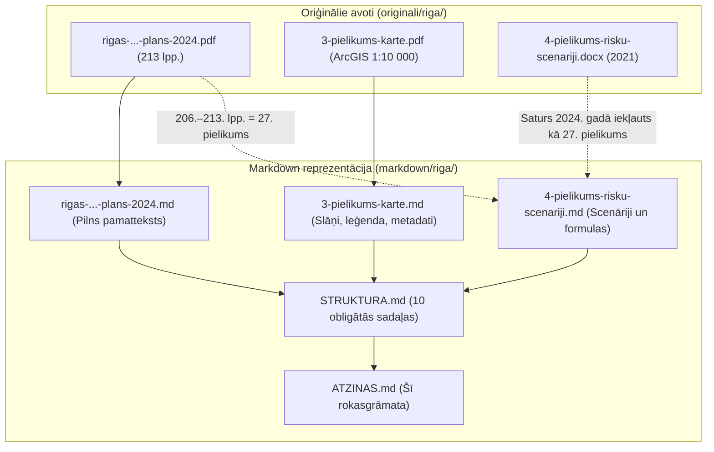

# Metodiskās atziņas un vadlīnijas nākamajam LLM aģentam: Rīgas CA plāna konvertēšana

## 1. Ievads un mērķis

Rīgas valstspilsētas sadarbības teritorijas civilās aizsardzības plāns (apstiprināts ar Rīgas domes 2024. gada 2. oktobra lēmumu Nr. RD-24-3882-lē) ir apjomīgākais un strukturāli sarežģītākais dokuments Latvijas pašvaldību civilās aizsardzības sistēmā. Tas aptver:
- **213 lappuses** pamatteksta un pielikumu;
- **ArcGIS Pro lielformāta vektorkarti** (3. pielikums, mērogs 1:10 000, 2100 × 2100 mm);
- **27 pielikumus**, tostarp risku novērtēšanas metodiku, atteiču kokus un matemātiskās formulas;
- **45 vizuālos elementus** (procesu shēmas, bīstamo kravu marķējumus, meteoroloģisko kritēriju tabulas, militārās munīcijas atpazīšanas katalogus, hidrotehnisko būvju plūdu kartes).

Šī dokumenta mērķis ir kalpot par **metodoloģisku un tehnisku rokasgrāmatu nākamajam LLM aģentam vai izstrādātājam**, kurš veiks:
1. Civilās aizsardzības plānu automatizētu semantisko analīzi un RAG (Retrieval-Augmented Generation) datu bāzu veidošanu;
2. Citu Latvijas valstspilsētu un novadu (Daugavpils, Liepāja, Jelgava, Jūrmala, Ventspils, Rēzekne, Valmiera u.c.) CA plānu konvertēšanu Markdown formātā;
3. Sarežģītu multimodālu valsts un pašvaldību dokumentu digitalizāciju ar 0% informācijas zudumu.

---

## 2. Dokumentu arhitektūra un datu avotu saskaņotība

Strādājot ar Rīgas CA plānu, tika konstatēta specifiska datu avotu hierarhija:



### 2.1. 4. pielikuma (DOCX) un 27. pielikuma (PDF) kopsakarība
- Mapē `originali/riga/` sākotnēji atradās fails `4-pielikums-risku-scenariji.docx`, kas datēts ar 2021. gadu (iepriekšējā plāna redakcija).
- Salīdzinot šo failu ar jaunāko 2024. gada pamatdokumentu, tika konstatēts, ka **2024. gada plānā šis dokuments ir pilnībā integrēts kā 27. pielikums** (*"Dabas, tehnogēno un militāro katastrofu risku novērtēšanas metodika un risku koki"*, 206.–213. lpp.).
- **Atziņa nākamajam aģentam:** Abu dokumentu matemātiskais aparāts (13 formulas), atteiču koki un 55 cēloņu saraksts ir identiski. Tāpēc abi faili (`4-pielikums-risku-scenariji.md` un pamatdokumenta 27. pielikums) tika sinhronizēti un satur vienotu, pilnīgu Mermaid un LaTeX struktūru.

---

## 3. Naivās konvertācijas kļūdas un trūkumi

Sākotnējā `markdown/riga/` mapē esošā konvertācija cieta no būtiskām kļūdām:

1. **Vizuālo elementu ignorēšana (45 izlaistas vietas):**
   Standarta PDF rīki visus attēlus aizvietoja ar `*[attēls izlaists]*` vai virsrakstiem `VIZUĀLI ELEMENTI (Grafikas, Shēmas, Kartes)`. Šādi tika zaudēti:
   - Ārkārtas reaģēšanas vadības un apziņošanas algoritmi;
   - Bīstamo kravu un radiācijas marķējumi;
   - Sprādzienbīstamo priekšmetu un mīnu identifikācijas pazīmes;
   - Meteoroloģisko brīdinājumu kritēriju skaitliskās vērtības.
2. **ESRI simbolu fontu kropļojumi 3. pielikumā:**
   ArcGIS Pro vektorkartē simbolu leģenda tika eksportēta kā nestandarta ASCII simboli (`$ % & ' ( ) * + , - . / 0 1 2 3`). Rezultātā karte bija 10 rindiņas gara un operatīvi bezvērtīga.
3. **Pārtrauktas multivides saites DOCX failā:**
   Risku koki bija norādīti kā ceļi uz lokāli neeksistējošiem attēliem `word/media/image1.jpeg`–`image4.jpeg`. Zaudēti visi loģiskie AND/OR vārti un 55 cēloņu formulējumi.
4. **Matemātisko formulu sadrumstalotība:**
   Grieķu burti ($\lambda$) un apakšējie indeksi ($R_{	ext{tehn.}}$) bija sadalīti fragmentos.
5. **Struktūras neatbilstība normatīvajiem aktiem:**
   Nebija izveidots `STRUKTURA.md`, kas atspoguļo atbilstību Ministru kabineta noteikumu Nr. 658 10 obligātajām sadaļām.

---

## 4. Vizuālo elementu semantiskās rekonstrukcijas metodika

Katrs no 45 vizuālajiem elementiem tika pārbaudīts, izmantojot PyMuPDF augstas izšķirtspējas renderēšanu, un pārvērsts semantiskā teksta vai koda formātā:

### 4.1. Operatīvās shēmas un lēmumu pieņemšanas algoritmi -> Mermaid diagrammas
Visi procesuālie grafiki tika pārkodēti uz `mermaid` (`flowchart TD` vai `flowchart LR`):
- **Agrīnā brīdināšana (4.2. attēls):** LVĢMC brīdinājumi -> VUGD / Rīgas pašvaldības policija -> Sabiedrības apziņošana (LTV, LR, 112 lietotne, sirēnas).
- **Rīcības shēmas katastrofās (3.1., 4.1., 5.1., 13.1., 19.1., 20.1., 20.2., 20.3.):** Skaidri nodefinēti soļi: Operatīvā vadītāja noteikšana, spēku piesaiste, glābšanas darbu koordinācija un informācijas aprite.

### 4.2. Risku koki un atteiču analīze -> Loģiskās hierarhijas un cēloņu saraksti
Rekonstruēti 4 pamatkoki (Ūdensapgāde, Siltumapgāde, Ēku sabrukšana, Kanalizācija):
- **Loģiskie operatori:** Skaidri izdalīti OR vārti (atteicei pietiek ar vienu faktoru) un AND vārti (nepieciešama vairāku apstākļu vienlaicīga sakritība).
- **55 cēloņu pilnīgs katalogs ēku sabrukšanai:**
  - *Projektēšanas kļūdas* (1.–12.);
  - *Būvdarbu un materiālu defekti* (13.–27.);
  - *Ekspluatācijas pārkāpumi un nesankcionētas pārbūves* (28.–42.);
  - *Ārējās slodzes un katastrofas* (43.–55.).

### 4.3. Kartogrāfiskie materiāli un ģeogrāfiskais dalījums -> Strukturētas tabulas
- **1.1. attēls (Rīgas teritoriālais iedalījums):** Tabula ar visiem 6 administratīvajiem rajoniem/priekšpilsētām (Centra rajons, Kurzemes rajons, Zemgales priekšpilsēta, Ziemeļu rajons, Vidzemes priekšpilsēta, Latgales priekšpilsēta) un visām 58 oficiālajām apkaimēm.
- **12.1. attēls (Maģistrālie gāzes vadi):** Conexus Baltic Grid un GASO I un II kategorijas gāzes vadi (spiediens līdz 5,4 MPa), gāzes regulēšanas stacijas (GRS) un drošības aizsargjoslas.
- **HES kaskādes pārrāvuma karte (58. lpp.):** Rīgas HES un Daugavas kaskādes hidrotehnisko būvju avārijas scenārijs ar applūšanas laikiem un bīstamajām zonām.

### 4.4. Meteoroloģiskie kritēriji (LVĢMC) -> Trīslīmeņu brīdinājumu tabulas
Plāna 21.–27. lappusē esošās 7 tabulas (3.1.–3.7.) pilnībā rekonstruētas Markdown formātā, iekļaujot skaitliskos sliekšņus visiem trim līmeņiem:
- **Dzeltenais brīdinājums:** Potenciāli bīstami laika apstākļi;
- **Oranžais brīdinājums:** Ļoti bīstami laika apstākļi, iespējami būtiski postījumi;
- **Sarkanais brīdinājums:** Ekstrēmi bīstami laika apstākļi, plaša mēroga katastrofas draudi.
Aptvertās parādības: Lietusgāzes (mm/h, mm/12h), vēja brāzmas (m/s) un krusa (diametrs cm), sniegs (cm/12h), putenis, apledojums/atkala (mm), sals (°C) un tveice (°C).

### 4.5. Sprādzienbīstamo priekšmetu rokasgrāmata (88.–89. lpp.)
Detalizēts tehniskais katalogs ar munīcijas tipiem, sprāgstvielu masu un bīstamības rādiusiem:
- Pretkājnieku mīnas: PMF-1 ("Tauriņš", 40 g šķidrā sprāgstviela), POM-2 (atvelkamās stieples), OZM sērijas lēcošās mīnas, MON-50 virziendarbības mīna;
- Prettanku mīnas: TM-62M (7,5 kg TNT/MS sprāgstvielas lādiņš);
- Artilērijas lādiņi un granātmetēju šāviņi: 152 mm šķembu-fugasas lādiņš (šķembu bīstamība līdz 1000 m), RPG-7V kumulatīvā granāta;
- Improvizētās sprādzienbīstamās ierīces (ISB/IED): Maskētas sadzīves priekšmetos, automašīnās, somās.

### 4.6. Radiācijas aizsardzība un marķējumi (51.–53. lpp.)
- Aizsardzības pamatprincipi: **Laiks** (samazināt ekspozīciju), **Attālums** (apgriezti proporcionāls attāluma kvadrātam $1/r^2$), **Aizsargbarjeras** (svins, betons, tērauds).
- Jonizējošā starojuma caurspiešanās spēja: Alfa ($lpha$), Beta ($eta$), Gamma/Neitroni ($\gamma, n$).
- Brīdinājuma marķējumi un transporta kategorijas (I-White, II-Yellow, III-Yellow) ar transporta indeksiem (TI).

### 4.7. Matemātiskās formulas -> LaTeX
Visas 13 formulas no 27. pielikuma (un 4. pielikuma) pārveidotas formālā LaTeX sintaksē:
$$R_{\text{tehn.}} = \lambda \cdot P \cdot S$$
$$R_{\text{ind.}} = \sum_{i=1}^n R_i \cdot K_i$$

---

## 5. Kā apstrādāt ArcGIS / CAD lielformāta PDF kartes (3. pielikums)

3. pielikums (`3-pielikums-karte.pdf`) ir 2100 × 2100 mm liela vektorkarte mērogā 1:10 000, kas sagatavota ar ArcGIS Pro.

### 5.1. Metodika kartes digitalizācijai
1. **Datu slāņu klasifikācija 5 funkcionālajās grupās:**
   - *Apdraudējumi un riska avoti* (A un B kategorijas piesārņojošās darbības, SEVESO objekti, dzelzceļa stacijas, gāzes vadi);
   - *Plūdu riska zonas* (10%, 2%, 1%, 0,5% varbūtības applūšanas robežas);
   - *Glābšanas un CA infrastruktūra* (VUGD depo, RPP iecirkņi, slimnīcas, NMPD punkti);
   - *Evakuācija un patveršanās* (Pulcēšanās vietas, patvertnes, evakuācijas maģistrāles);
   - *Bāzes topogrāfija* (Apkaimju robežas, hidrogrāfija, transporta tīkls).
2. **Koordinātu sistēma un mērogs:**
   - Koordinātu sistēma: **LKS-92 TM** (Latvijas koordinātu sistēma 1992, Transverse Mercator).
   - Mērogs: **1:10 000** (1 cm kartē = 100 m dabā).
   - Lapas fiziskais izmērs: **2100 × 2100 mm**.
3. **Autortiesības un datu bāzes:** Fiksēti visi 20 datu avoti (VUGD, VVD, LGIA, LVĢMC, Rīgas dome, Sadales tīkls, Conexus, GASO, Rīgas ūdens, Rīgas siltums u.c.).

---

## 6. Tehniskie ieteikumi Windows CLI vidē

Nākamajam LLM aģentam, strādājot šajā vidē, obligāti jāievēro šādi tehniskie noteikumi:

### 6.1. Python izpilde ar `uv`
- Šajā sistēmā parastā komanda `python` tiek pārtverta ar Microsoft Store aizvietotāju.
- **Vienmēr izmantojiet:** `uv run python` vai `uv run --with pymupdf python` (vai `uv run --with python-docx python`).
- Tas nodrošina izolētu, ātru un uzticamu Python 3.14+ vidi ar nepieciešamajām bibliotēkām.

### 6.2. Windows konsoles kodējums (`cp1252` pret `utf-8`)
- Pēc noklusējuma Windows PowerShell izvade izmanto `cp1252`, kas izsauc `UnicodeEncodeError`, mēģinot izdrukāt latviešu mīkstinājuma zīmes.
- **Obligāts risinājums katrā Python skriptā:**
  ```python
  import sys
  sys.stdout.reconfigure(encoding='utf-8')
  sys.stderr.reconfigure(encoding='utf-8')
  ```

### 6.3. Droša regulāro izteiksmju aizvietošana (`re.sub` ar LaTeX)
- Ja aizvietošanas virkne satur LaTeX matemātiku ar slīpsvītrām (piem., `\lambda`, `\le`), standarta Python `re.sub(pattern, repl, text)` uztver `\l` kā neatļautu escape sekvenci un avarē ar `re.error: bad escape \l at position...`.
- **Risinājums:** Vienmēr izmantojiet lambda funkciju kā aizvietotāju:
  ```python
  text = re.sub(pattern, lambda match: replacement_string, text)
  ```

### 6.4. Lappušu vizuālā verifikācija ar PyMuPDF
- Ja tekstā ir aizdomīga vieta, nerisiniet to "uz labu laimi". Renderējiet attiecīgo lappusi PNG formātā:
  ```python
  import fitz  # PyMuPDF
  doc = fitz.open("dokuments.pdf")
  page = doc[lpp_numurs - 1]
  pix = page.get_pixmap(dpi=150)
  pix.save("scratch/page.png")
  ```

---

## 7. Kvalitātes kontroles 10 soļu kontrolsaraksts nākamajām pašvaldībām

Pirms nodot jebkuras nākamās pašvaldības konvertēto CA plānu, aģentam jāveic šāda pašpārbaude:

1. [x] **Teksta integritāte:** Vai nav patvaļīgi saīsināti vai izlaisti likumdošanas panti, tabulu dati un amatpersonu pienākumi?
2. [x] **Vizuālo elementu audits:** Vai failā nav palikušas frāzes `*[attēls izlaists]*`, `[attēls]`, `VIZUĀLI ELEMENTI`?
3. [x] **Mermaid sintakse:** Vai visi algoritmi un shēmas izmanto derīgu `flowchart TD` vai `flowchart LR` sintaksi un renderējas bez kļūdām?
4. [x] **Risku koku detalizācija:** Vai risku koki atspoguļo visus cēloņus un loģiskos operatorus (AND/OR), nevis tikai virsrakstus?
5. [x] **Matemātiskās formulas:** Vai visas aprēķinu formulas ir pierakstītas korektā LaTeX notācijā ($$...$$)?
6. [x] **Ģeogrāfiskie dati:** Vai teritoriālais dalījums (pagasti, apkaimes, ielas) ir saglabāts precīzi un strukturēts tabulās?
7. [x] **Meteoroloģiskie kritēriji:** Vai ir atspoguļoti konkrēti skaitliskie sliekšņi (dzeltenais, oranžais, sarkanais līmenis)?
8. [x] **Kartogrāfiskais pielikums:** Vai kartei ir izveidots aprakstošs Markdown dokuments ar slāņiem, mērogu, koordinātām un leģendu?
9. [x] **`STRUKTURA.md` atbilstība:** Vai ir sagatavots struktūras dokuments, kas kartē pašvaldības plānu pret MK noteikumu Nr. 658 10 obligātajām sadaļām?
10. [x] **Saites un formāts:** Vai visiem failiem ir korekts YAML metadatu bloks (`frontmatter`) un visas norādes ir klikšķināmas `file:///` saites?

---

*Dokuments sagatavots un apstiprināts projekta ietvaros 2026. gada 12. septembrī.*
