<!-- lpp. 1 -->

Apstiprināts ar Rīgas domes 27.03.2024. lēmumu Nr. RD-24-3412-lē  
(Rīgas domes 26.03.2025. lēmuma Nr. RD-25-4455-lē redakcijā)

# RĪGAS VALSTSPILSĒTAS SADARBĪBAS TERITORIJAS CIVILĀS AIZSARDZĪBAS PLĀNS

<!-- lpp. 2 -->

2

### Saturs

|IEVADS ......................................................................................................................................... 7 I SADAĻA ..................................................................................................................................... 8 1. Pašvaldības administratīvi teritoriālais raksturojums ............................................................. 8 2. Blakus esošo pašvaldību sadarbības teritorijas civilās aizsardzības komisijas ....................... 9 3. Risku scenāriji un riska matricas .......................................................................................... 11 II SADAĻA .................................................................................................................................. 15 Apdraudējumu apraksts, rīcība katastrofu gadījumā .................................................................... 15 1. Zemestrīce ............................................................................................................................. 16 2. Zemes nogruvums ................................................................................................................. 17 3. Lietusgāzes, ilgstošas lietavas, pērkona negaiss un krusa, sniegs un putenis, apledojums un|
|---|
|slapja sniega nogulums, stiprs sals, karstums, sausums ........................................................ 18 4. Pali, plūdi un vējuzplūdi ....................................................................................................... 29 5. Vētras (vēja brāzmas), viesuļi, krasas vēja brāzmas ............................................................. 37 6. Meža un kūdras purvu ugunsgrēki ........................................................................................ 42 7. Epidēmija, pandēmija ........................................................................................................... 43 8. Epizootijas ............................................................................................................................. 45 9. Epifitotijas ............................................................................................................................. 45 10. Bīstamo ķīmisko vielu noplūde objektā ................................................................................ 47 11. Avārija naftas produktu cauruļvada transporta infrastruktūrā .............................................. 47 12. Avārija dabasgāzes apgādes sistēmā ..................................................................................... 48 13. Radiācijas avārijas ................................................................................................................ 49 14. Bioloģisko vielu negadījumi ................................................................................................. 55 15. Ugunsgrēki ............................................................................................................................ 56 16. Avārijas vai negadījumi ostu un jūras hidrotehniskajās inženierbūvēs ................................ 57 17. Dambju un citu hidrotehnisko būvju pārrāvumi – Daugavas hidroelektrostaciju kaskādes|
|hidrobūve .............................................................................................................................. 57 18. Pārvades un sadales elektrotīklu bojājumi ............................................................................ 58 19. Būvju sabrukums .................................................................................................................. 59 20. Bīstamo ķīmisko vielu noplūde no kuģiem, kuģa uzskriešana uz sēkļa, kuģu sadursme,|
|pasažieru kuģu katastrofa (20. pielikums) ............................................................................ 62 21. Autotransporta avārija ........................................................................................................... 72 22. Dzelzceļa transporta katastrofa ............................................................................................. 74 23. Sabiedriskās nekārtības, iekšējie nemieri.............................................................................. 74 24. Terora akti ............................................................................................................................. 75 25. Ieteikumi par rīcību militārā iebrukuma vai kara gadījumā .................................................. 77 26. Kiberdrošība un kiberapdraudējumi.................................................................................... 101 III SADAĻA .............................................................................................................................. 102 Iedzīvotāju evakuācija no katastrofas apdraudētajām vai skartajām teritorijām, ņemot vērā|
|attiecīgā apdraudējuma iespējamās sekas ........................................................................... 102 1. Evakuācijas veids ................................................................................................................ 102 2. Pulcēšanās vietas ................................................................................................................. 103 3. Evakuācijas maršruti ........................................................................................................... 105 4. Transporta nodrošinājums ................................................................................................... 106 5. Pagaidu izmitināšana .......................................................................................................... 106 6. Evakuēto uzskaite ............................................................................................................... 106 7. Evakuēto ēdināšana, sociālā aprūpe .................................................................................... 106 8. Evakuēto īpašumu apsardze ................................................................................................ 106 9. Sadarbība ar citām pašvaldībām evakuēto uzņemšanas jomā ............................................. 107|

<!-- lpp. 3 -->

3

Termini un saīsinājumi

|Termini un saīsinājumi||
|---|---|
|||
||mērķtiecīga un nekavējoties veicama cilvēku un atbildīgo institūciju|
|Agrīna brīdināšana||
||informēšana par katastrofu vai katastrofas draudiem un nepieciešamo rīcību|
|||
|||
||tādu pasākumu kopums, kuri tiek veikti, lai pēc iespējas savlaicīgi un samērīgi|
|Atjaunošanas||
||palīdzētu cietušajiem cilvēkiem un pēc iespējas atjaunotu vidi un īpašumu tādā|
|pasākumi||
||stāvoklī,kāds tas bijapirms katastrofas|
|||
||kravas, kas savu īpašību dēļ var izraisīt sprādzienu, ugunsgrēku vai citus|
|Bīstama krava||
||postījumus, kā arī apdraudēt cilvēku dzīvību vai veselību|
|||
||ķīmiska viela vai produkts, kas tai piemītošo fizisko, ķīmisko vai toksikoloģisko|
|Bīstama viela|īpašību vai fiziskā stāvokļa dēļ var radīt kaitējumu cilvēka dzīvībai vai veselībai,|
|| dzīvniekiem un videi|
||tādu organizatorisku, inženiertehnisku, ekonomisku, finansiālu, sociālu,|
||izglītojošu un zinātnisku pasākumu kopums, kurus īsteno valsts un pašvaldību|
|Civilā aizsardzība||
||institūcijas un sabiedrība, lai nodrošinātu cilvēku, vides un īpašuma drošību, kā|
|||
||arī īstenotu atbilstošu rīcību katastrofas un katastrofas draudugadījumā|
|Civilās aizsardzības|dokuments, kurš sagatavots, ņemot vērā risku novērtējumu, un kurā noteikti|
|plāns|katastrofas pārvaldīšanas pasākumi un to īstenotāji|
||sistēma, kas nodrošina iedzīvotāju brīdināšanu un informēšanu par katastrofām|
|Civilās trauksmes un||
||vai to draudiem, kā arī par ārkārtējās situācijas, izņēmuma stāvokļa vai|
|apziņošanas sistēma||
||mobilizācijas izsludināšanu|
|||
||ģeofiziskās (zemestrīces, zemes nogruvumi), hidroloģiskās (pali, plūdi, ledus|
||sastrēgumi), meteoroloģiskās (lietusgāzes, krusa, sniega sanesumi, vētras,|
|Dabas katastrofas|viesuļi), klimatoloģiskās (stiprs sals vai karstums, apledojums, sausums, mežu|
|| un kūdras purvu ugunsgrēki), bioloģiskās (epidēmijas, epizootijas, epifitotijas),|
||kosmiskās(meteorītu nokrišana, ģeomagnētiskās vētras)katastrofas|
||procedūra, ar ko veic veselības aizsardzības pasākumus, lai likvidētu|
||sabiedrības veselību apdraudošu infekciozu vai toksisku aģentu vai vielu|
|Dekontaminācija||
||klātbūtni uz cilvēka vai dzīvnieka ķermeņa virsmas, patēriņam sagatavotā|
|||
||produktā vai uz tā,uz citiempriekšmetiem,tostarptransportlīdzekļiem|
||radioaktīvo vielu savākšana, lai samazinātu radioaktīvo piesārņojumu uz visu|
|Dezaktivācija|veidu virsmām, organismā, materiālos, vides objektos, pārtikas produktos,|
||dzīvnieku barībā un dzeramajā ūdenī|
||procedūra, ar ko, tieši iedarbojoties ķīmiskiem, bioloģiskiem vai fizikāliem|
|Dezinfekcija|aģentiem, veic veselības aizsardzības pasākumus, lai kontrolētu vai iznīcinātu|
||uz visu veidu virsmām esošos infekcijas izraisītājus|
||pārvietošanās norādītajā drošajā virzienā vai pārvietošana uz drošu vietu pirms|
|Evakuācija|katastrofas vai katastrofas laikā no teritorijas vai telpas, kur izveidojušies apstākļi|
||rada apdraudējumu cilvēku dzīvībai un veselībai|
|||
||tādu pasākumu kopums, kuri tiek veikti, lai sagatavotos katastrofas gadījumā|
|Gatavības pasākumi||
||nepieciešamajai rīcībai|
|||
||reaģēšanas pasākumu un seku likvidēšanas pasākumu kopumā ietilpstoši|
|Glābšanas darbi||
||pasākumi|
|||
||amatpersona ar speciālo dienesta pakāpi, kas vada ugunsgrēka dzēšanu un|
|Glābšanas darbu vadītājs||
||glābšanas darbus|
|||

<!-- lpp. 4 -->

4

||ražotāja izveidotas ierīces, iekārtas un sistēmas, kas sastāv no vairākiem|
|---|---|
|Individuālie aizsardzības|atsevišķiem izstrādājumiem un paredzētas lietotāja aizsardzībai pret risku, ko|
|līdzekļi| rada viens vai vairāki kaitīgi vai bīstami vides faktori|
|||
||ierīces, radioaktīvās vielas, kodolmateriāli, radioaktīvie atkritumi vai iekārtas,|
|Jonizējošā starojuma|kas spēj ģenerēt jonizējošo starojumu vai no neradioaktīviem materiāliem radīt|
|avoti| radioaktīvās vielas, tos apstarojot ar daļiņām vai augstas enerģijas gammas|
||starojumu|
|||
||notikums, kas izraisījis cilvēku upurus un apdraud cilvēku dzīvību vai veselību,|
||nodarījis kaitējumu vai radījis apdraudējumu cilvēkiem, videi vai īpašumam, kā|
|Katastrofa|arī radījis vai rada būtiskus materiālos un finansiālos zaudējumus un pārsniedz|
||atbildīgo valsts un pašvaldību institūciju ikdienas spējas novērst notikuma|
|||
||postošos apstākļus|
||tādu vadītu un koordinētu preventīvo, gatavības, reaģēšanas, seku likvidēšanas|
|Katastrofu pārvaldīšana|pasākumu, kā arī atjaunošanas pasākumu kopums, kuri tiek veikti, lai|
||nodrošinātu civilās aizsardzības uzdevumu izpildi|
|||
||situācija, kad risku novērtējums, prognozes, informācija vai citi apstākļi pamatoti|
|Katastrofas draudi||
||liecinapar katastrofas iespējamību|
|||
||notikums ar ķīmisku vielu noplūdi no tehnoloģiskām iekārtām vai bojātām|
|Ķīmiskā avārija||
||tilpnēm|
|||
||valsts un pašvaldību institūciju rīcības saskaņošana, veicot preventīvos,|
|Koordinēšana| gatavības, reaģēšanas, seku likvidēšanas pasākumus, kā arī atjaunošanas|
||pasākumus|
|||
||palīdzība, ko cietušajiem (saslimušajiem) dzīvībai vai veselībai bīstamā kritiskā|
|Neatliekamā medicīniskā||
||stāvoklī sniedz šādiem gadījumiem īpaši sagatavotas (apmācītas, ekipētas)|
|palīdzība||
||personas ar atbilstošu kvalifikāciju medicīnā|
|||
||ēkas vai inženierbūves, kuras tiek izmantotas saimnieciskā vai citā veidā, kas|
||saistīts ar enerģijas ražošanu un uzkrāšanu, elektromagnētisko starojumu,|
|Paaugstinātas bīstamības|ugunsnedrošu, sprādzienbīstamu, bīstamu ķīmisku vielu un maisījumu, bīstamo|
|objekts|atkritumu, augu karantīnas organismu, bioloģiski aktīvu un radioaktīvu vielu,|
||kodolmateriālu un atkritumu pārstrādi, apstrādi, ražošanu, lietošanu, uzglabāšanu|
|||
||un transportēšanu|
||palīdzība, ko cietušajiem (saslimušajiem) dzīvībai vai veselībai kritiskā stāvoklī|
|Pirmā palīdzība|savu zināšanu un iespēju apjomā sniedz personas ar kvalifikāciju medicīnā vai|
||bez tās neatkarīgi no sagatavotības un ekipējuma|
|||
||tādu pasākumu kopums, kuri tiek veikti, lai novērstu vai mazinātu katastrofas|
|Preventīvie pasākumi||
||draudus|
|||
||uzturs, mājoklis, veselības aprūpe, medicīniskā palīdzība, elektroapgāde,|
|Pamatvajadzības| ūdensapgāde, siltumapgāde, atkritumu un notekūdeņu savākšana, sakaru|
||nodrošinājums|
|||
||notikums, kā rezultātā valstī vai ārpus tās teritorijas konstatēts radiācijas līmenis,|
||kas būtiski pārsniedz ilggadējo mērījumu rezultātā konstatēto radiācijas fona|
|Radiācijas avārija||
||līmeni un var tikt pārsniegti apstarojuma dozu limiti, apdraudot iedzīvotāju|
||veselību|
||tādu pasākumu kopums, kuri tiek veikti, lai mazinātu vai likvidētu postošos|
|Reaģēšanas pasākumi| apstākļus un to izraisītās sekas, novērstu vai mazinātu kaitējumu cilvēkiem, videi|
||un īpašumam|
|||

<!-- lpp. 5 -->

5

||operatīvie un avārijas dienesti, mobilizējamie civilās aizsardzības formējumi,|
|---|---|
||valsts materiālās rezerves, pašvaldības un komercsabiedrības rīcībā esošie|
|Resursi||
||krājumi, līdzekļi un to avoti, kurus iesaista katastrofu pārvaldīšanas pasākumu|
||veikšanā vai katastrofu seku likvidēšanas neatliekamajos pasākumos|
|Rīgas valstspilsētas|koordinējoša un konsultatīva institūcija, kuras darbības mērķis ir koordinēt|
|sadarbības teritorijas|civilās aizsardzības pasākumus katastrofu un to draudu gadījumā, kā arī veicināt|
|civilās aizsardzības|civilās aizsardzības jautājumu risināšanu Rīgas valstspilsētas pašvaldības|
|komisija|administratīvajā teritorijā|
||tādu pasākumu kopums, kuri tiek veikti, lai nodrošinātu vismaz minimālās|
|Seku likvidēšanas||
||iedzīvotāju pamatvajadzības, kas saistītas ar cilvēku izdzīvošanu, un apturētu vai|
|pasākumi||
||mazinātu veselības, vides un īpašuma apdraudējumu|
|||
|AES|Atomelektrostacija|
|ANO|Apvienoto Nāciju Organizācija|
|AIC|Rīgas Apkaimju iedzīvotāju centrs|
|AIM|Aizsardzības ministrija|
|ĀM|Ārlietu ministrija|
|BVKB|Būvniecības valsts kontroles birojs|
|CA|civilā aizsardzība|
|CAK|Rīgas valstspilsētas sadarbības teritorijas civilās aizsardzības komisija|
|CAOIP|Rīgas valstspilsētas pašvaldības Centrālās administrācijas Civilās aizsardzības|
||un operatīvās informācijaspārvalde|
|CA OVC|Civilās aizsardzības Operacionālās vadības centrs|
|CSDD|VAS “Ceļu satiksmes drošības direkcija”|
|EM|Ekonomikas ministrija|
|FM|Finanšu ministrija|
|HES|Hidroelektrostacija|
|IAL|individuālie aizsardzības līdzekļi|
|IEM|Iekšlietu ministrija|
|IEM IC|Iekšlietu ministrijas Informācijas centrs|
|IeVP|Ieslodzījumu vietu pārvalde|
|IZM|Izglītības un zinātnes ministrija|
|JA|VSIA “Latvijas Jūras administrācija”|
|KEM|Klimata un enerģētikas ministrija|
|KLA|kļūdu loģiskās analīzes metode|
|KM|Kultūras ministrija|
|LAD|Lauku atbalsta dienests|
|LM|Labklājības ministrija|
|LVC|valsts sabiedrība ar ierobežotu atbildību "Latvijas Valsts ceļi"|
|LVĢMC|VSIA “Latvijas Vides, ģeoloģijas un meteoroloģijas centrs”|
|LVMI Silava|Latvijas Valsts mežzinātnes institūts “Silava”|
|MK|Ministru kabinets|
|MRCC|Jūras meklēšanas un glābšanas koordinācijas centrs|
|NBS|Nacionālie bruņotie spēki|

<!-- lpp. 6 -->

6

|NBS JS KAD|Nacionālo bruņoto spēku Jūras spēku Krasta apsardzes dienests|
|---|---|
|NMP|neatliekamā medicīniskā palīdzība|
|NMPD|Neatliekamās medicīniskās palīdzības dienests|
|NVA|Nodrošinājuma valsts aģentūra|
|NVD|Nacionālais veselības dienests|
|NVO|nevalstiskās organizācijas|
|Pašvaldība|Rīgas valstspilsētas pašvaldība|
|PTAC|Patērētāju tiesību aizsardzības centrs|
|PVD|Pārtikas un veterinārais dienests|
|RAKUS|SIA "Rīgas Austrumu klīniskā universitātes slimnīca"|
|RD|Rīgas dome|
|RVPP|Rīgas valstspilsētas pašvaldības policija|
|SPKC|Slimību profilakses un kontroles centrs|
|SM|Satiksmes ministrija|
|TNGIIB|Transporta nelaimes gadījumu un incidentu izmeklēšanas birojs|
|TM|Tieslietu ministrija|
|VAAD|Valsts augu aizsardzības dienests|
|VARAM|Viedās administrācijas un reģionālās attīstības ministrija|
|VCAP|Valsts civilās aizsardzības plāns|
|VDD|Valsts drošības dienests|
|VDI|Valsts darba inspekcija|
|VI|Veselības inspekcija|
|VID|Valsts ieņēmumu dienests|
|VM|Veselības ministrija|
|VMD|Valsts meža dienests|
|VMR|valsts materiālās rezerves|
|VP|Valsts policija|
|VPVB|Vides pārraudzības valsts birojs|
|VRS|Valsts robežsardze|
|VRS ARCC|Aviācijas meklēšanas un glābšanas koordinācijas centrs|
|VSIA ZMNĪ|VSIA “Zemkopības ministrijas nekustamie īpašumi”|
|VUGD|Valsts ugunsdzēsības un glābšanas dienests|
|VVD|Valsts vides dienests|
|VVD RDC|Valsts vides dienesta Radiācijas drošības centrs|
|ZM|Zemkopības ministrija|
|ZVA|Zāļu valsts aģentūra|

<!-- lpp. 7 -->

7

### IEVADS

Rīgas iedzīvotāju drošība ir atkarīga no valsts, pašvaldību, komersantu un iestāžu spējām īstenot pasākumus avārijas, katastrofas vai ārkārtējas situācijas gadījumā, kā arī pašu iedzīvotāju sagatavotības līmeņa un savstarpējās sadarbības starp iedzīvotājiem, pašvaldības un valsts struktūrām . Viens no svarīgākajiem valsts pastāvēšanas un attīstības priekšnosacījumiem ir iespējamo apdraudējumu apzināšana un risku novērtējums. Ārkārtējo situāciju un katastrofu pārvaldība ieņem svarīgu un nozīmīgu vietu valsts drošības sistēmā, kura tiek regulēta ar daudzu normatīvo aktu un plānošanas dokumentu palīdzību, un to galvenais uzdevums ir nodrošināt valsts un sabiedrības drošību, labklājību un stabilu attīstību.

CA sistēma ir nacionālās drošības sistēmas sastāvdaļa, kuru veido valsts un pašvaldību institūcijas, juridiskās un fiziskās personas, kam ir likumā noteiktas tiesības, uzdevumi un atbildība CA jomā.

Rīgas valstspilsētas sadarbības teritorijas CA plāns ir CA sistēmas plānošanas dokuments, kas sagatavots, ņemot vērā risku novērtējumu, un kurā noteikti Pašvaldības administratīvajā teritorijā iespējamās katastrofas pārvaldīšanas pasākumi un to īstenotāji.

Rīgas valstspilsētas sadarbības teritorijas CA plāns izstrādāts saskaņā ar MK 17.11.2017. noteikumu Nr. 658 “Noteikumi par civilās aizsardzības plānu struktūru un tajos iekļaujamo informāciju” prasībām.

CA plānā apkopota informācija par iespējamajiem apdraudējuma veidiem, to avotiem, kaitīgās izpausmes veidiem un riska līmeni Rīgā. Rīgas valstspilsētas sadarbības teritorijas CA plānā uzskaitītie iespējamie riski (zemi, vidēji, augsti un ļoti augsti) novērtēti, ņemot vērā VCAP norādīto informāciju. Katastrofu, kuras saistītas ar ēku un būvju sabrukšanu, avāriju siltumapgādes, ūdensapgādes vai kanalizācijas sistēmā, risku novērtēšana veikta, izmantojot kvantitatīvo un kvalitatīvo novērtēšanas metodi. Matemātiskās modelēšanas ietvaros tika izmantotas šādas metodes un paņēmieni: riska analīze, loģiski grafiskā metode – kļūdu koku izveide, attēlojot notikuma scenārijus. Matemātiskā modelēšana ietver dažādu matemātisko izteiksmju, ģeometrisko terminu kopējo sistēmu, kas matemātiskā veidā atspoguļo vai imitē vissvarīgākās bīstamo parādību īpašības ar mērķi analizēt un prognozēt to iestāšanās varbūtību, attīstību un sekas.

<!-- lpp. 8 -->

8

### I SADAĻA

## 1. Pašvaldības administratīvi teritoriālais raksturojums

1. Administratīvi teritoriālais sadalījums:

1.1. Rīga ir Latvijas Republikas galvaspilsēta. Rīgas vēsturiskais centrs ir iekļauts UNESCO Pasaules kultūras mantojuma sarakstā[1; 2] ;

1.2. Rīgas teritorija ir 307,17 km[2] , t. sk.  apdzīvojamās platības 67,00 km[2] (21,8 %); rūpnieciskās platības 52,45 km[2] (17 %); ielas un ceļi 24,64 km[2] (8 %); parki 57,54 km[2] (19 %); ūdens platības 48,50 km[2] (15 %); lidlauka teritorijas 2,86 km[2] (0,9 %)[3] ; 1.3. Pašvaldības administratīvā teritorija sadalīta atbilstošās 59 administratīvi teritoriālajās vienībās[4] :

1.3.1. Rīgas Centra rajons – 3 km[2] (Centra rajons sadalīts 2 apkaimēs – Centrs un Vecpilsēta);

1.3.2. Rīgas Kurzemes rajons – 79 km[2] (12 apkaimes: Āgenskalns, Kleisti, Bolderāja, Ķīpsala, Daugavgrīva, Rītabuļļi (Buļļi), Dzirciems, Spilve, Iļģuciems, Voleri, Imanta, Zasulauks);

1.3.3. Rīgas Latgales priekšpilsēta – 50 km[2] (9 apkaimes: Avoti, Dārzciems, Dārziņi, Grīziņkalns (daļēji Vidzemes priekšpilsētā), Ķengarags, Latgales apkaime, Pļavnieki, Rumbula, Šķirotava);

1.3.4. Rīgas Vidzemes priekšpilsēta – 57 km[2] (11 apkaimes: Berģi, Brasa, Brekši, Bukulti, Dreiliņi, Jugla, Mežciems, Purvciems, Skanste (daļēji Ziemeļu rajonā), Suži (daļēji Ziemeļu rajonā), Teika);

1.3.5. Rīgas Zemgales priekšpilsēta – 41 km[2] (13 apkaimes: Āgenskalns, Pleskodāle, Atgāzene, Salas, Beberbeķi, Šampēteris, Bieriņi, Torņakalns, Bišumuiža, Ziepniekkalns, Katlakalns, Zolitūde, Mūkupurvs);

1.3.6. Rīgas Ziemeļu rajons – 77 km[2] (12 apkaimes: Čiekurkalns (daļēji Vidzemes priekšpilsētā), Jaunciems, Kundziņsala, Mangaļsala, Mežaparks, Mīlgrāvis, Pētersala – Andrejsala, Sarkandaugava, Trīsciems, Vecāķi, Vecdaugava, Vecmīlgrāvis).[1]

1Administratīvi teritoriālais iedalījums https://apkaimes.lv/karte/.

<!-- lpp. 9 -->

9

1.1. attēls “Pašvaldības administratīvi teritoriālais iedalījums”

2. Iedzīvotāju skaits un blīvums:

- 2.1. Rīgā atbilstoši 2022. gada Centrālās statistikas pārvaldes datiem dzīvo

605 802 iedzīvotāji;

2.2. iedzīvotāju blīvums, kas atkarīgs no iedzīvotāju skaita un pilsētas platības, ir 2241,85 cilvēki uz km[2] ;

- 2.3. iedzīvotāju skaita sadalījums pa Rīgas rajoniem un priekšpilsētām:

- 2.3.1. Centra rajons – 31 378 (67 iedzīvotāji/ha);

2.3.2. Latgales priekšpilsēta – 164 521 (40 iedzīvotāji/ha);

- 2.3.3. Ziemeļu rajons – 64 516 (9 iedzīvotāji/ha);

- 2.3.4. Vidzemes priekšpilsēta – 147 181 (26 iedzīvotāji/ha);

- 2.3.5. Zemgales priekšpilsēta – 100 402 (25 iedzīvotāji/ha);

- 2.3.6. Kurzemes rajons – 128 304 (16 iedzīvotāji/ha).[2]

3. Pašvaldības administratīvajā teritorijā izvietoti divi cietumi: Rīgas Centrālcietums un Iļģuciema cietums. Ieslodzījuma vietās ieslodzīti 1068 cilvēki.[3]

## 2. Blakus esošo pašvaldību sadarbības teritorijas civilās aizsardzības komisijas

1. Blakus esošo pašvaldību sadarbības teritorijas CA komisiju saraksts apkopots atbilstoši informācijai MK 26.09.2017. noteikumos Nr. 582 “Noteikumi par pašvaldību sadarbības teritorijas civilās aizsardzības komisijām” (informāciju skatīt 2.1. tabulā).

> 2 Iedzīvotāji, iedzīvotāju blīvums https://apkaimes.lv/karte/.

> 3 IeVP dati par 2023.gada septembri.

> **Karte (lpp. 9): 1.1. attēls “Pašvaldības administratīvi teritoriālais iedalījums”**  
> Tips: Rīgas administratīvo rajonu un apkaimju shēmas karte. Avots oriģinālā: apkaimes.lv/karte/.  
> **Kartes apraksts:** Kartē attēlots Rīgas valstspilsētas administratīvais iedalījums 6 administratīvajās teritorijās (rajonos un priekšpilsētās) un 58 vēsturiskajās apkaimēs:  
> - **Centra rajons** (Centrs, Vecrīga);  
> - **Kurzemes rajons** (Bolderāja, Daugavgrīva, Dzirciems, Iļģuciems, Imanta, Kleisti, Spilve, Voleri, Zasulauks, Āgenskalns ziemeļu daļa);  
> - **Zemgales priekšpilsēta** (Āgenskalns, Atgāzene, Bieriņi, Bišumuiža, Katlakalns, Mūkupurvs, Pleskodāle, Salas, Šampēteris, Torņakalns, Ziepniekkalns, Zolitūde);  
> - **Ziemeļu rajons** (Čiekurkalns, Jaunciems, Kundziņsala, Mangaļsala, Mežaparks, Mīlgrāvis, Pētersala-Andrejsala, Sarkandaugava, Trīsciems, Vecāķi, Vecdaugava, Vecmīlgrāvis);  
> - **Vidzemes priekšpilsēta** (Berģi, Brasa, Brekši, Bukulti, Dreiliņi, Jugla, Mežciems, Purvciems, Skanste, Suži, Teika);  
> - **Latgales priekšpilsēta** (Avoti, Dārzciems, Dārziņi, Grīziņkalns, Ķengarags, Maskavas forštate, Pļavnieki, Rumbula, Šķirotava).  
> Piezīme: Kartē iezīmētas arī robežas ar kaimiņu novadiem: Jūrmalas valstspilsētu, Mārupes novadu, Olaines novadu, Ķekavas novadu, Salaspils novadu, Ropažu novadu un Ādažu novadu.

<!-- lpp. 10 -->

10

Blakus esošo pašvaldību sadarbības teritorijas CA komisiju saraksts

2.1. tabula

|||Pašvaldības, kuras veido||
|---|---|---|---|
||Sadarbības teritorijas|||
|Nr.||sadarbības teritorijas||
||   civilās aizsardzības||Kontakti|
|p.k.|| civilās aizsardzības||
|| komisijas nosaukums|||
|||komisiju||
|||||
||Jūrmalas sadarbības teritorijas civilās aizsardzības komisija|Jūrmalas pilsēta|Jomas iela 1/5, Jūrmala, LV-2015 pasts@jurmala.lv +371 67093816|
|1.||||
|||||
||Mārupes sadarbības teritorijas civilās aizsardzības komisija|Mārupes novads|Daugavas iela 29, Mārupe, LV-2167 marupe@marupe.lv +371 67934695|
|2.||||
|||||
||Olaines sadarbības teritorijas civilās aizsardzības komisija|Olaines novads|Zemgales iela 33, Olaine, LV-2114 pasts@olaine.lv +371 67964333|
|3.||||
|||||
||Ķekavas sadarbības teritorijas civilās aizsardzības komisija|Ķekavas novads|Gaismas iela 19 k-9–1, Ķekava, LV-2123 novads@kekava.lv +371 67935803|
|4.||||
|||||
||Salaspils sadarbības teritorijas civilās aizsardzības komisija|Salaspils novada pašvaldība|Līvzemes iela 8, Salaspils, LV-2169 dome@salaspils.lv +371 66954846|
|5.||||
|||||
||Ulbrokas sadarbības teritorijas civilās aizsardzības komisija|Ulbroka ir apdzīvota vieta Pierīgā, Ropažu novada un Stopiņu pagasta administratīvais centrs| Institūta iela 1A, Ulbroka, LV-2130 novada.dome@ropazi.lv +371 66954851|
|6.||||
|||||
||Ādažu sadarbības teritorijas civilās aizsardzības komisija|Ādažu novads|Gaujas iela 33A, Ādaži, LV-2164 dome@adazi.lv +371 29486570|
|7.||||
|||||

<!-- lpp. 11 -->

11

## 3. Risku scenāriji un riska matricas

1. Avāriju seku iedarbības novērtējumā un statistikas datos izskatīti iespējamās avārijas scenāriji ar plašāko avāriju seku nelabvēlīgās iedarbības izplatību un ietekmi Rīgas pilsētā.

2. Riska scenāriju pamatvarbūtības noteikšanai tika izmantotas matemātiskās formulas.

3. Lai skaitliski novērtētu nevēlamā notikuma atgadīšanās varbūtību, visbiežāk izmanto KLA metodi. Tās galvenā priekšrocība ir sistemātiski loģiskā iespējamo kļūdu, kas var novest pie avārijas, apzināšana.

4. Kļūdu loģiskā analīze ir “atpakaļejoša” analīzes metode, jo analīze sākas ar potenciālo avāriju un tālāk tiek noteikti šī notikuma tiešie cēloņi. KLA tiek attēlota KLA diagrammas veidā, kas atspoguļo notikumu loģisko sakarību no pamatcēloņiem līdz avārijai.

5. Kļūdu loģiskā diagramma atspoguļo avārijas (katastrofas) priekšnosacījumu, ierosinātājnotikumu un tiem sekojošās notikumu ķēdes loģisko saikni, respektīvi sniedz kvalitatīvu vērtējumu par analizējamo objektu.

6. KLA diagramma savā veidā veido notikumu attīstības variantu jeb riska scenārija grafisko attēlu.

7. Lai iegūtu kvantitatīvu (skaitlisku) informāciju, katras KLA diagrammas elements jāraksturo ar tā atgadīšanās varbūtību. Nosakot varbūtību, var balstīties uz statistiskajiem datiem par analoģisku elementu, kas darbojas līdzīgos apstākļos, drošuma rādītājiem: vidējais nebojājamības laiks, atteikuma intensitāte u. c.

8. Metodes pamatā ir elementārnotikumu loģisko saišu noskaidrošana. Metode ir analītiski atpakaļejoša. Analīzi sāk, definējot galveno nevēlamo notikumu, tālāk nosakot pirmās, otrās un tālākas pakāpes starpnotikumu loģiskās saites līdz ierosinātājnotikumam.

9. KLA diagramma veidojas, saistot riska scenārija elementārnotikumus ar loģiskiem simboliem “un” vai “vai”. Avāriju riska scenāriji, izmantojot kļūdu koka loģisko analīzi, grafiski attēloti 27. pielikumā.

10. Izmantojot kļūdu koka loģisko analīzi, izbūvējot iespējamos riska scenārijus, detalizēti apskatīti dažādu veidu avāriju scenāriji, kas var novest līdz katastrofai, loģiskās analīzes ietvaros izbūvēta sliktāko scenāriju attīstības loģika.

11. Riska novērtējumam tika izmantotas formulas (27. pielikums).

12.  Tiek ieviesta katastrofu zaudējumu uzskaites sistēma – KaZa (ikdienas incidentu

uzskaite):

12.1. informācijas iesniegšana par incidentiem Pašvaldības administratīvajā teritorijā

<!-- lpp. 12 -->

12

notiek saskaņā ar CAK 18.09.2023. sēdes protokolu Nr. CAK-23-3-pro “Par katastrofu/incidentu pārvaldību Pašvaldībā”;

12.2. izpilde notiek pastāvīgi saskaņā ar operatīvā ziņojuma par incidentiem (OZI) veidlapu;

12.3. par izpildi atbildīgā institūcija ir CAOIP;

12.4. izpildītāji ir Pašvaldības institūcijas, Rīgas teritorijā izvietotie uzņēmumi, namu pārvaldnieki, CAOIP.

<!-- lpp. 13 -->

13

3.1. attēls “Katastrofu risku kopsavilkums”

### 3.1. attēls “Katastrofu risku kopsavilkums” (Risku matrica 5x5)

| Varbūtības / ticamības līmenis ↓ | Maznozīmīgs risks (Maznozīmīgas sekas) | Nozīmīgs risks (Nozīmīgas sekas) | Vidējs risks (Vidējas sekas) | Augsts risks (Smagas sekas) | Ļoti augsts risks (Katastrofālas sekas) |
|---|---|---|---|---|---|
| **Ļoti augsts** | — | Meža un kūdras purvu ugunsgrēki | Epizootijas | — | — |
| **Augsts** | — | — | Pali un plūdi Karstums Apledojums | Epidēmijas | — |
| **Vidējs** | Autotransporta avārija | Pārvades elektrotīklu bojājumi Dzelzceļa transporta katastrofa | Stiprs sals Lietusgāzes un ilgstošas lietavas Pērkona negaiss un krusa Viesuļi Sausums **Ūdensapgādes sistēmas avārija** | Vējuzplūdi Sadales elektrotīklu bojājumi Vētras un krasas vēja brāzmas Ugunsgrēki ēkās un būvēs | — |
| **Zems** | — | Epifitotijas | Avārija dabasgāzes apgādes sistēmā Pasažieru kuģa katastrofa Bīstamo ķīmisko vielu noplūde objektā Slapja sniega nogulums **Avārijas kanalizācijas sistēmā** **Avārijas siltumapgādes sistēmā** | — | Hidrotehnisko būvju pārrāvumi – Daugavas HES Bīstamo ķīmisko vielu noplūde no kuģiem |
| **Ļoti zems** | Zemes nogruvumi Zemestrīces Sabiedriskās nekārtības | Terora akti Iekšējie nemieri Radiācijas avārija Kuģa uzskriešana uz sēkļa | Avārijas naftas produktu cauruļvada transporta infrastruktūrā Avārijas vai negadījumi ostu un jūras hidrotehniskajās inženierbūvēs Kuģu sadursme **Būvju sabrukšana** | Bioloģisko vielu negadījums Aviācijas nelaimes gadījums ar gaisa kuģi | — |

*Piezīme: Treknrakstā izceltie 4 apdraudējumi (**Ūdensapgādes sistēmas avārija**, **Avārijas kanalizācijas sistēmā**, **Avārijas siltumapgādes sistēmā**, **Būvju sabrukšana**) ir detalizēti analizēti ar Kļūdu loģiskās analīzes (KLA) koku metodi plāna 27. pielikumā.*

<!-- lpp. 14 -->

14

13. Risku novērtēšana (ēku un būvju sabrukšana, avārija siltumapgādes, ūdensapgādes, notekūdeņu vai kanalizācijas sistēmā), riska novērtējuma pamatnostādnes:

13.1. riska novērtēšanai tiek izmantota ārkārtējas situācijas riska varbūtības noteikšanas matemātiskā modelēšana, kur ietilpst vairāki darba posmi, kuru apraksts un aprēķini sniegti turpmāk;

13.2. pirmais posms ir ārkārtējas situācijas apraksts, kas tiek sastādīts, izmantojot esošās zināšanas par apdraudējumu un iepriekš notikušo negadījumu izpēti, konsultējoties ar ekspertiem, kā arī izpētot zinātnisko literatūru;

13.3. otrajā posmā tiek izpildīta saturiskā formalizācija, matemātiskā uzdevuma sagatavošana, izmantojot visus nepieciešamos izejas datus un meklējamos lielumus;

13.4. trešajā posmā formalizētā ārkārtējas situācijas shēma tiek pārveidota par matemātisko modeli, tādējādi visa informācija tiek izteikta, izmantojot matemātisko aparātu, t. sk.  nevienādojumus, algoritmus u. tml.;

13.5. ceturtajā posmā tiek analizēts pats modelis, ar invariācijas aprēķiniem tiek pētītas modeļa īpašības un modeļa uzvedība noteiktajos apstākļos – pēc tā tiek noteikts modeļa adekvātums, vai tas atbilst reāliem parametriem, un notiek ārkārtējas situācijas riska līmeņa prognozēšana;

13.6. viena un tā pati situācija var būt aprakstīta, izmantojot dažādus modeļus. Tas saistīts ar to, ka pastāv vairāki matemātisko modeļu veidi, dažādas detalizācijas pakāpes un pētījuma precizitātes kritēriji;

13.7. riska novērtēšanai ūdensapgādes, kanalizācijas sistēmas, siltumapgādes avārijām, ēku un būvju sabrukšanai parasti tiek izmantota kvantitatīvā novērtēšanas metode; 13.8. matemātiskās modelēšanas ietvaros tika izmantotas šādas metodes un paņēmieni: riska analīze, loģiski grafiskā metode – kļūdu koku izveide, attēlojot notikuma scenārijus;

13.9. riska situāciju raksturojums balstīts uz  kapitālsabiedrību – akciju sabiedrības “RĪGAS SILTUMS”, SIA “Rīgas ūdens” – un Rīgas pilsētas būvvaldes sniegtajiem statistikas datiem par laika periodu no 2010. gada līdz 2019. gadam;

13.10. visi turpmāk apskatītajā riska novērtējumā lietotie dati iegūti, izmantojot iepriekšējos kvantitatīvā riska analīzes rezultātus;

13.11. avāriju seku iedarbības novērtējumā un statistikas datos ir izskatīti avārijas scenāriji ar plašāko avāriju seku nelabvēlīgās iedarbības izplatību un ietekmi.

<!-- lpp. 15 -->

15

### II SADAĻA

### Apdraudējumu apraksts, rīcība katastrofu gadījumā

II.1.tabula “Pašvaldības administratīvajā teritorijā iespējamo apdraudējumu saraksts un katastrofas pārvaldīšanas atbildīgā institūcija”

|Nr. p.k.|Apdraudējumi|Katastrofas pārvaldīšanas institūcija|
|---|---|---|
||Dabas katastrofas (ģeofiziskās)||
|1.|Zemestrīces|Iekšlietu ministrija|
|2.|Zemes nogruvumi|Iekšlietu ministrija|
||Dabas katastrofas (hidroloģiskās)||
|3.|Pali un plūdi|Viedās administrācijas un reģionālās attīstības ministrija|
|4.|Vējuzplūdi|Viedās administrācijas un reģionālās attīstības ministrija|
||Dabas katastrofas (meteoroloģiskās)||
|5.|Lietusgāzes (ilgstošas lietavas, pērkona negaiss) un krusa|Viedās administrācijas  un reģionālās attīstības ministrija|
|6.|Vētras (vēja brāzmas), krasas vēja brāzmas|Viedās administrācijas  un reģionālās attīstības ministrija|
|7.|Viesuļi|Viedās administrācijas  un reģionālās attīstības ministrija|
||Dabas katastrofas (klimatoloģiskās)||
|8.|Stiprs sals, sniegs, putenis, apledojums, slapja sniega nogulums|Viedās administrācijas  un reģionālās attīstības ministrija|
|9.|Karstums|Viedās administrācijas  un reģionālās attīstības ministrija|
|10.|Apledojums|Viedās administrācijas un reģionālās attīstības ministrija|
|11.|Sausums|Zemkopības ministrija|
|12.|Meža un kūdras purvu ugunsgrēki|Zemkopības ministrija|
||Dabas katastrofas (bioloģiskās)||
|13.|Epidēmijas, pandēmijas|Veselības ministrija|
|14.|Epizootijas|Zemkopības ministrija|
|15.|Epifitotijas|Zemkopības ministrija|
||Tehnogēnās (antropogēnās) katastrofas||
|16.|Bīstamo ķīmisko vielu noplūde objektā|Viedās administrācijas  un reģionālās attīstības ministrija|
|17.|Avārijas naftas produktu cauruļvada transporta infrastruktūrā|Satiksmes ministrija|
|18.|Avārija dabasgāzes apgādes sistēmā|Klimata un enerģētikas ministrija|
|19.|Radioaktīvo vielu avārija objektā|Viedās administrācijas un reģionālās attīstības ministrija|
|20.|Bioloģisko vielu negadījumi|Veselības ministrija|
|21.|Ugunsgrēki būvēs|Iekšlietu ministrija|

<!-- lpp. 16 -->

16

||16||
|---|---|---|
|22.|Dambju un citu hidrotehnisko būvju pārrāvumi – Daugavas hidroelektrostaciju kaskādes hidrobūve|Klimata un enerģētikas ministrija|
|23.|Avārijas vai negadījumi ostu un jūras hidrotehniskajās inženierbūvēs|Satiksmes ministrija|
|24.|Sadales elektrotīklu bojājumi un pārvades elektrotīklu bojājumi|Klimata un enerģētikas ministrija|
|25.|Būvju sabrukums|Iekšlietu ministrija|
|26.|Bīstamo ķīmisko vielu noplūde no kuģiem|Aizsardzības ministrija|
|27.|Kuģa uzskriešanas uz sēkļa|Aizsardzības ministrija|
|28.|Kuģu sadursme|Aizsardzības ministrija|
|29.|Pasažieru kuģu katastrofa|Aizsardzības ministrija|
|30.|Autotransporta avārija|Satiksmes ministrija|
|31.|Aviācijas nelaimes gadījums ar gaisa kuģi|Satiksmes ministrija Aizsardzības ministrija|
|32.|Dzelzceļa transporta katastrofa|Satiksmes ministrija|
|33.|Sabiedriskās nekārtības|Iekšlietu ministrija|
|34.|Terora akti|Iekšlietu ministrija|
|35.|Iekšējie nemieri|Iekšlietu ministrija|

## 1. Zemestrīce

1. Tektonisko zemestrīču izcelsme ir saistīta ar aktīviem tektoniskiem lūzumiem Zemes garozā. Latvijā Zemes garozā tektonisko lūzumu ir relatīvi daudz, piemēram, Liepājas–Rīgas–Pleskavas tektoniskā zona šķērso Latvijas teritoriju virzienā no DA uz ZA no Liepājas līdz Valmierai un turpinās uz austrumiem Pleskavas virzienā. Tomēr zemestrīces var rasties tikai tad, ja lūzumi ir tektoniski aktīvi. Tektoniskā zemestrīce ir aktīva tektoniskā lūzuma pazīme: aktīva tektoniska lūzuma rajonā notiek zemestrīce, kad tektoniski spriegumi Zemes garozā pārsniedz iežu izturību. Tādējādi, lai gan Latvijā eksistē relatīvi maza seismiskā aktivitāte, tomēr ir iespējamas arī spēcīgas zemestrīces.  Pamatieži ir pārklāti ar biezu kvartāra nogulumu slāni un ievērojamu daļu nogulumiežu veido irdeni un ūdens piesātināti nogulumieži. Satricinājumi šādas zemestrīces epicentrā var sasniegt 6–6,5 balles pēc EMS-98 skalas. Zemestrīču cilmvietas parasti saistītas ar aktīviem tektoniskiem lūzumiem. Latvijas teritorijā tektoniskie lūzumi eksistē, bet to aktivitāte nav daudz pētīta.

2. Vislielākā bīstamība zemestrīcēs ir sekundārie efekti, jo tie nes lielākus zaudējumus galvenokārt blīvi apdzīvotās vietās ar būvkonstrukcijām, kas nav pietiekami izturīgas.

3. Pamatojoties uz Latvijas seismiskās bīstamības pētījumu rezultātiem, ir pamats uzskatīt par ticamu zemestrīces rašanās scenāriju ar ne mazāk kā 5,2 magnitūdām pēc Rihtera skalas. Šāda stipruma zemestrīces var izraisīt ēku sienu bojājumus, plaisas, zemes nogruvumus, spēcīgas vibrācijas, dažādu objektu krišanu.

4. Spēcīgām zemestrīcēm ir raksturīgas un iespējamas šādas sekas: ēku un būvju

sagruvumi, cietušie, bojāgājušie, bojātas inženierkomunikācijas (gāzes apgāde,

<!-- lpp. 17 -->

17

elektroapgāde, siltumapgāde, ūdens apgāde), hidroelektrostaciju dambju pārrāvumi, plūdi.

5. Ņemot vērā to, ka Baltijas reģionā eksistē relatīvi maza seismiskā aktivitāte, Latvijā zemestrīce ir vērtējama kā notikums ar maznozīmīgu risku.[4]

6. Preventīvie, gatavības, reaģēšanas un seku likvidēšanas pasākumi zemestrīces gadījumā (1.pielikums).

## 2. Zemes nogruvums

1. Klimatu pārmaiņu rezultātā aizvien biežāk ir novērojamas intensīvas lietusgāzes un citi ekstremāli laikapstākļi, kā rezultātā gruntsūdeņu ietekme, erozija un augsnes sašķidrināšanās var izraisīt zemes nogruvumus.

2. Zemes nogruvums  ir ģeoloģiska parādība, kuras laikā dažādu faktoru ietekmē notiek iežu vai augsnes nobrukšana. Šie nogruvumi var notikt ūdenstilpju krastos, kā arī jebkur, kur ir augsts reljefa pacēlums. Zemes nogruvumi var būt vairāku veidu – tajos var nogrūt dažādas nobiras, dubļi, akmeņi un.

3. Zemes nogruvums ir vērtējams kā notikums ar maznozīmīgu risku.[5]

4. Preventīvie, gatavības, reaģēšanas un seku likvidēšanas pasākumi zemes nogruvuma gadījumā (2.pielikums).

> 4 Ministru kabineta 26.08.2020. rīkojuma Nr. 476 “Par Valsts civilās aizsardzības plānu” 2. pielikums.

> 5 Ministru kabineta 26.08.2020. rīkojuma Nr. 476 “Par Valsts civilās aizsardzības plānu” 3. pielikums.

<!-- lpp. 18 -->

18

## 3. Lietusgāzes, ilgstošas lietavas, pērkona negaiss un krusa, sniegs un putenis, apledojums un slapja sniega nogulums, stiprs sals, karstums, sausums

Sadaļas saturs:

- A. Ieteikumi personām, kuras uzturas Pašvaldības  administratīvajā teritorijā

- B. Katastrofas/apdraudējuma vispārējais raksturojums

- C.   Izmantotās literatūras saraksts

### A. Ieteikumi personām, kuras uzturas Pašvaldības administratīvajā teritorijā

1. Ieteicamā rīcība lietusgāžu, ilgstošu lietavu, pērkona negaisa un krusas, sniega un puteņa, apledojuma un slapja sniega noguluma, stipra sala, karstuma, sausuma gadījumā.

2. Lietusgāzes un ilgstošas lietavas:

- 2.1. klausies meteorologu brīdinājumus, seko situācijas attīstībai;

- 2.2. ievēro dienestu, iestāžu norādījumus un ieteikumus;

- 2.3. ja ir iespējams, paliec vai uzturies telpās;

- 2.4. ja atrodies ārā, meklē kur patverties (ēkā);

- 2.5. izvairies no braukšanas ar mehanizētiem un nemehanizētiem

transportlīdzekļiem vai piestāj malā spēcīgu lietusgāžu gadījumā.

   3. Pērkona negaisa un lielgraudu krusas gadījumā:

   - 3.1. klausies meteorologu brīdinājumus, seko situācijas attīstībai;

   - 3.2. ievēro dienestu, iestāžu norādījumus un ieteikumus;

   - 3.3. ja ir iespējams, paliec vai uzturies telpās;

   - 3.4. ja atrodies ārā, meklē kur patverties (ēkā);

   - 3.5. izvairies no braukšanas ar mehanizētiem un nemehanizētiem

- transportlīdzekļiem vai meklē, kur patverties ar transportu krusas gadījumā.

   4. Spēcīga snigšana un putenis:

   - 4.1. klausies meteorologu brīdinājumus, seko situācijas attīstībai;

   - 4.2. ievēro dienestu, iestāžu norādījumus un ieteikumus;

   - 4.3. ja ir iespējams, paliec vai uzturies telpās;

   - 4.4. ja atrodies ārā, meklē kur patverties (ēkā);

- 4.5. izvairies no braukšanas ar mehanizētiem un nemehanizētiem

- transportlīdzekļiem vai piestāj malā spēcīgas snigšanas vai puteņa gadījumā.

   5. Stiprs apledojums:

   - 5.1. klausies meteorologu brīdinājumus, seko situācijas attīstībai;

   - 5.2. ievēro dienestu, iestāžu norādījumus un ieteikumus;

   - 5.3. ja ir iespējams, paliec vai uzturies telpās;

   - 5.4. ja atrodies ārā, pārvietojies lēni un prātīgi;

- 5.5. pārvietojoties izvērtē maršrutu, lai pēc iespējas mazāk būtu koku, elektrības

- vadu un citu lietu, kas no sasaluma varētu lūzt un krist;

   - 5.6. izvairies no braukšanas ar mehanizētiem un nemehanizētiem

<!-- lpp. 19 -->

19

transportlīdzekļiem, izvēlies piemērotu braukšanas ātrumu vai piestāj malā stipra apledojuma gadījumā.

   6. Stiprs sals:

   - 6.1. klausies meteorologu brīdinājumus, seko situācijas attīstībai;

   - 6.2. ievēro dienestu, iestāžu norādījumus un ieteikumus;

   - 6.3. paliec mājās vai uzturies telpās;

   - 6.4. ejot ārā, saģērbies atbilstoši laikapstākļiem (siltas un ērtas drēbes un apavi);

- 6.5. pārvietojoties izvērtē maršrutu, lai pēc iespējas mazāk būtu koku, elektrības

- vadu un citu lietu, kas no sasaluma varētu lūzt un krist.

   7. Karstums:

   - 7.1. klausies meteorologu brīdinājumus, seko situācijas attīstībai;

   - 7.2. ievēro dienestu, iestāžu norādījumus un ieteikumus;

- 7.3. centies atrasties vēdinātās/atdzesētās dzīvojamās un darba telpās. Dabisko

- vēdināšanu (atverot logus) vislabāk veikt vakarā, naktī. Dienas laikā aizvērt un aizklāt logus, lai samazinātu telpu sakaršanu;

- 7.4. dodoties ārā, velc gaišas, vieglas, “elpojošas” drēbes. Lai nepieļautu galvas

- sakaršanu, lieto gaišu plāna auduma galvassegu;

- 7.5. uzņem šķidrumu vairāk nekā parasti. Nelieto alkoholu, stipru kafiju un tēju, jo

- šie dzērieni pastiprina dehidratāciju – ķermeņa atūdeņošanos.

8. Liels sausums – nekurināt ugunskurus un neizmest izsmēķus mežos, pļavās un

citur, kur var izcelties ugunsgrēks.

   9. Iedzīvotāju brīdināšana un informēšana (skatīt II.3.1.attēlu):

II.3.1.attēls

- 9.1. seko līdzi atbildīgo dienestu mājaslapās:

- 9.1.1. Valsts ugunsdzēsības un glābšanas dienests – www.vugd.gov.lv; 9.1.2. VSIA “Latvijas Vides, ģeoloģijas un meteoroloģijas centrs” –

www.videscentrs.lvgmc.lv;

- 9.2. seko līdzi sociālajā tīklā _Facebook_ :

- 9.2.1. Valsts ugunsdzēsības un glābšanas dienests;

- 9.2.2. VSIA “Latvijas Vides, ģeoloģijas un meteoroloģijas centrs”;

- 9.3. seko līdzi sociālajā tīklā _X_ :

9.3.1. Valsts ugunsdzēsības un glābšanas dienests – @ugunsdzeseji;

> **Informatīvais paziņojums (lpp. 19): II.3.1. attēls. Iedzīvotāju brīdināšana un informēšana**  
> **IZDZIRDOT TRAUKSMES SIRĒNAS VAI APZIŅOŠANU AR SKAĻRUŅIEM:**  
> - **IESLĒDZ TV**: Latvijas Televīzija (LTV1, LTV7);  
> - **IESLĒDZ RADIO**: Latvijas Radio (LR1, LR2, LR4).  
> *Seko līdzi atbildīgo dienestu oficiālajai informācijai www.vugd.gov.lv un www.videscentrs.lvgmc.lv.*

<!-- lpp. 20 -->

20

9.3.2. VSIA “Latvijas Vides, ģeoloģijas un meteoroloģijas centrs” –

@VSIA_LVGMC;

9.4. seko līdzi sociālajā tīklā _Instagram –_ Valsts ugunsdzēsības un glābšanas dienests – ugunsdzēsēji.

### B. Katastrofas/apdraudējuma vispārējais raksturojums

1. Lietus izraisīto ietekmi var raksturot divos dažādos mērogos:

1.1. ilgstošs periods (nedēļas līdz pat mēneši). Latvijā ilgstoša lietus raksturošanai un sabiedrības brīdināšanai izmanto nokrišņu daudzumu 12 stundu periodā, kā stipru lietu definējot apstākļus, ja šajā periodā nolīst 20–39 mm, ļoti stipru – 40–59 mm, bet bīstami jeb ekstremāli stipru – ja šādā periodā nolīst 60 mm un vairāk;

1.2. īslaicīgs, bet intensīvs lietus. Parasti tas tiek novērots gada siltajā sezonā, sevišķi vasarā, to bieži pavada pērkona negaiss, iespējama arī krusa. Šādos apstākļos īsā periodā nolīst liels nokrišņu daudzums, kuru nespēj uzsūkt augsne, kā arī tas nepaspēj notecēt uz ūdenstilpēm, sevišķi bīstamas situācijas veidojas pilsētvides apstākļos, kur zaļā zona, kas varētu uzsūkt ūdeni, ir ierobežota.

2. Lietusgāzes var tikt novērotas arī ļoti lokāli, piemēram, Rīgā aptverot vien atsevišķu pilsētas apkaimi. Vasaras sezonas lietusgāzes ik gadu Latvijā nodara lokālus postījumus, appludinot apdzīvotas vietas, izskalojot ceļus, kā arī nodarot postījumus infrastruktūrai.

3. Lietusgāžu klasifikācijai un sabiedrības brīdināšanai Latvijā tiek piemērots kritērijs – nokrišņu daudzums 3 stundu vai īsākā periodā.

<!-- lpp. 21 -->

21

3.1. tabula “Hidroloģiskajām un meteoroloģiskajām parādībām definētie riski dažādiem

brīdinājumu līmeņiem un vispārējie ieteikumi rīcībai šajos gadījumos”[6]

4. Pērkona negaiss un krusa:

4.1. pērkona negaiss ir atmosfēras elektriskā parādība, kas parasti ir novērojama gada siltajā sezonā, bet ir iespējams jebkurā no gada mēnešiem. Tas veidojas gubu-lietus mākoņos, kad spēcīgas gaisa strāvas mākonī izraisa lietus lāšu un/vai krusas graudu savstarpēju berzi, radot elektriskās izlādes – zibeni;

4.2. no lielā siltuma daudzuma, kas izdalās zibens rezultātā, apkārtējais gaiss strauji izplešas, izraisot skaņu – pērkonu. Pērkona negaisu var pavadīt gan intensīvas lietusgāzes, gan arī krasas vēja brāzmas un krusa;

4.3. atsevišķos gadījumos krusa var tikt novērota arī tad, ja nav pērkona negaiss;

4.4. pērkona negaisu klasifikācijai un sabiedrības brīdināšanai tiek izmantoti šādi kritēriji:

> 6 LVĢMC sadarbībā ar VUGD izstrādātais materiāls.

### 3.1. tabula “Hidroloģiskajām un meteoroloģiskajām parādībām definētie riski dažādiem brīdinājumu līmeņiem un vispārējie ieteikumi rīcībai šajos gadījumos” (Lietusgāzes)

| Laika parādības intensitātes apzīmējums | BEZ NOKRIŠŅIEM, NELIELS LĪDZ MĒRENS LIETUS (Zaļais) | STIPRA LIETUSGĀZE (Dzeltenais) | ĻOTI STIPRA LIETUSGĀZE (Oranžais) | EKSTREMĀLI STIPRA LIETUSGĀZE (Sarkanais) |
|---|---|---|---|---|
| **Kritērijs: Lietusgāzes, nokrišņu daudzums mazāk nekā 3 stundu laikā** | $\le 9	ext{ mm jeb l/m}^2$ | $10	ext{--}19	ext{ mm jeb l/m}^2$ | $20	ext{--}29	ext{ mm jeb l/m}^2$ | $\ge 30	ext{ mm jeb l/m}^2$ |
| **Ietekme un ieteikumi rīcībai** | Nav gaidāms, ka lietus izraisīs būtisku ietekmi, tomēr iespējamas lokālas lietusgāzes. | **ESI INFORMĒTS** par potenciāli plūdiem visvairāk pakļautajām teritorijām. Ņem vērā, ka laika apstākļi var traucēt āra aktivitātēm. Braukšanas apstākļus uz ceļa var apgrūtināt pasliktināta redzamība un akvaplanēšana. | **ESI GATAVS** pasargāt sevi un savu īpašumu. Iespējama īpašumu un transporta infrastruktūras applūšana. Var tikt traucēta elektroenerģijas un ūdens piegāde, telekomunikāciju sakari. Iespējams, būs nepieciešama evakuācija. Bīstami braukšanas apstākļi uz ceļa pasliktinātas redzamības un akvaplanēšanas dēļ. | **RĪKOJIES**, lai pasargātu sevi, un seko norādījumiem, ko sniedz atbildīgās institūcijas! Iespējama plaša īpašumu applūšana, kas apdraud dzīvību, kā arī evakuācija. Ļoti apgrūtināta pārvietošanās un traucēta elektroenerģijas un ūdens apgāde, telekomunikāciju sakari. Bīstami braukšanas apstākļi uz ceļa pasliktinātas redzamības un akvaplanēšanas dēļ. |

<!-- lpp. 22 -->

22

3.1. tabula “ Hidroloģiskajām un meteoroloģiskajām parādībām definētie riski dažādiem brīdinājumu līmeņiem un vispārējie ieteikumi rīcībai šajos gadījumos”[7]

## 5. Sniegs un putenis:

5.1. sniegs un putenis kā ziemas laika parādības nozīmīgu ietekmi rada gan intensīvas vai ilgstošas snigšanas un putināšanas apstākļos, kad nozīmīgi pieaug sniega sega un tiek aizputināti ceļi, gan arī neierasti agras vai vēlas šo dabas parādību iestāšanās gadījumos, kad vēl nav iestājušies vai jau noslēgušies atbilstošie ceļu uzturēšanas apstākļi; 5.2. klimata pārmaiņas ir ievērojami ietekmējušas sezonālā sniega pārklājumu un biezumu. Latvijas teritorijā kopumā tiek novērota vidējā sniega segas biezuma samazināšanās. Arī sezonas garums, kad tiek novēroti stabili sniega apstākļi, kļūst īsāks, tomēr ļoti agrīna vai vēlīna snigšana aizvien var tikt novērota;

5.3. snigšanas apstākļu klasifikācijai un sabiedrības brīdināšanai tiek izmantoti šādi kritēriji:

> 7 LVĢMC sadarbībā ar VUGD izstrādātais materiāls.

### 3.2. tabula “Hidroloģiskajām un meteoroloģiskajām parādībām definētie riski dažādiem brīdinājumu līmeņiem un vispārējie ieteikumi rīcībai šajos gadījumos” (Pērkona negaiss un krusa)

| Laika parādības intensitātes apzīmējums | PĒRKONA NEGAISS (Zaļais) | STIPRS PĒRKONA NEGAISS (Dzeltenais) | ĻOTI STIPRS PĒRKONA NEGAISS (Oranžais) | EKSTREMĀLI STIPRS PĒRKONA NEGAISS (Sarkanais) |
|---|---|---|---|---|
| **Kritērijs: Pērkona negaiss, kuru pavada vismaz viena no sekojošām parādībām: lietusgāzes, krasas vēja brāzmas un/vai krusa** | Vēja brāzmas $\le 14	ext{ m/s}$, lietusgāzes $\le 9	ext{ mm}/3	ext{ st.}$, bez krusas | Vēja brāzmas $15	ext{--}19	ext{ m/s}$, lietusgāzes $10	ext{--}19	ext{ mm} < 3	ext{ st.}$ laikā un krusa $< 6	ext{ mm}$ | Vēja brāzmas $20	ext{--}24	ext{ m/s}$, lietusgāzes $20	ext{--}29	ext{ mm} < 3	ext{ st.}$, lielgraudu krusa ($6	ext{--}19	ext{ mm}$) | Vēja brāzmas $\ge 25	ext{ m/s}$, lietusgāzes $\ge 30	ext{ mm} < 3	ext{ st.}$, īpaši lielu graudu krusa ($\ge 20	ext{ mm}$) |
| **Ietekme un ieteikumi rīcībai** | Nav gaidāms, ka pērkona negaiss izraisīs būtisku ietekmi, tomēr iespējama lokāla tā ietekme. | **ESI INFORMĒTS**, ka var veidoties pērkona negaiss. Īpaši piesardzīgs esi vietās, kas sevišķi pakļautas pērkona negaisu ietekmei, piemēram, mežos, atklātās teritorijās. Nolauzti koku zari, nefiksēti priekšmeti vai atlūzas var tikt nestas pa gaisu. Iespējama lokālu zemāko teritoriju applūšana. Braukšanas apstākļus uz ceļa var apgrūtināt pasliktināta redzamība un akvaplanēšana. Āra aktivitātes var tikt traucētas. Ja vien iespējams, meklē patvērumu slēgtās telpās. | **ESI GATAVS** ļoti stipram pērkona negaisam, lai varētu sevi pasargāt no zibens. Iespējamas krasas vēja brāzmas, krusa un lietusgāzes, kas izraisa strauju ūdens līmeņa celšanos un teritorijas applūšanu. Nolauzti koku zari vai koki, nefiksēti priekšmeti vai atlūzas tiks nestas pa gaisu. Gaidāmi īpašumu bojājumi, traucēta transporta kustība un āra aktivitātes. Ieteicams meklēt patvērumu slēgtās telpās. | **RĪKOJIES**, lai pasargātu sevi negaisa laikā! Seko norādījumiem, ko sniedz atbildīgās institūcijas. Ir iespējami plaši un ļoti spēcīgi pērkona negaisi ar bīstamu zibeņošanu, krusu un postošām vēja brāzmām, kā arī intensīvām lietusgāzēm, kas izraisa strauju ūdens līmeņa celšanos un teritorijas applūšanu. Gaidāmi transporta kustības un elektroapgādes traucējumi, ļoti nozīmīgi ikdienas gaitu traucējumi, jāizvairās doties ārā vai pārvietoties, ja vien tas nav kritiski nepieciešams. |

<!-- lpp. 23 -->

23

3.3. tabula “Hidroloģiskajām un meteoroloģiskajām parādībām definētie riski dažādiem brīdinājumu līmeņiem un vispārējie ieteikumi rīcībai šajos gadījumos”[8]

> 8 LVĢMC sadarbībā ar VUGD izstrādātais materiāls.

### 3.3. tabula “Hidroloģiskajām un meteoroloģiskajām parādībām definētie riski dažādiem brīdinājumu līmeņiem un vispārējie ieteikumi rīcībai šajos gadījumos” (Sniegs un snigšana)

| Laika parādības intensitātes apzīmējums | BEZ NOKRIŠŅIEM, NELIELS LĪDZ MĒRENS SNIEGS (Zaļais) | STIPRS SNIEGS (Dzeltenais) | ĻOTI STIPRS SNIEGS (Oranžais) | EKSTREMĀLI STIPRS SNIEGS (Sarkanais) |
|---|---|---|---|---|
| **Kritērijs: Sniegs, snigšanas intensitāte vai sniega segas pieaugums 12 stundās vai īsākā periodā** | Nokrišņu daudzums $\le 6	ext{ mm}$ vai sniega segas pieaugums $\le 4	ext{ cm}$ | Nokrišņu daudzums $7	ext{--}14	ext{ mm}$ vai sniega segas pieaugums $5	ext{--}9	ext{ cm}$ | Nokrišņu daudzums $15	ext{--}24	ext{ mm}$ vai sniega segas pieaugums $10	ext{--}14	ext{ cm}$ | Nokrišņu daudzums $\ge 25	ext{ mm}$ vai sniega segas pieaugums $\ge 15	ext{ cm}$ |
| **Ietekme un ieteikumi rīcībai** | Nav gaidāms, ka snigšana izraisīs būtisku ietekmi, tomēr iespējama lokāla snigšanas ietekme. | **ESI INFORMĒTS** par gaidāmo snigšanas intensitāti, kas var kavēt transporta kustību uz ceļiem, kā arī gājēju pārvietošanos. Atsevišķos rajonos var tikt traucētas āra aktivitātes. Esi uzmanīgs gan ejot, gan arī braucot ar divriteni vai automašīnu. | **ESI GATAVS**, ka ļoti stipra snigšana plašās teritorijās traucēs transporta kustību uz ceļiem un dzelzceļiem, gaisa satiksmi, kā arī gājēju pārvietošanos, u.c. āra aktivitātes. Pārvietojoties pa ceļiem, esi ļoti uzmanīgs, ieplāno ilgāku laiku. | **RĪKOJIES**, lai pasargātu sevi! Ļoti stipra snigšana plašās teritorijās traucēs transporta kustību uz ceļiem un dzelzceļiem, kā arī gaisa satiksmi. Ļoti augsts risks iekļūt ceļu satiksmes negadījumā. Izvairies pārvietoties pa ceļiem, ja vien tas nav kritiski nepieciešams. |

<!-- lpp. 24 -->

24

6. Puteņa apstākļu klasifikācijai un sabiedrības brīdināšanai tiek izmantoti šādi

kritēriji:

3.4. tabula “Hidroloģiskajām un meteoroloģiskajām parādībām definētie riski dažādiem brīdinājumu līmeņiem un vispārējie ieteikumi rīcībai šajos gadījumos”[9]

7. Apledojums un slapja sniega nogulums – apledojums ir ziemas sezonas laika parādība, tas rodas, kad negatīvas temperatūras apstākļos veidojas intensīva migla, smidzina vai pat līst lietus (tiek novērota atkala) un uz virsmām (ceļiem, ielām, trotuāriem u.c.) vai objektiem (vadiem, koku zariem u.c.) veidojas ledus kārta. Ielas un trotuāri šādos apstākļos ļoti ātri kļūst slideni, bet uz vadiem un koku zariem izveidojies biezs apledojuma slānis var izraisīt to lūšanu. Apledojuma klasifikācijai un sabiedrības brīdināšanai tiek izmantoti šādi kritēriji:

> 9 LVĢMC sadarbībā ar VUGD izstrādātais materiāls.

### 3.4. tabula “Hidroloģiskajām un meteoroloģiskajām parādībām definētie riski dažādiem brīdinājumu līmeņiem un vispārējie ieteikumi rīcībai šajos gadījumos” (Putenis)

| Laika parādības intensitātes apzīmējums | BEZ NOKRIŠŅIEM, NELIELS LĪDZ MĒRENS PUTENIS (Zaļais) | STIPRS PUTENIS (Dzeltenais) | ĻOTI STIPRS PUTENIS (Oranžais) | EKSTREMĀLI STIPRS PUTENIS (Sarkanais) |
|---|---|---|---|---|
| **Kritērijs: Puteņa apstākļi un redzamība** | Snigšanas laikā redzamība nav mazāka par $4	ext{ km}$ un vēja brāzmas $\le 14	ext{ m/s}$ | Snigšana, kuras laikā redzamība ir mazāka par $4	ext{ km}$ vai mazāka par $2	ext{ km}$, bet īslaicīgi, un īslaicīgi vēja brāzmas $\ge 15	ext{ m/s}$ | Snigšana, kuras laikā redzamība ir mazāka par $2	ext{ km}$, vējš brāzmās $15	ext{--}19	ext{ m/s}$, vai īslaicīgi vēja brāzmas $\ge 20	ext{ m/s}$ | Snigšana, kuras laikā redzamība ir mazāka par $2	ext{ km}$ un vēja brāzmas $\ge 20	ext{ m/s}$ |
| **Ietekme un ieteikumi rīcībai** | Nav gaidāms, ka putenis izraisīs būtisku ietekmi, tomēr iespējams, ka putenis nesīs lokālu ietekmi. | **ESI INFORMĒTS** par gaidāmo puteni, kas var kavēt transporta kustību uz ceļiem, kā arī gājēju pārvietošanos. Atsevišķos rajonos var tikt traucētas āra aktivitātes. Esi uzmanīgs gan ejot, gan arī braucot ar divriteni vai automašīnu. | **ESI GATAVS**, ka putenis plašās teritorijās traucēs transporta kustību uz ceļiem un dzelzceļiem, gaisa satiksmi, kā arī gājēju pārvietošanos u.c. āra aktivitātes. Pārvietojoties pa ceļiem, esi ļoti uzmanīgs, ieplāno ilgāku laiku. | **RĪKOJIES**, lai pasargātu sevi! Putenis plašās teritorijās traucēs transporta kustību uz ceļiem un dzelzceļiem, kā arī gaisa satiksmi. Ļoti augsts risks iekļūt ceļu satiksmes negadījumā. Izvairies pārvietoties pa ceļiem, ja vien tas nav kritiski nepieciešams. |

<!-- lpp. 25 -->

25

3.5. tabula “Hidroloģiskajām un meteoroloģiskajām parādībām definētie riski dažādiem brīdinājumu līmeņiem un vispārējie ieteikumi rīcībai šajos gadījumos”[10]

## 8. Stiprs sals:

8.1. ziemas periodā var iestāties stiprs sals, kas var apdraudēt cilvēku veselību un pat dzīvību, kā arī izraisīt tehnogēnus bojājumus – cauruļvadu un apkures sistēmas bojājumus, lauksaimniecības kultūru izsalšanu u.c. Sala ietekmi būtiski var palielināt stiprs vējš vai apstākļi, kad zemes virsmu neklāj sniegs – ir kailsals;

> 10 LVĢMC sadarbībā ar VUGD izstrādātais materiāls.

### 3.5. tabula “Hidroloģiskajām un meteoroloģiskajām parādībām definētie riski dažādiem brīdinājumu līmeņiem un vispārējie ieteikumi rīcībai šajos gadījumos” (Apledojums)

| Laika parādības intensitātes apzīmējums | NAV APLEDOJUMA VAI NELIELS APLEDOJUMA RISKS (Zaļais) | STIPRS APLEDOJUMS (Dzeltenais) | ĻOTI STIPRS APLEDOJUMS (Oranžais) | EKSTREMĀLI STIPRS APLEDOJUMS (Sarkanais) |
|---|---|---|---|---|
| **Kritērijs: Apledojums, sasalstošo nokrišņu intensitāte, mm** | Nav sasalstošu nokrišņu vai 1–2 stundas ar intensitāti $< 1	ext{ mm}$ | Sasalstoši nokrišņi (nokrišņu daudzums $< 1	ext{ mm}$) 3 stundas un ilgāk | Sasalstoši nokrišņi ar nokrišņu daudzumu $1	ext{--}4	ext{ mm}/12	ext{ st.}$ | Sasalstoši nokrišņi ar nokrišņu daudzumu $\ge 5	ext{ mm}/12	ext{ st.}$ |
| **Ietekme un ieteikumi rīcībai** | Nav gaidāms, ka apledojums izraisīs būtisku ietekmi, tomēr iespējama lokāla apledojuma ietekme. | **ESI INFORMĒTS** par apledojuma veidošanos uz ceļiem un ietvēm. Atsevišķos rajonos var tikt traucētas āra aktivitātes. Esi uzmanīgs gan ejot, gan arī braucot ar divriteni vai automašīnu. | **ESI GATAVS**, ka apledojums plašās teritorijās traucēs transporta kustību uz ceļiem un dzelzceļiem, gaisa satiksmi, kā arī gājēju pārvietošanos u.c. āra aktivitātes. Pārvietojoties pa ceļiem, esi ļoti uzmanīgs, ieplāno ilgāku laiku. | **RĪKOJIES**, lai pasargātu sevi! Ļoti stiprs apledojums plašās teritorijās traucēs gājēju pārvietošanos un transporta kustību uz ceļiem un dzelzceļiem, kā arī gaisa satiksmi. Ļoti augsts risks iekļūt ceļu satiksmes negadījumā. Izvairies pārvietoties pa ceļiem, ja vien tas nav kritiski nepieciešams. |

<!-- lpp. 26 -->

26

### 8.2. sala intensitātes klasifikācijai un sabiedrības brīdināšanai tiek izmantoti šādi

kritēriji:

3.6. tabula “Hidroloģiskajām un meteoroloģiskajām parādībām definētie riski dažādiem brīdinājumu līmeņiem un vispārējie ieteikumi rīcībai šajos gadījumos”[11]

## 9. Karstums:

9.1. karstuma viļņiem jeb ilgstošu nepārtraukta karstuma periodu biežuma un intensitātes pieaugumam arvien biežāk tiek pievērsta pastiprināta uzmanība, jo tie negatīvi ietekmē cilvēku veselību un mirstību, sevišķi vasarā; 9.2. spēcīgi karstuma viļņi var izraisīt arī kultūraugu bojājumus, tūkstošiem nāves gadījumu no hipertermijas un plašus strāvas zudumus, jo masveidā tiek izmantoti gaisa kondicionieri un ventilatori;

9.3. karstuma intensitātes klasifikācijai un sabiedrības brīdināšanai tiek izmantoti šādi kritēriji:

> 11 LVĢMC sadarbībā ar VUGD izstrādātais materiāls.

### 3.6. tabula “Hidroloģiskajām un meteoroloģiskajām parādībām definētie riski dažādiem brīdinājumu līmeņiem un vispārējie ieteikumi rīcībai šajos gadījumos” (Stiprs sals)

| Laika parādības intensitātes apzīmējums | SALS (Zaļais) | STIPRS SALS (Dzeltenais) | ĻOTI STIPRS SALS (Oranžais) | EKSTREMĀLI STIPRS SALS (Sarkanais) |
|---|---|---|---|---|
| **Kritērijs: Gaisa temperatūra** | Gaisa temperatūra $\ge -19^\circ	ext{C}$ | Gaisa temperatūra $-20\ldots-24^\circ	ext{C}$ | Gaisa temperatūra $-25\ldots-29^\circ	ext{C}$ | Gaisa temperatūra $\le -30^\circ	ext{C}$ |
| **Ietekme un ieteikumi rīcībai** | Nav gaidāms, ka sals izraisīs būtisku ietekmi, tomēr atbilstoši gaisa temperatūrai iespējama lokāla sala ietekme. | **ESI INFORMĒTS**, ka gaidāms stiprs sals. Pastāv veselības traucējumu risks atsevišķām iedzīvotāju grupām, piemēram, vecākiem cilvēkiem un zīdaiņiem, arī bezpajumtniekiem. | **ESI GATAVS** ļoti stipram salam! Pastāv paaugstināts veselības traucējumu risks atsevišķām iedzīvotāju grupām, piemēram, vecākiem cilvēkiem un zīdaiņiem, arī bezpajumtniekiem. Seko un rīkojies atbilstoši norādījumiem, ko sniedz atbildīgās institūcijas. | **RĪKOJIES**, ir gaidāms bīstami stiprs sals! Pasargā sevi un atbalsti cilvēkus, kas visvairāk pakļauti sala ietekmei. Seko norādījumiem, ko sniedz atbildīgās institūcijas. Ir iespējami infrastruktūras funkcionēšanas traucējumi. |

<!-- lpp. 27 -->

27

3.7. tabula “Hidroloģiskajām un meteoroloģiskajām parādībām definētie riski dažādiem

brīdinājumu līmeņiem un vispārējie ieteikumi rīcībai šajos gadījumos”[12]

10. Sausums:

10.1. sausums ir apstākļi dabā, kad ilgāku laika periodu netiek novēroti nokrišņi. Sevišķi nelabvēlīgi apstākļi var veidoties, ja tas tiek novērots aktīvās veģetācijas periodā, vienlaikus iestājoties arī karstumam, – tad sausums būtiski ietekmē lauksaimniecību, kā arī mežsaimniecību;

10.2. sausuma apstākļos parasti ievērojami pieaug ugunsbīstamība mežos;

10.3. sausuma apstākļu raksturošanai tiek izmantoti sekojoši SPI kritēriji:

10.3.1. mēreni sauss -1…-1,49;

10.3.2. ļoti sauss -1,5…-2;

- 10.3.3. ekstremāli sauss, ja SPI ir ≤ -2.

> 12 LVĢMC sadarbībā ar VUGD izstrādātais materiāls.

### 3.7. tabula “Hidroloģiskajām un meteoroloģiskajām parādībām definētie riski dažādiem brīdinājumu līmeņiem un vispārējie ieteikumi rīcībai šajos gadījumos” (Karstums)

| Laika parādības intensitātes apzīmējums | KARSTUMS (Zaļais) | STIPRS KARSTUMS (Dzeltenais) | ĻOTI STIPRS KARSTUMS (Oranžais) | EKSTREMĀLI STIPRS KARSTUMS (Sarkanais) |
|---|---|---|---|---|
| **Kritērijs: Maksimālā gaisa temperatūra** | Maksimālā gaisa temperatūra $\le +26^\circ	ext{C}$ vai arī $+27\ldots+30^\circ	ext{C}$ tikai vienu dienu | Maksimālā gaisa temperatūra $+27\ldots+30^\circ	ext{C}$ divas dienas un ilgāk | Maksimālā gaisa temperatūra $+31\ldots+34^\circ	ext{C}$ divas dienas un ilgāk | Maksimālā gaisa temperatūra $\ge +35^\circ	ext{C}$ |
| **Ietekme un ieteikumi rīcībai** | Nav gaidāms, ka augsta gaisa temperatūra izraisīs būtisku ietekmi, tomēr atbilstoši gaisa temperatūrai iespējama lokāla karstuma ietekme. | **ESI INFORMĒTS**, ka ir gaidāms stiprs karstums! Karstums rada veselības traucējumu risku atsevišķām iedzīvotāju grupām – zīdaiņiem, gados vecākiem cilvēkiem, cilvēkiem ar hroniskām saslimšanām! Karstuma laikā, atpūšoties pie ūdens, neesi pārgalvīgs un nepakļauj sevi straujai atdzišanai! | **ESI GATAVS**, ka gaidāms ļoti stiprs karstums, seko un rīkojies atbilstoši norādījumiem, ko sniedz atbildīgās institūcijas! Karstums rada veselības traucējumu risku plašam iedzīvotāju lokam, bet sevišķi zīdaiņiem, gados vecākiem cilvēkiem, cilvēkiem ar hroniskām saslimšanām! Karstuma laikā, atpūšoties pie ūdens, neesi pārgalvīgs un nepakļauj sevi straujai atdzišanai! | **RĪKOJIES**, ir gaidāms ekstremāli stiprs karstums, seko un rīkojies atbilstoši norādījumiem, ko sniedz atbildīgās institūcijas! Karstums rada veselības traucējumu risku visiem, bet sevišķi zīdaiņiem, gados vecākiem cilvēkiem, cilvēkiem ar hroniskām saslimšanām! Karstuma laikā, atpūšoties pie ūdens, neesi pārgalvīgs un nepakļauj sevi straujai atdzišanai! Karstuma ietekmē būs nepieciešams mainīt vai atcelt dienas laikā ieplānotās aktivitātes un darbus. Ir sagaidāmi infrastruktūras funkcionēšanas traucējumi! |

<!-- lpp. 28 -->

28

11. Iestāžu, dienestu, organizāciju u. c. informācijas apmaiņa un reaģēšanas aktivizācijas shēma lietusgāžu, ilgstošu lietavu, pērkona negaisa un krusas, sniega un puteņa, apledojuma un slapja sniega noguluma, stipra sala, karstuma, sausuma gadījumā (skatīt 3.1. shēmu).

3.1. shēma

12. Seku novēršanai tiek izstrādāts ierobežotas pieejamības (IP) algoritms, kurš sevī

ietver:

12.1. prevenciju;

12.2. seku novēršanā iesaistīto struktūrvienību atbildības;

12.3. seku novēršanā izmantojamos resursus, resursu administrēšanu; 12.4. nodarīto postījumu kompensācijas mehānismu.

13. Preventīvie, gatavības, reaģēšanas un seku likvidēšanas pasākumi lietusgāzes, ilgstošu lietavu, pērkona negaisa un krusas, sniega un puteņa, apledojuma un slapja sniega noguluma, stipra sala, karstuma, sausuma gadījumā (4.pielikums).

### C. Izmantotā literatūra

1. MK 26.08.2020. rīkojums Nr. 476 “Par Valsts civilās aizsardzības plānu”, 5.pielikums “Lietusgāzes, ilgstošas lietavas, pērkona negaiss un krusa, sniegs un putenis, apledojums un slapja sniega nogulums, stiprs sals, karstums, sausums”.

https://likumi.lv/ta/id/317006-par-valsts-civilas-aizsardzibas-planu

2. Slimību profilakses un kontroles centra informatīvais materiāls “Drošības pasākumi karstajā laikā”.

https://www.spkc.gov.lv/lv/karstums?utm_source=https%3A%2F%2Fwww.google.c om%2F

### 3.1. shēma “Iestāžu, dienestu, organizāciju u. c. informācijas apmaiņa un reaģēšanas aktivizācijas shēma hidrometeoroloģisko draudu gadījumā”

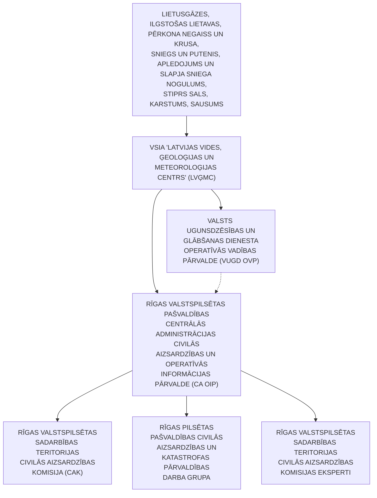

<!-- lpp. 29 -->

29

3. Publikācija sociālajā medijā _Delfi_ “Mediķu padomi, kā sevi pasargāt no sala”. https://www.delfi.lv/life/56017206/veseliba/46918437/mediku-padomi-ka-sevi-

pasargat-no-sala

4. Rīgas pilsētas Apkaimju iedzīvotāju centra 20.12.2022. publikācija “Rīgā

otrdien apledos ielas un ietves – iedzīvotājiem jārēķinās ar apgrūtinātu pārvietošanos”. https://apkaimes.lv/riga-otrdien-apledos-ielas-un-ietves-iedzivotajiem-jarekinas-arapgrutinatu-parvietosanos/

5. VUGD informatīvais materiāls “Vai tu zini, kā rīkoties ārkārtas gadījumos?”. https://www.vugd.gov.lv/lv/vai-tu-zini-ka-rikoties-arkartas-gadijumos

## 4. Pali, plūdi un vējuzplūdi

**Sadaļas saturs:**

- A. Ieteikumi personām, kuras uzturas Pašvaldības administratīvajā teritorijā

- B. Katastrofas/apdraudējuma vispārējais raksturojums

- C. Izmantotās literatūras saraksts

### A. Ieteikumi personām, kuras uzturas Pašvaldības administratīvajā teritorijā

1. Rīcība palu, plūdu, vējuzplūdu gadījumā: ja negaidīti sākušies plūdi un nav

iespējams evakuēties un apdraudēta tava veselība vai dzīvība:

   - 1.1. zvani Valsts ugunsdzēsības un glābšanas dienestam – tālrunis **112** ;

- 1.2. pārvietojies uz ēkas augšējiem stāviem vai jumtu. Ja plūdi sākušies naktī,

- izmanto gaismas signālu, lai glābējiem signalizētu par savu atrašanās vietu;

- 1.3. esi mierīgs, pārliecināts un rīkojies operatīvi, ja tuvākā apkārtne un mājoklis

- var strauji applūst;

   - 1.4. operatīvie dienesti steigsies palīgā;

   - 1.5. aktīvā ledus iešanas laikā vai ledus sastrēgumu veidošanās vietās nekāp uz

ledus.

   2. Ja tiek saņemts brīdinājums par plūdiem:

- 2.1. nekavējoties atrodi drošu vietu (pārvietojies uz augstāku vietu vai augstāku

- stāvu, vietai ir jāatrodas virs iespējamā applūšanas līmeņa);

   - 2.2. ja ir iespējams, tad evakuējies prom no bīstamās zonas;

   - 2.3. nemēģini pārvarēt (izbrist), pārpeldēt vai izbraukt cauri applūdušajai teritorijai; 2.4. ja atrodies drošā vietā (virs iespējamās applūšanas līmeņa), paliec uz vietas un

gaidi palīdzību.

   3. Privātmājās:

   - 3.1. novērtē iespējamos apdraudējumus savam īpašumam (saimniecībai);

- 3.2. lai samazinātu plūdu nodarītos materiālos zaudējumus, pārvieto mantas no

- pagrabtelpām un pirmajiem stāviem uz augšējiem stāviem vai bēniņiem, nostiprini pagalmā un mājas tuvumā esošus priekšmetus;

- 3.3. sagatavo mantas, ko ņemsi līdzi evakuējoties, jo māja var applūst īsā laika brīdī; 3.4. sagatavo evakuācijai izmantojamos transportlīdzekļus (automašīnas u. c.) un

- pieejamos peldošos līdzekļus (laivas, plostus u. c.);

   - 3.5. atstājot māju un saimniecības ēkas, atslēdz elektroenerģijas un gāzes padevi,

<!-- lpp. 30 -->

30

vietējās apkures ierīces un iekārtas, aizver logus, durvis, lūkas un slēģus;

- 3.6. lai novērstu iespējamo vides piesārņojumu un apdraudējumu cilvēku veselībai,

- izsūknē notekūdeņus un tualetes bedres;

- 3.7. uz drošu vietu pārvieto dažādas ķīmiskās vielas un produktus, norobežo un

- izved atkritumus;

   - 3.8. evakuācijas gadījumā paziņo par to tuviniekiem.

4. Daudzdzīvokļu ēkā:

   - 4.1. novērtē iespējamos apdraudējumus;

- 4.2. sagatavo mantas, ko ņemsi līdzi evakuējoties, jo māja var applūst īsā laika brīdī; 4.3. sagatavo evakuācijai izmantojamos transportlīdzekļus (automašīnas u.c.) un

- pieejamos peldošos līdzekļus (laivas, plostus u.c.);

- 4.4. atslēdz elektroiekārtas no strāvas (ja iespējams izslēdz elektrodrošinātājus),

- aizver logus, durvis;

- 4.5. pārliecinies, ka ziņu saņēmuši kaimiņos dzīvojošie cilvēki, gados veci cilvēki

- vai cilvēki ar redzes un dzirdes traucējumiem;

- 4.6. iespēju robežās sniedz atbalstu gados veciem cilvēkiem vai cilvēkiem ar redzes

- un dzirdes traucējumiem, lai arī viņi varētu droši evakuēties;

   - 4.7. evakuācijas gadījumā paziņo par to tuviniekiem.

5. Vērsies savā pašvaldībā un noskaidro, vai tavas ģimenes mājoklis atrodas plūdu apdraudētajā teritorijā (https://videscentrs.lvgmc.lv/iebuvets/pludu-riska-un-pludu-draudukartes).

6. Klausies meteorologu brīdinājumus un seko situācijas attīstībai sava mājokļa

tuvumā, informē kaimiņus.

7. Noskaidro un saglabā savā mobilajā tālrunī un piezīmju grāmatiņā tālruņu numurus, uz kuriem jāzvana, lai ziņotu par plūdu sākšanos un saņemtu palīdzību, – Pašvaldības un operatīvo dienestu tālruņu numurus (piemēram, **112** ).

8. Ja atrodies plūdu apdraudētā teritorijā, savlaicīgi parūpējies par veciem cilvēkiem, bērniem, invalīdiem un slimniekiem, atrodot viņiem šajā laikā drošāku mājvietu pie radiem vai draugiem.

9. Apzini vietu, kur nepieciešamības gadījumā evakuēt mājlopus, mājdzīvniekus un kā tos nodrošināt  ar barību. Ja tādas iespējas nav, tad savlaicīgi vērsies pēc palīdzības savā Pašvaldībā.

10. Iepazīsties ar laika prognozi konkrētai dienai un tuvākajām dienām (ja plāno doties prom no mājām uz ilgāku laikposmu).

11. Sagatavo rīcības plānu savai mājsaimniecībai, tostarp mājdzīvniekiem, lai zinātu, ko darīt, kur doties un kas būs nepieciešams.

12. Sagatavo nepieciešamos pārtikas produktus (kas nebojājas) un ūdeni vairākām

<!-- lpp. 31 -->

31

dienām, kā arī nepieciešamās saimniecības preces un apģērbu.

13. Rēķinies ar to, ka var nākties nekavējoties doties prom (evakuēties).

14. Iedzīvotāju brīdināšana un informēšana:

4.1. attēls

15. Seko līdzi atbildīgo dienestu mājaslapās:

15.1. Valsts ugunsdzēsības un glābšanas dienests – www.vugd.gov.lv; 15.2. VSIA “Latvijas Vides, ģeoloģijas un meteoroloģijas centrs” –

www.videscentrs.lvgmc.lv.

16. Seko līdzi sociālajā tīklā _Facebook_ :

16.1. Valsts ugunsdzēsības un glābšanas dienests; 16.2. VSIA “Latvijas Vides ģeoloģijas un meteoroloģijas centrs”.

17. Seko līdzi sociālajā tīklā _X:_

17.1. Valsts ugunsdzēsības un glābšanas dienests – @ugunsdzeseji;

17.2. VSIA “Latvijas Vides, ģeoloģijas un meteoroloģijas centrs” – @VSIA_LVGMC.

18. Seko līdzi sociālajā tīklā _Instagram –_ Valsts ugunsdzēsības un glābšanas dienests – ugunsdzēsēji.

### B. Katastrofas/apdraudējuma vispārējais raksturojums

1. Pali:

1.1. ūdens līmeņa celšanās, kas konkrētos klimatiskos apstākļos katru gadu atkārtojas vienā un tajā pašā sezonā, kuras laikā notiek lielu ūdenstilpei piegulošo teritoriju – palieņu un citu teritoriju applūšana;

1.2. Latvijā pali ir pavasarī – parasti martā vai aprīlī –  sniega kušanas laikā;

1.3. palu laikā paliene izveidojas par milzīgu ūdenskrātuvi, kas reizē darbojas kā dabisks ūdens “sūklis”.

2. Plūdi:

- 2.1. sauszemes teritorijas applūšana ar ūdeni;

- 2.2. galvenie plūdu iemesli ir ilgstoši nokrišņi, sniega kušana, ledus sastrēgumi, kuru

> **Informatīvais paziņojums (lpp. 31): 4.1. attēls. Iedzīvotāju brīdināšana un informēšana**  
> **IZDZIRDOT TRAUKSMES SIRĒNAS VAI APZIŅOŠANU AR SKAĻRUŅIEM:**  
> - **IESLĒDZ TV**: Latvijas Televīzija (LTV1, LTV7);  
> - **IESLĒDZ RADIO**: Latvijas Radio (LR1, LR2, LR4).  
> *Seko līdzi atbildīgo dienestu oficiālajai informācijai www.vugd.gov.lv un www.videscentrs.lvgmc.lv.*

<!-- lpp. 32 -->

32

dēļ ūdens nevar tecēt pa upi un ceļas ūdens līmenis;

2.3. plūdi var būt arī tad, ja ūdens līmeņa celšanos neiztur kāds dambis, aizsprosts vai cita aizsargkonstrukcija un tad applūst plašas teritorijas;

2.4. plūdu cēloņi ir vētras uzplūdi jūras piekrastē un strauja ūdens līmeņa celšanās upēs un ezeros palu un lietus uzplūdu laikā. Augstākie ūdens līmeņi tiek sasniegti ziemas vidū vai vēlā rudenī vētru laikā, kad ziemeļrietumu virziena vēji izraisa uzplūdus Rīgas jūras līcī; 2.5. plūdi var rasties bez brīdinājuma, tie var izraisīt traucējumus sabiedriskajam transportam (apturot, vai ierobežojot tā kustību), kā arī sabojāt ēkas un radīt zemes nogruvumus;

2.6. plūdu riskam ir pakļautas gan lielāko upju palieņu platības (Daugavas senleja), gan lielākajiem ezeriem (Ķīšezers) piegulošās platības;

2.7. Daugavas lejteces, Ķīšezera un Baltezera ūdens līmeņa režīms ir atkarīgs no jūras līmeņa svārstībām, kā arī no vējuzplūdiem un vējatplūdiem.

3. Vējuzplūdi:

3.1. vēja darbības izraisītas ūdenstilpes līmeņa svārstības, kas rada tā paaugstināšanos pretvēja krastā;

3.2. vējuzplūdi mēdz izraisīt nopietnus teritoriju applūdumus un radīt lielus materiālos zaudējumus;

3.3. sevišķi bīstamas situācijas veidojas gadījumos, kad Ziemeļeiropu šķērso vairāki aktīvi cikloni, kuri nes vairākkārtēju rietumu vēju pastiprināšanos, veicinot ūdens pieplūdumu vispirms Rīgas jūras līcī, bet pēc tam arī upēs.

4. Plūdu prognozēšana, agrīnā brīdināšana un rīcības algoritms:

4.1. plūdu prognožu un agrās brīdināšanas sistēma dod iespēju paredzēt hidroloģiskās parādības, kuras izraisa laikapstākļu izmaiņas;

4.2. plūdu prognozes dod iespēju atbildīgajiem dienestiem paredzēt plūdu apmērus un veikt nepieciešamos sagatavošanās pasākumus, lai pasargātu apdraudēto teritoriju iedzīvotājus un lai tiktu nodarīti pēc iespējas mazāki materiālie zaudējumi īpašumiem, infrastruktūrai un kultūras mantojumam;

4.3. plūdu prognožu un agrās brīdināšanas sistēmu uztur LVĢMC, sniedzot šādu

informāciju:

4.3.1. ikdienas noteces prognozes Daugavā;

4.3.2. mēneša prognozes Daugavai (https://videscentrs.lvgmc.lv/iebuvets/pluduriska-informacijas-sistema);

4.3.3. ledus uzlūšanas sākuma prognoze pirmspalu periodā;

- 4.3.4. pavasara palu maksimālo ūdens līmeņu prognoze;

4.3.5. pavasara palu maksimālo caurplūdumu prognoze;

4.3.6. pavasara palu maksimuma termiņu prognoze;

4.3.7. operatīvā informācija VUGD, NBS un AS “Latvenergo” plūdu draudu gadījumos, brīdinājumi nepieciešamības gadījumos (NBS, AS “Latvenergo”, VUGD, kas informē medijus un iedzīvotājus).[13]

> 13 LVĢMC Daugavas upju baseinu apgabala apsaimniekošanas plāns un plūdu riska pārvaldības plāns 2022.–2027. gadam.

<!-- lpp. 33 -->

33

- 4.2. attēls “Prognožu un agrās brīdināšanas sistēmas shēma”

   5. Rīgā ir vairākas teritorijas, kuras apdraud varbūtējie plūdi, un šīs teritorijas ir: 5.1. Buļļupe (Vakarbuļļi, Rītabuļļi, Daugavgrīva, Bolderāja); 5.2. Vecdaugava;

   - 5.3. Hapaka grāvis un Beķera grāvis (Krēmeri, Voleri, Spilve); 5.4. Ķīšezers, Juglas kanāls, Juglas ezers un Baltezers;

   - 5.5. Sarkandaugava;

   - 5.6. Zunda kanāls (Ķīpsala, Klīversala, Mārupītes lejtece);

   - 5.7. Bieķengrāvis (Mūkusala, Bieķensala, Lucavsala); 5.8. Krasta iela no Salu tilta līdz Dienvidu tiltam.[14]

6. LVĢMC speciālisti izvērtē hidroloģiskos apstākļus un brīdinājumus par plūdu

draudiem.

14 HydroClimateStrategyRiga   Nr.LIFE08 ENV/LV/000451 – Plūdu riska pārvaldības plāns Rīgas pilsētai.

### 4.2. attēls “Prognožu un agrās brīdināšanas sistēmas shēma”

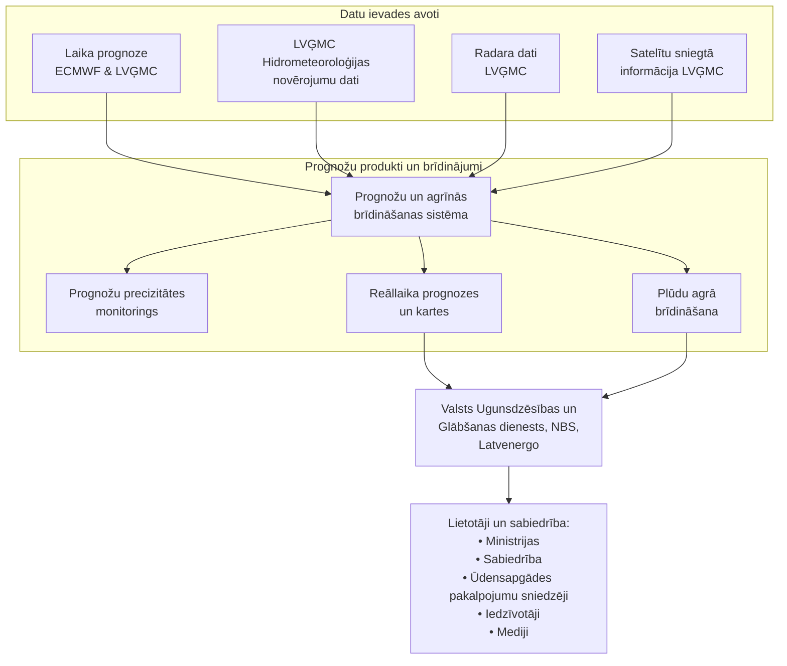

<!-- lpp. 34 -->

34

4.1. tabula “Hidroloģiskajām un meteoroloģiskajām parādībām definētie riski dažādiem

brīdinājumu līmeņiem un vispārējie ieteikumi rīcībai šajos gadījumos”[15]

> 15 LVĢMC sadarbībā ar VUGD izstrādātais materiāls.

### 4.1. tabula “Hidroloģiskajām un meteoroloģiskajām parādībām definētie riski dažādiem brīdinājumu līmeņiem un vispārējie ieteikumi rīcībai šajos gadījumos” (Plūdi)

| Brīdinājuma līmenis | ZAĻŠ | DZELTENS (Esi informēts!) | ORANŽS (Esi gatavs!) | SARKANS (Rīkojies!) |
|---|---|---|---|---|
| **Ūdens līmeņa statuss** | **ŪDENS LĪMENIS ZEMĀKS PAR PLŪDU DRAUDU LĪMENI\*** | **AUGSTS ŪDENS LĪMENIS\*** | **ĻOTI AUGSTS ŪDENS LĪMENIS\*** | **EKSTREMĀLI AUGSTS ŪDENS LĪMENIS\*** |
| **Parādības raksturojums** | Ikdienā ierastas ūdens līmeņa svārstības | Ūdens līmeņa būtiska paaugstināšanās | Teritoriju applūšana | Plūdi |
| **Ietekme un ieteikumi rīcībai (Ūdens līmenis upēs plūdu laikā, tai skaitā palu laikā un ledus sastrēgumu gadījumā)** | Nav gaidāms, ka ūdens līmeņa svārstības izraisīs būtisku ietekmi, tomēr iespējama lokāla vai maznozīmīga plūdu ietekme. | **ESI INFORMĒTS** par potenciāli plūdiem visvairāk pakļautajām teritorijām. Pārvietojoties plūdu apdraudētajās teritorijās, ir jābūt piesardzīgam. | **ESI GATAVS** pasargāt sevi un savu īpašumu. Iespējama transporta infrastruktūras applūšana. Var tikt traucēta elektroenerģijas un ūdens piegāde, telekomunikāciju sakari. Iespējams, būs nepieciešama evakuācija. Iedzīvotāji tiek aicināti neapmeklēt un nepārvietoties plūdu apdraudētajās teritorijās. | **RĪKOJIES**, lai pasargātu sevi, un seko norādījumiem, ko sniedz atbildīgās institūcijas! Gaidāma plaša īpašumu applūšana, kas apdraud dzīvību, kā arī evakuācija. Ļoti apgrūtināta pārvietošanās un traucēta elektroenerģijas un ūdens apgāde, telekomunikāciju sakari. Iedzīvotāji tiek aicināti pamest apdraudētās piekrastes teritorijas un sekot visiem atbildīgo institūciju norādījumiem. |

<!-- lpp. 35 -->

35

7. Vēja darbības izraisītas ūdenstilpes līmeņa svārstības, kas rada tā paaugstināšanos pretvēja krastā.

4.2. tabula “Hidroloģiskajām un meteoroloģiskajām parādībām definētie riski dažādiem brīdinājumu līmeņiem un vispārējie ieteikumi rīcībai šajos gadījumos”[16]

8. Iestāžu, dienestu, organizāciju u. c. informācijas apmaiņa un reaģēšanas aktivizācijas shēma palu, plūdu un vējuzplūdu gadījumā (skatīt 4.1. shēmu).

> 16 LVĢMC sadarbībā ar VUGD izstrādātais materiāls.

### 4.2. tabula “Hidroloģiskajām un meteoroloģiskajām parādībām definētie riski dažādiem brīdinājumu līmeņiem un vispārējie ieteikumi rīcībai šajos gadījumos” (Vējuzplūdi)

| Hidroloģiskās parādības intensitātes apzīmējums | ZAĻŠ: ŪDENS LĪMENIS ZEMĀKS PAR PLŪDU DRAUDU LĪMENI | DZELTENS: AUGSTS ŪDENS LĪMENIS (Esi informēts!) | ORANŽS: ĻOTI AUGSTS ŪDENS LĪMENIS (Esi gatavs!) | SARKANS: EKSTREMĀLI AUGSTS ŪDENS LĪMENIS (Rīkojies!) |
|---|---|---|---|---|
| **Ventspilī** | $\le +94	ext{ cm LAS}$ | $+95\ldots+134	ext{ cm LAS}$ | $+135\ldots+154	ext{ cm LAS}$ | $\ge +155	ext{ cm LAS}$ |
| **Liepājā** | $\le +104	ext{ cm LAS}$ | $+105\ldots+134	ext{ cm LAS}$ | $+135\ldots+154	ext{ cm LAS}$ | $\ge +155	ext{ cm LAS}$ |
| **Rīgā** | $\le +114	ext{ cm LAS}$ | $+115\ldots+154	ext{ cm LAS}$ | $+155\ldots+184	ext{ cm LAS}$ | $\ge +185	ext{ cm LAS}$ |
| **Ietekme un ieteikumi rīcībai (Ūdens līmenis vējuzplūdu laikā)** | Nav gaidāms, ka ūdens līmeņa svārstības izraisīs būtisku ietekmi, tomēr iespējama lokāla vējuzplūdu ietekme piekrastes rajonos. | **ESI INFORMĒTS** par potenciāli plūdiem visvairāk pakļautajām teritorijām, kurās stiprs vējš kopā ar lieliem viļņiem var izraisīt piekrastes applūšanu. Pārvietojoties piekrastes rajonos, esi piesardzīgs. | **ESI GATAVS**, stipram vējam un augstiem viļņiem. Tas var izraisīt piekrastes un ar to saistīto zemo vietu applūšanu upju un ezeru tuvumā, kā arī kāpu un piekrastes infrastruktūras, piemēram, dambju vai ostu bojājumus. Iespējams, būs nepieciešama evakuācija. Neapmeklē un nepārvietojies apdraudētajās teritorijās. | **RĪKOJIES!** Stiprs vējš un augsti viļņi izraisīs plašu piekrastes un ar to saistīto zemo vietu applūšanu upju un ezeru tuvumā, kā arī nopietnus piekrastes infrastruktūras un aizsardzības būvju bojājumus. Iespējama īpašumu applūšana, kas apdraud dzīvību, kā arī evakuācija. Nekavējoties pamet apdraudētās piekrastes teritorijas un seko visiem atbildīgo institūciju norādījumiem. |

<!-- lpp. 36 -->

36

4.1. shēma

9. Seku novēršanai tiek izstrādāts ierobežotas pieejamības (IP) algoritms, kurš sevī

ietver:

   - 9.1. prevenciju;

   - 9.2. seku novēršanā iesaistīto struktūrvienību atbildības;

   - 9.3. seku novēršanā izmantojamos resursus, resursu administrēšanu;

   - 9.4. nodarīto postījumu kompensācijas mehānismu.

10. Preventīvie, gatavības, reaģēšanas un seku likvidēšanas pasākumi palu, plūdu,

vējuzplūdu gadījumā (3. pielikums).

### C. Izmantotās literatūras saraksts

1. VUGD Informatīvais materiāls “Plūdi.  Esi informēts un zini kā rīkoties!”.

https://www.vugd.gov.lv/lv/pludi

2. VUGD Informatīvais materiāls “Plūdi. Kā sagatavoties? Kā rīkoties?”.

https://www.vugd.gov.lv/lv/pludi

3. VUGD Informatīvais materiāls “Plūdi”.

https://www.vugd.gov.lv/lv/pludi

4. LVĢMC Plūdu riska informācijas sistēma.

https://videscentrs.lvgmc.lv/iebuvets/hidrologiskas-prognozes

5. IeM, VUGD, NMPD informatīvais materiāls “Vai tu zini, kā rīkoties ārkārtas

gadījumos?”.

https://www.vugd.gov.lv/lv/vai-tu-zini-ka-rikoties-arkartas-gadijumos

### 4.1. shēma “Iestāžu, dienestu, organizāciju u. c. informācijas apmaiņa un reaģēšanas aktivizācijas shēma palu, plūdu un vējuzplūdu gadījumā”

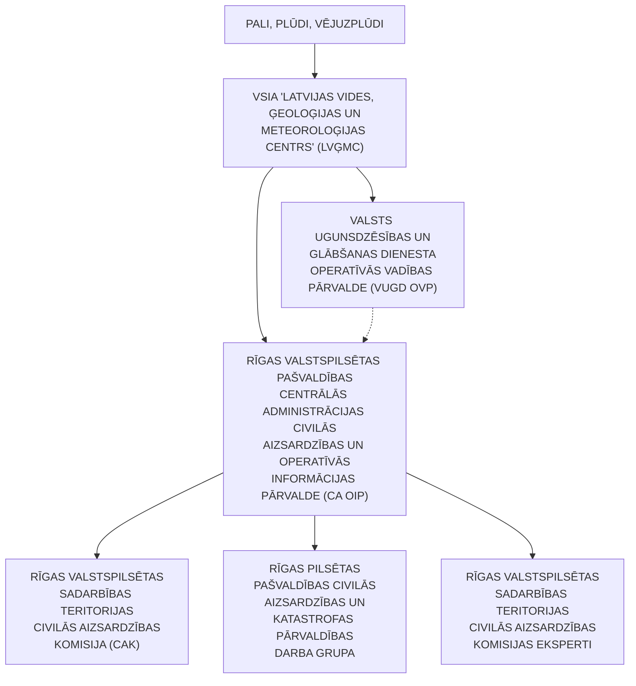

<!-- lpp. 37 -->

37

6. MK 26.08.2020. rīkojums Nr. 476 “Par Valsts civilās aizsardzības plānu”,

4.pielikums “Pali, plūdi un vējuzplūdi”. https://likumi.lv/ta/id/317006-par-valsts-civilas-aizsardzibas-planu

7. LVĢMC Daugavas upju baseinu apgabala apsaimniekošanas plāns un plūdu

riska pārvaldības plāns 2022.–2027. gadam.

## 5. Vētras (vēja brāzmas), viesuļi, krasas vēja brāzmas

Sadaļas saturs:

- A. Ieteikumi personām, kuras uzturas Pašvaldības administratīvajā teritorijā

- B. Katastrofas/apdraudējuma vispārējais raksturojums

- C.   Izmantotā literatūra

### A. Ieteikumi personām, kuras uzturas Pašvaldības administratīvajā teritorijā

1. Rīcība vētras (vēja brāzmu), viesuļa, krasu vēja brāzmu gadījumā:

- 1.1. klausies meteorologu brīdinājumus, seko situācijas attīstībai;

- 1.2. ievēro dienestu, iestāžu norādījumus un ieteikumus;

- 1.3. ja ir iespējams, paliec vai uzturies telpās.

2. Ko darīt, ja sākusies vētra (vēja brāzmas), viesulis, krasas vēja brāzmas un ja esi

ēkā:

   - 2.1. atvieno no strāvas elektroierīces;

   - 2.2. nemazgā rokas, traukus, veļu, neej dušā;

   - 2.3. nekurini plīti vai krāsni;

   - 2.4. stingri aizver logus, durvis un bēniņu lūkas;

   - 2.5. neej pie logiem vai durvīm, neuzturies verandā, uz balkona vai lodžijas;

- 2.6. neaizmirsti par ugunsdrošību. Ja vētras rezultātā ir radušies elektrības

- pārrāvumi, pārvietojoties pa māju, izmanto lukturīti. Neatstāj degošu sveci bez uzraudzības.

3. Ko darīt, ja sākusies vētra (vēja brāzmas), viesulis, krasas vēja brāzmas un ja esi

ārpus telpām:

- 3.1. patveries ēkā vai automašīnā. Ja esi automašīnā, atrodi drošu vietu, kur

- apstāties, paliec tajā, ieslēdz avārijas gaismas signālu;

- 3.2. neuzturies un nenovieto transportlīdzekļus zem vientuļiem kokiem, celtniecības

- sastatnēm, reklāmas stendiem, elektropārvades līnijām;

- 3.3. izvairies no patveršanās nojumē, sīku konstrukciju ēkās vai zem lieliem

- atsevišķi augošiem kokiem atklātā teritorijā;

   - 3.4. atrodoties uz ūdens, mēģini nokļūt krastā un nekavējoties meklē patvērumu;

   - 3.5. vētras (vēja brāzmu), viesuļa, krasu vēja brāzmu gadījumā nemakšķerē vai

- nepeldies; 3.6. nelieto lietussargu, tas apgrūtina redzamību, pastiprināti uztver vēja brāzmas un

- var savainot citus cilvēkus;

- 3.7. neej pāri tiltiem, nepieciešamības gadījumā var zem tilta paslēpties un nogaidīt,

- līdz pāriet stiprās vēja brāzmas.

<!-- lpp. 38 -->

38

4. Kā sagatavoties vētrām (vēja brāzmām), viesuļiem, krasām vēja brāzmām: 4.1. parūpējies, lai mobilais telefons būtu pilnībā uzlādēts, lai nepieciešamības

gadījumā varētu izsaukt operatīvos dienestus pa tālruni **112** ;

- 4.2. sagatavo kabatas lukturīšus un pārliecinies, ka mājās ir baterijas, kuras ievietot

- radioaparātā. Elektrības pārrāvumu laikā radioaparāts būs tava vienīgā iespēja uzzināt par notikušo, kā arī operatīvo dienestu ieteikumus turpmākai rīcībai;

- 4.3. daudzdzīvokļu māju iemītnieki ir aicināti pārliecināties par to, ka uz viņu

- balkoniem neatrodas lietas, kuras vējš var aizpūst, tādējādi apdraudot garāmgājēju veselību un dzīvību. Tās lietas, kuras nevar pārvietot uz iekštelpām, ir stingri jānostiprina;

- 4.4. privātmāju un lauku iedzīvotājiem ir jāpārliecinās, ka viņu māju pagalmā visas

- vieglākās lietas ir piesietas vai nostiprinātas tā, ka vējš tās nevar aizpūst; 4.5. ja nepieciešams novietot automašīnu, tad  izvēlies vietu, kas nav zem kokiem

- vai tiešā to tuvumā;

4.6. ēkās vai objektos, kur nav pieļaujami elektroapgādes pārtraukumi, īpašniekiem vajadzētu savlaicīgi izveidot pārvietojamo elektroenerģijas avotu pieslēguma vietas.

5. Elektrodrošība vētras laikā – ja uz mājas ir uzgāzies vēja nolauzts koks, kas vienlaikus arī traucē elektroapgādi,  nekādā gadījumā netuvojies lūzuša koka bojātām vai pārrautām elektrolīnijām, bet nekavējoties sazinies ar AS “Sadales tīkls” Klientu servisu pa bezmaksas tālruni **8404** un informē par situāciju.

   6. Kā rīkoties, ja pazūd elektrība:

   - 6.1. vispirms pārbaudi, vai nav izslēgušies drošinātāji;

   - 6.2. ja elektrības nav visā mājā, bet kaimiņos ir, sazinies ar mājas apsaimniekotāju;

- 6.3. ja elektrība nav arī kaimiņmājās, sazinies ar AS “Sadales tīkls” Klientu servisu

- pa bezmaksas tālruni **8404** ;

- 6.4. ja ir nogāzušies koki, pārrauti vadi, notikusi avārija vai cits negadījums, zvani

- VUGD pa tālruni **112** . Visā valstī neatliekamo medicīnisko palīdzību var izsaukt, zvanot pa tālruni **113** ;

6.5. atslēgumus elektrotīklā ir iespējams apskatīt AS “Sadales tīkls” mājaslapas digitālajā kartē https://karte.sadalestikls.lv/lv/atslegumi-elektrotikla.

<!-- lpp. 39 -->

39

5.1. attēls “VUGD drošības padomi negaisa vai spēcīgu vēja brāzmu laikā”

7. Iedzīvotāju brīdināšana un informēšana (skatīt 5.2. attēlu): 5.2. attēls

- 7.1. seko līdzi atbildīgo dienestu mājaslapās: 7.1.1. Valsts ugunsdzēsības un glābšanas dienests – www.vugd.gov.lv; 7.1.2. VSIA “Latvijas Vides, ģeoloģijas un meteoroloģijas centrs” –

- www.videscentrs.lvgmc.lv; 7.2. seko līdzi sociālajā tīklā _Facebook:_

> **Informatīvais plakāts (lpp. 39): 5.1. attēls “VUGD drošības padomi negaisa vai spēcīgu vēja brāzmu laikā”**  
> - **Sekojiet līdzi meteorologu brīdinājumiem**, informācijai plašsaziņas līdzekļos un aktuālajai situācijai ārā!  
> - **Uzlādējiet mobilos telefonus!**  
> - **Bez īpašas vajadzības, nedodieties ārā no ēkas!**  
> - **Nostipriniet uz balkona vai mājas pagalmā novietotos priekšmetus!**  
> - **Aizveriet durvis, logus un bēniņu lūkas!**  
> - **Savlaicīgi atvienojiet elektroiekārtas.** Zibens izraisīts strāvas vai sprieguma kāpums var izraisīt bojājumus!  
> - **Nenovietojiet automašīnu zem kokiem!**  
> *JA NOTIKUSI NELAIME – ZVANI 112!*

> **Informatīvais paziņojums (lpp. 39): 5.2. attēls. Iedzīvotāju brīdināšana un informēšana**  
> **IZDZIRDOT TRAUKSMES SIRĒNAS VAI APZIŅOŠANU AR SKAĻRUŅIEM:**  
> - **IESLĒDZ TV**: Latvijas Televīzija (LTV1, LTV7);  
> - **IESLĒDZ RADIO**: Latvijas Radio (LR1, LR2, LR4).  
> *Seko līdzi atbildīgo dienestu oficiālajai informācijai www.vugd.gov.lv un www.videscentrs.lvgmc.lv.*

<!-- lpp. 40 -->

40

7.2.1. Valsts ugunsdzēsības un glābšanas dienests;

7.2.2. VSIA “Latvijas Vides ģeoloģijas un meteoroloģijas centrs”;

7.3. seko līdzi sociālajā tīklā _X:_

7.3.1. Valsts ugunsdzēsības un glābšanas dienests – @ugunsdzeseji;

7.3.2. VSIA “Latvijas Vides, ģeoloģijas un meteoroloģijas centrs” –

@VSIA_LVGMC;

7.4. seko līdzi sociālajā tīklā _Instagram_ – Valsts ugunsdzēsības un glābšanas dienests – ugunsdzēsēji.

### B. Katastrofas/apdraudējuma vispārējais raksturojums

1. Vispārējā informācija par vētru (vēja brāzmu), viesuli, krasu vēja brāzmu.

2. Vētra ir ļoti stiprs vējš, kura summārais ātrums 10 minūšu laikā parasti sasniedz vismaz 24 m/s, bet vēja ātrums brāzmās var sasniegt 50 un pat 100 m/s lielu ātrumu.

3. Vēja ātruma iedalījums:

5.1. tabula “Hidroloģiskajām un meteoroloģiskajām parādībām definētie riski dažādiem brīdinājumu līmeņiem un vispārējie ieteikumi rīcībai šajos gadījumos”[17]

Piezīme. Tiek noteikts vidējais vēja ātrums 10 minūšu laika posmā metros sekundē.

4. Vētru laikā tieši vēja brāzmas izraisa lielākos postījumus. Vēja brāzmas ir raksturīgas piezemes gaisa plūsmai, jo tās izraisa berze.

5. Ekstremāls vēja ātrums ir tiešs drauds cilvēku dzīvībai un materiālajām vērtībām, tajā skaitā dažāda veida infrastruktūrai.

17 LVĢMC sadarbībā ar VUGD izstrādātais materiāls.

### 5.1. tabula “Hidroloģiskajām un meteoroloģiskajām parādībām definētie riski dažādiem brīdinājumu līmeņiem un vispārējie ieteikumi rīcībai šajos gadījumos” (Vējš)

| Brīdinājuma līmenis | ZAĻŠ | DZELTENS (Esi informēts!) | ORANŽS (Esi gatavs!) | SARKANS (Rīkojies!) |
|---|---|---|---|---|
| **Laika parādības intensitātes apzīmējums** | **BEZVĒJŠ LĪDZ STIPRS VĒJŠ** | **VĒTRAS SPĒKA VĒJA BRĀZMAS** | **STIPRAS VĒTRAS SPĒKA VĒJA BRĀZMAS** | **ORKĀNA SPĒKA VĒJA BRĀZMAS** |
| **Kritērijs: Vējš, maksimālās brāzmas** | $\le 19	ext{ m/s}$ | $20	ext{--}24	ext{ m/s}$ | $25	ext{--}32	ext{ m/s}$ | $\ge 33	ext{ m/s}$ |
| **Ietekme un ieteikumi rīcībai** | Nav gaidāms, ka vējš izraisīs būtisku ietekmi, tomēr iespējama lokāla ietekme. | **ESI INFORMĒTS**, ka nolauzti koku zari, nefiksēti priekšmeti vai atlūzas var tikt nestas pa gaisu, tādēļ āra aktivitātes var tikt traucētas. | **ESI GATAVS**, ka nolauzti koki, nenostiprināti priekšmeti vai atlūzas var radīt bojājumus un postījumus. Iespējami elektroapgādes traucējumi. | **RĪKOJIES**, lai pasargātu sevi! Personīgajai drošībai risku rada lauzti koki, nenostiprināti priekšmeti un atlūzas, kas tiek nestas pa gaisu. Tas var radīt arī plašus bojājumus īpašumiem, ceļu un elektroapgādes infrastruktūrai. |

*Piezīme. Tiek noteikts vidējais vēja ātrums 10 minūšu laika posmā metros sekundē.*

<!-- lpp. 41 -->

41

6. Kraso vēja brāzmu postījumi var būt lielāki nekā vēja postījumi gadījumos, kad vēja pastiprināšanās notiek pakāpeniski. Turklāt krasās vēja brāzmas pērkona negaisa laikā visbiežāk tiek novērotas vasaras sezonā, kad kokiem ir lapas,  arī tas vēja ietekmi vēl vairāk palielina.

7. Tāpat lielu vēja ātrumu var saistīt arī ar netiešu ietekmi, piemēram, augstiem

viļņiem, vējuzplūdiem, kā arī piekrastes eroziju, kas var radīt ekonomiskos zaudējumus.

8. Pēc vējlauzēm pasliktinās meža sanitārais stāvoklis, jo ievērojami pieaug kukaiņu masveida savairošanās risks. It īpaši bīstama ir egļu astoņzobu mizgrauža savairošanās.

9. Iestāžu, dienestu, organizāciju informācijas apmaiņa un reaģēšanas aktivizācijas shēma vētru (vēja brāzmu), viesuļu, krasu vēja brāzmu gadījumā (skatīt 5.1. shēmu).

5.1. shēma

10. Preventīvie, gatavības, reaģēšanas un seku likvidēšanas pasākumi vētras (vēja brāzmu), viesuļa, krasu vēja brāzmu gadījumā (5. pielikums).

### C. Izmantotā literatūra

1. MK 26.08.2020. rīkojuma Nr. 476 “Par Valsts civilās aizsardzības plānu”

6.pielikums “Vētras (vēja brāzmas), viesuļi, krasas vēja brāzmas”. https://likumi.lv/ta/id/317006-par-valsts-civilas-aizsardzibas-planu

   2. VUGD informatīvais materiāls “Stiprs vējš, negaiss”. https://www.vugd.gov.lv/lv/stiprs-vejs-negaiss

   3. VUGD informatīvais materiāls “Vai tu zini, kā rīkoties ārkārtas gadījumos?”.

### 5.1. shēma “Iestāžu, dienestu, organizāciju informācijas apmaiņa un reaģēšanas aktivizācijas shēma vētru (vēja brāzmu), viesuļu, krasu vēja brāzmu gadījumā”

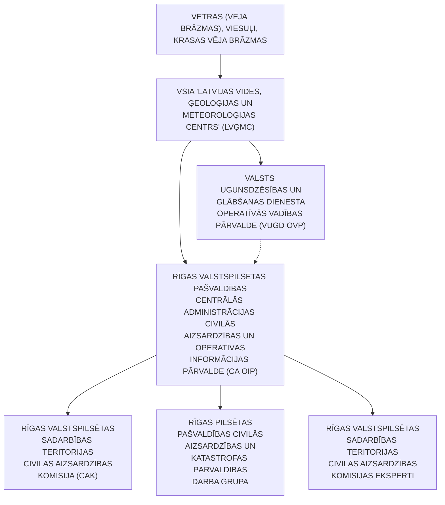

<!-- lpp. 42 -->

42

https://www.vugd.gov.lv/lv/vai-tu-zini-ka-rikoties-arkartas-gadijumos

4. 16.09.2020.  publikācija sociālajā medijā ReTV.lv “Kā rīkoties vētras laikā?” https://www.retv.lv/raksts/ka-rikoties-vetras-laika

## 6. Meža un kūdras purvu ugunsgrēki

1. Klimata pārmaiņu kontekstā ir prognozēts, ka sausuma un karstuma periodi nākotnē kļūs biežāki, kas palielina reģiona ugunsbīstamību mežos un kūdras purvos.

2. Par meža un purvu ugunsgrēka cēloni var būt apzināta vai neapzināta cilvēka darbība vai arī dabas stihija – sausums, karstums, zibens iedarbība.

3. Latvijas meži aizņem ~ 3,4 miljonus ha un klāj 52% valsts teritorijas. Latvijā ir ~2,4 tūkstošu km[2] purvu, kas aizņem 3,8% no Latvijas teritorijas. No tiem tikai daļa tiek izmantota kā kūdras ieguves vietas.

4. Pavisam Rīgā ir 10 mežu masīvi, no kuriem lielākie ir:

- 4.1. Kleistu–Bolderājas;

- 4.2. Vecāķu–Vecdaugavas;

- 4.3. Biķernieku;

- 4.4. Buļļu;

- 4.5. Imantas;

- 4.6. Mārupes;

- 4.7. Mangaļsalas;

- 4.8. Jaunciema;

- 4.9. Šķirotavas;

- 4.10. Juglas.

5. Oglekļa monoksīds (tvana gāze) parasti ir visbīstamākā gāze, kas rodas ugunsgrēkā.

6. Ūdeņraža cianīds ir toksiskā gāze, kas rodas, ja deg pamesti slāpekli saturošie

materiāli. Ūdeņraža cianīda daudzums palielinās, pieaugot degšanas temperatūrai.

   7. Fluoru saturošas vielas augstā temperatūrā izdala fluorūdeņradi.

8. Mežu un kūdras purvu ugunsgrēki ir vērtējami kā risks ar ļoti augstu varbūtību un nozīmīgām sekām – _nozīmīgs risks,_ to realizēšanās gadījumā potenciāli apdraudētajā teritorijā var iestāties nāves gadījumi, cilvēki var gūt traumas, kā arī paredzams kaitējums ekosistēmai, materiālie zaudējumi.

9. Iespējami cietušie, bojāgājušie vai cilvēku pārvietošana uz drošām teritorijām kā tiešo, tā arī pakārtoto risku (būtiski transporta negadījumi, industriāli negadījumi un infrastruktūras bojājumi) īstenošanās rezultātā.

10. Mežu ugunsbīstamības riska novērtējumam VSIA “Latvijas Vides, ģeoloģijas un meteoroloģijas centrs” ir izstrādāts un tiek pielietots indekss – mežu degamības rādītājs, kurš

<!-- lpp. 43 -->

43

tiek aprēķināts, ņemot vērā gaisa temperatūru, mitrumu un nokrišņu daudzumu – jo augstāka gaisa temperatūra, sausāks gaiss un mazāks nokrišņu daudzums, jo straujāk pieaug ugunsbīstamības risks.

11. Tā klasifikācijai un sabiedrības brīdināšanai par ugunsbīstamības risku mežos tiek izmantoti šādi kritēriji:

11.1. augsta ugunsbīstamība, kad mežu degamības rādītājs sasniedz 4. klasi;

11.2. ļoti augsta ugunsbīstamība, kad mežu degamības rādītājs sasniedz 5. klasi;

11.3. ekstremāli augsta ugunsbīstamība, kad mežu degamības rādītājs sasniedz 5. klasi nedēļu un ilgāk vismaz 1/3 daļā no valsts teritorijas.

12. Meža un kūdras purvu ugunsgrēkiem piemīt arī pārrobežu izplatīšanās risks, kā rezultātā nepieciešama pārrobežu sadarbība katastrofas pārvarēšanai.[18]

13. Preventīvie, gatavības, reaģēšanas un seku likvidēšanas pasākumi meža un kūdras purva ugunsgrēka gadījumā (6. pielikums).

## 7. Epidēmija, pandēmija

1. Epidēmija ir infekcijas slimības izplatīšanās tādos apmēros, kas pārsniedz konkrētai teritorijai raksturīgu saslimstības līmeni, vai arī slimības parādīšanās un intensīva izplatīšanās teritorijā, kurā iepriekš tā nav reģistrēta (Epidemioloģiskās drošības likuma 1. panta 6. punkts).

2. Atkarībā no infekcijas slimības īpatnībām un izplatīšanās apstākļiem epidēmijas var atšķirties pēc intensitātes saslimušo skaita ziņā, ģeogrāfiskās izplatības, skarto iedzīvotāju grupu loka un norises ilguma.

3. Infekcijas slimības izplatības īpatnības ir atkarīgas no daudziem faktoriem, tostarp iedzīvotāju imunitātes, t. sk.  vakcinācijas aptveres, dzīves apstākļiem un sanitārās kultūras līmeņa, gadalaika (dažām infekcijas slimībām raksturīga sezonalitāte), ģeogrāfiskajām un klimatiskajām joslām, klimata pārmaiņām, kā arī veikto pretepidēmijas pasākumu efektivitātes.

4. Epidēmiju un pandēmiju iespējamība palielinās situācijās, ja, piemēram, ir notikusi dabas katastrofa vai militārs iebrukums, kad lielam cilvēku skaitam ir nepieciešama izmitināšana, medicīniskā palīdzība vai īpaša aprūpe.

5. Evakuācijas laikā, masveida izmitināšanas vietās un citur, kur lielā daudzumā uzturas un pulcējas cilvēki, pastāv labvēlīgi apstākļi infekcijas slimību izplatībai.

6. Paaugstinātu epidēmijas risku nosaka vides piesārņojums (piemēram, plūdi), tīra dzeramā ūdens, drošas pārtikas, higiēnas preču un individuālo aizsardzības līdzekļu (sejas masku) trūkums, kā arī nepietiekamas zināšanas un informācija par infekcijas slimību profilaksi.

18 Ministru kabineta 26.08.2020. rīkojuma Nr. 476 “Par Valsts civilās aizsardzības plānu” 6. pielikums.

<!-- lpp. 44 -->

44

7. Infekcijas slimību ievešanas un izplatīšanās risku palielina arī starptautiski masveida pasākumi.

8. Tāpat epidēmijas un pandēmijas draudi var rasties infekcijas pārrobežu pārnešanas gadījumā.

9. Nepietiekama infekcijas slimību atklāšana un ziņošana par šiem gadījumiem, laboratoriskās diagnostikas trūkums apgrūtina un aizkavē uzliesmojumu atklāšanu un pretepidēmijas pasākumu īstenošanu, kas arī varētu veicināt situācijas saasināšanos un epidēmijas izplatīšanos.

10. Visātrāk un visplašāk sabiedrību var skart infekcijas slimības, kas izplatās ar gaisu-pilieniem. Sīkie pilieni, kas izdalās no augšējiem elpošanas ceļiem, arī sarunas, klepus vai šķaudīšanas laikā, var nonākt cita cilvēka elpceļos, tādējādi gaisa-pilienu ceļš ir visizplatītākais apskatāmās infekcijas pārnešanas veids.

11. Covid-19 pandēmija ir radījusi milzīgu negatīvu ietekmi uz ģeopolitiku, sabiedrības veselību, ekonomiku, izglītību un sociālo un kultūras sfēru visā pasaulē. Covid-19 kā nāves pamatcēlonis vai veicinošais faktors ir identificēts 939 gadījumos 2020. gadā (3,3 % no visiem nāves gadījumiem), 5490 gadījumos 2021. gadā (16 % no visiem nāves gadījumiem) un 2752 gadījumos 2022. gadā (9,1 % no visiem nāves gadījumiem). Pasaules Veselības organizācijas ekspertu grupa 04.05.2023. izvērtēja pašreizējo epidemioloģisko situāciju un, uzsverot, ka Covid-19 pandēmija joprojām turpinās, secināja, ka tomēr priekšnoteikumi starptautiskas nozīmes ārkārtas situācijai sabiedrības veselības jomā vairs nepastāv, un tāpēc tā tika atcelta. Eksperti uzskata, ka ja nenotiks būtiskas SARS-CoV-2 izmaiņas, Covid-19 epidēmijas aktivizācija visticamāk turpināsies sezonāli. Vienlaikus epidēmijas risks saglabājas ar gripas strauju izplatīšanos – vidēji gripas sezonas laikā 3000 pacienti tiek hospitalizēti saistībā ar gripu un gripas izraisītu pneimoniju, bet ārstēšanu ambulatori saņem ap 50 000 pacientu. Lielākais nāves gadījumus skaits tiek reģistrēts nedēļās, kad ir augstākā gripas epidēmijas intensitāte. Pandēmiskā gripas vīrusa izplatīšanās gadījumā saslimušo un mirušo skaits var ievērojami pieaugt.

12. Epidēmijas vai pandēmijas iestāšanās gadījumā tās radīts apdraudējums (seku līmenis) vērtējams kā augsts, jo būtiski tiek noslogota veselības nozares kapacitāte, kā arī liela strādājošo skaita saslimšana vai darba nespēja, aprūpējot saslimušos bērnus, var ietekmēt citu sabiedrībai svarīgo pakalpojumu nodrošināšanu, piemēram, ūdensapgādi, elektroapgādi, reaģēšanu uz ugunsgrēkiem, glābšanas darbiem un citiem ar drošību saistītiem pasākumiem. Vērā ņemama ir arī paaugstinātā mirstība.

13. Covid-19 un gripas infekcijas izplatīšanās novēršanai ir pieejams efektīvs profilakses līdzeklis – vakcinācija, kas ievērojami mazina epidēmijas negatīvo ietekmi. Papildus tam ir nozīmīga cilvēku informēšana par profilakses un pretepidēmijas nefarmaceitiskiem profilakses pasākumiem: distancēšanās, sejas maskas un respiratori, telpu ventilācija un vēdināšana, roku higiēna. Integrēta un efektīva epidemioloģiskā uzraudzība ir būtiska, lai savlaicīgi atklātu infekciju izplatības pieaugumu un pielāgotu pretepidēmijas

<!-- lpp. 45 -->

45

pasākumus atbilstoši epidēmijas attīstībai un mazinātu tās negatīvās sekas.[19]

14. Preventīvie, gatavības, reaģēšanas un seku likvidēšanas pasākumi epidēmijas, pandēmijas gadījumā (7. pielikums).

## 8. Epizootijas

1. Epizootijas ir dzīvnieku infekcijas slimības, kurām raksturīga dzīvnieku masveida saslimšana un tās rada lielus ekonomiskos zaudējumus, ierobežo tirdzniecību ar dzīvniekiem un dzīvnieku izcelsmes produkciju. Tās ir, piemēram, Āfrikas cūku mēris, klasiskais cūku mēris, mutes un nagu sērga, putnu gripa u. c.

2. Konstatējot epizootijas uzliesmojumu, skartās novietnes dzīvnieki pakļauti nogalināšanai, savukārt noteiktā teritorijā ap skarto novietni tiek piemēroti dažādi ierobežojumi un papildus kontroles pasākumi.

3. Konstatējot epizootijas uzliesmojumu savvaļas dzīvniekiem, tiek noteikti ierobežojumi un slimības kontroles pasākumi gan slimības apkarošanai un uzraudzībai attiecīgajā savvaļas dzīvnieku populācijā, gan lauksaimniecības dzīvnieku novietnēm, atkarībā no konkrētās slimības un skartās dzīvnieku sugas.

4. Slimības uzraudzības un apkarošanas pasākumus veic valsts kompetentās iestādes.

5. Epizootiju izplatību ietekmē inficētu savvaļas dzīvnieku migrācija, inficētu lauksaimniecības dzīvnieku pārvietošana vai dzīvnieku izcelsmes produktu, kas iegūti no inficētiem dzīvniekiem, aprite. Risku rada arī dažādu dzīvnieku nelegāla pārvietošana.

6. Epizootija tiek novērtēta ar vidēju risku.[20]

7. Preventīvie, gatavības, reaģēšanas un seku likvidēšanas pasākumi epizootijas gadījumā (8. pielikums).

## 9. Epifitotijas

1. Epifitotijas ir strauja augiem kaitīgo organismu (augu slimības vai kaitēkļu invāzijas) izplatīšanās, kā rezultātā rodas meža koku, kultūraugu un citu augu masveida saslimšana vai strauja bojāeja.

2. Lai cīnītos ar šiem uzliesmojumiem, tiek noteikta norobežotā teritorija, kas sastāv no inficētās zonas un buferzonas. Norobežotajā teritorijā tiek piemēroti dažādi fitosanitārie pasākumi, kuri vērsti uz to, lai pēc iespējas ātrāk ierobežotu organisma tālāku izplatīšanos vai pilnībā to iznīcinātu.

19 Ministru kabineta 26.08.2020. rīkojuma Nr. 476 “Par Valsts civilās aizsardzības plānu” 7. pielikums.

> 20 Ministru kabineta 26.08.2020. rīkojuma Nr. 476 “Par Valsts civilās aizsardzības plānu” 8. pielikums.

<!-- lpp. 46 -->

46

3. Masveida kukaiņu savairošanās mežaudzēs novērojama pēc ugunsgrēkiem, plūdiem, vējgāzēm, kad mežaudzes koki ir novājināti. Īpaši bīstams ir egļu astoņzobu mizgrauzis.

4. Kukaiņu masveida savairošanās risks vērtējams, kā nozīmīgs, jo tā iestāšanās gadījumā rodas būtiski zaudējumi meža nozarei, kas savukārt ietekmē ekonomiku. Ņemot vērā klimata pārmaiņas savairošanās risks var palielināties tuvāko gadu laikā.

5. Epifitotijas risks ir vērtējams kā nozīmīgs un tās iestāšanās gadījumā var rasties būtiski zaudējumi lauksaimniecības un mežsaimniecības nozarē, kas var ietekmēt valsts ekonomiku un starptautisko tirdzniecību. Ņemot vērā klimata pārmaiņas epifitotijas risks var palielināties tuvāko gadu laikā.[21]

6. Preventīvie, gatavības, reaģēšanas un seku likvidēšanas pasākumi epifitotijas gadījumā (9. pielikums).

> 21 Ministru kabineta 26.08.2020. rīkojuma Nr. 476 “Par Valsts civilās aizsardzības plānu” 9. pielikums.

<!-- lpp. 47 -->

47

## 10. Bīstamo ķīmisko vielu noplūde objektā

1. Bīstamo ķīmisko vielu noplūde – ražošanas tehnoloģisko procesu būtiski bojājumi, tilpņu, cauruļvadu vai bīstamo vielu pārvadāšanas līdzekļu bojājumi, kas noveduši pie bīstamo vielu noplūdes tādos daudzumos, kas apdraud cilvēku, dzīvnieku veselību un dzīvību, kā arī rada postījumus apkārtējai videi.

2. Ņemot vērā, ka Latvijā ir plaša rūpniecība ar ķīmiskām vielām, tika izstrādāti MK 21.01.2021. noteikumi Nr. 46 “Paaugstinātās bīstamības objektu saraksts”, kuros objekti tiek klasificēti kategorijās pēc bīstamības.

3. Paaugstinātās bīstamības objektu sarakstā ir iekļauti dažādi, t. sk. privātpersonām

piederoši, paaugstinātas bīstamības objekti.

4. Bīstamo ķīmisko vielu noplūde objektā var izraisīt cilvēku upurus, apdraudēt

cilvēku dzīvību vai veselību, kā arī radīt kaitējumu videi un lielus materiālos zaudējumus.

   5. Bīstamo ķīmisko vielu noplūde objektā ir vērtējama kā notikums ar vidēju risku.[22]

6. Preventīvie, gatavības, reaģēšanas un seku likvidēšanas pasākumi bīstamo ķīmisko

vielu noplūdes objektā gadījumā (10. pielikums).

## 11. Avārija naftas produktu cauruļvada transporta infrastruktūrā

1. Latvijā tranzīta un loģistikas sistēmā ietilpst maģistrālais naftas produktu cauruļvads (cauruļvada garums Latvijas teritorijā – 340 km).

2. Maģistrālā naftas produktu cauruļvada avārija – ar naftas produktu cauruļvadu izmantošanu saistīts notikums, kurš radījis apdraudējumu cilvēkiem, videi vai īpašumam, kā arī radījis vai rada būtiskus materiālos un finansiālos zaudējumus un pārsniedz atbildīgo valsts un Pašvaldības institūciju ikdienas spējas novērst notikuma postošos apstākļus.

3. Maģistrālā naftas produktu cauruļvada avārija var notikt dažādu iemeslu dēļ, piemēram, cauruļvada tīša bojāšana, naftas produktu cauruļvada nolietojums, naftas produktu cauruļvada bojājums dabas katastrofas (plūdi, ugunsgrēks) ietekmē, terora akts, cilvēciskā faktora radītā kļūda.

4. Avāriju risks, kas saistīts ar maģistrālā naftas produktu cauruļvada lietošanu,

vērtējams kā vidējais risks ar maznozīmīgu risku.

5. Naftas produktu noplūdes rezultātā var rasties grunts un ūdenstilpju piesārņojums,

kā arī  var tikt nodarīti lieli zaudējumi infrastruktūrai.[23]

6. Preventīvie, gatavības, reaģēšanas un seku likvidēšanas pasākumi avārijas naftas produktu cauruļvada transporta infrastruktūrā gadījumā (11. pielikums).

22 Ministru kabineta 26.08.2020. rīkojuma Nr. 476 “Par Valsts civilās aizsardzības plānu” 11. pielikums.

> 23 Ministru kabineta 26.08.2020. rīkojuma Nr. 476 “Par Valsts civilās aizsardzības plānu” 12. pielikums.

<!-- lpp. 48 -->

48

## 12. Avārija dabasgāzes apgādes sistēmā

1. Latvijā dabasgāzes apgādes sistēmu veido dabasgāzes pārvades, krātuves un sadales sistēmas (skatīt 12.1. attēlu).

2. Dabasgāzes pārvades sistēma sastāv no cauruļvadu sistēmas, tās kopējais garums Latvijas teritorijā ir 1188 km un tās maksimālais darba spiediens var sasniegt līdz 55 bar, ar visiem pārvades funkciju veikšanai nepieciešamajiem objektiem, t. sk.  40 gāzes regulēšanas stacijām, 2 gāzes regulēšanas mezgliem un gāzes mērīšanas stacijas.

3. Dabasgāzes pārvades sistēmas (maģistrāliem) cauruļvadiem pēc katriem 20–25 km ir ierīkoti krāni, kas nodrošina dabasgāzes plūsmas vadību.

4. Dabasgāzes krātuves sistēma sastāv no Inčukalna pazemes gāzes krātuves, kuru izmanto dabasgāzes uzglabāšanai.

5. Inčukalna pazemes gāzes krātuve ir izvietota Krimuldas pagastā, pazemes krātuve aizņem teritoriju no Vangažiem līdz Siguldai un tās kopēja ietilpība ir 4,5 miljardi m[3] gāzes.

6. Dabasgāzes sadales sistēma – dabasgāzes cauruļvadu sistēma ar visiem sadales funkciju veikšanai nepieciešamajiem objektiem, kurus izmanto dabasgāzes transportēšanai no dabasgāzes pārvades sistēmas līdz lietotāja sistēmas piederības robežai.

7. Avārija dabasgāzes apgādes sistēmā vērtējama kā notikums ar nozīmīgu risku. Dabasgāzes noplūdes gadījumā var rasties sprādzienbīstama gāzes koncentrācija, kas tālāk var novest pie gāzes mākoņa uzliesmojuma (sprādziena) un ugunsgrēka, kā rezultātā var rasties ēku un būvju sagruvumi, meža un kūdras purvu ugunsgrēki, traucējumi siltumapgādes sistēmu un ražošanas procesu darbībā.[24]

24 Ministru kabineta 26.08.2020. rīkojuma Nr. 476 “Par Valsts civilās aizsardzības plānu” 13. pielikums.

<!-- lpp. 49 -->

49

12.1. attēls. Dabasgāzes pārvades un krātuves sistēmas izvietojums

8. Preventīvie, gatavības, reaģēšanas un seku likvidēšanas pasākumi avārijas

dabasgāzes apgādes sistēmās gadījumā (12. pielikums).

## 13. Radiācijas avārijas

Sadaļas saturs:

- A. Ieteikumi personām, kuras uzturas Pašvaldības administratīvajā teritorijā

- B. Katastrofas/apdraudējuma vispārējais raksturojums

- C.   Izmantotās literatūras saraksts

   - **A. Ieteikumi personām, kuras uzturas Pašvaldības administratīvajā teritorijā**

### Rīcība radioaktīvā piesārņojuma gadījumā

1.  Izdzirdot trauksmes sirēnu, ieslēdz Latvijas Televīziju un Latvijas Radio, kur tevi

informēs par radioaktīvo piesārņojumu, tā draudiem un nepieciešamo turpmāko rīcību.

   2. Ja notikusi radiācijas avārija un tu esi ārpus telpām, dodies iekšā telpās.

3. Ja brauc ar automašīnu un notikusi radiācijas avārija, apstājies un meklē

patvērumu ēkā.

   4. Ja esi bijis ārpus telpām:

   - 4.1. novelc drēbes, ieliec tās polietilēna maisiņā un to noslēdz;

   - 4.2. rūpīgi nomazgājies dušā ar lielu daudzumu silta ūdens, izmantojot ziepes un

> **Karte (lpp. 49): 12.1. attēls “Dabasgāzes pārvades un krātuves sistēmas izvietojums”**  
> Tips: Latvijas dabasgāzes pārvades maģistrālo cauruļvadu un krātuvju tīkla karte. Avots: AS "Conexus Baltic Grid" / AS "Gaso".  
> **Kartes apraksts un infrastruktūras objekti:**  
> - **Maģistrālie gāzesvadi (melnās līnijas)**: Pārvades cauruļvadu tīkls, kas savieno Inčukalna pazemes gāzes krātuvi ar Rīgu, Igauniju (Vireši–Tallina), Lietuvu (Klaipēda–Rīga) un Krieviju. Rīgas mezglā ienāk maģistrālie vadi, nodrošinot gāzes apgādi TEC-1, TEC-2 un pilsētas sadales tīkliem.  
> - **Inčukalna pazemes gāzes krātuve (tvertnes ikona)**: Stratēģiskais gāzes krātuves objekts Inčukalnā.  
> - **Pagasti un pilsētas ar dabasgāzes infrastruktūru (pelēks fons)**: Rīga, Jūrmala, Olaine, Salaspils, Mārupe, Bauska, Jelgava, Ogre, Valmiera, Cēsis, Daugavpils, Liepāja u.c.

<!-- lpp. 50 -->

50

mīkstu beržamo sūkli, centies nesavainot ādu;

   - 4.3. spēcīgi berzējot, izmazgā matus;

   - 4.4. izskalo mutes dobumu ar tīru ūdeni;

   - 4.5. mazgāšanos atkārto 2–3 reizes;

   - 4.6. izvairies no mazgāšanās līdzekļu vai to putu iekļūšanas acīs un mutē.

   5. Ja notikusi radiācijas avārija un tu atrodies ēkā:

- 5.1. aizver ārdurvis, iekšdurvis, logus un visas iespējamās atveres, lai gaiss no

- ārpuses neieplūst telpās;

- 5.2. noslēdz vai izslēdz ventilāciju, gaisa kondicionierus, aiztaisi ar līmlenti, plēvi

- vai alumīnija foliju atveres nosūces mehānismiem virtuvē, vannas istabā un citās telpās;

   - 5.3. aiztaisi atveres zem durvīm ar mitriem dvieļiem vai plēvi un līmlenti;

   - 5.4. ej uz telpu, kas atrodas virs zemes līmeņa un kurai ir vismazāk atveru uz ārpusi; 5.5. sagatavo dzeramā ūdens krājumus slēgtos traukos;

- 5.6. pārtiku turi noslēgtos iepakojumos, ūdeni pudelēs, neatvērtas sulas pakās,

- limonādes bundžās u.c., kā arī nebojātu ēdienu, kas atradies ledusskapī, ir droši lietot uzturā; 5.7. sagatavo pieejamos elpošanas ceļu aizsardzības līdzekļus – sejas apsējus (vājā

- citronskābes šķīdumā samērcētas vates un marles maskas), respiratorus, gāzmaskas, kā arī blīva auduma drēbes, apmetņus, cimdus, zābakus.

   6. Atkarībā no situācijas ne vienmēr iedzīvotāji var tikt pārvietoti vai evakuēti.

7. Palikšana iekštelpās dažkārt ir vislabākais veids, kā samazināt radiācijas iedarbību

ārkārtas situācijā.

8. Ēku sienas var sniegt būtisku aizsardzību no starojuma, un ātra nokļūšana un

palikšana telpās avārijas situācijā var ievērojami samazināt tavu saņemto dozu vai pat glābt tavu dzīvību.

9. Laiks, attālums un ekranēšanas darbības (barjeras izmantošana) samazina

starojuma iedarbību uz cilvēka ķermeni (skatīt 13.1. attēlu):

- 9.1. aizsardzība ar laiku: samazinot uzturēšanās laiku jonizējošā starojuma avota

- tuvumā divas reizes, arī saņemtā doza samazināsies divas reizes;

- 9.2. aizsardzība ar attālumu: attālinoties no jonizējošā starojuma avota, radiācijas

- doza strauji samazinās;

- 9.3. aizsardzība ar ekranēšanu: svina, betona vai ūdens slānis nodrošina aizsardzību

- no _gamma_ stariem.

<!-- lpp. 51 -->

51

13.1. attēls

## 10. Iedzīvotāju brīdināšana un informēšana:

13.2. attēls

10.1. seko līdzi atbildīgo dienestu mājaslapās:

- 10.1.1. Valsts ugunsdzēsības un glābšanas dienests – www.vugd.gov.lv; 10.1.2. VSIA “Latvijas Vides, ģeoloģijas un meteoroloģijas centrs” –

www.videscentrs.lvgmc.lv;

   - 10.2. seko līdzi sociālajā tīklā _Facebook:_

   - 10.2.1. Valsts ugunsdzēsības un glābšanas dienests;

   - 10.2.2. VSIA “Latvijas Vides ģeoloģijas un meteoroloģijas centrs”;

   - 10.3. seko līdzi sociālajā tīklā _X_ :

   - 10.3.1. Valsts ugunsdzēsības un glābšanas dienests – @ugunsdzeseji;

   - 10.3.2. VSIA “Latvijas Vides, ģeoloģijas un meteoroloģijas centrs” –

- @VSIA_LVGMC;

- 10.4. seko līdzi sociālajā tīklā _Instagram –_ Valsts ugunsdzēsības un glābšanas dienests

- – ugunsdzēsēji.

> **Informatīvā shēma (lpp. 51): 13.1. attēls. Radiācijas aizsardzības trīs pamatprincipi**  
> 1. **LAIKS (smilšu pulkstenis)**: Mazāks laiks pavadīts radiācijas avota tuvumā $
ightarrow$ mazāka saņemtā radiācijas doza.  
> 2. **ATTĀLUMS**: Lielāks attālums no radiācijas avota $
ightarrow$ mazāka saņemtā radiācijas doza (starojuma intensitāte samazinās proporcionāli attāluma kvadrātam $\propto 1/r^2$).  
> 3. **EKRANĒŠANA (aizsargsiena)**: Radiācijas avots ekranēts ar aizsargmateriālu (svins, betons, bieza ķieģeļu siena) $
ightarrow$ mazāka saņemtā radiācijas doza.

> **Informatīvais paziņojums (lpp. 51): 13.2. attēls. Iedzīvotāju brīdināšana un informēšana radiācijas avārijā**  
> **IZDZIRDOT TRAUKSMES SIRĒNAS VAI APZIŅOŠANU AR SKAĻRUŅIEM:**  
> - **IESLĒDZ TV**: Latvijas Televīzija (LTV1, LTV7);  
> - **IESLĒDZ RADIO**: Latvijas Radio (LR1, LR2, LR4).  
> *Seko līdzi atbildīgo dienestu oficiālajai informācijai www.vugd.gov.lv un www.vvd.gov.lv.*

<!-- lpp. 52 -->

52

### B. Katastrofas/apdraudējuma vispārējais raksturojums

### Vispārējā informācija par radiāciju un tās monitoringu

1. Jonizējošais starojums – enerģija, ko ražo dabīgie un cilvēka radītie radioaktīvie

materiāli.

   2. Jonizējošais starojums ir enerģijas plūsma daļiņu vai elektromagnētisko viļņu

veidā.

3. Radiācijas veidi:

- 3.1. _alfa_ (α) starojums;

- 3.2. _beta_ (β) starojums ;

- 3.3. _gamma_ (γ)starojums.

13.3. attēls

4. Radiācijas bīstamības zīmes (skatīt 13.4. attēlu):

13.4. attēls

> **Ilustrācija (lpp. 52): 13.3. attēls. Dažādu starojuma veidu caurspiešanās spējas**  
> - **$lpha$ (alfa) daļiņas**: Hēlija kodoli ($^4	ext{He}^{2+}$). Zema caurspiešanās spēja; pilnībā aiztur **papīra lapa** vai cilvēka ādas ārējais slānis. Bīstamas, ja iekļūst organismā iekšķīgi.  
> - **$eta$ (bēta) daļiņas**: Ātri elektroni vai pozitroni. Iziet cauri papīram, bet aiztur **dažu milimetru alumīnija plāksne** vai biezs apģērbs.  
> - **$\gamma$ (gamma) starojums**: Augstas enerģijas elektromagnētiskie viļņi. Iziet cauri papīram un alumīnijam; to efektīvi pavājina tikai **biezs svina ekrāns** vai metru biezs smagais betons.  
> - **Neitroni**: Neitrālas daļiņas ar augstu caurspiešanās spēju; iziet cauri svinam, bet tās efektīvi palēnina un absorbē ūdeņradi saturoši materiāli – **biezs betona slānis** vai ūdens.

> **Drošības zīmes (lpp. 52): 13.4. attēls. Radiācijas bīstamības marķējuma zīmes**  
> 1. **Tradicionālais radiācijas simbols (Trefoil)**: Dzeltens trīsstūris ar melnu trīslapu propelleru – brīdinājuma zīme "Radioaktīva viela vai jonizējošs starojums".  
> 2. **Papildu augstas bīstamības simbols (ISO 21482 / IAEA, 2007)**: Sarkans trīsstūris ar trefoil starojuma viļņiem, galvaskausu ar sakrustotiem kauliem un bēgošu cilvēku – brīdina par nāvējoša starojuma avotu, kam nedrīkst tuvoties.

<!-- lpp. 53 -->

53

13.5. attēls

5. Radiācijas piesārņojums pārtikā un dzeramajā ūdenī:

5.1. radiācijas avārijas gadījumā radiācijas piesārņojums var nonākt pārtikā un dzeramajā ūdenī;

5.2. radioaktīvo vielu noplūde, kas ilgst no dienas līdz nedēļai, var izraisīt “karsto punktu” veidošanos, kur nogulsnējas īpaši liels daudzums radioaktīvā piesārņojuma. Tas var izraisīt arī pārtikas, piena, lietusūdens un dzīvnieku barības piesārņojumu;

5.3. pārtikai un dzērieniem, kas atvērti atstāti atklātā vietā, uz virsmas var būt nosēdušies radioaktīvi putekļi, kas ir kaitīgi organismam;

5.4. kamēr nav veiktas dzeramā krāna ūdens pārbaudes, tikai ūdens pudelēs ir garantēti drošs. Tāpat ir būtiski ņemt vērā, ka ūdens vārīšana neattīra to no radioaktīva materiāla, taču tā attīra ūdeni no mikroorganismiem.

6. Radiācijas monitorings:

6.1. radiācijas līmeņa nepārtrauktu novērošanu Latvijā tiešsaistes ( _on-line_ ) režīmā veic 20 stacionāras spektrometriskās monitoringa stacijas; 6.2. stacionārās spektrometriskās monitoringa stacijas nodrošina apkārtējās vides (fona) _gamma_ starojuma dozas jaudas un spektru mērījumus. Mērījumi tiek veikti ar 10 minūšu intervālu; 6.3. mērījumu rezultāti pieejami Valsts vides dienesta mājaslapā (https://imsweb.vvd.gov.lv/measuring-overview/daily/dose-rate/table.html);

6.4. dati automātiski tiek apkopoti un analizēti datubāzē, nosakot _gamma_ starojuma dozas jaudu, kuras mērvienība ir nSv/h (nanozīverti stundā). Informācija par _gamma_ starojuma dozas jaudu regulāri tiek nosūtīta EURDEP _(European Radiological Data Exchange Platform_ ) datubāzei, kurā pieejami Eiropas valstu _gamma_ monitoringa dati. Ar plašāku informāciju iespējams iepazīties EURDEP publiskajā tīmekļvietnes (https://remap.jrc.ec.europa.eu/) sadaļā _Public_ EURDEP MAP.

7. Iestāžu, dienestu, organizāciju informācijas apmaiņa un reaģēšanas aktivizācijas shēma radioaktīvā piesārņojuma gadījumā (skatīt 13.1. shēmu):

> **Bīstamo kravu marķējums (lpp. 53): 13.5. attēls. Trīs dažādu kategoriju uzlīmes radioaktīvo materiālu iepakojumiem**  
> - **RADIOACTIVE I (Kategorija I-White)**: Balta rombveida uzlīme ar vienu sarkanu vertikālu svītru. Zems starojuma līmenis uz iepakojuma virsmas ($\le 0{,}005	ext{ mSv/h}$), transporta indekss nav nepieciešams. Bīstamības klase 7.  
> - **RADIOACTIVE II (Kategorija II-Yellow)**: Rombveida uzlīme ar dzeltenu augšējo daļu un divām sarkanām vertikālām svītrām. Vidējs starojuma līmenis uz virsmas ($0{,}005	ext{--}0{,}5	ext{ mSv/h}$), norādīts Transport Index (TI $\le 1$). Bīstamības klase 7.  
> - **RADIOACTIVE III (Kategorija III-Yellow)**: Rombveida uzlīme ar dzeltenu augšējo daļu un trim sarkanām vertikālām svītrām. Augsts starojuma līmenis uz virsmas ($0{,}5	ext{--}2	ext{ mSv/h}$, īpašos gadījumos līdz $10	ext{ mSv/h}$), norādīts Transport Index (TI $> 1$). Bīstamības klase 7.

<!-- lpp. 54 -->

54

13.1. shēma

8. Iestāžu, dienestu, organizāciju u.c. atbildības un rīcības pasākumi ar jonizējošo starojumu (radiācijas) saistītās avārijās un negadījumos. Valsts vides dienesta Radiācijas drošības centrs (VVD RDC):

8.1. nodrošina kodolnegadījumu izziņošanas 24 stundu operatīvo gatavību, veic sakaru punkta funkcijas saskaņā ar Konvenciju par kodolnegadījumu operatīvu izziņošanu, izmantojot Eiropas Komisijas radiācijas avāriju apziņošanas sistēmu ECURIE ( _European Community Urgent Radiological Information Exchange_ );

8.2. vajadzības gadījumā organizē VVD RDC operatīvās reaģēšanas vienības iesaisti;

8.3. veic saņemtās informācijas par radiācijas situāciju un tās iespējamo attīstību novērtēšanu un atbilstoši savai kompetencei sniedz ieteikumus atbildīgajiem dienestiem;

8.4. veic radioaktīvā piesārņojuma un jonizējošā starojuma līmeņa noteikšanu, radiācijas situācijas novērošanu, atbilstoši savai kompetencei apkopo informāciju par avārijas zonā iesaistīto institūciju un komersantu veiktajiem pasākumiem, veic radiācijas situācijas attīstības prognozēšanu, rekomendāciju izstrādāšanu aizsardzības pasākumu ieviešanai, radiācijas drošības pasākumu izpildes uzraudzību radiācijas avārijas zonā;

8.5. nepieciešamības gadījumā sniedz rekomendācijas VUGD par Krīzes vadības padomes (turpmāk – KVP) sasaukšanu un informē KVP priekšsēdētāju par nepieciešamību izsludināt sistēmas atbilstošās gatavības pakāpes izsludināšanu;

8.6. kopā ar LVĢMC un sadarbībā ar VUGD, PVD un pašvaldībām organizē un veic radiācijas avārijā cietušo iedzīvotāju, ēku, ceļu, tehnikas un lauksaimniecības dzīvnieku, mājas (telpas) dzīvnieku, sporta, darba un atrakciju dzīvnieku dezaktivāciju, ja:

8.6.1. vides radioaktīvais piesārņojums pārsniedz normatīvajos aktos noteikto līmeni;

8.6.2. jonizējošā starojuma doza iedzīvotājiem ir lielāka par 5 mSv/gadā;

### 13.1. shēma “Iestāžu, dienestu, organizāciju informācijas apmaiņa un reaģēšanas aktivizācijas shēma radioaktīvā piesārņojuma gadījumā”

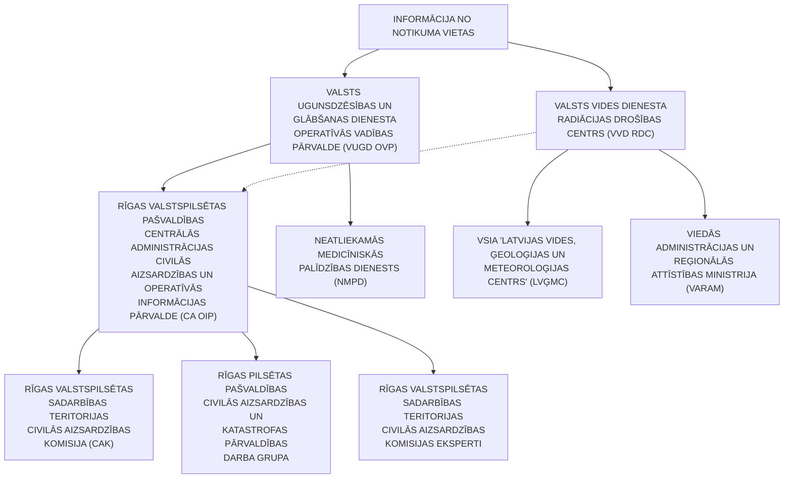

<!-- lpp. 55 -->

55

8.7. veic apziņošanu saskaņā ar Valsts civilās aizsardzības plānu un sniedz informāciju KVP priekšsēdētājam, sagatavo nepieciešamo informāciju plašsaziņas līdzekļiem;

8.8. veic informācijas apmaiņu ar citām valstīm un starptautiskām organizācijām radiācijas situācijas attīstības un iespējamo seku novērtēšanā, kā arī informē starptautiskās organizācijas un valstis par radīto varbūtējo radiācijas kaitējumu;

8.9. nepieciešamības gadījumā sniedz rekomendācijas vai ieteikumus par plānoto masu pasākumu uzsākšanu un atcelšanu, darba pārtraukšanu iestādēs, kas atrodas neatliekamo aizsardzības pasākumu plānošanas zonā un nav iesaistītas avārijas seku likvidēšanā;

8.10. saņemot ziņojumu vai konstatējot attiecīgu gadījumu, kas var izraisīt starptautiskas nozīmes sabiedrības veselības apdraudējumu, ziņo NMP dienestam;

8.11. nepieciešamības gadījumā un pēc KVP lēmuma vēršas pēc palīdzības Starptautiskajā atomenerģijas aģentūrā gadījumos, kad ir cietušie, kuru saņemtais jonizējošais starojums un apstarošanās pazīmes liecina, ka to medicīniskā aprūpe Latvijā nav iespējama.

9. Preventīvie, gatavības, reaģēšanas un seku likvidēšanas pasākumi (13. pielikums) radiācijas avārijas gadījumā.[25]

### C. Izmantotās literatūras saraksts

1. VUGD informatīvais materiāls “Bīstamo ķīmisko vielu noplūde vai radiācijas

avārija”.

https://www.vugd.gov.lv/lv/bistamo-kimisko-vielu-noplude-vai-radiacijas-avarija 2. VVD 02.10.2020. informatīvie materiāli “Rīcība radiācijas avāriju gadījumos”. https://www.vvd.gov.lv/lv/riciba-radiacijas-avariju-gadijumos

3. VUGD informatīvais materiāls “Vai tu zini, kā rīkoties ārkārtas gadījumos?”. https://www.vugd.gov.lv/lv/vai-tu-zini-ka-rikoties-arkartas-gadijumos

4. VVD 02.10. 2020. publikācija “Radiācijas līmenis Latvijā”. https://www.vvd.gov.lv/lv/radiacijas-limenis-latvija

## 14. Bioloģisko vielu negadījumi

1. Bioloģisko vielu negadījumi – negadījumi, kurus rada tā saucamie “bioloģiskie aģenti”.

2. Ir zināmi vairāk nekā 200 dažādu bioloģisko aģentu, kas var izraisīt infekcijas slimības, alerģijas un saindēšanos.

3. Bioloģiskās vielas ir bioloģiskie aģenti – mikroorganismi (vienas šūnas vai bezšūnu organismi, kas spēj vairoties vai pārnest ģenētisko materiālu), arī ģenētiski pārveidoti mikroorganismi, šūnu kultūras (laboratorijas apstākļos izaudzētas šūnas, kurām ir daudzšūnu organisma izcelsme) un cilvēka endoparazīti, kuri var būt infekcijas slimību izraisītāji vai kuri var izraisīt invāziju, alerģiju vai saindēšanos, vai kuru dēļ cilvēks var kļūt par slimības izraisītāja nēsātāju.

25 Ministru kabineta 26.08.2020. rīkojuma Nr. 476 “Par Valsts civilās aizsardzības plānu” 14. pielikums.

<!-- lpp. 56 -->

56

4. Bioloģisko vielu negadījums ir vērtējams kā notikums ar _maznozīmīgu risku_ , tā iestāšanās gadījumā var tikt skarts liels skaits cilvēku, kas var būtiski ietekmēt kopējo valsts saimniecisko darbību un ekonomiku.

5. Bioloģisko vielu (aģentu) izplatība var notikt netīši (piemēram, incidenta rezultātā laboratorijā vai pārvadājot infekcijas slimību izraisītājus starp laboratorijām) un tīši, jo bioloģiskie aģenti ir izvēles ieroči.

6. Kaut gan bioterorisma iespējamība Latvijā nav liela, tomēr bioloģiskā aģenta tīšai izmantošanai var būt graujoša ietekme uz sabiedrisko dzīvi.

7. Visticamāk, ka bioloģiskie aģenti noziedzīgā nolūkā varētu tikt izmantoti slēptā veidā. Šādos gadījumos incidenta sākumā nekas neliecina par uzbrukumu, bioloģiskais aģents tiek izplatīts ar tādu ierīci vai metodi, kas neļauj šo izplatīšanu pamanīt, cilvēki nezina to, ka ir eksponēti, slimības pazīmes parādās vēlāk – pēc inkubācijas perioda.

8. Šādus incidentus var atklāt veselības aprūpes darbinieki, sniedzot medicīnisko palīdzību saslimušajiem, un Slimību profilakses un kontroles centra epidemiologi, veicot epidemioloģisko uzraudzību.[26]

9. Preventīvie, gatavības, reaģēšanas un seku likvidēšanas pasākumi bioloģisko vielu negadījuma gadījumā (14. pielikums).

## 15. Ugunsgrēki

1. Ugunsgrēks ir nekontrolēta degšana (liesmas, gruzdēšana, sarkankvēle) ārpus speciāli paredzētās vietas, kas apdraud cilvēku dzīvību un veselību, rada materiālos zaudējumus un kaitējumu videi.

2. Galvenie ugunsgrēku iespējamie cēloņi ir neuzmanīga apiešanās ar uguni, bojātas elektroierīces vai nepareiza to ekspluatācija, tīša dedzināšana, bojāta apkures sistēma vai tās nepareiza ekspluatācija, bērnu rotaļas ar uguni un citi iemesli.

3. Ugunsgrēka izraisīto seku apjoms ir atkarīgs no vairākiem faktoriem, kur būtiskākie seku mazināšanas nosacījumi ir reaģēšanas laiks un atbilstoša rīcība. Ugunsgrēka izraisītās sekas var palielināties, ņemot vērā pirmo reaģētāju tehnisko un cilvēkresursu trūkumu.

4. Ugunsgrēks ir vērtējams kā notikums ar _vidēju risku_ .[27]

5. Preventīvie, gatavības, reaģēšanas un seku likvidēšanas pasākumi ugunsgrēka gadījumā (15. pielikums).

> 26 Ministru kabineta 26.08.2020. rīkojuma Nr. 476 “Par Valsts civilās aizsardzības plānu” 15. pielikums. 27 Ministru kabineta 26.08.2020. rīkojuma Nr. 476 “Par Valsts civilās aizsardzības plānu” 16. pielikums.

<!-- lpp. 57 -->

57

## 16. Avārijas vai negadījumi ostu un jūras hidrotehniskajās inženierbūvēs

1. Ostu un jūras hidrotehniskās būves ir hidrotehniskās un navigācijas būves jūrā, ostās, kuģu būves uzņēmumos un kuģojamās ūdenstecēs un ūdenstilpēs, kurās noteiktas speciālas prasības kuģošanai.

2. Katastrofa, kura ir saistīta ar avāriju un negadījumu ostas un jūras hidrotehniskajās inženierbūvēs, ir notikums, kas izraisījis cilvēku upurus un apdraud cilvēku dzīvību vai veselību, nodarījis kaitējumu vai radījis apdraudējumu cilvēkiem, videi vai īpašumam, kā arī radījis vai rada būtiskus materiālos un finansiālos zaudējumus un pārsniedz atbildīgo valsts un Pašvaldības institūciju ikdienas spējas novērst notikuma postošos apstākļus.

3. Avārija vai negadījums ostu un jūras hidrotehniskajās inženierbūvēs novērtēts kā notikums ar _maznozīmīgu risku_ .[28]

4. Preventīvie, gatavības, reaģēšanas un seku likvidēšanas pasākumi avārijas vai negadījumu ostu un jūras hidrotehniskajās inženierbūvēs gadījumā (16. pielikums).

## 17. Dambju un citu hidrotehnisko būvju pārrāvumi – Daugavas hidroelektrostaciju kaskādes hidrobūve

1. Daugavas HES kaskādes darbības mērķis ir, izmantojot ūdens enerģiju, ražot elektroenerģiju, nepieļaujot vai novēršot HES ēku statiskās noturības zudumu.

2. Par Daugavas HES pārrāvuma iemeslu var būt hidrotehnisko būvju nepareiza ekspluatācija, terora akts vai  zemestrīce.

3. Daugavas HES pārrāvuma risks tiek vērtēts kā _nozīmīgs_ , izraisot sekas ar ievērojamu cilvēku upuru skaitu,  appludinot Daugavas akvatorijam piegulošās sauszemes teritorijas un nodarot kaitējumu ekosistēmai, kā arī izraisot vispārīgus traucējumus iedzīvotāju pamatvajadzību nodrošināšanai (elektrības piegādes traucējumi, veselības aprūpes traucējumi, pārtikas un dzeramā ūdens piegādes traucējumi, siltuma un dzeramā ūdens piegādes traucējumi,  notekūdeņu sistēmas bojājumi un citi).

4. Kā būtiskus seku mazināšanas pasākumus Daugavas HES pārrāvumu gadījumā var minēt Daugavas HES lejteces ūdenskrātuvju ūdens līmeņa samazināšanu un savlaicīgi veiktu cilvēku agrīno brīdināšanu apdraudētajās teritorijās.[29]

> 28 Ministru kabineta 26.08.2020. rīkojuma Nr. 476 “Par Valsts civilās aizsardzības plānu” 17. pielikums.

> 29 Ministru kabineta 26.08.2020. rīkojuma Nr. 476 “Par Valsts civilās aizsardzības plānu” 18. pielikums.

<!-- lpp. 58 -->

58

## 5. Risku novērtēšanas rezultāts – karte:

6. Preventīvie, gatavības, reaģēšanas un seku likvidēšanas pasākumi dambju un citu hidrotehnisko būvju pārrāvumu – Daugavas hidroelektrostaciju kaskādes hidrobūve – gadījumā (17. pielikums).

## 18. Pārvades un sadales elektrotīklu bojājumi

1. Elektroenerģijas patērētājiem, iedzīvotājiem un saimnieciskās darbības veicējiem elektroapgādi no elektroenerģijas ražotājiem nodrošina elektrotīklu infrastruktūra.

2. Elektrotīklu sadali Latvijā nodrošina AS “Sadales tīkls”, kas no augstsprieguma (330–110 kV) pārvades līnijām sadala vidsprieguma līnijas (6–20 kV) un zemsprieguma līnijas (0,23–1,00 kV), sniedzot elektroenerģijas piegādes pakalpojumu vairāk nekā 1,1 miljonam elektroenerģijas sadales sistēmas lietotāju objektiem, ar savu pakalpojumu aptverot 99 % Latvijas teritorijas.

3. Sadales elektrotīkla kopgarums ir aptuveni 94 000 km, no kuriem aptuveni 45 tūkstoši jeb 48 % ir izbūvēti kailvadu gaisvadu līniju veidā, kas pakļautas tiešai laikapstākļu ietekmei.

4. Lai samazinātu sadales elektrotīkla bojājumu riska iestāšanos, tiek veikta gan elektrotīkla pakāpeniska pārbūve, gan regulārie elektroietaišu uzturēšanas pasākumi.

5. Kopš 2011. gada kailvadu elektrolīniju īpatsvars kopējā sadales elektrotīkla kopgarumā ir samazināts par 16 % (no 64 % 2011. gadā līdz 48 % 2018. gadā), elektrotīklu pārbūvē izmantojot tādus tehniskos risinājumus kā kabeļlīniju, izolēto vadu, gaisvadu piekarkabeļu izbūvi, kas būtiski samazina elektrotīkla atkarību no laikapstākļu ietekmes.

> **Karte (lpp. 58): 17.1. attēls. Daugavas HES kaskādes hidrobūvju pārrāvuma iespējamās ietekmes karte**  
> Tips: Daugavas hidroelektrostaciju (Rīgas HES, Ķeguma HES, Pļaviņu HES) hidrobūvju katastrofāla pārrāvuma applūdinājuma riska karte Latvijas mērogā.  
> **Kartes apraksts un skartās pašvaldības:**  
> Kartē oranžā krāsā iezīmētas pašvaldības Daugavas baseinā un lejtecē, kuras pakļautas tiešam applūšanas riskam kaskādes pārrāvuma gadījumā:  
> - **Rīgas valstspilsēta** (Daugavas grīva, salas, krastmalas un zemās apkaimes);  
> - **Salaspils novads** (tieši lejpus Rīgas HES aizsprosta);  
> - **Ogres novads** (Ķeguma un Ogres piegulošās teritorijas);  
> - **Aizkraukles novads** (Pļaviņu HES ietekmes zona);  
> - **Jēkabpils novads**, **Līvānu novads**, **Krāslavas novads**, **Augšdaugavas novads un Daugavpils valstspilsēta**.  
> Pārējā Latvijas teritorija attēlota zaļā krāsā kā ārpus hidrotehnisko būvju pārrāvuma tiešās apdraudējuma zonas.

<!-- lpp. 59 -->

59

6. Bojājumi augstsprieguma līnijās (110 kV un 330 kV) ir novērojami reti, taču sadales tīklos (≤20 kV) elektrotīklu bojājumi  tiek novēroti katru gadu dažādu hidrometeoroloģisko apstākļu dēļ, piemēram, vētras, zibens, plūdi, apledojums u. c.

7. Pārvades elektrotīklu bojājums tiek novērtēts kā notikums ar _nozīmīgu risku_ , sadales elektrotīklu bojājums tiek novērtēts kā notikums ar _vidēju risku_ .

8. Būtiski elektrotīklu bojājumi var atstāt negatīvu ietekmi uz iedzīvotāju pamatvajadzību nodrošināšanu – elektroapgādi, kas var radīt kaskādes veida reakciju uz citu pamatvajadzību nodrošināšanu, – ūdensapgādi, siltumapgādi, sakaru nodrošinājumu, drošību un veselības aprūpi, tādēļ elektroapgādes traucējumu seku līmenis tiek novērtēts tā, ka tas var radīt smagas sekas.

9. Ilgstoša elektroapgādes pārtrūkuma gadījumā tiek ietekmēti ražošanas objekti, komunālie uzņēmumi, publisko elektronisko sakaru tīkli, radio un televīzijas pakalpojumi, kas rezultējas ar būtiskiem zaudējumiem tautsaimniecībai un rada draudus valsts iedzīvotāju labklājībai un veselībai.[30]

10. Preventīvie, gatavības, reaģēšanas un seku likvidēšanas pasākumi pārvades un sadales elektrotīklu bojājumu gadījumā (18. pielikums).

## 19. Būvju sabrukums

Sadaļas saturs:

A. Ieteikumi personām, kuras uzturas Pašvaldības administratīvajā teritorijā

- B. Katastrofas/apdraudējuma vispārējais raksturojums

- C.  Izmantotā literatūra

### A. Ieteikumi personām, kuras uzturas Pašvaldības administratīvajā teritorijā

### Rīcība būvju sabrukuma gadījumā

1. Ja atrodies ēkā/būvē, kura ir sabrukusi, un vari pārvietoties:

- 1.1. zvani VUGD **112** :

- 1.1.1. sagatavojies atbildēt uz  jautājumiem;

- 1.1.2. nosauc precīzu adresi vai apraksti notikuma vietu;

- 1.1.3. īsi pastāsti, kas ir noticis;

- 1.1.4. centies par negadījumu atcerēties visu pēc iespējas precīzāk;

- 1.1.5. pēc dispečera lūguma nosauc savu vārdu, uzvārdu un tālruņa numuru;

- 1.1.6. **atceries,** nepārtrauc sarunu pirmais;

- 1.1.7. saglabā mieru un atbildi uz dispečera jautājumiem;

- 1.2. ja iespējams, dodies ārā no ēkas/būves uz drošu vietu, tālāk no sabrukušās

ēkas/būves;

- 1.3. pārvietojies gar nesošajām ēkas/būves sienām, kāpņu telpas iekšpusi;

30 Ministru kabineta 26.08.2020. rīkojuma Nr. 476 “Par Valsts civilās aizsardzības plānu” 19. pielikums.

<!-- lpp. 60 -->

60

- 1.4. pārvietojoties aizsargā galvu ar kādu platāku priekšmetu (grāmata, mape u. c.),

- ja to nav iespējams nodrošināt, tad – ar roku;

   - 1.5. izvairies no šķēršļiem vai mēģini tos pārvarēt pārvietošanās laikā;

   - 1.6. esi gatavs, ka var notikt atkārtoti sagruvumi;

- 1.7. ja nevari izkļūt no ēkas, tad paliec visdrošākajā vietā pie nesošajām ēkas/būves

- konstrukcijām un gaidi palīdzību;

   - 1.8. neizmanto sabrukušas kāpnes un citas konstrukcijas, kas izskatās nedrošas;

- 1.9. nelieto atklātu uguni (sveces, sērkociņi, šķiltavas), jo ēkā, iespējams, ir

- noplūdusi gāze, tā vietā izmanto apgaismes lukturi.

   2. Ja esi iesprostots zem ēkas/būves konstrukcijām:

   - 2.1. zvani VUGD **112** ;

   - 2.2. sagatavojies atbildēt uz  jautājumiem:

   - 2.2.1. nosauc precīzu adresi vai apraksti notikuma vietu;

   - 2.2.2. īsi pastāsti, kas ir noticis;

   - 2.2.3. centies par negadījumu atcerēties visu pēc iespējas precīzāk;

   - 2.2.4. pēc dispečera lūguma nosauc savu vārdu, uzvārdu un tālruņa numuru;

   - 2.2.5. **atceries** , nepārtrauc sarunu pirmais;

   - 2.2.6. saglabā mieru un atbildi uz dispečera jautājumiem;

   - 2.3. netērē savu enerģiju – nekliedz un lieki nekusties;

- 2.4. ja iespējams, aizsedz muti ar drēbes gabalu, lai mazinātu putekļu ieelpošanu; 2.5. regulāri mēģini klauvēt pie konstrukcijām, komunikāciju caurulēm, tā radot

- skaņu un brīdinot par savu atrašanās vietu;

- 2.6. ieslēdz savu mobilo tālruni uz īsu laiku un tad atkal slēdz ārā, lai taupītu

- akumulatoru, jo tā radioviļņi palīdz izsekot tevi.

   3. Pazīmes, kas var liecināt par būves sabrukšanu:

- 3.1. ēkas zemākie stāvi sāk plaisāt vai ir dzirdamas dīvainas skaņas (plaisāšana,

- krakšķēšana u. tml.);

   - 3.2. logi un durvis sāk deformēties un tos ir grūti attaisīt un aiztaisīt;

   - 3.3. ēkas kolonnas sāk grūt;

- 3.4. uz ēkas/būves kolonnām parādās tīklveida plaisas vai starpstāvi un grīdas pēkšņi

- paliek nokareni;

   - 3.5. jūti asu gāzes, dūmu smaku ar vēja plūsmu;

   - 3.6. nepārtraukti ir dzirdami sprādzieni.

   4. Ja tiek konstatētas iepriekšminētās pazīmes:

- 4.1. paziņo to apkārtējiem, skaļi kliedzot vai nospiežot tuvāko ugunsgrēka

- atklāšanas un trauksmes signalizācijas sistēmas manuālo pogu (skatīt 19.1. attēlu);

<!-- lpp. 61 -->

61

19.1. attēls

- 4.2. zvani VUGD **112** , nosauc adresi un informē par iespējamu ēkas/būves

- sabrukšanu;

   - 4.3. pēc iespējas ātrāk centies pamest ēku/būvi.

### B. Katastrofas/apdraudējuma vispārējais raksturojums

**Vispārēja informācija par būvju sabrukumu**

1. Ēku/būvju sabrukšana ir apdraudējums, kas var izraisīt cilvēku upurus, nodarīt kaitējumu cilvēku veselībai, nodarīt materiālos zaudējumus, kaitējumu videi, var tikt bojātas inženierkomunikācijas (gāzes apgāde, elektroapgāde, siltumapgāde, ūdensapgāde).

2. Ēku/būvju sabrukšanu var izraisīt:

- 2.1. sprādziens;

2.2. dabas katastrofas (piemēram, ļoti stipra vētra, plūdi, zemestrīce);

- 2.3. būvniecību reglamentējošo normatīvo aktu neievērošana (piemēram,

- neatbilstoša būvmateriālu kvalitāte, nepareizs inženiertehniskais risinājums), būvju, ēku vai būvkonstrukciju tehniskais nolietojums;

2.4. terora akts;

2.5. citi faktori, kas var ietekmēt būvju un ēku nestspēju un noturību (piemēram, ugunsgrēks, citu būvdarbu veikšana blakus ēkai vai būvei, apjomīgu priekšmetu ietriekšanās ēkā vai būvē, bīstamo ķīmisko vielu iedarbība, avārija maģistrālajos vai sadales ūdensapgādes cauruļvados, karš vai militārs iebrukums);[31]

2.6. iestāžu, dienestu, organizāciju u. c. informācijas apmaiņa un reaģēšanas aktivizācijas shēma būvju sabrukuma gadījumā (skatīt 19.1. shēmu).

31 Ministru kabineta 26.08.2020. rīkojuma Nr. 476 “Par Valsts civilās aizsardzības plānu” 20. pielikums.

> **Drošības aprīkojums (lpp. 61): 19.1. attēls. Ugunsdrošības rokas trauksmes poga un marķējuma zīme**  
> - **Rokas trauksmes poga (Manual Call Point)**: Sarkana rokas trauksmes poga ar divām melnām bultiņām, kas vērstas uz centru. Tiek izmantota manuālai trauksmes ierosināšanai būves apdraudējuma vai ugunsgrēka gadījumā.  
> - **Ugunsdrošības zīme**: Sarkans taisnstūris ar baltu piktogrammu (roka, kas nospiež pogu, un liesmas) ar tekstu: *"TRAUKSMES POGA Ugunsgrēka gadījumā NOSPIEST!"*.

<!-- lpp. 62 -->

62

19.1. shēma

3. Preventīvie, gatavības, reaģēšanas un seku likvidēšanas pasākumi būves

sabrukuma gadījumā (19. pielikums).

### C. Izmantotā literatūra

1. VUGD informatīvais materiāls “Vai tu zini, kā rīkoties ārkārtas gadījumos?”. https://www.vugd.gov.lv/lv/vai-tu-zini-ka-rikoties-arkartas-gadijumos 2. Informatīvais materiāls “Rīcība ēkas/būves sagruvuma gadījumā”. https://www.riga.lv/lv/riciba-arkartas-gadijumos

**20. Bīstamo ķīmisko vielu noplūde no kuģiem, kuģa uzskriešana uz sēkļa, kuģu sadursme, pasažieru kuģu katastrofa (20. pielikums)**

Sadaļas saturs:

- A. Ieteikumi personām, kuras uzturas Pašvaldības administratīvajā teritorijā un iesaistīto dienestu un iestāžu rīcība

- B. Katastrofas/apdraudējuma vispārējais raksturojums

- C.   Izmantotās literatūras saraksts

### 19.1. shēma “Iestāžu, dienestu, organizāciju informācijas apmaiņa un reaģēšanas aktivizācijas shēma būvju sabrukuma gadījumā”

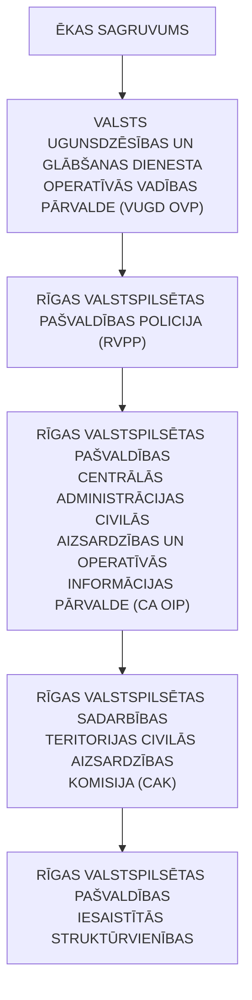

<!-- lpp. 63 -->

63

### A. Ieteikumi personām, kuras uzturas Pašvaldības administratīvajā teritorijā, un iesaistīto dienestu un iestāžu rīcība

1. Iedzīvotāju brīdināšana un informēšana:

1.1. izdzirdot trauksmes sirēnu, ieslēdz Latvijas Televīziju un Latvijas Radio, kur tevi informēs par piesārņojuma draudiem un nepieciešamo turpmāko rīcību.

1.2. seko līdzi atbildīgo dienestu mājaslapās:

1.2.1. Valsts ugunsdzēsības un glābšanas dienests – www.vugd.gov.lv;

1.2.2. Valsts vides dienests – www.vvd.gov.lv;

1.3. seko līdzi sociālajā tīklā _Facebook_ :

1.3.1. Valsts ugunsdzēsības un glābšanas dienests;

1.3.2. Valsts vides dienests;

- 1.4. seko līdzi sociālajā tīklā _X_ – Valsts ugunsdzēsības un glābšanas dienests – @ugunsdzeseji.

2. Bīstamo ķīmisko vielu noplūdes no kuģa, kuģa uzskriešanas uz sēkļa, kuģu sadursmes un  pasažieru kuģu katastrofas gadījumā:

2.1. rīkojies atbilstoši valsts un Pašvaldības operatīvo dienestu un iestāžu sniegtajiem ieteikumiem;

2.2. netuvojies notikuma vietai;

2.3. nepeldies un nenodarbojies ar ūdens aktivitātēm katastrofas tuvumā;

2.4. ja esi cietis katastrofas izraisīto seku dēļ, sazinies ar NMPD, zvanot uz **113** , vai zvani pa tālruni **112** .

3. Lejupielādē lietotni “112 Latvija” (skatīt 20.1.attēlu), kas uzlabo iespēju iedzīvotājiem, it īpaši cilvēkiem ar dzirdes un runas problēmām, sazināties ar vienoto ārkārtas palīdzības izsaukumu numuru **112** , kā arī saņemt un uzzināt informāciju, kas ir būtiska, lai sagatavotos iespējamam apdraudējumam un mazinātu negadījuma sekas.

> **Informatīvais paziņojums (lpp. 63): Iedzīvotāju brīdināšana un informēšana kuģu katastrofā**  
> **IZDZIRDOT TRAUKSMES SIRĒNAS VAI APZIŅOŠANU AR SKAĻRUŅIEM:**  
> - **IESLĒDZ TV**: Latvijas Televīzija (LTV1, LTV7);  
> - **IESLĒDZ RADIO**: Latvijas Radio (LR1, LR2, LR4).  
> *Seko līdzi atbildīgo dienestu oficiālajai informācijai www.vugd.gov.lv un www.vvd.gov.lv.*

<!-- lpp. 64 -->

64

20.1. attēls

4. Iesaistīto dienestu un iestāžu atbildība un pienākumi katastrofas gadījumā: 4.1. iedzīvotāju informēšanu par bīstamo ķīmisko vielu noplūdi no kuģa, kuģa uzskriešanu uz sēkļa, kuģu sadursmi, pasažieru kuģu katastrofu Pašvaldības administratīvās teritorijas sauszemes un iekšējo ūdeņu teritorijā īsteno VUGD, VVD, valsts un pašvaldību institūcijas, elektroniskie plašsaziņas līdzekļi, raidorganizācijas un elektronisko sakaru komersanti;

4.2. par evakuācijas nepieciešamību, atkarībā no katastrofas mēroga, lems kuģa kapteinis (no kuģa) un glābšanas darbu vadītājs un organizēs operatīvie dienesti un CAK;

4.3. kuģa uzskriešanas uz sēkļa, kuģu sadursmes, pasažieru kuģu katastrofas gadījumā pasažieru izvietošanu pagaidu mītnēs organizēs glābšanas darbu vadītājs sadarbībā ar  CAK un citiem dienestiem un iestādēm;

4.4. nepieciešamības gadījumā CAK lems par preses konferences organizēšanu elektronisko plašsaziņas līdzekļu pārstāvjiem, lai informētu sabiedrību par katastrofas draudiem, notikušo katastrofu un veicamajiem pasākumiem;

> **Mobilā lietotne (lpp. 64): 20.1. attēls. Viedtālruņa lietotnes "112 Latvija" saskarne un funkcijas**  
> - **Ārkārtas izsaukuma pogas**: Ātrais zvans `112` un SMS nosūtīšana uz `112` personām ar dzirdes vai runas traucējumiem.  
> - **Brīdinājumu josla**: Operatīvie paziņojumi (piemēram, par trauksmes sirēnu pārbaudi vai hidrometeoroloģiskajiem draudiem).  
> - **Automātiskā GPS atrašanās vieta**: Lietotne uzrāda lietotāja precīzas koordinātes (piemēram, $56^\circ 57' 5''	ext{N}$, $24^\circ 6' 28''	ext{E}$, precizitāte līdz 13 m), kas automātiski tiek nodotas glābšanas dienestam izsaukuma brīdī.  
> - **Drošības padomi un aktualitātes**: Operatīvās uzvedības ieteikumi dažādu apdraudējumu situācijās.

<!-- lpp. 65 -->

65

4.5. operatīvo dienestu informēšanu par iespējamo bīstamo vielu noplūdi no kuģa, kuģa uzskriešanu uz sēkļa, kuģu sadursmi vai pasažieru kuģa negadījumu (arī par ārkārtas situāciju) veiks kuģa atbildīgā persona, īpašnieks vai tiesiskais valdītājs, fiziska vai juridiska persona;

4.6. reaģēšanu uz notikumu, izlūkošanas veikšanu notikuma vietā (jūrā) un glābšanas darbu koordinēšanu veiks Jūras meklēšanas un glābšanas koordinācijas centrs, NBS Jūras spēku Krasta apsardzes dienests, NBS Gaisa spēki, citu kuģu atbildīgās personas, īpašnieki vai tiesiskie valdītāji;

4.7. kuģa apkalpes un pasažieru glābšanu un nogādāšanu krastā veiks NBS Jūras spēku Krasta apsardzes dienests, Jūras meklēšanas un glābšanas koordinācijas centrs, NBS Gaisa spēki, citu kuģu atbildīgās personas, īpašnieki vai tiesiskie valdītāji;

4.8. glābšanas dienestu, citu dienestu un avārijas brigāžu iesaistīšanu reaģēšanā un seku likvidēšanā (piesārņojuma savākšana) veiks MRCC;

4.9. bīstamo ķīmisko vielu vai maisījumu noplūdes un bīstamo ķīmisko vielu vai maisījumu piesārņojuma gadījumā jūras krastā, izņemot jūru un iekšējos ūdeņos no bāzes līnijas līdz jūras krasta līnijai, glābšanas, reaģēšanas un seku likvidēšanas darbus veiks VUGD;

4.10. nepieciešamības gadījumā savvaļas dzīvnieku glābšanu organizēs Pašvaldība, komersanti, NVO un sabiedriskās organizācijas, Latvijas Veterinārārstu biedrība;

4.11. neatliekamās medicīniskās palīdzības sniegšanu cietušajiem un pasākumu īstenošanu atbilstoši Valsts katastrofu medicīnas plānam un Slimnīcu katastrofu medicīnas plāniem veiks NMPD, slimnīcas un citas ārstniecības iestādes;

4.12. iedzīvotāju evakuāciju un pamatvajadzību nodrošināšanu nepieciešamības gadījumā īstenos Pašvaldība, iesaistot komersantus, NVO un sabiedriskās organizācijas, kā arī reliģiskās organizācijas.

5. Izvērtējot riskus, tika secināts, ka lielāko bīstamību Pašvaldības administratīvās teritorijas iedzīvotājiem un viesiem radītu bīstamo vielu noplūde no kuģa, kuģa uzskriešana uz sēkļa, kuģu sadursme vai pasažieru kuģa negadījums Rīgas brīvostā.

6. Jūrā esošo kuģu brīdināšanu bīstamo ķīmisko vielu noplūdes no kuģiem, kuģa uzskriešanas uz sēkļa, kuģu sadursmes un pasažieru kuģu katastrofas gadījumā jūras akvatorijā pa radiosakariem īsteno NBS Jūras spēku Krasta apsardzes dienesta Jūras meklēšanas un glābšanas koordinācijas centrs (MRCC Riga).

7. Apziņošanas algoritms, ja bīstamo vielu noplūde no kuģa, kuģa uzskriešana uz sēkļa, kuģu sadursme vai pasažieru kuģa negadījums noticis Rīgas brīvostā (skatīt 20.1. shēmu).

<!-- lpp. 66 -->

66

20.1. shēma

8. Apziņošanu, glābšanas un reaģēšanas uz negadījumu darbu koordinēšanu jūras akvatorijā veic NBS Jūras spēku Krasta apsardzes dienesta Jūras meklēšanas un glābšanas koordinācijas centrs (MRCC Riga) saskaņā ar iepriekš noteiktu algoritmu (skatīt 20.2. shēmu).

20.2. shēma

### 20.1. shēma “Reaģēšanas algoritms, ja bīstamo vielu noplūde no kuģa, kuģa uzskriešana uz sēkļa, kuģu sadursme vai pasažieru kuģa negadījums noticis Rīgas brīvostā”

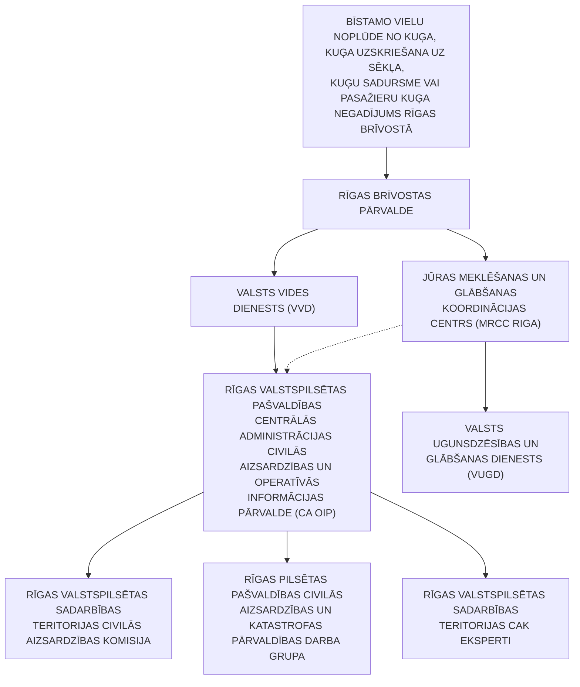

### 20.2. shēma “Reaģēšanas algoritms, ja kuģa negadījums noticis jūras akvatorijā (MRCC vadība)”

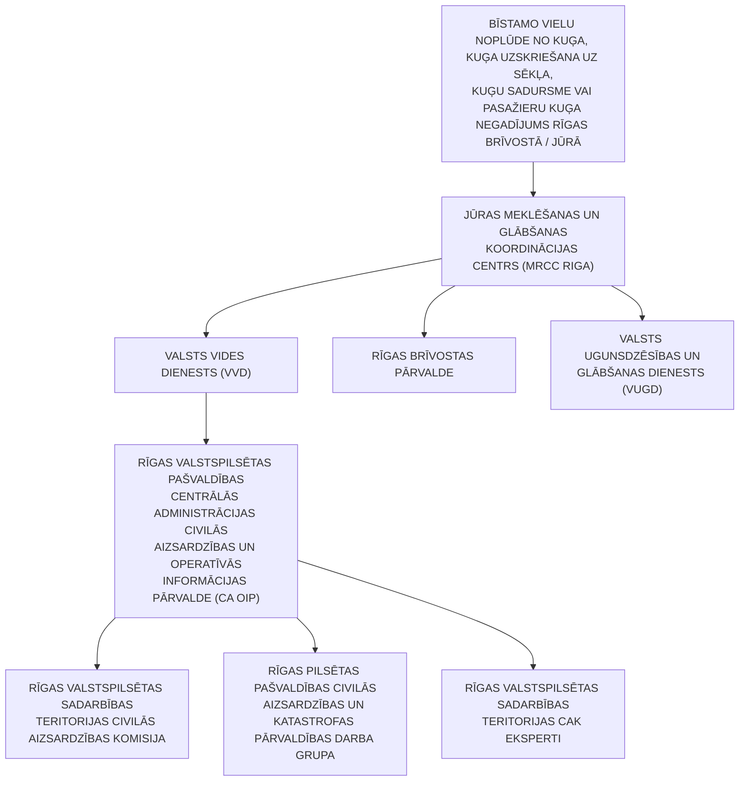

<!-- lpp. 67 -->

67

9. Apziņošanas algoritms, ja bīstamo vielu noplūde no kuģa, kuģa uzskriešana uz

sēkļa, kuģu sadursme vai pasažieru kuģa negadījums noticis Rīgas Daugavas akvatorijā (skatīt 20.3.shēmu).

20.3. shēma

**B. Katastrofas/apdraudējuma vispārējais raksturojums**

### Vispārējā informācija par bīstamo ķīmisko vielu noplūdi no kuģiem, kuģa uzskriešanu uz sēkļa, kuģu sadursmi, pasažieru kuģu katastrofu

1. Ņemot vērā, ka Baltijas jūra ir sekla, daļēji slēgta jūra ar intensīvu satiksmes noslogojumu visā reģionā, jebkura veida kuģa vai citas iekārtas negadījums jūrā var radīt katastrofāla apjoma sekas gan nacionālā, gan starptautiskā līmenī.

2. Kuģošanas ceļš, kas tiek izmantots nonākšanai Rīgā un Rīgas jūras līča mazajās ostās, ietver gan Rīgas jūras līci, gan Irbes jūras šaurumu, kas riska izvērtēšanas aspektā ir bīstamākā vieta Latvijas teritoriālās jūras ūdeņos. Irbes jūras šaurumu izmanto arī kuģi, lai nokļūtu Igaunijas ostās Rīgas jūras līcī.

### 20.3. shēma “Apziņošanas algoritms, ja bīstamo vielu noplūde no kuģa, kuģa uzskriešana uz sēkļa, kuģu sadursme vai pasažieru kuģa negadījums noticis Rīgas Daugavas akvatorijā”

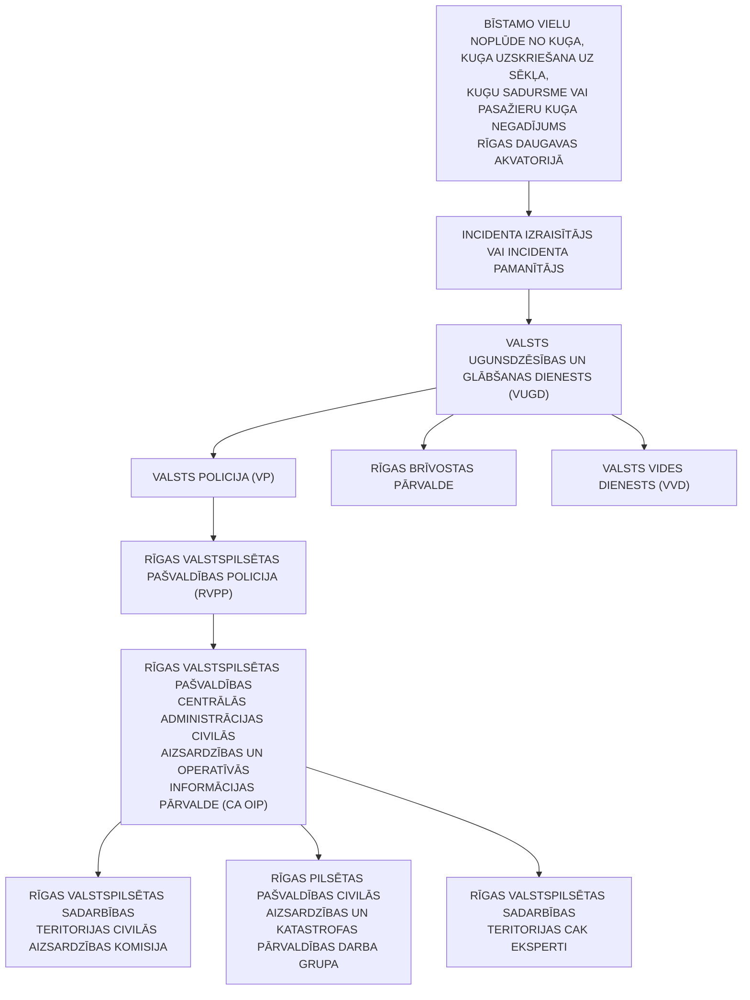

<!-- lpp. 68 -->

68

3. Notiekot liela apjoma bīstamo ķīmisko vielu noplūdei jūrā vai Latvijas piekrastes tiešā tuvumā, ko neizdodas efektīvi likvidēt, paredzami būtiski zaudējumi jūras vides resursiem, zvejniecības nozarei, tūrisma nozarei, sabiedrības interesēm (piemēram, zvejošanas aizliegums, pludmales slēgšana u.tml.).

4. Bīstamo ķīmisko vielu noplūdes cēlonis jūrā var būt kuģu sadursme, kuģa uzsēšanās uz sēkļa, kuģa korpusa bojājumi, ugunsgrēks uz kuģa, kuģa apkalpes kļūda, kravas pazaudēšana.

5. Sakarā ar intensīvo kuģu noslogojumu reģionā un noplūdes rezultātā iespējamo seku apjomu bīstamo ķīmisko vielu noplūde no kuģiem ir vērtējama kā notikums ar _nozīmīgu_ risku:

5.1.  pieaugot tendencei pārvadāt ķīmiskas un bīstamas preces pa jūru, palielinās arī ar šīm vielām saistītu negadījumu skaits. Šādas notikumu attīstības dēļ tiek izvirzītas augstas prasības personālam, kas ir atbildīgs par pasākumu veikšanu šādu negadījumu novēršanai, lai pret iespējamo kaitējumu aizsargātu gan cilvēkus, gan vidi;

5.2.  ķīmiskas vielas noplūdei vienlaicīgi var piemist vairāk nekā viena no šīm īpašībām. Piemēram, viela var peldēt pa ūdens virsmu un tajā pašā laikā iztvaikot un/vai izšķīst, tā var arī reaģēt ar ūdeni (skatīt 20.2. attēlu);

20.2. attēls. Galvenie veidi, kā ķīmiskās vielas reaģē, ieplūstot vai nonākot ūdenī

5.3. nav iespējams sniegt vispārīgus norādījumus attiecībā uz to, kā rīkoties saistībā ar ķīmiskajām vielām, kas reaģē ar ūdeni. Pasākumi negadījuma novēršanai ir jāplāno, katru gadījumu izvērtējot atsevišķi un ļoti lielu uzmanību pievēršot konkrētās vielas reaģētspējai (skatīt 20.3. attēlu);

> **Diagramma (lpp. 68): 20.2. attēls “Galvenie veidi, kā ķīmiskās vielas reaģē, ieplūstot vai nonākot ūdenī”**  
> Shēmā attēloti četri ķīmisko vielu uzvedības modeļi ūdens vidē:  
> 1. **Ātri iztvaiko, saskaroties ar ūdens virsmu** (veido gāzu/tvaiku mākoni virs ūdens);  
> 2. **Peld pa virsu** (ūdenī nešķīstošas vielas ar blīvumu $< 1	ext{ g/cm}^3$, veido peldošu plankumu);  
> 3. **Ātri izšķīst ūdenī** (šķīstošas vielas, kas sajaucas ar ūdens masu un tiek nestas ar straumi);  
> 4. **Nogrimst** (smagas, nešķīstošas vielas ar blīvumu $> 1	ext{ g/cm}^3$, kas nosēžas uz gultnes).

<!-- lpp. 69 -->

69

20.3. attēls. Ar ūdeni reaģējošu vielu piemēri

5.4. ķīmiskas vielas noplūdes novirze un izkliede ūdens vidē, cik drīz vien iespējams pēc noplūdes sākuma, ir jānovērtē un jāaprēķina, lai iegūtu pamatu riska analīzei. Ciktāl tas iespējams, aplēses pamatā jābūt noplūdušās vielas fizikālajām īpašībām, kā arī tādiem vides apstākļiem kā temperatūra, vējš, ūdens straume u. c.;

20.4.attēls. Ķīmiskas vielas noplūdes novirzi un izkliedi var prognozēt, izmantojot datorizētas modelēšanas programmas

5.5.  verdoša šķidruma tvaiku izplešanās sprādziens ir svarīgs jēdziens avārijas novēršanas pasākumu jomā, jo īpaši, ja avārija saistīta ar sašķidrinātu naftas gāzi (LPG).

> **Ilustrācija (lpp. 69): 20.3. attēls. Ar ūdeni reaģējošu vielu piemēri**  
> - **Nātrija-kālija sakausējums**: Reaģē ar ūdeni pie ūdens virsmas, intensīvi izdalot viegli uzliesmojošu **ūdeņradi ($H_2$)** un siltumu.  
> - **Kalcija karbīds ($CaC_2$)**: Nogrimst gruntī un reaģē ar ūdeni, izdalot eksplozīvu gāzi **acetilēnu ($C_2H_2$)** burbuļu veidā, kas paceļas virspusē.

> **Shēma (lpp. 69): 20.4. attēls. Ķīmiskas vielas noplūdes novirzi un izkliedi var prognozēt, izmantojot datorizētas modelēšanas programmas**  
> Datorizēta avāriju modelēšanas sistēma ostas akvatorijā aprēķina 3 vienlaicīgas prognožu komponentes:  
> 1. **Gāzu mākoņa pārvietošanās gaisā prognoze** (vēja ātrums, virziens, atmosfēras stabilitātes klase);  
> 2. **Pa ūdens virsmu peldošas ķīmisko vielu noplūdes prognoze** (virszemes straumes un vēja ietekme);  
> 3. **Ūdenstilpē izšķīdušas ķīmiskas vielas pārvietošanās prognoze** (hidrodinamiskā plūsma un dispersija upē/jūrā).

<!-- lpp. 70 -->

70

Daudzas katastrofas ir notikušas, LPG tvertnēs notiekot verdoša šķidruma tvaiku izplešanās sprādzienam;

5.6. verdoša šķidruma tvaiku izplešanās sprādziens var notikt, ja tvertne ar paaugstinātu spiedienu, kurā atrodas LPG, no ārpuses tiek pakļauta ugunij. Ja tvertne nespēj izturēt pieaugošo spiedienu, tā uzsprāgs un tajā esošā LPG tiks izsviesta apkārtnē, sajauksies ar gaisu un aizdegsies uguns lietus veidā;

5.7. sašķidrinātā LPG, kas atrodas tvertnē, vispirms atdzesē tvertnes sienu. Dzesējošais efekts zūd, kad iztvaikošanas rezultātā pazeminās šķidruma līmenis. Tērauda siena zaudē izturību un plīst, un notiek verdoša šķidruma tvaiku izplešanās sprādziens;

5.8. līdzīgās situācijās notiek uz kuģiem (skatīt 20.5. attēlu). Šādā gadījumā tvertne ir jāaplej ar ūdeni no droša attāluma, tomēr jāapsver arī evakuācija.

20.5. attēls

6. Kuģa uzskriešanu uz sēkļa jūrā var izraisīt vairāki faktori vai to kombinācija –

kuģošanas intensitātes, kuģa komandas navigācijas kļūdas, slikts kuģa tehniskais stāvoklis un nelabvēlīgi laikapstākļi:

   - 6.1. uzskriešana uz sēkļa ir viens no statistiski visbiežākajiem jūras negadījumiem; 6.2. visbīstamākās sekas kuģa uzskriešanai uz sēkļa ir saistītas ar bīstamo ķīmisko

vielu noplūdi;

6.3. rīcības plānu pasažieriem skatīt 20.6. attēlā;

> **Ilustrācija (lpp. 70): 20.5. attēls. Ugunsgrēks uz sašķidrinātās gāzes vai naftas ķīmijas tankkuģa un BLEVE draudi**  
> Ilustrācijā parādīts kuģis ar liesmām pie kravas tilpnēm un uzraksts **"UGUNS"**.  
> **BLEVE fenomens (Boiling Liquid Expanding Vapor Explosion):** Ja spiedientvertne ar sašķidrinātu naftas gāzi (LPG) no ārpuses tiek pakļauta liesmu iedarbībai, šķidruma līmenim krītoties tvertnes metāla siena zaudē dzesēšanu un izturību, kā rezultātā notiek eksplozīvs tvertnes plīsums, sašķidrinātās gāzes momentāna izplešanās un gigantiska ugunsbumbas ("uguns lietus") veidošanās. Aizsardzībai nepieciešama nepārtraukta tvertņu dzesēšana ar ūdeni no droša attāluma un savlaicīga personāla evakuācija.

<!-- lpp. 71 -->

71

20.6. attēls

6.4. kuģa uzskriešanas uz sēkļa negadījumi ar katastrofālām sekām notiek reti.

7. Divu kuģu sadursmes cēloņi ir vienādi ar kuģa uzskriešanas uz sēkļa cēloņiem: 7.1. atšķirībā no kuģa uzskriešanas uz sēkļa sekām divu kuģu sadursmes sekas ir ievērojamākas, jo sadursme var notikt tālāk no krasta, kā rezultātā palīdzības sniegšanas laiks palielinās un kuģi var nogrimt korpusa bojājumu gadījumā;

7.2. rīcības plānu pasažieriem skatīt 20.6. attēlā;

7.3. kuģu sadursmes negadījums ar katastrofālām sekām notiek reti.

8. Kā potenciāli visbīstamākais incidenta veids ar vislielāko iespējamo cietušo un upuru skaitu ir pasažieru kuģa ugunsgrēks:

8.1.  ugunsgrēks uz pasažieru kuģa tā uzbūves dēļ var radīt apdraudējumu cilvēku veselībai un dzīvībai, tas saistīts ar nosmakšanas un saindēšanās riskiem, kā arī nosalšanas un noslīkšanas riskiem;

8.2. šāda scenārija attīstības gadījumā ļoti liela nozīme ir kuģa apkalpes gatavībai adekvāti reaģēt un pārvaldīt situāciju;

8.3. nozīmīgs ir kuģa iekārtu, tajā skaitā glābšanas un evakuācijas līdzekļu, tehniskais stāvoklis, kā arī apkalpes gatavība tos efektīvi izmantot;

### 20.6. attēls “Kā pareizi izturēties kruīza kuģa avārijas gadījumā?”

| Jautājums | Drošības instrukcija un skaidrojums |
|---|---|
| **Ko noteikti nedarīt?** | **Pasažieriem nevajadzētu vienkārši lēkt pār bortu ūdenī.** Izņēmums būtu vienīgi situācija, ja uz kuģa izcēlies ugunsgrēks, degšana notiek tieši aiz muguras un visas citas evakuācijas ejas ir slēgtas. Iemesls – ūdenī esošie kuģa komandai jāglābj vispirms, un tas aizkavēs pārējo pasažieru glābšanu. Svarīgākais ir nekrist panikā un savaldīties – viegli teikt, bet tas patiešām ir pats prātīgākais, ko darīt. Modernie kruīzu kuģi ir būvēti tā, ka pat sūces gadījumā tie grimst ļoti lēni. |
| **Kā notiek evakuācija?** | Pasažieri pa skaļruņiem tiek aicināti uz pulcēšanās vietām. Tur apkalpe pasažierus sadalīs pa glābšanas laivām un izsniegs glābšanas vestes. Šāda kārtība ir uz visiem kruīzu kuģiem, atšķiras tikai glābšanas ceļi. |
| **Kā atrast savu pulcēšanās vietu?** | Apkalpei ir pienākums pirmo 24 stundu laikā pēc uzkāpšanas uz klāja veikt pasažieru instruēšanu par pulcēšanās vietām. Turklāt visās kajītēs ir jāatrodas kuģa plānam ar norādītām pulcēšanās vietām. |
| **Vai uz kuģa ir pietiekami daudz glābšanas laivu?** | Glābšanas laivu ietilpība ir noteikta starptautiski saistošos noteikumos un sasniedz vismaz **125 procentus** no pasažieru skaita. Tas nozīmē, ka katriem četriem pasažieriem ir vismaz piecas vietas glābšanas laivās. |
| **Vai vienmēr jāklausa apkalpes norādījumiem?** | **Jā.** Apkalpe pazīst kuģi un zina, kas jādara. Kuģu personālam regulāri jāiziet apmācības, kurās ietilpst arī rīcība kuģa evakuācijas gadījumos. |

<!-- lpp. 72 -->

72

### 8.4. rīcības plānu pasažieriem skatīt 20.6. attēlā.

9. Pastāv virkne citu iespējamo cēloņu (nelaimes gadījumi vai incidenti), kas rada apdraudējumu pasažieru kuģiem, piemēram, uzskriešana uz sēkļa, tehniska rakstura bojājumi, kas ietekmē navigācijas spēju vai korpusa hermētiskumu, sadursme ar citu kuģi u.tml. Pasažieru kuģa katastrofa ir vērtējama kā notikums ar _nozīmīgu_ risku.

### C. Izmantotās literatūras saraksts

1. MK 26.08.2020. rīkojuma Nr.476 “Par Valsts civilās aizsardzības plānu” 21.pielikums.

2. MK 21.05.2010. rīkojums Nr.283 “Par Nacionālo gatavības plānu naftas, bīstamo vai kaitīgo vielu piesārņojuma gadījumiem jūrā”.

3. HELCOM rokasgrāmata par sadarbību jūras piesārņojuma seku likvidācijā Konvencijas par Baltijas jūras reģiona jūras vides aizsardzību (Helsinku konvencijas) ietvaros, 2. sējums, 2002. gada 1. decembris. VVD 02.10. 2020. publikācija “Radiācijas līmenis Latvijā”.

4. 2023.gada Rīgas brīvostas “Darbības plāns neparedzēta piesārņojuma gadījumā Rīgas brīvostā”.

## 21. Autotransporta avārija

1. Autotransporta avārija – negadījums, kurā iesaistīts vismaz viens transportlīdzeklis un kā rezultātā ir liels cietušo vai bojāgājušo skaits, kā arī nodarīti būtiski zaudējumi fiziskās vai juridiskās personas mantai vai videi.

2. Autotransporta avārija var notikt dažādu iemeslu dēļ, piemēram, autotransporta sadursme, autotransporta tehniskais stāvoklis, dabas vai tehnogēnas katastrofas ietekme, ļaunprātīgā rīcība vai terora akts, cilvēciskā faktora radītā kļūda.

3. Autotransporta avārija var izraisīt cilvēku bojāeju, bīstamo vielu noplūdi, ugunsgrēku, sprādzienu, būvju bojājumus, ceļu satiksmes apgrūtinājumus, tajā skaitā sastrēgumus un noteiktu ceļa posmu slēgšanu.

4. Autotransporta avārija ir vērtējama kā _maznozīmīgs_ risks.[32]

5. Preventīvie, gatavības, reaģēšanas un seku likvidēšanas pasākumi autotransporta avārijas gadījumā (21. pielikums).

## 21. Aviācijas nelaimes gadījums ar gaisa kuģi

1. Aviācijas nelaimes gadījums ir ar gaisa kuģa izmantošanu saistīts notikums, kas pilotējama gaisa kuģa gadījumā notiek laikā no jebkuras personas iekāpšanas gaisa kuģī ar mērķi lidot līdz brīdim, kad visas personas ir no gaisa kuģa izkāpušas, vai bezpilota gaisa

32 Ministru kabineta 26.08.2020. rīkojuma Nr. 476 “Par Valsts civilās aizsardzības plānu” 22. pielikums.

<!-- lpp. 73 -->

73

kuģa gadījumā – no brīža, kad gaisa kuģis ir gatavs uzsākt kustību ar mērķi lidot, līdz brīdim, kad tas apstājas pēc lidojuma un kad galvenā dzinējsistēma tiek izslēgta, un šajā notikumā:

1.1. persona ir gājusi bojā vai guvusi nopietnus miesas bojājumus;

1.2. gaisa kuģis gūst bojājumus vai tiek bojāta tā konstrukcija;

- 1.3. gaisa kuģis pazudis vai nonācis pilnīgi nepieejamā vietā.

2. Vispārējās nozīmes aviācijā ietilpst privāti gaisa kuģi, tajā skaitā helikopteri un deltaplāni, kuru nelaimes gadījuma iespējamība ir lielāka, bet izraisītās sekas ir maznozīmīgas.

3. Komercaviācijā tiek iekļauti tie gaisa kuģi, kuri veic pasažieru un kravu pārvadājumus un kam ir izteiktas stingrākas drošības un drošuma prasības, tādēļ šādu gaisa kuģu nelaimes gadījumu skaits ir ar mazāku iespējamību.

4. Ja negadījums notiek lidlauka teritorijā, tad sekas, visticamāk, būs saistītas ar pašu gaisa kuģi (kuģiem), pasažieriem, lidlauka ēku un būvju bojājumiem, kā arī ar lidlaukā izvietotās aeronavigācijas infrastruktūras bojājumiem.

5. Bīstamo vielu noplūde vai to aizdegšanās gaisa kuģī lidojuma laikā vai gaisa kuģim atrodoties uz zemes, lidostā var izraisīt aviācijas nelaimes gadījumu vai arī padarīt smagākas notikuša aviācijas nelaimes gadījuma sekas, ja gaisa kuģī tiek pārvadātas bīstamas vielas.

6. Neliela mēroga incidenti ar bīstamām vielām Latvijas lidostās notiek reti, kā arī nedeklarēti bīstamo vielu pārvadājumi ar gaisa transportu, tostarp ievedot no citām valstīm, tiek konstatēti reti, salīdzinot ar kopējo pārvadāto bīstamo vielu daudzumu.

7. Valsts akciju sabiedrības “Starptautiskā lidosta “Rīga”” lidlaukā regulāri nosēžas un no tā izlido militārie gaisa kuģi ar bīstamām vielām un izstrādājumiem, tiek apstrādātas (iekrautas un izkrautas) militāra rakstura kravas. Apkalpojot militāros lidojumus, tiek veikti nepieciešamie un iespējamie apziņošanas, piesardzības un drošības pasākumi.

8. Pāri Latvijas Republikas teritorijai pārlidojumus regulāri veic civilās aviācijas un valsts gaisa kuģi, kas pārvadā augsta riska bīstamās vielas, kuru pārvadājums atļauts ar vienreizēju izņēmuma atļauju, piemēram, sprāgstvielas, toksiskas vielas, kodolreaktoru degviela vai radioaktīvie atkritumi.

9. Potenciālā aviācijas nelaimes gadījuma ar bīstamām vielām īpatnība ir tāda, ka gaisa kuģis var avarēt un bīstamo vielu noplūde var notikt valsts teritorijā vietās, kas atrodas tālu no piebraucamajiem ceļiem, – mežos, purvos, ūdenstilpēs.

10. Aviācijas nelaimes gadījums ar gaisa kuģi vērtējams kā maznozīmīgs risks.[33]

33 Ministru kabineta 26.08.2020. rīkojuma Nr. 476 “Par Valsts civilās aizsardzības plānu” 23. pielikums.

<!-- lpp. 74 -->

74

11. Preventīvie, gatavības, reaģēšanas un seku likvidēšanas pasākumi aviācijas nelaimes gadījumā ar gaisa kuģi (22. pielikums).

## 22. Dzelzceļa transporta katastrofa

1. Dzelzceļa transporta katastrofa – ar dzelzceļa transporta izmantošanu saistīts notikums, kas radījis apdraudējumu un postījumus cilvēkiem, videi vai īpašumam, kā arī radījis vai rada būtiskus materiālos un finansiālos zaudējumus un pārsniedz atbildīgo valsts un Pašvaldības institūciju ikdienas spējas novērst notikuma postošos apstākļus.

2. Dzelzceļa transporta katastrofa var notikt dažādu iemeslu dēļ: bojāts dzelzceļa ritošais sastāvs, dzelzceļa infrastruktūras bojājums, vilciena sadursme ar priekšmetiem, autotransportu pārbrauktuvē vai sadursme ar citu vilcienu, cilvēciskā faktora radītā kļūda.

3. Dzelzceļa transporta katastrofa ir vērtējama kā notikums ar _nozīmīgu_ risku.[34]

4. Preventīvie, gatavības, reaģēšanas un seku likvidēšanas pasākumi dzelzceļa transporta katastrofas gadījumā (23. pielikums).

## 23. Sabiedriskās nekārtības, iekšējie nemieri

1. Sabiedriskās nekārtības rodas sabiedrības grupu savstarpējā konflikta dēļ, kā arī masu pasākumu (koncerti, svētku pasākumi, sporta sacensības u. tml.) laikā a tsevišķu iedzīvotāju grupu neapmierinātības rezultātā, protestējot pret valsts vai pašvaldību institūciju darbību vai bezdarbību, kā arī masu pasākumu organizēšanas laikā.

2. Cilvēku grupu neapmierinātība, savstarpējs konflikts, provokācijas masu pasākumos, masu nekārtību dalībnieki sajūt pūļa efektu un viņi bara instinkta ietekmē veic darbības, kuras parasti nedarītu, jo pūlis viņus padara anonīmus, alkohols vai citas apreibinošas vielas, kā arī nepatika pret pastāvošo ekonomisko līmeni, politisko iekārtu u. c. ir cēloņi, kuru rezultātā varētu sākties sabiedriskās nekārtības.

3. Sekas sabiedrisko nekārtību rezultātā var būt šādas: kaitējums cilvēku veselībai, mantu bojāšana vai iznīcināšana, traucēta sabiedriskā kārtība, traucētas transportlīdzekļu un cilvēku pārvietošanās iespējas, apdraudēta robežas šķērsošana, grautiņi, postījumi, dedzināšana, vardarbība pret personu, pretošanās varas pārstāvjiem.

4. Masu pasākumi var pāraugt nemieros, ja sabiedriskās kārtības uzturētāji savlaicīgi nereaģē uz protesta akciju, mītiņu vai streiku konfliktiem, kā arī tad, ja šāda veida pasākumiem netiek piesaistīti pietiekami resursi to koordinēšanai.

5. Cilvēku grupu neapmierinātība, cilvēku grupu savstarpējs konflikts, provokācijas masu pasākumos, masu nekārtību dalībnieki sajūt pūļa efektu un viņi bara instinkta ietekmē veic darbības, kuras parasti nedarītu, jo pūlis viņus padara anonīmus, alkohols vai citas apreibinošas vielas, kā arī nepatika pret pastāvošo ekonomisko līmeni, politisko iekārtu u. c.

34 Ministru kabineta 26.08.2020. rīkojuma Nr. 476 “Par Valsts civilās aizsardzības plānu” 24. pielikums.

<!-- lpp. 75 -->

75

ir raksturīgie cēloņi nemieriem.

6. Sabiedriskās nekārtības un iekšējie nemieri ir vērtējami kā _vidējs_ risks.[35]

7. Preventīvie, gatavības, reaģēšanas un seku likvidēšanas pasākumi sabiedrisko nekārtību, iekšējo nemieru gadījumā (24. pielikums).

## 24. Terora akti

1. Terorisma draudu līmenis Latvijā ir zems, bet jāņem vērā, ka Latvija ir NATO un Eiropas Savienības dalībvalsts, Nacionālie bruņotie spēki piedalās starptautiskajās operācijās valstīs, kur pastāv terorisma draudi, kas paaugstina starptautiska terorisma iespējamību, kurš joprojām ir viens no lielākajiem draudiem Eiropas valstu drošībai.

2. Lai arī teroristu veiktie uzbrukumi atšķiras pēc vēriena, veida un mērķa, tiem visiem ir kopīgs cēlonis – radikalizācija ekstrēmistiskas ideoloģijas ietekmē. Potenciālās sekas šādos noziedzīgos nodarījumos skar valsts un tādējādi visas sabiedrības drošības intereses, valsts aizsardzības spējas un valsts konstitucionālo iekārtu.

3. Radikalizācijas riskam var būt pakļauti dažādu sociālo grupu pārstāvji – neatkarīgi no dzimuma, vecuma, etniskās izcelsmes vai profesionālās nodarbošanās.

4. Viens no būtiskiem riskiem, kas skar ikvienu valsti, arī Latviju,  ir internetā brīvi pieejamie teroristisko organizāciju propagandas materiāli.

5. Valsts drošības dienesta vērtējumā propaganda ir viens no noteicošajiem faktoriem, kas šobrīd ietekmē Eiropā dzīvojošo personu radikalizēšanos, kā arī iesaistīšanos teroristiskās darbībās.

6. Ņemot vērā, ka joprojām pasaulē ir atšķirīga attieksme pret nepieciešamību nodrošināt interneta vides stingrāku regulēšanu, paredzams, ka arī turpmāk teroristu propaganda internetā iedvesmos radikāli tendētas personas iesaistīties teroristiskās darbībās.

7. Latvijā dzīvojošu personu radikalizācija un iespējama iesaistīšanās teroristiskās darbībās pašlaik ir lielākais drauds Latvijas drošībai pretterorisma jomā.

8. Radikalizācija tiešu kontaktu vai teroristu propagandas materiālu ietekmē var skart jebkuru personu, kura ir pakļāvīga ideoloģiskai ietekmei.

9. Teroristi savu mērķu sasniegšanai visbiežāk izmanto aukstos ieročus, improvizētus sprādzienbīstamus priekšmetus un šaujamieročus vai šo uzbrukumu metožu kombināciju.

10. Īpaši negatīvas sekas potenciāli var radīt teroristisks uzbrukums, pielietojot ķīmiskas, bioloģiskas vai radioaktīvas vielas, bet tā iespējamība ir ļoti minimāla.

35 Ministru kabineta 26.08.2020. rīkojuma Nr. 476 “Par Valsts civilās aizsardzības plānu” 25. pielikums.

<!-- lpp. 76 -->

76

11. Teroristiski uzbrukumi var būt vērsti pret cilvēkiem, kā arī pret kritiskās infrastruktūras objektiem (īpaši transporta un sakaru infrastruktūru).

12. Tomēr īpaši augsta ir iespēja, ka teroristi var izvēlēties tā sauktos “vieglos mērķus” – objektus, kuros pastāvīgi uzturas daudz cilvēku un kurus, ņemot vērā to specifiskās funkcijas, ir grūti aizsargāt pret teroristiska rakstura uzbrukumiem (tirdzniecības centri, sporta un izklaides kompleksi, viesnīcas, publiski pasākumi utt.).

13. Veicamo pretterorisma preventīvo pasākumu kopumu nosaka Nacionālais pretterorisma plāns:

13.1. Nacionālajā pretterorisma plānā ir noteikti pretterorisma sistēmas subjektu veicamie preventīvie pasākumi atbilstoši četriem terorisma draudu līmeņiem;

13.2. plānu izstrādā un ne retāk kā reizi trijos gados aktualizē Valsts drošības dienests sadarbībā ar pārējiem pretterorisma sistēmā iesaistītajiem subjektiem;

13.3. katra iesaistītā institūcija ir sagatavojusi un ar Valsts drošības dienestu saskaņojusi savas institūcijas atbalsta plānus.

14. Valsts drošības dienests sadarbībā ar citām institūcijām ir izstrādājis un regulāri aktualizē tipveida reaģēšanas plānus, kas paredz rīcību, ja teroristiska rakstura apdraudējums vērsts pret sauszemes objektiem (pretterorisma plāns “Objekts”), civilās aviācijas gaisa kuģiem (pretterorisma plāns “Lidmašīna”), kuģiem, ostām un ostas iekārtām (pretterorisma plāns “Kuģis”). Savukārt reaģēšanai uz teroristiskiem uzbrukumiem publiskās vietās vai publisku pasākumu laikā ir izstrādāts arī pretterorisma plāns “Pūlis”. Iesaistītās institūcijas ir noteiktas katrā no šiem plāniem, kuriem institūcijas ir izstrādājušas savus atbalsta plānus.

15. Latvijā pielieto Valsts drošības dienesta izstrādāto terorisma draudu līmeņa sistēmu. Šī sistēma paredz četrus terorisma draudu līmeņus:

zems terorisma draudu līmenis (zils) – izsludina situācijā, ja pastāv vispārēja rakstura terorisma draudi (ikdienas situācija) paaugstināts terorisma draudu līmenis (dzeltens) – izsludina situācijā, ja ir pieaugoši terorisma draudi augsts terorisma draudu līmenis (oranžs) – izsludina situācijā, ja ir apstiprināti terorisma draudi konkrētam objektam, tautsaimniecības sektoram vai valsts reģionam īpaši augsts terorisma draudu līmenis (sarkans) – izsludina situācijā, ja ir noticis terora akts vai terora akts vairs nav novēršams

16. Ņemot vēra minēto, terora aktu risks novērtēts ar ļoti _zemu_ varbūtību, bet ar nozīmīgam sekām.[36]

17. Preventīvie, gatavības, reaģēšanas un seku likvidēšanas pasākumi terora aktu gadījumā (25. pielikums).

36 Ministru kabineta 26.08.2020. rīkojuma Nr. 476 “Par Valsts civilās aizsardzības plānu” 26. pielikums.

### 24.1. tabula “Valsts drošības dienesta (VDD) terorisma draudu līmeņu sistēma”

| Krāsa | Līmeņa nosaukums | Izsludināšanas nosacījumi un nozīme |
|---|---|---|
| **ZILS** | **Zems terorisma draudu līmenis** | Izsludina situācijā, ja pastāv vispārēja rakstura terorisma draudi (**ikdienas situācija**). |
| **DZELTENS** | **Paaugstināts terorisma draudu līmenis** | Izsludina situācijā, ja ir **pieaugoši terorisma draudi**. |
| **ORANŽS** | **Augsts terorisma draudu līmenis** | Izsludina situācijā, ja ir **apstiprināti terorisma draudi** konkrētam objektam, tautsaimniecības sektoram vai valsts reģionam. |
| **SARKANS** | **Īpaši augsts terorisma draudu līmenis** | Izsludina situācijā, ja ir **noticis terora akts** vai terora akts vairs nav novēršams. |

<!-- lpp. 77 -->

77

## 25. Ieteikumi par rīcību militārā iebrukuma vai kara gadījumā

Sadaļas saturs:

- A. Ieteikumi personām, kuras uzturas Pašvaldības administratīvajā teritorijā

- B. Apdraudējuma vispārējais raksturojums

- C.   Izmantotā literatūra

### A. Ieteikumi personām, kuras uzturas Pašvaldības administratīvajā teritorijā

### Vispārīgie ieteikumi iedzīvotājiem

1. Sagatavo ārkārtas gadījumu somu, tās iespējamais saturs: 1.1. svarīgu dokumentu (pase vai personas apliecība (ID karte), autovadītāja

apliecība, izglītības dokumenti) kopijas polietilēna iesaiņojumā;

   - 1.2. tuvinieku, kaimiņu un citu tev svarīgu personu tālruņu numuru saraksts; 1.3. portatīvais radioaparāts ar rezerves baterijām;

   - 1.4. neliela skaidras naudas summa (5 EUR, 10 EUR un 20 EUR naudaszīmēs); 1.5. ūdensdrošs blociņš un rakstāmpiederumi;

- 1.6. pārtika ar ilgu derīguma termiņu un augstu kaloriju saturu, ko var lietot bez

- termiskas apstrādes; 1.7. daudzfunkcionāls saliekams nazis, konservu attaisāmais, karote, neplīstoša

- bļodiņa un krūzīte; 1.8. dzeramais ūdens plastmasas pudelēs (3 dienām); 1.9. sausā spirta plītiņa vai maza izmēra prīmuss; 1.10. ūdens filtrs vai ūdens dezinfekcijas tabletes; 1.11. rezerves lādētājs, automašīnas lādētājs un ārējā enerģijas krātuve; 1.12. sērkociņi, šķiltavas, sveces, elektriskais lukturītis ar rezerves baterijām; 1.13. siltais apģērbs, rezerves apakšveļa un ērti apavi; 1.14. guļammaiss vai sega, tūristu paklājiņš, vēlama telts; 1.15. diegs, adata un šķēres; 1.16. dvielis, tualetes papīrs un vienreizlietojamās salvetes; 1.17. dezinfekcijas līdzekļi un higiēnas piederumi; 1.18. rezerves brilles vai kontaktlēcas, ja to nēsāšanu ir nozīmējusi ārstniecības

- persona; 1.19. ikdienā lietojamie medikamenti un folijas sega; 1.20. individuālie elpošanas orgānu aizsardzības līdzekļi (piemēram, sejas maska,

- respirators vai gāzmaska); 1.21. aizsargbrilles; 1.22. izturīgu cimdu pāris; 1.23. dzirdes aizsardzības līdzekļi (ausu aizbāžņi); 1.24. lietusmētelis; 1.25. pašlīmējošā universālā lenta vai tai līdzvērtīga lenta (vismaz 40 mm platumā); 1.26. svilpe;

<!-- lpp. 78 -->

78

   - 1.27. mājsaimniecības aptieciņa atbilstošā komplektācijā;

   - 1.28. pretsāpju un temperatūru mazinoši līdzekļi;

   - 1.29. medikamenti pret gremošanas traucējumiem;

   - 1.30. pretalerģijas medikamenti;

   - 1.31. medikamenti ar nomierinošu efektu;

   - 1.32. dezinfekcijas līdzekļu un pārsienamo materiālu krājums;

- 1.33. iekšķīgai lietošanai paredzēti jodu saturoši medikamenti (to lietošanu uzsākt

- tikai saskaņā ar atbildīgo dienestu norādījumiem).

2. Apģērba priekšējās kabatās turi informāciju par savu asinsgrupu, alerģijām,

hroniskām slimībām un tuvinieku tālruņu numurus.

3. Savas dzīvesvietas un ikdienas maršrutu tuvumā apzini tuvākās patvertnes vai vietas, kur patverties, lai mazinātu ietekmi no sprādziena triecienviļņa, šķembām, siltumstarojuma vai radioaktīvā piesārņojuma (turpmāk – patvertnes). Patvertnes var tikt izveidotas un ierīkotas dažādu būvju pagrabstāvos[37] vai pazemes stāvos[38] (piemēram, dzīvojamo māju pagrabi, pazemes autostāvvietas u. c.).

4. Īslaicīgam patvērumam, kas var pasargāt no lodēm, munīcijas šķembām, apkārtesošo konstrukciju atlūzām, kuras var rasties dažādu ieroču pielietošanas rezultātā, var izmantot grāvi, būvbedri, ēkas ārpusē izvietoto ieeju pagrabtelpās, gājēju tuneli vai jebkuru tuvāko dzelzsbetona vai ķieģeļu konstrukciju, aiz kuras iespējams patverties, kā arī vietas telpās, kur starp tevi un ēkas ārpusi ir vismaz divas sienas u. tml.

5. Kopā ar citiem iedzīvotājiem apsver iespējas ēkas pagrabstāvā vai pazemes stāvā izveidot patvertni vai vietu, kur patverties.

6. Dzīvesvietā uzturi un periodiski atjauno pārtikas, ūdens un pirmās nepieciešamības preču rezerves, kas tev, ģimenes locekļiem un mājdzīvniekiem nepieciešamas, lai izdzīvotu vismaz 3–7 dienas.

7. Izrunā un vienojies ar saviem tuviniekiem par rīcības plānu militāra iebrukuma gadījumā.

8. Noskaidro alternatīvos pārvietošanās maršrutus, kurus tu vari izmantot, lai nokļūtu savos biežāko apmeklējumu galapunktos, ja ikdienā izmantojamie ceļi nebūs izmantojami.

9. Iepazīsties ar citu pieejamo valsts un Pašvaldības institūciju sniegto informāciju par ieteicamo rīcību militārā iebrukuma draudu gadījumā.

> 37 Pagrabstāvs – ēkas stāvs vai tā daļa, kas attiecībā pret planēto zemes līmeni ir iedziļināts vairāk nekā par pusi, bet ne pilnībā no telpas augstuma (Ministru kabineta 19.10.2021. noteikumi Nr. 693 “Būvju vispārīgo prasību būvnormatīvs LBN 200-21”).

> 38 Pazemes stāvs – ēkas stāvs vai tā daļa, kas attiecībā pret planēto zemes līmeni ir iedziļināts visā telpas augstumā (Ministru kabineta 19.10.2021. noteikumi Nr. 693 “Būvju vispārīgo prasību būvnormatīvs LBN 200-21”).

<!-- lpp. 79 -->

79

10. Noskaidro, vai apkaimē dzīvo cilvēki ar medicīnisko izglītību, militāro pieredzi un glābšanas darbu pieredzi, kuri nepieciešamības gadījumā varētu atbalstīt pārējos apkaimes iedzīvotājus ar ekspertīzi attiecīgajās jomās situācijās, kad valsts vai Pašvaldības dienesti nespēs darboties ikdienas režīmā.

11. Noskaidro, vai apkaimē ir pieejami avoti un akas, kuru ūdens kvalitāte atbilst prasībām, lai to izmantotu kā dzeramo ūdeni.

12. Noskaidro saziņas iespējas ar apkaimē izvietotajām valsts un pašvaldību iestādēm (piemēram, policiju, militārajām vienībām, medicīnas iestādēm, valsts ugunsdzēsības un glābšanas iestādēm, Valsts robežsardzi, kā arī citām iestādēm, ar kurām sazināties apdraudējumu gadījumos).

13. Detalizēti iepazīsties ar valsts un Pašvaldības dienestu formas tērpu un dienesta apliecību izskatu, lai nepieciešamības gadījumā spētu tos atšķirt no iespējamās agresorvalsts dienestiem.

14. Saņemot informāciju par tuvākajā laikā iespējamo militāro iebrukumu:

14.1. ar caurspīdīgo iepakojuma lenti vai citu līdzīgu materiālu vairākās vietās uz logu stikliem veic X veida uzlīmes, lai samazinātu stikla šķembu rašanos logu deformācijas gadījumā;

14.2. pārvieto citur visus logu tuvumā esošos priekšmetus, kas var radīt šķembas ieroču munīcijas iedarbības rezultātā.

### Informācijas saņemšana par apdraudējumu un ieteicamo rīcību

1. Iedzīvotāju brīdināšana un informēšana:

2.1. attēls

2. Seko līdzi informācijai atbildīgo dienestu mājaslapās un sociālajos tīklos: 2.1. mājaslapas – www.mod.gov.lv, www.mil.lv, www.sargs.lv, www.iem.gov.lv,

www.vugd.gov.lv, www.vm.gov.lv;

2.2. tiešsaistes sociālais tīkls _Facebook_ – @aizsardzibasministrija, @latvijasarmija, @Latvianfirefighters, @Valsts.policija, @Iekslietas, @VeselibasMinistrija, @NMPdienests;

> **Informatīvais paziņojums (lpp. 79): 2.1. attēls. Iedzīvotāju brīdināšana un informēšana militārā apdraudējuma gadījumā**  
> **IZDZIRDOT TRAUKSMES SIRĒNAS VAI APZIŅOŠANU AR SKAĻRUŅIEM:**  
> - **IESLĒDZ TV**: Latvijas Televīzija (LTV1, LTV7);  
> - **IESLĒDZ RADIO**: Latvijas Radio (LR1, LR2, LR4).  
> *Seko līdzi atbildīgo dienestu oficiālajai informācijai www.mod.gov.lv, www.mil.lv, www.sargs.lv, www.iem.gov.lv, www.vugd.gov.lv.*

<!-- lpp. 80 -->

80

2.3. sociālā tīkla saziņas platforma _X_ – @aizsardzībasmin, @latvijas_armija, @ugunsdzeseji, @Valsts_policija, @IeM_gov_lv, @veselibasmin, @NMPdienests.

3. Informāciju par apdraudējumu un ieteicamo rīcību saņemsi arī alternatīvos apziņošanas veidos, piemēram, www.riga.lv, kā arī citos veidos, par kuriem tiksi informēts no valsts un pašvaldību iestādēm.

### Dezinformācijas riski

1. Uzticies tikai informācijai, kura tiek sniegta valsts institūciju un Pašvaldības uzturētajos vai to atbalstītajos informācijas avotos, par kuriem esi informēts.

2. Neuzticies nezināmiem informācijas avotiem un neizplati to sniegto informāciju.

3. Iesaisties un iespēju robežās pretdarbojies nepatiesas vai apzināti sagrozītas informācijas izplatīšanai par Latviju un tās institūciju spējām, diskutē un atspēko dezinformāciju.

4. Atceries, ka, izmantojot mūsdienu tehnoloģijas, pastāv iespēja radīt dziļviltojumu ( _deepfake_ ) materiālus – attēlus, video un audioierakstus, kuri izskatās/izklausās ļoti reālistiski, un šo viltojumu atklāšanai nepieciešama šo materiālu padziļināta izpēte.

### Ieteicamā rīcība aviācijas, raķešu trieciena vai uguns atbalsta ieroču pielietošanas gadījumā

1. Uzbrukumi var tikt veikti ar lidmašīnām, helikopteriem, bezpilota lidaparātiem, kas nes sprādzienbīstamus priekšmetus, spārnotajām un ballistiskajām raķetēm, artilēriju, mīnmetējiem un citām ieroču sistēmām, izmantojot konvencionālo ieroču munīciju (nesatur ķīmiskās kaujas vielas vai kodollādiņu).

2. Uzbrukumu laikā tiek izmantota munīcija, kas var:

- 2.1. nodarīt nozīmīgus bojājumus ēkām;

- 2.2. radīt lielu daudzumu šķembu un dažādu materiālu atlūzu;

- 2.3. izraisīt ugunsgrēkus;

- 2.4. nogādāt kasešu munīciju;

2.5. nogalināt vai sakropļot cilvēkus un citas dzīvas būtnes, kuras atrodas munīcijas iedarbības zonā u. tml.

3. Ja dzirdi brīdinājumu par iespējamu uzbrukumu, nekavējoties dodies uz patvertni vai meklē vietu, kur var patverties, līdzi ņemot ārkārtas gadījumu somu.

4. Pārliecinies, ka informāciju par iespējamo uzbrukumu ir saņēmuši kaimiņos dzīvojošie cilvēki, tev zināmie gados veci cilvēki un cilvēki ar redzes un dzirdes traucējumiem, iespēju robežās sniedz tiem atbalstu, lai arī viņi spētu nokļūt patvertnē vai vietā, kur var patverties.

<!-- lpp. 81 -->

81

5. Patvertnē vai vietā, kur var patverties, saglabā mieru, nesarunājies skaļi un ievēro noteikto kārtību.

6. Ja pēc uzbrukuma esi iebarikadēts patvertnē vai citā vietā, sauc pēc palīdzības vai pievērs uzmanību, izmantojot jebkādus pieejamos priekšmetus (piemēram, pie koka kārts piestiprinātu spilgta auduma gabalu, izmantot svilpi u. tml.).

7. Ja esi ārpus telpām un dzirdi brīdinājumu par iespējamu uzbrukumu, bet tuvumā nav patvertnes, kā arī gadījumos, kad uzbrukums ir pēkšņs:

- 7.1. nekavējoties meklē īslaicīga patvēruma vietu;

7.2. atrodot īslaicīga patvēruma vietu, nogulies uz zemes embrija pozā vai uz vēdera, atver muti, apklāj galvu ar rokām (vai somu).

8. Ja brauc automašīnā:

- 8.1. apstājies un meklē tuvāko patvertni vai īslaicīga patvēruma vietu;

8.2. atrodot īslaicīgā patvēruma vietu, nogulies uz zemes embrija pozā vai uz vēdera, atver muti, apklāj galvu ar rokām (vai somu).

9. Ja uzbrukums ir pēkšņs un esi dzīvesvietā, nekavējoties slēpies vietās, kur starp tevi un ēkas ārpusi ir vismaz divas sienas:

- 9.1. dzīvesvietu atstāj tikai pēc atbildīgo dienestu paziņojuma saņemšanas vai ne

- ātrāk kā pēc 10 minūtēm no pēdējā sprādziena brīža;

9.2. atsākot pārvietošanos pēc uzbrukuma, pārvietojies lēnām, uzmanīgi apskati pārvietošanās maršruta virsmu (atcerieties, ka agresorvalsts var pielietot kasešu munīciju, kā arī pastāv iespēja konstatēt neeksplodējušu munīciju);

   - 9.3. ja esi ievainots, centieties sniegt palīdzību sev, pēc tam citiem cietušajiem;

- 9.4. ja iespējams, informē atbildīgos dienestus par cietušajiem, kuriem nepieciešama

- specializēta medicīniskā palīdzība (nosauc cietušo skaitu, traumas veidu un atrašanās vietu, kā arī sniedz citu prasīto informāciju).

10. Seko līdzi atbildīgo dienestu norādījumiem par turpmāko rīcību.

### Ķīmiskais uzbrukums un ieteicamā rīcība tā gadījumā

   1. Par ķīmisko uzbrukumu var liecināt:

- 1.1. daudz klusāks sprādziena troksnis un zemāka triecienviļņa enerģija, salīdzinot ar

- konvencionālās munīcijas pielietošanu;

   - 1.2. aizdomīga dūmu, miglas vai pilienu klātbūtne;

   - 1.3. dažādas smaržas, kas nav raksturīgas noteiktajai apkārtnei;

   - 1.4. smakšanas sajūta;

   - 1.5. kairinājums elpceļos;

   - 1.6. redzes pasliktināšanās;

   - 1.7. dažāda veida apziņas traucējumi;

   - 1.8. samaņas zaudēšana;

   - 1.9. paralīze u. tml.

<!-- lpp. 82 -->

82

2. Visaugstākā ķīmiskā uzbrukuma bīstamība saglabājās pirmajās stundās pēc tā

veikšanas, tāpēc uzturies telpās visu termiņu, kuru noteiks atbildīgie dienesti.

   3. Ja dzirdi brīdinājumu par iespējamu ķīmisko uzbrukumu, nekavējoties:

   - 3.1. aizver logus;

3.2. izslēdz dabīgās ventilācijas un kondicionēšanas sistēmas, lai gaiss no ārpuses neieplūst telpās, ja nepieciešams, izmanto pašlīmējošo lentu (mitru dvieli vai plēvi), lai aiztaisītu atveres, caur kurām notiek gaisa cirkulācija;

- 3.3. ja iespējams, uzturies telpās, kurās nav logu;

3.4. ja pieejams, lieto sejas masku, respiratoru vai gāzmasku;

3.5. ja iespējams, centies uzturēties augstākajos stāvos.

4. Ja esi ārpus telpām:

4.1. nekavējoties aizsedz muti un degunu ar mitru audumu, ja pieejams, lieto sejas masku, respiratoru vai gāzmasku;

4.2. ja pieejams, nekavējoties uzvelc papildu virsdrēbes vai lietusmēteli;

4.3. iespējami ātri pamet piesārņoto teritoriju, virzoties perpendikulāri (90[o] ) vēja plūsmai, lai vējš pūš no sāniem;

4.4. centies nokļūt ēkā, dodies uz augstākajiem stāviem un meklē telpas, kurās nav logu.

5. Ja brauc ar automašīnu:

5.1. apstājies un meklē patvērumu tuvākajā ēkā, centies nokļūt ēkā, dodies uz augstākajiem stāviem un meklē telpas, kurās nav logu;

5.2. ja tev ir jāpaliek automašīnā, turi aizvērtus automašīnas logus un izslēdz ventilāciju vai pārslēdz uz iekšējo cirkulāciju.

6. Ja esi bijis ārpus telpām un cietis ķīmiskajā uzbrukumā, tad iespēju robežās:

6.1. rūpīgi nomazgājies dušā ar lielu daudzumu silta ūdens, izmanto ziepes un mīkstu beržamo sūkli, spēcīgi berzējot, izmazgā matus, tās ķermeņa daļas, kuras nenosedza apģērbs, kā arī izskalo mutes dobumu ar tīru ūdeni;

6.2. mazgāšanos atkārto 2–3 reizes, izvairies no mazgāšanās līdzekļu putu iekļūšanas acīs un mutē un centies nesavainot ādu.

7. Ja iespējams:

7.1. palīdzi apkārtējiem, bet nedodies atpakaļ piesārņotajā teritorijā;

7.2. informē atbildīgos dienestus par cietušajiem, kuriem nepieciešama specializēta medicīniskā palīdzība (nosauc cietušo skaitu, traumas veidu un atrašanās vietu, kā arī sniedz citu prasīto informāciju).

8. Seko līdzi atbildīgo dienestu norādījumiem par turpmāko rīcību.

### Kodolsprādziens un ieteicamā rīcība

1. Par kodolsprādzienu liecina:

<!-- lpp. 83 -->

83

1.1. spēcīgs gaismas uzliesmojums, kas ir uztverams pat saulainā laikā un var izraisīt apdegumus vai pat redzes zudumu;

1.2. gaisa triecienvilnis (var būt vairāki), kas var sagraut ēkas, iznīcināt dzīvo dabu, radīt lielu daudzumu dažādu atlūzu, tādējādi apdraudot cilvēku dzīvību un veselību;

1.3. caurspiedīgā radiācija (~ 15 sek.) un apvidus radioaktīvs saindējums (rodas, kad radioaktīvie materiāli nosēžas uz zemes), kas var atstāt ļoti negatīvu iespaidu uz cilvēku veselības stāvokli, it sevišķi, ja tie atrodas ārpus telpām;

1.4. elektromagnētiskais impulss, kas rada bojājumus elektriskajās iekārtās un radioelektroniskajā aparatūrā un izraisa sakaru traucējumus;

1.5. virszemes sprādziena gadījumā sprādziena centrā veidojas putekļu stabs, kas atgādina “sēni”.

2. Radioaktīvais piesārņojums visbīstamākais ir pirmajās stundās, tādēļ paliec iekštelpās vismaz 24 stundas un seko līdzi radio paziņojumiem (skatīt 13. sadaļu).

3. Ja dzirdi brīdinājumu par iespējamu uzbrukumu ar kodolieroču pielietošanu, nekavējoties dodies uz patvertni vai meklē citu vietu, kur var patverties, līdzi ņemot ārkārtas gadījumu somu.

4. Pārliecinies, ka ziņu saņēmuši kaimiņos dzīvojošie cilvēki, gados veci cilvēki un cilvēki ar redzes un dzirdes traucējumiem, iespēju robežās sniedz tiem atbalstu, lai arī viņi varētu nokļūt patvertnē vai patvēruma vietā.

5. Patvertnē vai patvēruma vietā saglabā mieru, skaļi nesarunājies un ievēro noteikto kārtību.

6. Ja sprādziena brīdī esi ārpus telpām:

6.1. un tiešā tuvumā ir īslaicīgam patvērumam piemērota vieta, nekavējoties centies tajā nokļūt, nogulies uz zemes, vērs seju pret zemi, apklāj galvu ar somu, elpo caur kabatlakatiņu vai pieejamu apģērba gabalu;

6.2. pēc triecienviļņa (var būt vairāki) sargā elpceļus un pēc iespējas ātrāk centies nokļūt patvertnē vai patvērumam piemērotā vietā, vai arī meklē patvērumu tuvākajā dzelzsbetona vai ķieģeļu ēkā – centies nokļūt pagrabstāvā vai ēkas vidusdaļā, tālāk no ārsienām;

6.3. ja ir pieejams, lieto sejas masku, respiratoru vai gāzmasku un lietusmēteli;

6.4. ja patvertnē, dzelzsbetona vai ķieģeļu ēkā jau atrodas citas personas, pirms iekļūšanas šajās telpās virsdrēbes atstāj ārpusē un ieturi distanci no citām personām;

6.5. ja iespējams, nomazgājies:

6.5.1. rūpīgi nomazgājies dušā ar lielu daudzumu silta ūdens, izmantojot ziepes un mīkstu beržamo sūkli, spēcīgi berzējot, izmazgā matus, tās ķermeņa daļas, kuras nenosedza apģērbs un izskalo mutes dobumu ar tīru ūdeni;

6.5.2. mazgāšanos atkārto 2–3 reizes, izvairies no mazgāšanās līdzekļu putu iekļūšanas acīs un mutē un centies nesavainot ādu.

7. Ja brauc ar automašīnu:

<!-- lpp. 84 -->

84

- 7.1. apstājies un meklē patvērumu tuvākajā patvertnē, meklē īslaicīgam patvērumam

- piemērotu vietu vai centies nokļūt dzelzsbetona vai ķieģeļu ēkā;

7.2. ja ir pieejams, lieto sejas masku, respiratoru vai gāzmasku un lietusmēteli.

8. Lieto tikai iepakoto pārtiku, nesmēķē, neizmanto ūdeni, kas nāk no atklātām

ūdenstilpēm.

9. Ja pieejami iekšķīgai lietošanai paredzēti jodu saturošie medikamenti, uzsāc to lietošanu, ja to rekomendē atbildīgie dienesti.

### Ieteicamā rīcība gadījumos, kad tiek pielietoti strēlnieku ieroči

1. Strēlnieku ieroči galvenokārt tiek pielietoti, lai iznīcinātu pretinieka dzīvo spēku, transportlīdzekļus (arī bruņotos), kā arī sagrautu dažādas fortifikācijas būves u. tml.

   2. Izplatītākie strēlnieku ieroči:

   - 2.1. triecienšautenes;

   - 2.2. mašīnpistoles;

   - 2.3. pistoles;

   - 2.4. ložmetēji;

   - 2.5. granātmetēji;

   - 2.6. rokas granātas u. tml.

3. Ja dzirdi šāvienu troksni, neatstāj savu dzīvesvietu, netuvojies logiem vai durvīm,

kā arī neveic jebkādas darbības, kas var atklāt tavu atrašanās vietu.

4. Ja esi iekštelpās, nekavējoties slēpies vietās, kur starp tevi un ēkas ārpusi ir vismaz divas sienas.

5. Ja esi ārpus telpām, nekavējoties ieņem stāvokli tuvāk zemei un meklē aizsegu, kas var pasargāt tevi no novērošanas un ieroču munīcijas iedarbības.

6. Ja brauc ar automašīnu, centies pēc iespējas ātrāk atstāt bīstamo teritoriju, maini kustības virzienu, lai neatrastos šaušanas sektorā.

7. Kad esi drošībā, nomierinies un pārbaudi, vai neesi ievainots (paaugstināta stresa situācijā to var nepamanīt).

8. Ja nepieciešams, sniedz pirmo palīdzību sev, pēc tam citiem cietušajiem.

9. Ja iespējams, informē atbildīgos dienestus par cietušajiem, kuriem nepieciešama specializētā medicīniskā palīdzība (nosauc cietušo skaitu, traumas veidu un atrašanās vietu, kā arī sniedz citu prasīto informāciju).

<!-- lpp. 85 -->

85

10. Seko līdzi atbildīgo dienestu norādījumiem par turpmāko rīcību, esi gatavs doties uz patvertni vai patvēruma vietu.

<!-- lpp. 86 -->

86

### Ieteikumi evakuācijas gadījumā

1. Uzmanīgi ieklausies paziņojumā par evakuācijas norisi, iegaumē un pieraksti evakuācijas virzienu, galamērķi un pulcēšanās vietas.

2. Visur ņem līdzi personu apliecinošus dokumentus.

3. Ja iespējams, pirms evakuācijas atslēdz savam mājoklim gāzes, elektrības un ūdens padevi, aiztaisi logus un aizslēdz durvis.

4. Izmanto tikai tos maršrutus, kurus rekomendē atbildīgie dienesti, un nepārvietojies pa nepazīstamiem ceļiem.

5. Ja nav iespējams izmantot savu transportlīdzekli, dodies uz tuvāko norādīto evakuācijas pulcēšanās vietu.

6. Evakuācijas gadījumā paziņo par to tuviniekiem.

7. Ņem līdzi ārkārtas gadījumu somu.

8. Ja ģimenes rīcībā ir vairākas automašīnas, evakuējoties izmanto tikai vienu automašīnu, lai samazinātu sastrēgumu iespējamību uz ceļiem.

9. Evakuējoties ar savu transportlīdzekli, nekavējoties dod ceļu militārajiem transportlīdzekļiem.

10. Ja evakuēsies ar valsts vai Pašvaldības nodrošinātajiem transportlīdzekļiem, līdz minimumam samazini līdzi ņemamo privāto mantu skaitu, ieteicamais svars – ne vairāk par 20 kg (tas neattiecas uz ārkārtas gadījumu somu), lai dotu iespēju ar vienu transportlīdzekli evakuēt pēc iespējas lielāku personu skaitu.

11. Necenties atgriezties dzīvesvietā no evakuācijas vietas, kamēr atbildīgie dienesti nav to atļāvuši.

12. Evakuējies tikai uz to valsts daļu, kuru kontrolē Nacionālie bruņotie spēki.

### Ieteikumi personīgai drošībai

1. Nevalkā paramilitāru apģērbu, maskēšanās auduma apģērbu vai militarizētās

somas, ja neesi dienestā.

2. Bez vajadzības netuvojies, neprovocē un nefilmē neidentificētus bruņotus cilvēkus, nepacel no zemes pamestus ieročus vai aizdomīgus priekšmetus.

3. Neizplati un neievāc informāciju (fotogrāfijas, video, tekstus) par Nacionālo bruņoto spēku un sabiedroto spēku pārvietošanos, to atrašanās vietām, bruņojumu, skaitlisko

<!-- lpp. 87 -->

87

sastāvu u. tml.

4. Bez ierunām pakļaujies prasībām, kuras tev izvirza atbildīgo dienestu pārstāvji.

### Sprādzienbīstamie priekšmeti un ieteicamā rīcība, tos konstatējot

1. Izplatītākie sprādzienbīstamie priekšmeti, ar kuriem iedzīvotāji var saskarties

militāra iebrukuma vai kara laikā:

   - 1.1. pretkājnieku mīnas;

   - 1.2. prettanku mīnas;

   - 1.3. mīnmetēju mīnas;

   - 1.4. artilērijas šāviņi;

   - 1.5. daudzstobru reaktīvās artilērijas sistēmu raķetes;

   - 1.6. dažādas granātas;

1.7. improvizēti sprādzienbīstamie priekšmeti (piemēram, rūpnieciski ražotie sprādzienbīstamie priekšmeti, kuri aprīkoti ar pašdarinātām palaišanas iekārtām, kas izraisa to eksploziju, var būt maskēti kā sadzīvē izmantojami priekšmeti).

2. Starptautiskie tiesību akti nosaka, ka mīnētās teritorijas ir jāiezīmē – redzamības robežās jāizvieto trīsstūrveida vai kvadrātveida zīmes sarkanā vai oranžā krāsā ar dzeltenu malu, ar viegli atpazīstamu simbolu un vārdu “mīnas”.

3. Atceries:

3.1. mīnu nogādes sistēmu attīstība (piemēram, kasešu munīcija, iespējas mīnas nogādāt ar uguns atbalsta ieroču sistēmām u. tml.) bieži vien padara par neiespējamu mīnēto teritoriju precīzu iezīmēšanu, kas ir iemesls civiliedzīvotāju bojāejai karadarbības laikā, kā arī ilgi pēc tās noslēguma;

3.2. sprādzienbīstamie priekšmeti, it sevišķi mīnas, var būt ieraktas vai izvietotas tā, lai būtu grūti pamanāmas;

3.3. svaigi rakumi, kuru tuvumā atrodas kastes vai cits iepakojuma materiāls, uz kura ir uzraksti, ka tas ir paredzēts sprādzienbīstamu priekšmetu pārvadāšanai, var būt tieša norāde, ka apkārtnē ir izvietoti sprādzienbīstami priekšmeti.

4. Sprādzienbīstamo priekšmetu eksploziju var izraisīt:

   - 4.1. spiediens;

   - 4.2. elektrosignāls;

   - 4.3. radiosignāls;

   - 4.4. detonatora stieņa noliekšana;

   - 4.5. stieples, vada vai auklas aizskaršana;

   - 4.6. vibrācija;

   - 4.7. magnētiskais lauks;

   - 4.8. sprādzienbīstamā priekšmeta vai tam blakusesoša priekšmeta pārvietošana

- u. tml.

   5. Konstatējot sprādzienbīstamu priekšmetu:

   - 5.1. nekādā gadījumā nemēģini veikt tā pārvietošanu vai neitralizāciju;

<!-- lpp. 88 -->

88

5.2. nelieto radio, mobilo tālruni, satelītsakarus tuvāk par 100 m no aizdomīgajiem priekšmetiem, sevišķi tādu priekšmetu tuvumā, kas līdzinās improvizētiem sprādzienbīstamajiem priekšmetiem; 5.3. informē atbildīgos dienestus un/vai sprādzienbīstamo priekšmetu neitralizēšanas speciālistus;

5.4. ja iespējams, veic pasākumus, lai ierobežotu piekļuvi teritorijai, kurā atrodas sprādzienbīstamiem priekšmetiem līdzīgi objekti (piemēram, atstāj labi saredzamas un saprotamas zīmes, kas vēlāk palīdzētu atrast šo vietu un brīdinātu citas personas par bīstamību).

## 6. Dažu iespējamo sprādzienbīstamo priekšmetu attēli:

### 25.2. tabula / attēls “Iespējamo sprādzienbīstamo priekšmetu identifikācijas rokasgrāmata (Mīnas)”

| Attēls / Veids | Nosaukums un tips | Bīstamības raksturojums un izplatīšanas veids |
|---|---|---|
| *[Zaļa plastmasas spārna formas mīna]* | **Pretkājnieku mīna PMF-1 ("Tauriņmīna")** | Kasešu munīcija. Var tikt izplatīta, izmantojot lidmašīnas, helikopterus un mīnmetējus! Ļoti bīstama bērniem un civiliedzīvotājiem formas un spilgtās krāsas dēļ; sprāgst no spiediena ($\ge 5	ext{ kg}$). |
| *[Metāla cilindrs ar kājiņām un atvāžamiem vadiem]* | **Pretkājnieku mīna POM-2** | Kasešu munīcija. Var tikt izplatīta ar lidmašīnām, helikopteriem un artilērijas/raķešu sistēmām. Pēc piezemēšanās izmet atbalsta kājas un tievus atvilces vadus; sprāgst aizķerot vadu. |
| *[Metāla cilindri zaļā un olīvkrāsā]* | **Pretkājnieku mīnas OZM-3, OZM-4 un OZM-72 ("Lēcošās mīnas")** | Lēcošās šķembu mīnas. Iedarbinātas paceļas $0{,}5	ext{--}1	ext{ m}$ virs zemes un detonē, radot nāvējošu šķembu mākoni $360^\circ$ leņķī $25	ext{--}30	ext{ m}$ rādiusā. |
| *[Taisnstūra izliekta kaste uz metāla kājiņām]* | **Pretkājnieku virzienmīna MON-50** | Virzienveida šķembu mīna (Claymore analogs). Sprādziena brīdī izsviež tūkstošiem tērauda lodīšu vai rullīšu noteiktā $54^\circ$ leņķī līdz $50	ext{ m}$ attālumā. |
| *[Liels plakans metāla disks ar rokturi]* | **Prettanku mīnas TM-62M** | Masīva prettanku mīna ar 7–8 kg trotila lādiņu. Detonē no smagas tehnikas (automašīnas, bruņutehnikas) uzbraukšanas ($150	ext{--}300	ext{ kg}$). |

<!-- lpp. 89 -->

89

### 25.3. tabula / attēls “Iespējamo sprādzienbīstamo priekšmetu identifikācijas rokasgrāmata (Lādiņi, raķetes un slazdi)”

| Attēls / Veids | Nosaukums un tips | Bīstamības raksturojums un pazīmes |
|---|---|---|
| *[Iegarens lādiņš koka kastē]* | **152 mm artilērijas šāviņš** | Smagās artilērijas lādiņš ar milzīgu sprādziena un šķembu jaudu. Bīstams gan šaušanas vietās, gan nesprādzis pēc trieciena. |
| *[Pelēks metāla konuss ar stabilizatora spārniem]* | **Neeksplodējusi mīnmetēja mīna** | Mīnmetēja šāviņš, kas iestrēdzis gruntī vai smiltīs. Galviņas detonators var būt ārkārtīgi jutīgs pret jebkuru pieskārienu. |
| *[Pelēka raķetes aizmugures aste pilsētas asfaltā]* | **Neeksplodējusi daudzstobru reaktīvās artilērijas sistēmas raķete (Grad/Uragan)** | Reaktīvais lādiņš, kas ietriecies ielas segumā. Var saturēt gan nesprāgušu galviņu, gan kasešu elementus vai degvielas atlikumus. |
| *[Granāta ievietota papīra kafijas krūzītē ar uzrakstu COFFEE]* | **Rokas granātas izmantošana tai sākotnēji neparedzētā veidā kā mīna-slazds (Booby trap)** | Viltīgs slazds: granātai ir izvilkts drošības gredzens, bet svira nospiesta krūzītē. Pacelot vai pakustinot krūzīti, svira atbrīvojas un granāta detonē pēc 3–4 sekundēm. |
| *[Olīvkrāsas rievots ovāls ar plastmasas detonatoru]* | **Rokas granāta RGO** | Aizsardzības rokas granāta ar trieciena detonatoru (detonē tūlīt pēc trieciena pret virsmu vai pēc laika aiztures). |
| *[Raketveida zaļi lādiņi koka kastē]* | **Granātmetēja RPG-7V granātas (PG-7V)** | Kumulatīvie prettanku granātmetēja lādiņi ar pjezoelektrisko galviņas drošinātāju un pulvera dzinēju. |
| *[Balts plīša rotaļu lācītis ar pievienotu spridzekli]* | **Improvizēts sprādzienbīstams priekšmets (IED)** | Maskēts spridzeklis, kas paslēpts bērnu rotaļlietā, somā vai sadzīves priekšmetā. Aprīkots ar kustības vai tālvadības detonatoru. |

<!-- lpp. 90 -->

90

### Ieteikumi valsts aizsardzības pasākumu atbalstam

1. Pievienojies Nacionālajiem bruņotajiem spēkiem vai tuvākajam Zemessardzes

bataljonam vai arī izej rezerves karavīra militārās apmācības.

2. Apmeklē apmācības, kas sniedz zināšanas par pirmo medicīnisko palīdzību un

izdzīvošanu dažādu apdraudējumu situācijās.

   3. Turpini ievērot Latvijas Republikas likumus.

   4. Ja iespējams, ziņo:

   - 4.1. par agresorvalsts militāro vienību pārvietošanos;

   - 4.2. par diversantu grupām;

   - 4.3. par aizdomīgām personām;

   - 4.4. par jebkurām aizdomīgām zīmēm, marķējumiem un raidītājiem.

   5. Iespēju robežās:

   - 5.1. sniedz atbalstu Nacionālajiem bruņotajiem spēkiem un sabiedroto spēkiem;

- 5.2. palīdzi būvēt aizsardzības fortifikācijas, pretmobilitātes šķēršļus un civilās

- aizsardzības infrastruktūru;

- 5.3. veic pretinieka maldināšanu (piemēram, ceļa zīmju un ielu nosaukumu plākšņu

- noņemšana) un aizkavē tā transporta pārvietošanos.

   6. Ja atrodies agresorvalsts okupētajā teritorijā:

- 6.1. nepiedalies okupācijas varas organizētajos pasākumos (piemēram, nelikumīgās

- vēlēšanās, referendumos vai tautas nobalsošanās);

- 6.2. veic visu iespējamo, lai izvairītos no iespējamās mobilizācijas agresorvalsts

- militārajā vai citos dienestos;

   - 6.3. neatsakies no Latvijas pilsonības un nepieņem agresorvalsts pilsonību;

- 6.4. pārtrauc vai izvairies no komunikācijas ar tiem, kuri labprātīgi sadarbojas ar

- okupācijas režīmu;

- 6.5. ja iespējams, fiksē informāciju par okupācijas režīma paveiktajiem kara

- noziegumiem;

- 6.6. nesniedz okupācijas varas pārstāvjiem nekādu informāciju par leģitīmās valsts

- varas amatpersonām un atbalstītājiem, kas atrodas okupētajās teritorijas;

   - 6.7. ja iespējams, atbalsti pretošanās kustību;

- 6.8. tev ir tiesības īstenot bruņotu pretestību (t. sk.  sabotāžu, kaitnieciskās darbības

- u. tml.) pret agresorvalsts spēkiem.

<!-- lpp. 91 -->

91

### Valsts ugunsdzēsības un glābšanas dienesta vadlīnijas par minimālajām tehniskajām prasībām ēkās esošo telpu vai telpu grupu piemērotībai patvertnes vai vietas, kur var patverties, izveidošanai

Šīm vadlīnijām ir rekomendējošs raksturs un tās satur būtiskākos ieteikumus, kas jāņem vērā, atjaunojot vai izveidojot patvertni vai vietu, kur var patverties. Vadlīnijās norādītie ieteikumi piemērojami atbilstoši telpu veidam un iespējām.

## 1. Patvertnei pielāgojamo telpu vai telpu grupu piemērotība

1. Patvertnes vai vietas, kur var patverties (turpmāk arī kopā – patvertne), lai mazinātu ietekmi no sprādziena triecienviļņa, šķembām, siltumstarojuma vai radioaktīvā piesārņojuma, var tikt izveidotas un ierīkotas dažādu būvju pagrabstāvos[39] vai pazemes stāvos[40] (piemēram, dzīvojamo māju pagrabi, pazemes autostāvvietas u. c.).

2. Piemērotākās ēkas patvertnēm ir tās, kuras ir uzbūvētas no dzelzsbetona, blokiem vai ķieģeļiem, tomēr jāņem vērā, ka dzelzsbetona konstrukcijas būtiski zaudē savu izturību augstas intensitātes ugunsgrēku gadījumos.

3. Patvertnēm jāatrodas netālu no iedzīvotāju uzturēšanās vietām (darbavieta, izglītības iestāde, dzīvesvieta), lai nodrošinātu cilvēku nokļūšanu patveršanās vietā iespējami drīzā laikā no ziņu par apdraudējumu saņemšanas.

4. Patvertnē nedrīkst iekļūt gruntsūdeņi, virszemes ūdeņi, tehnoloģiskie ūdeņi vai notekūdeņi (pēc ārējām pazīmēm nav novērojamas applūšanas pēdas).

5. Izvēloties telpas patvertnes ierīkošanai, ieteicams, lai ārsienu konstrukcijās nav lielu atvērumu (logi, vārti u. c.). Apdraudējuma gadījumā visas atveres (izņemot durvju atveres) jānosedz ar blīviem materiāliem, maisiem, kas pildīti ar smiltīm vai citiem beramiem materiāliem, betona blokiem u. c.

6. Patvertnes telpās nedrīkst glabāt bīstamas ķīmiskas, uzliesmojošas, viegli uzliesmojošas un sprādzienbīstamas vielas.

7. Patvertnes telpas nedrīkst būt aizkrautas un nedrīkst citādi ierobežot piekļuvi tām; tām jābūt atbrīvotām no atkritumiem, būvgružiem, konstrukcijām un priekšmetiem ar asām malām, kas varētu radīt papildu apdraudējumu cilvēkiem, uzturoties patvertnē.

8. Patvertnes telpās jābūt līdzenai grīdai, kas piemērota sēdvietu un atpūtas vietu ierīkošanai.

## 2. Minimālās tehniskās prasības patvertņu ierīkošanai

1. Patvertnes cilvēkietilpību ieteicams aprēķināt, paredzot 0,75 m[2] uz vienu personu. Nosakot patvertnes cilvēkietilpību, jāņem vērā tikai tās telpas, kur atradīsies cilvēki, bet ne palīgtelpas, piemēram, elektroģeneratora telpa, noliktavas u. c. Telpas primāri jāparedz īslaicīgas uzturēšanās vajadzībām, iespēju robežās paredzot arī ilgstošākas uzturēšanās līdz 72 stundām vajadzību nodrošinājumu.

> 39 Pagrabstāvs – ēkas stāvs vai tā daļa, kas attiecībā pret planēto zemes līmeni ir iedziļināts vairāk nekā par pusi, bet ne pilnībā no telpas augstuma (Ministru kabineta 19.10.2021. noteikumi Nr. 693 “Būvju vispārīgo prasību būvnormatīvs LBN 200-21”).

> 40 Pazemes stāvs – ēkas stāvs vai tā daļa, kas attiecībā pret planēto zemes līmeni ir iedziļināts visā telpas augstumā (Ministru kabineta 19.10.2021. noteikumi Nr. 693 “Būvju vispārīgo prasību būvnormatīvs LBN 200-21”).

<!-- lpp. 92 -->

92

2. Patvertni nedrīkst izveidot siltummezglā vai citās tehniskajās telpās. Jāizvairās no cilvēku izmitināšanas telpās, kurās atrodas elektrotīkls (virs 0,4 kV), ūdensvada, apkures, kanalizācijas un citas maģistrālās inženierkomunikācijas (izņemot ēkas iekšējos inženiertīklus). Iekšējiem inženiertīkliem jāierīko attiecīgas atvienošanas vai noslēgšanas ierīces. Kanalizācijas stāvvadi būtu jāiekļauj īpašos kolektoros (betona, dzelzsbetona u. c. kanāli), kas pieejami apskatei un remontam miera laikā.

3. Patvertnes ieejām jābūt hermētiski noslēgtām, lai novērstu gāzu, putekļu un citu piesārņotāju iekļūšanu. Ieejas durvīm jābūt izgatavotām no nedegošiem materiāliem. Durvīm jāveras virzienā uz āru.

4. Jāparedz iespēja iekļūt patvertnes telpās ar bērnu ratiņiem un cilvēkiem ratiņkrēslos patstāvīgi vai ar līdzcilvēku atbalstu.

5. Patvertnei jābūt vismaz divām izejām. Gadījumā, ja telpai ir tikai vienas durvis, tad otru – avārijas izeju – var organizēt, izmantojot, piemēram, tuneļveida eju, logus vai lūkas. Patvertnēm ar ietilpību līdz 20 cilvēkiem var pielāgot telpas ar vienu ieeju/izeju. Avārijas izejas vēlamais platums – 0,8 m.

6. Ja izkļūšanai no patvertnes tiek ierīkota avārijas tuneļveida eja, izeja no tās tiek izveidota patvertnes ārpusē un tai jābūt attālinātai no ēkas (arī blakus esošām), lai izeju nepārklātu sabrukušu ēku gruveši, drošā attālumā (piemēram, drošs attālums ir puse no ēkas augstuma plus 3 m, izejas augstums virs zemes – 1,2 m, drošs attālums ir ēkas augstums, izejas augstums virs zemes – 0,5 m).

7. Patvertnes telpas augstumam, ieskaitot durvju vērtnes, jābūt vismaz 1,8 m, vēlams – 2,5 m.

8. Patvertnes telpu apdarē izmanto nedegošus materiālus. Sienu un griestu apdarē nav ieteicams lietot apmetumu, keramikas flīzes un citus materiālus, kas ēkas satricinājuma ietekmē var radīt lauskas un elpošanai nepiemērotu vidi (ar būvputekļiem). Tāpat vajadzētu izvairīties no piekaramo griestu, parasta stikla izmantošanas.

9. Patvertnei ir jābūt aprīkotai ar elektrību un apgaismojumu, kā arī ar avārijas apgaismojumu elektroenerģijas padeves pārtraukumu gadījumā. Ieteicamais risinājums ir autonomas elektroenerģijas ražošanas iespēja (elektroģenerators, akumulatori). Autonomās ierīces jauda ir atkarīga no patvertnes lieluma un ierīcēm (piemēram, ierīcēm, kas nodrošina telpas ventilāciju, apgaismojumu un komunikācijas sistēmas), kuras strāvas padeves pārtraukuma gadījumā pārslēdz uz rezerves barošanu.

10. Elektroģeneratora telpai patvertnē  jābūt atdalītai no pārējām telpām un jāveido atsevišķa izplūdes sekcija ar pietiekamu gaisa apmaiņu (jānodrošina izplūdes gāzu novadīšanas un svaiga gaisa padeves iespēja).

11. Patvertni vēlams aprīkot ar ūdensapgādes un kanalizācijas sistēmu. Ja nav ūdensapgādes vai kanalizācijas sistēmas, ir jābūt atsevišķai telpai vai norobežotai vietai, kurā var uzstādīt ”sauso/bioloģisko” tualeti (viena tualete uz 25 cilvēkiem). Lai nodrošinātu standarta higiēnu, var izmantot roku un virsmas dezinfekcijas līdzekļus.

12. Patvertnē jānodrošina atbilstošs skābekļa saturs gaisā. Patvertnes telpām jābūt aprīkotām ar piespiedu ventilāciju (patvertnēs ar ietilpību virs 20 cilvēkiem), paredzot tās darbības nodrošināšanu arī elektrības apgādes pārrāvuma gadījumā. Ventilācijas sistēma var ietvert speciālus filtrus, kas nodrošina attīrīšanu no ķīmiskā, radioaktīvā u. c. piesārņojuma. Ja iespējams, vajadzētu nodrošināt ventilācijas režīmu, kas paredz skābekļa reģenerāciju un izolāciju no ārpuses gaisa, lai aizsargātu cilvēkus no degšanas produktu, toksisku gāzu u. c. iekļūšanas patvertnē.

<!-- lpp. 93 -->

93

13. Patvertnē jāparedz aizsardzība pret iegruvumu, ko var izraisīt daļēji vai pilnīgi sabrukušas ēkas gruveši. Aizsardzību nodrošina, papildus atbalstot patvertnes griestus.

14. Ja platība atļauj, patvertni vēlams aprīkot ar krēsliem, soliem, lai nodrošinātu sēdvietas visiem patvertnē esošajiem cilvēkiem, gulēšanai piemērotām vietām, kā arī izveidot pārtikas rezervju glabātavas un vietas, kur nodrošināt izklaides iespējas bērniem, tādējādi mazinot bērnu stresa līmeni.

15. Ierīkojot vietas sēdēšanai (krēsli, soli u. c.), paredz vietu vienam cilvēkam apmēram 0,5 x 0,5 m; ierīkojot vietas gulēšanai, kas var būt divos stāvos, paredz vietu vienam cilvēkam apmēram 0,8 x 1,9 m. Jāizvairās no sēdvietu un guļvietu aprīkojuma, kas satur sintētiskus materiālus, kuri degot rada toksiskus degšanas produktus. Nav vēlamas patvertnē izvietot mīkstās mēbeles.

16. Patvertnes telpas jānodrošina ar dūmu detektoru un ieteicams telpā izvietot ūdensputu ugunsdzēsības aparātu un ugunsdzēsības pārklāju.

17. Patvertni nodrošina vismaz ar vienu pirmās palīdzības aptieciņu.

18. Patvertnes telpās jāparedz atkritumu savākšanas iespējas, nodrošinot tvertnes vai maisus.

19. Patvertni apdraudējuma gadījumā nodrošina ar dzeramo ūdeni (konteiners vai pudeles) ar aprēķinu vismaz 2 litri dzeramā ūdens uz vienu cilvēku.

20. Papildus ieteicami alternatīvā apgaismojuma avoti, radiouztvērējs un šo ierīču baterijas, kā arī telpu termometrs un oglekļa dioksīda (CO2) mērītājs, lai sekotu telpu mikroklimata izmaiņām to izmantošanas laikā.

21. Noslēgtai patvertnes telpai jāuztur temperatūra no +10 līdz +25°C.

22. Patvertnes telpās ieteicams uzglabāt instrumentus (lāpstas, liekšķeres, laužņi, cirvji, zāģi, metāla zāģi, iekārtas armatūras pārgriešanai u. c.), kas nepieciešamības gadījumā palīdzētu atbrīvot izeju no gruvešiem un izkļūt ārā.

23. Plānojot cilvēku izvietošanu, ieteicams paredzēt telpas zonējumu atbilstoši nepieciešamajām funkcijām, paredzot nodalījumus pārtikas uzglabāšanas un patērēšanas iespējām, sanitārām un higiēnas uzturēšanas vajadzībām, kā arī nodalījumu, kur cilvēki sēdēs vai nepieciešamības gadījumā gulēs, paredzot atsevišķas iespējas cilvēkiem ar maziem bērniem.

24. Ikdienā patvertnes telpas var izmantot arī citiem mērķiem (piemēram, noliktavas telpa, saimniecības telpa, mācību telpa u. c.). Patvertnes telpas nav vēlams izmantot tādu lietu glabāšanai, kuras smako (piemēram, krāsas, šķīdinātāji).

25. Pēc ziņojuma par iespējamo apdraudējumu un nepieciešamību doties uz patvertni saņemšanas iedzīvotājiem ieteicams ņemt līdzi ārkārtas gadījumu somu (72 stundu somu).

## 3. Papildu ieteikumi patvertņu ierīkošanai veselības aprūpes un sociālās aprūpes ēkās

1. Veselības aprūpes un sociālās aprūpes ēkās patvērumam nepieciešamo kapacitāti nosaka, ņemot vērā maksimālo cilvēku skaitu, kas var vienlaikus (pastāvīgi un īslaicīgi) uzturēties objektā.

2. Veselības aprūpes un sociālās aprūpes ēkās jānodrošina iespēja patvertnē nokļūt cilvēkiem uz gultas ar riteņiem un ratiņkrēslos.

<!-- lpp. 94 -->

94

3. Slimnīcas patvertnē izvērtē iespēju paredzēt telpas neatliekamās palīdzības sniegšanai, operācijām, laboratorijai, pacientu izvietošanai, medicīnas personālam, medikamentu uzglabāšanai, medicīnas gāzu uzglabāšanai.

4. Slimnīcas patvertnē izvērtē iespēju izvietot intensīvās terapijas gultas, rēķinot, ka jāizvieto 50 % gultu no kopējā intensīvās terapijas gultu skaita slimnīcā.

5. Veselības aprūpes un sociālās aprūpes objektu patvertnē būtu jānodrošina šāds ūdens patēriņš: uz vienu bērnu – bērniem līdz 3 gadu vecumam līdz 0,5 l/dienā, bērniem no 4 līdz 8 gadu vecumam – līdz 1 l/dienā, bērniem no  9 līdz 13 gadiem – līdz 1,5  l/dienā, bet bērniem no 14 līdz 18 gadu vecumam – līdz 2 l/dienā; guļošām personām – līdz 2 l/dienā vienai personai (kopumā plānojot uz vienu guļošu personu 20 l/dienā); pārējām personām, ieskaitot ārstniecības personas un citus darbiniekus, – 3 l/dienā vienai personai.

6. Veselības aprūpes un sociālās aprūpes objektu patvertnēs izvērtē iespēju aprīkot tās ar ūdensapgādes un kanalizācijas sistēmu.

7. Plānojot cilvēku izvietošanu sociālās aprūpes objektu patvertnēs, nepieciešams paredzēt telpu zonējumu (sadalot telpu atsevišķās telpās vai nodalījumos), lai būtu iespējams agresīvus klientus izvietot nodalīti no pārējiem, kā arī paredzēt atsevišķas slēdzamas telpas vai slēdzamus skapjus medikamentu, higiēnas preču, pārtikas, instrumentu u. c. aprīkojuma uzglabāšanai.

8. Sociālās aprūpes objektu patvertnēs nav ieteicama jebkādu  brīvi  pieejamu bīstamu priekšmetu izvietošana.

## 4. Papildu ieteikumi patvertņu ierīkošanai izglītības iestādēs

1. Izglītības iestādēs patvērumam nepieciešamo kapacitāti nosaka, ņemot vērā maksimālo cilvēku skaitu, kas var vienlaikus uzturēties objektā.

2. Izglītības iestādes patvertnē ieteicams galveno telpu sadalīt atsevišķās telpās  vai nodalījumos, kur uzturēties dažāda vecuma bērnu grupām.

3. Patvertnē vēlams ierīkot spēļlaukumu (3 m x 4 m): pirmsskolas izglītības iestādē – katrai 20 bērnu grupai, sākumskolās – katrai 1.–2. klasei.

4. Pirmsskolas izglītības iestādes patvertnē būtu jāparedz tualetes, rēķinot 1 tualeti uz 15 bērniem (atsevišķi meitenēm un zēniem).

5. Skolas patvertnē būtu jāparedz tualetes, rēķinot 1 tualeti uz 30 bērniem (atsevišķi meitenēm un zēniem).

## 5. Ieteikumi patvertnes apzīmējumam

1. Pie ieejas patvertnē ieteicams izvietot (piestiprinot, uzkrāsojot) zīmi (skatīt 2.2. attēlu), kas norāda, ka attiecīgajā objektā ierīkota patvertne (turpmāk – zīme). Zīmei pievieno paskaidrojošu uzrakstu ”Patvertne”.

<!-- lpp. 95 -->

95

### 2.2.attēls. Zīme, kas norāda, ka objektā ierīkota patvertne.

2. Zīmes ieteicamais minimālais izmērs ir 300x400 mm. Pieļaujams izvietot lielāka izmēra zīmes.

3. Zīmes grafiskā  forma ieteicama signālbaltā (RAL-9003 vai Pantone 705) krāsā, zīmes fons – zaļā krāsā (RAL 6032 vai Pantone 3288).

4. Sociālās aprūpes objektos zīmi ieteicams papildināt arī ar uzrakstu Braila rakstā, kas ir izvietots sasniedzamā augstumā.

### B. Apdraudējuma vispārējais raksturojums

1. Gadījumā, ja valsti apdraud ārējais ienaidnieks, Ministru kabinets izsludina izņēmuma stāvokli. Atkarībā no valsts apdraudējuma veida, intensitātes un rakstura, kā arī apdraudētās teritorijas lieluma ārkārtējo situāciju var izsludināt visā valsts teritorijā vai noteiktā valsts vai administratīvās teritorijas daļā.

2. Lēmums par izņēmuma stāvokļa izsludināšanu, grozījumiem šajā lēmumā, kā arī lēmums par izņēmuma stāvokļa pagarināšanu vai atcelšanu nekavējoties tiek izziņots elektroniskajos plašsaziņas līdzekļos, publicēts pašvaldību mājaslapās internetā un izvietots redzamās vietās pie valsts pārvaldes un pašvaldību institūciju ēkām, tiek nodrošināta tā elektroniskā publicēšana tiešsaistē internetā, kā arī tiek izmantoti citi alternatīvie apziņošanas veidi.

3. Lai kara, militāra iebrukuma vai okupācijas gadījumā īstenotu visaptverošu valsts aizsardzību līdz brīdim, kamēr tiek pilnībā atjaunotas likumīgās valsts varu un pārvaldi realizējošās institūcijas, Nacionālie bruņotie spēki, valsts pārvaldes un pašvaldību institūcijas, kā arī fiziskās un juridiskās personas veic pasākumus valsts militārajai un civilajai aizsardzībai un īsteno bruņotu pretošanos, pilsonisko nepakļaušanos un nesadarbošanos ar nelikumīgām pārvaldes institūcijām.

4. Nacionālie bruņotie spēki uz brīvprātības un savstarpējas uzticības pamata var iesaistīt iedzīvotājus Nacionālās drošības plānā un Valsts aizsardzības plānā ietverto pasākumu sagatavošanas un īstenošanas atbalstīšanā.

> **Marķējuma zīme (lpp. 95): 2.2. attēls. Zīme, kas norāda, ka objektā ierīkota patvertne**  
> Tips: Valsts ugunsdzēsības un glābšanas dienesta (VUGD) apstiprinātā patvertņu un patveršanās vietu oficiālā apzīmējuma zīme.  
> **Zīmes tehniskais raksturojums:**  
> - **Grafiskā forma**: Signālbalta (RAL-9003 vai Pantone 705) stilizēta mājas jumta kontūra, zem kuras attēloti trīs cilvēku (ģimenes) silueti.  
> - **Fons**: Zaļā krāsā (RAL 6032 vai Pantone 3288).  
> - **Izmēri**: Ieteicamais minimālais izmērs $300	imes 400	ext{ mm}$ (pieļaujams arī lielāks).  
> - **Pieejamība**: Sociālās aprūpes objektos zīmi ieteicams papildināt ar uzrakstu Braila rakstā sasniedzamā augstumā.

<!-- lpp. 96 -->

96

   5. Izņēmuma stāvokļa laikā MK var noteikt:

   - 5.1. ierobežojumus attiecībā uz pārvietošanās un uzturēšanās kārtību;

   - 5.2. pastāvīgas personu apliecinošu dokumentu pārbaudes;

- 5.3. īpašu kārtību, ierobežojumus vai pat aizliegumus attiecībā uz pulcēšanās brīvību

- un masu pasākumu organizēšanu;

   - 5.4. ierobežojumus vai aizliegumus rīkot streikus;

   - 5.5. ierobežojumus vai aizliegumus attiecībā uz valsts robežas šķērsošanu;

- 5.6. īpašu kārtību vai ierobežojumus attiecībā uz ieroču, munīcijas, speciālo

- līdzekļu, sprāgstvielu, spridzināšanas ietaišu un pirotehnisko izstrādājumu, noteiktu bīstamu ķīmisko, bioloģisko un radioaktīvo vielu apriti, tajā skaitā personu īpašumā esošu ieroču u. tml. apriti;

   - 5.7. pastiprinātu sabiedriskās kārtības nodrošināšanu un atsevišķu objektu

apsardzību;

   - 5.8. valsts pārvaldes un Pašvaldības institūciju darba režīmu;

- 5.9. kārtību, kādā iedzīvotāji tiek iesaistīti brīvprātīgajos darbos, kas nepieciešami

- iekšēju nemieru vai ārēju militāru draudu izraisīto katastrofu un to seku likvidēšanai;

   - 5.10. karatiesu darbības atjaunošanu;

   - 5.11. zemessargu un rezerves karavīru mobilizāciju;

   - 5.12. citus pasākumus, kas nepieciešami apdraudējuma pārvarēšanai.

6. Izņēmuma stāvokļa laikā valsts pārvaldes un pašvaldību institūcijām var tikt

deleģētas tiesības:

- 6.1. aizturēt personas, kuras nepakļaujas amatpersonu likumīgajām prasībām vai

- izdara citus pārkāpumus, un nodot tās tiesībaizsardzības institūciju amatpersonām lēmuma pieņemšanai;

- 6.2. izņemt personu īpašumā esošus ieročus, munīciju, speciālos līdzekļus,

- sprāgstvielas, spridzināšanas ietaises un pirotehniskos izstrādājumus, noteiktas bīstamās ķīmiskās, bioloģiskās un radioaktīvās vielas;

- 6.3. iekļūt privātā īpašumā (nekavējoties par to informējot nekustamā īpašuma

- valdītāju), ja nepieciešams, novērst draudus cilvēku dzīvībai, kā arī tad, ja tas nepieciešams nacionālajai drošībai un valsts aizsardzībai;

- 6.4. veikt fizisko personu un to kustamā īpašuma evakuāciju, tajā skaitā piespiedu

- pārvietošanu, ja nepieciešams nodrošināt šo fizisko personu un to īpašuma drošību, kā arī tad, ja tas nepieciešams nacionālajai drošībai un valsts aizsardzībai;

- 6.5. pārņemt turējumā fizisko un juridisko personu īpašumu (kustamo un nekustamo

- mantu), ja tas nepieciešams nacionālajai drošībai un valsts aizsardzībai;

- 6.6. apturēt personām normatīvajos aktos paredzēto un piešķirto tiesību (licenču,

- atļauju, sertifikātu) darbību, kā arī piešķirt šādas tiesības, ja tas nepieciešams nacionālajai drošībai un valsts aizsardzībai;

6.7. izraidīt ārzemniekus, ja viņi liek šķēršļus izņēmuma stāvokļa īstenošanai vai nodarbojas ar propagandu, kas apdraud nacionālo drošību un valsts aizsardzību;

6.8. kontrolēt korespondenci, ja tas nepieciešams nacionālajai drošībai un valsts aizsardzībai;

6.9. izbeigt plašsaziņas līdzekļu darbību (tajā skaitā uzlikt arestu to produkcijai), anulēt elektronisko plašsaziņas līdzekļu apraides vai retranslācijas atļaujas, kā arī apturēt un izbeigt elektronisko plašsaziņas līdzekļu darbību, ja tie izplata nacionālo drošību apdraudošu

<!-- lpp. 97 -->

97

informāciju vai nodarbojas ar propagandu, kas apdraud nacionālo drošību un valsts aizsardzību;

6.10. veikt apdraudējumu novēršanas pasākumus elektroniskās informācijas telpā, kā arī ierobežot elektronisko sakaru tīklu darbību un elektronisko sakaru lietošanu, lai novērstu vai apturētu nacionālo drošību apdraudošas informācijas izplatīšanu vai propagandu, kas apdraud nacionālo drošību un valsts aizsardzību;

6.11. bloķēt apraidi vai retranslāciju, lai novērstu vai apturētu nacionālo drošību apdraudošas informācijas izplatīšanu vai propagandu, kas apdraud nacionālo drošību un valsts aizsardzību;

6.12. veikt nacionālajai drošībai un valsts aizsardzībai nepieciešamus informatīvos pasākumus.

7. Ārkārtējās situācijas un izņēmuma stāvokļa laikā visām fiziskajām un juridiskajām personām jāpakļaujas valsts pārvaldes un pašvaldību institūciju, kā arī to amatpersonu likumīgajām prasībām.

8. Fiziskajām un juridiskajām personām, kuru īpašums (kustamā vai nekustamā manta) iegūts turējumā valsts aizsardzības un nacionālās drošības vajadzībām, ir tiesības uz tām radušos zaudējumu atbilstošu atlīdzinājumu, izņemot atlīdzinājumu par neiegūto peļņu.

9. Lai ievērotu informācijas drošības prasības un nodrošinātu klasificētās informācijas aizsardzību, sabiedrībai tiek sniegti vēstījumi, kuru saturs tiek saskaņots ar Nacionālajiem bruņotajiem spēkiem.

10. Civilās aizsardzības sistēmas darbību kara, militāra iebrukuma vai to draudu gadījumā koordinē Iekšlietu ministrija sadarbībā ar Valsts ugunsdzēsības un glābšanas dienestu, izveidojot Civilās aizsardzības Operacionālo vadības centru. Civilās aizsardzības Operacionālais vadības centrs sastāv no deleģētiem nozaru ekspertiem, kas, balstoties uz savām kompetencēm, apvienojas darbam dažādās jomās atbilstoši risināmiem jautājumiem.

11. Civilās aizsardzības Operacionālā vadības centra uzdevumi:

11.1. veikt starpinstitūciju darbības koordināciju, īstenojot šajā plānā iekļautos reaģēšanas un seku likvidēšanas pasākumus;

11.2. apkopot iesaistīto institūciju sniegto informāciju par to kompetencē esošajiem valsts apdraudējuma pārvaldīšanas jautājumiem (visaptveroša situācijas izpratne);

11.3. koordinēt veicamās darbības ar Nacionālo bruņoto spēku Operacionālo vadības centru un sniegt atbalstu valsts aizsardzības sistēmai;

11.4. koordinēt papildu resursu piesaisti;

11.5. analizēt informāciju par valsts apdraudējuma situāciju un tās iespējamo attīstību civilās aizsardzības jomā un nodrošināt tās tālāknodošanu stratēģiskā līmeņa (Ministru kabinets) lēmumu pieņemšanai, kā arī informācijas sniegšanai elektroniskajiem plašsaziņas līdzekļiem;

11.6. koordinēt starptautiskās un humānās palīdzības pieprasīšanu un saņemšanu.

12. Civilās aizsardzības koordināciju taktiskajā līmenī nodrošina CAK atbilstoši normatīvajiem aktiem un izstrādātajiem plāniem.

<!-- lpp. 98 -->

98

13. Sekojot to notikumu attīstībai Ukrainā, kas saistīti ar Krievijas agresiju šajā valstī, var izdarīt secinājumus, ka militāra iebrukuma laikā civiliedzīvotāji var ciest no:

13.1. sekām, kuras izraisa vitāli kritisko pakalpojumu nodrošināšanas objektu (svarīgi valsts un sabiedrības funkcionēšanai, iedzīvotāju veselības aizsardzībai, kā arī drošības, ekonomiskās, sociālās labklājības minimuma nodrošināšanai, kuru nepārtrauktības un pieejamības traucējumi būtiski ietekmētu valsts pamatfunkciju īstenošanu) iznīcināšana;

13.2. plašiem uzbrukumiem apdzīvotām vietām, kuru laikā tiek pielietotas aviācijas bumbas, bezpilota lidaparāti, kas nes sprādzienbīstamus priekšmetus, spārnotās un ballistiskās raķetes, artilērija, mīnmetēji un dažāda militāra tehnika;

13.3. dažādiem sprādzienbīstamiem priekšmetiem (mīnām, nesprāgušās munīcijas vai improvizētiem sprādzienbīstamiem priekšmetiem);

   - 13.4. mērķtiecīgas leģitīmās valsts varas pārstāvju nomaiņas ar kolaborantiem;

   - 13.5. pasākumiem, kas vērsti, lai agresorvalsts valoda iegūtu dominējošo statusu;

- 13.6. izglītības sistēmas pārņemšanas pilnīgā agresorvalsts kontrolē ar izglītojamo

- pastiprinātu ideoloģisko apstrādi;

- 13.7. mērķtiecīgām informācijas kampaņām, kas vērstas, lai mazinātu iedzīvotāju

- uzticību leģitīmajai valsts valdībai un valsts institūcijām;

13.8. piespiedu pārvietošanas uz agresorvalsts teritoriju;

13.9. marodierisma (civiliedzīvotāju aplaupīšanas) no agresorvalsts karavīru vai to atbalstošo personu puses;

13.10. piespiedu iesaistes okupācijas varas organizētajās politiskajās aktivitātēs, kas vērstas, lai imitētu okupēto teritoriju civiliedzīvotāju atbalstu okupācijas varai;

13.11. piespiedu aktivitātēm, kas vērstas, lai okupēto teritoriju civiliedzīvotāji kļūtu par agresorvalsts pilsoņiem;

13.12. piespiedu mobilizācijas agresorvalsts militārajā dienestā;

13.13. mērķtiecīgām represijām pret leģitīmās valsts varas pārstāvjiem, to ģimenes locekļiem un atbalstītājiem;

13.14. masu slepkavībām u. tml.

14. Preventīvie, gatavības, reaģēšanas un seku likvidēšanas pasākumi kara, militāra iebrukuma vai to draudu gadījumā (26. pielikums).

15. Sadarbības teritorijas civilās aizsardzības plāna sadaļai par sadarbības teritorijas civilās aizsardzības darbību militāra iebrukuma vai kara gadījumā pēc tās izstrādes un apstiprināšanas tiek piešķirts ierobežotas pieejamības informācijas statuss.[41]

### C. Izmantotie normatīvie akti un literatūra

1. Likums “Par ārkārtējo situāciju un izņēmuma stāvokli” https://likumi.lv/ta/id/255713-par-arkartejo-situaciju-un-iznemuma-stavokli

2. Nacionālās drošības likums https://likumi.lv/ta/id/14011-nacionalas-drosibas-likums

41Ministru kabineta 07.11.2017. noteikumu Nr. 658 “Noteikumi par civilās aizsardzības plānu struktūru un tajos iekļaujamo informāciju” 5.[2] punkts.

<!-- lpp. 99 -->

99

3. Likums “Par 1980. gada 10. oktobra Konvencijas par tādu konkrētu parasto ieroču veidu lietošanas aizliegšanu vai ierobežošanu, kurus var uzskatīt par ieročiem, kas nodara ārkārtīgus postījumus vai kam ir neselektīva darbība, 2. protokolu” https://likumi.lv/ta/id/64193-par-1980gada-10oktobra-konvencijas-par-tadu-konkretuparasto-ierocu-veidu-lietosanas-aizliegsanu-vai-ierobezosanu-kurus-var-uzskatit-parierociem-kas-nodara-arkartigus-postijumus-vai-kam-ir-neselektiva-darbiba-2protokolu

4. Saeimas 26.09.2019. paziņojums “Par nacionālās drošības koncepcijas apstiprināšanu” https://likumi.lv/ta/id/309647-par-nacionalas-drosibas-koncepcijas-apstiprinasanu

5. Ministru kabineta 07.11.2017. noteikumi Nr.658 “Noteikumi par civilās aizsardzības plānu struktūru un tajos iekļaujamo informāciju” https://likumi.lv/ta/id/294938-noteikumi-par-civilas-aizsardzibas-planu-strukturu-untajos-ieklaujamo-informaciju

6. Ministru kabineta 19.10.2021. noteikumi Nr. 693 “Būvju vispārīgo prasību būvnormatīvs LBN 200-21” https://likumi.lv/ta/id/326992-buvju-visparigo-prasibu-buvnormativs-lbn-200-21

7. Ministru kabineta 26.08.2020. rīkojums Nr. 476 “Par Valsts civilās aizsardzības plānu” https://likumi.lv/ta/id/317006-par-valsts-civilas-aizsardzibas-planu

8. Vadlīnijas par minimālajām tehniskajām prasībām ēkās esošo telpu vai telpu grupu piemērotībai patvertnes vai vietas, kur var patverties, izveidošanai https://www.vugd.gov.lv/lv/vadlinijas-potencialo-patvertnu-minimalajam-tehniskajamprasibam

9. Aizsardzības ministrijas buklets “Kā rīkoties krīzes gadījumā” https://www.sargs.lv/lv/buklets-ka-rikoties-krizes-situacija

10. Iekšlietu ministrijas,  Valsts ugunsdzēsības un glābšanas dienesta, Nacionālā veselības dienesta, Neatliekamās medicīniskās palīdzības dienesta buklets “Vai tu zini, kā rīkoties ārkārtas  gadījumos?”

   - https://www.vugd.gov.lv/lv/media/1351/download?attachment

11. Informācijas tehnoloģiju drošības incidentu novēršanas institūcijas 04.03.2022. publikācija “Apgūstiet jaunu izdzīvošanas prasmi: dziļviltojumu (deepfake) atpazīšana OUCH! marts 2022” https://cert.lv/lv/2022/03/apgustiet-jaunu-izdzivosanas-prasmi-dzilviltojumu-deepfakeatpazisana-ouch-marts-2022

12. Mīnu lauku iezīmēšanas zīmju attēli https://en.wikipedia.org/wiki/File:US_Army_landmine_symbols.jpg

13. Pretkājnieku mīnas PMF–1 fotogrāfija https://www.alamy.com/stock-photo/pfm.html?cutout=1&sortBy=relevant

14. Pretkājnieku mīnu OZM-3, OZM-4 un OZM-72 fotogrāfija

   - https://en.wikipedia.org/wiki/OZM#/media/File:OZM_3,_4_und_72.jpg

15. Pretkājnieku virzienmīnas MON-50 fotogrāfija https://en.wikipedia.org/wiki/MON-50#/media/File:Non_armed_mon50_antipersonnel_clustermine.jpg

16. Prettanku mīnu TM-62M fotogrāfija https://www.nytimes.com/2023/07/16/world/europe/ukraine-russia-land-mines.html

17. 152 mm artilērijas šāviņa fotogrāfija https://mil.in.ua/en/news/russia-resumed-production-of-152-mm-shells/

<!-- lpp. 100 -->

100

18. Neeksplodējušas mīnmetēja mīnas fotogrāfija https://www.esri.com/about/newsroom/blog/halo-trust-maps-ukraine-explosiveremnants/

19. Neeksplodējušas daudzstobru reaktīvās artilērijas sistēmas raķetes fotogrāfija https://www.thenationalnews.com/world/europe/2022/08/26/the-strange-site-ofunexploded-ordnance-in-ukraine-in-pictures/

20. Rokas granātas izmantošana tai sākotnēji neparedzētā veidā, fotogrāfija https://news.abs-cbn.com/overseas/04/21/22/russia-troops-rig-ukraine-villages-withmines-booby-traps

21. Rokas granātas RGO fotogrāfija

   - https://nastroy.net/post/granata-rgo-printsip-deystviya-ustroystvo-i-taktikotehnicheskie-harakteristiki

22. Granātmetēja RPG-7V granātu fotogrāfija

   - https://inertproducts.com/product/pg-7-rockets-in-crate-replica-weapon-cache-crate/

23. Improvizēta sprādzienbīstama priekšmeta fotogrāfija

https://www.theguardian.com/world/2022/may/25/russian-mercenaries-accused-overuse-of-mines-and-booby-traps-in-libya

24. Nacionālo bruņoto spēku ekspertu sniegtā informācija

25. Ukrainas galvaspilsētas Kijivas civilās aizsardzības ekspertu sniegtā informācija

<!-- lpp. 101 -->

101

## 26. Kiberdrošība un kiberapdraudējumi

1. Civilās aizsardzības plāna uzdevums ir veicināt informācijas tehnoloģiju (IT) drošību Pašvaldībā. Pašvaldības Centrālās administrācijas Datu aizsardzības un informācijas tehnoloģiju drošības centrs (turpmāk – Drošības centrs) īsteno informācijas tehnoloģiju drošības pārvaldību Pašvaldībā.

2. Drošības centra uzdevumi:

- 2.1. drošības politikas ieviešanas koordinēšana;

- 2.2. sistēmu drošības pārvaldība;

- 2.3. sistēmu drošības pārbaužu (auditu) veikšana;

- 2.4. drošības politikas uzraudzības īstenošana.

3. Papildus Drošības centrs sadarbojas ar IT drošības incidentu novēršanas institūciju CERT.LV vai citām valsts pārvaldes institūcijām informācijas tehnoloģiju drošības jautājumos un organizē citu pašvaldību institūciju iesaisti minēto pasākumu īstenošanā.

4. Atsauce uz normatīvajiem aktiem:

4.1. tiesību akti:

4.1.1. Informācijas tehnoloģiju drošības likums;

4.1.2. MK 28.07.2015. noteikumi Nr. 442 “Kārtība, kādā tiek nodrošināta informācijas un komunikācijas tehnoloģiju sistēmu atbilstība minimālajām drošības prasībām”;

4.1.3. MK 01.02.2011. noteikumi Nr. 100 “Informācijas tehnoloģiju kritiskās infrastruktūras drošības pasākumu plānošanas un īstenošanas kārtība”;

4.2. Pašvaldības tiesību akti:

4.2.1. Rīgas pilsētas izpilddirektora 25.05.2023. iekšējie noteikumi Nr. RD-23-31-nti “Rīgas valstspilsētas pašvaldības informācijas sistēmu drošības politika”; 4.2.2. Rīgas pilsētas izpilddirektora 06.06.2023. iekšējie noteikumi Nr. RD-23-35-nti “Rīgas domes Vienotās informācijas sistēmas drošības noteikumi”; 4.2.3. Rīgas pilsētas izpilddirektora 19.06.2023. iekšējie noteikumi Nr. RD-23-37-nti “Paaugstinātas drošības informācijas sistēmas drošības riska pārvaldības iekšējie noteikumi”; 4.2.4. Rīgas pilsētas izpilddirektora 12.07.2023. iekšējie noteikumi Nr. RD-23-42-nti “Kārtība, kādā Rīgas valstspilsētas pašvaldībā pārvalda drošības nepilnības un drošības incidentus informācijas un komunikācijas tehnoloģiju resursos”; 4.2.5. Rīgas pilsētas izpilddirektora 07.07.2023. iekšējie noteikumi Nr. RD-23-41-nti “Paaugstinātas drošības sistēmas darbības nepārtrauktības un atjaunošanas plāna sagatavošanas un aktualizēšanas kārtība”; 4.2.6. Rīgas pilsētas izpilddirektora 02.03.2023. iekšējie noteikumi Nr. RD-23-16-nti “Rīgas valstspilsētas pašvaldības pārziņā esošo tīmekļvietņu drošības noteikumi”;

4.2.7. Rīgas pilsētas izpilddirektora 12.02.2024. rīkojums Nr. RD-24-82-ir “Par kritisko infrastruktūru atbildīgo personu norīkošanu”.

<!-- lpp. 102 -->

102

### III SADAĻA

### Iedzīvotāju evakuācija no katastrofas apdraudētajām vai skartajām teritorijām, ņemot vērā attiecīgā apdraudējuma iespējamās sekas

**1. Evakuācijas veids**

1. Evakuācija ir patstāvīga pārvietošanās norādītajā drošajā virzienā vai pārvietošana uz drošu vietu pirms katastrofas vai katastrofas laikā no teritorijas vai telpas, kur izveidojušies apstākļi rada apdraudējumu cilvēku dzīvībai un veselībai.

2. Katastrofas vai tās draudu gadījumā evakuācija norādītajā drošajā virzienā vai pārvietošana uz drošu vietu pirms katastrofas vai katastrofas laikā var tikt veikta, izmantojot iedzīvotāju privāto transportu, Pašvaldības sabiedrisko transportu, juridisko personu transportu.

3. Lēmumu par iedzīvotāju evakuāciju pieņem katastrofu pārvaldīšanas subjekts, reaģēšanas un seku likvidēšanas darbu vadītājs vai objekta īpašnieks, vai tiesiskais valdītājs, pamatojoties uz:

3.1. informāciju par katastrofas draudiem;

3.2. informāciju par katastrofas sekām, kuras var radīt apdraudējumu cilvēka dzīvībai un veselībai.

4. Ja paredzēta masveida evakuācija, evakuācijas pasākumi tiek iedalīti šādos darbības līmeņos:

4.1. pirmais darbības līmenis (turpmāk – I darbības līmenis) – pašvaldību un valsts institūciju esošie resursi ir pietiekami, lai kontrolētu iedzīvotāju masveida evakuāciju un pārvietošanu un nodrošinātu minēto iedzīvotāju pamatvajadzības;

4.2. otrais darbības līmenis (turpmāk – II darbības līmenis) – pašvaldību un valsts institūciju esošie resursi ir nepietiekami, lai kontrolētu iedzīvotāju masveida evakuāciju un pārvietošanu un nodrošinātu minēto iedzīvotāju pamatvajadzības, un MK ir lēmis sasaukt CA OVC, kā arī gadījumos, ja MK izsludina īpašu tiesisku režīmu – izņēmuma stāvokli;

4.3. trešais darbības līmenis (turpmāk – III darbības līmenis) – MK ir pieņēmis lēmumu pieprasīt starptautisko vai humāno palīdzību.

5. Īstenojot augstāka darbības līmeņa pasākumus, atbildīgās pašvaldību un valsts institūcijas nodrošina zemāku darbības līmeņu pasākumu izpildi.

6. Izņēmuma stāvokļa izsludināšanas gadījumā NBS neiesaista I darbības līmenī noteikto pasākumu īstenošanā.

<!-- lpp. 103 -->

103

## 2. Pulcēšanās vietas

1. Pulcēšanās vietas tiek noteiktas katras Rīgas pilsētas apkaimes teritorijā, tās atkarīgas no iedzīvotāju skaita, apdzīvotības blīvuma, esošās infrastruktūras un pieejamiem resursiem, transporta piebraukšanas iespējām.

2. Pulcēšanās vietas (skatīt 1.1. tabulu) ir paredzētas iedzīvotājiem, kuriem nav sava transporta, lai evakuētos no apdraudētās teritorijas.

3. Evakuācijas pulcēšanās vietas noteikšanas kritēriji:

- 3.1. ir ērti un brīvi piebraucama vieta paredzētajam transportam;

- 3.2. pietiekama platība, kur notiks cilvēku pulcēšanās;

- 3.3. ir pieejams dzeramais ūdens un tualete;

- 3.4. ir nodrošināma sabiedriskā kārtība un drošība;

- 3.5. ir nodrošināma neatliekamā medicīniskā palīdzība;

- 3.6. ir pieejamas sēdvietas, naktsmītnes;

- 3.7. ir nodrošināma ēdināšana.

1.1. tabula “Evakuācijas pulcēšanās vietas”

|Nr.||||
|---|---|---|---|
||Nosaukums|Adrese|Apkaime|
|p. k.||||
|||||
|||||
|1.|Kultūras pils “Ziemeļblāzma”|Ziemeļblāzmas iela 36|Vecmīlgrāvis|
|||||
|2.|Publiskā vieta|Pretī Albatrosu ielai 19|Mangaļsala|
|3.|Dzelzceļa stacija “Vecāķi”|Mangaļuprospekts 1C|Vecāķi|
|4.|Publiskā vieta|Pretī Palejas ielai 2|Vecdaugava|
|||Pretī Jaunciema||
|5.|Publiskā vieta||Trīsciems|
|||gatvei 268A||
|||||
|||||
|6.|Jaunciema pamatskola|Jaunciema 4. šķērslīnija 4|Jaunciems|
|||||
|7.|Publiskā vieta|Pretī Jaunciema gatvei 79|Suži|
|8.|Kultūras centrs“Berģi”|Brīvībasgatve 455|Bukulti, Berģi|
|9.|Publiskā vieta|Pretī Biķernieku ielai 248|Juglasciems|
|10.|Bērnu un jauniešu centrs“IK Auseklis”|Silciema iela 3|Jugla|
|11.|Rīgas Juglas vidusskola|Malienas iela 89|Jugla|
|12.|Rīgas 89. vidusskola|Hipokrāta iela 27|Mežciems|
|13.|Publiskā vieta|Pretī Dzilnas ielai 20|Dreiliņi|
|14.|Rīgas 86. vidusskola|Ilūkstes iela 10|Pļavnieki|
|15.|Rīgas 88. vidusskola|Ilūkstes iela 30|Pļavnieki|
|16.|Rīgas 92. vidusskola|Ulbrokas iela 3|Pļavnieki|
|17.|Publiskā vieta|Pretī Krustpils ielai 75|Šķirotava|
|18.|Publiskā vieta|Pretī Višķu ielai 14|Rumbula|
|19.|Publiskā vieta|Pretī Taisnajai ielai 71A|Dārziņi|
|20.|Rīgas 72. vidusskola|Ikšķiles iela 6|Ķengarags|

<!-- lpp. 104 -->

104

||104|||
|---|---|---|---|
|21.|Rīgas 25. vidusskola|Rušonu iela 6|Ķengarags|
|||Laukums (no Salaspils ielas||
|22.|Publiskā vieta||Ķengarags|
||| puses) pretī Latgales||
||| ielai 257||
|||||
|23.|Rīgas Nacionālā sporta manēža|Kojusalas iela 9|Maskavas|
|24.|Rīgas Sergeja Žoltokapamatskola|Vietalvas iela 15|Dārzciems|
|25.|Rīgas 80. vidusskola|Andromedasgatve 11|Purvciems|
|26.|Rīgas 64. vidusskola|Ūnijas iela 93|Purvciems|
|27.|Rīgas Tūrisma un radošās industrijas|Nīcgales iela 26|Purvciems|
|| tehnikums|||
|28.|Rīgas Valsts klasiskāģimnāzija|Purvciema iela 38|Purvciems|
|29.|VEF Kultūraspils|Ropažu iela 2|Teika|
|30.|Rīgas 9. vidusskola|Stāmerienas iela 9|Teika |
|31.|Rīgas 45. vidusskola|Gaujas iela 23|Čiekurkalns|
|32.|Rīgas 45. vidusskola|Lībekas iela 27|Mežaparks|
|33.|Publiskā vieta|Laukums pretī Viestura|Mīlgrāvis|
||| prospektam 26||
||||Kundziņsala,|
|34.|Puškina licejs|Sarkandaugavas iela 22||
||||Sarkandaugava|
|||||
|35.|Rīgas 21. vidusskola|Tomsona iela 35|Skanste,|
||||Brasa|
|36.|Rīgas Kultūru vidusskola|Ganību dambis 7|Pētersala|
||||Pētersala,|
|37.|Rīgas 66. vidusskola|Katrīnas iela 4||
||||Centrs|
|||||
|38.|Rīgas Valsts 1.ģimnāzija|Raiņa bulvāris 8|Centrs|
|39.|Dailes teātris|Brīvības iela 75|Centrs|
|40.|J. G. Herdera Rīgas Grīziņkalna vidusskola|Lauku iela 9|Grīziņkalns|
|41.|Rīgas 15. vidusskola|Visvalža iela 9|Avoti|
|42.|Publiskā vieta|Latviešu strēlnieku laukums| Vecrīga|
|43.|Rīgas Daugavgrīvas pamatskola|Parādes iela 5C|Daugavgrīva, Buļļi|
|44.|Rīgas 33. vidusskola|Stūrmaņu iela 23|Bolderāja, Voleri,|
||||Spilve|
|45.|Rīgas Baltmuižas pamatskola|Baltā iela 22A| Iļģuciems, Kleisti|
|||||
|46.|Kultūras centrs “Imanta”|Anniņmuižas bulvāris 29|Imanta|
|||||
|47.|Rīgas Imantas vidusskola|Kurzemesprospekts 158|Imanta|
||||Zolitūde,|
|48.|Rīgas Zolitūdes ģimnāzija|Ruses iela 22||
||||Mūkupurvs|
|||||
|49.|Publiskā vieta|Laukums pretī Kārļa|Beberbeķi|
|||Ulmaņagatvei 201||
|50.|Rīgas Valdorfskola|Kalnciema iela 160|Pleskodāle|
|51.|Rīgas 34. vidusskola|Kandavas iela 4|Zasulauks|
|52.|Rīgas Arkādijas vidusskola|Melnsila iela 6|Āgenskalns|

<!-- lpp. 105 -->

105

||105|||
|---|---|---|---|
|53.|Pārdaugavas bērnu un jauniešu centrs|Altonavas iela 6|Torņakalns|
||“Altona”|||
|54.|Rīgas 41. vidusskola|Slokas iela 49A|Dzirciems|
|55.|Publiskā vieta|PretīĶīpsalas ielai 5 k-3|Ķīpsala|
|||Akmensdārzs, Kantora ielas,||
|56.|Publiskā vieta|| Bieriņi|
|||Amulas ielas un Slampes||
|||ielas krustojums||
|||||
||||Atgāzene,|
|57.|Rīgas Pārdaugavas pamatskola|Kartupeļu iela 2||
||||Ziepniekkalns,|
||||Salas|
|||||
|58.|Rīgas Ziepniekkalna vidusskola|Ozolciema iela 26|Ziepniekkalns|
|||Laukums pretī Bauskas ielai| Bišumuiža,|
|59.|Publiskā vieta|||
|||205|Katlakalns|
|||||
|60.|Citas vietas (ņemot vērā konkrēto apdraudējumu),par kurām sabiedrība tiks atsevišķi informēta|||

60. Citas vietas (ņemot vērā konkrēto apdraudējumu), par kurām sabiedrība tiks atsevišķi informēta

4. Datubāzi aktuālu uztur CAOIP.

## 3. Evakuācijas maršruti

1. Pašvaldības administratīvajā teritorijā iedzīvotāju evakuācijas maršrutus nosaka, vadoties pēc faktiskajiem apstākļiem, ņemot vērā apdraudējuma veidu, attīstības scenāriju, evakuējamo skaitu un pagaidu izmitināšanas punktu atrašanās vietas (koordinē CAK).

2. Ieslodzīto pārvietošanu starp ieslodzījuma vietām koordinē Ieslodzījuma vietu pārvalde un sadarbībā ar VP nodrošina ieslodzīto konvojēšanu starp ieslodzījuma vietām. Ja ieslodzītos nav iespējams konvojēt uz citām ieslodzījuma vietām (piemēram, citu ieslodzījuma vietu aizpildījuma dēļ vai tāpēc, ka pārējās ieslodzījuma vietas ir cietušas no militāra iebrukuma vai katastrofas), tad ieslodzīto izvietošanai tiek izmantotas pašvaldībās pieejamās iespējas, vienlaikus piesaistot VP un NBS resursus ieslodzīto konvojēšanai un apsargāšanai.

3. Personu pārvietošanu starp sociālās aprūpes centriem īsteno Pašvaldība un

koordinē LM sadarbībā ar CAK.

4. Aizturēto un ieslodzīto personu pārvietošanu starp īslaicīgās aizturēšanas vietām īsteno un koordinē VP.

5. Pašvaldības, kurās ierodas evakuētie iedzīvotāji, veic šo iedzīvotāju uzskaiti un nodrošināšanu ar pamatvajadzībām. Pašvaldības, kuru administratīvajās teritorijās tiek īstenota evakuācija, nodrošina iedzīvotāju transportēšanu, kā arī sniedz atbalstu citu evakuējamo iedzīvotāju grupu pārvietošanai.

6. Masveida evakuācijas gadījumā tiek sasaukta CA OVC un evakuācijas koordinēšanas grupa, kas sastāv no valsts institūciju ekspertu darba grupas, kura nodrošina iedzīvotāju evakuācijas, pārvietošanas un pamatvajadzību nodrošināšanas pasākumus, to plānošanu un koordinēšanu.

<!-- lpp. 106 -->

106

## 4. Transporta nodrošinājums

1. Nepieciešamības gadījumā tiks nodrošināts Pašvaldības struktūrvienībās un kapitālsabiedrībās pieejamais transports, kas var tikt izmantots civilās aizsardzības pasākumu nodrošināšanai.

2. Pieejamā transporta datubāzi uztur un aktualizē CAOIP.

3. Civilās aizsardzības sistēmas uzdevumu izpildes nodrošināšanai plānots pārsvarā izmantot transportlīdzekļus ar iekšdedzes dzinēju.

## 5. Pagaidu izmitināšana

1. Cietušo personu pagaidu izmitināšanai katastrofu izraisīto seku un to draudu gadījumā tiks nodrošinātas Pašvaldības struktūrvienību un kapitālsabiedrību pārvaldījumā esošās ēkas un telpas.

2. Pieejamo Pašvaldības pagaidu izmitināšanas vietu datubāzi uztur un aktualizē CAOIP.

## 6. Evakuēto uzskaite

Evakuēto uzskaiti veiks Pašvaldības norīkotie darbinieki.

## 7. Evakuēto ēdināšana, sociālā aprūpe

1. Atkarībā no katastrofas mēroga un evakuēto iedzīvotāju skaita evakuēto ēdināšanu un sociālo aprūpi nodrošina Pašvaldība, izmantojot esošo infrastruktūru vai ārpakalpojumu, vai sadarbībā ar LM un ZM.

2. Ar pakalpojumiem, kas nodrošina sociālo palīdzību, var iepazīties Pašvaldības Labklājības departamenta mājaslapā www.ld.riga.lv/lv/par-departamentu/parmums/labklajibas-departamenta-gadagramatas.html.[42]

## 8. Evakuēto īpašumu apsardze

1. Īpašuma apsardzi un sabiedriskās kārtības nodrošināšanu veic VP kopā ar RVPP.

2. RVPP pēc glābšanas darbu pabeigšanas pie avārijā vai stihiskā nelaimē cietušās dzīvojamās telpas vai dzīvojamās mājas organizē apsardzi (policijas posteni vai patruļu), lai vienu diennakti apsargātu dzīvojamā telpā vai dzīvojamā mājā esošo iekārtu un iedzīvotāju personīgās mantas, kā arī nepieļautu personu, kuras nav saistītas ar avārijas seku novēršanu, iekļūšanu šajā dzīvojamā telpā vai dzīvojamā mājā.

42 Rīgas domes Labklājības departamenta GADAGRĀMATA “Sociālā sistēma un veselības aprūpe 2022. gadā”.

<!-- lpp. 107 -->

107

3. Nekustamā īpašuma īpašnieks, faktiskais valdītājs vai daudzdzīvokļu dzīvojamās mājas pārvaldnieks (ja nekustamā īpašuma sastāvā ir daudzdzīvokļu māja) diennakts laikā no brīža, kad notikusi stihiska nelaime vai avārija, veic nepieciešamās darbības, lai novērstu neatļautu iekļūšanu dzīvojamā telpā vai dzīvojamā mājā.

4. Nepieciešamības gadījumā var iesaistīt VP, RVPP, apsardzes firmas.

5. Plaši apdzīvotu teritoriju evakuācijas gadījumā, lai nodrošinātu evakuēto iedzīvotāju īpašuma apsardzi, Pašvaldība var ierobežot cilvēku un transporta plūsmu skartajā teritorijā, slēdzot piebraukšanas ceļus.

## 9. Sadarbība ar citām pašvaldībām evakuēto uzņemšanas jomā

1. VCAP 35. pielikums “Pasākumu plāns par kontrolētu masveida iedzīvotāju evakuāciju un pārvietošanu militāra iebrukuma, katastrofas vai to draudu gadījumā” paredz, ka pašvaldības, kurās ierodas evakuētie iedzīvotāji, veic šo iedzīvotāju uzskaiti un nodrošināšanu ar pamatvajadzībām.

2. Pašvaldības, kuru administratīvajās teritorijās tiek īstenota evakuācija, nodrošina iedzīvotāju transportēšanu, kā arī sniedz atbalstu citu evakuējamo iedzīvotāju grupu pārvietošanai.

3. CAK sadarbība caur Civilās aizsardzības Operacionālo vadības centru (CA OVC).

Rīgas domes priekšsēdētājs

V. Ķirsis

<!-- lpp. 108 -->

108

1. pielikums

### ZEMESTRĪCE

|**Nr.** **p.k.**|**Pasākuma nosaukums**|**Izpildes** **termiņš**|**Lēmuma pieņēmējs**|**Par izpildi atbildīgā** **institūcija**|**Izpildītāji**|
|---|---|---|---|---|---|
||| 1. Preventīvie un gatavības pasākumi||||
|1.|Platjoslas seismiskās stacijas "Slītere" darbības nodrošināšana|Pastāvīgi|VARAM|LVĢMC|LVĢMC|
|2.|Seismoloģiskā monitoringa veikšana - tektoniskas un tehnogēnas izcelsmes seismisko notikumu konstatēšana, reģistrācija un lokalizācija, kā arī Baltijas reģionālo seismisko notikumu parametru noteikšana|Pastāvīgi|VARAM|LVĢMC|LVĢMC|
|||2. Reaģēšanas un seku likvidēšanas pasākumi||||
|1.|Operatīvo dienestu informēšana par iespējamo zemestrīci|Pēc|LVĢMC Zemes vai ēkas īpašnieks vai|LVĢMC Zemes vai ēkas īpašnieks vai tiesiskais valdītājs Pašvaldība|LVĢMC Zemes vai ēkas īpašnieks vai tiesiskais valdītājs Pašvaldība|
|||nepieciešamības|tiesiskais valdītājs|||
|||| Pašvaldība|||
|2.|Operatīvo dienestu un avārijas brigāžu iesaistīšana reaģēšanā|25 min.||VUGD|VUGD Operatīvie dienesti un avārijas brigādes|
||||VUGD|||
|||||||
|3.|Iedzīvotāju informēšana un ieteikumu par rīcību sniegšana|30 min.|VUGD|VUGD|VUGD Valsts un pašvaldību institūcijas Elektroniskie plašsaziņas līdzekļi Raidorganizācijas un elektronisko sakaru komersanti LVĢMC|
|4.|CAK informēšana un apziņošana|4 stundas|CAK priekšsēdētājs|CAK nolikumānoteiktā persona|CAK nolikumā noteiktā persona|
|5.|Glābšanas darbu un seku likvidēšanas pasākumu veikšana|||VUGD|VUGD Operatīvie dienesti un avārijas brigādes Pašvaldība|
|||i|Glābšanas darbu|Operatīvie dienesti un||
|||Pastāvīg|vadītājs|avārijas brigādes||
|||||Pašvaldība||
|6.|Pirmās palīdzības sniegšana|Pēc nepieciešamības|Fiziska un juridiska persona Valsts un Pašvaldības institūcijas|Fiziska un juridiska persona Valsts un Pašvaldības institūcijas|Fiziska un juridiska persona Valsts un Pašvaldības institūcijas NVO|
|7.|Nacionālo bruņoto spēku (tajā skaitā Zemessardzes) iesaistīšana saskaņā ar normatīvo|2 stundas|AIM NBS|NBS VUGD|NBS VUGD|

<!-- lpp. 109 -->

109

||aktu prasībām vai savstarpējo vienošanos|||VMD VP VRS ARCC AS "Latvenergo" AS "Sadales tīkls" AS "Augstsprieguma tīkls" NMPD Valsts aģentūra "Civilās aviācijas aģentūra" AS "Latvijasgaisa satiksme"|VMD VP VRS ARCC AS "Latvenergo" AS "Sadales tīkls" AS "Augstsprieguma tīkls" NMPD Valsts aģentūra "Civilās aviācijas aģentūra" AS"Latvijas gaisa satiksme"|
|---|---|---|---|---|---|
|||||||
|8.|Diplomātiskopārstāvniecību informēšana|2 stundas|ĀM|ĀM|ĀM|
|9.|Sabiedriskās kārtības nodrošināšana|Pastāvīgi|VP RVPP|VP RVPP NBS|VP RVPP NBS|
|10.|Kultūras mantojuma vērtību glābšana|Pēc nepieciešamības|Glābšanas darbu vadītājs|VUGD Operatīvie dienesti un avārijas brigādes Pašvaldība|VUGD Operatīvie dienesti un avārijas brigādes Pašvaldība|
|11.|Neatliekamās medicīniskās palīdzības sniegšana cietušajiem un pasākumu īstenošana atbilstoši Valsts katastrofu medicīnas plānam un slimnīcu katastrofumedicīnas plāniem|Pēc nepieciešamības|VM NMPD Slimnīcas un citas ārstniecības iestādes|NMPD Slimnīcas un citas ārstniecības iestādes|NMPD Slimnīcas un citas ārstniecības iestādes|
|12.|Sabiedrības veselības aizsardzības pasākumu īstenošana atbilstoši Valsts katastrofu medicīnas plānam|Pēc nepieciešamības|VM|NMPD VI SPKC|NMPD VI SPKC|
|13.|Psiholoģiskā atbalsta sniegšana iedzīvotājiem|Pēc nepieciešamības|Pašvaldība|Rīgas Sociālais dienests|Rīgas Sociālais dienests Komersanti NVO un sabiedriskās organizācijas Reliģiskās organizācijas|
|14.|Iedzīvotāju evakuācija un pamatvajadzību nodrošināšana|Pēc nepieciešamības|Glābšanas darbu vadītājs|Pašvaldība|Pašvaldības dienesti RVPP Komersanti NVO un sabiedriskās organizācijas|

<!-- lpp. 110 -->

110

||||||Reliģiskās organizācijas|
|---|---|---|---|---|---|
|15.|Valsts materiālo rezervju izmantošana|Pēc nepieciešamības|Lēmums par nepieciešamību izmantot - glābšanas darbu vadītājs vai valsts vai pašvaldības institūcija Lēmums par atļauju izmantot - ministrijas valsts sekretārs vai tā pilnvarota amatpersona|Valsts materiālo rezervju glabātājs Valsts vai Pašvaldības institūcija|Glābšanas darbos iesaistītās institūcijas|
|16.|Informācijas par radītajiem zaudējumiem apkopošana un kompensācijas par zaudējumiem noteikšana|1 mēnesis|Ministrijas Pašvaldība|Ministrijas Pašvaldība|Ministrijas Pašvaldība|

2. pielikums

### ZEMES NOGRUVUMS

|**Nr.** **p.k.**|**Pasākuma nosaukums**|**Izpildes** **termiņš**|**Lēmuma pieņēmējs**|**Par izpildi atbildīgā** **institūcija**|**Izpildītāji**|
|---|---|---|---|---|---|
||| 1.Preventīvie ungatavības pasākumi||||
|1.|Iekšzemes ūdeņu piekrastes, jūras piekrastes sauszemes daļas, plūdu risku teritoriju piekrastes, aizsargājamu dabas teritoriju un pašvaldību saistošajos noteikumos noteikto sauszemes teritoriju atjaunošana un nostiprināšana||VARAM Pašvaldības Pilsētas attīstības departaments Pašvaldības Mājokļu un vides departaments|Pašvaldības Pilsētas attīstības departaments Pašvaldības Mājokļu un vides departaments|Pašvaldības Pilsētas attīstības departaments Pašvaldības Mājokļu un vides departaments Zemes īpašnieks vai tiesiskais valdītājs|
|||||||
|||||||
|||2020.–2027. gads||||
|2.|Dzelzceļa transportlīdzekļu, speciālās tehnikas un materiāltehniskā aprīkojuma iegāde un uzturēšana zemes nogruvumu, klimata pārmaiņu ietekmes uz publiskās dzelzceļa infrastruktūras sliežu ceļiem radīto sekulikvidēšanai|2020.–2027. gads|SM|VAS "Latvijas Dzelzceļš"|VAS "Latvijas Dzelzceļš"|
|**Nr.** **p.k.**|**Pasākuma nosaukums**|**Izpildes** **termiņš**|**Lēmuma pieņēmējs**|**Par izpildi atbildīgā** **institūcija**|**Izpildītāji**|
|||2.Reaģēšanas unsekulikvidēšanas pasākumi||||
|1.|Operatīvo dienestu informēšana par iespējamo zemes nogruvumu|Pēc|Pašvaldība Zemes īpašnieks vai|Pašvaldība Zemes īpašnieks vai tiesiskais|Pašvaldība Zemesīpašnieks vaitiesiskais|

<!-- lpp. 111 -->

111

|||nepieciešamības|tiesiskais valdītājs|valdītājs|valdītājs|
|---|---|---|---|---|---|
|2.|Operatīvo dienestu un avārijas brigāžu iesaistīšana reaģēšanā|25 min.|||VUGD Operatīvie dienesti un avārijas brigādes|
||||VUGD|VUGD||
|||||||
|3.|Iedzīvotāju informēšana un ieteikumu par rīcību sniegšana|||VUGD Pašvaldība|Valsts un pašvaldību institūcijas Elektroniskie plašsaziņas līdzekļi Raidorganizācijas un elektronisko sakarukomersanti|
|||30 min.|VUGD|||
|||||||
|4.|CAK informēšana un apziņošana|4 stundas|CAK priekšsēdētājs|CAK nolikumā noteiktā persona|CAK nolikumā noteiktā persona|
|5.|Glābšanas darbu un seku likvidēšanas pasākumu veikšana|Pastāvīgi|Glābšanas darbu vadītājs|VUGD Operatīvie dienesti un avārijas brigādes Pašvaldība|VUGD Operatīvie dienesti un avārijas brigādes Pašvaldība|
|6.|Nacionālo bruņoto spēku (tajā skaitā Zemessardzes) iesaistīšana saskaņā ar normatīvo aktu prasībām vai savstarpējo vienošanos|||NBS VUGD VP|NBS VUGD VP AS "Latvenergo" AS "Sadales tīkls" AS "Augstsprieguma tīkls" NMPD|
|||2 stundas|AIM |AS "Latvenergo" AS "Sadales tīkls" AS "Augstsprieguma tīkls" NMPD||
||||NBS|||
|||||||
|7.|Pirmās palīdzības sniegšana|Pē|Fiziska un juridiska persona|Fiziska un juridiska persona|Fiziska un juridiska persona Valsts un pašvaldības institūcijas NVO|
|||c |Valsts un| Valsts un||
|||nepieciešamības|pašvaldības institūcijas|pašvaldības institūcijas||
|8.|Sabiedriskās kārtības nodrošināšana|Pēc nepieciešamības|VP RVPP|VP RVPP NBS|VP RVPP NBS|
|9.|Kultūras mantojuma vērtību glābšana|Pēc nepieciešamības|Glābšanas darbu vadītājs|VUGD Operatīvie dienesti un avārijas brigādes Pašvaldība|VUGD Operatīvie dienesti un avārijas brigādes Pašvaldība|

<!-- lpp. 112 -->

112

|10.|Neatliekamās medicīniskās palīdzības sniegšana cietušajiem un pasākumu īstenošana atbilstoši Valsts katastrofu medicīnas plānam un slimnīcu katastrofumedicīnas plāniem||VM NMPD Slimnīcas un citas ārstniecībasiestādes|NMPD Slimnīcas un citas ārstniecības iestādes|NMPD Slimnīcas un citas ārstniecības iestādes|
|---|---|---|---|---|---|
|||Pēc||||
|||nepieciešamības||||
|11.|Sabiedrības veselības aizsardzības pasākumu īstenošana atbilstoši Valsts katastrofu medicīnas plānam|Pēc nepieciešamības|VM|NMPD VI SPKC|NMPD VI SPKC|
|12.|Psiholoģiskā atbalsta sniegšana iedzīvotājiem|Pēc nepieciešamības|Pašvaldība|Rīgas Sociālais dienests|Rīgas Sociālais dienests Komersanti NVO un sabiedriskās organizācijas Reliģiskās organizācijas|
|13.|Iedzīvotāju evakuācija un pamatvajadzību nodrošināšana|Pēc nepieciešamības|VUGD Pašvaldība|Pašvaldība|Pašvaldību dienesti RVPP Komersanti NVO un sabiedriskās organizācijas Reliģiskās organizācijas|
|14.|Valsts materiālo rezervju izmantošana|Pēc nepieciešamības|Lēmums par nepieciešamību izmantot - glābšanas darbu vadītājs vai valsts vai pašvaldības institūcija Lēmums par atļauju izmantot - ministrijas valsts sekretārs vai tā pilnvarota amatpersona|Valsts materiālo rezervju glabātājs VUGD NMPD VP VMD LVC Valsts vai Pašvaldības institūcija|Valsts materiālo rezervju glabātājs VUGD NMPD VP VMD LVC Valsts vai Pašvaldības institūcija|
|15.|Informācijas par radītajiem zaudējumiem apkopošana un kompensācijas par zaudējumiem noteikšana|1 mēnesis|Ministrijas Pašvaldība|Ministrijas Pašvaldība|Ministrijas Pašvaldība|

<!-- lpp. 113 -->

113

3. pielikums

### PALI, PLŪDI UN VĒJUZPLŪDI

|**Nr.** **p.k.**|**Pasākuma nosaukums**|**Izpildes** **termiņš**|**Lēmuma pieņēmējs**|**Par izpildi atbildīgā** **institūcija**|**Izpildītāji**|
|---|---|---|---|---|---|
||| **1. Preventīvie un gatavības pasākumi**||||
|1.|Pretplūdu pasākumu organizēšana, esošo hidrotehnisko būvju, tehnoloģisko iekārtu un pārgāžņu pārbūve un atjaunošana||Pašvaldības Mājokļu un vides departaments Pašvaldības Pilsētas attīstības departaments VARAM VSIA ZMNĪ AS “Latvenergo”|Pašvaldības Mājokļu un vides departaments Pašvaldības Pilsētas attīstības departaments VARAM VSIA ZMNĪ AS“Latvenergo”|Pašvaldības Mājokļu un vides departaments Pašvaldības Pilsētas attīstības departaments VSIA ZMNĪ AS “Latvenergo”|
|||||||
|||Pastāvīgi||||
|||||||
|||||||
|2.|Meliorācijas sistēmu uzturēšana un būvniecība|Pastāvīgi|ZM Pašvaldības Mājokļu un vides departaments|ZM VSIA ZMNĪ Pašvaldības Mājokļu un vides departamenta Ūdens resursu un meliorācijas nodaļa|ZM VSIA ZMNĪ Pašvaldības Mājokļu un vides departamenta Ūdens resursu un meliorācijas nodaļa|
|3.|Jaunu pretplūdu aizsargbūvju būvniecība un ierīkošana, pamatojot ar hidroloģiskiem un hidrauliskiem aprēķiniem||Pašvaldības Pilsētas b d|Pašvaldības Pilsētas attīstības d|Pašvaldības Pilsētas attīstības departaments VSIA ZMNĪ|
|||Pastāvīgi|attīstīas epartaments |epartaments ||
||||VARAM VSIA ZMNĪ|VARAM VSIA ZMNĪ||
|||||||
|4.|Virszemes noteces un lietusūdeņu novadīšanas infrastruktūras būvju būvniecība un pārbūve||Pašvaldības Pilsētas attīstības ||Pašvaldības Pilsētas attīstības departaments Pašvaldības Ārtelpas un mobilitātes departaments VSIA ZMNĪ|
|||||Pašvaldības Pilsētas attīstības ||
|||||departaments Ā||
|||2020.–2027.|departaments ldb Āl|||
|||||Pašvaldības rtelpas un mobilitātes departaments VARAM VSIA ZMNĪ||
|||gads|Pašvaīas rtepas un bili d|||
||||motātes epartaments VARAM VSIA ZMNĪ|||
|5.|Kopīgas agrīno (uz ietekmi vērstu) hidrometeoroloģisko brīdinājumu sagatavošanas un izplatīšanas sistēmas pilnveidošana, nodrošinot informāciju gan par gaidāmajām meteoroloģiskajām un hidroloģiskajām parādībām, gantoietekmiun nepieciešamorīcību||VARAM|LVĢMC VUGD|LVĢMC VUGD|
|||2024.gads|IEM|||
|||||||

<!-- lpp. 114 -->

114

|6.|HES operatoru kontrole plūdu riska samazināšanas pasākumu nodrošināšanai, pārbaudot ūdens resursu lietošanas atļaujās, HES ūdenskrātuves ekspluatācijas noteikumos izvirzīto nosacījumuievērošanu|Katru gadu||VVD|VVD|
|---|---|---|---|---|---|
||||VVD|||
|||||||
|7.|Kritēriju par iedzīvotāju brīdināšanu par pastāvošajiem plūdu draudiem sagatavošana un iekļaušana pašvaldību civilās aizsardzības plānos, par šiem kritērijiem informējot arī LVĢMC|2023. gads|CAK|CAK|CAK|
|8.|Hidrometeoroloģiskā monitoringa tehnisko iekārtu un plūdu riska informācijas sistēmas (PRIS) uzturēšana|||LVĢMC|LVĢMC|
|||Katru gadu|VARAM|||
|||||||
|9.|Upju baseinu izlūkošana ar gaisa kuģa (vai bezpilota gaisakuģa) palīdzību|Pēc nepieciešamības|CAK VUGD|NBS VUGD|NBS VUGD|
|10.|Vadlīniju jūras krasta erozijas seku mazināšanai ieviešana, balstoties uz erozijas klasēm, un dažāda veida krasta preterozijas risinājumu īstenošana|||Pašvaldības Pilsētas attīstības departaments|Pašvaldības Pilsētas attīstības departaments Pašvaldības Mājokļu un vides departaments Plānošanasreģioni|
|||2023.–2027. |VARAM|Pašvaldības Mājokļu un vides||
|||gads|| departaments||
|||||Plānošanas reģioni||
|11.|Nodrošināt automātisko līmeņu mērītāju uzstādīšanu un mērījumu veikšanu mazo HES augšbjefā un lejasbjefā, nodrošinot LVĢMC un VVD ar operatīvajiem līmeņu mērījumu datiem plūdu gadījumos|||VVD|HES īpašnieks|
|||2024.-2027.gads|VARAM|||
|||||||
|||**2. Reaģēšanas un seku likvidēšanas pasākumi**||||
|1.|Operatīvo dienestu informēšana par iespējamiem paliem, plūdiem un vējuzplūdiem|Pēc nepieciešamības|LVĢMC CAK CAOIP Zemes īpašnieks vai tiesiskais valdītājs|LVĢMC CAK CAOIP Zemes īpašnieks vai tiesiskais valdītājs|LVĢMC CAOIP RVPP Zemes īpašnieks vai tiesiskais valdītājs|
|2.|Operatīvo dienestu un avārijas brigāžu iesaistīšana reaģēšanā|25 min.||VUGD|VUGD Operatīvie dienesti un avārijas brigādes|
||||VUGD|||
|||||||
|3.|Iedzīvotāju informēšana un ieteikumu par rīcību sniegšana|30 min|VUGD|LVĢMC |VUGD RVPP CAOIP|
|||||VUGD CAK||
||||LVĢMC|||

<!-- lpp. 115 -->

115

||||CAK CAOIP AS "Latvenergo"|CAOIP AS "Latvenergo"|Elektroniskie plašsaziņas līdzekļi Raidorganizācijas un elektronisko sakarukomersanti|
|---|---|---|---|---|---|
|4.|Pašvaldību sadarbības teritoriju civilās aizsardzībaskomisijuinformēšana unapziņošana|4 stundas|CAK priekšsēdētājs|CAK nolikumā noteiktā persona|CAK nolikumā noteiktā persona|
|5.|Glābšanas darbu un seku likvidēšanas pasākumu veikšana|Pastāvīgi|Glābšanas darbu vadītājs|VUGD Operatīvie dienesti un avārijas brigādes VVD Pašvaldība|VUGD Operatīvie dienesti un avārijas brigādes Pašvaldība|
|6.|Pirmās palīdzības sniegšana||Fiziska un juridiska persona|Fiziska un juridiska persona|Fiziska un juridiska persona Valsts un Pašvaldības institūcijas NVO|
|||Pēc nepieciešamības|| ||
||||Valsts un Pašvaldības|Valsts un Pašvaldības ||
||||institūcijas|institūcijas||
|7.|Nacionālo bruņoto spēku (tajā skaitā Zemessardzes) iesaistīšana saskaņā ar normatīvo aktu prasībām vai savstarpējo vienošanos|2 stundas|AIM NBS|NBS VUGD VMD VP VRS ARCC AS "Latvenergo" AS "Sadales tīkls" AS "Augstsprieguma tīkls" NMPD|NBS VUGD VMD VP VRS ARCC AS "Latvenergo" AS "Sadales tīkls" AS "Augstsprieguma tīkls" NMPD|
|8.|Kuģu velkoņu (ledlaužu) iesaistīšana ledus uzlaušanai upēs un jūras līcī|Pēc nepieciešamības|CAK|NBS VRS|NBS VRS Kuģu velkoņu (ledlaužu)īpašnieki|
|||vai pieprasījuma|NBS|Kuģu velkoņu||
||| saņemšanas||(ledlaužu)īpašnieki||
|9.|Sabiedriskās kārtības nodrošināšana|Pastāvīgi|VP RVPP|VP RVPP NBS|VP RVPP NBS|
|10.|Kultūras mantojuma vērtību glābšana|Pēc nepieciešamības|Glābšanas darbu vadītājs|VUGD Operatīvie dienesti un|VUGD Operatīvie dienesti un avārijas brigādes Pašvaldība|
|||||avārijas brigādes||
|||||Pašvaldība||

<!-- lpp. 116 -->

116

|11.|Neatliekamās medicīniskās palīdzības sniegšana cietušajiem un pasākumu īstenošana atbilstoši Valsts katastrofu medicīnas plānam un slimnīcu katastrofumedicīnas plāniem|Pēc|VM NMPD Slimnīcas un citas ārstniecības iestādes|NMPD Slimnīcas un citas ārstniecības iestādes|NMPD Slimnīcas un citas ārstniecības iestādes|
|---|---|---|---|---|---|
|||nepieciešamības||||
|||||||
|12.|Sabiedrības veselības aizsardzības pasākumu īstenošana atbilstoši Valsts katastrofu medicīnas plānam|Pēc nepieciešamības|VM|NMPD VI SPKC|NMPD VI SPKC|
|13.|Psiholoģiskā atbalsta sniegšana iedzīvotājiem|Pēc nepieciešamības|Pašvaldība|Rīgas Sociālais dienests|Rīgas Sociālais dienests Komersanti NVO un sabiedriskās organizācijas Reliģiskās organizācijas|
|14.|Iedzīvotāju evakuācija un pamatvajadzību nodrošināšana|Pēc nepieciešamības|VUGD Pašvaldība|Pašvaldība|Pašvaldības dienesti RVPP Komersanti NVO un sabiedriskās organizācijas Reliģiskās organizācijas|
|15.|Valsts materiālo rezervju izmantošana|Pēc nepieciešamības|Lēmums par nepieciešamību izmantot - glābšanas darbu vadītājs vai valsts vai pašvaldības institūcija Lēmums par atļauju izmantot - ministrijas valsts sekretārs vai tā pilnvarota amatpersona|Valsts materiālo rezervju glabātājs Valsts vai Pašvaldības institūcija|Glābšanas darbos iesaistītās institūcijas|
|16.|Kompensāciju par zaudējumiem noteikšana un finanšu palīdzības izmaksa zemes īpašniekiem vai tiesiskajiem valdītājiem sakarā ar nelabvēlīgajiem hidroloģiskajiem un meteoroloģiskajiemapstākļiem|Pēc nepieciešamības|MK ZM|LAD FM|LAD FM|
|17.|Informācijas par radītajiem zaudējumiem apkopošana un kompensācijas par zaudējumiem noteikšana|1 mēnesis|Ministrijas Pašvaldība|Ministrijas Pašvaldība|Ministrijas Pašvaldība|
|**Ledus, vižņu, koku sanesumu un gultnes spridzināšanas kārtība plūdu (palu) periodā**||||||

<!-- lpp. 117 -->

117

|1.|Lēmuma pieņemšana par nepieciešamību veikt ledus, vižņu, koku sanesumu un gultnes spridzināšanas darbus (turpmāk – spridzināšanas darbi) – lēmumā norāda laikposmu, kad paredzēts veikt spridzināšanas darbus, kā arī darbu veikšanas vietu (adrese vai vietas koordinātas), lēmuma apstiprināšana|Pēc nepieciešamības|CAK|CAK Rīgas dome|CAK Rīgas dome|
|---|---|---|---|---|---|
||||Rīgas dome|||
|||||||
|2.|CAK priekšsēdētāja parakstītā lēmuma nosūtīšana Valsts ugunsdzēsības unglābšanas dienestam|Pēc lēmuma pieņemšanas|CAK CAOIP|CAK CAOIP|CAOIP|
|3.|Blakus esošās pašvaldības, kura atrodas upes lejtecē, informēšana par pieņemto lēmumu veikt spridzināšanas darbus|Pastāvīgi|Pastāvīgi|VP RVPP|VP RVPP VUGD|
|4.|Pieprasījuma sagatavošana un nosūtīšana NBS (vai vienošanās sagatavošana ar juridisku personu, kura tiesīga veikt spridzināšanas darbus) par nepieciešamo atbalstu spridzināšanas darbu veikšanā|Pastāvīgi|VUGD|VUGD|VUGD|
|5.|Kontaktinformācijas nosūtīšana (elektroniski) VUGD par spridzināšanas darbu veikšanas grupas vecāko un atbildīgās Zemessardzes vienības komandieri|Pastāvīgi|VUGD|VUGD|NBS|
|6.|Spridzināšanas darbu veikšanas vietas un laikposma saskaņošanas procedūra|Pastāvīgi|VUGD|VUGD|VUGD|
|7.|Apstiprinātas saskaņošanas veidlapas nosūtīšana NBS (vai norādot vienošanās dokumentā ar juridisko personu, kura tiesīga veikt spridzināšanas darbus)|Pastāvīgi|VUGD|VUGD|VUGD|
|8.|Valsts policijas, Neatliekamās medicīniskās palīdzības dienesta, Valsts vides dienesta, kā arī pašvaldības policijas (ja tāda ir attiecīgās pašvaldības administratīvajā teritorijā) elektroniska informēšana par spridzināšanas darbu veikšanas vietu un laiku|Pastāvīgi|VUGD|VUGD|VUGD|
|9.|Spridzināšanas darbu veikšanas vietas,bīstamās|Pastāvīgi|VP|VP|VP|

<!-- lpp. 118 -->

118

||zonas norobežošana (teritorijas norobežošana, teritorijas apsardze un citi līdzīgi pasākumi, lai nepieļautu trešo personu nokļūšanu bīstamajā zonā), ņemot vērā Nacionālo bruņoto spēku noteiktās bīstamāszonasrobežu||RVPP|RVPP|RVPP VUGD|
|---|---|---|---|---|---|
|10.|Spridzināšanas darbu veikšana|Pastāvīgi|NBS Juridiska persona, kura tiesīga veikt spridzināšanas darbus|NBS Juridiska persona, kura tiesīga veikt spridzināšanas darbus|NBS Juridiska persona, kura tiesīga veikt spridzināšanas darbus|
|11.|Spridzināšanas darbu veikšana vietā, līdz minētie darbi ir pabeigti|Pastāvīgi|VUGD VP NMPD RVPP|VUGD VP NMPD RVPP|VUGD VP NMPD RVPP|

4. pielikums

### LIETUSGĀZES, ILGSTOŠAS LIETAVAS, PĒRKONA NEGAISS UN KRUSA, SNIEGS UN PUTENIS, APLEDOJUMS UN SLAPJA SNIEGA NOGULUMS, STIPRS SALS, KARSTUMS, SAUSUMS

|**Nr.** **p.k.**|**Pasākuma nosaukums**|**Izpildes** **termiņš**|**Lēmuma pieņēmējs**|**Par izpildi atbildīgā** **institūcija**|**Izpildītāji**|
|---|---|---|---|---|---|
|||**1. Preventīvie un gatavības pasākumi**||||
|1.|Meteoroloģisko un hidroloģisko apstākļu monitorings, vēsturisko datu uzkrāšana un analīze un nākotnesklimata scenārijuizveide|Pastāvīgi|VARAM KEM|VARAM KEM|LVĢMC|
|2.|Virszemes noteces un lietusūdeņu novadīšanas infrastruktūras būvju būvniecība un pārbūve||Pašvaldības Pilsētas attīstības departaments|Pašvaldības Pilsētas attīstības departaments Pašvaldības Ārtelpas un mobilitātes departaments VARAM VSIA ZMNĪ|Pašvaldības Pilsētas attīstības departaments Pašvaldības Ārtelpas un mobilitātes departaments VSIA ZMNĪ|
|||2023.–2027.|Pašvaldības Ārtelpas un|||
|||gads| mobilitātes departaments|||
||||VARAM VSIA ZMNĪ|||
|3.|Kopīgas agrīno (uz ietekmi vērstu) hidrometeoroloģisko brīdinājumu sagatavošanas un izplatīšanas sistēmas pilnveidošana, nodrošinot|2024.gads|VARAM IEM|LVĢMC VUGD|LVĢMC VUGD|

<!-- lpp. 119 -->

119

||informāciju gan par gaidāmajām meteoroloģiskajām un hidroloģiskajām parādībām, gan to ietekmi un nepieciešamo rīcību|||||
|---|---|---|---|---|---|
|4.|Hidrometeoroloģiskā monitoringa tehnisko iekārtu un plūdu riska informācijas sistēmas (PRIS) uzturēšana|Katru gadu|VARAM|LVĢMC|LVĢMC|
|5.|Patversmju vai īslaicīgās uzturēšanās vietas izveidošana un pamatvajadzību nodrošināšana||Pašvaldības Labklājības ||CAOIP Pašvaldības Labklājības departaments NVO un sabiedriskās organizācijas Reliģiskās organizācijas|
|||Pēc|departaments CAK|CAOIP Pšldīb Lbklāīb||
|||nepieciešamības| CAOIP|avaas ajas departaments||
|||||||
|6.|Papildu dzeramā ūdens nodrošināšana sabiedriskās un publiskās vietās klimatisko ekstrēmu gadījumā|Pēc nepieciešamības|Pašvaldības Mājokļu un vides departaments SIA “Rīgas ūdens” CAK CAOIP||Pašvaldības Mājokļu un vides departaments SIA “Rīgas ūdens” Komersanti NVO un sabiedriskās organizācijas Reliģiskās organizācijas|
|||||||
|||||||
|||||SIA “Rīgas ūdens”||
|||||||
|||||||
|||||||
|||**2. Reaģēšanas**|**un seku likvidēšanas pasākumi**|||
|1.|Operatīvo dienestu informēšana par prognozētajām ilgstošām lietavām, lietusgāzēm, pērkona negaisu un krusu, sniegu un puteni, apledojumu un slapja sniega nogulumu, salu, karstumu, sausumu, to novērotointensitāti,radītajāmsekām| Pēc nepieciešamības| Zemes vai ēkas īpašnieks vai tiesiskais valdītājs CAK CAOIP RVPP| Zemes vai ēkas īpašnieks vai tiesiskais valdītājs CAK CAOIP|Zemes vai ēkas īpašnieks vai tiesiskais valdītājs LVĢMC CAOIP|
|2.|Operatīvo dienestu un avārijas brigāžu iesaistīšana reaģēšanā|25 min.|||Glābšanas darbu vadītājs Operatīvie dienesti un avārijas brigādes|
||||Glābšanas darbu vadītājs|Glābšanas darbu vadītājs||
|||||||
|3.|Iedzīvotāju informēšana un ieteikumu par rīcību sniegšana|30 min.|VUGD LVĢMC|VUGD LVĢMC NMPD CAK |VUGD LVĢMC NMPD Valsts un pašvaldību institūcijas Komersanti Elektroniskie plašsaziņas līdzekļi Raidorganizācijas un|
||||NMPD|||
||||CAK CAOIP|||
|||||CAOIP||
|||||||

<!-- lpp. 120 -->

120

||||||elektronisko sakarukomersanti|
|---|---|---|---|---|---|
|4.|Pašvaldību sadarbības teritoriju civilās aizsardzībaskomisijuinformēšana unapziņošana|4 stundas|CAK priekšsēdētājs|CAK nolikumānoteiktā persona|CAK nolikumānoteiktā persona|
|5.|Glābšanas darbu un seku likvidēšanas pasākumu veikšana|Pastāvīgi|Glābšanas darbu vadītājs|Glābšanas darbu vadītājs|Glābšanas darbu vadītājs Operatīvie dienesti un avārijas brigādes|
|6.|Kultūras mantojuma vērtību glābšana|Pēc nepieciešamības|Glābšanas darbu vadītājs|VUGD Operatīvie dienesti un avārijas brigādes Pašvaldība|VUGD Operatīvie dienesti un avārijas brigādes Pašvaldība|
|7.|Pirmās palīdzības sniegšana|Pēc nepieciešamības|Fiziska un juridiska persona Valsts un Pašvaldības institūcijas|Fiziska un juridiska persona Valsts un Pašvaldības institūcijas|Fiziska un juridiska persona Valsts un Pašvaldības institūcijas NVO|
|8.|Neatliekamās medicīniskās palīdzības sniegšana cietušajiem un pasākumu īstenošana atbilstoši Valsts katastrofu medicīnas plānam un slimnīcu katastrofumedicīnas plāniem|Pēc nepieciešamības|VM NMPD Slimnīcas un citas ārstniecības iestādes|NMPD Slimnīcas un citas ārstniecības iestādes|NMPD Slimnīcas un citas ārstniecības iestādes|
|9.|Sabiedrības veselības aizsardzības pasākumu īstenošana atbilstoši Valsts katastrofu medicīnas plānam|||NMPD|NMPD VI SPKC|
|||Pēc |VM|VI||
|||nepieciešamības||SPKC||
|10.|Valsts materiālo rezervju izmantošana|Pēc nepieciešamības|Lēmums par nepieciešamību izmantot - glābšanas darbu vadītājs vai valsts vai pašvaldības institūcija|Valsts materiālo rezervju glabātājs|Glābšanas darbos iesaistītās institūcijas|
||||Lēmums par atļauju|Valsts vai Pašvaldības||
|||| izmantot - ministrijas valsts sekretārs vai tā pilnvarota amatpersona|institūcija||
|11.|Sociālo pakalpojumu un sociālās palīdzības sniegšana|Pastāvīgi|Pašvaldība LM|Pašvaldība LM|Pašvaldība LM|
|12.|Informācijas par radītajiem zaudējumiem apkopošana un kompensācijas par zaudējumiem noteikšana|1 mēnesis|Ministrijas Pašvaldība|Ministrijas|Ministrijas Pašvaldība|
|||||Pašvaldība||
|||||||

<!-- lpp. 121 -->

121

5. pielikums

### VĒTRAS (VĒJA BRĀZMAS), VIESUĻI, KRASAS VĒJA BRĀZMAS

|**Nr.** **p.k.**|**Pasākuma nosaukums**|**Izpildes** **termiņš**|**Lēmuma pieņēmējs**|**Par izpildi atbildīgā** **institūcija**|**Izpildītāji**|
|---|---|---|---|---|---|
||| **1. Preventīvie un gatavības pasākumi**||||
|1.|Meteoroloģisko un hidroloģisko apstākļu monitorings, vēsturisko datu uzkrāšana un analīze un nākotnesklimata scenārijuizveide|Pastāvīgi|VARAM KEM|VARAM KEM|LVĢMC|
|2.|Virszemes noteces un lietusūdeņu novadīšanas infrastruktūras būvju būvniecība un pārbūve|2023.-2027.gads|Pašvaldība VARAM VSIA ZMNĪ|Pašvaldība VARAM VSIA ZMNĪ|Pašvaldības VSIA ZMNĪ|
|3.|Kopīgas agrīno (uz ietekmi vērstu) hidrometeoroloģisko brīdinājumu sagatavošanas un izplatīšanas sistēmas pilnveidošana, nodrošinot informāciju gan par gaidāmajām meteoroloģiskajām un hidroloģiskajām parādībām, gan to ietekmi un nepieciešamo rīcību|2024.gads|VARAM IEM|LVĢMC VUGD|LVĢMC VUGD|
|4.|Hidrometeoroloģiskā monitoringa tehnisko iekārtu un plūdu riska informācijas sistēmas (PRIS) uzturēšana|Katru gadu|VARAM|LVĢMC|LVĢMC|
|5.|Jaunu pretplūdu aizsargbūvju būvniecība un ierīkošana, pamatojot ar hidroloģiskiem un hidrauliskiem aprēķiniem||Pašvaldība|Pašvaldība VARAM VSIA ZMNĪ|Pašvaldība VSIA ZMNĪ|
|||Pastāvīgi|VARAM|||
||||VSIA ZMNĪ|||
|6.|Valsts enerģētiskās krīzes centra apmācības plānošana un organizēšana|Pēc nepieciešamības|KEM|KEM|KEM|
|||**2. Reaģēšanas un seku likvidēšanas pasākumi**||||
|1.|Operatīvo dienestu informēšana par prognozēto un sagaidāmo vētras vai krasu vēja brāzmu, viesuļu intensitāti, iespējamām sekām||LVĢMC CAK sekretārs|CAK CAOIP Fiziska vai juridiska persona|Fiziska vai juridiska persona CAOIP|
|||Pēc ||||
|||nepieciešamības|CAOIP|||
||||Fiziska vai juridiska persona|||
|2.|Operatīvo dienestu un avārijas brigāžu iesaistīšana reaģēšanā|25 min.|||Glābšanas darbu vadītājs Operatīvie dienesti un avārijas brigādes|
||||Glābšanas darbu vadītājs|Glābšanas darbu vadītājs||
|||||||

<!-- lpp. 122 -->

122

||||||LVĢMC VUGD AS "Latvenergo" AS "Sadales tīkls" AS "Augstsprieguma tīkls" NMPD VP VSIA "Latvijas Valsts ceļi" Pašvaldība|
|---|---|---|---|---|---|
|3.|Iedzīvotāju informēšana un ieteikumu par rīcību sniegšana|Pastāvīgi|VUGD|VUGD |VUGD LVĢMC AS “Latvenergo” AS “Sadales tīkls” AS “Augstsprieguma tīkls” NMPD VP VSIA “Latvijas Valsts ceļi” CAOIP Pašvaldības Centrālās administrācijas Komunikācijas pārvalde RVPP AIC Elektroniskie plašsaziņas līdzekļi Raidorganizācijas un elektronisko sakarukomersanti|
||||LVĢMC|LVĢMC||
|||| NMPD|NMPD CAK||
|4.|CAK apziņošana un sasaukšana|Pēc nepieciešamības|CAK priekšsēdētājs|CAK sekretārs CAOIP|CAOIP|
||||CAOIP|||
|5.|Valsts enerģētiskās krīzes centra apziņošana un sasaukšana|Pēc nepieciešamības|KEM|KEM|KEM|
|6.|Glābšanas darbu un seku likvidēšanas pasākumu veikšana||||Glābšanas darbu vadītājs Operatīvie dienesti un avārijas brigādes|
|||i|Glābšanas darbu|Glābšanas darbu||
|||Pastāvīg|vadītājs|vadītājs||
|7.|Pirmās palīdzības sniegšana|Pēc nepieciešamības|Fiziska un juridiska persona Valsts un Pašvaldības|Fiziska un juridiska persona Valsts un Pašvaldības|Fiziska un juridiska persona Valsts un Pašvaldības|

<!-- lpp. 123 -->

123

||||institūcijas|institūcijas|institūcijas NVO|
|---|---|---|---|---|---|
|8.|Nacionālo bruņoto spēku (tajā skaitā Zemessardzes) iesaistīšana saskaņā ar normatīvo aktu prasībām vai savstarpējo vienošanos||AIM|NBS VUGD VMD VP VRS ARCC|NBS VUGD VMD VP VRS ARCC AS "Latvenergo" AS "Sadales tīkls" AS "Augstsprieguma tīkls" NMPD Pašvaldība|
|||2 stundas| |AS "Latvenergo"||
||||NBS|AS "Sadales tīkls"||
|||||AS "Augstsprieguma tīkls" NMPD Pašvaldība||
|9.|Sabiedriskās kārtības nodrošināšana|||VP|VP RVPP NBS|
|||Pēc |VP |RVPP||
|||nepieciešamības|RVPP|NBS||
|10.|Kultūras mantojuma vērtību glābšana|Pēc nepieciešamības|Glābšanas darbu vadītājs|VUGD Operatīvie dienesti un avārijas brigādes Pašvaldība|VUGD Operatīvie dienesti un avārijas brigādes Pašvaldība|
|11.|Iedzīvotāju evakuācija un pamatvajadzību nodrošināšana|Pēc nepieciešamības|Glābšanas darbu vadītājs|Pašvaldība|Pašvaldības dienesti RVPP Komersanti NVO un sabiedriskās organizācijas Reliģiskās organizācijas|
|12.|Neatliekamās medicīniskās palīdzības sniegšana cietušajiem un pasākumu īstenošana atbilstoši Valsts katastrofu medicīnas plānam un slimnīcu katastrofu medicīnas plāniem|Pēc nepieciešamības|VM NMPD Slimnīcas un citas ārstniecības iestādes|NMPD Slimnīcas un citas ārstniecības iestādes|NMPD Slimnīcas un citas ārstniecības iestādes|
|13.|Psiholoģiskā atbalsta sniegšana iedzīvotājiem|Pēc nepieciešamības|Pašvaldība|Rīgas Sociālais dienests|Rīgas Sociālais dienests Komersanti NVO unsabiedriskās|

<!-- lpp. 124 -->

124

||||||organizācijas Reliģiskās organizācijas|
|---|---|---|---|---|---|
|14.|Sabiedrības veselības aizsardzības pasākumu īstenošana atbilstoši Valsts katastrofu medicīnas plānam|Pēc nepieciešamības|VM|NMPD VI SPKC|NMPD VI SPKC|
|15.|Valsts materiālo rezervju izmantošana|Pēc nepieciešamības|Lēmums par nepieciešamību izmantot - glābšanas darbu vadītājs vai valsts vai pašvaldības institūcija Lēmums par atļauju izmantot - ministrijas valsts sekretārs vai tā pilnvarota amatpersona|Valsts materiālo rezervju glabātājs Valsts vai pašvaldība institūcija|Glābšanas darbos iesaistītās institūcijas|
|16.|Sociālo pakalpojumu un sociālās palīdzības sniegšana|Pastāvīgi|Pašvaldība LM|Pašvaldība LM|Pašvaldība LM|
|17.|Informācijas par radītajiem zaudējumiem apkopošana un kompensācija par zaudējumiem noteikšana|1 mēnesis|Ministrijas Pašvaldība|Ministrijas Pašvaldība|Ministrijas Pašvaldība|
|18.|Meža sanitārā stāvokļaprasību kontrole|Pastāvīgi|VMD|VMD|VMD|
|19.|Pēc vēja nodarītiem postījumiem operatīvi veikt bojātomežaudžu apzināšanu unuzraudzību|Pēc nepieciešamības|VMD|VMD|VMD Mežaīpašnieki(valdītāji)|
|20.|Meža kaitēkļu un slimību zinātniskā monitoringa datu analīze (kukaiņu bojājumi, īpaši egļu astoņzobumizgrauža bojājumi)|1 reizi ceturksnī|ZM, LVMI Silava|ZM, LVMI Silava|ZM, LVMI Silava|
|21.|Meža aizsardzības pasākumu veikšana (invadēto koku izvākšana, feromonu slazdu izlikšana u.c.)|Katru gadu|Meža īpašnieki (valdītāji)|Meža īpašnieki (valdītāji)|Meža īpašnieki (valdītāji)|
|22.|Atbalsts meža ugunsgrēkos un dabas katastrofās iznīcinātu mežaudžu atjaunošanai.|Pēc iespējas|ZM|Meža īpašnieki (valdītāji)|Meža īpašnieki (valdītāji)|

<!-- lpp. 125 -->

125

6. pielikums

### MEŽA UN KŪDRAS PURVU UGUNSGRĒKI

|**Nr.** **p.k.**|**Pasākuma nosaukums**|**Izpildes** **termiņš**|**Lēmuma pieņēmējs**|**Par izpildi atbildīgā** **institūcija**|**Izpildītāji**|
|---|---|---|---|---|---|
||| **1. Preventīvie un gatavības pasākumi**||||
|1.|Klimatisko parametru (meteoroloģisko un hidroloģisko) monitorings, vēsturisko datu analīze un nākotnes klimata scenāriju izveide|Pastāvīgi|VARAM KEM|VARAM KEM|LVĢMC VMD|
|2.|Kopīgas agrīno (uz ietekmi vērstu) hidrometeoroloģisko brīdinājumu sagatavošanas un izplatīšanas sistēmas pilnveidošana, nodrošinot informāciju gan par gaidāmajām meteoroloģiskajām un hidroloģiskajām parādībām, gan to ietekmi un nepieciešamo rīcību|2024.gads|VARAM IEM|LVĢMC VUGD|LVĢMC VUGD|
|3.|Meža mineralizēto joslu ierīkošana un uzturēšana ugunsgrēku izcelšanās un izplatības ierobežošanai|Katru gadu pēc nepieciešamības|Meža īpašnieks, tiesiskais valdītājs vai apsaimniekotājs|Meža īpašnieks, tiesiskais valdītājs vai apsaimniekotājs|Dzelzceļa zemes nodalījuma joslas īpašnieks, valsts un pašvaldību autoceļu nodalījuma joslas īpašnieks un meža īpašnieks (valdītājs)|
|4.|Apauguma un pielūžņojuma novākšana un risu, kas dziļākas par 0,25 m, izlīdzināšana dabiskajās brauktuvēs mežā, kvartālstigās un grāvju atbērtnēs, kas var tikt izmantotas ugunsdzēsības vajadzībām|Katru gadu līdz 1.maijam|Meža īpašnieks, tiesiskais valdītājs vai apsaimniekotājs|Meža īpašnieks, tiesiskais valdītājs vai apsaimniekotājs|Meža īpašnieks, tiesiskais valdītājs vai apsaimniekotājs|
|5.|Mežu šķērsojošo ceļu risu, kas dziļākas par 0,25 m, izlīdzināšana|Katru gadu līdz 1.maijam|Meža īpašnieks, tiesiskais valdītājs vai apsaimniekotājs|Meža īpašnieks, tiesiskais valdītājs vai apsaimniekotājs|Meža īpašnieks, tiesiskais valdītājs vai apsaimniekotāj|
|6.|Ceļu un piebrauktuvju sakārtošana ugunsdzēsības ūdens ņemšanas vietām un uzturēšana tādā stāvoklī, lai nodrošinātu ugunsdzēsības automobiļu piekļūšanu|Katru gadu līdz 1.maijam|Meža īpašnieks, tiesiskais valdītājs vai apsaimniekotājs|Meža īpašnieks, tiesiskais valdītājs vai apsaimniekotājs|Meža īpašnieks, tiesiskais valdītājs vai apsaimniekotājs|

<!-- lpp. 126 -->

126

|7.|Ūdens ņemšanas vietas ierīkošana un atjaunošana|Katru gadu līdz 1.maijam|Meža īpašnieks, tiesiskais l i|Meža īpašnieks, tiesiskais valdītājs vai apsaimniekotājs|Meža īpašnieks (valdītājs)|
|---|---|---|---|---|---|
||||vadītājs va iikā|||
||||apsamneotjs|||
|8.|Meža ugunsdrošības profilaktisko pasākumu plāna izstrādāšana un aktualizēšana|Katru gadu līdz 1.aprīlim||Meža īpašnieks, tiesiskais valdītājs vai apsaimniekotājs, kurš apsaimnieko meža platības, kas ir lielākaspar 5000 ha|Meža īpašnieks, tiesiskais valdītājs vai apsaimniekotājs, kurš apsaimnieko meža platības, kas ir lielākaspar 5000 ha|
||||VMD|||
|||||||
|9.|Ugunsnedrošālaikposmanoteikšana|Katru gadu|VMD|VMD|VMD|
|10.|Brīdinājuma zīmju par uzmanīgu rīcību ar uguni un informācijas par palīdzību uguns nelaimes gadījumā izvietošana mežos pie atpūtas vietām un informācijas stendiem||Meža īpašnieks, tiesiskais |Meža īpašnieks, tiesiskais valdītājs vai apsaimniekotājs|Meža īpašnieks, tiesiskais valdītājs vai apsaimniekotājs|
|||Katru gadu|valdītājs vai iik|||
||||apsamneotājs|||
|11.|Meža ugunsdzēsības operatīvā plāna izstrādāšana|Katru gadu līdz 1.maijam|VMD|VMD|VMD|
|12.|Normatīvajos aktos noteikto ierobežojumu ievērošanas kontrole|Ugunsnedrošajā laikposmā|VMD|VMD|VMD|
|13.|Potenciāli bīstamo, ugunsgrēka izcelšanās riskam pakļauto vietu (piemēram, rekreācijas objektu mežā) apsekošana un ugunsgrēku atklāšana, veicot amata pienākumus apgaitās|Ugunsnedrošajā laikposmā|VMD|VMD|VMD|
|14.|Meža ugunsdrošības profilaktisko pasākumu pilnveidošana un attīstīšana (ugunsnovērošanas torņu būvniecība, pārbūve un atjaunošana; meža ugunsdrošības sakaru aprīkojuma izveidošana un pilnveidošana; novērošanas iekārtu tīkla izveidošana unpilnveidošana)|Katru gadu||VMD|VMD|
||||VMD|||
|||||||
|15.|Nepieciešamās informācijas (t.sk. kompleksā ugunsbīstamības rādītāja) saņemšana un informācijas nodošana iesaistītajām institūcijām|Ugunsnedrošajā laikposmā|ZM|VMD LVĢMC|VMD LVĢMC|
||||VARAM|||
|||||||
|16.|Sadarbības veidošana ar vietējiem iedzīvotājiem, lai nepieciešamības gadījumā viņi varētu palīdzēt meža ugunsgrēku atklāšanā, kā arī viņu informēšana par iespējām sazināties ar meža ugunsapsardzības atbildīgo amatpersonu|||VMD|VMD|
|||Visu gadu|VMD|||
|||||||
|17.|Mežu novērošana un ugunsgrēku atklāšana, izmantojot ugunsnovērošanas torņu tīklu|Ugunsnedrošajā laikaposmā|VMD|VMD|VMD|

<!-- lpp. 127 -->

127

|18.|Mežu novērošana no helikoptera, ja pastāv ugunsnedrošais periods (saskaņā ar noslēgto starpresoru vienošanos)|Pēc nepieciešamības|NBS|NBS VMD|NBS VMD|
|---|---|---|---|---|---|
||||VMD|||
|||||||
|19.|Valsts meža dienesta speciālo ugunsdzēsības un glābšanas transportlīdzekļu, speciālās tehnikas un materiāltehnisko līdzekļu (aprīkojuma) iegāde un uzturēšana, meža un kūdras purvu ugunsgrēku klimatu pārmaiņu un ietekmes uz vidi radīto seku likvidēšanai|2023.- 2027.gads|ZM|VMD|VMD|
|20.|Valsts meža dienesta struktūrvienību tīklu (ugunsdzēsības depo) būvniecība, renovācija un rekonstrukcija|||VMD|VMD|
|||2023.- |ZM|||
|||2027.gads||||
|21.|Apkārtējās vides objektu (t.sk. gaisa, ūdeņu, augsnes, bīstamo ķīmisko vielu u.c.) paraugu ņemšanas un vides mērījumu pilnveidošana, kā arī laboratorijas analītisko spēju un testēšanas analīžu uzlabošana un pilnveidošana (t.sk. cilvēkresursu apmācība), lai nodrošinātu vides piesārņojuma, kas radies avārijas rezultātā,noteikšanu un monitoringu|2023.- 2027.gads||LVĢMC VVD|LVĢMC VVD|
||||VARAM|||
|||||||
|22.|Meža ugunsdrošības īstenošanas, uzraudzības un kontrolespilnveidošana normatīvajos aktos|Pēc nepieciešamības|ZM, VMD|ZM, VMD|VMD|
|||**2. Reaģēšanas un seku likvidēšanas pasākumi**||||
|1.|Operatīvo dienestu informēšana par meža, kūdras purva ugunsgrēku|Pēc nepieciešamības|Meža īpašnieks, tiesiskais valdītājs vai apsaimniekotājs Pašvaldība Fiziska vai juridiska persona VUGD|Meža īpašnieks, tiesiskais valdītājs vai apsaimniekotājs Pašvaldība Fiziska vai juridiska persona VUGD|Meža īpašnieks, tiesiskais valdītājs vai apsaimniekotājs Pašvaldība Fiziska vai juridiska persona VUGD|
|2.|Operatīvo dienestu un avārijas brigāžu iesaistīšana reaģēšanā|25 min.|Glābšanas darbu vadītājs|Glābšanas darbu vadītājs|Glābšanas darbu vadītājs Operatīvie dienesti un avārijas brigādes VMD VUGD NMPD VP|

<!-- lpp. 128 -->

128

||||||VVD LVĢMC VI VSIA "Latvijas Valsts ceļi" Pašvaldības|
|---|---|---|---|---|---|
|3.|Iedzīvotāju informēšana un ieteikumu par rīcību sniegšana|30 min.|VMD VI NMPD LVĢMC VUGD VP VSIA "Latvijas Valsts ceļi" Pašvaldība|VMD VI NMPD LVĢMC VUGD VP VSIA "Latvijas Valsts ceļi" Pašvaldība|VMD VI NMPD LVĢMC VUGD VP VSIA "Latvijas Valsts ceļi" Pašvaldība VVD Elektroniskie plašsaziņas līdzekļi Raidorganizācijas un elektronisko sakarukomersanti|
|4.|Pašvaldību sadarbības teritoriju civilās aizsardzības komisijuinformēšana unapziņošana|4 stundas|CAK priekšsēdētājs|CAK nolikumā noteiktā persona|CAK nolikumā noteiktā persona|
|5.|Glābšanas darbu un seku likvidēšanas pasākumu veikšana|Pastāvīgi|Glābšanas darbu vadītājs|Glābšanas darbu vadītājs|Glābšanas darbu vadītājs Operatīvie dienesti un avārijas brigādes|
|6.|Kultūras mantojuma vērtību glābšana|Pēc nepieciešamības|Glābšanas darbu vadītājs|VUGD Operatīvie dienesti un avārijas brigādes Pašvaldība|VUGD Operatīvie dienesti un avārijas brigādes Pašvaldība|
|7.|Pirmās palīdzības sniegšana|Pēc nepieciešamības|Fiziska un juridiska persona Valsts un Pašvaldības institūcijas|Fiziska un juridiska persona Valsts un Pašvaldības institūcijas|Fiziska un juridiska persona Valsts un Pašvaldības institūcijas NVO|
|8.|VMDstruktūrvienībuinformēšana|Pastāvīgi|VMD|VMD|VMD|
|9.|Ugunsgrēku ierobežošana un dzēšana notikuma vietā||VMD VUGD|VMD VUGD|VMD VUGD Juridiskas un fiziskas personas|
|10.|Informācijas apmaiņa par iespējamo vai esošo meža ugunsgrēku arVUGD|Ugunsnedrošajā laikposmā|VMD VUGD|VMD VUGD|VMD VUGD|
|11.|Ugunsgrēku ierobežošana un dzēšana Rīgas,|Pastāvīgi|VUGD|VUGD|VUGD|

<!-- lpp. 129 -->

129

||Jūrmalas un Daugavpils administratīvajā teritorijā esošajosmežos||||VMD|
|---|---|---|---|---|---|
|12.|AS "Latvijas valsts meži" iesaistīšana, ja meža ugunsgrēks izcēlies AS "Latvijas valsts meži” valdījumā esošajā mežā|Pēc nepieciešamības un saskaņā ar starpresoru vienošanos|VMD AS "Latvijas valsts meži"|VMD AS "Latvijas valsts meži"|VMD AS "Latvijas valsts meži"|
|13.|SIA "Rīgas meži" iesaistīšana, ja meža ugunsgrēks izcēlies SIA "Rīgas meži" valdījumā esošajā mežā|Pēc nepieciešamības un atbilstoši līgumam|VMD SIA "Rīgas meži"|VMD SIA "Rīgas meži"|VMD SIA "Rīgas meži"|
|14.|VAS "Latvijas Dzelzceļš" ugunsdzēsības vilcienu iesaistīšana|Pēc nepieciešamības un atbilstoši līgumam|VMD VAS "Latvijas Dzelzceļš"|VMD VAS "Latvijas Dzelzceļš"|VMD VAS "Latvijas Dzelzceļš"|
|15.|Nacionālo bruņoto spēku (tajā skaitā Zemessardzes) iesaistīšana saskaņā ar normatīvo aktu prasībām vai savstarpējo vienošanos|2 stundas|AIM NBS|NBS VUGD VMD VP VRS ARCC AS "Latvenergo" AS "Sadales tīkls" AS "Augstsprieguma tīkls" NMPD Pašvaldība|NBS VUGD VMD VP VRS ARCC AS "Latvenergo" AS "Sadales tīkls" AS "Augstsprieguma tīkls" NMPD Pašvaldība|
|16.|Gaisa kvalitātes kontroles veikšanas nepieciešamība (arī iesaistot pārnēsājamās (mobilās) mēriekārtas notikuma vietas apkārtnē (apdzīvoto vietu tuvumā)|Pēc nepieciešamības|VMD Pašvaldības|LVĢMC VVD|LVĢMC VVD|
|17.|Informācijas par gaisa kvalitāti izvērtēšana un rekomendāciju sagatavošana iedzīvotājiem|Pēc nepieciešamības|VI|VI VVD|VI VVD Pašvaldība LVĢMC|
|18.|Informēšana par mežu un purvu ugunsgrēku iespējamo izplatīšanos dzelzceļa, maģistrālo gāzes un naftas vadu aizsardzības zonā (VAS "Latvijas Dzelzceļš",AS"Latvijasgāze", SIA "LatRosTrans")|Pēc nepieciešamības|VMD VUGD|VMD VUGD|VMD VUGD|

<!-- lpp. 130 -->

130

|19.|Ugunsgrēka vietas uzraudzība|Pēc nepieciešamības|Meža īpašnieks, tiesiskais valdītājs vai apsaimniekotājs VMD|Meža īpašnieks, tiesiskais valdītājs vai apsaimniekotājs VMD|Meža īpašnieks, tiesiskais valdītājs vai apsaimniekotājs VMD|
|---|---|---|---|---|---|
|20.|Meža sanitārā stāvokļa prasībukontrole|Pastāvīgi|VMD|VMD|VMD|
|21.|Meža veselības stāvokļa uzraudzīšana uguns skartajāsmežaudzēs|Pēc nepieciešamības|VMD|VMD|VMD|
|22.|Meža kaitēkļu un slimību zinātniskā monitoringa datu analīze (kukaiņu bojājumi, īpaši egļu astoņzobu mizgrauža bojājumi)|1 reizi ceturksnī|ZM LVMI Silava|LVMI Silava|LVMI Silava|
|23.|Meža aizsardzības pasākumu veikšana (invadēto koku izvākšana, feromonu slazdu izlikšana u.c.) mežakaitēkļumasu savairošanās gadījumā|Katru gadu|Meža īpašnieki (valdītāji)|Meža īpašnieki (valdītāji)|Meža īpašnieki (valdītāji)|
|24.|Atbalsts meža un purvu ugunsgrēkos iznīcināto mežaudžu atjaunošanai|Pēc nepieciešamības|ZM VMD Meža īpašnieks, tiesiskais valdītājs vai apsaimniekotājs|ZM VMD Meža īpašnieks, tiesiskais valdītājs vai apsaimniekotājs|ZM VMD Meža īpašnieks, tiesiskais valdītājs vai apsaimniekotājs|
|25.|Neatliekamās medicīniskās palīdzības sniegšana cietušajiem un pasākumu īstenošana atbilstoši Valsts katastrofu medicīnas plānam un slimnīcu katastrofu medicīnas plāniem|Pēc nepieciešamības|VM NMPD Slimnīcas un citas ārstniecībasiestādes|NMPD Slimnīcas un citas ārstniecības iestādes|NMPD Slimnīcas un citas ārstniecības iestādes|
|26.|Sociālo pakalpojumu un sociālās palīdzības sniegšana|Pastāvīgi|Pašvaldība LM|Pašvaldība LM|Pašvaldība LM|
|27.|Sabiedrības veselības aizsardzības pasākumu īstenošana atbilstoši Valsts katastrofu medicīnas plānam|Pēc nepieciešamības|VM|NMPD VI SPKC|NMPD VI SPKC|
|28.|Iedzīvotāju evakuācija un pamatvajadzību nodrošināšana|Pēc nepieciešamības|VUGD Pašvaldība|Pašvaldība|Pašvaldību dienesti Pašvaldības policija Komersanti NVO un sabiedriskās organizācijas Reliģiskās organizācijas|
|29.|Psiholoģiskā atbalsta sniegšana iedzīvotājiem|Pēc nepieciešamības|Pašvaldība|Rīgas Sociālais dienests|Rīgas Sociālais dienests Komersanti|

<!-- lpp. 131 -->

131

||||||NVO un sabiedriskās organizācijas Reliģiskās organizācijas|
|---|---|---|---|---|---|
|30.|Valsts materiālo rezervju izmantošana|Pēc nepieciešamības|Lēmums par nepieciešamību izmantot - glābšanas darbu vadītājs vai valsts vai Pašvaldības institūcija Lēmums par atļauju izmantot - ministrijas valsts sekretārs vai tā pilnvarota amatpersona|Valsts materiālo rezervju glabātājs Valsts vai Pašvaldības institūcija|Glābšanas darbos iesaistītās institūcijas|
|31.|Informācijas par radītajiem zaudējumiem apkopošana un kompensācijas par zaudējumiem noteikšana|1 mēnesis|Ministrijas Pašvaldība|Ministrijas Pašvaldība|Ministrijas Pašvaldība|

<!-- lpp. 132 -->

132

7. pielikums

### EPIDĒMIJA

|**Nr.** **p.k.**|**Pasākuma nosaukums**|**Izpildes** **termiņš**|**Lēmuma pieņēmējs**|**Par izpildi atbildīgā** **institūcija**|**Izpildītāji**|
|---|---|---|---|---|---|
|||**1. Preventīvie un gatavības pasākumi**||||
|1.|Vakcinācijas pret infekcijas slimībām nodrošināšana un kompensāciju mehānismu pilnveidošana visām vecuma grupām|2023.-2027.gads|VM|NVD SPKC ZVA|NVD SPKC Ārstniecībasiestādes|
|2.|Iedzīvotāju un profesionāļu informēšanas pasākumi par infekcijas slimībām, vakcinācijas nozīmi, sagatavotību un sagaidāmo rīcību epidēmijas un pandēmijasgadījumā|2023.-2027.gads|VM|NVD SPKC NMPD|SPKC NMPD Ārstniecības iestādes|
|3.|Veselības aprūpes, sabiedrības veselības un farmaceitiskās darbības jomu regulējošo normatīvo aktu pilnveidošana|2023.-2027.gads|VM|VM SPKC NMPD ZVA VI NVD|VM SPKC NMPD ZVA VI NVD|
|4.|Infekcijas slimību diagnostika, ziņošana, epidemioloģiskās uzraudzības un pretepidēmijas pasākumu nodrošināšana infekcijas slimību perēkļos|2023.-2027.gads|VM|SPKC|Slimnīcas Ģimenes ārsti Laboratorijas|
|||**2. Reaģēšanas un seku likvidēšanas pasākumi**||||
|1.|Operatīvo dienestu informēšana par infekcijas slimības uzliesmojumu un masveida izplatīšanos, infekcijas slimību epidemioloģiskās uzraudzības nodrošināšana pastiprinātā režīmā|Pēc nepieciešamības|Slimnīcas Ģimenes ārsti Laboratorijas SPKC|Slimnīcas Ģimenes ārsti Laboratorijas SPKC|Slimnīcas Ģimenes ārsti Laboratorijas SPKC|
|2.|Medicīniskās palīdzības organizēšana, ārstniecības iestāžu pārprofilēšana, nepieciešamības gadījumā pakalpojumu sniegšanas ierobežošana un attālinātu konsultāciju sniegšana,slimības uzraudzības un|Pēc nepieciešamības|VM (Valsts operatīvā medicīniskā komisija)|SPKC NMPD Ārstniecības iestādes|SPKC NMPD Ārstniecības iestādes|

<!-- lpp. 133 -->

133

||resursu monitoringa nodrošināšana, sabiedrības veselības aizsardzības pasākumu īstenošana, iedzīvotāju informēšana, ieteikumu par rīcību sniegšana un citu pasākumu īstenošana atbilstoši Valsts katastrofu medicīnas plāna 2.pielikumā "Gatavība un rīcība infekcijas slimības izraisīta apdraudējuma un ārkārtas situācijas laikā" noteiktajam|||VI ZVA NVD RAKUS Nacionālā mikrobioloģijas references laboratorija|VI ZVA NVD RAKUS Nacionālā mikrobioloģijas references laboratorija Elektroniskie plašsaziņas līdzekļi Raidorganizācijas un elektronisko sakarukomersanti|
|---|---|---|---|---|---|
|||||||
|||||||
|3.|Pašvaldību sadarbības teritoriju civilās aizsardzības komisiju informēšana un apziņošana|4 stundas|CAK priekšsēdētājs|CAK nolikumā noteiktā persona|CAK nolikumā noteiktā persona|
|4.|Lēmuma pieņemšana un epidemioloģisko pasākumu īstenošana pašvaldībā saskaņā ar veselības nozares institūciju rekomendācijām, ieteikumiem un pašvaldību pretepidēmijas komisijas lēmumiem, pašvaldību iesaistīšana problēmjautājumu risināšanā savā teritorijā attiecībā uz sociālās aprūpes, ārstniecības un izglītības iestāžu darbību un pakalpojumiem|Pēc nepieciešamības|SPKC NMPD Pašvaldība Pašvaldību iestādes Pašvaldību kapitālsabiedrības LM|Pašvaldība Pašvaldību iestādes Pašvaldību kapitālsabiedrības Komersanti|Pašvaldība Pašvaldību iestādes Pašvaldību kapitālsabiedrības Komersanti Pašvaldību un privātpersonu dibinātie sociālās aprūpes centri Valsts sociālās aprūpes centri|
|5.|Valsts materiālo rezervju izmantošana|Pēc nepieciešamības|Lēmums par nepieciešamību izmantot - glābšanas darbu vadītājs vai valsts vai Pašvaldības institūcija|Valsts materiālo rezervju glabātājs|Reaģēšanas pasākumos iesaistītās institūcijas|
||||Lēmums par atļauju|||
|||| izmantot - ministrijas valsts sekretārs vai tā pilnvarota amatpersona|||
|6.|Informācijas par radītajiem zaudējumiem apkopošana un kompensācijas par zaudējumiem noteikšana|1 mēnesis|Ministrijas Pašvaldība|Ministrijas Pašvaldība|Ministrijas Pašvaldība|

<!-- lpp. 134 -->

134

8. pielikums

### EPIZOOTIJAS

|**Nr.** **p.k.**|**Pasākuma nosaukums**|**Izpildes** **termiņš**|**Lēmuma pieņēmējs**|**Par izpildi atbildīgā** **institūcija**|**Izpildītāji**|
|---|---|---|---|---|---|
||| **1. Preventīvie un gatavības pasākumi**||||
|1.|Epidemioloģisko pasākumu pilnveidošana normatīvajos aktos|Pēc nepieciešamības|ZM PVD|ZM PVD|PVD Komersanti|
|2.|Epidemioloģiskās uzraudzības nodrošināšana, informācijas apmaiņa par zoonožu gadījumiem, profilakses unpretepidēmijaspasākumu veikšana|Pēc nepieciešamības|PVD SPKC|PVD SPKC|PVD SPKC|
|||**2. Reaģēšanas un seku likvidēšanaspasākumi**||||
|1.|Operatīvo dienestu informēšana par aizdomām par infekcijas slimību izplatīšanos, kā arī par bīstamo infekcijas slimību ievešanas draudiem|Pēc nepieciešamības|PVD SPKC (gadījumos, ja infekcijas slimība draud izplatīties cilvēku vidū)|PVD SPKC (gadījumos, ja infekcijas slimība draud izplatīties cilvēku vidū)|PVD SPKC (gadījumos, ja infekcijas slimība draud izplatīties cilvēku vidū)|
|2.|Iedzīvotāju apziņošana un brīdināšana par dzīvnieku iespējamo saslimšanu ar sevišķi bīstamu infekcijas slimību un profilakses pasākumiem|Pastāvīgi|PVD Pašvaldība|PVD VUGD Pašvaldība|PVD VUGD Pašvaldība Elektroniskie plašsaziņas līdzekļi Raidorganizācijas un elektronisko sakaru komersanti|
|3.|Dzīvnieku īpašnieku vai turētāju informēšana par aizdomām par dzīvnieku saslimšanu ar sevišķi bīstamu infekcijas slimību, kā arī apdraudētajā teritorijā dzīvojošo informēšana par veicamajiem pasākumiem un rīcību aizdomu gadījumā par infekcijas slimību izplatīšanos|Pastāvīgi|PVD|PVD|PVD|
|4.|Pašvaldību sadarbības teritoriju civilās aizsardzības komisiju informēšana un apziņošana|4 stundas|CAK priekšsēdētājs|CAK nolikumā noteiktā persona|CAK nolikumā noteiktā persona|
|5.|Glābšanas darbu un seku likvidēšanaspasākumu|Pastāvīgi|Glābšanas darbu vadītājs|Glābšanas darbu vadītājs|Glābšanas darbu vadītājs|

<!-- lpp. 135 -->

135

||veikšana||||Operatīvie dienesti un avārijas brigādes Pašvaldība|
|---|---|---|---|---|---|
|6.|Nepieciešamo resursu noteikšana sevišķi bīstamas dzīvnieku infekcijas slimības uzliesmojuma apkarošanai|Pēc nepieciešamības|PVD VM / SPKC (gadījumos, ja infekcijas slimība draud izplatīties cilvēku vidū)|PVD VM / SPKC (gadījumos, ja|PVD VM / SPKC (gadījumos, ja infekcijas slimība draud izplatīties cilvēku vidū)|
||||| infekcijas slimība draud izplatīties cilvēku vidū)||
|7.|Karantīnas režīma noteikšana, lai ierobežotu sevišķi bīstamas dzīvnieku infekcijas slimības izplatīšanos|Pēc nepieciešamības|PVD|PVD|PVD VP SPKC|
|8.|Bīstamo infekcijas slimību apkarošanas pasākumu organizēšana un veikšana|Pastāvīgi|PVD|PVD|PVD SPKC Pašvaldība|
|9.|Valsts materiālo rezervju izmantošana|Pēc nepieciešamības|Lēmums par nepieciešamību izmantot - glābšanas darbu vadītājs vai valsts vai Pašvaldības institūcija|Valsts materiālo rezervju|Glābšanas darbos iesaistītās institūcijas|
||||Lēmums par atļauju| glabātājs||
|||| izmantot - ministrijas valsts sekretārs vai tā pilnvarota amatpersona|||
|10.|Dzīvnieku nogalināšanas pasākumu organizēšana, t.sk. dzīvnieku līķu transportēšana uz iznīcināšanas vietu un līķu iznīcināšana, kā arī šo pasākumu kontrole|Pēc nepieciešamības|PVD|PVD|PVD Pašvaldības policija VP VUGD Komersanti|
|11.|Pasākumu veikšana, lai nepieļautu iedzīvotāju un dzīvnieku nonākšanu saskarē ar slimajiem dzīvniekiem un dzīvnieku līķiem, t.sk. to transportēšanas laikā,kā arīpiekļuves ierobežošana|Pēc nepieciešamības|PVD|PVD|PVD Pašvaldības policija VP|

<!-- lpp. 136 -->

136

||dzīvnieku līķu iznīcināšanas vietām un šo vietu apsardze|||||
|---|---|---|---|---|---|
|12.|Atbalsts dzīvnieku īpašniekiem vai turētājiem iznīcināto mājlopu atjaunošanai vai kompensēšanai|Pēc nepieciešamības|ZM PVD LAD|ZM PVD LAD|ZM PVD LAD|
|13.|Informācijas par radītajiem zaudējumiem apkopošana un kompensācijas par zaudējumiem noteikšana|1 mēnesis|Ministrijas Pašvaldība|Ministrijas Pašvaldība|Ministrijas Pašvaldība|

9. pielikums

### EPIFITOTIJAS

|**Nr.** **p.k.**|**Pasākuma nosaukums**|**Izpildes** **termiņš**|**Lēmuma pieņēmējs**|**Par izpildi atbildīgā** **institūcija**|**Izpildītāji**|
|---|---|---|---|---|---|
||| **1. Preventīvie un gatavības pasākumi**||||
|1.|Augu aizsardzības, uzraudzības un kontroles pasākumupilnveidošana normatīvajos aktos|Pēc nepieciešamības|ZM VAAD|ZM VAAD|VAAD|
|2.|Meža ugunsdrošības īstenošanas, uzraudzības un kontrolespilnveidošana normatīvajos aktos|Pēc nepieciešamības|ZM VMD|ZM VMD|ZM VMD|
|3.|Meža sanitārā stāvokļa prasībukontrole|Pastāvīgi|VMD|VMD|VMD|
|4.|Meža kaitēkļu un slimību zinātniskā monitoringa datu analīze (kukaiņu bojājumi, īpaši egļu astoņzobu mizgrauža bojājumi)|1 reizi ceturksnī|ZM LVMI Silava|LVMI Silava|LVMI Silava|
|||**2. Reaģēšanas un seku likvidēšanaspasākumi**||||
|1.|Operatīvo dienestu informēšana par aizdomām par augu infekcijas slimību masveida izplatīšanos, kurām raksturīga ātra izplatīšanās lielā mērogā, kā arī par bīstamo infekcijas slimību ievešanas draudiem|Pēc nepieciešamības|VAAD|VAAD|VAAD|
|2.|Apdraudējuma novērtēšana, iespējamo apdraudēto objektu (zemes vienību un augu populācijas) apsekošana, iesaistāmo institūciju apziņošana|Pē||VAAD|VAAD Zemes īpašnieks, tiesiskais valdītājs vai apsaimniekotājs|
|||c iišīb|ZM |||
|||nepeceamas|VAAD|||
|3.|Iedzīvotāju apziņošana un brīdināšana par iespējamo augu masveida infekciju|Pēc nepieciešamības|VAAD|VAAD|VAAD|

<!-- lpp. 137 -->

137

|||||VUGD|VUGD Pašvaldība Elektroniskie plašsaziņas līdzekļi Raidorganizācijas un elektronisko sakaru komersanti|
|---|---|---|---|---|---|
|4.|Augu vai zemes īpašnieku informēšana par aizdomām par augu masveida saslimšanu vai slimību izplatību, informēšana par veicamajiem pasākumiem un slimību izplatīšanās ierobežošanaspasākumiem|Pēc nepieciešamības|VAAD|VAAD|VAAD Pašvaldība|
|5.|Pašvaldību sadarbības teritoriju civilās aizsardzības komisiju informēšana un apziņošana|4 stundas|CAK priekšsēdētājs|CAK nolikumā noteiktā persona|CAK nolikumā noteiktā persona|
|6.|Augiem kaitīgo organismu apkarošanas pasākumu organizēšana un veikšana, t.sk. inficēto/invadēto augu iznīcināšana, kā arī šo pasākumu kontrole|||VAAD|VAAD Zemes īpašnieks, tiesiskais valdītājs vai apsaimniekotājs Komersanti|
|||Pēc |VAAD|||
|||nepieciešamības||||
|7.|Karantīnas režīma noteikšana, lai ierobežotu sevišķi bīstamas augu slimības un to izplatīšanos|Pēc nepieciešamības|VAAD|VAAD|VAAD Pašvaldība|
|8.|Valsts materiālo rezervju izmantošana|Pēc nepieciešamības|Lēmums par nepieciešamību izmantot - glābšanas darbu vadītājs vai valsts vai Pašvaldības institūcija|Valsts materiālo rezervju glabātājs|Glābšanas darbos iesaistītās institūcijas|
||||Lēmums par atļauju|||
||||izmantot - ministrijas valsts sekretārs vai tā pilnvarota amatpersona|||
|9.|Atbalsts augu vai zemes īpašniekiem augu atjaunošanai vai kompensēšanai|Pēc nepieciešamības|ZM LAD|ZM LAD|ZM LAD|
|10.|Informācijas par radītajiem zaudējumiem apkopošana un kompensācijas par zaudējumiem noteikšana|1 mēnesis|Ministrijas Pašvaldība|Ministrijas Pašvaldība|Ministrijas Pašvaldība|

<!-- lpp. 138 -->

138

|11.|Postījumos cietušo mežaudžu apzināšana un uzraudzība|Pēc nepieciešamības|VMD|VMD|VMD Mežaīpašnieki(valdītāji)|
|---|---|---|---|---|---|
|12.|Iedzīvotāju brīdināšana par iespējamo masveida kukaiņu savairošanos un informēšana par veicamajiempasākumiem|||VMD|VMD|
|||Pēc iišīb|VMD|||
|||nepeceamas||||
|13.|Meža aizsardzības pasākumu veikšana (invadēto koku izvākšana,feromonu slazdu izlikšana u.c.)|Katru gadu||Meža īpašnieki (valdītāji)|Meža īpašnieki (valdītāji)|
||||Meža īpašnieki (valdītāji)|||
|||||||
|14.|Atbalsts meža ugunsgrēkos un dabas katastrofās iznīcinātu mežaudžu atjaunošanai|Pēc iespējas||Meža īpašnieki (valdītāji)|Meža īpašnieki (valdītāji)|
||||ZM|||
|||||||

10. pielikums

### BĪSTAMO ĶĪMISKO VIELU NOPLŪDE OBJEKTĀ

|**Nr.** **p.k.**|**Pasākuma nosaukums**|**Izpildes** **termiņš**|**Lēmuma pieņēmējs**|**Par izpildi atbildīgā** **institūcija**|**Izpildītāji**|
|---|---|---|---|---|---|
||| **1. Preventīvie un gatavības pasākumi**||||
|1.|Objekta (objekta, paaugstinātas bīstamības objekta vai kritiskās infrastruktūras objekta) civilās aizsardzības plāna, drošības pārskata, rūpniecisko avāriju riska novēršanas programmas un citu katastrofu pārvaldīšanas plānošanas, rūpniecisko avāriju risku un avārijgatavības dokumentu izstrāde|Pastāvīgi|Objekta atbildīgā persona, īpašnieks vai tiesiskais valdītājs|Objekta atbildīgā persona, īpašnieks vai tiesiskais valdītājs|Objekta atbildīgā persona, īpašnieks vai tiesiskais valdītājs|
|2.|Objekta drošības pārskata, rūpniecisko avāriju riska novēršanas programmas, civilās aizsardzības plāna un citu katastrofas pārvaldīšanas plānošanas dokumentu izvērtēšana|Pastāvīgi|VPVB VVD VUGD NMPD VDI PTAC Pašvaldība|VPVB VVD VUGD NMPD VDI PTAC Pašvaldība|VPVB VVD VUGD NMPD VDI PTAC Pašvaldība|
|3.|Objektu ārpusobjekta civilās aizsardzības plānu izstrāde|Pastāvīgi|VUGD|VUGD|VUGD VVD|

<!-- lpp. 139 -->

139

||||||VPVB VUGD NMPD VDI PTAC Pašvaldība Objekta atbildīgā persona Komersanti|
|---|---|---|---|---|---|
|4.|Informatīvā materiāla sagatavošana iedzīvotājiem, norādot nepieciešamo rīcību rūpnieciskās avārijas gadījumā unparedzamos aizsardzībaspasākumus|Pastāvīgi, ne retāk kā reizi 5 gados|Objekta atbildīgā persona|Objekta atbildīgā persona|Objekta atbildīgā persona|
|5.|Komplekso pārbaužu, plānoto un neplānoto pārbaužu organizēšana un veikšana paaugstināta rūpniecisko avāriju riska objektos|Pastāvīgi|VVD VPVB VUGD VDI PTAC Pašvaldība|VVD VPVB VUGD VDI PTAC Pašvaldība|VVD VPVB VUGD VDI PTAC Pašvaldība|
|6.|Objekta civilās aizsardzības plāna, ārpusobjekta civilās aizsardzības plāna un citu katastrofu pārvaldīšanas plānošanas dokumentu pārbaude mācībās|Pastāvīgi, ne retāk kā reizi 3 gados|Objekta atbildīgā persona VUGD|Objekta atbildīgā persona VUGD|Objekta atbildīgā persona VUGD VVD VPVB NMPD VDI PTAC Pašvaldība|
|7.|Komplekso pārbaužu, plānoto un neplānoto pārbaužu organizēšana un veikšana paaugstināta rūpniecisko avāriju riska objektos|Pastāvīgi|VVD VPVB VUGD VDI PTAC|VVD VPVB VUGD VDI PTAC Pašvaldības Mājokļu un vides|VVD VPVB VUGD VDI PTAC Pašvaldības Mājokļu un vides|

<!-- lpp. 140 -->

140

||||Pašvaldības Mājokļu un vides departaments|departaments|departaments RVPP|
|---|---|---|---|---|---|
|||||RVPP||
|8.|Piesārņojošas darbības izraisīto smaku kontrole un noteikšana, noteikšanas metožu izstrāde, kritēriju izstrāde un smaku kontroles (analīzes) sistēmas ieviešana|Pastāvīgi||VVD|VVD LVĢMC|
||||VVD|||
|||||||
|9.|Pašvaldības saistošo noteikumu izstrāde par piesārņojošas darbības izraisīto smaku kontroli|Pastāvīgi||Pašvaldība|Pašvaldība Objekta atbildīgā persona, īpašnieks vai tiesiskais valdītājs|
||||Pašvaldība|||
|||||||
|10.|Apkārtējās vides objektu (t.sk. gaisa, ūdeņu, augsnes, bīstamo ķīmisko vielu u.c.) paraugu ņemšanas un vides mērījumu pilnveidošana, kā arī laboratorijas analītisko spēju un testēšanas analīžu uzlabošana un pilnveidošana (t.sk. cilvēkresursu apmācība), lai nodrošinātu vides piesārņojuma, kas radies avārijas rezultātā, noteikšanu un monitoringu|2023.-2027.gads|VARAM|LVĢMC VVD|LVĢMC VVD|
|||**2. Reaģēšanas un seku likvidēšanaspasākumi**||||
|1.|Operatīvo dienestu informēšana par iespējamo ķīmiskās vielas noplūdi objektā|Pēc nepieciešamības|Objekta atbildīgā persona, īpašnieks vai tiesiskais valdītājs Fiziska vai juridiska persona|Objekta atbildīgā persona, īpašnieks vai tiesiskais valdītājs Fiziska vai juridiska persona|Objekta atbildīgā persona, īpašnieks vai tiesiskais valdītājs Fiziska vai juridiska persona VUGD VVD|
|2.|Izlūkošanas veikšana notikuma vietā|20min.|VUGD|VUGD|VUGD|
|3.|Bīstamās zonas noteikšana un situācijas novērtēšana bīstamās vielas noplūdes gadījumā (sprādziena draudi, toksikoloģiskā ietekme, saindēšanās draudi, noplūdes, degšanas vai dzēšanas rezultātā vielu nonākšana atmosfērā vai ūdenstilpnē, augsnē, pazemes ūdeņos)|20 min.|VUGD VI|VUGD VI|VUGD VI Objekta atbildīgā persona, īpašnieks vai tiesiskais valdītājs Komersanti|
|4.|Operatīvo un citu dienestu, avārijas brigāžu informēšana un iesaistīšana reaģēšanā|25 min.|VUGD|VUGD|VUGD|

<!-- lpp. 141 -->

141

||||||Objekta atbildīgā persona, īpašnieks vai tiesiskais valdītājs VP VI SPKC NMPD VAS "Latvijas Dzelzceļš" VVD Pašvaldības policija Operatīvie dienesti un avārijas brigādes Komersanti|
|---|---|---|---|---|---|
|5.|Iedzīvotāju informēšana un ieteikumu par rīcību sniegšana (bīstamajā zonā)|30 min.|VUGD VVD VI Objekta atbildīgā persona, īpašnieks vai tiesiskais valdītājs|VUGD VVD VI Objekta atbildīgā persona, īpašnieks vai tiesiskais|VUGD VVD VI Objekta atbildīgā persona, īpašnieks vai tiesiskais valdītājs Valsts un pašvaldību institūcijas Elektroniskie plašsaziņas līdzekļi Raidorganizācijas un elektronisko sakaru komersanti|
||||| valdītājs||
|6.|Glābšanas darbu un seku likvidēšanas pasākumu veikšana|Pastāvīgi|Glābšanas darbu vadītājs|VUGD Operatīvie dienesti un avārijas brigādes Pašvaldības VVD|VUGD Operatīvie dienesti un avārijas brigādes Pašvaldības VVD|
|7.|Nacionālo bruņoto spēku (tajā skaitā Zemessardzes) iesaistīšana saskaņā ar normatīvo aktu prasībām vai savstarpējo vienošanos|2 stundas|AIM NBS|NBS VUGD VVD|NBS VUGD VVD|

<!-- lpp. 142 -->

142

|||||VP NMPD|VP NMPD|
|---|---|---|---|---|---|
|8.|Dekontaminācijas vai atsārņošanas veikšana notikuma vietā|Pēc nepieciešamības|VUGD|VUGD|VUGD|
|9.|Avārijas rezultātā noplūdušās bīstamās vielas paraugu ņemšanas organizēšana laboratorijas analīzei, kā arī sanācijas organizēšana un veikšana|Pēc nepieciešamības|Glābšanas darbu vadītājs Objekta atbildīgā persona, īpašnieks vai tiesiskais valdītājs|Glābšanas darbu vadītājs Objekta atbildīgā persona, īpašnieks vai tiesiskais valdītājs VVD|Objekta atbildīgā persona, īpašnieks vai tiesiskais valdītājs Komersanti LVĢMC|
|10.|CAK informēšana un apziņošana||||CAK nolikumā noteiktā persona|
|||4 stundas|CAK priekšsēdētājs|CAK nolikumā noteiktā ||
|||||persona||
|11.|Pirmās palīdzības sniegšana|Pēc nepieciešamības|Fiziska un juridiska persona Valsts un Pašvaldības institūcijas|Fiziska un juridiska persona Valsts un Pašvaldības institūcijas|Fiziska un juridiska persona Valsts un Pašvaldības institūcijas NVO|
|12.|Psiholoģiskā atbalsta sniegšana iedzīvotājiem|||Rīgas Sociālais dienests|Rīgas Sociālais dienests Komersanti NVO un sabiedriskās organizācijas Reliģiskās organizācijas|
|||Pēc nepieciešamības|Pašvaldība|||
|||||||
|13.|Sabiedrības veselības aizsardzības pasākumu īstenošana atbilstoši Valsts katastrofu medicīnas plānam|Pēc nepieciešamības|VM|NMPD VI|NMPD VI|
|14.|Objekta civilās aizsardzības plānā (un/vai ārpusobjekta civilās aizsardzības plānā) un citos katastrofu pārvaldīšanas dokumentos noteikto pasākumu īstenošana|Pastāvīgi|Glābšanas darbu vadītājs|VUGD VVD Operatīvie dienesti un avārijas brigādes Pašvaldība|VUGD VVD Operatīvie dienesti un avārijas brigādes Pašvaldība Objekta atbildīgā persona, īpašnieks vai tiesiskais valdītājs Komersanti|

<!-- lpp. 143 -->

143

|15.|Neatliekamās medicīniskās palīdzības sniegšana cietušajiem un pasākumu īstenošana atbilstoši Valsts katastrofu medicīnas plānam un slimnīcu katastrofu medicīnas plāniem|Pēc nepieciešamības|VM NMPD Slimnīcas un citas ārstniecībasiestādes|NMPD Slimnīcas un citas ārstniecības iestādes|NMPD Slimnīcas un citas ārstniecības iestādes|
|---|---|---|---|---|---|
|16.|Sabiedriskās kārtības nodrošināšana|Pastāvīgi|VP Pašvaldības policija|VP Pašvaldības policija NBS|VP Pašvaldības policija NBS|
|17.|Iedzīvotāju evakuācija un pamatvajadzību nodrošināšana|Pēc nepieciešamības|Glābšanas darbu vadītājs|Pašvaldība|pašvaldību dienesti Pašvaldības policija Komersanti NVO un sabiedriskās organizācijas Reliģiskās organizācijas|
|18.|Valsts materiālo rezervju izmantošana|Pēc nepieciešamības|Lēmums par nepieciešamību izmantot - glābšanas darbu vadītājs vai valsts vai Pašvaldības institūcija|Valsts materiālo rezervju|Glābšanas darbos iesaistītās institūcijas|
||||Lēmums par atļauju| glabātājs||
|||| izmantot - ministrijas valsts sekretārs vai tā pilnvarota amatpersona|||
|19.|Informācijas par radītajiem zaudējumiem apkopošana un kompensācijaspar zaudējumiem noteikšana|1 mēnesis|Ministrijas Pašvaldība|Ministrijas Pašvaldība|Ministrijas Pašvaldība|
|20.|Rūpnieciskās avārijas izvērtēšanas komisijas darba organizēšana un atzinumu sagatavošana|1 mēnesis||VVD|VVD VPVB VUGD NMPD VDI PTAC|
||||VVD|||
|||||||

<!-- lpp. 144 -->

144

||||||Pašvaldība Komersanti Eksperti|
|---|---|---|---|---|---|
|21.|Eiropas Komisijas informēšana par rūpnieciskās avārijas likvidēšanu, sekām un piemērotajiem riska samazināšanaspasākumiem||||VVD|
|||Pēc |VVD|VVD||
|||nepieciešamības||||

11. pielikums

### AVĀRIJA NAFTAS PRODUKTU CAURUĻVADA TRANSPORTA INFRASTRUKTŪRĀ

|**Nr.** **p.k.**|**Pasākuma nosaukums**|**Izpildes** **termiņš**|**Lēmuma pieņēmējs**|**Par izpildi atbildīgā** **institūcija**|**Izpildītāji**|
|---|---|---|---|---|---|
|||**1. Preventīvie un gatavības pasākumi**||||
|1.|Organizēt un veikt maģistrālā naftas produktu cauruļvada, tehnoloģisko cauruļvadu, rezervuāru, maģistrālās sūkņu stacijas darbības kontroli, tehnisko uzraudzību, tehnisko pārbaudi, apkopi un remontdarbus|Pastāvīgi|SIA "LatRosTrans"|SIA "LatRosTrans"|SIA "LatRosTrans" Komersanti|
|2.|Organizēt un veikt tehnoloģisko iekārtu darbības uzlabojumuplānošanu|Pastāvīgi|SIA "LatRosTrans"|SIA "LatRosTrans"|SIA "LatRosTrans"|
|3.|Organizēt un veikt maģistrālā naftas produktu cauruļvada infrastruktūras funkcionēšanai nozīmīgas informācijas, tehnoloģisko iekārtu, pakalpojumu un inženiertehniskā aprīkojuma aizsardzībaspasākumus|Pastāvīgi|SIA "LatRosTrans"|SIA "LatRosTrans"|SIA "LatRosTrans" Komersant|
|4.|Plānot un nodrošināt aprīkojumu avāriju likvidācijai, novēršanai, piesārņojuma savākšanai un transportēšanai (arī slēdzot līgumus ar speciālajiem avārijas un inženiertehniskajiem dienestiem, komersantiem)|Pastāvīgi|SIA "LatRosTrans"|SIA "LatRosTrans"|SIA "LatRosTrans" Komersanti|
|5.|Rīcības plāna naftas produktu noplūdes gadījumā no maģistrālā cauruļvada pārbaude (MK 23.04.2002. noteikumi Nr.164 “Prasības maģistrālajiem|Ne retāk kā reizi gadā|SIA "LatRosTrans"|SIA "LatRosTrans"|SIA "LatRosTrans" Komersant|

<!-- lpp. 145 -->

145

||cauruļvadiem un maģistrālo cauruļvadu tehniskās uzraudzībaskārtība")|||||
|---|---|---|---|---|---|
|6.|Apkārtējās vides objektu (t.sk. gaisa, ūdeņu, augsnes, bīstamo ķīmisko vielu u.c.) paraugu ņemšanas un vides mērījumu pilnveidošana, kā arī laboratorijas analītisko spēju un testēšanas analīžu uzlabošana un pilnveidošana (t.sk. cilvēkresursu apmācība), lai nodrošinātu vides piesārņojuma, kas radies avārijas rezultātā,noteikšanu un monitoringu|2023.-2027.gads|VARAM|LVĢMC VVD|LVĢMC VVD|
|||**2. Reaģēšanas un seku likvidēšanaspasākumi**||||
|1.|Operatīvo dienestu informēšana par iespējamo dīzeļdegvielas noplūdi no maģistrālā naftas produktu cauruļvada, tehnoloģiskajiem cauruļvadiem, rezervuāriem, maģistrālās sūkņu stacijas|Pēc nepieciešamības|SIA "LatRosTrans" Fiziska vai juridiska persona|SIA "LatRosTrans" Fiziska vai juridiska persona|SIA "LatRosTrans" Fiziska vai juridiska persona VUGD VVD|
|2.|Izlūkošanas veikšana notikuma vietā|20min.|VUGD|VUGD|VUGD|
|3.|Bīstamās zonas noteikšana un situācijas novērtēšana bīstamās vielas noplūdes gadījumā (sprādziena draudi, toksikoloģiskā ietekme, saindēšanās draudi, vielu nonākšana atmosfērā vai ūdenstilpnē, augsnē, pazemes ūdeņos)|20 min.|VUGD VVD|VUGD VVD|VUGD VVD SIA "LatRosTrans" Komersanti|
|4.|Operatīvo dienestu un avārijas brigāžu iesaistīšana reaģēšanā|25 min.||VUGD|VUGD SIA "LatRosTrans" VUGD VVD VP VI NMPD VAS “Latvijas Dzelzceļš” Pašvaldības policija Operatīvie dienesti un avārijas brigādes Komersanti|
||||VUGD|||
|||||||

<!-- lpp. 146 -->

146

|5.|Iedzīvotāju informēšana un ieteikumu par rīcību sniegšana|30 min.|VUGD VVD SIA "LatRosTrans"|VUGD VVD SIA "LatRosTrans"|VUGD VVD SIA "LatRosTrans" Valsts un pašvaldību institūcijas Elektroniskie plašsaziņas līdzekļi Raidorganizācijas un elektronisko sakaru komersanti|
|---|---|---|---|---|---|
|6.|Dekontaminācijas vai atsārņošanas veikšana|||VUGD|VUGD|
|||Pēc iišb|VUGD|||
|||nepeceamīas||||
|7.|Pirmās palīdzības sniegšana|Pēc nepieciešamības|Fiziska un juridiska persona Valsts un Pašvaldības institūcijas|Fiziska un juridiska persona Valsts un Pašvaldības institūcijas|Fiziska un juridiska persona Valsts un Pašvaldības institūcijas NVO|
|8.|Avārijas rezultātā noplūdušās bīstamās ķīmiskās vielas paraugu ņemšanas organizēšana laboratorijas analīzei un sanācijas veikšana|Pēc nepieciešamības|Glābšanas darbu vadītājs Objekta atbildīgā persona, īpašnieks vai tiesiskais valdītājs|Glābšanas darbu vadītājs Objekta atbildīgā persona, īpašnieks vai tiesiskais valdītājs VVD|Objekta atbildīgā persona, īpašnieks vai tiesiskais valdītājs Komersanti LVĢMC|
|9.|CAK informēšana un apziņošana|4 stundas|CAK priekšsēdētājs|CAK nolikumā noteiktā persona|CAK nolikumā noteiktā persona|
|10.|Glābšanas darbu un seku likvidēšanas pasākumu veikšana|Pastāvīgi|Glābšanas darbu vadītājs|VUGD Operatīvie dienesti un avārijas brigādes Pašvaldība VVD|VUGD Operatīvie dienesti un avārijas brigādes Pašvaldība VVD|
|11.|Organizēt un veikt ar naftas produktiem sasmērēto dzīvnieku glābšanu un attīrīšanu gadījumos, ja piesārņojums ir nokļuvis ūdenstilpēs|Pēc nepieciešamības|VVD|VVD|VVD VUGD Pašvaldība Praktizējošie veterinārārsti Latvijas veterinārārstu biedrība|

<!-- lpp. 147 -->

147

||||||Latvijas Ornitoloģijas biedrība Komersanti, NVO|
|---|---|---|---|---|---|
|12.|Nacionālo bruņoto spēku (tajā skaitā Zemessardzes) iesaistīšana saskaņā ar normatīvo aktu prasībām vai savstarpējo vienošanos|2 stundas|AIM NBS|NBS VUGD VVD VP NMPD|NBS VUGD VVD VP NMPD|
|13.|Neatliekamās medicīniskās palīdzības sniegšana cietušajiem un pasākumu īstenošana atbilstoši Valsts katastrofu medicīnas plānam un slimnīcu katastrofu medicīnas plāniem|Pēc nepieciešamības|VM NMPD Slimnīcas un citas ārstniecības iestādes|NMPD Slimnīcas un citas ārstniecības iestādes SIA "LatRosTrans"|NMPD Slimnīcas un citas ārstniecības iestādes SIA "LatRosTrans"|
|14.|Sabiedrības veselības aizsardzības pasākumu īstenošana atbilstoši Valsts katastrofu medicīnas plānam|Pēc nepieciešamības|VM|NMPD VI|NMPD VI|
|15.|Sabiedriskās kārtības nodrošināšana|Pastāvīgi|VP Pašvaldības policija|VP Pašvaldības policija NBS|VP Pašvaldības policija NBS|
|16.|Iedzīvotāju evakuācija un pamatvajadzību nodrošināšana|Pēc nepieciešamības|Glābšanas darbu vadītājs|Pašvaldības|Pašvaldību dienesti Pašvaldības policija Komersanti NVO un sabiedriskās organizācijas Reliģiskās organizācijas|
|17.|Valsts materiālo rezervju izmantošana|Pēc nepieciešamības|Lēmums par nepieciešamību izmantot - glābšanas darbu vadītājs vai valsts vai Pašvaldības institūcija Lēmums par atļauju izmantot-|Valsts materiālo rezervju glabātājs|Glābšanas darbos iesaistītās institūcijas|

<!-- lpp. 148 -->

148

||||ministrijas valsts sekretārs vai tā pilnvarota amatpersona|||
|---|---|---|---|---|---|
|18.|Informācijas par radītajiem zaudējumiem apkopošana un kompensācijas par zaudējumiem noteikšana|1 mēnesis|Ministrijas Pašvaldība|Ministrijas Pašvaldība|Ministrijas Pašvaldība|

12. pielikums

### AVĀRIJA DABASGĀZES APGĀDES SISTĒMĀ

|**Nr.** **p.k.**|**Pasākuma nosaukums**|**Izpildes** **termiņš**|**Lēmuma pieņēmējs**|**Par izpildi atbildīgā** **institūcija**|**Izpildītāji**|
|---|---|---|---|---|---|
||| **1. Preventīvie un gatavības pasākumi**||||
|1.|Dabasgāzes pārvades sistēmas un krātuves sistēmas tehnoloģisko iekārtu darbības kontroles, tehniskās uzraudzības, tehniskās pārbaudes, apkopes, pārbūves un remontdarbu organizēšana un veikšana|Pastāvīgi|AS "Conexus Baltic Grid"|AS "Conexus Baltic Grid"|AS "Conexus Baltic Grid|
|2.|Dabasgāzes sadales sistēmas tehnoloģisko iekārtu darbības kontroles, tehniskās uzraudzības, tehniskās pārbaudes, apkopes, pārbūves un remontdarbu organizēšana un veikšana|Pastāvīgi|AS "Gaso"|AS "Gaso"|AS "Gaso"|
|3.|Tehnoloģisko iekārtu darbības uzlabojumu plānošanas organizēšana un veikšana|Pastāvīgi|AS "Conexus Baltic Grid" AS"Gaso"|AS "Conexus Baltic Grid" AS "Gaso"|AS "Conexus Baltic Grid" AS"Gaso"|
|4.|Dabasgāzes pārvades sistēmas un krātuves sistēmas infrastruktūras funkcionēšanai nozīmīgas informācijas, tehnoloģisko iekārtu, pakalpojumu un inženiertehniskā aprīkojuma, vadības un automatizācijas risinājumu uzturēšanas, uzlabošanas un aizsardzībaspasākumu organizēšana un veikšana|Pastāvīgi|AS "Conexus Baltic Grid"|AS "Conexus Baltic Grid"|AS "Conexus Baltic Grid" Komersanti|
|5.|Dabasgāzes sadales sistēmas infrastruktūras funkcionēšanai nozīmīgas informācijas, tehnoloģisko iekārtu, pakalpojumu un inženiertehniskā aprīkojuma,|Pastāvīgi|AS "Gaso"|AS "Gaso"|AS "Gaso"|

<!-- lpp. 149 -->

149

||vadības un automatizācijas risinājumu uzturēšanas, uzlabošanas un aizsardzības pasākumu organizēšana unveikšana|||||
|---|---|---|---|---|---|
|6.|Aprīkojuma avāriju likvidācijas novēršanai, speciālās tehnikas, avārijas rezerves un iekšējo personāla resursu operatīvai bojājumu novēršanai (arī slēdzot līgumus ar speciālajiem avārijas un inženiertehniskajiem dienestiem, komersantiem) plānošana un nodrošināšana|Pastāvīgi|AS "Conexus Baltic Grid" AS "Gaso"|AS "Conexus Baltic Grid" AS "Gaso"|AS "Conexus Baltic Grid" AS "Gaso" Komersanti|
|7.|Darbinieku un iesaistīto līgumorganizāciju apmācības par apdraudējumiem objektā, apziņošanas kārtību un aprīkojuma izmantošanu avāriju likvidācijai, novēršanaiplānošana un organizēšana|Pastāvīgi|AS "Conexus Baltic Grid" AS "Gaso"|AS "Conexus Baltic Grid" AS "Gaso"|AS "Conexus Baltic Grid" AS "Gaso" Komersanti|
|8.|Dabasgāzes pārvades sistēmas un krātuves sistēmas objektu aizsargjoslu uzturēšana un uzraudzība|Pastāvīgi|AS "Conexus Baltic Grid"|AS "Conexus Baltic Grid"|AS "Conexus Baltic Grid" Komersanti|
|9.|Dabasgāzes sadales sistēmas objektu aizsargjoslu uzturēšana un uzraudzība|Pastāvīgi|AS "Gaso"|AS "Gaso"|AS "Gaso"|
|10.|Darbinieku apmācība darba aizsardzības, ugunsdrošības, civilās aizsardzības un ekspluatācijas jautājumos|Pastāvīgi|AS "Conexus Baltic Grid" AS "Gaso"|AS "Conexus Baltic Grid" AS "Gaso"|AS "Conexus Baltic Grid" AS"Gaso" Komersanti|
|11.|Pretavāriju un ugunsdzēsības teorētisko un praktisko mācību rīkošana|Ne retāk kā reizi 3 mēnešos|AS "Conexus Baltic Grid"|AS "Conexus Baltic Grid"|AS "Conexus Baltic Grid" Komersanti|
|12.|Sabiedrības informēšana par aprobežojumiem drošības aizsargjoslās un par bīstamību, kas saistīta ar uzturēšanos aizsargjoslās, minēto informāciju publicējot vietējā laikrakstā, kā arī nosūtot attiecīgajai pašvaldībai|Pēc nepieciešamības|AS "Conexus Baltic Grid" AS "Gaso"|AS "Conexus Baltic Grid" AS "Gaso" Pašvaldība|AS "Conexus Baltic Grid" AS "Gaso" Pašvaldība|
|13.|Apkārtējās vides objektu (t.sk. gaisa, ūdeņu, augsnes, bīstamo ķīmisko vielu u.c.) paraugu ņemšanas un vides mērījumu pilnveidošana, kā arī laboratorijas analītisko spēju un testēšanas analīžu uzlabošana un pilnveidošana (t.sk. cilvēkresursu apmācība), lai nodrošinātu vides piesārņojuma, kas radies avārijas rezultātā,noteikšanu un monitoringu|2023.-2027.gads|VARAM|LVĢMC VVD|LVĢMC VVD|

<!-- lpp. 150 -->

150

|14.|Valsts enerģētiskās krīzes centra apmācības plānošana un organizēšana|Pēc nepieciešamības|KEM|KEM|KEM|
|---|---|---|---|---|---|
|||**2. Reaģēšanas un seku likvidēšanaspasākumi**||||
|1.|Operatīvo dienestu informēšana par iespējamo avāriju vai dabasgāzes noplūdi no maģistrālā gāzesvada vai pārvades sistēmas infrastruktūras|Pēc nepieciešamības|Objekta atbildīgā persona, īpašnieks vai tiesiskais valdītājs Fiziska vai juridiska persona|Objekta atbildīgā persona, īpašnieks vai tiesiskais valdītājs Fiziska vai juridiska persona|Objekta atbildīgā persona, īpašnieks vai tiesiskais valdītājs Fiziska vai juridiska persona VUGD VVD|
|2.|Izlūkošanas veikšana notikuma vietā|20min.|VUGD|VUGD|VUGD|
|3.|Bīstamās zonas noteikšana un situācijas novērtēšana bīstamās vielas noplūdes gadījumā (sprādziena draudi, toksikoloģiskā ietekme, saindēšanās draudi, nonākšana atmosfērā vai ūdenstilpē, augsnē, pazemes ūdeņos)|20 min.|VUGD|VUGD AS "Conexus Baltic Grid" AS "Gaso"|VUGD Objekta atbildīgā persona, īpašnieks vai tiesiskais valdītājs Komersanti|
|4.|Operatīvo dienestu un avārijas brigāžu iesaistīšana reaģēšanā|25 min.||VUGD|VUGD Objekta atbildīgā persona, īpašnieks vai tiesiskais valdītājs VUGD VVD VP VI NMPD VAS “Latvijas Dzelzceļš” Pašvaldības policija Operatīvie dienesti un avārijas brigādes Komersanti|
||||VUGD|||
|||||||
|5.|Iedzīvotāju informēšana un ieteikumu par rīcību sniegšana|30 min.|VUGD VVD AS "Conexus Baltic Grid" AS"Gaso"|VUGD VVD AS "Conexus Baltic Grid" AS "Gaso"|VUGD VVD AS "Conexus Baltic Grid"|

<!-- lpp. 151 -->

151

||||||AS "Gaso" Valsts un pašvaldību institūcijas Elektroniskie plašsaziņas līdzekļi Raidorganizācijas un elektronisko sakaru komersanti|
|---|---|---|---|---|---|
|6.|Valsts enerģētiskās krīzes centra apziņošana un sasaukšana|Pēc nepieciešamības|KEM|KEM|KEM|
|7.|Dekontaminācijas vai atsārņošanas veikšana|||VUGD|VUGD|
|||Pēc iišīb|VUGD|||
|||nepeceamas||||
|8.|Pirmās palīdzības sniegšana|Pēc nepieciešamības|Fiziska un juridiska persona Valsts un Pašvaldības institūcijas|Fiziska un juridiska persona Valsts un Pašvaldības institūcijas|Fiziska un juridiska persona Valsts un Pašvaldības institūcijas NVO|
|9.|Avārijas rezultātā noplūdušās bīstamās vielas paraugu ņemšanas organizēšana laboratorijas analīzei un sanācijas veikšana (vides monitorings)|Pēc nepieciešamības|Glābšanas darbu vadītājs Objekta atbildīgā persona, īpašnieks vai tiesiskais valdītājs|Glābšanas darbu vadītājs Objekta atbildīgā persona, īpašnieks vai tiesiskais valdītājs VVD|Objekta atbildīgā persona, īpašnieks vai tiesiskais valdītājs Komersanti LVĢMC|
|10.|Pašvaldību sadarbības teritoriju civilās aizsardzības komisiju informēšana un apziņošana|4 stundas|CAK priekšsēdētājs|CAK nolikumā noteiktā persona|CAK nolikumā noteiktā persona|
|11.|Glābšanas darbu un seku likvidēšanas pasākumu veikšana|Pastāvīgi|Glābšanas darbu vadītājs|VUGD Operatīvie dienesti un avārijas brigādes Pašvaldība VVD|VUGD Operatīvie dienesti un avārijas brigādes Pašvaldība VVD|
|12.|Neatliekamās medicīniskās palīdzības sniegšana cietušajiem un pasākumu īstenošana atbilstoši Valsts katastrofu medicīnas plānam un slimnīcu katastrofu medicīnas plāniem|Pēc nepieciešamības|VM NMPD Slimnīcas un citas ārstniecības iestādes|NMPD Slimnīcas un citas ārstniecības iestādes|NMPD Slimnīcas un citas ārstniecības iestādes|

<!-- lpp. 152 -->

152

|13.|Sabiedrības veselības aizsardzības pasākumu īstenošana atbilstoši Valsts katastrofu medicīnas plānam|Pēc nepieciešamības|VM|NMPD VI|NMPD VI|
|---|---|---|---|---|---|
|14.|Sabiedriskās kārtības nodrošināšana|Pastāvīgi|VP Pašvaldības policija|VP Pašvaldības policija NBS|VP Pašvaldības policija NBS|
|15.|Iedzīvotāju evakuācija un pamatvajadzību nodrošināšana|Pēc nepieciešamības|Glābšanas darbu vadītājs|Pašvaldība|Pašvaldību dienesti Pašvaldības policija Komersanti NVO un sabiedriskās organizācijas Reliģiskās organizācijas|
|16.|Valsts materiālo rezervju izmantošana|Pēc nepieciešamības|Lēmums par nepieciešamību izmantot - glābšanas darbu vadītājs vai valsts vai Pašvaldības institūcija Lēmums par atļauju izmantot - ministrijas valsts sekretārs vai tā pilnvarota amatpersona|Valsts materiālo rezervju glabātājs|Glābšanas darbos iesaistītās institūcijas|
|17.|Informācijas par radītajiem zaudējumiem apkopošana un kompensācijas par zaudējumiem noteikšana|1 mēnesis|Ministrijas Pašvaldība|Ministrijas Pašvaldība|Ministrijas Pašvaldība|

<!-- lpp. 153 -->

153

13. pielikums

### RADIĀCIJAS AVĀRIJAS

|**Nr.** **p.k.**|**Pasākuma nosaukums**|**Izpildes** **termiņš**|**Lēmuma pieņēmējs**|**Par izpildi atbildīgā** **institūcija**|**Izpildītāji**|
|---|---|---|---|---|---|
||| **1. Preventīvie un gatavības pasākumi**||||
|1.|Objektā, kas veic darbības ar radioaktīvo (jonizējošo) vielu, iespējamo aizsardzības pasākumu apzināšana radiācijas avāriju gadījumā|Pastāvīgi|VVD RDC|VVD RDC VUGD|Operatori VVD RDC VUGD – ja radiācijas avārijas sekas var ietekmēt iedzīvotājus un vidi ārpus operatora (objekta) kontrolētās zonas Pašvaldība – ja radioaktīvo vielu kopējā radioaktivitāte operatora (objekta) kontrolētajā zonā atbilst normatīvajos aktos par prasībām attiecībā uz sagatavotību radiācijas avārijai un rīcību šādas avārijas gadījumā noteiktajiem lielumiem vai ir lielāka partiem|
|2.|Resursu un spēju trūkumu radiācijas avāriju seku likvidēšanai apzināšana, t.sk. pārrobežu radiācijas avāriju gadījumos, saskaņā ar prasībām attiecībā uz sagatavotību radiācijas avārijai un rīcību šādas avārijasgadījumā||||VVD RDC VUGD Pašvaldība Ministrijas, to padotības institūcijas|
|||||VARAM||
|||Pastāvīgi|VARAM|Padomes darba||
|||||locekļi||
|3.|Radiācijas drošības padomes darba organizēšana un ieteikumu sagatavošana|Pēc nepieciešamības|VARAM|VVD RDC VUGD|Ministrijas, to padotības institūcijas|
|4.|Dažāda veida tematisko mācību organizēšana dažādiem scenārijiem radiācijas avāriju gadījumos|2023.-2027.gads|VVD RDC|VVD RDC VUGD Ministrijas, to padotības institūcijas|VVD RDC VUGD Pašvaldība Ministrijas, to padotības institūcijas|

<!-- lpp. 154 -->

154

|5.|Radiācijas izplatības prognozēšanas sistēmas pielietojuma pilnveidošana (apmācības, sadarbības mehānisma pilnveide, prognozēšana u.c.)|2023.-2027.gads|VVD RDC|VVD RDC LVĢMC|VVD RDC LVĢMC|
|---|---|---|---|---|---|
|6.|Radiācijas monitoringa staciju sistēmas uzturēšana un modernizācija|2023.-2027.gads|VVD|VVD RDC|VVD RDC|
|7.|Prevencijas un sabiedrības informēšanas pasākumi par radiācijas avārijas iespējamību, veselības aizsardzības pasākumiem, sagatavotību un rīcību radiācijas avārijas gadījumā, tajā skaitā sadarbības veidošana ar oficiālo izdevumu "Latvijas Vēstnesis", oficiālo izdevēju un tā nodrošināto oficiālās informācijas kanālu - portālu "Cilvēks. Valsts. Likums." (www.lvportals.lv)|Pastāvīgi|VUGD|VUGD VVD RDC|VUGD VVD RDC Pašvaldība NMPD Ārstniecības iestādes Oficiālais izdevējs - VSIA "Latvijas Vēstnesis"|
|||**2. Reaģēšanas un seku likvidēšanas pasākumi**||||
|1.|Informācijas saņemšana par iespējamiem radiācijas avārijas draudiem, situācijas novērtēšana un VUGD informēšana par situāciju un rekomendāciju sniegšana, lai VUGD veiktu citu institūciju apziņošanu turpmākai rīcībai|Pēc nepieciešamības|VVD RDC|VVD RDC|VVD RDC VUGD|
|2.|Operatīvo dienestu un avārijas brigāžu iesaistīšana reaģēšanā||||VUGD VVD RDC VI PVD LVĢMC NMPD RVPP Operatīvie dienesti un avārijas brigādes Komersanti|
||||VUGD|VUGD||
|||4 stundas|VVD RDC|VVD RDC||
|||||||
|3.|Radiācijas avārijas novērošanas organizēšana (stacionāro spektrometrisko monitoringa staciju darbības nodrošināšana, radiācijas situācijas novērtēšana, lauksaimniecības kultūraugu, pārtikas produktu, dzeramā ūdens, virszemes|Pē||VVD RDC |VVD RDC VUGD LVĢMC PVD VI|
|||c |VVD RDC|PVD VI||
|||nepieciešamības|| ||
|||||LVĢMC||

<!-- lpp. 155 -->

155

||ūdeņu, objektu un teritorijas radioaktīvā piesārņojuma kontrole)||||CAK CAOIP RVPP Operatīvie dienesti un avārijas brigādes Komersanti|
|---|---|---|---|---|---|
|||||||
|||||||
|4.|Pastiprinātas kontroles veikšana robežšķērsošanas vietās|Pēc nepieciešamības|IEM VARAM VVD RDC|VRS|VRS VUGD PVD NMPD Valsts ieņēmumu dienesta muitas iestādes LVĢMC Robežšķērsošanas vietu infrastruktūras pārvaldītāji Raidorganizācijas un elektronisko sakarukomersanti|
|||||PVD||
|||||VVD RDC||
|||||||
|5.|Informācijas apmaiņa ar citām valstīm un starptautiskām organizācijām, radiācijas situācijas attīstības un iespējamo seku novērtēšana|Pēc nepieciešamības|VVD RDC|VVD RDC|VVD RDC VUGD ĀM|
|||||VUGD ĀM||
|6.|Iedzīvotāju informēšana un ieteikumu izplatīšana par plānotajiem aizsardzības pasākumiem (uzturēšanās telpās, pārtikas produktu aprites un lietošanas ierobežojumi u.c.)|4 stundas|VUGD VVD RDC|VUGD VVD RDC PVD VI|VUGD VVD RDC VP NBS PVD VI Valsts un pašvaldību institūcijas Elektroniskie plašsaziņas līdzekļi Raidorganizācijas un elektronisko sakarukomersanti|
|7.|Iedzīvotāju neatliekamo aizsardzības pasākumu un turpmāko aizsardzības pasākumu organizēšana, tajā skaitā:|Pēc nepieciešamības|PVD|PVD CAK CAOIP|PVD VUGD CAK CAOIP|

<!-- lpp. 156 -->

156

|7.1.|uzturēšanās telpās|Pēc nepieciešamības|VVD RDC VUGD|VUGD Pašvaldība|VUGD Pašvaldība|
|---|---|---|---|---|---|
|7.2.|pārtikas produktu un dzeramā ūdens aprites un lietošanas ierobežojumi (arī pasākumi ilgtermiņā, turpmākā radioaktīvā piesārņojuma kontrole u.c.)|Pēc nepieciešamības|PVD VI|PVD VI Pašvaldība|PVD VI VVD RDC VUGD Pašvaldība|
|7.3.|aizsardzības pasākumi lauksaimniecībā (ierobežojumi lauksaimniecībā, nosacījumi attiecībā uz dzīvnieku barības lietošanu, dzīvnieku (izņemot savvaļas dzīvniekus) pārvietošanas koordinēšana, turpmākā radioaktīvā piesārņojumakontrole u.c.)|Pēc|PVD|PVD Pašvaldība|PVD VUGD Pašvaldība|
|||nepieciešamības||||
|||||||
|8.|Iedzīvotāju evakuācija un pamatvajadzību nodrošināšana|Pēc nepieciešamības|Glābšanas darbu vadītājs|Pašvaldība|Pašvaldību dienesti RVPP Komersanti NVO un sabiedriskās organizācijas Reliģiskās organizācijas|
|9.|Pirmās palīdzības sniegšana||Fiziska un juridiska persona|Fiziska un juridiska persona Valsts un Pašvaldības institūcijas|Fiziska un juridiska persona Valsts un Pašvaldības institūcijas NVO|
|||Pēc iišīb|Valsts un Pašvaldības|||
|||nepeceamas|institūcijas|||
|10.|Dekontaminācijas vai atsārņošanas veikšana notikuma vietā|Pēc nepieciešamības|VUGD|VUGD|LVĢMC PVD Pašvaldība VVD RDC|
|11.|CAK informēšana un apziņošana||CAK|CAK nolikumā noteiktā persona|CAK nolikumā noteiktā persona|
|||4 stundas|priekšsēdētājs|||
|12.|Nacionālo bruņoto spēku (tajā skaitā Zemessardzes) iesaistīšana saskaņā ar normatīvo aktu prasībām vai savstarpējo vienošanos||AIM|NBS VUGD|NBS VUGD VVD VP NMPD|
|||4 stundas| |VVD VP NMPD||
||||NBS|||
|||||||
|13.|Neatliekamās medicīniskāspalīdzības|Pēc|VM|NMPD|NMPD|

<!-- lpp. 157 -->

157

||sniegšana cietušajiem un pasākumu īstenošana atbilstoši Valsts katastrofu medicīnas plānam un slimnīcu katastrofu medicīnas plāniem|nepieciešamības|NMPD|Slimnīcas u.c. ārstniecības iestādes|Slimnīcas u.c. ārstniecības iestādes|
|---|---|---|---|---|---|
||||Slimnīcas uc|||
||||.. ārstniecības iestādes|||
|14.|Sabiedrības veselības aizsardzības pasākumu īstenošana atbilstoši Valsts katastrofu medicīnas plānam|Pēc nepieciešamības|VM|NMPD VI|NMPD VI|
|||||||
|||||||
|15.|Lēmuma pieņemšana un pasākumu īstenošana Pašvaldībā saskaņā ar veselības nozares institūciju rekomendācijām, ieteikumiem un pašvaldību iesaistīšana problēmjautājumu risināšanā savā teritorijā attiecībā uz ārstniecības iestāžu darbību un pakalpojumu nodrošināšanu|Pēc nepieciešamības|VM SPKC NMPD VI|Pašvaldība Pašvaldības iestādes Pašvaldības kapitālsabiedrības Komersanti|Pašvaldība Pašvaldības iestādes Pašvaldības kapitālsabiedrības Komersanti|
||||Pašvaldība|||
||||Pašvaldības iestādes Pašvaldības kapitālsabiedrības|||
|16.|Sabiedriskās kārtības nodrošināšana||VP|VP|VP RVPP NBS|
|||Pastāvīgi| |RVPP NBS||
||||RVPP|||
|17.|Psiholoģiskā atbalsta sniegšana iedzīvotājiem|Pēc nepieciešamības|Pašvaldība|Rīgas Sociālais dienests|Rīgas Sociālais dienests Komersanti NVO un sabiedriskās organizācijas Reliģiskās organizācijas|
|||||||
|||||||
|18.|Valsts materiālo rezervju izmantošana|Pēc nepieciešamības|Lēmums par nepieciešamību izmantot – glābšanas darbu vadītājs vai valsts vai Pašvaldības institūcija|Valsts materiālo rezervju glabātājs|Glābšanas darbos iesaistītās institūcijas|
||||Lēmums par atļauju|||
||||izmantot – ministrijas valsts sekretārs vai tā pilnvarota amatpersona|||
|19.|Informācijaspar radītajiem zaudējumiem|1 mēnesis|Ministrijas|Ministrijas|Ministrijas|

<!-- lpp. 158 -->

158

||apkopošana un kompensācijas par zaudējumiem noteikšana||Pašvaldība|Pašvaldība|Pašvaldība|
|---|---|---|---|---|---|
|||||||

14. pielikums

### BIOLOĢISKO VIELU NEGADĪJUMI

|**Nr.** **p.k.**|**Pasākuma nosaukums**|**Izpildes** **termiņš**|**Lēmuma pieņēmējs**|**Par izpildi atbildīgā** **institūcija**|**Izpildītāji**|
|---|---|---|---|---|---|
||| **1. Preventīvie un gatavības pasākumi**||||
|1.|Objektā, kas veic darbības ar bioloģiskām vielām, aizsardzības pasākumu apzināšana iespējamā bioloģisko vielu negadījuma gadījumā|2023.-2027.gads|Objekta īpašnieks vai tiesiskais valdītājs|Objekta īpašnieks vai tiesiskais valdītājs|Objekta īpašnieks vai tiesiskais valdītājs VDI|
|2.|Zināšanu un spēju trūkuma bioloģisko vielu negadījumu seku likvidēšanai apzināšana|2023.-2027.gads|NMPD Objekta īpašnieks vai tiesiskais valdītājs|NMPD Objekta īpašnieks vai tiesiskais valdītājs|NMPD Objekta īpašnieks vai tiesiskais valdītājs|
|3.|Valsts ugunsdzēsības un glābšanas dienesta, Neatliekamās medicīniskās palīdzības dienesta speciālo ugunsdzēsības un glābšanas transportlīdzekļu, operatīvo medicīnisko transportlīdzekļu, speciālās tehnikas un materiāltehnisko līdzekļu (aprīkojuma) iegāde un uzturēšana bioloģisko vielu noplūdes seku likvidēšanai (t.sk. notikuma vietas dezinfekcijas un dekontaminācijas veikšanai, laboratorijas aprīkojums klīniskoizmeklējumu veikšanaiu.c.)|2023.-2027.gads|IEM VM|NVA VUGD NMPD SPKC|NVA VUGD NMPD SPKC|
|4.|Infekcijas slimību gadījumu/uzliesmojumu reģistrācija un epidemioloģiskā izmeklēšana, epidemioloģiskās uzraudzības datu analīze un izvērtēšana|2023.- 2027.gads|SPKC|SPKC|SPKC Laboratorijas|
|||**2. Reaģēšanas un seku likvidēšanaspasākumi**||||
|1.|Operatīvo dienestu informēšana par iespējamo bioloģisko vielu negadījumu|Pēc nepieciešamības|Objekta īpašnieks vai tiesiskais valdītājs|Objekta īpašnieks vai tiesiskais valdītājs|SPKC NMPD|

<!-- lpp. 159 -->

159

|||||SPKC NMPD||
|---|---|---|---|---|---|
|2.|Informācijas apmaiņa ar citām valstīm un starptautiskām organizācijām par bioloģisko vielu negadījumu un iespējamo seku novērtēšanas pasākumiem|Pastāvīgi|SPKC NMPD VI VP VDD|SPKC NMPD VI VP VDD|SPKC NMPD VI VP VDD|
|3.|Iedzīvotāju informēšana un ieteikumu izplatīšana par nepieciešamajiem, veiktajiem un plānotajiem aizsardzības pasākumiem|30 min.|SPKC NMPD VI VUGD VP VDD|SPKC NMPD VI VUGD VP VDD|VUGD Valsts un pašvaldību institūcijas Elektroniskie plašsaziņas līdzekļi Raidorganizācijas un elektronisko sakaru komersanti|
|4.|Pasākumu īstenošana atbilstoši MK instrukcijai Nr.12 "Instrukcija par atbildīgo institūciju rīcību nezināmas izcelsmes vielas vai priekšmeta atrašanas gadījumā, ja ir aizdomas, ka tas satur sprādzienbīstamas, radioaktīvas, bīstamas ķīmiskas vai bioloģiskas vielas, kā arī ja konstatētas terora akta pazīmes"|Pēc nepieciešamības|VP VDD SPKC NMPD VVD RDC VUGD RAKUS|VP VDD SPKC NMPD VVD RDC VUGD RAKUS|VP VDD SPKC NMPD VVD RDC VUGD RAKUS|
|5.|Pirmās palīdzības sniegšana|Pēc nepieciešamības|Fiziska un juridiska persona Valsts un Pašvaldības institūcijas|Fiziska un juridiska persona Valsts un Pašvaldības institūcijas|Fiziska un juridiska persona Valsts un Pašvaldības institūcijas NVO|
|6.|Dekontaminācijas vai atsārņošanas veikšana notikuma vietā|Pēc nepieciešamības|VUGD|VUGD|VUGD|
|7.|Nacionālo bruņoto spēku (tajā skaitā Zemessardzes) iesaistīšana saskaņā ar normatīvo aktu prasībām vai savstarpējo vienošanas|2 stundas|VP VDD SPKC NMPD|VP VDD SPKC NMPD|VP VDD SPKC NMPD|

<!-- lpp. 160 -->

160

||||VI|VI|VI|
|---|---|---|---|---|---|
|8.|CAK informēšana un apziņošana|4 stundas|CAK priekšsēdētājs|CAK nolikumā noteiktā persona|CAK nolikumā noteiktā persona|
|9.|Valsts katastrofu medicīnas plānā noteikto pasākumu īstenošana|Pastāvīgi|SPKC NMPD VI Ārstniecībasiestādes|SPKC NMPD VI Ārstniecībasiestādes|SPKC NMPD VI Ārstniecībasiestādes|
|10.|Neatliekamās medicīniskās palīdzības sniegšana cietušajiem un pasākumu īstenošana atbilstoši Valsts katastrofu medicīnas plānam un slimnīcu katastrofu medicīnas plāniem|Pēc nepieciešamības|VM NMPD Slimnīcas un citas ārstniecībasiestādes|NMPD Slimnīcas un citas ārstniecības iestādes|NMPD Slimnīcas un citas ārstniecības iestādes|
|11.|Sabiedrības veselības aizsardzības pasākumu īstenošana atbilstoši Valsts katastrofu medicīnas plānam|Pēc nepieciešamības|VM|SPKC NMPD Slimnīcas un citas ārstniecības iestādes VI PVD|SPKC NMPD Slimnīcas un citas ārstniecības iestādes VI PVD|
|12.|Valsts materiālo rezervju izmantošana|Pēc nepieciešamības|Lēmums par nepieciešamību izmantot - glābšanas darbu vadītājs vai valsts vai Pašvaldības institūcija Lēmums par atļauju izmantot - ministrijas valsts sekretārs vai tā pilnvarota amatpersona|Valsts materiālo rezervju glabātājs|Glābšanas darbos iesaistītās institūcijas|
|13.|Informācijas par radītajiem zaudējumiem apkopošana un kompensācijas par zaudējumiem noteikšana|1 mēnesis|Ministrijas Pašvaldība|Ministrijas Pašvaldība|Ministrijas Pašvaldība|

<!-- lpp. 161 -->

161

15. pielikums

### UGUNSGRĒKI

|**Nr.** **p.k.**|**Pasākuma nosaukums**|**Izpildes** **termiņš**|**Lēmuma pieņēmējs**|**Par izpildi atbildīgā** **institūcija**|**Izpildītāji**|
|---|---|---|---|---|---|
|||**1. Preventīvie un gatavības pasākumi**||||
|1.|Objektu ugunsdrošības un būvniecības (vai rekonstrukcijas) prasību ievērošanas un kontroles organizēšana un veikšana|Pastāvīgi|Objekta atbildīgā persona, īpašnieks vai tiesiskais valdītājs|Objekta atbildīgā persona, īpašnieks vai tiesiskais valdītājs|Objekta atbildīgā persona, īpašnieks vai tiesiskais valdītājs|
|2.|Atbildīgo personu par ugunsdrošības jautājumiem nozīmēšana un apmācības organizēšana un veikšana|Pastāvīgi|Objekta atbildīgā persona, īpašnieks vai tiesiskais valdītājs|Objekta atbildīgā persona, īpašnieks vai tiesiskais valdītājs|Objekta atbildīgā persona, īpašnieks vai tiesiskais valdītājs|
|3.|Iedzīvotāju izglītošana civilās aizsardzības jautājumos, izmantojot plašsaziņas līdzekļus un elektroniskos plašsaziņas līdzekļus, kā arī izplatot informatīvos materiālus, atbilstoši savai darbības jomaiun kompetencei|Pastāvīgi|Valsts un pašvaldību institūcijas, kā arī juridiskās personas|Valsts un pašvaldību institūcijas, kā arī juridiskās personas|Valsts un pašvaldību institūcijas, kā arī juridiskās personas|
|4.|Ugunsdrošības un civilās aizsardzības prasību ievērošanas plānotās un neplānotās pārbaudes organizēšana un veikšana|Pastāvīgi|VUGD|VUGD|VUGD|
|5.|Konceptuālajā ziņojumā "Par valsts politiku ugunsdrošības jomā" (MK 09.01.2019. rīkojums Nr.7, MK 11.09.2020. rīkojums Nr.505) noteikto pasākumu īstenošana|2020.-2023.gads|IEM VUGD|VUGD IEM IC|VUGD IEM IC|
|||**2. Reaģēšanas un seku likvidēšanaspasākumi**||||
|1.|Operatīvo dienestu informēšana par ugunsgrēku|Pēc nepieciešamības|Zemes vai ēkas īpašnieks vai tiesiskais valdītājs Juridiska vai fiziska persona|Zemes vai ēkas īpašnieks vai tiesiskais valdītājs Juridiska vai fiziskapersona|Zemes vai ēkas īpašnieks vai tiesiskais valdītājs Juridiska vai fiziskapersona|
|2.|Operatīvo dienestu un avārijas brigāžu iesaistīšana reaģēšanā|25 min.|VUGD|VUGD|VUGD VP NMPD|

<!-- lpp. 162 -->

162

||||||Operatīvie dienesti un avārijas brigādes|
|---|---|---|---|---|---|
|3.|Iedzīvotāju informēšana un ieteikumu par rīcību sniegšana|30 min.||Glābšanas darbu vadītājs|Glābšanas darbu vadītājs|
||||Glābšanas darbu vadītājs|||
|||||||
|4.|CAK informēšana un apziņošana|4 stundas|CAK priekšsēdētājs|CAK nolikumā noteiktā persona|CAK nolikumā noteiktā persona|
|5.|Ugunsgrēku dzēšana, glābšanas darbu un seku likvidēšanas pasākumu veikšana|Pastāvīgi|Glābšanas darbu vadītājs|VUGD Operatīvie dienesti un avārijas brigādes Pašvaldība|VUGD Operatīvie dienesti un avārijas brigādes Pašvaldība Komersanti|
|6.|Nacionālo bruņoto spēku (tajā skaitā Zemessardzes) iesaistīšana saskaņā ar normatīvo aktu prasībām vai savstarpējo vienošanos|2 stundas|AIM NBS|NBS|NBS VUGD|
|||||VUGD||
|||||||
|7.|Dekontaminācijas vai atsārņošanas veikšana notikuma vietā|Pēc nepieciešamības|VUGD|VUGD|VUGD|
|8.|Pirmās palīdzības sniegšana|Pēc nepieciešamības|Fiziska un juridiska persona Valsts un Pašvaldības institūcijas|Fiziska un juridiska persona Valsts un Pašvaldības institūcijas|Fiziska un juridiska persona Valsts un Pašvaldības institūcijas NVO|
|9.|Sabiedriskās kārtības nodrošināšana|Pastāvīgi|VP Pašvaldības policija|VP Pašvaldības policija|VP Pašvaldības policija|
|10.|Kultūras mantojuma vērtību glābšana|Pēc nepieciešamības|Glābšanas darbu vadītājs|VUGD Operatīvie dienesti un avārijas brigādes Pašvaldība|VUGD Operatīvie dienesti un avārijas brigādes Pašvaldība|
|11.|Iedzīvotāju evakuācija un pamatvajadzību nodrošināšana|Pēc nepieciešamības|Glābšanas darbu vadītājs|Pašvaldība|Pašvaldību dienesti Pašvaldības policija Komersanti NVO un sabiedriskās organizācijas Reliģiskās organizācijas|

<!-- lpp. 163 -->

163

|12.|Neatliekamās medicīniskās palīdzības sniegšana cietušajiem un pasākumu īstenošana atbilstoši Valsts katastrofu medicīnas plānam un slimnīcu katastrofu medicīnas plāniem|Pēc nepieciešamības|VM NMPD Slimnīcas un citas ārstniecībasiestādes|NMPD Slimnīcas un citas ārstniecības iestādes|NMPD Slimnīcas un citas ārstniecības iestādes|
|---|---|---|---|---|---|
|13.|Sabiedrības veselības aizsardzības pasākumu īstenošana atbilstoši Valsts katastrofu medicīnas plānam|Pēc nepieciešamības|VM|NMPD VI|NMPD VI|
|14.|Psiholoģiskā atbalsta sniegšana iedzīvotājiem|Pēc nepieciešamības|Pašvaldība|Rīgas Sociālais dienests|Rīgas Sociālais dienests Komersanti NVO un sabiedriskās organizācijas Reliģiskās organizācijas|
|15.|Valsts materiālo rezervju izmantošana|Pēc nepieciešamības|Lēmums par nepieciešamību izmantot - glābšanas darbu vadītājs vai valsts vai Pašvaldības institūcija Lēmums par atļauju izmantot - ministrijas valsts sekretārs vai tā pilnvarota amatpersona|Valsts materiālo rezervju glabātājs|Glābšanas darbos iesaistītās institūcijas|
|16.|Informācijas par radītajiem zaudējumiem apkopošana un kompensācijas par zaudējumiem noteikšana|1 mēnesis|Ministrijas Pašvaldība|Ministrijas Pašvaldība|Ministrijas Pašvaldība|

<!-- lpp. 164 -->

164

16. pielikums

### AVĀRIJAS VAI NEGADĪJUMI OSTU UN JŪRAS HIDROTEHNISKAJĀS INŽENIERBŪVĒS

|**Nr.** **p.k.**|**Pasākuma nosaukums**|**Izpildes** **termiņš**|**Lēmuma pieņēmējs**|**Par izpildi atbildīgā** **institūcija**|**Izpildītāji**|
|---|---|---|---|---|---|
||| **1. Preventīvie un gatavības pasākumi**||||
|1.|Kuģu, kuģošanas kompāniju, ostu un ostas iekārtu aizsardzības funkciju izpilde un uzraudzība|Pastāvīgi|JA NBS Jūras spēki VDD VRS VID muitas iestādes atzītās aizsardzības organizācijas un ostu pārvaldes|JA NBS Jūras spēki VDD VRS VID muitas iestādes atzītās aizsardzības organizācijas un ostu pārvaldes|JA NBS Jūras spēki VDD VRS VID muitas iestādes atzītās aizsardzības organizācijas un ostu pārvaldes|
|2.|Ikgadējo mācību organizēšana par pasākumiem katastrofas vai katastrofas draudugadījumā|Pastāvīgi|Rīgas brīvostas pārvalde|Rīgas brīvostas pārvalde|Rīgas brīvostas pārvalde|
|3.|Ostas un jūras hidrotehnisko būvju uzturēšana, stiprināšana, apkope un rekonstrukcija|Pēc nepieciešamības|Rīgas brīvostas pārvalde|Rīgas brīvostas pārvalde|Rīgas brīvostas pārvalde|
|4.|Ostas un jūras hidrotehnisko būvju pielāgošana vides ietekmes un klimatiskupārmaiņu rezultātā|Pēc nepieciešamības|Rīgas brīvostas pārvalde|Rīgas brīvostas pārvalde|Rīgas brīvostas pārvalde|
|5.|Ostas objekta civilās aizsardzībasplāna aktualizēšana|Pastāvīgi|Rīgas brīvostas pārvalde|Rīgas brīvostas pārvalde|Rīgas brīvostas pārvalde|
|6.|Kopīgas agrīno (uz ietekmi vērstu) hidrometeoroloģisko brīdinājumu sagatavošanas un izplatīšanas sistēmas pilnveidošana, nodrošinot informāciju gan par gaidāmajām meteoroloģiskajām un hidroloģiskajām parādībām, gan to ietekmi un nepieciešamo rīcību|2024.gads|VARAM IEM|LVĢMC VUGD|LVĢMC VUGD|
|||**2. Reaģēšanas un seku likvidēšanaspasākumi**||||
|1.|Operatīvo dienestu informēšana par avāriju vai negadījumu ostu un jūras hidrotehniskajās inženierbūvēs|||Ikviena persona|Ikviena persona|
|||Pēc iišīb|Ikviena persona|||
|||nepeceamas||||
|2.|Operatīvo dienestu un avārijas brigāžu iesaistīšana reaģēšanā|25 min.||VUGD|VUGD|
||||VUGD|||
|||||||

<!-- lpp. 165 -->

165

|3.|Iedzīvotāju informēšana un ieteikumu par rīcību sniegšana|30 min.|Rīgas brīvostas pārvalde VUGD|Rīgas brīvostas pārvalde VUGD VVD|Rīgas brīvostas pārvalde VUGD Pašvaldības VVD Elektroniskie plašsaziņas līdzekļi Raidorganizācijas un elektronisko sakaru komersanti|
|---|---|---|---|---|---|
|4.|CAK informēšana un apziņošana||||CAK nolikumā noteiktā persona|
|||4 stundas|CAK priekšsēdētājs|CAK nolikumā noteiktā ||
|||||persona||
|5.|Glābšanas darbu un seku likvidēšanas pasākumu veikšana|Pastāvīgi|Darbu vadītājs|Darbu vadītājs|Darbu vadītājs un tā iesaistītās puses|
|6.|Pirmās palīdzības sniegšana|Pēc nepieciešamības|Fiziska un juridiska persona Valsts un Pašvaldības institūcijas|Fiziska un juridiska persona Valsts un Pašvaldības institūcijas|Fiziska un juridiska persona Valsts un Pašvaldības institūcijas NVO|
|7.|Nacionālo bruņoto spēku (tajā skaitā Zemessardzes) iesaistīšana saskaņā ar normatīvo aktu prasībām vai savstarpējo vienošanos||||VUGD|
|||2 stundas|VUGD|VUGD||
|||||||
|8.|Neatliekamās medicīniskās palīdzības sniegšana cietušajiem un pasākumu īstenošana atbilstoši Valsts katastrofu medicīnas plānam un slimnīcu katastrofu medicīnas plāniem|Pēc nepieciešamības|VM NMPD Slimnīcas un citas ārstniecībasiestādes|NMPD Slimnīcas un citas ārstniecības iestādes|NMPD Slimnīcas un citas ārstniecības iestādes|
|9.|Sabiedrības veselības aizsardzības pasākumu īstenošana atbilstoši Valsts katastrofu medicīnas plānam|Pēc nepieciešamības|VM|NMPD VI|NMPD VI|
|10.|Valsts materiālo rezervju izmantošana||Lēmums par nepieciešamību izmantot - darbu vadītājs vai ||Darbos iesaistītās institūcijas|
|||Pēc iišīb|valsts vai Pašvaldības|Valsts materiālo rezervju lbātā||
|||||||
|||nepeceamas|institūcija|gajs||
|||| Lēmums par atļauju izmantot-|||

<!-- lpp. 166 -->

166

||||ministrijas valsts sekretārs vai tā pilnvarota amatpersona|||
|---|---|---|---|---|---|
|11.|Informācijas par radītajiem zaudējumiem apkopošana un kompensācijaspar zaudējumiem noteikšana|1 mēnesis|Ministrijas Pašvaldības|Ministrijas Pašvaldības|Ministrijas Pašvaldības|

17. pielikums

### DAMBJU UN CITU HIDROTEHNISKO BŪVJU PĀRRĀVUMI – DAUGAVAS HIDROELEKTROSTACIJU KASKĀDES HIDROBŪVE

|**Nr.** **p.k.**|**Pasākuma nosaukums**|**Izpildes** **termiņš**|**Lēmuma pieņēmējs**|**Par izpildi atbildīgā** **institūcija**|**Izpildītāji**|
|---|---|---|---|---|---|
|||**1. Preventīvie un gatavības pasākumi**||||
|1.|Pļaviņu HES (PHES), Ķeguma HES (ĶHES) un Rīgas HES (RHES) hidrotehnisko būvju drošuma programmu izpilde, kas ietver pasākumu kompleksu HES hidrotehnisko būvju stāvokļa novērtēšanai un pārbaudīšanai un drošas ekspluatācijas kritērijus|Pastāvīgi|AS "Latvenergo"|AS "Latvenergo"|AS "Latvenergo"|
|2.|Daugavas HES hidrotehnisko būvju drošuma uzlabošanas pasākuma plāna 2011.–2025.gadam pasākumu izpilde|Pastāvīgi|AS "Latvenergo"|AS "Latvenergo"|AS "Latvenergo"|
|3.|HES hidrotehnisko būvju un iekārtu ekspluatācijas instrukciju ievērošana|Pastāvīgi|AS "Latvenergo"|AS "Latvenergo"|AS "Latvenergo"|
|4.|HES hidrotehnisko būvju drošuma deklarāciju ievērošana|Pastāvīgi|AS "Latvenergo"|AS "Latvenergo"|AS "Latvenergo"|
|5.|Īstermiņa, vidēja termiņa un ilgtermiņa remontdarbu plānosnoteikto pasākumuizpilde||AS "Latvenergo"|AS "Latvenergo"|AS "Latvenergo"|
|6.|PHES, ĶHES un RHES ūdenskrātuvju ekspluatācijas noteikumu ievērošana, kas nodrošina racionālu ūdens resursu izmantošanu un aizsardzību, ievērojot ūdenskrātuvju tehnisko stāvokli|Pastāvīgi|AS "Latvenergo"|AS "Latvenergo"|AS "Latvenergo"|
|7.|Valsts vides dienesta ūdens resursu lietošanas atļaujās iekļauto ūdens resursu izmantošanas nosacījumu ievērošana – ūdenskrātuvju minimāli pieļaujamās līmeņa atzīmes,maksimālās diennakts nostrādes un|Pastāvīgi||AS "Latvenergo"|AS "Latvenergo"|
||||AS "Latvenergo"|||
|||||||

<!-- lpp. 167 -->

167

||nostrādes ātrumi, kontroles un monitoringa nosacījumi|||||
|---|---|---|---|---|---|
|8.|Vispusīgs un nepārtraukts Daugavas HES hidrotehnisko būvju drošuma stāvokļa novērtējums un monitorings, ieskaitot starptautisko inženierekspertu atzinumus, ja tas nepieciešams|Pastāvīgi||AS "Latvenergo"|AS "Latvenergo"|
||||AS "Latvenergo"|||
|||||||
|9.|Hidrotehnisko būvju atjaunošanas un uzturēšanas remontdarbu organizēšana un kontrole saskaņā ar normatīvo dokumentu prasībām un starptautisko pieredzi aizsprostu drošuma un ekspluatācijas jautājumos|||AS "Latvenergo"|AS "Latvenergo"|
|||Pastāvīgi|AS "Latvenergo"|||
|||||||
|10.|Darbinieku iepazīstināšana ar hidroelektrostacijas Civilās aizsardzībasplānu|Pastāvīgi||AS "Latvenergo"|AS "Latvenergo"|
||||AS "Latvenergo"|||
|||||||
|11.|Darbinieku apmācība saskaņā ar MK 05.12.2017. noteikumu Nr.716 "Minimālās prasības obligātā civilās aizsardzības kursa saturam un nodarbināto civilās aizsardzības saturam"prasībām|Pastāvīgi||AS "Latvenergo"|AS "Latvenergo"|
||||AS "Latvenergo"|||
|||||||
|12.|Vietējā līmeņa praktisko civilās aizsardzības un katastrofas pārvaldīšanas mācību veikšana saskaņā ar MK 20.06.2017. noteikumu Nr.341 "Noteikumi par civilās aizsardzības un katastrofas pārvaldīšanas mācību veidiem un organizēšanas kārtību"prasībām|Pastāvīgi||AS "Latvenergo"|AS "Latvenergo"|
||||AS "Latvenergo"|||
|||||||
|13.|Pretplūdu pasākumu organizēšana, esošo hidrotehnisko būvju, tehnoloģisko iekārtu un pārgāžu uzturēšana un pārbūve|Pastāvīgi|Pašvaldība VARAM VSIA ZMNĪ AS"Latvenergo"|Pašvaldība VARAM VSIA ZMNĪ AS "Latvenergo"|Pašvaldība VSIA ZMNĪ AS "Latvenergo"|
|14.|Meliorācijas sistēmu uzturēšana un būvniecība|Pastāvīgi|ZM Pašvaldība|ZM VSIA ZMNĪ Pašvaldība|ZM VSIA ZMNĪ Pašvaldība|
|15.|Jaunu pretplūdu aizsargbūvju būvniecība un ierīkošana, pamatojot to ar hidroloģiskiem un hidrauliskiem aprēķiniem|Pastāvīgi|Pašvaldība VARAM VSIA ZMNĪ|Pašvaldība VARAM VSIA ZMNĪ|Pašvaldība VSIA ZMNĪ|
|16.|Virszemes noteces un lietusūdeņu novadīšanas infrastruktūras būvju būvniecība unpārbūve|2023.-2027.gads|Pašvaldība|Pašvaldība|Pašvaldība VSIA ZMNĪ|

<!-- lpp. 168 -->

168

||||VARAM VSIA ZMNĪ|VARAM VSIA ZMNĪ||
|---|---|---|---|---|---|
|17.|Kopīgas agrīno (uz ieteikmi vērstu) hidrometeoroloģisko brīdinājumu sagatavošanas un izplatīšanas sistēmas pilnveidošana, nodrošinot informāciju gan par gaidāmajām meteoroloģiskajām un hidroloģiskajām parādībām, gan to ietekmi un nepieciešamo rīcību|2024.gads|VARAM IEM|LVĢMC|LVĢMC VUGD|
||||| VUGD||
|18.|Hidrometeoroloģiskā monitoringa tehnisko iekārtu un plūdu riska informācijas sistēmas (PRIS) uzturēšana|Katru gadu|VARAM|LVĢMC|LVĢMC|
|19.|Valsts enerģētiskās krīzes centra apmācības plānošana un organizēšana|Pēc nepieciešamības|KEM|KEM|KEM|
|||**2. Reaģēšanas un seku likvidēšanaspasākumi**||||
|1.|Operatīvo dienestu informēšana par iespējamo dambju un citu hidrotehnisko būvju pārrāvumu, attiecīgo valsts un pašvaldību institūciju informēšana par apdraudējumu un veiktajiem pasākumiem un lejpus esošo hidrotehnisko būvju valdītāju, kā arī elektroenerģijas pārvades vai sadales sistēmas operatoru informēšana|Pēc nepieciešamības|AS "Latvenergo"|AS "Latvenergo"|AS "Latvenergo"|
|2.|Informācijas saņemšana par iespējamiem HES bojājumiem un situācijas attīstību un operatīvo dienestu informēšana|Pēc nepieciešamības|AS "Latvenergo"|AS "Latvenergo"|AS "Latvenergo" VUGD Pašvaldība|
|3.|Ūdenskrātuves līmeņa nostrāde, darbinot hidroagregātus maksimāli pieļaujamās slodzes režīmā|Pastāvīgi|AS "Latvenergo"|AS "Latvenergo"|AS "Latvenergo"|
|4.|Ūdenskrātuves līmeņa nostrāde, atverot ūdenspārgāznes aizvarus|Pastāvīgi|AS "Latvenergo"|AS "Latvenergo"|AS "Latvenergo"|
|5.|Iedzīvotāju informēšana un ieteikumu par rīcību sniegšana|30 min.|AS "Latvenergo" VUGD|AS "Latvenergo" VUGD|VUGD Valsts un pašvaldību institūcijas Elektroniskie plašsaziņas līdzekļi Raidorganizācijas un elektronisko sakaru komersanti|

<!-- lpp. 169 -->

169

|6.|CAK informēšana un apziņošana|4 stundas|CAK priekšsēdētājs|CAK nolikumā noteiktā persona|CAK nolikumā noteiktā persona|
|---|---|---|---|---|---|
|7.|Valsts enerģētiskās krīzes centra apziņošana un sasaukšana|Pēc nepieciešamības|KEM|KEM|KEM|
|8.|Glābšanas darbu un seku likvidēšanas pasākumu veikšana|Pastāvīgi|Glābšanas darbu vadītājs AS "Latvenergo"|VUGD Operatīvie dienesti un avārijas brigādes Pašvaldība|VUGD Operatīvie dienesti un avārijas brigādes Pašvaldība Komersanti|
|9.|Kultūras mantojuma vērtību glābšana|Pēc nepieciešamības|Glābšanas darbu vadītājs|VUGD Operatīvie dienesti un avārijas brigādes Pašvaldība|VUGD Operatīvie dienesti un avārijas brigādes Pašvaldība|
|10.|Nacionālo bruņoto spēku (tajā skaitā Zemessardzes) iesaistīšana saskaņā ar normatīvo aktu prasībām vai savstarpējo vienošanos|2 stundas|AIM NBS|NBS VUGD VMD VP VRS ARCC AS "Latvenergo" AS "Sadales tīkls" AS "Augstsprieguma tīkls" NMPD Valsts aģentūra "Civilās aviācijas aģentūra" AS "Latvijasgaisa satiksme"|NBS VUGD VMD VP VRS ARCC AS "Latvenergo" AS "Sadales tīkls" AS "Augstsprieguma tīkls" NMPD Valsts aģentūra "Civilās aviācijas aģentūra" AS "Latvijasgaisa satiksme"|
|11.|Pirmās palīdzības sniegšana|Pēc nepieciešamības|Fiziska un juridiska persona Valsts un Pašvaldības institūcijas|Fiziska un juridiska persona Valsts un Pašvaldības institūcijas|Fiziska un juridiska persona Valsts un Pašvaldības institūcijas NVO|
|12.|Sabiedriskās kārtības nodrošināšana|Pēc nepieciešamības|VP Pašvaldības policija|VP Pašvaldības policija|VP Pašvaldības policija|

<!-- lpp. 170 -->

170

|||||NBS|NBS|
|---|---|---|---|---|---|
|13.|Psiholoģiskā atbalsta sniegšana iedzīvotājiem|Pēc nepieciešamības|Pašvaldība|Rīgas Sociālais dienests|Rīgas Sociālais dienests Komersanti NVO un sabiedriskās organizācijas Reliģiskās organizācijas|
|14.|Iedzīvotāju evakuācija un pamatvajadzību nodrošināšana|Pēc nepieciešamības|VUGD Pašvaldība|Pašvaldība|Pašvaldību dienesti Pašvaldības policija Komersanti NVO un sabiedriskās organizācijas Reliģiskās organizācijas|
|15.|Neatliekamās medicīniskās palīdzības sniegšana cietušajiem un pasākumu īstenošana atbilstoši Valsts katastrofu medicīnas plānam un slimnīcu katastrofu medicīnas plāniem|Pēc nepieciešamības|VM NMPD Slimnīcas un citas ārstniecībasiestādes|NMPD Slimnīcas un citas ārstniecības iestādes|NMPD Slimnīcas un citas ārstniecības iestādes|
|16.|Sabiedrības veselības aizsardzības pasākumu īstenošana atbilstoši Valsts katastrofu medicīnas plānam|Pēc nepieciešamības|VM|NMPD VI|NMPD VI|
|17.|Valsts materiālo rezervju izmantošana|Pēc nepieciešamības|Lēmums par nepieciešamību izmantot - glābšanas darbu vadītājs vai valsts vai Pašvaldības institūcija Lēmums par atļauju izmantot - ministrijas valsts sekretārs vai tā pilnvarota amatpersona|Valsts materiālo rezervju glabātājs|Glābšanas darbos iesaistītās institūcijas|

<!-- lpp. 171 -->

171

|18.|Kompensācijas par zaudējumiem noteikšana un finanšu palīdzības izmaksa zemes īpašniekiem vai tiesiskajiem valdītājiem sakarā ar nelabvēlīgiem hidroloģiskajiem un meteoroloģiskajiem apstākļiem|Pēc nepieciešamības|MK|Ministrijas Pašvaldība AS "Latvenergo" Komersanti|Ministrijas Pašvaldība AS "Latvenergo" Komersanti|
|---|---|---|---|---|---|
|19.|Informācijas par radītajiem zaudējumiem apkopošana un kompensācijas par zaudējumiem noteikšana|1 mēnesis|Ministrijas Pašvaldība|Ministrijas Pašvaldība|Ministrijas Pašvaldība|

18. pielikums

### PĀRVADES UN SADALES ELEKTROTĪKLU BOJĀJUMI

|**Nr.** **p.k.**|**Pasākuma nosaukums**|**Izpildes** **termiņš**|**Lēmuma pieņēmējs**|**Par izpildi atbildīgā** **institūcija**|**Izpildītāji**|
|---|---|---|---|---|---|
|||**1. Preventīvie un gatavības pasākumi**||||
|1.|Mācību un testu organizēšana reaģēšanai ārkārtas un krīzes situācijās|Pastāvīgi|AS "Augstsprieguma tīkls" AS"Sadales tīkls"|AS "Augstsprieguma tīkls" AS"Sadales tīkls"|AS "Augstsprieguma tīkls" AS"Sadales tīkls"|
|2.|Darbinieku kvalifikācijas prasību uzturēšana atbilstoši iekšējiem un ārējiem normatīvajiem aktiem|Pastāvīgi|AS "Augstsprieguma tīkls" AS "Sadales tīkls"|AS "Augstsprieguma tīkls" AS "Sadales tīkls"|AS "Augstsprieguma tīkls" AS "Sadales tīkls"|
|3.|Informācijas aprites kārtības par notikumiem elektroenerģijas sadales un pārvades sistēmā uzturēšana|Pastāvīgi|AS "Augstsprieguma tīkls" AS "Sadales tīkls"|AS "Augstsprieguma tīkls" AS "Sadales tīkls"|AS "Augstsprieguma tīkls" AS "Sadales tīkls"|
|4.|Krīzes pārvaldības kārtības uzturēšana un pilnveidošana(t.sk. materiāltehniskā bāze)|Pastāvīgi|AS "Augstsprieguma tīkls" AS"Sadales tīkls"|AS "Augstsprieguma tīkls" AS"Sadales tīkls"|AS "Augstsprieguma tīkls" AS"Sadales tīkls"|
|5.|Pārvades un sadales tīkla elektrolīniju trašu uzturēšana un potenciāli apdraudošo koku izzāģēšana elektrolīniju aizsargjoslās atbilstoši normatīvajos aktos noteiktajamperiodiskumam|Pastāvīgi|AS "Augstsprieguma tīkls" AS "Sadales tīkls"|AS "Augstsprieguma tīkls" AS "Sadales tīkls"|AS "Augstsprieguma tīkls" AS "Sadales tīkls"|
|6.|Sadales tīkla kailvadu gaisvadu elektrotīkla īpatsvara pakāpeniska samazināšana, veicot elektrolīniju un elektroietaišu pārbūvi, atbilstoši uzņēmuma attīstības plānamunbudžetaiespējām|Pastāvīgi|AS "Sadales tīkls"|AS "Sadales tīkls"|AS "Sadales tīkls"|

<!-- lpp. 172 -->

172

|7.|Elektrotīkla vadības un automatizācijas risinājumu pilnveidošana (vienota dispečervadības sistēma, bojājumu vietas noteicēji, attālināti vadāmi jaudas slēdžiuncititehniski risinājumi)|Pastāvīgi|AS "Augstsprieguma tīkls" AS "Sadales tīkls"|AS "Augstsprieguma tīkls" AS "Sadales tīkls"|AS "Augstsprieguma tīkls" AS "Sadales tīkls"|
|---|---|---|---|---|---|
|8.|Speciālās tehnikas un iekšējo personāla resursu uzturēšana operatīvai bojājumu novēršanai atbilstoši normatīvo aktu prasībām|Pastāvīgi|AS "Augstsprieguma tīkls" AS "Sadales tīkls"|AS "Augstsprieguma tīkls" AS "Sadales tīkls"|AS "Augstsprieguma tīkls" AS "Sadales tīkls"|
|9.|Procesu uzturēšana papildu ārējo resursu piesaistei masveida bojājumu, situāciju seku novēršanai (paredzēt resursu piesaisti bojājumu, situāciju novēršanai ar darbuzņēmējiem noslēgtajos līgumos)|Pastāvīgi|AS "Augstsprieguma tīkls" AS "Sadales tīkls"|AS "Augstsprieguma tīkls" AS "Sadales tīkls"|AS "Augstsprieguma tīkls" AS "Sadales tīkls"|
|10.|Noteikta avārijas rezerves krājumu līmeņa uzturēšana(materiāli, t.sk. koka balsti, vadi u.c.)|Pastāvīgi|AS "Augstsprieguma tīkls" AS"Sadales tīkls"|AS "Augstsprieguma tīkls" AS"Sadales tīkls"|AS "Augstsprieguma tīkls" AS"Sadales tīkls"|
|11.|Rezerves avārijas elektroapgādes avotu uzturēšana (izvērtējot konkrētu nepieciešamību)|Pastāvīgi|KEM|Kritiskās infrastruktūras īpašnieks vai tiesiskais valdītājs Sistēmaslietotāji|Kritiskās infrastruktūras īpašnieks vai tiesiskais valdītājs Sistēmas lietotāji|
|12.|Valsts enerģētiskās krīzes centra apmācības plānošana unorganizēšana|Pēc nepieciešamības|KEM|KEM|KEM|
|||**2. Reaģēšanas un seku likvidēšanaspasākumi**||||
|1.|Meteoroloģisko prognožu un brīdinājumu operatīva apstrāde|Pastāvīgi|AS "Augstsprieguma tīkls" AS "Sadales tīkls"|AS "Augstsprieguma tīkls" AS "Sadales tīkls"|AS "Augstsprieguma tīkls" AS "Sadales tīkls"|
|2.|Nepārtraukts elektrotīkla monitorings un vienota iekšējā apziņošanas kārtība par notikumiem elektrotīklā|Pastāvīgi|AS "Augstsprieguma tīkls" AS "Sadales tīkls"|AS "Augstsprieguma tīkls"|AS "Augstsprieguma tīkls" AS "Sadales tīkls"|
||||| AS "Sadales tīkls"||
|3.|Iekšēja rīkojuma sagatavošana par operatīvās gatavības izsludināšanu, ar kuru nosaka veicamās darbības personāla un tehnikas paaugstinātas gatavības nodrošināšanai|Pēc nepieciešamības|AS "Augstsprieguma tīkls" AS "Sadales tīkls"|AS "Augstsprieguma tīkls" AS "Sadales tīkls"|AS "Augstsprieguma tīkls" AS "Sadales tīkls"|
|4.|Iedzīvotāju informēšana un ieteikumu par rīcību sniegšana iespējamo elektrotīkla bojājumu gadījumā|Pēc nepieciešamības|AS "Augstsprieguma tīkls" AS "Sadales tīkls"|AS "Augstsprieguma tīkls" AS "Sadales tīkls"|AS "Augstsprieguma tīkls" AS "Sadales tīkls" VUGD|

<!-- lpp. 173 -->

173

||||||Valsts un pašvaldību institūcijas Elektroniskie plašsaziņas līdzekļi Raidorganizācijas un elektronisko sakaru komersanti|
|---|---|---|---|---|---|
|5.|Bojājumu novēršanas uzsākšana, iesaistot iekšējos resursus|Pēc nepieciešamības|AS "Augstsprieguma tīkls" AS"Sadales tīkls"|AS "Augstsprieguma tīkls" AS "Sadales tīkls"|AS "Augstsprieguma tīkls" AS"Sadales tīkls"|
|6.|Operatīvo dienestu un avārijas brigāžu informēšana, apziņošana un iesaistīšana reaģēšanā|Pēc nepieciešamības|AS "Augstsprieguma tīkls" AS "Sadales tīkls" VUGD|AS "Augstsprieguma tīkls" AS "Sadales tīkls"|VUGD Operatīvie dienesti un avārijas brigādes Komersanti Pašvaldība|
|||||VUGD||
|7.|Pirmās palīdzības sniegšana|Pēc nepieciešamības|Fiziska un juridiska persona Valsts un Pašvaldības institūcijas|Fiziska un juridiska persona Valsts un Pašvaldības institūcijas|Fiziska un juridiska persona Valsts un Pašvaldības institūcijas NVO|
|8.|Neatliekamās medicīniskās palīdzības sniegšana cietušajiem un pasākumu īstenošana atbilstoši Valsts katastrofu medicīnas plānam un slimnīcu katastrofu medicīnas plāniem|Pēc nepieciešamības|VM NMPD Slimnīcas un citas ārstniecībasiestādes|NMPD Slimnīcas un citas ārstniecības iestādes|NMPD Slimnīcas un citas ārstniecības iestādes|
|9.|Rīkojuma sagatavošana par masveida bojājumu situācijas izsludināšanu konkrētā teritorijā, ja bojājumu apmērs un ilgums pārsniedz noteiktus kritērijus|Pēc nepieciešamības|AS "Augstsprieguma tīkls" AS "Sadales tīkls"|AS "Augstsprieguma tīkls"|AS "Augstsprieguma tīkls" AS "Sadales tīkls"|
||||| AS "Sadales tīkls"||
|10.|Bojājumu novēršanas koordinēšana un regulāra informācijas sniegšana elektroniskajiem plašsaziņas līdzekļiem un pašvaldībām par bojājumu novēršanas gaitu|Pēc nepieciešamības|AS "Augstsprieguma tīkls" AS "Sadales tīkls"|AS "Augstsprieguma tīkls" AS "Sadales tīkls"|AS "Augstsprieguma tīkls" AS "Sadales tīkls" Valsts un pašvaldību institūcijas Elektroniskie plašsaziņas līdzekļi Raidorganizācijas un elektronisko sakaru komersanti|
|11.|CAK informēšana un apziņošana|4 stundas|CAK priekšsēdētājs|CAK nolikumā noteiktā persona|CAK nolikumā noteiktā persona|
|12.|Valsts enerģētiskās krīzes centra apziņošana un sasaukšana|Pēc nepieciešamības|KEM|KEM|KEM|

<!-- lpp. 174 -->

174

|13.|Nacionālo bruņoto spēku (tajā skaitā Zemessardzes) iesaistīšana saskaņā ar normatīvo aktu prasībām vai savstarpējo vienošanos|2 stundas|AIM NBS|NBS VUGD VMD VP AS "Latvenergo" AS "Sadales tīkls" AS"Augstsprieguma tīkls"|NBS VUGD VMD VP AS "Latvenergo" AS "Sadales tīkls" AS"Augstsprieguma tīkls"|
|---|---|---|---|---|---|
|14.|Sabiedrības veselības aizsardzības pasākumu īstenošana atbilstoši Valsts katastrofu medicīnas plānam|Pēc nepieciešamības|VM|NMPD VI|NMPD VI|
|15.|Sabiedriskās kārtības nodrošināšana|Pastāvīgi|VP Pašvaldības policija|VP Pašvaldības policija NBS|VP Pašvaldības policija NBS|
|16.|Iedzīvotāju evakuācija un pamatvajadzību nodrošināšana|Pēc nepieciešamības|Glābšanas darbu vadītājs|Pašvaldība|Pašvaldības dienesti Pašvaldības policija Komersanti NVO un sabiedriskās organizācijas Reliģiskās organizācijas|
|17.|Valsts materiālo rezervju izmantošana|Pēc nepieciešamības|Lēmums par nepieciešamību izmantot - glābšanas darbu vadītājs vai valsts vai Pašvaldības institūcija Lēmums par atļauju izmantot - ministrijas valsts sekretārs vai tā pilnvarota amatpersona|Valsts materiālo rezervju glabātājs|Glābšanas darbos iesaistītās institūcijas|

<!-- lpp. 175 -->

175

|18.|Masveida bojājumu situācijas novēršanas darbību analīze, izvērtējums un rekomendāciju ieviešana reaģēšanas spēju uzlabošanai, sistēmas noturības nodrošināšanai|Pēc nepieciešamības|AS "Augstsprieguma tīkls" AS "Sadales tīkls"|AS "Augstsprieguma tīkls" AS "Sadales tīkls"|AS "Augstsprieguma tīkls" AS "Sadales tīkls"|
|---|---|---|---|---|---|
|19.|Informācijas par radītajiem zaudējumiem apkopošana un kompensācijas par zaudējumiem noteikšana|1 mēnesis|Ministrijas Pašvaldība|Ministrijas Pašvaldība|Ministrijas Pašvaldība|

19. pielikums

### BŪVJU SABRUKŠANA

|**Nr.** **p.k.**|**Pasākuma nosaukums**|**Izpildes** **termiņš**|**Lēmuma pieņēmējs**|**Par izpildi atbildīgā** **institūcija**|**Izpildītāji**|
|---|---|---|---|---|---|
||| **1. Preventīvie un gatavības pasākumi**||||
|1.|Publisku ēku ekspluatācijas kontrole, atzinuma sniegšana un citu dienestu informēšana par iespējamās neatbilstības konstatēšanu||BVKB|BVKB|BVKB VUGD VI Pašvaldības Pilsētas attīstības departaments|
||||VUGD|VUGD||
|||Pastāvīgi|VI Pašvaldības Pilsētas attīstības departaments|VI Pašvaldības Pilsētas attīstības departaments||
|2.|Objekta drošuma, uzturēšanas un ekspluatēšanas nodrošināšana atbilstoši normatīvo aktu prasībām un tam, lai neradītu draudus cilvēku, vides un īpašuma drošībai|Pastāvīgi|Objekta īpašnieks vai tiesiskais valdītājs|Objekta īpašnieks vai tiesiskais valdītājs|Objekta īpašnieks vai tiesiskais valdītājs|
|3.|Ugunsdrošības un civilās aizsardzības prasību ievērošanas plānoto un neplānoto pārbaužu organizēšana unveikšana|Pastāvīgi|VUGD|VUGD|VUGD|
|4.|Konsultāciju pieejamības nodrošināšana juridiskām un fiziskām personām par ēku un būvju būtiskām drošības prasībām (mehāniskā stiprība un stabilitāte, ugunsdrošība, higiēna, veselība un vide, lietošanas drošība un vides pieejamība, aizsardzība pret troksni, enerģijas ekonomija un siltuma izolācija, ilgtspējīga dabas resursu izmantošana u.c.)||||BVKB Pašvaldība VUGD VI|
||||BVKB|BVKB||
|||Pastāvīgi|Pašvaldība VUGD VI|Pašvaldība VUGD VI||

<!-- lpp. 176 -->

176

|5.|Ugunsdrošības instrukcijas, evakuācijas pasākumu un drošības zīmju ieviešanas organizēšana un veikšana||Objekta atbildīgā persona,|Objekta atbildīgā persona,|Objekta atbildīgā persona, īpašnieks vai tiesiskais valdītājs|
|---|---|---|---|---|---|
|||Pastāvīgi| īpašnieks vai tiesiskais|īpašnieks vai tiesiskais||
||||valdītājs|valdītājs||
|||**2. Reaģēšanas un seku likvidēšanas pasākumi**||||
|1.|Operatīvo dienestu informēšana par iespējamo ēkas vai būves sabrukumu|Pēc nepieciešamības|Zemes vai ēkas īpašnieks vai tiesiskais valdītājs Juridiska vai fiziska persona|Zemes vai ēkas īpašnieks vai tiesiskais valdītājs Juridiska vai fiziska persona|Zemes vai ēkas īpašnieks vai tiesiskais valdītājs Juridiska vai fiziska persona|
|2.|Operatīvo dienestu un avārijas brigāžu iesaistīšana reaģēšanā|25 min.||VUGD|VUGD Operatīvie dienesti un avārijas brigādes Pašvaldība|
||||VUGD|||
|||||||
|3.|Iedzīvotāju informēšana un ieteikumu par rīcību sniegšana|30 min.|Glābš db|VUGD|VUGD Valsts un pašvaldību institūcijas Elektroniskie plašsaziņas līdzekļi Raidorganizācijas unelektronisko sakarukomersanti|
||||anas aru vadītājs|||
|||||||
|4.|CAK informēšana un apziņošana|4 stundas|CAK priekšsēdētājs|CAK nolikumā noteiktā persona|CAK nolikumā noteiktā persona|
|5.|Glābšanas darbu un seku likvidēšanas pasākumu veikšana|Pastāvīgi|Glābšanas darbu vadītājs|VUGD Operatīvie dienesti un avārijas brigādes CAK CAOIP Pašvaldības aģentūra “Rīgas pieminekļu aģentūra”|VUGD Operatīvie dienesti un avārijas brigādes Pašvaldības aģentūra “Rīgas pieminekļu aģentūra” Pašvaldības Pilsētas attīstības departaments|
|6.|Kultūras mantojuma vērtību glābšana|Pēc nepieciešamības|Glābšanas darbu vadītājs|VUGD Operatīvie dienesti un avārijas brigādes Pašvaldība|VUGD Operatīvie dienesti un avārijas brigādes Pašvaldība|
|7.|Nacionālo bruņoto spēku(tajā skaitā|2 stundas|AIM|NBS|NBS|

<!-- lpp. 177 -->

177

||Zemessardzes) iesaistīšana saskaņā ar normatīvo aktu prasībām vai savstarpējo vienošanos||NBS|VUGD VP NMPD|VUGD VP NMPD|
|---|---|---|---|---|---|
|||||||
|||||||
|8.|Pirmās palīdzības sniegšana|Pēc nepieciešamības|Fiziska un juridiska persona l  l|Fiziska un juridiska persona Vl  Pšldb|Fiziska un juridiska persona Valsts un Pašvaldības institūcijas NVO|
||||Vasts un Pašvadības |asts un avaīas iii||
||||institūcijas|nsttūcjas||
|9.|Diplomātisko pārstāvniecību informēšana|||ĀM|ĀM|
|||Pēc iišb|ĀM|||
|||nepeceamīas||||
|10.|Sabiedriskās kārtības nodrošināšana|Pastāvīgi|VP RVPP|VP RVPP NBS|VP RVPP NBS|
|11.|Psiholoģiskā atbalsta sniegšana iedzīvotājiem|Pēc nepieciešamības|Pašvaldība|Rīgas Sociālais dienests|Rīgas Sociālais dienests Komersanti NVO un sabiedriskās organizācijas Reliģiskās organizācijas|
|12.|Iedzīvotāju evakuācija un pamatvajadzību nodrošināšana|Pēc nepieciešamības|Glābšanas darbu vadītājs|Pašvaldība|Pašvaldību dienesti Pašvaldības policija Komersanti NVO un sabiedriskās organizācijas Reliģiskās organizācijas|
|13.|Neatliekamās medicīniskās palīdzības sniegšana cietušajiem un pasākumu īstenošana atbilstoši Valsts katastrofu medicīnas plānam un slimnīcu katastrofu medicīnas plāniem|Pēc nepieciešamības|VM NMPD Slimnīcas un citas ārstniecības iestādes|NMPD Slimnīcas un citas ārstniecības iestādes|NMPD Slimnīcas un citas ārstniecības iestādes|
|14.|Sabiedrības veselības aizsardzības pasākumu īstenošana atbilstoši Valsts katastrofu medicīnas plānam|Pēc nepieciešamības|VM|NMPD VI|NMPD VI|
|15.|Sociālo pakalpojumu un sociālās palīdzības sniegšana cietušajiem|Pastāvīgi|Rīgas Sociālais dienests LM|Rīgas Sociālais dienests LM|Pašvaldība Valsts sociālās aprūpes centri Pašvaldību un privātpersonu dibinātie sociālās aprūpes centri Komersanti NVO un sabiedriskās organizācijas Reliģiskās organizācijas|

<!-- lpp. 178 -->

178

|16.|Valsts materiālo rezervju izmantošana|Pēc nepieciešamības|Lēmums par nepieciešamību izmantot - glābšanas darbu vadītājs vai valsts vai pašvaldības institūcija Lēmums par atļauju izmantot - ministrijas valsts sekretārs vai tā pilnvarota amatpersona|Valsts materiālo rezervju glabātājs|Glābšanas darbos iesaistītās institūcijas|
|---|---|---|---|---|---|
|17.|Informācijas par radītajiem zaudējumiem apkopošana un kompensācijas par zaudējumiem noteikšana|1 mēnesis|Ministrijas Pašvaldība|Ministrijas Pašvaldība|Ministrijas Pašvaldība|

20. pielikums

### BĪSTAMO ĶĪMISKO VIELU NOPLŪDE NO KUĢIEM, KUĢA UZSKRIEŠANA UZ SĒKĻA, KUĢU SADURSME, PASAŽIERU KUĢA KATASTROFA

|**Nr.** **p.k.**|**Pasākuma nosaukums**|**Izpildes** **termiņš**|**Lēmuma pieņēmējs**|**Par izpildi atbildīgā** **institūcija**|**Izpildītāji**|
|---|---|---|---|---|---|
||| **1. Preventīvie un gatavības pasākumi**||||
|1.|Pastāvīgs kuģošanas režīma monitorings|Pastāvīgi|NBS JSKAD|NBS JSKAD|NBS JSKAD|
|2.|Apmācības ar kuģu un prāmju līniju kompānijām par rīcību avārijas situācijās|Pastāvīgi|NBS JS KAD|NBS JS KAD|NBS JS KAD JA|
|3.|Apkārtējās vides objektu (t.sk. gaisa, ūdeņu, augsnes, bīstamo ķīmisko vielu u.c.) paraugu ņemšanas un vides mērījumu pilnveidošana, kā arī laboratorijas analītisko spēju un testēšanas analīžu uzlabošana un pilnveidošana (t.sk. cilvēkresursu apmācība), lai nodrošinātu vides piesārņojuma, kas radies avārijas rezultātā,noteikšanu un monitoringu|2023.-2027.gads|VARAM|LVĢMC VVD|LVĢMC VVD|
|||**2. Reaģēšanas un seku likvidēšanaspasākumi**||||
|1.|Operatīvo dienestu informēšana par iespējamo bīstamo vielu noplūdi no kuģa, kuģa uzskriešanu uz sēkļa, kuģu sadursmi vai pasažieru kuģa negadījumu (arī par ārkārtas situāciju)|Pēc nepieciešamības|Kuģa atbildīgā persona, īpašnieks vai tiesiskais valdītājs|Kuģa atbildīgā persona, īpašnieks vai tiesiskais valdītājs Fiziska vaijuridiskapersona|Kuģa atbildīgā persona, īpašnieks vai tiesiskais valdītājs Fiziska vai juridiska persona|

<!-- lpp. 179 -->

179

||||Fiziska vai juridiska persona|||
|---|---|---|---|---|---|
|2.|Reaģēšana uz notikumu, izlūkošanas veikšana notikuma vietā (jūrā) un glābšanas darbu koordinēšana|Pēc nepieciešamības|MRCC NBS JS KAD NBS Gaisa spēki VVD|MRCC NBS JS KAD NBS Gaisa spēki|MRCC NBS JS KAD NBS Gaisa spēki Citu kuģu atbildīgās personas, īpašnieki vai tiesiskie valdītāji VVD|
|||||VVD||
|3.|Nacionālā gatavības plāna naftas, bīstamo vai kaitīgo vielu piesārņojuma gadījumiem jūrā koordinācija un pasākumu īstenošana|Pēc nepieciešamības|NBS JS KAD MRCC NBS Gaisa spēki VVD|NBS JS KAD MRCC NBS Gaisa spēki VVD|NBS JS KAD MRCC NBS Gaisa spēki VVD Komersanti|
|4.|Kuģa apkalpes un pasažieru glābšana un nogādāšana krastā|Pēc nepieciešamības|NBS JS KAD MRCC NBS Gaisa spēki|NBS JS KAD MRCC NBS Gaisa spēki|NBS JS KAD MRCC NBS Gaisa spēki Citu kuģu atbildīgās personas, īpašnieki vai tiesiskie valdītāji|
|5.|Informācijas saņemšana par iespējamo bīstamo ķīmisko vielu noplūdi no kuģa un piesārņojuma konstatēšanapiekrastē|||Fiziska vai juridiska persona|Fiziska vai juridiska persona|
|||Pastāvīgi|Fiziska vai juridiska persona|||
|||||||
|6.|Reaģēšana uz notikumu, izlūkošanas veikšana notikuma vietā (piekrastē) un glābšanas darbu koordinēšana|Pastāvīgi|VUGD VVD|VUGD|VUGD VVD|
|||||VVD||
|7.|Piesārņotās bīstamās zonas noteikšana un situācijas novērtēšana (piesārņojums videi un dzīvniekiem, toksikoloģiskā ietekme u.c.)|Pastāvīgi|VUGD VVD VI PVD|VUGD VVD VI|VUGD VVD VI PVD Pašvaldība Komersanti|
|||||PVD||

<!-- lpp. 180 -->

180

|8.|Glābšanas dienestu, citu dienestu un avārijas brigāžu iesaistīšana reaģēšanā un seku likvidēšanā (piesārņojuma savākšana)|||VUGD|VUGD VVD VP VI Pašvaldība Operatīvie dienesti un avārijas brigādes Komersanti NVOun sabiedriskās organizācijas|
|---|---|---|---|---|---|
|||Pēc nepieciešamības|VUGD|||
|||||||
|9.|Pirmās palīdzības sniegšana|Pēc nepieciešamības|Fiziska un juridiska persona Valsts un Pašvaldības institūcijas|Fiziska un juridiska persona Valsts un Pašvaldības institūcijas|Fiziska un juridiska persona Valsts un Pašvaldības institūcijas NVO|
|10.|Pasākumu īstenošana atbilstoši normatīvajiem aktiem par meklēšanu un glābšanu jūrā Jūras meklēšanas un glābšanas koordinācijas centra atbildības rajonā jūras un aviācijas nelaimes gadījumā||||MRCC|
|||Pastāvīgi|MRCC|MRCC||
|||||||
|11.||||VVD|Pašvaldība Komersanti NVO un sabiedriskās organizācijas LatvijasVeterinārārstu biedrība|
||Savvaļas dzīvnieku glābšanas organizēšana|Pastāvīgi|VVD|||
|||||||
|12.|Bīstamo atkritumu apsaimniekošanas organizēšana|Pastāvīgi|VVD|VVD Pašvaldība Komersanti|Pašvaldība Komersanti LVĢMC|
|13.|Vides sanācijas organizēšana|Pastāvīgi|VVD|VVD Pašvaldība Komersanti|Komersanti Latvijas Hidroekoloģijas institūts (LHEI) (jūrā) Pašvaldība|
|14.|Vraka bīstamības novērtēšana un/vai vraka aizvākšana|Pēc apstākļiem|JA Rīgas brīvostas pārvalde|JA|Vraka īpašnieks Rīgas brīvostaspārvalde|
|||||Rīgas brīvostaspārvalde||

<!-- lpp. 181 -->

181

||||||MRCC Citas iesaistītāspuses|
|---|---|---|---|---|---|
|15.|Iedzīvotāju informēšana un ieteikumu par rīcību sniegšana|Pēc nepieciešamības|VUGD VVD Pašvaldība|VUGD VVD Pašvaldība|VUGD VVD Valsts un pašvaldību institūcijas Elektroniskie plašsaziņas līdzekļi Raidorganizācijas un elektronisko sakarukomersanti|
|16.|Valsts materiālo rezervju izmantošana|Pēc nepieciešamības|Lēmums par nepieciešamību izmantot - glābšanas darbu vadītājs vai valsts vai Pašvaldības institūcija Lēmums par atļauju izmantot - ministrijas valsts sekretārs vai tā pilnvarota amatpersona|Valsts materiālo rezervju glabātājs|Glābšanas darbos iesaistītās institūcijas|
|17.|Avārijas rezultātā noplūdušās vielas paraugu ņemšana piesārņotās vielas noteikšanai un pārkāpēja identificēšanai|Pēc nepieciešamības|Glābšanas darbu vadītājs VVD|Glābšanas darbu vadītājs VVD|Komersanti VVD (piekrastē) Latvijas Hidroekoloģijas institūts (LHEI) (jūrā)|
|18.|CAK informēšana un apziņošana|4 stundas|CAK priekšsēdētājs|CAK nolikumā noteiktā persona|CAK nolikumā noteiktā persona|
|19.|Nacionālo bruņoto spēku (tajā skaitā Zemessardzes) iesaistīšana saskaņā ar normatīvo aktu prasībām vai savstarpējo vienošanos|2 stundas|AIM NBS|NBS VUGD VVD VP|NBS VUGD VVD VP|

<!-- lpp. 182 -->

182

|20.|Neatliekamās medicīniskās palīdzības sniegšana cietušajiem un pasākumu īstenošana atbilstoši Valsts katastrofu medicīnas plānam un slimnīcu katastrofu medicīnas plāniem|Pēc nepieciešamības|VM NMPD Slimnīcas un citas ārstniecībasiestādes|NMPD Slimnīcas un citas ārstniecības iestādes|NMPD Slimnīcas un citas ārstniecības iestādes|
|---|---|---|---|---|---|
|21.|Sabiedrības veselības aizsardzības pasākumu īstenošana atbilstoši Valsts katastrofu medicīnas plānam|Pēc nepieciešamības|VM|NMPD VI|NMPD VI|
|22.|Iedzīvotāju evakuācija un pamatvajadzību nodrošināšana|Pēc nepieciešamības|Glābšanas darbu vadītājs|Pašvaldība|Pašvaldību dienesti Pašvaldības policija Komersanti NVO un sabiedriskās organizācijas Reliģiskās organizācijas|
|23.|Sabiedriskās kārtības nodrošināšana|Pastāvīgi|VP Pašvaldības policija|VP Pašvaldības policija NBS|VP Pašvaldības policija NBS|
|24.|Informācijas par radītajiem zaudējumiem apkopošana un kompensācijas par zaudējumiem noteikšana|1 mēnesis|Ministrijas Pašvaldība|Ministrijas Pašvaldība|Ministrijas Pašvaldība|
|25.|Starptautisko organizāciju informēšana par bīstamo ķīmisko vielu noplūdi no kuģa, kuģa uzskriešanu uz sēkļa, kuģu sadursmi vai pasažieru kuģa negadījumu (arī par ārkārtas situāciju) un piemērotajiempasākumiem|Pēc nepieciešamības|NBS JS KAD MRCC VVD|NBS JS KAD MRCC VVD|NBS JS KAD MRCC VVD|
|26.|Organizēt, veikt un kontrolēt jūras negadījumu un incidentu izmeklēšanas darbības saskaņā ar starptautisko un Latvijas normatīvo dokumentu prasībām|Pēc negadījuma|TNGIIB|TNGIIB|TNGIIB|
|27.|Informēšana par izmeklēšanas procesu, tās mērķi un izmeklēšanasgaitu,secinājumupubliskošana|Pēc nepieciešamības|TNGIIB|TNGIIB|TNGIIB|

<!-- lpp. 183 -->

183

21. pielikums

### AUTOTRANSPORTA AVĀRIJA

|**Nr.** **p.k.**|**Pasākuma nosaukums**|**Izpildes** **termiņš**|**Lēmuma pieņēmējs**|**Par izpildi atbildīgā** **institūcija**|**Izpildītāji**|
|---|---|---|---|---|---|
||| **1. Preventīvie un gatavības pasākumi**||||
|1.|Normatīvo aktu pārskatīšana attiecībā uz transporta ekspluatācijas drošības prasībām|2023.-2027.gads|SM IEM|CSDD VP VSIA "Latvijas Valsts ceļi"|CSDD VP|
|2.|Normatīvo aktu pārskatīšana attiecībā uz ceļu infrastruktūras drošībasprasībām,standartiem|2023.-2027.gads|Ministrijas un padotības iestādes|Ministrijas un padotības iestādes|Ministrijas un padotības iestādes|
|3.|Apkārtējās vides objektu (t.sk. gaisa, ūdeņu, augsnes, bīstamo ķīmisko vielu u.c.) paraugu ņemšanas un vides mērījumu pilnveidošana, kā arī laboratorijas analītisko spēju un testēšanas analīžu uzlabošana un pilnveidošana (t.sk. cilvēkresursu apmācība), lai nodrošinātu vides piesārņojuma, kas radies avārijas rezultātā,noteikšanu un monitoringu|2023.-2027.gads|VARAM|LVĢMC VVD|LVĢMC VVD|
|||**2. Reaģēšanas un seku likvidēšanaspasākumi**||||
|1.|Operatīvo dienestu informēšana par iespējamu lielu transporta avāriju, kas ietver ķīmiskās vielas noplūdi,lielu skaitu cietušo vai bojāgājušo|Pēc nepieciešamības|Fiziska vai juridiska persona|Fiziska vai juridiska persona|Fiziska vai juridiska persona|
|2.|Izlūkošanas veikšana notikuma vietā|20min.|VUGD|VUGD|VUGD|
|3.|Bīstamās zonas noteikšana un situācijas novērtēšana lielu transporta avāriju gadījumā (sprādziena draudi, toksikoloģiskā ietekme, vides piesārņojums, aizdegšanās)|20 min.|VUGD VP|VUGD VP|VUGD VP|
|4.|Operatīvo dienestu, citu dienestu un avārijas brigāžu iesaistīšana reaģēšanā|25 min.|VUGD|VUGD|VUGD VP VI NMPD Pašvaldība|

<!-- lpp. 184 -->

184

||||||VVD Pašvaldības policija Operatīvie dienesti un avārijas brigādes Komersanti|
|---|---|---|---|---|---|
|5.|Pirmās palīdzības sniegšana|Pēc nepieciešamības|Fiziska un juridiska persona Valsts un Pašvaldības institūcijas|Fiziska un juridiska persona Valsts un Pašvaldības institūcijas|Fiziska un juridiska persona Valsts un Pašvaldības institūcijas NVO|
|6.|Psiholoģiskā atbalsta sniegšana iedzīvotājiem|||Rīgas Sociālais dienests|Rīgas Sociālais dienests Komersanti NVO un sabiedriskās organizācijas Reliģiskās organizācijas|
|||Pēc iišb|Pašvaldība|||
|||nepeceamīas||||
|7.|Iedzīvotāju informēšana un ieteikumu par rīcību sniegšana (bīstamajā zonā)|30 min.|VUGD VP|VUGD VP|VUGD VP Valsts un pašvaldību institūcijas VVD Elektroniskie plašsaziņas līdzekļi Raidorganizācijas un elektronisko sakaru komersanti|
|8.|Dekontaminācijas vai atsārņošanas veikšana notikuma vietā|Pēc nepieciešamības|VUGD||VUGD|
|||||VUGD||
|||||||
|9.|Avārijas rezultātā noplūdušās bīstamās vielas paraugu ņemšana laboratorijas analīzei un sanācijas organizēšana un veikšana|Pēc nepieciešamības|Glābšanas darbu vadītājs Objekta atbildīgā persona, īpašnieks vai tiesiskais valdītājs|Glābšanas darbu vadītājs Objekta atbildīgā persona, īpašnieks vai tiesiskais valdītājs VVD|Objekta atbildīgā persona, īpašnieks vai tiesiskais valdītājs Komersanti LVĢMC|
|10.|CAK informēšana un apziņošana|4 stundas|CAK priekšsēdētājs|CAK nolikumā noteiktā persona|CAK noteiktā persona|
|11.|Glābšanas darbu un seku likvidēšanas pasākumu veikšana|Pastāvīgi|Glābšanas darbu vadītājs|VUGD VP|VUGD VP|

<!-- lpp. 185 -->

185

|||||Operatīvie dienesti un avārijas brigādes VSIA "Latvijas Valsts ceļi" Pašvaldība VVD|Operatīvie dienesti un avārijas brigādes VSIA "Latvijas Valsts ceļi" Pašvaldība VVD|
|---|---|---|---|---|---|
|12.|Neatliekamās medicīniskās palīdzības sniegšana cietušajiem un pasākumu īstenošana atbilstoši Valsts katastrofu medicīnas plānam un slimnīcu katastrofu medicīnas plāniem|Pēc nepieciešamības|VM NMPD Slimnīcas un citas ārstniecībasiestādes|NMPD Slimnīcas un citas ārstniecības iestādes|NMPD Slimnīcas un citas ārstniecības iestādes|
|13.|Sabiedrības veselības aizsardzības pasākumu īstenošana atbilstoši Valsts katastrofu medicīnas plānam|Pēc nepieciešamības|VM|NMPD VI|NMPD VI|
|14.|Sabiedriskās kārtības nodrošināšana|Pastāvīgi|VP Pašvaldības policija|VP Pašvaldības policija NBS|VP Pašvaldības policija NBS|
|15.|Valsts materiālo rezervju izmantošana|Pēc nepieciešamības|Lēmums par nepieciešamību izmantot - glābšanas darbu vadītājs vai valsts vai Pašvaldības institūcija Lēmums par atļauju izmantot - ministrijas valsts sekretārs vai tā pilnvarota amatpersona|Valsts materiālo rezervju glabātājs|Glābšanas darbos iesaistītās institūcijas|
|16.|Informācijas par radītajiem zaudējumiem apkopošana un kompensācijas par zaudējumiem noteikšana|1 mēnesis|Ministrijas Pašvaldība|Ministrijas Pašvaldība|Ministrijas Pašvaldība|

<!-- lpp. 186 -->

186

22. pielikums

### AVIĀCIJAS NELAIMES GADĪJUMS AR GAISA KUĢI

|**Nr.** **p.k.**|**Pasākuma nosaukums**|**Izpildes** **termiņš**|**Lēmuma pieņēmējs**|**Par izpildi atbildīgā** **institūcija**|**Izpildītāji**|
|---|---|---|---|---|---|
|**1. Preventīvie un gatavības pasākumi**||||||
|1.|Sertificēto civilās aviācijas sistēmas elementu atbilstības aviācijas drošībasprasībām uzraudzīšana|Pastāvīgi|VA "Civilās aviācijas aģentūra"|VA "Civilās aviācijas aģentūra"|VA "Civilās aviācijas aģentūra"|
|2.|Ārkārtas situāciju mācību par aviācijas negadījumiem lidlaukā un lidostas reaģēšanas zonā organizēšana un veikšana|Pastāvīgi|Lidostas|Lidostas|Lidostas Citi operatīvie un avārijas dienesti Komersanti|
|3.|Normatīvo aktu prasību bezpilota gaisa kuģu un cita veida lidaparātu lidojumiem uzraudzīšana un pilnveidošana|2023.-2027.gads|SM VA "Civilās aviācijas aģentūra"|VA "Civilās aviācijas aģentūra" Lidostas|VA "Civilās aviācijas aģentūra" Lidostas Ministrijas un to padotības institūcijas Komersanti|
|4.|Civilās aviācijas nelaimes gadījumu operatīvās rīcības plāna izstrāde|2023.gads|IEM VRSARCC|VRS ARCC|VRS ARCC NBS VAS"Latvijas gaisa satiksme"|
|5.|Aviācijas nelaimes gadījumu operatīvās rīcības plāna pasākumu (tajā skaitā, ja tiek pārvadātas bīstamās vielas, notikusi to noplūde, aizdegšanās) pārbaudes mācību organizēšana|2024.gads|IEM VRS|VRS VP|VRS VP Citi operatīvie un avārijas dienesti|
|6.|Civilās aizsardzības un katastrofas pārvaldīšanas mācību plānošana, organizēšana un to rīkošana, nodrošinot mācības visiem iesaistītajiem dalībniekiem, ja noticis liela mēroga komerciālās aviācijas nelaimes gadījums (tajā skaitā bīstamo vielu noplūde)|Reizi gadā|VRS VP VUGD VRS ARCC Lidostas Gaisakuģu ekspluatanti|VRS VP VUGD VRS ARCC Gaisa kuģu ekspluatanti|VRS VP VUGD VRS ARCC Lidostas Gaisakuģu ekspluatanti|
|**2. Reaģēšanas un seku likvidēšanas pasākumi**||||||

<!-- lpp. 187 -->

187

|1.|Operatīvo dienestu informēšana par iespējamo civilās aviācijas negadījumu un pasākumu īstenošana atbilstoši operatīvās rīcības plānam par civilās aviācijas nelaimesgadījumiem|Pēc nepieciešamības|VRS ARCC|VRS ARCC|VRS ARCC|
|---|---|---|---|---|---|
|2.|Nodrošināt precīzu atrašanās vietas noteikšanu, ja negadījums noticis ārpus lidostas reaģēšanas zonas|Pastāvīgi||VRS ARCC|VRS ARCC|
||||VRS ARCC|||
|||||||
|3.|Informācijas saņemšana par iespējamo aviācijas negadījumu ar gaisa kuģi lidostā vai valsts teritorijā (paceļoties no lidostas vai nolaižoties tajā, vai pārlidojot teritoriju), kas ietver bīstamo vielu noplūdi, aizdegšanās risku, sprādziena risku, radioaktīvu materiālu noplūdi, un operatīvo dienestu un Transporta nelaimes gadījumu un incidentu izmeklēšanas biroja informēšana|Pēc nepieciešamības|Lidosta (ja negadījums noticis lidostas reaģēšanas zonā) Gaisa kuģa ekspluatants Zemes vai ēkas īpašnieks vai tiesiskais valdītājs Fiziska vai juridiska persona|Lidosta (ja negadījums noticis lidostas reaģēšanas zonā) Gaisa kuģa ekspluatants Zemes vai ēkas īpašnieks vai tiesiskais valdītājs Fiziska vai juridiska persona|Lidosta (ja negadījums noticis lidostas reaģēšanas zonā) Gaisa kuģa ekspluatants Zemes vai ēkas īpašnieks vai tiesiskais valdītājs Fiziska vai juridiska persona|
|4.|Izlūkošanas veikšana notikuma vietā|20 min.|VUGD VRS|VUGD VRS|VUGD VRS|
|5.|Bīstamās zonas noteikšana un situācijas novērtēšana bīstamu vielu noplūdes riska vai notikušas noplūdes gadījumā (sprādziena draudi, vides piesārņojums, aizdegšanās)|20 min.|VUGD VP|VUGD VP|VUGD VP Citi operatīvie un avārijas dienesti|
|6.|Operatīvo un citu dienestu, avārijas brigāžu iesaistīšana reaģēšanā|25 min.||VUGD|VUGD NMPD VP VVD Operatīvie dienesti un avārijas brigādes Pašvaldība|
||||VUGD|||
|||||||
|7.|Pasākumu īstenošana atbilstoši normatīvajiem aktiem par meklēšanu un glābšanu jūrā Jūras meklēšanas un glābšanas koordinācijas centra (MRCC) atbildības rajonājūras un aviācijas nelaimesgadījumā|Pastāvīgi|MRCC NBS|MRCC|MRCC NBS|
|||||NBS||

<!-- lpp. 188 -->

188

|8.|Pasākumu īstenošana (atbilstoši normatīvajiem aktiem), kas saistīti ar civilās aviācijas nelaimes gadījumiem|Pastāvīgi|VRS ARCC NBS|VRS ARCC|VRS ARCC NBS|
|---|---|---|---|---|---|
|||||NBS||
|||||||
|9.|Pasākumu īstenošana (atbilstoši normatīvajiem aktiem)militārās aviācijas nelaimesgadījumos|Pastāvīgi|VRS ARCC NBS|VRS ARCC NBS|VRS ARCC NBS|
|10.|Dekontaminācijas vai atsārņošanas veikšana notikuma vietā|Pēc nepieciešamības|VUGD|VUGD|VUGD|
|11.|Pirmās palīdzības sniegšana|Pēc nepieciešamības|Fiziska un juridiska persona Valsts un Pašvaldības institūcijas|Fiziska un juridiska persona Valsts un Pašvaldības institūcijas|Fiziska un juridiska persona Valsts un Pašvaldības institūcijas NVO|
|12.|Iedzīvotāju informēšana un ieteikumu par rīcību sniegšana|30 min.|VUGD|VUGD NMPD VP Pašvaldība|VUGD NMPD VP Pašvaldība Valsts un pašvaldību institūcijas VVD Elektroniskie plašsaziņas līdzekļi Raidorganizācijas un elektronisko sakarukomersanti|
|13.|CAK informēšana un apziņošana|4 stundas|CAK priekšsēdētājs|CAK nolikumā noteiktā persona|CAK nolikumā noteiktā persona|
|14.|Glābšanas darbu un seku likvidēšanas pasākumu veikšana|Pastāvīgi|Glābšanas darbu vadītājs, koordinējot darbības ar TNGIIB|VUGD NMPD VP Gaisa kuģa īpašnieks vai tiesiskais valdītājs Operatīvie dienesti un avārijas brigādes Pašvaldība|VUGD NMPD VP Gaisa kuģa īpašnieks vai tiesiskais valdītājs Operatīvie dienesti un avārijas brigādes Ārstniecības iestādes|

<!-- lpp. 189 -->

189

||||||Pašvaldība VVD|
|---|---|---|---|---|---|
|15.|Nacionālo bruņoto spēku (tajā skaitā Zemessardzes) iesaistīšana saskaņā ar normatīvo aktu prasībām vai savstarpējo vienošanos|2 stundas|AIM NBS|NBS VRS ARCC VUGD VMD VP VA "Civilās aviācijas aģentūra" AS"Latvijas gaisa satiksme"|NBS VRS ARCC VUGD VMD VP VA "Civilās aviācijas aģentūra" AS "Latvijas gaisa satiksme"|
|16.|Neatliekamās medicīniskās palīdzības sniegšana cietušajiem un pasākumu īstenošana atbilstoši Valsts katastrofu medicīnas plānam un Slimnīcu katastrofu medicīnas plāniem|Pēc nepieciešamības|VM NMPD Slimnīcas un citas ārstniecībasiestādes|NMPD Slimnīcas un citas ārstniecības iestādes|NMPD Slimnīcas un citas ārstniecības iestādes|
|17.|Sabiedrības veselības aizsardzības pasākumu īstenošana atbilstoši Valsts katastrofu medicīnas plānam|Pēc nepieciešamības|VM|NMPD VI|NMPD VI|
|18.|Diplomātisko pārstāvniecību informēšana|Pēc nepieciešamības|ĀM|ĀM|ĀM|
|19.|Sabiedriskās kārtības nodrošināšana|Pastāvīgi|VP Pašvaldības policija|VP Pašvaldības policija NBS|VP Pašvaldības policija NBS|
|20.|Psiholoģiskā atbalsta sniegšana iedzīvotājiem|Pēc nepieciešamības|Pašvaldība|Rīgas Sociālais dienests|Rīgas Sociālais dienests Komersanti NVO un sabiedriskās organizācijas Reliģiskās organizācijas|
|21.|Iedzīvotāju evakuācija un pamatvajadzību nodrošināšana|Pēc nepieciešamības|Glābšanas darbu vadītājs|Pašvaldība|Pašvaldību dienesti Pašvaldības policija|

<!-- lpp. 190 -->

190

||||||Komersanti NVO un sabiedriskās organizācijas Reliģiskās organizācijas|
|---|---|---|---|---|---|
|22.|Valsts materiālo rezervju izmantošana|Pēc nepieciešamības|Lēmums par nepieciešamību izmantot - glābšanas darbu vadītājs vai valsts vai Pašvaldības institūcija Lēmums par atļauju izmantot - ministrijas valsts sekretārs vai tā pilnvarota amatpersona|Valsts materiālo rezervju glabātājs|Glābšanas darbos iesaistītās institūcijas|
|23.|Civilās aviācijas nelaimes gadījumu un nopietnu incidentu izmeklēšana saskaņā ar starptautiskajiem standartiem|Nekavējoties|TNGIIB|TNGIIB|TNGIIB Ministrijas un padotības iestādes Komersanti saskaņā ar VRS ARCC operatīvāsrīcības plānu|
|24.|Informācijas par radītajiem zaudējumiem apkopošana un kompensācijas par zaudējumiem noteikšana|1 mēnesis|Ministrijas Pašvaldība|Ministrijas Pašvaldība|Ministrijas Pašvaldība|
|25.|Informēšana par izmeklēšanas procesu, tās mērķi un izmeklēšanasgaitu,secinājumupubliskošana|Pēc nepieciešamības|TNGIIB|TNGIIB|TNGIIB|

<!-- lpp. 191 -->

191

23. pielikums

### DZELZCEĻA TRANSPORTA KATASTROFA

|**Nr.** **p.k.**|**Pasākuma nosaukums**|**Izpildes** **termiņš**|**Lēmuma pieņēmējs**|**Par izpildi atbildīgā** **institūcija**|**Izpildītāji**|
|---|---|---|---|---|---|
||| **1. Preventīvie un gatavības pasākumi**||||
|1.|Informācijas uzraudzība un apkopošana par pārvadātajām kravām ar īpašu riska potenciālu, lai apzinātu kravu apjomus, maršrutus un vietas, kur tiek veiktas darbības ar šīm kravām|Katru gadu|SM|Valsts dzelzceļa administrācija|Valsts dzelzceļa administrācija VAS "Latvijas Dzelzceļš"|
|2.|Kvalitatīvā riska novērtējuma veikšana noteiktam dzelzceļa iecirknim, apdraudējumu noteikšana, riska samazināšanas pasākumu izstrādāšana un iesaistīto pušu informēšana|Katru gadu|SM|Valsts dzelzceļa administrācija|Valsts dzelzceļa administrācija|
|3.|Dzelzceļa pārvadājumus regulējošo normatīvo aktu prasību ievērošanas un izpildes kontrole, infrastruktūras pārvaldītāja un pārvadātāju sertificēšanasprocesa kontrole|Pastāvīgi|SM|Valsts dzelzceļa tehniskā inspekcija|Valsts dzelzceļa tehniskā inspekcija|
|4.|Drošības pārvaldības sistēmas, kas ietver sabiedrības satiksmes drošībaspolitiku,izveide un uzturēšana|Pastāvīgi|SM|VAS "Latvijas Dzelzceļš"|VAS "Latvijas Dzelzceļš"|
|5.|Dzelzceļa negadījumu seku likvidēšanas formējumu uzturēšanas pastāvīgā gatavībā organizēšana (personāla apmācība un tehniskais nodrošinājums), speciālo ugunsdzēsības un glābšanas transportlīdzekļu, speciālās tehnikas un materiāltehnisko līdzekļu (aprīkojuma) iegāde un uzturēšana reaģēšanai un vides piesārņojuma mazināšanaidzelzceļa avārijās|Pastāvīgi|VAS "Latvijas Dzelzceļš"|VAS "Latvijas Dzelzceļš"|VAS "Latvijas Dzelzceļš"|
|6.|Civilās aizsardzības un katastrofu pārvaldīšanas komplekso mācību organizēšana un veikšana katrā paaugstinātās bīstamības objektā|Pastāvīgi|VAS "Latvijas Dzelzceļš"|VAS "Latvijas Dzelzceļš"|VAS "Latvijas Dzelzceļš" VUGD Pašvaldības CAK Komersanti|

<!-- lpp. 192 -->

192

||||||(pasažieru un kravas pārvadātāji, nosūtītājiunsaņēmēji)|
|---|---|---|---|---|---|
|7.|Dzelzceļa infrastruktūras un satiksmes drošības paaugstināšanas pasākumu plānošana un veikšana|Pastāvīgi|SM Valsts dzelzceļa tehniskā inspekcija|VAS "Latvijas Dzelzceļš"|VAS "Latvijas Dzelzceļš"|
|8.|Pasākumu, kas attiecas uz dzelzceļa satiksmes negadījuma seku likvidēšanas darbu organizēšanu uz publiskās lietošanas dzelzceļa infrastruktūras, kuras pārvaldītājsirVAS“LatvijasDzelzceļš", plānošana|Pastāvīgi|VAS "Latvijas Dzelzceļš"|VAS "Latvijas Dzelzceļš"|VAS "Latvijas Dzelzceļš"|
|9.|VAS "Latvijas Dzelzceļš" paaugstinātas bīstamības objektu agrīnās brīdināšanas sistēmas pilnveidošana (bīstamības modelēšana, prognozēšana, agrīnās brīdināšanas sistēmas, riska novērtēšana u.c.), uzturēšana unpārbaude|Pastāvīgi|VAS "Latvijas Dzelzceļš"|VAS "Latvijas Dzelzceļš"|VAS "Latvijas Dzelzceļš" VUGD|
|||**2. Reaģēšanas un seku likvidēšanaspasākumi**||||
|1.|Operatīvo dienestu informēšana par dzelzceļa transporta katastrofu|Nekavējoties|VAS "Latvijas Dzelzceļš" Fiziska vai juridiska persona|VAS "Latvijas Dzelzceļš" Fiziska vai juridiska persona|VAS "Latvijas Dzelzceļš" Fiziska vai juridiska persona VUGD|
|2.|Operatīvo dienestu un avārijas brigāžu iesaistīšana reaģēšanā|25 min.|VAS "Latvijas Dzelzceļš" VUGD|VAS "Latvijas Dzelzceļš" VUGD|VUGD NMPD VP VAS "Latvijas Dzelzceļš" Komersanti (pasažieru un kravas pārvadātāji, nosūtītāji un saņēmēji) Operatīvie dienesti un avārijas brigādes Pašvaldība VVD|
|3.|Iedzīvotāju informēšana un ieteikumu par rīcību sniegšana|30 min.|VUGD VAS "Latvijas Dzelzceļš"|VUGD VAS "Latvijas Dzelzceļš"|VAS "Latvijas Dzelzceļš" VUGD NMPD|

<!-- lpp. 193 -->

193

||||||VP Pašvaldība Valsts un pašvaldību institūcijas VVD Elektroniskie plašsaziņas līdzekļi Raidorganizācijas un elektronisko sakaru komersanti|
|---|---|---|---|---|---|
|4.|Pirmās palīdzības sniegšana|Pēc nepieciešamības|Fiziska un juridiska persona Valsts un Pašvaldības institūcijas|Fiziska un juridiska persona Valsts un Pašvaldības institūcijas|Fiziska un juridiska persona Valsts un Pašvaldības institūcijas NVO|
|5.|CAK informēšana un apziņošana|4 stundas|CAK priekšsēdētājs|CAK nolikumā noteiktā persona|CAK nolikumā noteiktā persona|
|6.|Dekontaminācijas vai atsārņošanas veikšana notikuma vietā|Pēc nepieciešamības|VUGD||VUGD|
|||||VUGD||
|||||||
|7.|Neatliekamās medicīniskās palīdzības sniegšana cietušajiem un pasākumu īstenošana atbilstoši Valsts katastrofu medicīnas plānam un slimnīcu katastrofu medicīnas plāniem|Pēc nepieciešamības|VM NMPD Slimnīcas un citas ārstniecībasiestādes|NMPD Slimnīcas un citas ārstniecības iestādes|NMPD Slimnīcas un citas ārstniecības iestādes|
|8.|Katastrofu seku likvidēšanas darbi (dzelzceļa ceļu atjaunošana, bojāta ritošā sastāva pārvietošana, bīstamo kravu pārvietošana, ķīmisko vielu noplūdes apturēšana un likvidācija, t.sk. ūdenstilpēs, ugunsdzēsība u.c.)|Pēc avārijas|Katastrofu seku likvidēšanas darbu vadītājs VAS "Latvijas Dzelzceļš" – ar bīstamām kravām VUGD (ar bīstamo kravu iesaistīšanu–VUGD)|VUGD VAS "Latvijas Dzelzceļš"|VUGD VAS "Latvijas Dzelzceļš" Operatīvie dienesti (NMPD u.c) Fiziska vai juridiska personas|
|9.|Sabiedrības veselības aizsardzības pasākumu īstenošana atbilstoši Valsts katastrofu medicīnas plānam|Pēc nepieciešamības|VM|NMPD VI|NMPD VI|
|10.|Lēmuma pieņemšana un pasākumu īstenošana Pašvaldībā saskaņā ar veselības nozares institūciju rekomendācijām, ieteikumiem un pašvaldību iesaistīšana problēmjautājumu risināšanā savā teritorijā attiecībā uz ārstniecības iestāžu darbību un pakalpojumunodrošināšanu|Pēc nepieciešamības|VM SPKC NMPD VI|Pašvaldība Pašvaldības iestādes Pašvaldības kapitālsabiedrības Komersanti|Pašvaldība Pašvaldības iestādes Pašvaldības kapitālsabiedrības Komersanti|

<!-- lpp. 194 -->

194

||||Pašvaldība Pašvaldības iestādes Pašvaldības kapitālsabiedrības|||
|---|---|---|---|---|---|
|11.|Nacionālo bruņoto spēku (tajā skaitā Zemessardzes) iesaistīšana saskaņā ar normatīvo aktu prasībām vai savstarpējo vienošanos|2 stundas|AIM NBS|NBS VRS ARCC VUGD VMD VP|NBS VRS ARCC VUGD VMD VP VAS"LatvijasDzelzceļš"|
|12.|Diplomātisko pārstāvniecību informēšana|Pēc nepieciešamības|ĀM|ĀM|ĀM|
|13.|Sabiedriskās kārtības nodrošināšana|Pastāvīgi|VP Pašvaldības policija|VP Pašvaldības policija|VP Pašvaldības policija VAS “Latvijas Dzelzceļš” apsardzes struktūras|
|14.|Psiholoģiskā atbalsta sniegšana iedzīvotājiem|Pēc nepieciešamības|Pašvaldība|Rīgas Sociālais dienests|Rīgas Sociālais dienests Komersanti NVO un sabiedriskās organizācijas Reliģiskās organizācijas|
|15.|Iedzīvotāju evakuācija un pamatvajadzību nodrošināšana|Pēc nepieciešamības|Pašvaldība|Pašvaldība VUGD VP NBS|Pašvaldību dienesti Pašvaldības policija Komersanti NVO un sabiedriskās organizācijas VP NBS Reliģiskās organizācijas|

<!-- lpp. 195 -->

195

|16.|Valsts materiālo rezervju izmantošana|Pēc nepieciešamības|Lēmums par nepieciešamību izmantot - glābšanas darbu vadītājs vai valsts vai Pašvaldības institūcija Lēmums par atļauju izmantot - ministrijas valsts sekretārs vai tā pilnvarota amatpersona|Valsts materiālo rezervju glabātājs Valsts vai Pašvaldības institūcija|Glābšanas darbos iesaistītās institūcijas|
|---|---|---|---|---|---|
|17.|Smagas dzelzceļa avārijas izmeklēšanas darbību organizēšana, veikšana un kontrolēšana saskaņā ar starptautisko un Latvijas normatīvo dokumentu prasībām|Pēc avārijas|TNGIIB SM|TNGIIB|TNGIIB|
|18.|Informēšana par izmeklēšanas procesu, tās mērķi un izmeklēšanas gaitu, secinājumu publiskošana|Pēc nepieciešamības|TNGIIB|TNGIIB|TNGIIB|

24. pielikums

### SABIEDRISKĀS NEKĀRTĪBAS, IEKŠĒJIE NEMIERI

|**Nr.** **p.k.**|**Pasākuma nosaukums**|**Izpildes** **termiņš**|**Lēmuma pieņēmējs**|**Par izpildi atbildīgā** **institūcija**|**Izpildītāji**|
|---|---|---|---|---|---|
||| **1. Preventīvie un gatavības pasākumi**||||
|1.|Publisku pasākumu atļaujas izsniegšanas izvērtēšana, konsultācijas ar tiesībsargājošām iestādēm|Pastāvīgi|Pašvaldība|Pašvaldība|Pašvaldība|
|2.|Savlaicīga gatavošanās masu pasākumiem, komunikācija ar organizatoriem un iesaistītajām organizācijām|Pastāvīgi|Pašvaldība|Pašvaldība|Pašvaldība|
|3.|Teorētiskās un praktiskās mācības tiesībsargājošām iestādēm un operatīvajiem dienestiem šādu notikumu pārvaldībā un lokalizācijā|Pēc nepieciešamības|VP|VP|VP VDD Pašvaldības policija|

<!-- lpp. 196 -->

196

||||||VUGD NMPD NBS|
|---|---|---|---|---|---|
|||**2. Reaģēšanas un seku likvidēšanaspasākumi**||||
|1.|Ātra reaģēšana uz sākotnējiem pārkāpumiem, informācija iegūšana|Pastāvīgi||VP|VP VDD|
||||VP|||
|||||||
|2.|Informācijas saņemšana par sabiedriskajām nekārtībām vai iekšējiem nemieriem un operatīvo dienestu informēšana un apziņošana|||VP|VP VDD|
|||Pastāvīgi|VP|||
|||||||
|3.|Pasākumu īstenošana atbilstoši rīcības plānam masu nekārtību un iekšējo nemieru gadījumā - rīcības plāns "Nemieri"|||VP|VP Atbalstošās institūcijas|
|||Pastāvīgi|VP|||
|||||||
|4.|Agresīvo dalībnieku identificēšana un izolēšana, masu pasākuma dalībnieku izklīdināšana|Pastāvīgi|VP|VP|VP Operatīvie dienesti un avārijas brigādes|
|5.|Iedzīvotāju informēšana un ieteikumu par rīcību sniegšana|Pastāvīgi|VP|VP VUGD|VP VUGD Valsts un pašvaldību institūcijas Elektroniskie plašsaziņas līdzekļi Raidorganizācijas un elektronisko sakaru komersanti|
|6.|CAK informēšana un apziņošana|4 stundas|CAK priekšsēdētājs|CAK nolikumā noteiktā persona|CAK nolikumā noteiktā persona|
|7.|Glābšanas darbu un seku likvidēšanas pasākumu veikšana|Pastāvīgi||Glābšanas darbu vadītājs|Glābšanas darbu vadītājs Operatīvie dienesti un avārijas brigādes|
||||Glābšanas darbu vadītājs|||
|||||||
|8.|Pirmās palīdzības sniegšana|Pēc nepieciešamības|Fiziska un juridiska persona Valsts un Pašvaldības institūcijas|Fiziska un juridiska persona Valsts un Pašvaldības institūcijas|Fiziska un juridiska persona Valsts un Pašvaldības institūcijas NVO|
|9.|Sabiedriskās kārtības nodrošināšana (notikuma vietas ierobežošana, transportlīdzekļu un gājēju satiksmes regulēšana)|Pastāvīgi|VP Pašvaldības policija|VP Pašvaldības policija NBS|VP Pašvaldības policija NBS|

<!-- lpp. 197 -->

197

|10.|Kultūras mantojuma vērtību glābšana|Pēc nepieciešamības|Glābšanas darbu vadītājs|VUGD Operatīvie dienesti un avārijas brigādes Pašvaldība|VUGD Operatīvie dienesti un avārijas brigādes Pašvaldība|
|---|---|---|---|---|---|
|11.|Valsts materiālo rezervju izmantošana|Pēc nepieciešamības|Lēmums par nepieciešamību izmantot – glābšanas darbu vadītājs vai valsts vai Pašvaldības institūcija Lēmums par atļauju izmantot – ministrijas valsts sekretārs vai tā pilnvarota amatpersona|Valsts materiālo rezervju glabātājs|Glābšanas darbos iesaistītās institūcijas|
|12.|Nacionālo bruņoto spēku (tajā skaitā Zemessardzes) iesaistīšana saskaņā ar normatīvo aktu prasībām vai savstarpējo vienošanos|Pēc nepieciešamības|AIM NBS|NBS VP|NBS VP|
|13.|Neatliekamās medicīniskās palīdzības sniegšana cietušajiem un pasākumu īstenošana atbilstoši Valsts katastrofu medicīnas plānam un slimnīcu katastrofu medicīnas plāniem|Pēc nepieciešamības|VM NMPD Slimnīcas un citas ārstniecībasiestādes|NMPD Slimnīcas un citas ārstniecības iestādes|NMPD Slimnīcas un citas ārstniecības iestādes|
|14.|Informācijas par radītajiem zaudējumiem apkopošana un kompensācijas par zaudējumiem noteikšana|1 mēnesis|Ministrijas Pašvaldība|Ministrijas Pašvaldība|Ministrijas Pašvaldība|

<!-- lpp. 198 -->

198

25. pielikums

### TERORA AKTI

|**Nr.** **p.k.**|**Pasākuma nosaukums**|**Izpildes** **termiņš**|**Lēmuma pieņēmējs**|**Par izpildi atbildīgā** **institūcija**|**Izpildītāji**|
|---|---|---|---|---|---|
||| **1. Preventīvie un gatavības pasākumi**||||
|1.|Valsts drošības dienesta un Valsts policijas speciālo transportlīdzekļu, speciālās tehnikas un materiāltehnisko līdzekļu (aprīkojuma) iegāde un uzturēšana|2023.-2027.gads|IEM|IEM VDD VP NVA|VDD VP|
|2.|Valsts drošības dienesta un Valsts policijas struktūrvienību ēku būvniecība, renovācija un rekonstrukcija|2023.-2027.gads|IEM|IEM NVA VDD VP|NVA|
|3.|Informācijas zvanu līnijas izveidošana terora akta gadījumā|Pēc nepieciešamības|VDD VP IEM IC|VP IEM IC|IEM IC|
|||**2. Reaģēšanas un seku likvidēšanaspasākumi**||||
|1.|Informācijas saņemšana par iespējamiem terorisma draudiem vai notikušu terora aktu un operatīvo dienestu informēšana un apziņošana|Pastāvīgi|VDD VP|VDD VP|VDD VP|
|2.|Nacionālā pretterorisma plāna, tipveida reaģēšanas plānos "Kuģis", "Lidmašīna" un "Objekts", pretterorisma plānā “Pūlis" un citos plānošanas dokumentos noteikto pasākumu īstenošana|Pēc nepieciešamības|IEM VDD|VDD|VDD Ministrijas un padotības iestādes Operatīvie dienesti un avārijas brigādes|
|3.|Kultūras mantojuma vērtību glābšana|Pēc nepieciešamības|Glābšanas darbu vadītājs|VUGD Operatīvie dienesti un avārijas brigādes Pašvaldība|VUGD Operatīvie dienesti un avārijas brigādes Pašvaldība|
|4.|Pirmās palīdzības sniegšana|Pēc nepieciešamības|Fiziska un juridiska persona|Fiziska un juridiska persona Valsts un Pašvaldības|Fiziska un juridiska persona Valsts un Pašvaldībasinstitūcijas|

<!-- lpp. 199 -->

199

||||Valsts un Pašvaldības institūcijas|institūcijas|NVO|
|---|---|---|---|---|---|
|||||||
|5.|Neatliekamās medicīniskās palīdzības sniegšana cietušajiem un pasākumu īstenošana atbilstoši Valsts katastrofu medicīnas plānam un slimnīcu katastrofu medicīnas plāniem|Pēc nepieciešamības|VM NMPD Slimnīcas u.c. ārstniecības iestādes|NMPD Slimnīcas u.c. ārstniecības iestādes|NMPD Slimnīcas u.c. ārstniecības iestādes|
|6.|Sabiedrības veselības aizsardzības pasākumu īstenošana atbilstoši Valsts katastrofu medicīnas plānam|Pēc nepieciešamības|VM|NMPD VI SPKC PVD|NMPD VI SPKC PVD|
|7.|Psiholoģiskā atbalsta sniegšana iedzīvotājiem|Pēc nepieciešamības|Pašvaldība|Rīgas Sociālais dienests|Rīgas Sociālais dienests Komersanti NVO un sabiedriskās organizācijas Reliģiskās organizācijas|
|8.|Valsts materiālo rezervju izmantošana|Pēc nepieciešamības|Lēmums par nepieciešamību izmantot - glābšanas darbu vadītājs vai valsts vai Pašvaldības institūcija Lēmums par atļauju izmantot - ministrijas valsts sekretārs vai tā pilnvarota amatpersona|Valsts materiālo rezervju glabātājs|Glābšanas darbos iesaistītās institūcijas|
|9.|CAK informēšana un apziņošana|4 stundas|CAK priekšsēdētājs|CAK nolikumā noteiktā persona|CAK nolikumā noteiktā persona|
|10.|Informācijas par radītajiem zaudējumiem apkopošana un kompensācijas par zaudējumiem noteikšana|Pēc nepieciešamības|Ministrijas Pašvaldība|Ministrijas Pašvaldība|Ministrijas Pašvaldība|

<!-- lpp. 200 -->

200

26. pielikums

### Katastrofas pārvaldīšanas pasākumi kara, militāra iebrukuma vai to draudu gadījumā

|**Nr.** **p.k.**|**Pasākuma nosaukums**|**Izpildes** **termiņš**|**Lēmuma pieņēmējs**|**Par izpildi atbildīgā** **institūcija**|**Izpildītāji**|
|---|---|---|---|---|---|
|||**1. Preventīvie un gatavības pasākumi**||||
|1.|Civilās aizsardzības operacionālā vadības centra infrastruktūras izveidošana|2024.gads|IEM|IEM VUGD NVA IEM IC|NVA IEM IC Komersanti|
|2.|Civilās aizsardzības operacionālā vadības centra mācību rīkošana|Katru gadu|IEM|IEM|IEM VUGD AM|
|3.|Trauksmes gatavības mācību rīkošana institūciju trauksmes gatavības plānos noteikto pasākumu izpildes apgūšanai|Katru gadu|Ministrijas un to padotības iestādes|Ministrijas un to padotības iestādes|Ministrijas un to padotības iestādes|
|4.|Normatīvā regulējuma par mobilizējamajiem civilās aizsardzības formējumiem pārskatīšana un nepieciešamo grozījumu sagatavošana|||IEM|IEM VUGD|
|||2024.gads|IEM|||
|||||||
|5.|Nepieciešamo mobilizējamo civilās aizsardzības formējumu, to skaita un uzdevumu noteikšana nozarēs un pašvaldībās|2025.gads|Ministrijas|Ministrijas|Ministrijas Pašvaldība|
|6.|Mobilizējamo civilās aizsardzības formējumu materiāltehniskānodrošinājumanoteikšana|2025.gads|Ministrijas|Ministrijas|Ministrijas Pašvaldība|
|7.|Mobilizējamo civilās aizsardzības formējumu apmācību un mācību organizēšana|2026.gads|Ministrijas|Ministrijas|Ministrijas Pašvaldība|
|8.|Pārtikas nodrošinājuma plānošana|Pastāvīgi|ZM|ZM Pašvaldība|ZM Pašvaldība|
|9.|Kārtības, kādā valsts apdraudējuma gadījumā nodrošināma pārtikas izsniegšana iedzīvotājiem Pašvaldības administratīvajā teritorijā, izstrādāšana|||Pašvaldība|Pašvaldība|
|||2024.gads|Pašvaldība|||
|||||||
|10.|Pārtikas izsniegšanas punktu Pašvaldības administratīvajā teritorijānoteikšana|2024.gads||Pašvaldība|Pašvaldība|
||||Pašvaldība|||
|||||||
|11.|Potenciālo pārtikas izsniegšanas punktu vadītāju un nepieciešamo darbinieku pārtikas izsniegšanas|2024.gads||Pašvaldība|Pašvaldība|
||||Pašvaldība|||
|||||||

<!-- lpp. 201 -->

201

||punktā apzināšana|||||
|---|---|---|---|---|---|
|12.|Transporta un cilvēkresursu apzināšana pārtikas piegādei iedzīvotājiem nepieciešamības gadījumā|2024.gads||Pašvaldība|Pašvaldība|
||||Pašvaldība|||
|||||||
|13.|Dzeramā ūdens ieguves vietu apzināšana Pašvaldības administratīvajā teritorijā|2024.gads|Pašvaldība|Pašvaldība|Pašvaldība|
|14.|Transporta, aprīkojuma un cilvēkresursu apzināšana dzeramā ūdens nodrošināšanai iedzīvotājiem nepieciešamības gadījumā|||Pašvaldība|Pašvaldība|
|||2024.gads|Pašvaldība|||
|||||||
|15.|Kārtības, kādā valsts apdraudējuma gadījumā tiek izsniegtas pirmās nepieciešamības preces iedzīvotājiem Pašvaldības administratīvajā teritorijā, izstrādāšana|2024.gads||Pašvaldība|Pašvaldība|
||||Pašvaldība|||
|||||||
|16.|Pirmās nepieciešamības preču izsniegšanas punktu Pašvaldības administratīvajā teritorijānoteikšana|2024.gads|Pašvaldība|Pašvaldība|Pašvaldība|
|17.|Potenciālo pirmās nepieciešamības preču izsniegšanas punktu vadītāju un nepieciešamo darbinieku pirmās nepieciešamības preču izsniegšanas punktā apzināšana|2024.gads||Pašvaldība|Pašvaldība|
||||Pašvaldība|||
|||||||
|18.|Transporta un cilvēkresursu apzināšana pirmās nepieciešamības preču piegādei iedzīvotājiem nepieciešamības gadījumā|||Pašvaldība|Pašvaldība|
|||2024.gads|Pašvaldība|||
|||||||
|19.|Energoresursu piegādesnodrošinājuma plānošana|Pastāvīgi|KEM|KEM|KEM|
|20.|Normatīvā regulējuma par patvertņu izveidošanu un būvniecību sagatavošana|2024d|IEM|IEM EM|IEM EM VUGD|
|||.gas|EM|||
|||||||
|21.|Veco patvertņu un tām pielāgojamo būvju apzināšana|||VUGD|VUGD BVKB Pašvaldība|
|||2025.gads|IEM|BVKB Pašvaldība||
|||||||
|22.|Veco patvertņu remonts un citu būvju pielāgošana cilvēku aizsardzībai kara vai militāra iebrukuma gadījumā|Pēc nepieciešamības|Būves īpašnieks vai|Būves īpašnieks vai tiesiskais valdītājs|Būves īpašnieks vai tiesiskais valdītājs Komersanti|
||||tiesiskais valdītājs|||
|||||||
|23.|Patvertņu un tām pielāgoto būvju aprīkošana ar attiecīgām norādījumazīmēm|2025.gads|Būves īpašnieks vai tiesiskais valdītājs|Būves īpašnieks vai tiesiskais valdītājs|Būves īpašnieks vai tiesiskais valdītājs|
|24.|Pašvaldībā esošo patvertņu un tām pielāgoto būvju saraksta izveidošana un uzturēšana|2025.gads|Valsts zemes dienests|Valsts zemes dienests|Valsts zemes dienests Pašvaldība VUGD|
||||Pašvaldība|Pašvaldība VUGD||
||||VUGD|||

<!-- lpp. 202 -->

202

|25.|Personāla, kas nodrošinās patvertņu un tām pielāgoto būvju pieejamību cilvēku aizsardzībai kara vai militāraiebrukuma gadījumā,noteikšana|2025.gads|Būves īpašnieks vai tiesiskais valdītājs|Būves īpašnieks vai tiesiskais valdītājs|Būves īpašnieks vai tiesiskais valdītājs|
|---|---|---|---|---|---|
|26.|Patvertņu un tām pielāgoto būvju pārbaudes|Pastāvīgi|VUGD Pašvaldība|VUGD RVPP|VUGD RVPP|
|27.|Personāla, kas veiktu kritiskās infrastruktūras bojājumu novēršanu, nodrošināšana ar individuālajiem aizsardzības līdzekļiem, kas izmantojami militāraiebrukuma vai kara gadījumā|2024.gads|Valsts un Pašvaldības|Valsts un Pašvaldības|Valsts un Pašvaldības institūcijas Komersanti|
||||institūcijas|institūcijas Komersanti||
|||| Komersanti|||
|28.|Instrukcijas sagatavošana kultūras mantojuma aizsardzībai kara, militāra iebrukuma vai to draudu gadījumā|2024.gads|KM|Nacionālā kultūras mantojuma pārvalde|Nacionālā kultūras mantojuma pārvalde|
|||**2. Reaģēšanas un seku likvidēšanas pasākumi**||||
|1.|Civilās aizsardzības operacionālā vadības centra sastāva unuzdevumunoteikšana|1 stunda|IEM|IEM VUGD|VUGD|
|2.|Civilās aizsardzības operacionālā vadības centra sastāva unuzdevumu apstiprināšana|3 stundas|||VUGD|
||||Ministru prezidents|IEM||
|||||||
|3.|CAK informēšana un apziņošana|1 stunda|CAK priekšsēdētājs|~~CAK nolikumā noteiktā~~ persona|CAK nolikumā noteiktā persona|
|4.|CAKsasaukšana|3 stundas|CAK priekšsēdētājs|CAKpriekšsēdētājs|CAKpriekšsēdētājs|
|5.|Valsts augstāko amatpersonu apziņošana|Pēc nepieciešamības||IEM|VUGD VP VDD NBSMilitārā policija|
||||Ministru prezidents|AIM||
|||||||
|6.|Iedzīvotāju informēšana par militāra rakstura apdraudējumu, izmantojot valsts agrīnās brīdināšanas sistēmu|||IEM|VUGD Elektroniskie plašsaziņas līdzekļi, ar kuriemVUGD ir noslēgti līgumi|
|||Nekavējoties|VUGD priekšnieks|||
|||||||
|7.|Iespējamo papildu apziņošanas līdzekļu iesaistīšana iedzīvotāju apziņošanā|ki||IEM |VUGD VP NBS RVPP VAS "Latvijas Valsts radio un televīzijas centrs" Ministrijas unto padotībasiestādes|
||||ikik|SM A||
|||Neavējotes|VUGD prešnes|||
|||||IM Ministrijas||
|||||||
|8.|Operatīvās informācijas apmaiņa starp Civilās|Pastāvīgi|CA OVC Pašvaldības|CA OVC Pašvaldības|CA OVC Pašvaldības|

<!-- lpp. 203 -->

203

||aizsardzības Operacionālo vadības centru (CA OVC) un pašvaldībām|||||
|---|---|---|---|---|---|
|9.|Iedzīvotāju evakuācijas virziena noteikšana un personu grupu, kas ir tieši atkarīgas no valsts vai Pašvaldības atbalsta, pārvietošana no bīstamās zonas|24–72 stundas|Katastrofas pārvaldīšanas subjekts AIM|CA OVC Pašvaldība|Sadarbības teritorijas civilās aizsardzības plānā noteiktās institūcijas Pasākumu plānā par kontrolētu masveida iedzīvotāju evakuāciju un pārvietošanu militāra iebrukuma, katastrofas vai to draudu gadījumā noteiktāsinstitūcijas|
|10.|Patvertņu un tām pielāgoto būvju sagatavošana iedzīvotāju uzņemšanai||IEM|CA OVC Pašvaldība|Pašvaldība Būves īpašnieks vai tiesiskais valdītājs|
|||24 stundas|AM|||
|||||||
|11.|Patvertņu un tām pielāgoto būvju izmantošana iedzīvotāju aizsardzībai|Pēc nepieciešamības|Pašvaldība Būves īpašnieks vai tiesiskais valdītājs|Pašvaldība Būves īpašnieks vai tiesiskais valdītājs|Pašvaldība Būves īpašnieks vai tiesiskais valdītājs|
|12.|Pārtikas izsniegšana (t.sk. piegāde) iedzīvotājiem, kā arī izsniegtās pārtikas uzskaite|Atbilstoši ii|l||Sadarbības teritorijas civilās aizsardzības komisija Pašvaldība|
||||Pašvadības domes ikd|Pašvaldība||
|||zstrādātaja kbi||||
||||prešsēētājs|||
|||ārtīa||||
|13.|Pirmās nepieciešamības preču izsniegšana iedzīvotājiem, kā arī izsniegto preču uzskaite|Atbilstoši ii|||Pašvaldība|
||||Pašvaldības domes ikšd|Pašvaldība||
|||zstrādātaja kbi||||
||||presēētājs|||
|||ārtīa||||
|14.|Apgādes ar elektroenerģiju koordinēšana atbilstoši noteikto enerģijas lietotāju grupām un enerģētiskās krīzes līmeņiem||||KEM AS "Latvenergo" AS "Sadales tīkls" AS "Augstsprieguma tīkls" Citi komersanti|
|||Pēc ii|KEM|KEM||
|||nepecešamības||||
|||||||
|15.|Nodrošināšana ar naftas produktiem un naftas produkturezervju sadaleskoordinācija un kontrole|Pēc nepieciešamības|EM|EM|EM Komersanti|
|16.|VAS "Latvijas Pasts", VSIA "Latvijas Radio", VSIA "Latvijas Televīzija" un VAS "Latvijas Valsts radio un televīzijas centrs" rīcības plānu darbības nodrošināšanai valsts apdraudējuma gadījumā īstenošana||||VAS "Latvijas Pasts" VSIA "Latvijas Radio" VSIA "Latvijas Televīzija" VAS "Latvijas Valsts radio un televīzijas centrs"|
|||Atbilstoši plānā |SM|SM||
|||noteiktajam||||
|||||||
|17.|Pirmās palīdzības sniegšana|Pēc nepieciešamības|Fiziska un juridiska persona|Fiziska un juridiska persona|Fiziska un juridiska persona|

<!-- lpp. 204 -->

204

||||Valsts un Pašvaldības institūcijas|Valsts un Pašvaldības institūcijas|Valsts un Pašvaldības institūcijas NVO|
|---|---|---|---|---|---|
|18.|Neatliekamās medicīniskās palīdzības sniegšana cietušajiem un pasākumu īstenošana atbilstoši Valsts katastrofu medicīnas plānam un slimnīcu katastrofu medicīnas plāniem|Pēc|VM NMPD Slimnīcas un citas ārstniecības iestādes|NMPD Slimnīcas un citas ārstniecības iestādes|NMPD Slimnīcas un citas ārstniecības iestādes|
|||nepieciešamības||||
|||||||
|19.|Sabiedrības veselības aizsardzības pasākumu īstenošana atbilstoši Valsts katastrofu medicīnas plānam|Pēc nepieciešamības|M|NMPD VI|NMPD VI SPKC PVD|
||||V|SPKC||
|||||PVD||
|20.|Lēmuma pieņemšana un pasākumu īstenošana Pašvaldībā saskaņā ar veselības nozares institūciju rekomendācijām, ieteikumiem un pašvaldību iesaistīšana problēmjautājumu risināšanā savā teritorijā attiecībā uz ārstniecības iestāžu darbību un pakalpojumu nodrošināšanu|Pēc|VM SPKC NMPD VI Pašvaldība Pašvaldības iestādes Pašvaldības kapitālsabiedrības|Pašvaldība Pašvaldības iestādes Pašvaldības kapitālsabiedrības Komersanti|Pašvaldība, Pašvaldības iestādes Pašvaldības kapitālsabiedrības Komersanti|
|||nepieciešamības||||
|||||||
|||||||
|||||||
|21.|Ugunsgrēku dzēšanas un glābšanas darbu veikšana|||VUGD |VUGD Operatīvie dienesti un avārijas brigādes Pašvaldība Komersanti Mobilizējamie civilās aizsardzības formējumi|
|||Pastāvīgi|Glābšanas darbu  vadītājs|Operatīvie dienesti un i bid||
|||||avārjas rgāes Pašvaldība||
|22.|Radioaktīvā piesārņojuma gadījumā (no visa veida radioaktīvā piesārņojuma avotiem) pasākumu veikšana atbilstoši Valsts civilās aizsardzības plāna 14.pielikumam "Radiācijas avārijas" un informatīvajam ziņojumam "Par rīcības plānu iedzīvotāju, valsts dienestu, kritiskās infrastruktūras un pakalpojumu nodrošinātāju aizsardzības pasākumiem radioaktīvā piesārņojuma gadījumā" (MK02.11.2022. sēdes prot. Nr.55,4.§,DV)||Atbilstoši Valsts|Ministrijas un to|Ministrijas un to padotības iestādes Pašvaldība|
|||Pēc |civilās aizsardzības|padotības iestādes||
|||nepieciešamības|plāna 14.pielikumam|Pašvaldība||
|||||||
|23.|Atbalsta sniegšana Nacionālajiem bruņotajiem spēkiem|Pastāvīgi||Ministrijas|Ministriju padotības iestādes Pašvaldība|
||||Ministrijas|||
|||||||

<!-- lpp. 205 -->

205

|24.|Valsts materiālo rezervju izmantošana||Lēmums par nepieciešamību izmantot – glābšanas darbu vadītājs vai valsts vai Pašvaldības institūcija Lēmums par atļauju izmantot - ministrijas valsts sekretārs vai tā pilnvarota amatpersona|Valsts materiālo rezervju glabātājs|Pasākumu izpildē iesaistītās institūcijas|
|---|---|---|---|---|---|
|||4 stundas||||
|||||||
|25.|Sabiedriskās kārtības uzturēšanas pasākumu pastiprināšana||||VP RVPP Pašvaldība|
||||VP|VP ||
|||6–8 stundas||||
||||RVPP|RVPP||
|||||||
|26.|Kritiskās infrastruktūras objektu pastiprinātas apsardzes un aizsardzības organizēšana||MK|Objekta īpašnieks vai tiesiskais valdītājs|Atbildīgā persona Apsardzes institūcija NBS VP|
|||24 stundas||NBS||
|||||VP||
|27.|Bīstamo ķīmisko vielu un maisījumu daudzuma samazināšana uzņēmumos, kas nodarbojas ar to glabāšanu un izmanto tosražošanā||MK|VARAM IEM|VVD VUGD|
|||48 stundas||||
|||||||
|28.|Kultūras vērtību saglabāšanas pasākumu īstenošana, apsardzes organizēšana un sagatavošana evakuācijai|72 stundas|||Kultūras mantojuma iestādes VP Komersanti|
||||Kultūras ministrs|Iestāžu dibinātāji||
|||||||
|29.|Kultūras vērtību evakuācija|||Iestāžu dibinātāji|Kultūras mantojuma iestādes Komersanti|
|||72 stundas|Kultūras ministrs|||
|||||||
|30.|Īpaši nozīmīgu kultūras pieminekļu, t.sk. Brīvības pieminekļa, saglabāšanas un apsardzes organizēšana||||Kultūras pieminekļu īpašnieki VP Komersanti|
||||Kl ii|Nacionālā kultūras ld||
|||48 stundas|utūras mnstrs|||
|||||mantojuma pārvae||
|||||||
|31.|Diplomātisko pārstāvniecībuinformēšana|Nekavējoties|ĀM|ĀM|ĀM|
|32.|Starptautiskās un humānās palīdzības pieprasīšana un saņemšana (t.sk. uzņemošās valsts atbalsta nodrošināšana)|||Abild iii|VUGD Pašvaldība|
|||Atkarībā no |MK|||
|||||tīgā mnstrja||
|||situācijas||||
|||||||

<!-- lpp. 206 -->

27. pielikums

## Risku scenāriji

### Simboli, kas lietoti, būvējot riska scenārijus

Avāriju riska scenāriji, izmantojot kļūdu koka loģisko analīzi (KLA), grafiski attēloti turpmākajās lappusēs. Kļūdu loģiskā diagramma atspoguļo avārijas (katastrofas) priekšnosacījumu, ierosinātājnotikumu un tiem sekojošās notikumu ķēdes loģisko saikni, sniedzot kvalitatīvu un kvantitatīvu vērtējumu par analizējamo objektu.

| Grafiskais simbols | Simbola tips | Apraksts un nozīme kļūdu koka loģikā |
|---|---|---|
| `[ Notikums ]` (Taisnstūris) | **Ar loģiska simbola palīdzību apzīmējamais notikums** | Rodas notikumu mijiedarbībā, kas šķērso loģisko šūnu (starpnotikums vai virsotnes notikums). |
| `( Primārais notikums )` (Aplis) | **Primārais, galvenais sākuma notikums** | Pietiekami informatīvi nodrošināts (ir pieejamas ziņas par atteices intensitāti), neprasa turpmākus pētījumus (bāzes notikums). |
| `< Nedalāms notikums >` (Rombs) | **Nepietiekami detalizēti izstrādāts notikums** | Nedalāms sākotnējais notikums; notikuma cēloņus sīkāk neizpēta datu trūkuma dēļ. |
| `/\ UN` (Loģiskie vārti UN) | **Loģiskā zīme UN** (AND gate) | Iznākuma notikums notiek **tikai tad, kad vienlaicīgi pastāv visi** ienākošie notikumi: $P(A) = \prod_{i=1}^n P(E_i)$. |
| `\/ VAI` (Loģiskie vārti VAI) | **Loģiskā zīme VAI** (OR gate) | Iznākuma notikums notiek, **kad pastāv viens vai vairāki** ienākošie notikumi: $P(A) = 1 - \prod_{i=1}^n (1 - P(E_i))$. |

<!-- lpp. 207 -->

### 1. Riska scenārijs: Ūdensapgādes sistēmas avārija

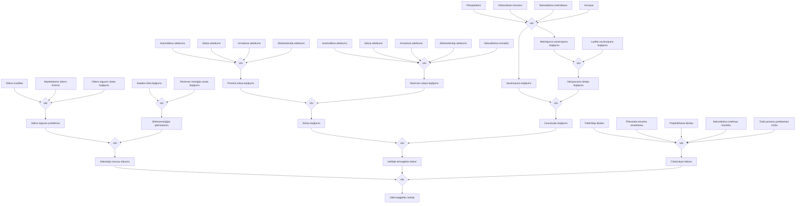

<!-- lpp. 208 -->

### 2. Riska scenārijs: Siltumapgādes sistēmas avārija

```mermaid
flowchart TD
    TOP["Siltumapgādes avārija"]
    GATE_TOP{"VAI"} --> TOP
    
    BRANCH1["Sākotnējo resursu trūkums"] --> GATE_TOP
    BRANCH2["Iekšējie tehnogēnie faktori"] --> GATE_TOP
    BRANCH3["Cilvēciskais faktors"] --> GATE_TOP
    
    %% Branch 1: Resursi
    G_B1{"VAI"} --> BRANCH1
    SUB1_1["Izejvielu piegādes pārtraukums (energoresursi)"] --> G_B1
    SUB1_2["Ūdens piegādes pārtraukums"] --> G_B1
    SUB1_3["Elektroenerģijas pārtraukums"] --> G_B1
    
    G_RES{"VAI"} --> SUB1_1
    R_INF["Bojāta piegādes infrastruktūra"] --> G_RES
    R_FIN["Naudas līdzekļu trūkums"] --> G_RES
    R_ORG["Organizatoriskās nepilnības"] --> G_RES
    
    G_WAT{"VAI"} --> SUB1_2
    W1["Ūdens kvalitāte"] --> G_WAT
    W2["Nepietiekams ūdens līmenis"] --> G_WAT
    W3["Ūdens ieguves vietas bojājums"] --> G_WAT
    
    G_EL{"UN"} --> SUB1_3
    EL1["Sadales tīkla bojājums"] --> G_EL
    EL2["Rezerves enerģijas avota bojājums"] --> G_EL
    
    %% Branch 2: Tehnogēnie faktori
    G_B2{"VAI"} --> BRANCH2
    SUB2_0["Siltumpatērējošo iekārtu atteikums"] --> G_B2
    SUB2_01["Siltumģenerējošo iekārtu atteikums"] --> G_B2
    SUB2_1["Sūkņu bojājums"] --> G_B2
    SUB2_2["Cauruļvadu bojājums"] --> G_B2
    
    G_PUMP{"UN"} --> SUB2_1
    P_PRIM["Primārā sūkņa bojājums"] --> G_PUMP
    P_REZ["Rezerves sūkņa bojājums"] --> G_PUMP
    
    G_PRIM{"VAI"} --> P_PRIM
    P1["Automātikas atteikums"] --> G_PRIM
    P2["Sūkņa atteikums"] --> G_PRIM
    P3["Armatūras atteikums"] --> G_PRIM
    P4["Elektrodzinēja atteikums"] --> G_PRIM
    
    G_REZ{"VAI"} --> P_REZ
    PR1["Automātikas atteikums"] --> G_REZ
    PR2["Sūkņa atteikums"] --> G_REZ
    PR3["Armatūras atteikums"] --> G_REZ
    PR4["Elektrodzinēja atteikums"] --> G_REZ
    PR5["Nekvalitatīva montāža"] --> G_REZ
    
    G_PIPE{"VAI"} --> SUB2_2
    PIPE_SAV["Savienojumu bojājums"] --> G_PIPE
    PIPE_DET["Neizjaucamo detaļu bojājums"] --> G_PIPE
    
    G_DET{"VAI"} --> PIPE_DET
    MET["Metinājuma savienojumu bojājums"] --> G_DET
    LOD["Lodēto savienojumu bojājums"] --> G_DET
    
    G_CAUSE{"VAI"} --> PIPE_SAV
    G_CAUSE --> MET
    C1["Pārspiediens"] --> G_CAUSE
    C2["Hidrauliskais trieciens"] --> G_CAUSE
    C3["Nekvalitatīva metināšana"] --> G_CAUSE
    C4["Korozija"] --> G_CAUSE
    
    %% Branch 3: Cilvēciskais faktors
    G_HUMAN{"VAI"} --> BRANCH3
    H1["Patērētāju kļūdas"] --> G_HUMAN
    H2["Plānveida remonta neveikšana"] --> G_HUMAN
    H3["Projektēšanas kļūdas"] --> G_HUMAN
    H4["Nekvalitatīva sistēmas montāža"] --> G_HUMAN
    H5["Trešo personu prettiesiska rīcība"] --> G_HUMAN
    H6["Nepietiekama tehniskā personāla kvalifikācija"] --> G_HUMAN
```

<!-- lpp. 209 -->

### 3. Riska scenārijs: Ēku un būvju sabrukšana

```mermaid
flowchart TD
    TOP["Ēku un būvju sabrukšana"]
    GATE_TOP{"VAI"} --> TOP
    
    BRANCH1["Ārējo faktoru iedarbība"] --> GATE_TOP
    BRANCH2["Tehnoloģisko procesu iedarbība"] --> GATE_TOP
    BRANCH3["Projektēšanas un būvniecības defektu iedarbība"] --> GATE_TOP
    BRANCH4["Ēku un būvju ekspluatācijas noteikumu neievērošana"] --> GATE_TOP
    
    %% Branch 1: Ārējie faktori
    G_B1{"VAI"} --> BRANCH1
    DABAS["Dabas faktori"] --> G_B1
    ANTRO["Antropogēnie faktori"] --> G_B1
    
    G_DAB{"VAI"} --> DABAS
    ATM["Atmosfēras (meteoroloģiskie):<br>Lietusgāzes, Vētra, Viesuļi, Sniegs, Apledojums, Temperatūra"] --> G_DAB
    KLIM["Klimatiskie faktori"] --> G_DAB
    GRUNT["Grunts faktori:<br>Grunts sasalšana, atkušana, gruntsūdens līmeņa celšanās/krišanās"] --> G_DAB
    SEISM["Seismiskie:<br>Zemestrīce, Zemes nogruvums"] --> G_DAB
    BIOL["Bioloģiskie faktori"] --> G_DAB
    
    G_ANT{"VAI"} --> ANTRO
    A_GAS["Gāzes apgādes sistēmas avārija"] --> G_ANT
    A_FIRE["Ugunsgrēks (Sprādziens / Aizdegšanās)"] --> G_ANT
    A_DAM["Dambju un hidrotehnisko būvju pārrāvumi"] --> G_ANT
    A_TR["Transporta avārija"] --> G_ANT
    A_TER["Terora akti"] --> G_ANT
    
    %% Branch 2: Tehnoloģiskie procesi
    G_B2{"VAI"} --> BRANCH2
    T1["Agresīvo komponentu izmantošana"] --> G_B2
    T2["Tehnoloģiskais piesārņojums"] --> G_B2
    T3["Mehāniskā iedarbība:<br>Vibrācija, Pārslodze, Sitieni"] --> G_B2
    
    %% Branch 3: Projektēšana un būvniecība
    G_B3{"VAI"} --> BRANCH3
    DEF1["Noturības un stingrības zaudējums:<br>• Nekvalitatīvi materiāli<br>• Kļūda slodzes aprēķinos<br>• Montāžas kļūda<br>• Materiālu novecošanās"] --> G_B3
    DEF2["Otrās šķiras elementu bojājumi"] --> G_B3
    
    %% Branch 4: Ekspluatācija
    G_B4{"VAI"} --> BRANCH4
    E1["Patērētāju kļūdas"] --> G_B4
    E2["Plānveida remonta neveikšana"] --> G_B4
    E3["Nekvalitatīvs remonts"] --> G_B4
    E4["Ekspluatācijas noteikumu neievērošana"] --> G_B4
    E5["Trešo personu prettiesiska rīcība"] --> G_B4
    E6["Nepietiekama personāla kvalifikācija"] --> G_B4
```

#### Ugunsgrēka izcelšanās un ēku sabrukuma cēloņsakarību detalizētais saraksts (shēmas 1.–55. notikums):
1. Nepareiza VUS glabāšana; 2. Gāzes noplūde; 3. VUS glabāšana un tvaiki; 4. Nenodzēsts uguns (sērkociņi); 5. Nenodzēsta cigarete; 6. Augstā temperatūra; 7. Dzirkstele no āmura sitiena; 8. Bērnu spēles ar uguni; 9. Nenodzēsts uguns (sērkociņi); 10. Nenodzēsta cigarete; 11. Īssavienojums; 12. Neizslēgts gludeklis; 13. Aizdegas: TV, radio, utt.; 14. Ugunsgrēks dēļ krāsns apkures; 15. Ugunsgrēks pirotehnikas izmēģinājuma rezultātā; 16. Zibens spēriens; 17. Tīša dedzināšana; 18. Neizslēgta iekārta; 19. Nav kārtībā caurules; 20. Ūdens vārīšanas procesā nodzēsts uguns; 21. Bērnu kļūda (atvēra krānu); 22. Nepareiza iekārtas pieslēgšana; 23. Nepareizs remonts; 33. Izolācijas bojājumi saistīti ar nodiluma savienojumu vietā; 34. Izolācijas bojājumi; 35. Īssavienojums, izmantojot metāla priekšmetu; 36. Slēgtas elektroinstalācijas bojājumi; 37. TV, radio vai citas iekārtas pārkaršana; 38. Sīko priekšmetu iekļūšana TV, utt.; 39. Nepareiza uzstādīšana; 40. Nepareiza pievienošana pie dūmvada; 41. Atstāta bez uzraudzības krāsns; 42. Pārsildīta krāsns; 43. Nepareiza glabāšana; 44. Bērni izmantoja pirotehniku mājā; 45. Ugunsgrēks apdrošināšanas dēļ; 46. Konkurence starp cilvēkiem; 47. Netīši aizdedzināts VUS; 48. Pārsildīšana; 49. Elektromontāžas laikā; 50. Remontējot telpas; 51. Bērni ielika naglu; 52. Nepareiza dakts izmantošana; 53. Neakurāti iesista nagla; 54. Neakurāti izurbts caurums; 55. Neakurāta rīcība remontdarbu laikā.

<!-- lpp. 210 -->

### 4. Riska scenārijs: Kanalizācijas sistēmas avārijas

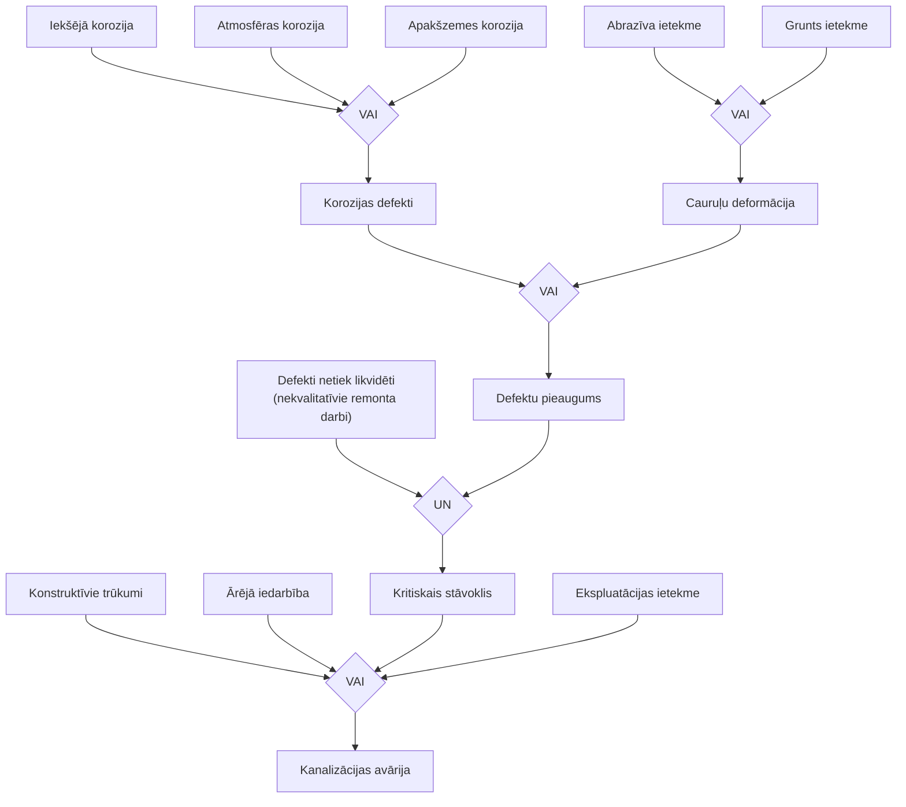

<!-- lpp. 211 -->

### Risku matemātiskās novērtēšanas aparāts un formulas

1. Avāriju gadījumu biežumu (intensitāti) noteikt nosacītajās vienībās gadā:

$$ \lambda = \frac{N}{t} \quad [1/\text{gads}] \qquad (\text{1. formula}) $$

*kur: $N$ – notikumu skaits, $t$ – periods gados.*

1.1. Nosacīta avārijas izcelšanās biežuma (intensitātes) vērtība uz infrastruktūras garumu:

$$ \lambda_{\text{nosacīti}} = \frac{\lambda}{L} \quad [1/(\text{km}\cdot\text{gads})] \qquad (\text{2. formula}) $$

*kur: $\lambda$ – avāriju intensitāte gadā, $L$ – tīkla/infrastruktūras kopējais garums kilometros.*

1.2. Avārijas risks nosaka avārijas notikumu biežumu gadā. Avārijas risku var noteikt, izmantojot tehniskā riska formulu – iespējamās avārijas plūsmas rādītāju;

1.3. Tehniskais risks ir kompleksais tehnisko elementu (tehnosfēras) drošības rādītājs:

$$ R_{\text{tehn.}} = \frac{n}{N \times \Delta t} \quad [\text{avārijas/objektu--gadi}] \qquad (\text{3. formula}) $$

*kur: $n$ – notikumu skaits, $N$ – ekspluatējamo objektu skaits, $\Delta t$ – periods gados.*

2. Individuālais risks nosaka cilvēka letālā iznākuma varbūtību gadā. Individuālais risks var būt apzināts, kad cilvēks apzināti pakļauj savu dzīvību apdraudējumam, kā arī piespiedu risks, kad cilvēks ir piespiests dzīvot nelabvēlīgos apstākļos. Kopumā individuālais risks tiek izteikts kā cietušo cilvēku skaits $n$ uz riskējošu cilvēku skaitu $N$ noteiktajā laikposmā:

$$ R_{\text{ind.}} = \frac{n}{N \times \Delta t} \quad [\text{vienības/gadā}] \qquad (\text{4. formula}) $$

*kur: $n$ – letālo iznākumu skaits, $N$ – iedzīvotāju skaits, $\Delta t$ – periods gados.*

<!-- lpp. 212 -->

3. Riska novērtējums ūdensvada sistēmas avārijām noteikts, pamatojoties uz liela mēroga avāriju biežumu (intensitāti) nosacītajās vienībās gadā, pamatojoties uz statistikas datiem 11 gados, un to veido:

$$ \lambda = \frac{N}{t} = \frac{17}{11} = 1{,}54 \quad [1/\text{gads}] \qquad (\text{5. formula}) $$

3.1. Aprēķinot prognozējamo liela mēroga avārijas gadījumu skaitu uz kopējo ūdensvada garumu Rīgā, kas veido 1465 km:

$$ \lambda_{\text{nosacīti}} = \frac{\lambda}{L} = \frac{1{,}54}{1465} = 1{,}05 \times 10^{-3} \quad [1/(\text{km}\cdot\text{gads})] \qquad (\text{6. formula}) $$

3.2. Papildus novērtējot ūdensvada sistēmas avāriju risku, konstatēts, ka avārijas situācijas ūdensvada sistēmā notiek ik dienu (vidēji reizi dienā), tādējādi īslaicīgi tiek ietekmēts neliels cilvēku skaits, tāpēc ūdensvada avārijas (2010. gadā pie Brasas tilta un 2015. gadā Berģos, uz Vidzemes šosejas) bija tādas, kurās tika pārsniegtas SIA “Rīgas ūdens” ikdienas spējas novērst notikuma postošos apstākļus bez papildu dienestu iesaistes;

3.3. Avārijas ūdensapgādes sistēmās risks ir vērtējams kā risks ar vidēju varbūtību un vidējām sekām – **vidējs risks**.

4. Riska novērtējums kanalizācijas sistēmas avārijām noteikts, pamatojoties uz liela mēroga gadījuma biežumu (intensitāti) nosacītajās vienībās gadā, pamatojoties uz statistikas datiem 11 gados, un to veido:

$$ \lambda = \frac{N}{t} = \frac{9}{11} = 0{,}81 \quad [1/\text{gads}] \qquad (\text{7. formula}) $$

4.1. Aprēķinot prognozējamo liela mēroga gadījuma skaitu uz kopējo kanalizācijas tīklu garumu Rīgā, kas veido 1183 km:

$$ \lambda_{\text{nosacīti}} = \frac{\lambda}{L} = \frac{0{,}81}{1183} = 6{,}85 \times 10^{-4} \quad [1/(\text{km}\cdot\text{gads})] \qquad (\text{8. formula}) $$

4.2. Avārijas kanalizācijas sistēmas risks ir vērtējams kā risks ar zemu varbūtību un vidējām sekām – **nozīmīgs risks**.

<!-- lpp. 213 -->

5. Riska novērtējums siltumtīkla sistēmas avārijām noteikts, pamatojoties uz liela mēroga avāriju gadījumu biežumu (intensitāti) nosacītajās vienības gadā, pamatojoties uz statistikas datiem deviņos gados, un to veido:

$$ \lambda = \frac{N}{t} = \frac{23}{9} = 2{,}55 \quad [1/\text{gads}] \qquad (\text{9. formula}) $$

5.1. Siltumtīklos Rīgā, kas veido 818 km, AS “Rīgas siltums” pārziņā esošo siltumtīklu garums ir 695,45 km:

$$ \lambda_{\text{nosacīti}} = \frac{2{,}55}{818} = 3{,}12 \times 10^{-3} \approx 10^{-3} \quad [1/(\text{km}\cdot\text{gads})] \qquad (\text{10. formula}) $$

5.2. Avārijas siltumapgādes sistēmas risks ir vērtējams kā risks ar zemu varbūtību un vidējām sekām – **nozīmīgs risks**.

6. Riska novērtējums ēku un būvju sabrukšanai veikts, pamatojoties uz iepriekšējo astoņu gadu statistikas datiem, kopumā Rīgā fiksēti (dažādi iemesli) 16 notikumi, kas izraisīja plaisas ēku konstrukcijās, kā arī ēku sabrukšanu ar cietušajiem un bojāgājušajiem, kopumā tehnisku risku ēku un būvju sabrukšanai veido:

$$ R_{\text{tehn.}} = \frac{16}{28456 \times 8} = 7{,}02 \times 10^{-5} \quad [\text{avārijas/gads}] \qquad (\text{11. formula}) $$

6.1. Kopumā novērtējot risku ēku un būvju sabrukšanas gadījumiem, sagaidāmo avāriju intensitāti veido:

$$ \lambda = \frac{16}{8} = 2 \quad [1/\text{gads}] \qquad (\text{12. formula}) $$

*šo avāriju rezultātā cilvēkiem būs nepieciešama evakuācija;*

6.2. Individuālo risku cilvēkam iet bojā ēku un būvju sabrukšanas gadījumā veido:

$$ R_{\text{ind.}} = \frac{55}{688631 \times 8} = 9{,}98 \times 10^{-6} \quad [\text{vienības/gadā}] \qquad (\text{13. formula}) $$
