# 3. E-pakalpojumu dzīvescikls un sadarbības procedūra

Sadarbības procedūra starp e-pakalpojuma turētāju (valsts/pašvaldības iestādi), programmatūras izstrādātāju un Valsts digitālās attīstības aģentūru (VDAA) ir standartizēta 4 posmu plūsmā.

```mermaid
graph TD
    A["1. Pieteikšanās un reģistrēšana"] --> B["2. Izstrāde un piegādes testa vidē"]
    B --> C["3. Akcepttestēšana un demonstrācija"]
    C --> D["4. Uzstādīšana un uzturēšana produkcijā"]
    
    subgraph Posms 1
        A1["Izvērtēšana (MK 402)"] --> A2["Reģistrācijas veidlapa v2 uz e-adresi"]
        A2 --> A3["VDAA piešķir EP ID un kontaktpersonu"]
        A3 --> A4["Testa vides un API tiesību pieteikumi"]
    end
    
    subgraph Posms 2
        B1["Izstrāde (SPA/MPA, vadlīnijas)"] --> B2["Piegāde uz Git/Nexus (piegades@vdaa.gov.lv)"]
        B2 --> B3["VDAA uzstāda testa vidē (10 d.d.)"]
        B3 --> B4["Iestādes un izstrādātāja testēšana"]
    end
    
    subgraph Posms 3
        C1["Akcepttestēšana (pozitīvie/negatīvie testi)"] --> C2["VDAA sagatavo auditpierakstus un pārskatu"]
        C2 --> C3["Demonstrācija VDAA 1. līmeņa atbalstam"]
        C3 --> C4["Akcepttestēšanas akta abpusēja parakstīšana"]
    end
    
    subgraph Posms 4
        D1["API tiesību atvēršana produkcijā"] --> D2["Pieprasījums produkcijas uzstādīšanai (10 d.d.)"]
        D2 --> D3["VIRSIS apraksta publikācija"]
        D3 --> D4["Uzturēšana: migrācija vismaz 1x gadā (limits 18 mēn.)"]
    end
```

---

## Posms 1: Pieteikšanās e-pakalpojuma izstrādei un reģistrēšana

### 1.1. Izvērtēšana un lēmuma pieņemšana
- Iestāde izvērtē pakalpojumu atbilstoši *MK noteikumu Nr. 402 "Valsts pārvaldes e-pakalpojumu noteikumi"* 3. punktam (pieprasījumu skaits, noslodze, lietderība).
- Pieņem lēmumu elektronizēt pakalpojumu un izpēta izvietošanas iespējas Latvija.gov.lv platformā.

### 1.2. E-pakalpojuma pieteikuma iesniegšana
- Iestāde aizpilda **"Veidlapu iestādēm jauna e-pakalpojuma reģistrēšanai Latvija.gov.lv portālā"** (`epak_registresanas_veidlapa_v2_0.docx`).
- **Iesniegšanas veids**: Nosūta uz VDAA oficiālo **e-adresi**.
- **Prasība**: Vēstulei un pielikumiem jābūt parakstītiem ar **drošu elektronisko parakstu un laika zīmogu**.

### 1.3. Reģistrācija VDAA un kontaktpersonas nozīmēšana
- VDAA reģistrē pakalpojumu un piešķir tam unikālu identifikatoru (piemēram, `EPXXX`).
- VDAA nozīmē atbildīgo e-pakalpojuma ieviešanas kontaktpersonu un paziņo to iestādei.

### 1.4. Tiesību pieprasīšana izstrādātājiem un testētājiem
- Iestāde aizpilda un ar drošu e-parakstu caur e-adresi nosūta VDAA:
  1. **Veidlapu par tiesību pieprasīšanu Testa videi** (izstrādātājiem un iestādes testētājiem);
  2. **Datu Ņēmēja veidlapu API Pārvaldniekam** (lai testa vidē piekļūtu citu reģistru servisiem).
- VDAA piešķir autorizācijas rekvizītus (Git, Nexus, WSO2 API Store u.c.).

---

## Posms 2: E-pakalpojuma izstrādes un nodevumu piegādes process

### 2.1. Vadlīniju izpēte un servisu saskaņošana
- Izstrādātājs un iestāde iepazīstas ar:
  - E-pakalpojumu arhitektūras vadlīnijām;
  - Portāla dizaina vadlīnijām un Storybook komponentēm;
  - Programmētāja rokasgrāmatu / ceļvedi;
  - API aprakstīšanas un publicēšanas vadlīnijām.
- Tiek apzināti nepieciešamie valsts reģistru API. Ja nepieciešams izmantot citas iestādes servisu, iestāde saskaņo to ar pakalpes pārzini.

### 2.2. Izstrāde
- Izstrāde notiek atbilstoši vienotajam dizainam un mikrosasvstarpējās integrācijas standartiem (BFF, REST, OAuth2).
- Tiek sagatavotas nepieciešamās iestādes tīmekļa pakalpes un reģistrētas VDAA API pārvaldniekā.

### 2.3. Pirmās piegādes veikšana
- Izstrādātājs iesniedz programmatūras nodevumu:
  - Pirmkods — VDAA Git serverī;
  - Instalācijas pakotne / Docker tēls — VDAA Nexus;
  - Helm konfigurācijas un piegādes metadati.
- Tiek nosūtīts e-pasts uz **`piegades@vdaa.gov.lv`** (un kopija iestādei un VDAA kontaktpersonai) vai pieteikums JIRA.
- **Pirmajā piegādē obligāti jāpievieno**: Aizpildīts **E-pakalpojuma apraksta šablons** (`EpakalpojumaAprakstsSablons.xlsx`) pakalpojuma reģistrācijai VISS katalogā.

### 2.4. Uzstādīšana testa vidē (SLA: 10 darbdienas)
- VDAA **10 darbdienu laikā** no korekta pieteikuma saņemšanas uzstāda pakotni testa vidē.
- No `piegades@vdaa.gov.lv` tiek nosūtīts paziņojums par gatavību testēšanai.

### 2.5. Testēšana testa vidē
- Iestāde un izstrādātājs pārbauda pakalpojuma darbību, servisu integrāciju un kļūdu apstrādi.
- Ja konstatētas kļūdas, izstrādātājs veic labojumus un atkārtotu piegādi.

---

## Posms 3: Akcepttestēšana un pārbaude pirms produkcijas

### 3.1. Akcepttestēšanas scenāriju izpilde
- Kad testēšana ir sekmīga, iestāde organizē formālo akcepttestēšanu.
- Tiek vairākkārt izpildīti gan **pozitīvie**, gan **negatīvie** biznesa scenāriji.
- Iestāde nosūta VDAA informāciju par konkrētu laika periodu (datums un stundas), kurā veikta akcepttestēšana.

### 3.2. Auditpierakstu pārbaude un atbilstības pārskats
- VDAA kontaktpersona sagatavo auditpierakstus par norādīto periodu.
- VDAA veic e-pakalpojuma tehnisko, arhitektūras un dizaina auditu un sagatavo **"Pārskatu par e-pakalpojuma atbilstību vadlīnijām"** (pārbaudot blokus no A līdz K):
  - Ja konstatēti **nebūtiski trūkumi (*)**, pakalpojumu var virzīt tālāk, bet trūkumi jānovērš;
  - Ja konstatēti **būtiski trūkumi (****)**, pakalpojums tiek apturēts, un izstrādātājam jāveic labojumi.

### 3.3. Demonstrācija VDAA 1. līmeņa atbalsta dienestam
- Lai VDAA zvanu centrs un atbalsta personāls varētu atbildēt uz iedzīvotāju jautājumiem, iestādes pārstāvis veic **e-pakalpojuma darbības demonstrāciju testa vidē**.
- Demonstrācijas laikā tiek izskaidroti biznesa procesi, biežākie jautājumi un kļūdu scenāriji.
- Ja demonstrācijā atklājas neatbilstības, iestādei tās jānovērš.

### 3.4. Akcepttestēšanas akta parakstīšana
- VDAA sagatavo Akcepttestēšanas aktu.
- Iestādes un VDAA pilnvarotās amatpersonas savstarpēji saskaņo un **paraksta aktu ar drošu e-parakstu**.

---

## Posms 4: Uzstādīšana un darbināšana produkcijas vidē

### 4.1. Produkcijas API piekļuves tiesību atvēršana
- Iestāde pieprasa servisu pārziņiem piekļuvi datu pakalpēm produkcijas vidē.
- Pēc servisu pārziņu apstiprinājuma VDAA atver attiecīgos tīkla maršrutus un WSO2 API pieslēgumus.

### 4.2. Pieprasījums par uzstādīšanu produkcijā
Pēc akta parakstīšanas iestāde nosūta oficiālu pieprasījumu uz **`piegades@vdaa.gov.lv`** un VDAA kontaktpersonai, pievienojot pilnu nodevuma komplektu:
1. Pirmkodu (Git) un izpildkodu / instalācijas pakotni (Nexus);
2. E-pakalpojuma lietošanas instrukciju, aprakstu un noteikumus;
3. Tehnisko dokumentāciju (programmatūras prasību specifikācija un projektējuma apraksts);
4. Apliecinājumu, ka pakalpojuma kartīte ir sagatavota un apstiprināta **VIRSIS** katalogā.

### 4.3. Uzstādīšana produkcijā (SLA: 10 darbdienas)
- VDAA **10 darbdienu laikā** uzstāda e-pakalpojumu produkcijas Kubernetes klasterī.
- Iestāde veic gala pārbaudi produkcijā. Pakalpojums kļūst publiski pieejams Latvija.gov.lv lietotājiem.

### 4.4. E-pakalpojuma ekspluatācija un regulāra uzturēšana
- **1. līmeņa atbalsts**: Nodrošina VDAA (konsultē lietotājus, pieņem kļūdu pieteikumus).
- **2. un 3. līmeņa atbalsts**: Nodrošina iestāde un tās izstrādātājs.
- **Obligātais veidņu migrācijas noteikums**:
  - Par e-pakalpojumu atbildīgajai iestādei ir pienākums sekot līdzi aktuālajām e-pakalpojumu veidnēm un **vismaz reizi gadā** veikt pakalpojuma migrāciju uz jaunāko veidnes versiju.
  - Ja VDAA pārbaudē konstatē, ka e-pakalpojuma veidnes versijas atpalicība no aktuālās **pārsniedz 18 mēnešus**, VDAA pieņem lēmumu par e-pakalpojuma **atpublicēšanu no portāla**, informējot iestādi, līdz atjauninājums tiek ieviests.
