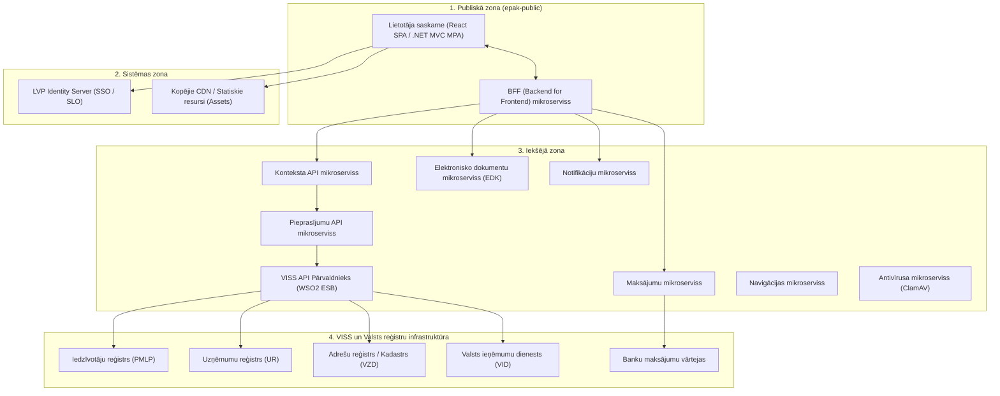

# 4. Tehniskā arhitektūra un koplietošanas komponentes

Valsts vienotā e-pakalpojumu platforma balstās uz **mikroservisu arhitektūru**, **Linux bāzes Docker konteinerizāciju** un **Kubernetes** orķestrāciju, nodrošinot augstu pieejamību, neatkarīgu mērogošanu un standartizētu integrāciju ar VISS (Valsts informācijas sistēmu savietotāju).

---

## 4.1. Platformas zonu arhitektūra

E-pakalpojumu infrastruktūra ir sadalīta 4 loģiskajās zonās:

1. **Publiskā zona (`epak-public`)**:
   - Satur e-pakalpojuma priekšgalu (React SPA vai .NET Core MVC) un aizmugursistēmas fasādi (BFF — *Backend For Frontend*).
   - Katrs e-pakalpojums darbojas kā viens vai vairāki neatkarīgi Linux bāzes Docker konteineri.
2. **Sistēmas zona**:
   - Centralizētie koplietošanas servisi: LVP Identity Server (autentifikācija, SSO, SLO) un kopējie statiskie resursi (CSS, JS, fonti, attēli).
3. **Iekšējā zona**:
   - E-pakalpojumu platformas pamatfunkcionalitāte: Konteksta API, Pieprasījumu API, API Pārvaldnieks (WSO2), kā arī specializētie mikroservisi (EDK, Maksājumi, Paziņojumi).
4. **VISS un LVP infrastruktūra**:
   - Ārējās valsts informācijas sistēmas, reģistri un maksājumu adapteri. Tiešā veidā no e-pakalpojuma frontend netiek saukti.

---

## 4.2. BFF šablons un servisu prasības

- **Backend For Frontend (BFF)** ir obligāts starpslānis starp lietotāja pārlūku un iekšējiem servisiem.
- **Bezstāvokļa princips (*Stateless*)**: BFF servisiem jābūt bez iekšējā stāvokļa. Ja nepieciešams uzglabāt sesijas datus starp soļiem, jāizmanto platformas **Konteksta mikroserviss** (`LvpContext.SessionProperties`).
- **REST JSON standarts**: Visiem jaunajiem servisiem jābūt realizētiem kā JSON REST ar OpenAPI 3.0 specifikācijas aprakstu.
- **Drošības slānis**: Visām saskarnēm jābūt aizsargātām ar OAuth 2.0.

---

## 4.3. Autentifikācijas un talonu apmaiņas mehānisms

Lietotāju autentifikāciju nodrošina `Lvp.Portal.IdentityServer` (LVP IDS), izmantojot **OpenID Connect (OIDC)** *authorization code grant* plūsmu ar PKCE.

### Talonu apmaiņas soļi datu pieprasījumā:
1. Lietotājs autorizējas caur Latvija.gov.lv (ar eParaksts, Smart-ID, eID karti vai internetbanku).
2. Pārlūks saņem **IDS OAuth2 Reference Token** (atsauces talonu).
3. BFF (vai frontend caur BFF) vēršas pie **Konteksta API mikroservisa**, nododot šo atsauces talonu.
4. **Konteksta API** veic talona apmaiņu pret pilnu **IDS OAuth2 JWT talonu**.
5. Konteksta API vēršas pie **Pieprasījumu mikroservisa**, kas veic IDS talona apmaiņu pret **PFAS AUTH drošības talonu** (Valsts informācijas sistēmu savietotāja pilnvaru un autentifikācijas serviss).
6. Pieprasījumu mikroserviss izsauc **API Pārvaldniekā (WSO2)** reģistrēto datu devēja servisu, pārbaudot piešķirtos tvērumus (*scopes*) un abonementus.
7. Datu serviss atgriež pieprasītos datus caur drošo kanālu.

### Atbalstītie lietotāju tipi un `NameIdentifier` formāti:
Visi lietotāji platformā tiek identificēti ar URN formātu `urn:ivis:100001:name.id-viss`:

| Lietotāja tips | Identifikatora piemērs | Apraksts |
| :--- | :--- | :--- |
| **Iedzīvotājs** | `PK:10098610000` | Fiziska persona ar personas kodu |
| **Iestādes darbinieks** | `AU:100001-PK:10098610000` | Iestādes kods no VISS klasifikatora + personas kods |
| **Uzņēmuma paraksttiesīgā persona** | `PK:07017010000-UR:40003627089` | Personas kods + Uzņēmuma reģistrācijas numurs |
| **Sistēma (mašīna-mašīna)** | `AU:100001` | Iestādes/sistēmas identifikators |
| **Pilnvarots iedzīvotājs** | `DP:01127612344-PK:07017010000` | Pilnvarotā PK (`DP`) + pārstāvamās personas PK |
| **Pilnvarots uzņēmuma vārdā** | `DP:40003627089-PK:07017010000` | Uzņēmuma reģ. nr. (`DP`) + pilnvarotās personas PK |

---

## 4.4. Standartizētā URN sintakse (RFC 4619)

VISS ekosistēmā resursu, servisu un transakciju identificēšanai tiek izmantota vienota URN shēma:

- **E-pakalpojuma identifikators**:
  `URN:IVIS:100001:EP.<portals>-<nosaukums>-v<Major>-<Minor>`
  *Piemērs*: `URN:IVIS:100001:EP.VISS-AuthorityEService-v1-3`
- **Pieturpunkta (Milestone) identifikators**:
  `URN:IVIS:<AuthorityID>:EP-<nosaukums>-v<Major>-<Minor>-MS-<MilestoneID>`
  *Piezīme*: `MilestoneID` garums nedrīkst pārsniegt **15 simbolus**.
  *Piemērs*: `URN:IVIS:100001:EP-EP00-v1-3-MS-GetDeclPersList`
- **Konkrētas instances (transakcijas) identifikators**:
  `URN:IVIS:100001:EP-<nosaukums>-v<Major>-<Minor>-TR-<TransactionID>`
  *Piemērs*: `URN:IVIS:100001:EP-EP00-v1-3-TR-123`
- **IS servisa identifikators**:
  `URN:IVIS:100001:ISS-<Ident>-<nosaukums>-v<Major>-<Minor>`
  *Piemērs*: `URN:IVIS:100001:ISS-TM.VVDZ-GetPersonEstateList-v3-1`
- **XML shēmas identifikators**:
  `URN:IVIS:100001:XSD-<Namespace>-<ShortName>-v<Major>-<Minor>`

---

## 4.5. Koplietošanas moduļu integrācija

### 1. Pieturpunkti (*Milestones*)
- E-pakalpojuma izpilde jāsadala skaidros pieturpunktos:
  - Vismaz viens sākuma pieturpunkts (`start`);
  - Vismaz viens beigu pieturpunkts (`finish`);
  - Starpposmu pieturpunkti nozīmīgu biznesa stāvokļu fiksēšanai.
- Šie dati tiek izmantoti statistikai un atspoguļoti iedzīvotājam Latvija.gov.lv sadaļā **"Izpildītie e-pakalpojumi"** (KDV).

### 2. Elektronisko dokumentu krātuve (EDK)
- Paredzēta lielu datņu un juridisku dokumentu glabāšanai, lai nepārslogotu tiešsaistes REST pieprasījumus.
- Bāzēta uz **CMIS** (*Content Management Interoperability Services*) standartu.
- Hierarhiska mapju struktūra:
  - `/Pop/Lv/{pk_dala}/{pk_dala}/{pk_beigas}/LVP/{URN_Transakcija}/In/{GGGGMMDD}/{fails}.pdf`
  - Uzņēmumiem: `/Bus/LV/{reg_nr_dala}/...`
  - Iestādēm: `/Ath/{iestades_kods}/...`
- Ja dokuments jārāda lietotāja kopsavilkumā portālā, tas jāiekļauj apakšmapē `KDVShortList/In` vai `KDVShortList/Out`.

### 3. VISS Maksājumu modulis
- Nodrošina valsts nodevu un pakalpojumu apmaksu ar banku kartēm, internetbankām (BankLink) vai Valsts kasi.
- Realizētās Konteksta API metodes:
  - Maksāšanas pieprasījuma izveidošana;
  - Statusa pārbaude un apmaksas veida izgūšana;
  - Rēķina ģenerēšana.

### 4. Adrešu meklēšanas komponente (AMK)
- Standartizēta lietotāja saskarnes vadīkla, kas meklē un validē adreses tieši Valsts adrešu reģistrā.
- E-pakalpojumam atgriež strukturētus datus (adrese, AR kods, koordinātas).

### 5. Ģeolatvija iegultā karte
- Interaktīva Ģeoportāla karte ar JavaScript API integrāciju:
  - `ZoomToPoint(x, y)` — iecentrēšana;
  - `ShowMarkers(markers)` — marķieru attēlošana;
  - `onMapClick`, `onMarkerClick`, `onAddressClick` — notikumu apstrāde.

### 6. Paziņojumu serviss (*Notifications*)
- Paziņojumi uz e-adresi, e-pastu vai portāla lietotāja darba vietu (KDV).
- Ziņojumu veidošanai izmanto **XSLT 1.0** standartizētās transformācijas, kas definētas VISS resursu katalogā.

### 7. Datņu vīrusu skenēšana (ClamAV integrācija)
- Ja pakalpojumā tiek augšupielādēti lietotāja faili, tie obligāti jāskenē ar ietvarā pieejamo ClamAV servisu.
- **Svarīga piezīme par drošību**:
  - ClamAV ir statisks parakstu skeneris. Tas neaizvieto dinamisku smilškastes analīzi.
  - Izstrādātājam jānodrošina papildu satura pārbaudes: failu paplašinājumu un patieso MIME tipu validācija, arhīvu dziļuma ierobežošana un makrosu bloķēšana biroja dokumentos.

---

## 4.6. Veiktspējas standarti (SLA)

| Parametrs | Prasība | Rīcība neatbilstības gadījumā |
| :--- | :--- | :--- |
| **Sinhronā servisa atbildes laiks** | **≤ 3 sekundes** | Ja process ilgāks, jāpārveido par asinhronu apstrādi ar statusa aptauju |
| **Pārsūtāmā datu pakotne (API)** | **≤ 4 MB** | Ja apjoms pārsniedz 4 MB, obligāti jāizmanto Elektronisko dokumentu krātuve (EDK) |
| **Sarakstu lapošana (*Pagination*)** | **Server-side pagination** | Sarakstiem obligāti jānodrošina lapošana servera pusē (OData vai parametri: `pageNumber`, `startRecord`, `endRecord`, `totalCount`) |
| **Klienta renderēšana** | Mobilajās ierīcēs bez aiztures | Resursu minimizēšana, attēlu optimizācija, CDN izmantošana |
